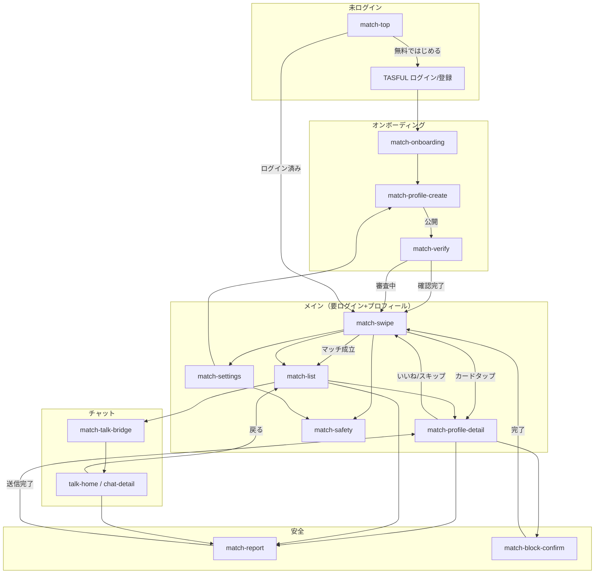

# TASFUL MATCH — 恋愛・婚活マッチング MVP 画面設計書

| 項目 | 内容 |
|------|------|
| 版 | v0.1（設計のみ・未実装） |
| 作成日 | 2026-06-21 |
| ステータス | 画面構成設計 / DB案 / MVP切り分け |
| 対象 | スマホ最優先（390px基準）・PCは拡張 |

---

## 1. サービス概要

### 1.1 コンセプト

| 柱 | 内容 |
|----|------|
| 安心して使える | 本人確認・通報・ブロック・AI監視を標準装備 |
| 基本無料 | スワイプ・マッチ・チャット開始は無料 |
| 広告で利用可能 | バナー / インタースティシャル（頻度制限） |
| 必要な機能のみ課金 | いいね追加・ブースト等はオプション |
| 本人確認重視 | プロフィール公開前に eKYC または簡易確認 |
| AI監視あり | プロフィール・チャット送信前にモデレーション |
| TASFUL TALK連携 | マッチ成立後の1対1チャットは既存 TALK 基盤を利用 |

### 1.2 プロダクト名（仮）

**TASFUL MATCH**（恋愛・婚活マッチング）

- URL プレフィックス案: `/match/`
- 会員基盤: 既存 TASFUL 会員 ID（`auth-current-user.js` / Supabase Auth）を流用
- チャット基盤: `talk-home.html` → `chat-detail.html`（`room_type = match` で区別）

### 1.3 デザイン方針

| 項目 | 方針 |
|------|------|
| レイアウト | スマホ最優先（390px）。タップル系カードスワイプ UI |
| カラー | ダークモード基調（`#0c0f1d` 系 — Builder / TALK と同系統） |
| アクセント | ローズピンク `#f472b6` + TASFUL シアン `#00f2fe`（CTA・マッチ演出） |
| タイポ | Noto Sans JP（既存共通） |
| コンポーネント | `dash-*` / `chat-*` / `tasu-common-breadcrumb` の命名・余白規則を踏襲 |
| ナビ | 下部タブバー（TOP / スワイプ / マッチ / 設定） |

---

## 2. 画面一覧

### 2.1 MVP 対象画面（6グループ + 補助）

| # | 画面ID | 画面名 | パス（案） | 優先度 | 概要 |
|---|--------|--------|------------|--------|------|
| 1 | `match-top` | マッチングTOP | `/match/` | MVP | 未登録・未ログイン向け LP + 登録CTA |
| 2 | `match-onboarding` | 初回オンボーディング | `/match/onboarding` | MVP | 利用規約・安心ポイント・本人確認の案内 |
| 3 | `match-profile-create` | プロフィール作成 | `/match/profile/create` | MVP | 必須項目入力（ステップ形式） |
| 4 | `match-profile-edit` | プロフィール編集 | `/match/profile/edit` | MVP | 作成画面と同一フォーム（編集モード） |
| 5 | `match-verify` | 本人確認 | `/match/verify` | MVP | 確認ステータス表示・外部 eKYC 導線 |
| 6 | `match-swipe` | スワイプ | `/match/swipe` | MVP | メイン探索画面（カード UI） |
| 7 | `match-profile-detail` | 相手プロフィール詳細 | `/match/profile/:id` | MVP | スワイプカードタップ / マッチ一覧から |
| 8 | `match-list` | マッチ一覧 | `/match/matches` | MVP | 相互いいね済みユーザー |
| 9 | `match-talk-bridge` | チャット接続 | `/match/talk/:matchId` | MVP | TASFUL TALK ルーム生成・リダイレクト |
| 10 | `match-report` | 通報 | `/match/report/:userId` | MVP | 理由選択 + 自由記述 |
| 11 | `match-block-confirm` | ブロック確認 | モーダル | MVP | プロフィール詳細・チャット導線から |
| 12 | `match-settings` | 設定 | `/match/settings` | MVP | 通知・ブロック一覧・退会 |
| 13 | `match-safety` | 安心・安全の説明 | `/match/safety` | MVP | TOP からリンク。ポリシー要約 |

### 2.2 将来画面（MVP 外）

| 画面ID | 画面名 | 備考 |
|--------|--------|------|
| `match-premium` | 有料プラン | いいね無制限・ブースト・シークレットモード |
| `match-ad-reward` | 広告視聴リワード | 追加いいね付与 |
| `match-filters` | 詳細検索フィルタ | 年齢・距離・趣味タグ |
| `match-icebreaker` | AI 会話スターター | マッチ直後の提案文 |
| `match-date-plan` | デート提案 | カレンダー連携 |
| `match-admin-review` | 運営審査 | 通報キュー・AI フラグ対応 |
| `match-analytics` | インサイト | マッチ率・返信率（本人のみ） |

---

## 3. 画面構成詳細

### 3.1 ① マッチングTOP（`match-top`）

**目的:** サービス理解 → 安心訴求 → 無料登録

```
┌─────────────────────────────┐
│ [TASFUL]          [ログイン] │  ← 固定ヘッダー（透明）
├─────────────────────────────┤
│                             │
│   ヒーロー画像 / イラスト      │
│   「安心して、出会える。」      │
│   サブコピー（基本無料）        │
│                             │
├─────────────────────────────┤
│ ■ 3つの安心                  │
│  [本人確認] [AI監視] [通報対応] │  ← アイコンカード横スクロール
├─────────────────────────────┤
│ ■ 使い方（3ステップ）           │
│  1.プロフィール 2.スワイプ 3.トーク │
├─────────────────────────────┤
│ ■ 料金の考え方                 │
│  基本無料 / 広告あり / 必要時のみ課金 │
├─────────────────────────────┤
│ [無料ではじめる]  ← primary CTA │
│ [安心・安全について]            │
├─────────────────────────────┤
│ フッター（利用規約・プライバシー）  │
└─────────────────────────────┘
```

| ブロック | 要素 |
|----------|------|
| ヒーロー | キャッチコピー・無料バッジ・ダークグラデ背景 |
| 安心訴求 | 本人確認済みバッジ・AI監視・24h通報対応（文言は法務確認後確定） |
| 料金 | 「スワイプ・マッチ・チャット開始は無料」 |
| CTA | 未ログイン → 会員登録 / ログイン。ログイン済み → オンボーディング or スワイプ |
| 広告枠（将来） | ヒーロー下バナー（MVP はプレースホルダ非表示可） |

---

### 3.2 ② プロフィール作成（`match-profile-create`）

**形式:** 4ステップウィザード（プログレスバー上部固定）

| Step | 項目 | 入力形式 | 必須 |
|------|------|----------|------|
| 1 | ニックネーム | テキスト 1〜20文字 | ○ |
| 1 | 性別 | 男性 / 女性 / その他 / 非公開 | ○ |
| 1 | 生年月日 | 日付ピッカー（18歳未満は登録不可） | ○ |
| 2 | 居住地 | 都道府県 + 市区町村（任意詳細） | ○ |
| 3 | 自己紹介 | テキストエリア 0〜500文字 | △（推奨） |
| 3 | 趣味 | タグ選択（最大5）+ 自由入力1 | △ |
| 4 | 写真 | メイン1枚必須 + サブ最大4枚 | メイン○ |

```
Step 4 レイアウト:
┌─────────────────────────────┐
│ ← プロフィール作成  (4/4)      │
├─────────────────────────────┤
│  [ メイン写真 + ]              │  ← 大きい枠
│  [サブ] [サブ] [サブ] [サブ]    │  ← 小枠グリッド
├─────────────────────────────┤
│ ※ 顔がわかる写真を推奨          │
│ ※ AIが不適切画像を検出します     │
├─────────────────────────────┤
│ [プレビュー]  [公開する]        │
└─────────────────────────────┘
```

**バリデーション（MVP）**

- 生年月日 → 18歳以上
- 写真 → 形式 jpg/png、5MB以下、AI画像チェック（`chat-moderation` 相当の差し込み口）
- 自己紹介 → NGワード・連絡先検出（送信前モデレーション）

**本人確認ゲート**

- プロフィール「公開」押下後 → `match-verify` へ誘導（未確認の場合）
- 確認完了までスワイプ画面は「確認待ち」オーバーレイ

---

### 3.3 ③ スワイプ画面（`match-swipe`）

**UI:** タップル系フルスクリーンカード

```
┌─────────────────────────────┐
│ ロゴ    [フィルタ] [残いいね]   │  ← 簡易ヘッダー
├─────────────────────────────┤
│                             │
│    ┌───────────────────┐    │
│    │                   │    │
│    │   プロフィール写真   │    │  ← カード（角丸・シャドウ）
│    │                   │    │
│    │ ニックネーム 25歳    │    │
│    │ 📍 東京都          │    │
│    │ 趣味タグ           │    │
│    │ 自己紹介（2行省略）   │    │
│    └───────────────────┘    │
│                             │
├─────────────────────────────┤
│   [✕ スキップ]  [♥ いいね]   │  ← 大きな丸ボタン
│         [ℹ 詳細]            │
├─────────────────────────────┤
│ [TOP][スワイプ][マッチ][設定]  │  ← 下部タブ（スワイプ=active）
└─────────────────────────────┘
```

| 操作 | 挙動 |
|------|------|
| 右スワイプ / ♥ | いいね送信。相互ならマッチ成立モーダル |
| 左スワイプ / ✕ | スキップ（再表示なし） |
| カードタップ | `match-profile-detail` へ |
| いいね上限 | MVP: 1日10件（超過時は広告視聴 or 課金導線・将来） |
| 空状態 | 「今日のおすすめは終了」+ 明日再開 or フィルタ緩和案内 |

**マッチ成立モーダル**

```
「マッチしました！」
[相手アイコン] × [自分アイコン]
[メッセージを送る] → match-talk-bridge
[あとで]
```

---

### 3.4 ④ マッチ一覧（`match-list`）

```
┌─────────────────────────────┐
│ マッチ              [編集]   │
├─────────────────────────────┤
│ ┌────┐ さくら  2時間前        │
│ │img │ 新しいメッセージ…  ●   │  → タップで TALK
│ └────┘                      │
│ ┌────┐ ゆうき  昨日          │
│ │img │ よろしくお願いします    │
│ └────┘                      │
├─────────────────────────────┤
│ 新しいマッチ (未チャット)      │
│ ┌────┐ はると               │
│ │img │ [メッセージを送る]     │
│ └────┘                      │
└─────────────────────────────┘
```

| 要素 | 仕様 |
|------|------|
| ソート | 最終メッセージ日時降順 |
| 未読バッジ | TALK 側の `unreadCount` を表示 |
| 長押し / ⋮ | 通報・ブロック・マッチ解除（将来） |
| 空状態 | 「まだマッチがありません」+ スワイプへ CTA |

---

### 3.5 ⑤ チャット導線（`match-talk-bridge` + TASFUL TALK）

**方針:** マッチング専用 UI は作らず、既存チャット基盤を再利用する。

```
match-list / マッチモーダル
        │
        ▼
match-talk-bridge  （中継・ルーム確保のみ）
        │
        ├─ match_rooms にレコード作成（未作成時）
        ├─ talk_thread_id を TALK に紐付け
        └─ 302 → talk-home.html?thread={id}
                 または chat-detail.html?room={id}
```

| 項目 | 仕様 |
|------|------|
| ルーム種別 | `room_type: "match"`（取引チャットと分離） |
| 参加者 | マッチ双方のみ（RLS で強制） |
| AI監視 | 既存 `chat-moderation.js` + `moderateMessage()` を適用 |
| 初回メッセージ | マッチ直後はテンプレ提案（将来: AI icebreaker） |
| 戻る導線 | チャットヘッダー「← マッチ」→ `match-list` |

**TALK サイドバー（将来）**

- `talk-home` に「マッチング」タブまたはバッジ連携を追加（MVP は deep link のみでも可）

---

### 3.6 ⑥ 通報・ブロック導線

**入口（MVP）**

| 入口 | 操作 |
|------|------|
| プロフィール詳細 | ⋮ メニュー → 通報 / ブロック |
| マッチ一覧 | 長押し or ⋮ |
| チャット画面 | 既存チャットメニューに「通報」「ブロック」を追加（`room_type=match` 時） |

**通報画面（`match-report`）**

```
理由（単一選択）:
  □ 不適切な写真・プロフィール
  □ 迷惑行為・ハラスメント
  □ 業者・勧誘
  □ なりすまし
  □ その他

詳細（任意）: [テキストエリア]

[送信する]
```

**ブロック確認（モーダル）**

```
「{nickname}さんをブロックしますか？」
・メッセージの送受信ができなくなります
・お互いに表示されなくなります

[キャンセル]  [ブロックする]
```

| 処理 | 内容 |
|------|------|
| ブロック | `match_blocks` 插入。スワイプ候補から除外。TALK ルームは `archived` |
| 通報 | `match_reports` 插入。運営キュー（MVP は DB + メール通知） |
| AI連携 | 通報時に直近メッセージ・プロフィールを AI スコアと紐付け保存 |

---

## 4. 画面遷移図



### 4.1 下部タブバー（ログイン後常駐）

| タブ | 遷移先 | アイコン |
|------|--------|----------|
| TOP | `match-top`（または簡易ダッシュ） | ホーム |
| スワイプ | `match-swipe` | カード |
| マッチ | `match-list` | ハート（未読バッジ） |
| 設定 | `match-settings` | 歯車 |

※ MVP では TOP タブは `match-swipe` に統合し、3タブ（スワイプ / マッチ / 設定）でも可。

---

## 5. DB テーブル案（Supabase / PostgreSQL）

### 5.1 コアテーブル（MVP）

#### `match_profiles`

| カラム | 型 | 説明 |
|--------|-----|------|
| id | uuid PK | |
| user_id | uuid FK → auth.users | TASFUL 会員と 1:1 |
| nickname | text | 表示名 |
| gender | text | `male` / `female` / `other` / `private` |
| birth_date | date | 年齢は算出 |
| prefecture | text | 都道府県 |
| city | text | 市区町村（nullable） |
| bio | text | 自己紹介 |
| main_photo_url | text | メイン写真 |
| sub_photo_urls | text[] | サブ写真（最大4） |
| hobby_tags | text[] | 趣味タグ |
| verification_status | text | `none` / `pending` / `verified` / `rejected` |
| profile_status | text | `draft` / `active` / `suspended` |
| last_active_at | timestamptz | |
| created_at | timestamptz | |
| updated_at | timestamptz | |

**RLS:** 本人は全カラム更新可。他者は `active` かつブロック・通報で非表示のユーザーのみ SELECT（スワイプ用ビュー経由）。

---

#### `match_swipes`

| カラム | 型 | 説明 |
|--------|-----|------|
| id | uuid PK | |
| swiper_id | uuid FK → match_profiles | |
| target_id | uuid FK → match_profiles | |
| action | text | `like` / `skip` |
| created_at | timestamptz | |

**制約:** `(swiper_id, target_id)` UNIQUE。1日いいね上限はアプリ層 or DB 関数で集計。

---

#### `match_pairs`

| カラム | 型 | 説明 |
|--------|-----|------|
| id | uuid PK | |
| user_a_id | uuid | 辞書順小さい user_id |
| user_b_id | uuid | 辞書順大きい user_id |
| matched_at | timestamptz | |
| talk_thread_id | text | TALK / chat ルーム ID |
| status | text | `active` / `unmatched` / `blocked` |

**制約:** `(user_a_id, user_b_id)` UNIQUE。相互いいね成立時に INSERT。

---

#### `match_blocks`

| カラム | 型 | 説明 |
|--------|-----|------|
| id | uuid PK | |
| blocker_id | uuid FK | |
| blocked_id | uuid FK | |
| created_at | timestamptz | |

---

#### `match_reports`

| カラム | 型 | 説明 |
|--------|-----|------|
| id | uuid PK | |
| reporter_id | uuid FK | |
| reported_id | uuid FK | |
| reason_code | text | |
| detail | text | |
| context_type | text | `profile` / `chat` / `swipe` |
| context_id | text | ルームID等 |
| status | text | `open` / `reviewing` / `closed` |
| ai_flags | jsonb | AIスコア・検出理由 |
| created_at | timestamptz | |

---

#### `match_verifications`

| カラム | 型 | 説明 |
|--------|-----|------|
| id | uuid PK | |
| user_id | uuid FK | |
| provider | text | `manual` / `ekyc_vendor` |
| status | text | `pending` / `approved` / `rejected` |
| submitted_at | timestamptz | |
| reviewed_at | timestamptz | |
| metadata | jsonb | 外部ID・審査結果 |

---

#### `match_moderation_logs`

| カラム | 型 | 説明 |
|--------|-----|------|
| id | uuid PK | |
| user_id | uuid | |
| content_type | text | `profile_bio` / `profile_photo` / `chat_message` |
| content_ref | text | |
| level | text | `ok` / `warning` / `blocked` |
| reasons | text[] | |
| created_at | timestamptz | |

※ 既存 `chat-moderation.js` の結果を非同期で記録。

---

### 5.2 補助テーブル（MVP 軽量 or 将来）

| テーブル | MVP | 用途 |
|----------|-----|------|
| `match_hobby_tags` | マスタのみ | 趣味タグ一覧 |
| `match_daily_limits` | ○ | 日次いいね残数 |
| `match_ads_impressions` | △ | 広告表示ログ |
| `match_subscriptions` | × | 有料プラン |
| `match_boosts` | × | プロフィールブースト |

---

### 5.3 既存テーブルとの関係

```
auth.users (TASFUL会員)
    └── match_profiles (1:1)
            ├── match_swipes
            ├── match_pairs ──→ transaction_rooms / talk threads
            ├── match_blocks
            └── match_verifications

transaction_rooms (既存)
    └── room_type = 'match'  ← 新規値追加
    └── match_pairs.talk_thread_id で参照
```

---

## 6. MVP と将来機能の切り分け

### 6.1 MVP（Phase 1）— 出会いの最小ループ

| 領域 | 含む | 含まない |
|------|------|----------|
| 登録 | TASFUL 既存ログイン流用 | マッチ専用ソーシャルログイン |
| プロフィール | 必須7項目 + 写真1枚 | 動画・音声・詳細質問 |
| 本人確認 | ステータス管理 + 手動承認 or 簡易 eKYC リンク | 完全自動 eKYC |
| 探索 | 1日N件の候補表示 + スワイプ | 距離検索・高度フィルタ |
| マッチ | 相互いいね → 一覧 | スーパーいいね |
| チャット | TALK 既存ルーム生成 | マッチ専用チャット UI |
| 安全 | 通報・ブロック・AIテキスト監視 | 画像 AI リアルタイム |
| 収益 | 文言のみ（将来課金案内） | 実課金・広告 SDK |
| 運営 | DB通報 + メール | 管理画面 |

**MVP 完了定義（DoD）**

1. 未登録ユーザーが TOP から登録しプロフィール公開できる
2. 本人確認フローを通過（または審査中表示）後、スワイプできる
3. 相互いいねでマッチ一覧に表示される
4. マッチ一覧から TALK チャットを開ける
5. プロフィールから通報・ブロックできる
6. 390px で横スクロールなし・主要導線が完結する

---

### 6.2 Phase 2 — 収益・体験強化

| 機能 | 内容 |
|------|------|
| 広告 | AdMob 等バナー・リワード広告 |
| 課金 | いいね追加パック・ブースト・シークレットモード |
| フィルタ | 年齢・距離・趣味 |
| AI | プロフィール写真 NG 検出・icebreaker 提案 |
| TALK統合 | talk-home にマッチタブ・通知統合 |

---

### 6.3 Phase 3 — 運営・スケール

| 機能 | 内容 |
|------|------|
| 運営ダッシュボード | 通報キュー・一括停止 |
| 本人確認自動化 | eKYC ベンダー API |
| レコメンド | 協調フィルタ・行動ログ学習 |
| イベント | 婚活イベント・コミュニティ |

---

## 7. 非機能要件（設計時点）

| 項目 | 方針 |
|------|------|
| パフォーマンス | スワイプ候補は事前フェッチ10件。写真は WebP + CDN |
| セキュリティ | RLS 必須。生年月日は他者に年齢のみ表示 |
| プライバシー | 居住地は都道府県+市区まで。番地は保存しない |
| アクセシビリティ | スワイプにボタン代替。コントラスト WCAG AA 目標 |
| 法務 | 利用規約・特定商取引・出会い系表示（公安委員会）は別途 |

---

## 8. ファイル構成案（実装フェーズ用・参考）

```
match/
  index.html              # match-top
  onboarding.html
  profile-create.html
  profile-edit.html
  verify.html
  swipe.html
  profile-detail.html
  matches.html
  talk-bridge.html
  report.html
  settings.html
  safety.html
  match.css
  match.js
  match-api.js            # Supabase クライアント
docs/
  match-mvp-design.md     # 本書
```

---

## 9. 次のアクション（実装前）

1. **法務レビュー** — 出会い系届出・年齢確認・プライバシーポリシー追記
2. **本人確認方式決定** — 手動 / eKYC ベンダー選定
3. **ワイヤーフレーム承認** — 本設計書ベースで Figma 化
4. **DBマイグレーション草案** — `supabase/migrations/` に DDL
5. **TALK 連携仕様確定** — `room_type=match` の既存チャット改修範囲

---

## 10. 改訂履歴

| 版 | 日付 | 内容 |
|----|------|------|
| v0.1 | 2026-06-21 | 初版（画面一覧・遷移図・DB案・MVP切り分け） |
