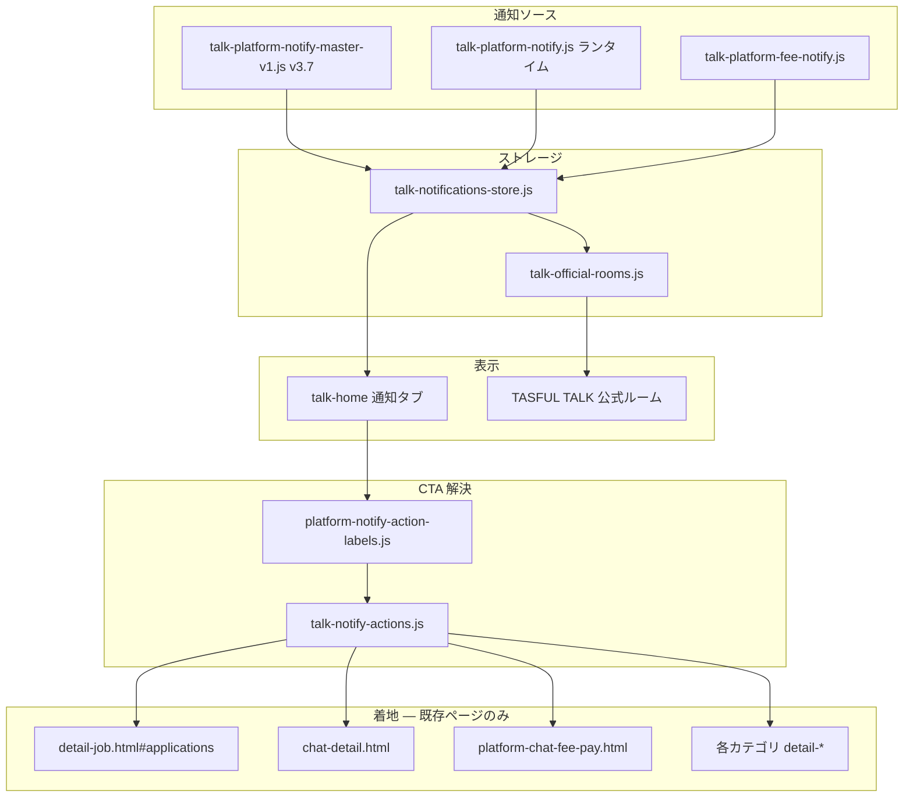

# プラット通知システム統一（Builder 除外）

通知 → 詳細カード → CTA → 次状態 で統一。マスター版 **v3.7**。

---

## 1. 削除対象一覧

### 旧通知 UI / データ

| 対象 | 状態 |
|------|------|
| `platform-verify-job-apply-001` | v3.7 マスターから削除 |
| `platform-verify-job-hired-001` | v3.7 マスターから削除 |
| `view=hire-result` 着地 | 全件 `#applications` へリダイレクト |
| `job-completion.html` 通知着地 | 廃止（チャット内カードへ統一） |
| `job-review.html` 通知着地 | 廃止（チャット内レビューへ統一） |
| `talk-job-full-review-mode.js` | 削除（`talk-chat-demo-review-mode.js` に統合） |
| `ensureJobHireNotifyDemo()` 自動実行 | 停止（`chat-demo-job-hired-001` 平行デモを抑止） |
| 旧 `talk-n-001`〜`007` デモ | マスター v3 時に purge |
| `platform-*` 旧 fee デモ（verify 以外） | purge |

### 旧導線・旧完了画面

| ファイル | 備考 |
|----------|------|
| `job-completion.html` / `job-completion.js` | 補助ページ（通知 CTA からは未使用） |
| `job-review.html` / `job-review.js` | 補助ページ（通知 CTA からは未使用） |
| `job-dual-window-completion.html` | `chat-dual-window-demo.html` へリダイレクト済み |
| hire-result カード UI | `detail-job.html` / `job-detail-applications.js` で無効化 |

### デモ専用旧通知（削除候補 — `chat-dual-window-demo` 以外）

| デモ | URL / モジュール | 備考 |
|------|------------------|------|
| `review=job` 2件デモ | `talk-job-review-mode.js` | job-full 2件へ差し替え済み。将来的に `review=chat-demo` へ統合可 |
| `capture-job-full-flow-390.mjs` | `job-completion.html` 経由 | 旧17枚フロー |
| `capture-job-review-mode-390.mjs` | hire-result 着地 | 旧 UI レビュー |
| `capture-platform-job-ui-review-390.mjs` | hire-result 記述 | ドキュメント生成 |
| `job-full-review-urls.md` / `job-review-urls.md` | 旧 URL 一覧 | ドキュメント残骸 |
| `platform-chat-job-full-demo.js` | 単体 job-full シード | chat-dual-window-demo と重複 |

**保持:** `chat-dual-window-demo.html` + `review=chat-demo`（`job-full` は互換エイリアス）

---

## 2. 置換対象一覧

| 旧 | 新 |
|----|-----|
| `platform-verify-job-apply-001` | `platform-verify-job-full-apply-001` |
| `platform-verify-job-hired-001` / hire-result | `platform-verify-job-full-applicant-start-001` → チャット |
| 採用結果カード (`view=hire-result`) | `detail-job.html#applications` または `chat-detail.html` |
| 完了通知 → `job-completion.html` | `chat-detail.html` + 完了カード |
| 評価通知 → `job-review.html` | `chat-detail.html` + レビューカード |
| CTA 一律「確認する」 | 種別別セマンティック CTA（下表） |
| `talk-job-full-review-mode.js` | `talk-chat-demo-review-mode.js` |
| `review=job-full` 専用フィルタ | `review=chat-demo`（`job-full` 互換） |

### 統一 CTA ラベル

| 通知タイトル（例） | CTA | 遷移先 |
|-------------------|-----|--------|
| この求人に応募がありました | **応募を見る** | `detail-job.html#applications`（案件） |
| 掲載者/応募者とのやりとりを開始 | **TALKを開く** | `chat-detail.html` / `talk-home.html?tab=chat` |
| やりとり完了の申請がありました | **承認する** | `chat-detail.html`（承認カード） |
| やりとりが完了しました | **評価する** | `chat-detail.html`（レビュー導線） |
| 評価をお願いします | **評価する** | `chat-detail.html` |
| キャンセルされました | **詳細を見る** | 該当詳細 / チャット |
| Connect 支払い/返金完了 | **確認する** | チャット / 手数料画面 |
| その他 | **確認する** | マスター href |

実装: `platform-notify-action-labels.js` + `talk-notify-actions.js`

---

## 3. 現在有効な通知フロー一覧（プラット）

### 求人（`platform-verify-job-full-*`）

1. 応募 → 応募を見る → 応募管理
2. 採用後（掲載者/応募者）→ チャットを開く → チャット
3. 完了申請 → 承認する → チャット承認
4. 完了 → 評価する → チャット完了カード
5. レビュー依頼 → 評価する → チャットレビュー

### 全カテゴリ共通（Connect / 完了 / キャンセル）

`platform-chat-category-flow.js` + `platform-chat-completion-flow.js`  
デモ: `chat-dual-window-demo.html?review=chat-demo`

### 手数料・Connect（`platform-verify-*-connect-*` / fee pay）

- 相談/購入/依頼 → 確認する → `platform-chat-fee-pay.html`
- Connect 完了 → 評価する or 確認する

### ワーカー / スキル / 商品 / 店舗 / 業務サービス

マスター v3.7 検証シード + ランタイム `talk-platform-notify.js` push

### 安否 / Builder / 公式

Builder 除外のため本整理対象外（既存マスター維持）

---

## 4. 残存している旧通知一覧（履歴対策）

| パターン | 対策 |
|----------|------|
| `platform-verify-job-apply-001` / `-hired-001` | `DEPRECATED_PLATFORM_NOTIFY_IDS` で purge |
| `view=hire-result` href | purge + ページ側リダイレクト |
| `job-completion.html` / `job-review.html` href | purge |
| `platformMasterVersion` < v3 | `isLegacyPlatformDemoNotification` で除外 |
| 旧 `platform-fee-*` デモ | demo seed purge |
| localStorage 古データ | `tasful_platform_notify_master_v2` バージョン不一致で v3.7 再 upsert |

---

## 5. 削除後の通知構成図



### フロー例（求人）

```
[応募] notifyJobApplicationReceived
  → カード: この求人に応募がありました
  → CTA: 応募を見る
  → detail-job.html#applications

[採用] notifyJobHiredToApplicant / Poster
  → CTA: チャットを開く
  → chat-detail.html

[完了申請] notifyJobCompletionRequested
  → CTA: 承認する
  → chat-detail.html（#chatApproveCompleteBtn）

[完了] notifyJobConversationCompleted
  → CTA: 評価する
  → chat-detail.html（完了カード）

[レビュー] notifyJobReviewRequest
  → CTA: 評価する
  → chat-detail.html（レビュープロンプト）
```

---

## 検証

```bash
node scripts/verify-platform-notify-unified.mjs
node scripts/verify-chat-dual-window-demo.mjs
```

Dev: `http://localhost:5173/talk-home.html?tab=notify&talkDev=1`
