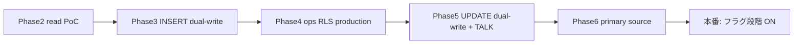

# TASFUL Supabase 移行計画（Phase 1 — 棚卸し・方針）

**作成日:** 2026-06-04  
**ステータス:** 調査・計画のみ（本番接続・データ移行・大規模置き換えは未実施）  
**再棚卸し:** `node scripts/audit-localstorage-usage.mjs`（`--json` で機械可読出力）

---

## 1. 目的とスコープ

10月本番公開に向け、localStorage に残る運営系・Builder・TALK・会員/掲載/チャット/お気に入りデータを Supabase へ安全に移すための計画です。

**Phase 1 でやること**

- localStorage キー棚卸し
- 既存 SQL / RLS の差分整理
- 移行方針（本番 vs ローカル保持）
- Phase A / B / C の順序と rollback 方針

**Phase 1 でやらないこと**

- Supabase 本番接続の切替
- 既存画面ロジックの置き換え
- Stripe / Connect 本番 API 実行
- push / Cloudflare 反映

---

## 2. 移行の基本方針

| 層 | 役割 |
|----|------|
| **Supabase（本番データ）** | 会員に紐づく永続データ、運営データ、案件、通知、お気に入り、チャット、掲載 |
| **localStorage（残すもの）** | UI 状態、未ログイン一時データ、デモ/シード、開発フォールバック、オフラインキャッシュ、移行期の read-through キャッシュ |

**実装パターン（Phase 2 以降）**

1. **Read-through:** Supabase 優先 → 失敗時のみ localStorage（`chat-service.js` / `talk-supabase-sync.js` と同型）
2. **Dual-write（短期）:** 書き込みは Supabase + localStorage 両方（ロールバック用）
3. **Feature flag:** `TASU_CHAT_SUPABASE_CONFIG.*` または `?talkDev=1` と同様の `useSupabaseStore` フラグで段階切替
4. **ID マッピング:** ローカル `text` ID → UUID 移行テーブル `legacy_id` カラムで紐付け

---

## 3. localStorage 棚卸し（サマリー）

自動調査結果（`scripts/audit-localstorage-usage.mjs`）:

| 指標 | 値 |
|------|-----|
| スキャン対象ファイル | 638（`backups/` / `dist/` / `node_modules` 除外） |
| **ユニークキー数** | **86** |
| Supabase 化 **high** 優先 | **17** |
| カテゴリ数 | 15（support, ai_ops, builder, talk, chat, favorites, listings, member, anpi, …） |

---

## 4. localStorage 棚卸し表（機能別）

> 全 86 キーの機械可読一覧は `node scripts/audit-localstorage-usage.mjs --json` を参照。以下は本番移行判断に直結する主要キー。

### 4.1 Support トラブルセンター

| key | 使用ファイル（代表） | 用途 | データ種別 | Supabase化 | localのまま | 優先度 | 推奨テーブル |
|-----|---------------------|------|----------|------------|-------------|--------|--------------|
| `tasu_support_tickets_v1` | `support-ticket-store.js` | 問い合わせチケット | 業務データ | **yes** | no | **high** | `support_tickets` |
| `tasu_support_events_v1` | `support-ticket-store.js` | 監査イベント | 業務データ | **yes** | no | **high** | `support_events` |
| `tasu_connect_issues_v1` | `support-ticket-store.js` | Connect 問題 | 業務データ | **yes** | no | **high** | `connect_issues` |
| `tasu_support_admin_notifications_v1` | `support-admin-notify.js` | 運営未読通知 | 通知 | **yes** | キャッシュ可 | **high** | `support_admin_notifications` |

**SQL:** `sql/support-tickets-schema.sql`（テーブル定義あり・**RLS 未作成**）

---

### 4.2 AI 運営センター

| key | 使用ファイル | 用途 | Supabase化 | 優先度 | 推奨テーブル |
|-----|-------------|------|------------|--------|--------------|
| `tasu_ai_ops_cases_v1` | `ai-ops-case-store.js` | 横断案件 | **yes** | **high** | `ai_ops_cases` |
| `tasu_ai_ops_events_v1` | `ai-ops-case-store.js` | 案件イベント | **yes** | **high** | `ai_ops_events` |
| `tasu_ai_ops_admin_notifications_v1` | `ai-ops-notify.js` | 運営通知 | **yes** | **high** | `ai_ops_admin_notifications` |

**SQL:** `sql/ai-ops-cases-schema.sql`（**通知テーブル・RLS 不足**）

**補足:** `support_ticket_id` は SQL 上 `text`、ローカルは文字列 ID — 移行時に UUID マッピングが必要。

---

### 4.3 総合運営ダッシュボード

| key | 備考 |
|-----|------|
| （専用キーなし） | 上記 Support / AI運営 / Builder ストアを **読み取り専用集計** |

**Supabase化:** Phase A でストア移行後は自動的に DB 集計へ。ダッシュボード専用マテリアライズドビューは Phase A 後半で検討。

---

### 4.4 TASFUL TALK 運営秘書（AI運営秘書）

| key | 使用ファイル | 用途 | Supabase化 | 優先度 | 推奨テーブル |
|-----|-------------|------|------------|--------|--------------|
| `tasful_chat_threads` | `talk-ops-assistant.js`, `chat-thread-store.js` | 運営ルームスレッド | **yes** | **high** | `talk_ops_threads` または `transaction_rooms`（role=ops） |
| `tasful_chat_messages` | 同上 | 運営通知カードメッセージ | **yes** | **high** | `talk_ops_messages`（`kind=ops_card` JSONB） |

**補足:** 現状は相談チャットと **同一キー** を共有。Phase A で運営ルームを分離テーブルに切り出すか、`room_type` カラムで区別する。

**関連 TALK キー（ユーザー向け）**

| key | ファイル | Supabase化 | 優先度 | 推奨テーブル |
|-----|---------|------------|--------|--------------|
| `tasful_talk_notifications` | `talk-notifications-store.js` | **yes** | **high** | `talk_notifications` ✅ SQLあり |
| `tasful_talk_ai_drafts` | `talk-ai-drafts-store.js` | **yes** | **high** | `talk_ai_drafts` ✅ |
| `tasful_talk_broadcast_drafts` | `talk-broadcast-drafts-store.js` | **yes** | **high** | `talk_broadcast_drafts` ✅ |
| `tasful_talk_notification_settings` | `talk-notification-settings-store.js` | **yes** | medium | `talk_notification_settings`（**SQL未作成**） |
| `tasful_talk_follow_store` | `talk-follow-store.js` | **yes** | medium | `talk_follow_subscriptions` ✅ |
| `tasful_talk_sync_pending_v1` | `talk-supabase-sync.js` | キャッシュ | low | キュー（移行完了後削除） |
| `tasful_talk_notifications_seeded_v2` | `talk-notifications-store.js` | no | low | — |
| `tasful_talk_notify_fanout` | `talk-notifications-store.js` | キャッシュ | low | — |

**SQL:** `sql/talk-sync-schema.sql`（通知・下書きあり / dev RLS ポリシー）

---

### 4.5 Builder パートナー評価

| key | 使用ファイル | Supabase化 | 優先度 | 推奨テーブル |
|-----|-------------|------------|--------|--------------|
| `tasful:builder:partner_evaluations:v1` | `builder-partner-evaluation-store.js` | **yes** | **high** | `builder_partner_evaluations` ✅ |
| `tasful:builder:partner_status_events:v1` | 同上 | **yes** | **high** | `builder_partner_status_events` ✅ |
| `tasful:builder:partner_visibility:v1` | 同上 | **yes** | **high** | `builder_partner_visibility`（**SQL未作成**） |
| `tasful:builder:admin:partners:v1` | `builder.js`, eval-store | **yes** | **high** | `builder_partners` ✅ |

**SQL:** `sql/builder-partner-evaluations-schema.sql` + `sql/builder-schema.sql`

---

### 4.6 Builder 案件・スレッド・パートナー系

| key | 用途 | Supabase化 | 優先度 | 推奨テーブル |
|-----|------|------------|--------|--------------|
| `tasful:builder:mvp:v1` | MVP 状態 JSON | **yes** | **high** | 正規化: `builder_projects` + 関連 |
| `tasful:builder:mvp:threads:v1` | 案件スレッド | **yes** | **high** | `builder_threads` |
| `tasful:builder:mvp:notifications:v1` | Builder 通知 | **yes** | medium | `builder_notifications` |
| `tasful:builder:mvp:role` / `partner_id` | デモロール | デモのみ | low | JWT claim / session |
| `tasful:builder:admin:*` | カレンダー・派遣等 | **yes** | medium | `builder_*` 各テーブル |
| `tasful:builder:settings:v1` | UI 設定 | 一部 | low | `builder_user_settings` |

**SQL:** `sql/builder-schema.sql`（設計 DDL あり・**RLS は `builder-rls-policies.sql` で別途**）

---

### 4.7 お気に入り

| key | ファイル | Supabase化 | 優先度 | 推奨テーブル |
|-----|---------|------------|--------|--------------|
| `tasful_favorites` | `favorite-store.js` | **yes** | medium | `member_favorites` |
| `tasu_favorites_v1` | `favorites-db.js` | **yes** | medium | 同上（統合） |
| `tasful_favorite_listings` | `favorites-list.js` | **yes** | medium | 同上 |
| `tasu_shop_store_favorites` | `shop-store-page.js` | **yes** | medium | 同上（type=shop） |

**SQL:** 専用 DDL **未作成**（listings 系と統合設計が必要）

---

### 4.8 チャット

| key | ファイル | Supabase化 | 優先度 | 推奨テーブル |
|-----|---------|------------|--------|--------------|
| `tasu_chat_seed_v1` | `chat-service.js`, `chat-supabase.js` | **yes** | **high** | `transaction_rooms` / `transaction_messages` |
| `tasu_chat_seed` | レガシー | 移行後削除 | low | — |
| `tasful_chat_threads` / `tasful_chat_messages` | `chat-thread-store.js` | **yes** | **high** | 相談スレッド用テーブル or 上記に統合 |

**SQL:** `supabase/transaction_chat.sql`（**本番 RLS 要設計**）

---

### 4.9 会員 / 掲載 / 案件系

| key | 用途 | Supabase化 | 優先度 | 推奨テーブル |
|-----|------|------------|--------|--------------|
| `tasu_member_session` | 会員セッション | **hybrid** | medium | Supabase Auth + profile |
| `tasu_member_signups` | 登録デモ | **yes** | medium | `member_profiles` |
| `tasful_last_profile` | 表示キャッシュ | キャッシュ | low | — |
| `tasful_listings` / `tasu_listings_v1` | 掲載ローカル | **yes** | medium | `listings` |
| `tasu_business_listings_v1` | 業務掲載 | **yes** | medium | `listings` |
| `tasu_service_deals` | 業務取引 | **yes** | medium | `service_deals` |
| `tasu_business_service_reviews_v1` | レビュー | **yes** | medium | `business_service_reviews` |

**SQL:** `sql/listings-*.sql`（カラム拡張のみ / テーブル本体は Supabase 側で要確認）

---

### 4.10 安否（Anpi）— 参考（Phase C 寄り）

| 代表 key | 件数 | 備考 |
|----------|------|------|
| `tasu_anpi_*` | 15 | `sql/anpi-*.sql` あり。TALK 運営ルームとは独立だが本番前に RLS/JWT 必須 |

---

### 4.11 ローカル保持推奨（Supabase 化しない / 低優先）

| 種別 | 例 |
|------|-----|
| Auth SDK | `tasu-supabase-auth`, `sb-*-auth-token` |
| UI / フィルタ | `tasful_talk_notify_follow_only`, `tasful_talk_recent_actions` |
| シードマーカー | `tasful_talk_notifications_seeded_v2` |
| GenAI デモ | `tasu_genai_dev_mode`, `tasu_genai_stage_renderer` |
| Anpi モック | `tasu_anpi_*_mock_v1`, `tasu_anpi_line_send_mock_v1` |

---

## 5. Supabase 化優先順位（high）

1. `tasu_support_*` + `tasu_connect_issues_v1`
2. `tasu_ai_ops_*`
3. `tasful:builder:partner_evaluations:v1` + `partner_status_events` + `admin:partners`
4. `tasful:builder:mvp:threads:v1` + MVP 状態の正規化
5. `tasful_talk_notifications` / `ai_drafts` / `broadcast_drafts`
6. `tasful_chat_*` + `tasu_chat_seed_v1`（取引・相談チャット）
7. 運営ルームメッセージの分離（`talk_ops_messages`）

**medium（Phase C）:** お気に入り統合、掲載 `tasful_listings`、会員プロフィール、業務 deals/reviews

---

## 6. 既存 SQL との差分

### 6.1 用意済み（リポジトリ内・未実行メモ含む）

| ファイル | テーブル | 状態 |
|----------|---------|------|
| `sql/support-tickets-schema.sql` | support_tickets, support_events, connect_issues | DDL のみ・RLS なし |
| `sql/ai-ops-cases-schema.sql` | ai_ops_cases, ai_ops_events | DDL のみ・通知テーブルなし |
| `sql/builder-partner-evaluations-schema.sql` | builder_partner_evaluations, builder_partner_status_events | DDL のみ |
| `sql/builder-schema.sql` | builder_partners, projects, threads, messages, … | 設計 DDL・RLS 別ファイル |
| `sql/talk-sync-schema.sql` | talk_ai_drafts, talk_broadcast_drafts, talk_notifications | DDL + dev RLS |
| `sql/talk-follow-subscriptions.sql` | フォロー | 要本番 RLS 差し替え |
| `sql/talk-rls-production.sql` | TALK RLS 本番 | 要 Dashboard 適用確認 |
| `supabase/transaction_chat.sql` | transaction_* | 本番チャット基盤 |

### 6.2 不足テーブル・カラム（新規 SQL が必要）

| 推奨オブジェクト | 理由 |
|------------------|------|
| `support_admin_notifications` | `tasu_support_admin_notifications_v1` |
| `ai_ops_admin_notifications` | `tasu_ai_ops_admin_notifications_v1` |
| `builder_partner_visibility` | `tasful:builder:partner_visibility:v1` |
| `talk_ops_threads` / `talk_ops_messages` | AI運営秘書ルーム（ops_card JSONB） |
| `talk_notification_settings` | `tasful_talk_notification_settings` |
| `member_favorites` | お気に入り複数キー統合 |
| `listings`（統一） | `tasful_listings` / `tasu_listings_v1` |
| `consult_threads` / `consult_messages` | `tasful_chat_*` と transaction の住み分け |
| `service_deals` / `business_service_reviews` | 業務フロー |

### 6.3 RLS 方針（共通）

| ロール | 方針 |
|--------|------|
| `anon` | 読み取り不可（運営・会員データ） |
| `authenticated` | `user_id` / `talk_user_id` / `member_id` JWT claim で自分の行のみ |
| `service_role` | 運営バッチ・Edge のみ（Support/AI運営の書き込み） |
| 運営管理者 | 専用 `admin` claim または別テーブル `ops_users` で policy 分岐 |

既存参考: `sql/talk-rls-production.sql`, `sql/anpi-rls-production.sql`, `sql/builder-rls-policies.sql`

---

## 7. Phase 別移行計画

### Phase A — 運営系（Support / AI運営 / ダッシュボード / TALK運営秘書）

**目標:** 運営データの Supabase 正本化。UI は既存のまま、ストア層に adapter を追加。

| 項目 | 内容 |
|------|------|
| **対象ファイル** | `support-ticket-store.js`, `support-ticket-service.js`, `support-admin-notify.js`, `ai-ops-case-store.js`, `ai-ops-notify.js`, `admin-operations-dashboard.js`, `talk-ops-assistant.js`, `talk-ops-room.js` |
| **追加 SQL** | `sql/support-tickets-rls.sql`, `sql/ai-ops-rls.sql`, `sql/talk-ops-messages-schema.sql`, 通知2テーブル |
| **変更 JS** | 各 `*-store.js` に `readFromSupabase()` / `dualWrite` 層（**インターフェース不変**） |
| **E2E** | `test-support-trouble-center-browser.mjs`, `test-ai-operations-center-browser.mjs`, `test-admin-operations-dashboard-browser.mjs`, `test-talk-ops-assistant-browser.mjs` |
| **Rollback** | `localStorage` フォールバックをデフォルト ON。`?opsStore=local` で強制ローカル。Supabase 障害時は現行動作に自動退避 |

**順序:** SQL適用（staging）→ adapter 読取 → dual-write → E2E → 本番フラグ ON

---

### Phase B — Builder（パートナー評価 / 案件 / スレッド）

| 項目 | 内容 |
|------|------|
| **対象ファイル** | `builder/builder.js`, `builder-partner-evaluation-store.js`, `builder-partner-evaluation-admin.js`, MVP 画面群 |
| **追加 SQL** | `builder-schema.sql` 適用、`builder-partner-evaluations-schema.sql`, `builder_partner_visibility`, `builder-rls-policies.sql` 本番化 |
| **変更 JS** | MVP 状態の段階的正規化（まず partners / evaluations / threads） |
| **E2E** | `test-builder-partner-evaluation-browser.mjs`, `verify-line-chat-3tab.mjs`, Builder admin 系 |
| **Rollback** | `tasful:builder:mvp:v1` を残したまま Supabase 読取失敗時フォールバック |

---

### Phase C — お気に入り / チャット / 掲載 / 会員

| 項目 | 内容 |
|------|------|
| **対象ファイル** | `favorite-store.js`, `favorites-db.js`, `chat-service.js`, `chat-thread-store.js`, `chat-supabase.js`, `listing-local-store.js`, `listings-db.js`, `member-auth.js`, `talk-supabase-sync.js` |
| **追加 SQL** | `member_favorites`, `listings` 統一 DDL, consult_* または transaction 拡張, listings RLS |
| **変更 JS** | お気に入り API 統合、チャット seed 廃止、掲載 CRUD の Supabase 化 |
| **E2E** | `test-favorite-actions-browser.mjs`, `test-chat-detail-browser.mjs`, `test-listing-management-browser.mjs`, `test-platform-all-browser.mjs` |
| **Rollback** | `tasu_chat_seed_v1` / `tasful_favorites` を移行期間保持。切替フラグで即復帰 |

---

## 8. テスト計画

| 段階 | 内容 |
|------|------|
| Phase 1（今回） | `audit-localstorage-usage.mjs` 実行、本ドキュメントレビュー、**既存 E2E 回帰なし**（コード未変更） |
| Phase A 着手後 | 運営4系 E2E + staging Supabase で RLS 検証スクリプト追加 |
| Phase B | Builder 評価・3tab LINE 検証 |
| Phase C | お気に入り32/ platform スモーク / チャット詳細 |
| 本番前 | `docs/production-release-checklist.md` §9–§12 + 本番 `BASE_URL` |

---

## 9. Rollback 方針

1. **機能フラグ**で Supabase 読取 ON/OFF（デフォルト OFF から段階 ON）
2. **Dual-write 期間**（最低1リリース）— localStorage を正とする期間を残す
3. **SQL ロールバック** — 新テーブルのみ DROP可能にする（既存 transaction テーブルは触らない）
4. **データ復元** — 移行前に `localStorage` エクスポートスクリプト（Phase A 開始時に追加予定）
5. **運営影響最小** — Phase A は運営専用画面のみ。公開ページ・AI Workspace・TALK ユーザー通知はフラグ OFF 時現状維持

---

## 10. 本番公開前の注意事項

- Stripe / Connect **API 実行**は移行フェーズとは独立（ステータス記録のみの現行仕様を維持）
- `service_role` キーをフロントに載せない（運営書き込みは Edge Function 経由を推奨）
- JWT に `talk_user_id` / `member_id` / 運営 `ops_admin` claim を付与してから RLS 本番化
- `sql/*-schema.sql` は **「未実行メモ」** が多い — staging で適用順序を固定化
- TALK は `talk-supabase-sync.js` が既に同期基盤あり — Phase A で運営ルームを同パターンに乗せる
- 10月公開前チェックリスト: `docs/production-release-checklist.md`

---

## 11. Phase 1 成果物

| ファイル | 説明 |
|----------|------|
| `docs/supabase-migration-plan.md` | 本ドキュメント |
| `scripts/audit-localstorage-usage.mjs` | localStorage キー自動棚卸し |

---

## 12. Phase 2 — Staging read-through PoC（2026-06-04）

**コミット:** `Deploy prep: Supabase Phase 2 staging PoC`  
**方針:** 書き込みは localStorage のみ。Supabase は **read-through**（フラグ OFF がデフォルト）。

### 12.1 Staging SQL 適用

```bash
# リンク済み Staging プロジェクトで実行（本番ではない）
node scripts/apply-staging-phase2-supabase.mjs
```

| 順 | ファイル | 内容 |
|----|----------|------|
| 1 | `sql/talk-sync-schema.sql` | talk_ai_drafts, talk_broadcast_drafts, talk_notifications |
| 2 | `sql/talk-follow-subscriptions.sql` | フォロー |
| 3 | `sql/staging-phase2-ops-schema.sql` | support_*, ai_ops_*, builder_partner_*, talk_ops_messages |
| 4 | `sql/staging-phase2-member-listings.sql` | member_favorites, listings |
| 5 | `sql/staging-phase2-ops-rls-dev.sql` | **Staging のみ** anon SELECT（read PoC） |

**Phase 2 新規テーブル数:** 13（運営11 + 会員/掲載2）＋ TALK 既存3 = 合計16テーブル群

**RLS:** `staging-phase2-ops-rls-dev.sql` — 全対象テーブルで `enable row level security` + `*_select_staging_read`（anon/authenticated SELECT のみ）。INSERT/UPDATE/DELETE ポリシーなし（書き込み PoC なし）。

### 12.2 read-through 有効化（開発・Staging のみ）

| 方法 | 説明 |
|------|------|
| URL | `?supabaseRead=1` を付与（例: `admin-operations-dashboard.html?supabaseRead=1`） |
| config | `TASU_CHAT_SUPABASE_CONFIG.supabaseOpsReadPoc = true`（デフォルトは未設定＝OFF） |
| session | `sessionStorage.setItem('tasu_supabase_ops_read_poc','1')` |

**制約:** `file://` では Supabase クエリ不可（localStorage のみ）。HTTP サーバー + Staging RLS 適用後に live 確認。

### 12.3 追加・更新ファイル

| 種別 | ファイル |
|------|----------|
| SQL | `sql/staging-phase2-ops-schema.sql`, `staging-phase2-member-listings.sql`, `staging-phase2-ops-rls-dev.sql` |
| Adapter | `supabase-ops-read-config.js`, `supabase-ops-read-adapter.js`, `supabase-ops-read-bootstrap.js` |
| Store | `support-ticket-store.js`, `ai-ops-case-store.js`, `builder/builder-partner-evaluation-store.js` |
| UI | 運営4画面 HTML + hydrate イベント |
| Scripts | `apply-staging-phase2-supabase.mjs`, `seed-staging-phase2-read-poc.mjs`, `test-supabase-phase2-read-poc.mjs` |

### 12.4 PoC で読取可能なストア

| ストア | merge キー | 備考 |
|--------|------------|------|
| `TasuSupportTicketStore.listTickets` | `support_tickets` | getTicket も merge 後一覧から解決 |
| `TasuSupportTicketStore.listConnectIssues` | `connect_issues` | |
| `TasuAiOpsCaseStore`（readCases/listCases） | `ai_ops_cases` | |
| `TasuBuilderPartnerEval.getBuilderPartnerEvaluations` | `builder_partner_evaluations` | |
| 総合運営ダッシュボード | 上記ストア経由 | `buildMetrics()` |
| TALK運営秘書 | 上記ストア経由 | `talk-ops-assistant.js` |

### 12.5 確認手順

```bash
# 1) 単体 + mock remote（ネットワーク不要）
node scripts/test-supabase-phase2-read-poc.mjs

# 2) Staging seed（service_role、任意）
SUPABASE_URL=... SUPABASE_SERVICE_ROLE_KEY=... node scripts/seed-staging-phase2-read-poc.mjs

# 3) live read（staging RLS + anon、任意）
SUPABASE_URL=... SUPABASE_ANON_KEY=... node scripts/test-supabase-phase2-read-poc.mjs

# 4) 既存運営 E2E（フラグ OFF・回帰）
node scripts/test-support-trouble-center-browser.mjs
node scripts/test-ai-operations-center-browser.mjs
node scripts/test-admin-operations-dashboard-browser.mjs
node scripts/test-talk-ops-assistant-browser.mjs
```

### 12.6 Phase 2 E2E 結果（ローカル）

| テスト | 結果 |
|--------|------|
| `test-supabase-phase2-read-poc.mjs` | merge / フラグOFF / mock read / ダッシュボード・ストア・運営秘書 |
| 既存 Support E2E（回帰） | 内包 PASS |

### 12.7 Rollback（Phase 2）

- フラグを OFF（デフォルト）→ 即座に Phase 1 同等（localStorage のみ）
- Staging SQL のみ DROP する場合は ops テーブル群を個別削除（transaction / 既存 TALK は維持可能）

**次のアクション（Phase 3 以降）**

1. 本番 RLS（`ops_admin` claim）— dev SELECT/INSERT ポリシー削除
2. `talk_ops_messages` の TALK ルーム dual-write
3. 会員 / 掲載 / チャット / お気に入りは Phase C

---

## 13. Phase 3 — Staging dual-write PoC（2026-06-04）

**コミット:** `Deploy prep: Supabase Phase 3 dual-write PoC`  
**方針:** Support / AI運営 / Builder評価の **新規 INSERT のみ** を localStorage 成功後に Supabase へ upsert。失敗しても local は成功扱い。

### 13.1 対象テーブル（7）

| 系統 | テーブル |
|------|----------|
| Support | `support_tickets`, `support_events`, `connect_issues` |
| AI運営 | `ai_ops_cases`, `ai_ops_events` |
| Builder | `builder_partner_evaluations`, `builder_partner_status_events` |

**触らない:** Stripe / Connect 実行 API、会員、掲載、チャット、お気に入り、DELETE、本番データ一括変更。

### 13.2 feature flag（デフォルト OFF）

| 方法 | 説明 |
|------|------|
| URL | `?supabaseDualWrite=1` |
| config | `TASU_CHAT_SUPABASE_CONFIG.supabaseOpsDualWrite = true` |
| global | `window.__TASU_SUPABASE_DUAL_WRITE__ = true` |
| session | `sessionStorage.setItem('tasu_supabase_ops_dual_write','1')` |

**read-through との併用:** `?supabaseRead=1&supabaseDualWrite=1`（HTTP + Staging RLS 必須）

**制約:** `file://` では Supabase 書き込み不可（localStorage のみ）。E2E mock は `file://` でも可。

### 13.3 Staging SQL（INSERT RLS）

```bash
node scripts/apply-staging-phase3-dual-write-supabase.mjs
```

| ファイル | 内容 |
|----------|------|
| `sql/staging-phase3-ops-rls-dual-write-dev.sql` | 上記7テーブルに `*_insert_staging_dual_write`（anon/authenticated INSERT のみ） |

Phase 2 の SELECT ポリシー（`staging-phase2-ops-rls-dev.sql`）と併用。

### 13.4 実装ファイル

| 種別 | ファイル |
|------|----------|
| Config / Adapter | `supabase-ops-write-config.js`, `supabase-ops-write-adapter.js` |
| Store | `support-ticket-store.js`, `ai-ops-case-store.js`, `builder/builder-partner-evaluation-store.js` |
| UI script 読込 | `support-trouble-center.html`, `admin-ai-operations-center.html`, `admin-operations-dashboard.html`, `talk-ops-room.html`, `builder/admin-partner-evaluations.html` |
| E2E | `scripts/test-supabase-phase3-dual-write.mjs` |

**失敗ログ:** `localStorage` キー `tasu_ops_write_failures_v1` + `console.warn`

**重複防止:** Supabase 側は `upsert`（`onConflict: id`）。local 側の既存 dedupe は維持。

### 13.5 確認手順

```bash
# 1) mock（ネットワーク不要・file:// 可）
node scripts/test-supabase-phase3-dual-write.mjs

# 2) Staging INSERT RLS 適用（リンク済みプロジェクト）
node scripts/apply-staging-phase3-dual-write-supabase.mjs

# 3) live dual-write + read（HTTP サーバー + .env）
npx http-server -p 8765 -c-1
BUILDER_BASE_URL=http://127.0.0.1:8765 node scripts/load-dotenv-run.mjs scripts/test-supabase-phase3-dual-write.mjs
```

**UI（HTTP）:**

- `support-trouble-center.html?supabaseDualWrite=1`
- `admin-ai-operations-center.html?supabaseDualWrite=1`
- `admin-operations-dashboard.html?supabaseRead=1&supabaseDualWrite=1`
- `talk-ops-room.html?supabaseRead=1&supabaseDualWrite=1`
- `builder/admin-partner-evaluations.html?supabaseDualWrite=1`

### 13.6 Rollback（Phase 3）

1. フラグ OFF（デフォルト）→ 即 Phase 2 / localStorage のみ書き込み
2. Staging で INSERT ポリシー削除: `drop policy "<table>_insert_staging_dual_write" on public.<table>;`（7テーブル）
3. コード revert — `supabase-ops-write-*` の script タグ削除 + store の `TasuSupabaseOpsWrite` 呼び出し削除

---

## 14. Phase 4 — 本番 ops RLS / admin 設計（2026-06-04）

**コミット:** `Deploy prep: Supabase Phase 4 ops RLS admin design`  
**方針:** 本番用 RLS・admin 判定・update 方針を SQL / ドキュメントで確定。Staging で検証。**本番 Supabase には手動適用まで触らない。**

### 14.1 本番 RLS 方針

| 主体 | 運営11テーブル |
|------|----------------|
| **anon** | deny（ポリシーなし） |
| **authenticated 一般会員** | deny |
| **tasu_admin / ops_admin** | SELECT / INSERT / UPDATE（テーブルにより UPDATE なし） |
| **DELETE** | authenticated には付与しない → deny |
| **service_role** | RLS バイパス（保守・seed・Edge Function） |

**public クライアント（anon key）からの危険操作は不可。** 運営 UI は将来 **admin JWT 付き Supabase Auth** または **Edge Function 経由** に切替。

### 14.2 admin 判定（SQL）

| 関数 | 用途 |
|------|------|
| `tasu_current_member_id()` | JWT `member_id` / `sub` / `auth.uid()` |
| `tasu_is_admin()` | `tasu_admin` / `admin`（anpi / talk と同型） |
| `tasu_is_ops_admin()` | `tasu_is_admin()` OR `ops_admin` / `tasu_ops_admin` claim |
| `tasu_can_manage_ops()` | 運営テーブルポリシーで使用（= `tasu_is_ops_admin()`） |

**JWT 例（Staging 検証）:** `scripts/issue-anpi-rls-jwt.mjs` → `ANPI_RLS_ADMIN_JWT`（`app_metadata.role = tasu_admin`）

### 14.3 SQL ファイル

| ファイル | 用途 |
|----------|------|
| `sql/ops-rls-production.sql` | ヘルパー + RLS + `updated_at` trigger + `talk_ops_messages` 拡張列 |
| `sql/ops-rls-drop-dev-policies.sql` | Phase 2 `*_staging_read` / Phase 3 `*_staging_dual_write` 削除 |
| `sql/staging-phase4-ops-rls-admin-dev.sql` | Staging 検証手順メモ |
| `scripts/apply-staging-phase4-ops-rls.mjs` | 上記 drop → production をリンク DB に適用 |

**ポリシー名:** `ops_<table>_select_admin` / `_insert_admin` / `_update_admin`（DELETE なし）

### 14.4 update 対象方針（Phase 5 JS 実装予定）

| 系統 | テーブル | UPDATE 許可（admin） | 主なカラム |
|------|----------|----------------------|------------|
| Support | `support_tickets` | yes | `status`, `admin_note`, `ai_suggested_reply`, `resolved_at`（`updated_at` は trigger） |
| Support | `support_events` | no（append-only） | — |
| Support | `connect_issues` | yes | `status`, `resolved_at`, `recommended_action` |
| Support | `support_admin_notifications` | yes | `read` |
| AI運営 | `ai_ops_cases` | yes | `status`, `admin_note`, `ai_reply_draft`, `resolved_at` |
| AI運営 | `ai_ops_events` | no（append-only） | — |
| AI運営 | `ai_ops_admin_notifications` | yes | `read` |
| Builder | `builder_partner_evaluations` | no（append-only） | — |
| Builder | `builder_partner_status_events` | no（insert only） | — |
| Builder | `builder_partner_visibility` | yes | `partner_status`, `updated_at` |
| TALK運営秘書 | `talk_ops_messages` | yes | `read_at`, `notification_synced`, `summary_generated`, `ops_summary` |

Phase 3 dual-write は引き続き **INSERT upsert のみ**。本番 RLS 下では **admin JWT なしの anon dual-write は失敗**（local は成功・`ops_write_failures` に記録）。

### 14.5 Staging 検証手順

```bash
# 1) PoC ポリシー削除 + 本番相当 RLS（リンク済み Staging のみ）
node scripts/apply-staging-phase4-ops-rls.mjs

# 2) JWT（未発行時）
node scripts/issue-anpi-rls-jwt.mjs --write-env

# 3) RLS 行列テスト
node scripts/load-dotenv-run.mjs scripts/test-supabase-phase4-rls-admin.mjs
```

**注意:** Phase 4 適用後は Staging の **anon read / dual-write live** は動かなくなる（意図どおり）。JS PoC は **フラグ OFF** で従来どおり localStorage。

### 14.6 Rollback（Phase 4）

1. **Staging PoC に戻す:** `staging-phase2-ops-rls-dev.sql` + `staging-phase3-ops-rls-dual-write-dev.sql` を再適用
2. **本番相当を外す:** `ops-rls-drop-dev-policies.sql` 実行後、各 `ops_*_admin` ポリシーを DROP
3. **JS:** 変更不要（フラグ OFF がデフォルト）。dual-write の RLS warn ログのみ追加済み

### 14.7 10月公開前にやること

1. 本番 Supabase に `ops-rls-production.sql` を **メンテナンス窓で手動適用**（Phase 2/3 dev ポリシー削除後）
2. 運営画面を **admin JWT** 付き `TasuSupabase.getClient()` に切替（dual-write / read-through を本番 RLS 下で再検証）
3. `ops_admin` ロールを Auth / IAM で発行（Builder Admin・Support 担当者）
4. Edge Function 化が必要なバッチ（通知 fanout 等）を洗い出し
5. Phase 5: update dual-write + `talk_ops_messages` 同期
6. 会員 / 掲載 / チャットは Phase C（§7）のまま後続

---

## 15. Phase 5 — update dual-write + TALK運営秘書同期（2026-06-04）

**コミット:** `Deploy prep: Supabase Phase 5 update dual-write`  
**前提:** Phase 4 `ops-rls-production.sql` 適用済み Staging。書き込みは **admin JWT 必須**。

### 15.1 概要

Phase 3 の INSERT dual-write に加え、運営系の **UPDATE / 通知既読 / Builder visibility / TALK ops メッセージ** を Staging で検証。localStorage は常に成功、Supabase 失敗は `tasu_ops_write_failures_v1` に記録。

### 15.2 feature flag（変更なし・デフォルト OFF）

| フラグ | 用途 |
|--------|------|
| `?supabaseDualWrite=1` | write（INSERT + UPDATE） |
| `?supabaseRead=1` | read-through merge |
| `sessionStorage.tasu_ops_admin_access_token` | **admin JWT**（Phase 5 必須） |
| `TASU_CHAT_SUPABASE_CONFIG.opsAdminAccessToken` | 同上（開発用） |

**併用例:** `?supabaseRead=1&supabaseDualWrite=1` + admin JWT in sessionStorage

### 15.3 update dual-write 対象操作

| 系統 | 操作 | Adapter メソッド |
|------|------|------------------|
| Support | status / admin_note / resolved_at | `updateSupportTicketStatus`, `updateSupportTicketAdminNote`, `updateSupportTicketResolvedAt` |
| Support | 通知既読 | `markSupportNotificationRead` + `insertSupportAdminNotification` |
| AI運営 | status / admin_note / resolved_at | `updateAiOpsCaseStatus`, `updateAiOpsCaseAdminNote`, `updateAiOpsCaseResolvedAt` |
| AI運営 | 通知既読 | `markAiOpsNotificationRead` + `insertAiOpsAdminNotification` |
| Builder | visibility | `updateBuilderPartnerVisibility` |
| Builder | status event | `insertBuilderStatusEvent`（Phase 3 継続） |
| TALK運営秘書 | メッセージ同期 | `insertTalkOpsMessage`, `markTalkOpsMessageSynced` |
| TALK運営秘書 | 既読 / サマリー | `markTalkOpsMessageRead`, `markTalkOpsSummaryGenerated` |

**Store フック:** `saveTicket`（更新時）, `saveCase`, `markNotificationsReadForTicket`, `markRead`, `applyPartnerHideStatus`, `talk-ops-assistant` `appendRoomMessage`

### 15.4 TALK同期内容

- 既存 `tasful_chat_messages` は維持（運営ルーム UI）
- dual-write ON 時、`talk_ops_messages` に upsert（`ops_card` / `ops_summary` JSON 含む）
- 日次サマリー `kind=ops_summary` → `summary_generated=true`
- read-through ON 時、write 後に `prefetch(talk_ops_messages)` で再読込

### 15.5 Staging 検証手順

```bash
# JWT 更新（期限切れ時）
node scripts/issue-anpi-rls-jwt.mjs --write-env

# Phase 5 テスト（REST + mock + 任意 UI）
node scripts/load-dotenv-run.mjs scripts/test-supabase-phase5-update-dual-write.mjs

# UI（HTTP サーバー例）
# sessionStorage に admin JWT をセットしてから:
# support-trouble-center.html?supabaseRead=1&supabaseDualWrite=1
```

### 15.6 admin JWT 必須条件

Phase 4 RLS 下では **anon key のみでは INSERT/UPDATE 不可**。ブラウザでは:

```javascript
sessionStorage.setItem("tasu_ops_admin_access_token", "<ANPI_RLS_ADMIN_JWT>");
```

E2E / Playwright も同様に注入。

### 15.7 Rollback（Phase 5）

1. フラグ OFF → localStorage のみ（Phase 1–3 同等の書き込み体験）
2. `supabase-ops-write-adapter.js` の update メソッド呼び出しを store から削除して revert
3. Phase 4 RLS は維持可能（write しない限り影響なし）

### 15.8 本番公開前の注意

- 運営画面に **Supabase Auth ログイン（tasu_admin）** を組み込んでから dual-write を ON
- 公開サイトの anon キーだけでは運営 DB に書けない（意図どおり）
- `talk_ops_messages` カラム追加は `ops-rls-production.sql` に含む — 本番 SQL 適用時に反映

---

## 16. Phase 6 — Supabase primary source PoC（2026-06-04）

**コミット:** `Deploy prep: Supabase Phase 6 primary source PoC`  
**前提:** Phase 4 RLS 適用済み Staging。primary ON 時の **読取も admin JWT 必須**（anon のみでは SELECT 不可）。

### 16.1 目的

| 現在（Phase 2–5） | 将来（本番切替後） |
|-------------------|-------------------|
| localStorage = 正データ | Supabase = 正データ |
| Supabase = 補助（merge / dual-write） | localStorage = 期限付きキャッシュ |

Phase 6 は **Staging のみ** で「Supabase 優先 → LS ミラー → 失敗時 LS 表示」を PoC し、本番フラグは **デフォルト OFF** のまま維持する。

### 16.2 feature flag（新規・デフォルト OFF）

| 有効化 | キー / 変数 |
|--------|-------------|
| URL | `?supabasePrimary=1` |
| 設定 | `TASU_CHAT_SUPABASE_CONFIG.supabaseOpsPrimarySource = true` |
| グローバル | `window.__TASU_SUPABASE_PRIMARY__ = true` |
| セッション | `sessionStorage.tasu_supabase_ops_primary = "1"`（任意） |

**併用例（Staging 検証）**

```text
admin-operations-dashboard.html?supabasePrimary=1&supabaseDualWrite=1
sessionStorage.tasu_ops_admin_access_token = <ANPI_RLS_ADMIN_JWT>
```

| フラグ | 役割 |
|--------|------|
| `supabasePrimary` | 正データ = Supabase、LS = キャッシュ |
| `supabaseRead` | Phase 2 merge（local 新しい方優先）— primary と併用時は primary が優先 |
| `supabaseDualWrite` | Phase 3/5 書込 — 成功後 `prefetch` でキャッシュ更新 |

### 16.3 読取順序

**primary OFF（従来）**

1. localStorage 読取
2. （`supabaseRead=1` 時のみ）Supabase merge → local 新しい方優先
3. 表示

**primary ON**

1. Supabase fetch（admin JWT 付きクライアント）
2. 取得成功 → `mergePrimaryFirst`（remote 上書き）→ localStorage へ `syncFromRemote`
3. fetch 失敗 / 空 → `readTableCache` → 表示 + `console.warn` + `dataSource: cache`

### 16.4 キャッシュ戦略

| 項目 | 内容 |
|------|------|
| メタ | `localStorage.tasu_ops_primary_cache_meta_v1`（`dataSource`, `lastFetchOk`, `tables.*.lastSyncedAt`） |
| TTL 参照 | `TasuSupabaseOpsPrimaryCache.isFresh(key)` — デフォルト 5 分（表示判断の補助、削除はしない） |
| テーブル別 LS キー | `supabase-ops-primary-cache.js` の `TABLE_LS`（既存運営キーと同一） |
| 同期イベント | `tasu:supabase-ops-primary-synced` |

**対象テーブル（運営系のみ）**

- Support: `support_tickets`, `support_events`, `connect_issues`, `support_admin_notifications`
- AI運営: `ai_ops_cases`, `ai_ops_events`, `ai_ops_admin_notifications`
- Builder: `builder_partner_evaluations`, `builder_partner_status_events`, `builder_partner_visibility`
- TALK運営秘書: `talk_ops_messages`

### 16.5 fallback 戦略

1. Supabase HTTP / RLS / JWT 不足 → メモリキャッシュ空 → LS キャッシュ表示
2. `TasuSupabaseOpsPrimaryCache.warnFallback` → `dataSource = cache`
3. **localStorage 削除禁止** — 既存キーはミラー上書きのみ
4. `file:` プロトコルでは `canQuery` false → LS のみ（警告なしでも従来どおり）

### 16.6 画面・モジュール

| 画面 | スクリプト追加 |
|------|----------------|
| `support-trouble-center.html` | primary-config / primary-cache / data-source-ui |
| `admin-ai-operations-center.html` | 同上 |
| `admin-operations-dashboard.html` | 同上 + ステータス行に Data Source |
| `talk-ops-room.html` | 同上 |
| `builder/admin-partner-evaluations.html` | 同上 |

**Store / 通知:** `support-ticket-store`, `ai-ops-case-store`, `support-admin-notify`, `ai-ops-notify`, `builder-partner-evaluation-store`, `talk-ops-assistant` — `mergeList` または primary キャッシュ経由。

**開発表示:** `.tasu-ops-data-source-badge` — `Data Source: Supabase | Cache (fallback) | local`

### 16.7 Staging 検証手順

```bash
node scripts/issue-anpi-rls-jwt.mjs --write-env
node scripts/load-dotenv-run.mjs scripts/test-supabase-phase6-primary-source.mjs

# HTTP サーバー + BUILDER_BASE_URL 任意
# ブラウザで ?supabasePrimary=1 + admin JWT
```

### 16.8 切替手順（将来・本番前）

1. Staging で Phase 6 E2E PASS を確認
2. 運営 Auth（`tasu_admin` JWT）を本番運営画面に組み込み
3. 本番 DB に Phase 4 RLS + スキーマ適用
4. 限定運営ユーザーで `supabasePrimary=1` を ON → 監視
5. 問題なければ config デフォルト ON（段階的）

### 16.9 Rollback 手順

1. URL / config から `supabasePrimary` を外す（即 LS 正データモードに戻る）
2. `tasu_ops_primary_cache_meta_v1` は残しても害なし（読取は LS 直読みに戻る）
3. Phase 6 追加 JS を HTML から外す revert でも可（フラグ OFF なら非破壊）
4. Supabase データは Phase 3/5 dual-write 済みならそのまま保持

### 16.10 公開前チェック

- [ ] 本番サイトで `supabaseOpsPrimarySource` が **false** のまま
- [ ] 会員 / 掲載 / チャット / お気に入り / Builder 一般に primary フラグが届いていない
- [ ] 運営画面が anon のみで Supabase を読んでいない（admin JWT または未接続）
- [ ] Phase 6 E2E + Phase 5 回帰 PASS
- [ ] push / Cloudflare / Stripe 本番接続なし（Deploy prep のみ）

---

## 17. Phase 7 — 本番切替リハーサル手順書（2026-06-04）

**コミット:** `Deploy prep: Supabase Phase 7 production rehearsal plan`  
**目的:** 10月公開前に、**本番 Supabase 切替・運営フラグ ON** の作業を Staging で安全にリハーサルできるよう、手順・順序・rollback・E2E を一本化する。

**Phase 7 でやること**

- 手順書の作成・レビュー（本ドキュメント §17）
- Staging 上での E2E / UI 確認（任意・推奨）

**Phase 7 でやらないこと**

- 本番 Supabase プロジェクトへの SQL 適用
- git push / Cloudflare 反映 / 公開サイトデプロイ
- Stripe / Connect 本番接続
- 会員・掲載・一般チャット・Builder 一般機能の切替

---

### 17.1 全体像（Phase 2 → 6）



| Phase | 読取 | 書込 | RLS | 本番デフォルト |
|-------|------|------|-----|----------------|
| 2 | `?supabaseRead=1` merge | LS のみ | Staging dev SELECT | すべて OFF |
| 3 | 2 と同様 | `?supabaseDualWrite=1` INSERT | Staging dev INSERT | OFF |
| 4 | — | — | `ops-rls-production.sql` | OFF |
| 5 | 2 推奨 | dual-write + **UPDATE** + TALK | admin JWT 必須 | OFF |
| 6 | `?supabasePrimary=1` | 5 と併用で cache 同期 | admin JWT 必須（読取も） | OFF |

**10月本番の到達点（運営系）:** Phase 4 RLS 適用済み + 限定ユーザーで `supabaseDualWrite` → `supabaseRead` → `supabasePrimary` を段階 ON。一般公開 HTML の config デフォルトは **すべて OFF** のまま。

---

### 17.2 本番適用手順（実施はメンテナンス窓・手動のみ）

> 以下は **手順書**。Phase 7 では実行しない。本番 DB には **リンク済み Staging とは別プロジェクト** を指定すること。

#### 17.2.1 事前条件

- [ ] Phase 2〜6 の Deploy prep コミットがリポジトリに揃っている
- [ ] 本番 Supabase に運営テーブル DDL が存在（未作成なら `staging-phase2-ops-schema.sql` 相当を本番用にレビューして適用）
- [ ] 本番に Phase 2/3 の `*_staging_read` / `*_staging_dual_write` ポリシーが **残っていない**（残っていると admin RLS が無効化される）
- [ ] 運営担当者の **Supabase Auth / admin JWT** 発行方針が確定（`tasu_admin` / `ops_admin`）
- [ ] Cloudflare / 静的デプロイは **別チケット**（本手順では触らない）

#### 17.2.2 SQL 適用順序（本番）

| 順 | ファイル / コマンド | 内容 | 備考 |
|----|---------------------|------|------|
| 0 | バックアップ | Supabase ダッシュボードでバックアップ / PITR 確認 | 必須 |
| 1 | `sql/ops-rls-drop-dev-policies.sql` | PoC ポリシー削除 | 本番に dev ポリシーがある場合のみ。0 行警告が理想 |
| 2 | `sql/ops-rls-production.sql` | ヘルパー関数・RLS・`updated_at` trigger・`talk_ops_messages` 拡張列 | **本番相当 RLS の本体** |
| 3 | 検証クエリ | `pg_policies` で `staging_read` / `staging_dual_write` が 0 件 | §14.3 参照 |
| 4 | 任意 seed | service_role のみ。運営初期データが必要な場合 | anon では不可 |

**Staging でのリハーサル用（リンク DB）:**

```bash
# Phase 2 スキーマ（未適用時のみ）
node scripts/apply-staging-phase2-supabase.mjs

# Phase 3 dual-write dev RLS（Phase 4 前の INSERT 検証用・任意）
node scripts/apply-staging-phase3-dual-write-supabase.mjs

# Phase 4 本番相当 RLS（drop dev → production）
node scripts/apply-staging-phase4-ops-rls.mjs
```

**本番では** `apply-staging-*.mjs` は使わず、同じ SQL ファイルを **本番プロジェクト向け** に `supabase db query`（本番 link）または SQL Editor で **順番どおり** 実行する。

#### 17.2.3 フロントエンド・フラグ（本番切替段階）

すべて **デフォルト OFF**。段階的に ON（限定運営 URL または config）。

| 段階 | フラグ | 前提 | 確認 |
|------|--------|------|------|
| A | `supabaseDualWrite=1` | admin JWT + Phase 4 RLS | 新規チケット・評価が Supabase に INSERT/UPDATE |
| B | `supabaseRead=1` | A 安定後 | merge 表示・ダッシュボード件数 |
| C | `supabasePrimary=1` | B + dual-write 安定後 | Data Source: Supabase、LS はキャッシュのみ |

**config 例（本番は未設定＝OFF 推奨）:**

```javascript
// TASU_CHAT_SUPABASE_CONFIG — 本番公開ビルドではすべて false / 未設定
supabaseOpsReadPoc: false,
supabaseOpsDualWrite: false,
supabaseOpsPrimarySource: false,
// opsAdminAccessToken: /* 運営ログイン後にのみ注入。リポジトリにハードコードしない */
```

**URL 検証例（運営専用・HTTP 必須）:**

```text
support-trouble-center.html?supabaseDualWrite=1&supabaseRead=1
admin-operations-dashboard.html?supabasePrimary=1&supabaseDualWrite=1
talk-ops-room.html?supabasePrimary=1&supabaseDualWrite=1
```

#### 17.2.4 admin JWT 設定

| 環境 | 設定方法 |
|------|----------|
| Staging 検証 | `node scripts/issue-anpi-rls-jwt.mjs --write-env` → `.env` の `ANPI_RLS_ADMIN_JWT` |
| ブラウザ | `sessionStorage.setItem("tasu_ops_admin_access_token", "<JWT>")` |
| E2E | Playwright `addInitScript` で同上を注入 |
| 本番 | **Supabase Auth ログイン** 後に JWT を session / メモリへ（永続化方針は別設計） |

JWT の `app_metadata.role` は `tasu_admin`（`tasu_is_ops_admin()` が true になること）。期限切れ時は再発行。

#### 17.2.5 既存 localStorage の扱い

| 方針 | 内容 |
|------|------|
| **削除しない** | `tasu_support_tickets_v1` 等の既存キーは運営のローカル資産として維持 |
| dual-write ON | 書込成功後も LS に保存（従来 UX）。Supabase へミラー |
| primary ON | Supabase 取得成功時に LS へ **上書きミラー**（`tasu_ops_primary_cache_meta_v1` に `lastSyncedAt`） |
| fallback | Supabase 失敗時は LS / キャッシュ表示（`dataSource: cache`） |
| 本番初回 | 既存 LS データは残したまま primary ON → 初回 fetch で Supabase が正なら LS が同期される。競合時は **remote 優先**（Phase 6） |
| 移行完了後 | LS はキャッシュ扱い。TTL は参照のみ（5 分）。クリーンアップは別フェーズ |

**触らない領域:** 会員・掲載・`tasful_chat_messages`（一般 TALK）・お気に入り・Builder MVP 一般 — 運営系キー以外は Phase C まで変更しない。

---

### 17.3 Staging リハーサル（推奨フロー）

**前提:** リンク済み Staging（`npx supabase link`）。本番プロジェクトではないこと。

#### 17.3.1 環境準備

```bash
# JWT（期限切れ時）
node scripts/issue-anpi-rls-jwt.mjs --write-env

# 任意: HTTP で UI 確認
# npx serve .  等 → BUILDER_BASE_URL=http://127.0.0.1:3000
```

#### 17.3.2 SQL（Staging 状態の確認）

| 状態 | 確認 |
|------|------|
| Phase 2 スキーマ済み | `support_tickets` 等が存在 |
| Phase 4 適用済み | anon SELECT が拒否、admin JWT で SELECT 可 |
| PoC ポリシーなし | `ops-rls-drop-dev-policies.sql` 実行後、警告 0 行 |

未適用なら §17.2.2 の Staging 用 `apply-staging-*.mjs` を順に実行。

#### 17.3.3 自動 E2E（順番推奨）

```bash
# Phase 2 — read-through（mock + 任意 live）
node scripts/test-supabase-phase2-read-poc.mjs
# live は Phase 4 後は SKIP_OPS_LIVE_READ=1 がデフォルト想定

# Phase 3 — INSERT dual-write
node scripts/load-dotenv-run.mjs scripts/test-supabase-phase3-dual-write.mjs

# Phase 4 — RLS 行列（Phase 4 適用後）
node scripts/load-dotenv-run.mjs scripts/test-supabase-phase4-rls-admin.mjs

# Phase 5 — UPDATE + TALK ops
node scripts/load-dotenv-run.mjs scripts/test-supabase-phase5-update-dual-write.mjs

# Phase 6 — primary source + Phase 5 回帰内包
node scripts/load-dotenv-run.mjs scripts/test-supabase-phase6-primary-source.mjs
```

**一括確認（本番切替前の想定）:** 上記 **すべて PASS**。Phase 6 が Phase 5 回帰を内包する。

| スクリプト | 主な確認内容 |
|------------|----------------|
| `test-supabase-phase2-read-poc.mjs` | フラグ OFF、merge、mock ダッシュボード・ストア・運営秘書 |
| `test-supabase-phase3-dual-write.mjs` | INSERT dual-write、LS 成功・Supabase ミラー |
| `test-supabase-phase5-update-dual-write.mjs` | status / 通知既読 / visibility / `talk_ops_messages` |
| `test-supabase-phase6-primary-source.mjs` | primary ON/OFF、cache fallback、件数一致、Data Source バッジ |

#### 17.3.4 live UI 確認（手動チェックリスト）

ブラウザで admin JWT をセットしたうえで実施。

| 画面 | URL 例 | 確認項目 |
|------|--------|----------|
| 総合運営ダッシュボード | `admin-operations-dashboard.html?supabasePrimary=1&supabaseDualWrite=1` | KPI 件数、**Data Source: Supabase**、簡易ステータス |
| Support | `support-trouble-center.html?supabaseRead=1&supabaseDualWrite=1` | 一覧・詳細・ステータス更新後に Supabase 行が更新 |
| AI運営 | `admin-ai-operations-center.html?supabaseRead=1&supabaseDualWrite=1` | ケース一覧・ステータス更新 |
| Builder 評価 | `builder/admin-partner-evaluations.html?supabaseDualWrite=1` | 評価追加・非表示（visibility） |
| TALK運営秘書 | `talk-ops-room.html?supabasePrimary=1&supabaseDualWrite=1` | カード / メッセージ、`talk_ops_messages` と表示一致 |

**障害時の切り分け:** DevTools → Network で Supabase REST が 401/403 なら JWT / RLS。フラグを外すと LS のみに戻るか確認。

#### 17.3.5 リハーサル対象テーブル・操作

| 系統 | テーブル | リハーサル操作 |
|------|----------|----------------|
| Support | `support_tickets` | 一覧 read / 作成・status・admin_note・resolved（dual-write） |
| Support | `support_events` | イベント INSERT |
| Support | `connect_issues` | 一覧 read / INSERT |
| Support | `support_admin_notifications` | 通知 read / INSERT / 既読 UPDATE |
| AI運営 | `ai_ops_cases` | 一覧 read / 作成・status・admin_note |
| AI運営 | `ai_ops_events` | イベント INSERT |
| AI運営 | `ai_ops_admin_notifications` | 通知 read / 既読 |
| Builder | `builder_partner_evaluations` | 評価 INSERT / read |
| Builder | `builder_partner_status_events` | ステータスイベント INSERT |
| Builder | `builder_partner_visibility` | 非表示 upsert |
| TALK運営秘書 | `talk_ops_messages` | カード・サマリー upsert / read（primary） |

---

### 17.4 Rollback 手順

#### 17.4.1 即時（フロント・運用）

| 手順 | 効果 |
|------|------|
| 1. `supabasePrimary` / `supabaseRead` / `supabaseDualWrite` を URL・config から除去 | **即** localStorage 正データモード（Phase 1 同等 UX） |
| 2. `sessionStorage.removeItem("tasu_ops_admin_access_token")` | Supabase 読書き停止 |
| 3. 運営担当者へ「ローカル保存のみ」周知 | データ損失なし（LS 維持） |

**Phase 4 RLS は維持してよい** — フラグ OFF なら anon は触れず、運営も Supabase を呼ばなければ従来どおり LS のみ。

#### 17.4.2 Staging SQL を PoC に戻す場合

| 順 | 操作 |
|----|------|
| 1 | `ops-rls-production.sql` で追加した `ops_*_admin` ポリシーを DROP（テーブルごと） |
| 2 | `staging-phase2-ops-rls-dev.sql` を再適用（anon read PoC） |
| 3 | 必要なら `staging-phase3-ops-rls-dual-write-dev.sql` を再適用 |
| 4 | `test-supabase-phase2-read-poc.mjs` で anon live read が復帰するか確認 |

**本番で RLS を戻す場合** はメンテナンス窓で上記と同型。PoC ポリシーを本番に載せないこと（セキュリティリスク）。

#### 17.4.3 PoC 用 SQL リバート参照

| ファイル | リバート時の役割 |
|----------|------------------|
| `sql/ops-rls-drop-dev-policies.sql` | dev ポリシー削除（本番 RLS 適用**前**に必須） |
| `sql/ops-rls-production.sql` | 適用の**逆**はポリシー DROP + 関数 DROP（手動リスト化） |
| `sql/staging-phase2-ops-rls-dev.sql` | Staging read PoC 復帰 |
| `sql/staging-phase3-ops-rls-dual-write-dev.sql` | Staging INSERT PoC 復帰 |

テーブル DROP は **最終手段**（dual-write 済みデータがある場合）。通常はフラグ OFF で十分。

---

### 17.5 本番切替前 E2E 確認項目（チェックリスト）

**自動（CI / ローカル）**

- [ ] `test-supabase-phase2-read-poc.mjs` — PASS
- [ ] `test-supabase-phase3-dual-write.mjs` — PASS（`load-dotenv-run` 推奨）
- [ ] `test-supabase-phase4-rls-admin.mjs` — PASS（Staging Phase 4 適用後）
- [ ] `test-supabase-phase5-update-dual-write.mjs` — PASS
- [ ] `test-supabase-phase6-primary-source.mjs` — PASS（Phase 5 回帰含む）
- [ ] 既存運営ブラウザ E2E（フラグ OFF）— `test-support-trouble-center-browser.mjs`, `test-ai-operations-center-browser.mjs`, `test-admin-operations-dashboard-browser.mjs`, `test-talk-ops-assistant-browser.mjs`

**手動（Staging + admin JWT）**

- [ ] ダッシュボード KPI と Supabase 行数が概ね一致（primary ON）
- [ ] Support ステータス変更が Supabase に反映
- [ ] TALK運営秘書メッセージが `talk_ops_messages` と一致
- [ ] `tasu_ops_write_failures_v1` に想定外エラーが溜まっていない
- [ ] 本番ビルドの config で 3 フラグが **すべて OFF**

**公開ゲート（触らないもの）**

- [ ] push / Cloudflare / Stripe Connect 本番 — 別承認
- [ ] 会員・掲載・一般チャット — Phase C まで未切替

---

### 17.6 Phase 別クイックリファレンス

| Phase | フラグ | SQL（Staging） | 主テスト |
|-------|--------|----------------|----------|
| 2 | `supabaseRead=1` | `apply-staging-phase2-supabase.mjs` | `test-supabase-phase2-read-poc.mjs` |
| 3 | `supabaseDualWrite=1` | `apply-staging-phase3-dual-write-supabase.mjs` | `test-supabase-phase3-dual-write.mjs` |
| 4 | （なし） | `apply-staging-phase4-ops-rls.mjs` | `test-supabase-phase4-rls-admin.mjs` |
| 5 | dual-write + read 推奨 | Phase 4 済み前提 | `test-supabase-phase5-update-dual-write.mjs` |
| 6 | `supabasePrimary=1` | Phase 4 済み前提 | `test-supabase-phase6-primary-source.mjs` |
| 7 | （手順書のみ） | — | §17.3〜17.5 を実施 |

---

### 17.7 Phase 7 成果物と次ステップ

| 成果物 | 説明 |
|--------|------|
| `docs/supabase-migration-plan.md` §17 | 本リハーサル手順書 |
| Staging 実施記録 | 実行者・日付・E2E 結果をチケットに記載（任意） |

**次ステップ（10月公開）**

1. 本番 Supabase で §17.2.2 SQL をメンテナンス窓実行
2. 運営 Auth 本番組み込み → §17.2.3 段階 A→B→C
3. `docs/production-release-checklist.md` と突合
4. Phase C（会員・掲載・チャット）計画どおり後続

---

## 18. Stripe Connect トラブル強化 — DB 案（2026-06-04）

本番未適用。現状は `tasu_stripe_event_ingest_logs_v1` / `tasu_chargeback_evidence_packs_v1` / `tasu_offplatform_risk_events_v1`（localStorage）+ 既存 `support_events` / `ai_ops_events` で代替。

| 草案テーブル | 用途 |
|--------------|------|
| `stripe_event_ingest_logs` | webhook 取込監査 |
| `chargeback_evidence_packs` | 証拠パック JSON |
| `offplatform_risk_events` | オフプラットフォーム検知 |

DDL: `sql/stripe-connect-trouble-ddl-draft.sql`（RLS は `tasu_can_manage_ops()` 想定）

---

## 関連ドキュメント

- [production-release-checklist.md](./production-release-checklist.md)
- [talk-supabase-sync.md](./talk-supabase-sync.md)（存在する場合）
- [builder-supabase-schema-notes.md](../builder/builder-supabase-schema-notes.md)
