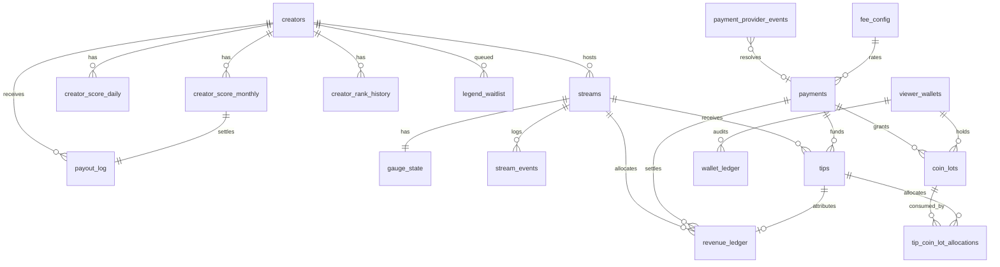

# TLV DB Schema — v1.2.5 + Membership 追加設計

**最終更新:** 2026-06-28  
**DDL 正本:** [`db/tlv_schema.sql`](../db/tlv_schema.sql)  
**仕様正本:** [TLV_PRD.md](./TLV_PRD.md) §5 · §6 · [CREATOR_PROGRAM.md](./CREATOR_PROGRAM.md)  
**処理仕様:** [TLV_PAYMENT_ENGINE.md](./TLV_PAYMENT_ENGINE.md) — Payment/PL フロー · Edge Function · 冪等

**スキーマ名:** `tlv`（`public.live_*` との衝突回避）

---

## 1. 責務分離（必須）

詳細フロー: [TLV_PAYMENT_ENGINE.md](./TLV_PAYMENT_ENGINE.md) §0–§5

| レイヤ | テーブル | 役割 | 正本性 |
| --- | --- | --- | --- |
| **金額** | `payments` · `revenue_ledger` | Gross / Fee / Net · stream PL | **金の正本** |
| **ウォレット** | `viewer_wallets` · `wallet_ledger` | コイン残高正本 · 増減監査 | **coin 残高正本** |
| **Viewer ID** | `payer_user_uuid` ↔ `viewer_wallets.user_id` | 認証 UUID · wallet JOIN | **Viewer 正本** |
| **Viewer legacy** | `payments.payer_user_id` · `tips.payer_user_id` (text) | talk_user_id · 旧互換 · 監査 | **JOIN 禁止** |
| **Lot / WR** | `coin_lots` · `tip_coin_lot_allocations` | 購入ロット · tip origin 按分 | **WR origin 正本** |
| **Webhook** | `payment_provider_events` | 決済プロバイダ event 冪等 | **二重付与防止** |
| **Rank / 還元** | `creator_score_monthly` | score_ma30 · rank · override_tier · rates | **Rank/還元の正本** |
| **UX / 監査** | `stream_events` | ゲージ · 演出 · 視聴ログ | **金額正本ではない** |
| **Score 履歴** | `creator_score_events` · `creator_score_daily` | イベント · 日次 · MA30 入力 | Score トレース |
| **ゲージ** | `gauge_state` | 500coin · stock · フェーズ | リアルタイム状態 |

```text
payments.payer_user_uuid ──► viewer_wallets.user_id ◄── wallet_ledger.user_id
        │                           ▲
        └──► coin_lots.user_id ─────┘
tips.payer_user_uuid ──► viewer_wallets.user_id

payments.payer_user_id (text) / tips.payer_user_id (text) — 互換のみ · JOIN 禁止

payments ──► coin_lots ──► tip_coin_lot_allocations ──► tips ──► revenue_ledger
payment_provider_events ──► payments（Webhook 冪等）
creator_score_daily ──► creator_score_monthly ──► payout_log
```

---

## 2. ER 概要



---

## 3. テーブル一覧

| # | テーブル | 説明 |
| --- | --- | --- |
| 1 | `tlv.fee_config` | 決済手数料 · App 価格係数 |
| 2 | `tlv.creators` | Creator マスタ · live score キャッシュ |
| 3 | `tlv.streams` | ライブセッション |
| 4 | `tlv.payments` | 決済正本（Gross/Fee/Net） |
| 5 | `tlv.tips` | ギフト/延長 · 不正フラグ |
| 6 | `tlv.revenue_ledger` | stream 単位 PL |
| 7 | `tlv.gauge_state` | 延長ゲージ · stock |
| 8 | `tlv.stream_events` | UX/演出イベントログ |
| 9 | `tlv.creator_score_events` | Score 軸イベント履歴 |
| 10 | `tlv.creator_score_daily` | 日次 Score（GS 反映） |
| 11 | `tlv.creator_score_monthly` | **Rank/還元正本** |
| 12 | `tlv.creator_rank_history` | Rank 変遷 |
| 13 | `tlv.payout_log` | 月次還元実行 |
| 14 | `tlv.legend_waitlist` | Legend 定員100 · PPR 順 |
| 15 | `tlv.viewer_wallets` | **Viewer コイン残高正本** |
| 16 | `tlv.wallet_ledger` | コイン増減監査 · INSERT-only |
| 17 | `tlv.coin_lots` | 購入ロット · Web/App origin · FIFO |
| 18 | `tlv.payment_provider_events` | Webhook 冪等 |
| 19 | `tlv.tip_coin_lot_allocations` | tip 消費 lot 按分 · WR 監査 |

**Wallet レポート:** [reports/tlv-wallet-ledger-schema.md](../reports/tlv-wallet-ledger-schema.md)  
**Phase 1 レポート:** [reports/tlv-payment-engine-todo-phase1.md](../reports/tlv-payment-engine-todo-phase1.md)

---

## 4. Score OS マッピング（PRD §5 同期）

### 4.1 4 軸 · 1000 点

```text
CreatorScore = clamp(FS + ES + GS + TS, 0, 1000)
FS: 0–400  |  ES: 0–300  |  GS: 0–200  |  TS: 0–100
```

| 軸 | DB 保存先（日次） | 更新頻度 |
| --- | --- | --- |
| FS | `creator_score_daily.fs_ppc_pts` + `fs_wr_pts` | リアルタイム → 日次確定 |
| ES | `es_watch_pts` + `es_chat_pts` + `es_ext_pts` | リアルタイム → 日次確定 |
| GS | `gs_rev_pts` + `gs_new_pts` | 日次 03:00 JST |
| TS | `creator_score_daily.ts` | イベント + 日次 03:30 JST |

**Live キャッシュ:** `creators.fs_live` · `es_live` · `gs_daily` · `ts_live` · `total_live`

### 4.2 月次正本（Rank / 還元）

`creator_score_monthly` 必須カラム:

| カラム | 用途 |
| --- | --- |
| `score_ma30` | Rank 判定（§5.7） |
| `rank_tier` | Base Layer |
| `override_tier` | `none` / `tier_90` / `tier_95` |
| `base_rate` · `effective_rate` | 還元率二層合成 |
| `ppr_30d` | Legend PPR 選抜 · FS PPC 参照 |
| `ppc_month_jpy` | 95% Override（≥ ¥500,000） |
| `wr_30d` · `wr_month` | FS_WR · Override WR 条件 |
| `ts` | Override TS ゲート |
| `tier_90_pass` · `tier_95_pass` | 条件達成フラグ |
| `locked_at` | 月次確定ロック |

---

## 5. 主要テーブル詳細

### 5.1 `tlv.payments` — 金の正本

```text
net_amount_jpy = gross_amount_jpy - fee_amount_jpy - refund_amount_jpy - chargeback_amount_jpy
```

| カラム | 型 | 備考 |
| --- | --- | --- |
| `gross_amount_jpy` | bigint | ユーザー支払税込 |
| `fee_amount_jpy` | bigint | チャネル手数料 |
| `net_amount_jpy` | bigint | FS PPC · revenue_ledger 入力 |
| `channel` | enum | web_stripe / ios_iap / android_iap |
| `is_web_payment` | boolean | WR 集計用 |
| `payer_user_uuid` | uuid | **Viewer 正本** — `viewer_wallets.user_id` と JOIN |
| `payer_user_id` | text | 互換用（talk_user_id 等）— **wallet JOIN 禁止** |

**Wallet JOIN 正本:**

```sql
-- 正
SELECT * FROM tlv.payments p
JOIN tlv.viewer_wallets w ON w.user_id = p.payer_user_uuid;

-- 禁止（legacy text）
-- JOIN tlv.viewer_wallets w ON w.user_id::text = p.payer_user_id
```

### 5.2 `tlv.tips` — 不正除外

| カラム | 意味 |
| --- | --- |
| `payer_user_uuid` | **Viewer 正本 UUID** — wallet / lot JOIN |
| `payer_user_id` | 互換 text — 自己投げ text 比較 · 監査 |

| フラグ | 意味 |
| --- | --- |
| `self_gift_flag` | 疑義検知 |
| `self_gift_confirmed` | 確定 |
| `bot_suspect_flag` | BOT 疑義 |
| `fraud_excluded` | **PPC / revenue_ledger / Override から除外** |
| `idempotency_key` | クライアント冪等キー — 重複 RPC は no-op（v1.2.5） |

`tip_kind = 'extension'` → `gauge_state.paid_extension_coins` 更新 · ES 延長参加率入力

**WR origin（Phase 1.2.2）:**

| カラム | 意味 |
| --- | --- |
| `web_origin_net_jpy` / `app_origin_net_jpy` | tip 消費 lot 按分 Net |
| `wr_at_tip` | tip 時点 Web 比率スナップショット |

監査行: `tip_coin_lot_allocations` — FS_WR は **購入時ではなく tip 消費 origin** を集計（[TLV_PAYMENT_ENGINE.md](./TLV_PAYMENT_ENGINE.md) §2.6）

### 5.2.1 PostgreSQL RPC（Payment Engine · v1.2.5）

| 関数 | 責務 | migration |
| --- | --- | --- |
| `tlv.handle_payment_webhook_success` | Stripe/IAP webhook 単一 TX · coin 付与 | `20260628120000` · `20260628130000` |
| **`tlv.create_tip_transaction`** | **tip 消費単一 TX** — wallet · lots · ledger · gauge · PL | **`20260628140000`** |
| `tlv.compute_gauge_pct` | gauge_pct 計算（TS mirror） | `20260628140000` |

**`tlv.create_tip_transaction` 不変条件:**

- wallet JOIN は **`p_payer_user_uuid` のみ** — `p_payer_user_id` text は JOIN 禁止
- `idempotency_key` / `p_tip_id` 重複 → 二重 debit なし
- `review_required`（self_gift 疑義）→ `revenue_ledger` なし（TODO-03）
- extension grant → ENGINE §3.4 ガード（DEV-03 解消）

### 5.3 `tlv.viewer_wallets` — コイン残高正本

| カラム | 型 | 備考 |
| --- | --- | --- |
| `id` | uuid PK | `wallet_ledger.wallet_id` FK |
| `user_id` | uuid UNIQUE | Platform ユーザー · 1:1 wallet |
| `coin_balance` | integer | 総残高 · CHECK >= 0 |
| `locked_coin_balance` | integer | spend 不可分 · <= coin_balance |
| `lifetime_purchased_coins` | integer | 累計購入 coin |
| `lifetime_spent_coins` | integer | 累計消費 coin |
| `status` | enum | `active` / `frozen` / `closed` |

**tip 可否:** `(coin_balance - locked_coin_balance) >= coins_amount` かつ `status = active`

JPY 金額は **参照しない** — 金の正本は `payments` / `revenue_ledger`。

### 5.4 `tlv.wallet_ledger` — コイン監査（INSERT-only）

| カラム | 用途 |
| --- | --- |
| `wallet_id` | FK → `viewer_wallets.id` |
| `user_id` |  denormalize · 一覧クエリ用 |
| `entry_type` | `purchase_credit` / `tip_debit` / `refund_credit` / `chargeback_debit` / `adjustment_*` / `lock` / `unlock` |
| `coins_delta` | 増減（≠0） |
| `balance_after` | 直後 `coin_balance` と一致必須 |
| `payment_id` / `tip_id` / `provider_event_id` | トレース FK（nullable） |
| `reason_code` | adjustment 系 **必須** |
| `metadata` | jsonb · Ops ticket 等 |

**ポリシー:** UPDATE/DELETE 禁止 · JPY 正本にしない。

### 5.5 `tlv.coin_lots` — 購入ロット

| カラム | 用途 |
| --- | --- |
| `lot_source` | `web_stripe` / `ios_iap` / `android_iap` / `welcome_grant` / `ops_adjustment` |
| `is_web_payment` | WR 按分フラグ |
| `gross/fee/net_amount_jpy` | 購入時 PL（payments からコピー） |
| `coins_original` / `coins_remaining` | FIFO 消費 |
| `extension_allowed` | welcome=false |
| `expires_at` | 有償 180d · welcome 30d |

### 5.6 `tlv.payment_provider_events` — Webhook 冪等

`(provider, provider_event_id)` UNIQUE · `status=processed` なら副作用 no-op。

### 5.7 `tlv.revenue_ledger` — stream PL 正本

```text
platform_revenue_jpy = net_amount_jpy - infra_cost_jpy - creator_payout_jpy
```

| event_kind | 用途 |
| --- | --- |
| `gift` · `extension` | 視聴者課金分配 |
| `infra_allocation` | CCU 連動コスト |
| `adjustment` | FinOps 手動調整 |

`self_gift_excluded = true` の行は PPC 集計から除外。

### 5.8 `tlv.gauge_state` — 500 coin · stock

| カラム | 式 / 値 |
| --- | --- |
| `extension_unit_coins` | **500**（CHECK 固定） |
| `paid_extension_coins` | ルーム合算 |
| `extension_stock_coins` | `paid - blocks*500` |
| `next_block_cost_coins` | `max(0, 500 - stock)` |
| `gauge_phase` | accumulating → rostime → grace → extended |

### 5.9 `tlv.stream_events` — UX のみ

**禁止:** `stream_events` に金額カラムを追加しない。  
金額参照は `tip_id` → `tips` → `payments` / `revenue_ledger` 経由のみ。

| event_kind 例 | 用途 |
| --- | --- |
| `gauge_tick` | ゲージ UI |
| `rostime_start` · `grace_start` | 演出 |
| `extension_unlock` | 延長解放（金額は tips 側） |

---

## 6. Rank · Override · Legend

### 6.1 Rank レンジ（`score_ma30`）

| Rank | Score |
| --- | --- |
| Bronze | 0–499 |
| Silver | 500–649 |
| Gold | 650–749 |
| Platinum | 750–849 |
| Diamond | 850–929 |
| Legend | 930–1000（定員100） |

### 6.2 Override Tier

| Tier | DB 値 | 条件保存 |
| --- | --- | --- |
| なし | `none` | `effective_rate = base_rate` |
| 90% | `tier_90` | `tier_90_pass = true` |
| 95% | `tier_95` | `tier_95_pass = true` · Legend のみ |

### 6.3 `legend_waitlist`

- `score_ma30 >= 930` の Creator のみ
- `waitlist_position` = **PPR 降順**
- `is_legend_seat = true` · `waitlist_position <= 100` が Legend 在籍
- 毎月 1 日スナップショット · 動的入替

---

## 7. バッチ · 更新 cadence

| ジョブ | 時刻 (JST) | 対象テーブル |
| --- | --- | --- |
| `score-recalc-fs-es` | リアルタイム | `creators.*_live` · `creator_score_events` |
| `score-daily-gs` | 03:00 | `creator_score_daily.gs*` |
| `score-audit-ts` | 03:30 | `creator_score_daily.ts` · `creator_score_events` |
| `score-ma30-rollup` | 03:45 | `creator_score_daily.score_ma30` |
| `score-monthly-lock` | 毎月1日 00:00 | `creator_score_monthly` · `legend_waitlist` |
| `payout-monthly` | 毎月1日 06:00 | `payout_log` |

---

## 8. インデックス方針

| 用途 | インデックス |
| --- | --- |
| Creator 月次 PL | `revenue_ledger (creator_id, ledger_month)` |
| PPC 集計 | `revenue_ledger` partial · `self_gift_excluded=false` |
| ライブ監視 | `streams (status)` where live |
| Score 履歴 | `creator_score_events (creator_id, created_at desc)` |
| Legend 選抜 | `legend_waitlist (month_id, ppr_month desc)` |
| 不正レビュー | `tips` partial · self_gift / bot flags |
| WR 集計 | `tips (creator_id, created_at)` · `web_origin_net_jpy` |
| Viewer 履歴 | `payments (payer_user_uuid, created_at desc)` · `tips (payer_user_uuid, created_at desc)` |
| FIFO 消費 | `coin_lots (user_id, expires_at, created_at)` where remaining>0 |
| Webhook 冪等 | `payment_provider_events (provider, provider_event_id)` UNIQUE |
| Wallet 監査 | `wallet_ledger (wallet_id, created_at desc)` |

---

## 9. Row Level Security（RLS · TODO-07 設計 · 未適用）

**正本設計:** [reports/tlv-payment-rls-design.md](../reports/tlv-payment-rls-design.md)  
**状態:** **staging 適用済（20260628150000）· production 未適用** — [reports/tlv-payment-rls-staging-test.md](../reports/tlv-payment-rls-staging-test.md)

### 9.1 方針

| 原則 | 内容 |
| --- | --- |
| 書込 | Wallet · Payment · Tip · Ledger は **service_role + SECURITY DEFINER RPC のみ** |
| 読取 | authenticated は **本人 / 自 Creator** のみ SELECT |
| anon | Payment 系テーブル **全面禁止** |
| 監査 | `wallet_ledger` · `revenue_ledger` · `stream_events` · `creator_score_events` は **INSERT-only**（クライアント UPDATE/DELETE 禁止） |
| JOIN 正本 | `auth.uid()` = `payer_user_uuid` = `viewer_wallets.user_id` — `payer_user_id` text は RLS 条件に使わない |
| Membership | `membership_tiers` · `user_subscriptions` · `subscription_invoices` は **別 Policy セット**（§12 · 将来） |

### 9.2 対象テーブル（Payment Engine Phase 2）

| テーブル | RLS | SELECT | INSERT/UPDATE/DELETE（authenticated） |
| --- | --- | --- | --- |
| `viewer_wallets` | 必須 | owner | 禁止 |
| `wallet_ledger` | 必須 | owner | 禁止 |
| `coin_lots` | 必須 | owner | 禁止 |
| `tip_coin_lot_allocations` | 必須 | payer（tips JOIN）のみ | 禁止 |
| `payments` | 必須 | payer | 禁止 |
| `payment_provider_events` | 必須 | admin / service_role のみ | 禁止 |
| `tips` | 必須 | payer + creator | 禁止 |
| `revenue_ledger` | 必須 | admin / service_role のみ | 禁止 |
| `stream_events` | 必須 | live stream / creator / admin | 禁止 |
| `creator_score_events` | 必須 | admin のみ（Creator 直読は要判断 · 案 B 推奨） | 禁止 |

**Admin 判定:** 新規 `tlv_admin` は設けない — 既存 `public.talk_is_admin()` + JWT `app_metadata.is_ops`（[reports/tlv-payment-rls-design.md §5](../reports/tlv-payment-rls-design.md)）。

**Creator 判定:** `tlv.creators.user_id`（text）↔ JWT `talk_user_id` — ヘルパー `tlv.is_creator_of(creator_id)`（設計案 · 未作成）。

**RPC / PostgREST:** EXECUTE は service_role のみ · `tlv` schema expose は RLS 適用後に production 可（[reports/tlv-payment-rls-design.md §6–7](../reports/tlv-payment-rls-design.md)）。

### 9.3 Policy SQL

`CREATE POLICY` · `ENABLE ROW LEVEL SECURITY` · `FORCE ROW LEVEL SECURITY` の **SQL 案のみ** — [reports/tlv-payment-rls-design.md §4](../reports/tlv-payment-rls-design.md#4-推奨-policy-sql-案作業3--未適用)。

**本番 blocker:** TODO-06 chargeback **staging検証済 · production migration 待ち** · **TODO-07 production migration 未適用**（staging RLS PASS 済）。

### 9.4 TODO-06 DB 変更（P0 実装済 · staging検証済）

**正本:** [reports/tlv-payment-chargeback-clawback-implementation.md](../reports/tlv-payment-chargeback-clawback-implementation.md)

| 変更 | 状態 | 内容 |
| --- | --- | --- |
| `revenue_ledger` CHECK 緩和 | **✅ 適用済（staging）** | `event_kind=adjustment` のみ net/gross 負値可 |
| `tlv.payment_reversals` | **✅ 作成済** | refund/dispute 監査 · shortfall · `manual_finops` |
| `payments.stripe_charge_id` index | **✅** | charge webhook lookup |
| RPC 4 本 | **✅** | `handle_payment_refund` · `handle_payment_dispute` · 2 internal |
| RLS `payment_reversals` | **✅** | admin SELECT only（TODO-07 パターン） |

**Production 適用手順:** [reports/tlv-payment-production-readiness.md §1](../reports/tlv-payment-production-readiness.md#1-production-migration-runbook) — Step 4（RLS）→ Step 5（chargeback）順序厳守

---

## 10. 適用手順

```bash
# Supabase SQL Editor または psql
psql "$DATABASE_URL" -f db/tlv_schema.sql
```

**注意:**

- `public.live_*`（P0 DRAFT）とは **別スキーマ** — 移行時に `user_id` マッピング要設計
- RLS は **別 migration** — 設計 [reports/tlv-payment-rls-design.md](../reports/tlv-payment-rls-design.md) · **本 DDL には未含**
- RLS migration 適用前に staging で JWT ロール別 SELECT/INSERT 検証必須
- 本番適用前に staging で POST チェック必須

---

## 11. 関連ドキュメント

| ドキュメント | 内容 |
| --- | --- |
| [TLV_PAYMENT_ENGINE.md](./TLV_PAYMENT_ENGINE.md) | Payment/PL · webhook · tip · gauge · payout |
| [TLV_PRD.md](./TLV_PRD.md) | Score 数式 · Rank · Override |
| [CREATOR_PROGRAM.md](./CREATOR_PROGRAM.md) | 還元プログラム要約 |
| [FINANCIAL_MODEL.md](./FINANCIAL_MODEL.md) | PL · infra 単価 |
| [PRICING.md](./PRICING.md) | コイン · 手数料 |
| [ADMIN_SYSTEM.md](./ADMIN_SYSTEM.md) | T&S · Ops |
| [reports/tlv-payment-rls-design.md](../reports/tlv-payment-rls-design.md) | RLS 設計 · Policy SQL 案（TODO-07） |

---

## 12. Membership テーブル候補（追加設計 · DDL 未実装）

**正本:** [reports/tlv-membership-design.md](../reports/tlv-membership-design.md) · [TLV_PRD.md](./TLV_PRD.md) §11 · [TLV_PAYMENT_ENGINE.md](./TLV_PAYMENT_ENGINE.md) §14

**重要:** 以下は **将来追加予定**。`db/tlv_schema.sql` · migration · Edge Functions は **今回作成しない**。Phase 2 既存 19 テーブルは **不変**。

### 12.1 責務分離（Membership）

| テーブル | 正本責務 |
| --- | --- |
| `user_subscriptions` | 購読状態正本 · Webhook 更新 |
| `subscription_invoices` | サブスク請求 / 売上正本 |
| `revenue_ledger` | JPY 会計（`event_kind = subscription_revenue` · tip 行と分離） |
| `viewer_wallets` | coin 残高のみ — **サブスク課金なし** |
| `wallet_ledger` | coin 監査 — grant 特典時のみ |
| `membership_events` | UX / audit — **JPY 正本ではない** |
| `stream_events` | 配信 UX のみ — メンバーシップ JPY なし |

### 12.2 `tlv.membership_tiers`（候補）

クリエイターごとのメンバーシッププラン。**Platform 固定 Tier** から選択（自由価格不可）。

| カラム | 型 | 備考 |
| --- | --- | --- |
| `id` | uuid PK | |
| `creator_user_id` | uuid | Creator 正本 UUID |
| `tier_code` | text | `tier_300` / `tier_500` / `tier_1000` / `tier_3000` |
| `name` | text | Creator 編集可 |
| `price_jpy` | integer | Platform 固定 |
| `platform_price_code` | text | IAP / Play 価格コード |
| `stripe_price_id` | text | Stripe Price ID |
| `benefits` | jsonb | 特典定義 |
| `status` | text | active / archived |
| `created_at` / `updated_at` | timestamptz | |

**初期価格候補:** ¥300 · ¥500 · ¥1,000 · ¥3,000（TODO-MEM-08）

### 12.3 `tlv.user_subscriptions`（候補）

| カラム | 型 | 備考 |
| --- | --- | --- |
| `id` | uuid PK | |
| `viewer_user_id` | uuid | **wallet JOIN 正本** |
| `viewer_user_text_id` | text | talk_user_id · 監査 · JOIN 禁止 |
| `creator_user_id` | uuid | |
| `tier_id` | uuid FK | → membership_tiers |
| `provider` | text | stripe / apple_iap / google_iap |
| `external_customer_id` | text | |
| `external_subscription_id` | text UNIQUE | Stripe/App 正本キー |
| `status` | text | incomplete / active / trialing / past_due / grace_period / canceled / unpaid |
| `current_period_start` | timestamptz | |
| `current_period_end` | timestamptz | |
| `cancel_at_period_end` | boolean | |
| `grace_until` | timestamptz | TODO-MEM-03 |
| `metadata` | jsonb | |
| `created_at` / `updated_at` | timestamptz | |

### 12.4 `tlv.subscription_invoices`（候補）

| カラム | 型 | 備考 |
| --- | --- | --- |
| `id` | uuid PK | |
| `subscription_id` | uuid FK | |
| `provider` | text | |
| `external_invoice_id` | text UNIQUE | |
| `amount_jpy` | integer | gross 相当 |
| `provider_fee_jpy` | integer | |
| `platform_fee_jpy` | integer | |
| `creator_payable_jpy` | integer | |
| `net_platform_profit_jpy` | integer | |
| `status` | text | paid / refunded / disputed |
| `paid_at` | timestamptz | 売上認識 |
| `refunded_at` | timestamptz | |
| `metadata` | jsonb | |
| `created_at` | timestamptz | |

### 12.5 `tlv.membership_events`（候補）

| カラム | 型 | 備考 |
| --- | --- | --- |
| `id` | uuid PK | |
| `subscription_id` | uuid FK | |
| `viewer_user_id` | uuid | |
| `creator_user_id` | uuid | |
| `event_type` | text | joined / canceled / renewed / badge_granted 等 |
| `metadata` | jsonb | **JPY キー禁止** |
| `created_at` | timestamptz | |

**境界（TODO-MEM-09）:** 配信中 UX → `stream_events` · サブスクライフサイクル → `membership_events`

### 12.6 `revenue_ledger` 拡張（候補 · enum 追加）

既存 tip 行と混在させず **`event_kind = subscription_revenue`**（新 enum 値 · 将来 migration）。

---

## 変更履歴

| 日付 | 版 | 内容 |
| --- | --- | --- |
| 2026-06-28 | 1.2.9 | §9.4 TODO-06 設計完成（chargeback/clawback · ①〜⑩） |
| 2026-06-28 | 1.2.7 | RLS migration staging 適用 · reports/tlv-payment-rls-staging-test.md |
| 2026-06-28 | 1.2.6 | §9 RLS 設計（TODO-07 · admin= talk_is_admin · revenue admin-only · 未適用） |
| 2026-06-28 | 1.2.5+MEM | §12 Membership テーブル候補（DDL 未実装） |
| 2026-06-28 | 1.2.5 | `tlv.create_tip_transaction` RPC · `tips.idempotency_key` unique partial · CAND-P2-01 |
| 2026-06-28 | 1.2.4 | payer_user_uuid — payments/tips · CAND-W1 解消 |
| 2026-06-28 | 1.2.3 | viewer_wallets / wallet_ledger 正式化 |
| 2026-06-28 | 1.2.2 | Phase 1 — wallet/lot/idempotency/WR · 19 テーブル |
| 2026-06-28 | 1.2.1 | TLV_PAYMENT_ENGINE 参照 · wallet 差分案 TODO |
| 2026-06-28 | 1.2 | 初版 — Score OS 対応 14 テーブル · tlv スキーマ |
