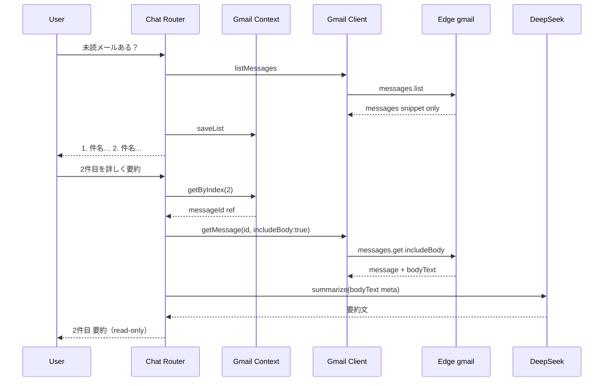

# AI秘書 — Google Chat Integration Phase 3b 設計

**実施日:** 2026-06-28  
**種別:** 調査・設計のみ（**実装 · git 変更 · commit 禁止**）  
**前提 commit:** `3b53858` — Phase 3a `feat(secretary): route google readonly intents in chat`  
**参照:** `reports/ai-secretary-google-chat-integration-plan.md` · Phase 3a 完了報告

**Secret / Token / UUID / Token Vault 実データは記載しない**

---

## 1. 目的（Phase 3b）

Phase 3a でチャットから Gmail / Calendar **read-only intent** が通った。Phase 3b では **Gmail 本文を必要時のみ取得**し、要約精度と「詳細確認」を上げる。

| ユーザー例 | Phase 3a | Phase 3b 目標 |
| --- | --- | --- |
| 「未読メールある？」 | snippet 一覧 | 維持（一覧は snippet） |
| 「昨日のメール要約して」 | snippet 束ね要約 | **本文取得後**の要約（詳細要求時） |
| 「2件目を見せて」 | 未対応 | 直前リスト文脈 → `messages.get` |
| 「このメール詳しく」 | 未対応 | 直前 1 件 or 番号指定 → 本文 + 要約 |
| 「○○からのメールの内容教えて」 | snippet のみ | 検索 → 先頭 or 指定 → 本文要約 |

**Calendar:** 原則変更なし（`listEvents` で十分）。

---

## 2. 現状

### 2.1 Edge — `secretary-google-gmail.ts`

| method | 実装 | 返却 shape |
| --- | --- | --- |
| `messages.list` | live 時、各 ref に `messages.get`（format=**full**）を逐次呼び出し | `GmailMessageCard[]` |
| `messages.get` | format=full | `normalizeMessage()` → **snippet のみ** |
| `threads.get` | format=full | 各 message を `normalizeMessage()` |
| `labels.list` | そのまま | labels |

**`GmailMessageCard` フィールド（現行）**

```
id, threadId, snippet(300), subject, from, date,
labelIds, unread, important, hasAttachment, attachments[]
```

**本文:** Gmail API `payload.parts[].body.data`（base64url）は **取得しているが破棄**。`bodyText` / `htmlBody` フィールド **なし**。

**添付:** metadata のみ（filename · mimeType · size）。**本文解析は未実装**（Phase 3c 以降）。

**サイズ制限（現行）**

| 項目 | 上限 |
| --- | --- |
| snippet | 300 文字（Edge trim） |
| subject / from | 500 文字（headers） |
| attachments | 最大 20 件 meta |
| messages.list maxResults | 1–25 |
| list 時の逐次 get | maxResults 件ぶん API 呼び出し |

**HTML / plain:** 変換ロジック **なし**。write 側 `buildMimeMessage` は text/plain 生成のみ（read とは無関係）。

### 2.2 Client — `admin-ai-secretary-google-gmail-client.js`

| API | 状態 |
| --- | --- |
| `listMessages` | `{ ok, data: { messages, mock } }` に正規化済 |
| `getMessage(id)` | `postGmail` **raw 返却**（list と shape 不統一） |
| `getThread(id)` | 同上 |
| write 系 | Human Gate 経由（Phase 3b では Router から不使用） |

Gmail UI（Dashboard パネル）は `listMessages` のみ使用。**`getMessage` / `getThread` は 6-C テストと Client surface のみ**。

### 2.3 Chat Router — Phase 3a（`admin-ai-secretary-google-chat-router.js`）

| 能力 | 状態 |
| --- | --- |
| Gmail list / snippet 要約 | ✅ |
| `getMessage` / `getThread` 呼び出し | ❌ |
| 会話文脈（直前 list） | ❌ |
| 番号指定（「2件目」） | ❌ |
| 詳細 intent | ❌ |

`gmail_summarize` は **list → snippet → DeepSeek**。本文未取得のため長文メールは精度限界あり。

### 2.4 サニタイズ資産

| 資産 | 用途 |
| --- | --- |
| Edge `sanitizeForClient` | token / refresh_token 等の除去 |
| `TasuSecretaryOpsContextSanitize` | email · phone · url · uuid マスク（OpsContext 用） |
| OAuth `scanForSecrets` | Client 応答チェック |

メール本文用の **HTML strip / body 長制限 / LLM 投入前サニタイズ** は **未整備**。

---

## 3. 既存流用

| # | 資産 | Phase 3b での使い方 |
| --- | --- | --- |
| R1 | Edge `messages.get` / `threads.get` | 本文抽出を **normalize に追加**（最小 Edge 変更） |
| R2 | Client `getMessage` / `getThread` | `includeBody` オプション + 返却正規化 |
| R3 | Phase 3a Router | intent / write 遮断 / connection check を拡張 |
| R4 | `summarizeForChat` | bodyText 投入版に分岐 |
| R5 | `deterministicGmailReply` | 一覧表示は維持 |
| R6 | `TasuSecretaryOpsContextSanitize.stripPiiPatterns` | LLM 投入前の email/url マスク（任意） |
| R7 | sessionStorage パターン | phase2 chat history と同様の TTL 付き context |
| R8 | Phase 6-C テスト | getMessage/getThread 回帰ベース |

---

## 4. 不足（Gap）

| # | 不足 | 優先度 |
| --- | --- | --- |
| G1 | Edge `bodyText` 抽出（plain / html→text） | **P0** |
| G2 | list 経路と detail 経路の **payload 分離**（list は snippet のみ維持） | P0 |
| G3 | Chat **Gmail 文脈ストア**（直前 list · 番号 ↔ messageId） | P0 |
| G4 | Router 詳細 intent（detail / detail_summarize / pick_index） | P0 |
| G5 | Client `getMessage` 返却 shape 統一 | P1 |
| G6 | 長文 truncate + DeepSeek 入力 budget | P1 |
| G7 | mock `bodyText` fixture | P1 |
| G8 | 添付ファイル内容解析 | **Out（3c）** |

**Edge 変更について:** Phase 3a は Edge 不変更だったが、**本文は Edge でしか取れない**（Client は proxy のみ）。Phase 3b は **`secretary-google-gmail.ts` の read-only 拡張 1 箇所**を許容する設計とする（write path 不触・`GMAIL_READ_METHODS` 不変）。

---

## 5. 実装案

### 5.1 Edge — 本文 plain text 化（最小）

**ファイル:** `supabase/functions/_shared/secretary-google-gmail.ts`

1. `GmailMessageCard` に optional 追加:
   ```ts
   bodyText?: string;      // plain · max 8000
   bodyTruncated?: boolean;
   ```
2. 新規 `extractPlainTextBody(payload, maxLen=8000)`:
   - MIME walk（既存 `extractAttachmentMeta` と同様）
   - **優先:** `text/plain` part の base64url decode
   - **fallback:** `text/html` → タグ除去（`<script>` `<style>` 削除 → strip tags → entity decode 最小）
   - `\r\n` 正規化 · 連続空行圧縮
   - `maxLen` 超過時 `bodyTruncated: true`
3. `normalizeMessage(raw, options?)`:
   - `options.includeBody === true` のときのみ `bodyText` 設定
   - **default false** — `messages.list` 内部 hydrate も false のまま
4. `GmailReadRequest` に `includeBody?: boolean` 追加
5. Mock messages に短い `bodyText` サンプル追加

**list 性能:** 現状も N 回 get しているが body パースは skip するため CPU 増は軽微。将来 `format=metadata` 化は別 Phase。

### 5.2 Client — get 正規化

**ファイル:** `admin-ai-secretary-google-gmail-client.js`

```javascript
async function getMessage(messageId, options) {
  const result = await postGmail({
    method: "messages.get",
    messageId: trim(messageId, 120),
    includeBody: Boolean(options?.includeBody),
  });
  if (!result.ok) return result;
  return { ok: true, data: result.data || result };
}
```

`getThread` も同様。Router は **get のみ** 使用（thread は 3b 後半 or 3c 任意）。

### 5.3 Chat Gmail 文脈（新規モジュール）

**新規:** `admin-ai-secretary-google-chat-gmail-context.js`（名称例）

```javascript
// sessionStorage key: tasu_secretary_chat_gmail_ctx_v1
{
  savedAt: ISO,
  sourceIntent: "gmail_search",
  label: "昨日届いたメール",
  items: [
    { index: 1, id, threadId, subject, from, snippet, date }  // id は UI 非表示
  ]
}
```

| ルール | 内容 |
| --- | --- |
| TTL | 15 分（phase2 ops snapshot と同程度） |
| 保存タイミング | list 系 intent 成功後（unread / search / summarize の list 段階） |
| 露出 | ユーザーには **番号 + subject + from** のみ |
| 非保存 | bodyText · token · 生 UUID |

**API surface（例）**

- `saveList(messages, meta)`
- `getByIndex(n)` → item or null
- `getLast()` → 直近 1 件
- `clear()`
- `hasContext()` — detail intent 判定用

### 5.4 Router 拡張

**ファイル:** `admin-ai-secretary-google-chat-router.js`（Phase 3a 拡張 · 新 Router ファイルは不要）

**新 intent**

| intent_id | トリガー例 | 動作 |
| --- | --- | --- |
| `gmail_detail` | 「詳しく」「内容教えて」「全文」「このメール」 | context → `getMessage({ includeBody:true })` → 要約 or 抜粋表示 |
| `gmail_pick` | 「2件目」「2番目を見せて」 | context[index] → getMessage |
| `gmail_detail_summarize` | 「2件目を要約」「昨日のメールを詳しく要約」 | pick or search+first → getMessage → DeepSeek |
| `gmail_search_and_detail` | 「田中さんからのメールの内容」 | search → 先頭 1 件 getMessage（**1 通のみ**） |

**matchIntent 優先順（追加分）**

1. write_blocked（既存）
2. **gmail_pick** — `/(\d+)件目|(\d+)番目/`
3. **gmail_detail** — `/(詳しく|内容|全文|このメール)/` + context あり or メール文脈
4. **gmail_detail_summarize** — `/要約/` + `/(詳しく|詳細|本文)/`
5. 既存 list intents（3a）

**context なしで detail 要求:** 「先にメール一覧を取得してください（例: 未読メールある？）」

**write 遮断:** 既存 `isWriteIntent` 維持 · `proposeReply` / write Client **非 import 維持**

### 5.5 要約方針

```
一覧（3a 維持）
  listMessages → snippet のみ → 番号付き一覧

詳細要約（3b）
  getMessage(includeBody:true)
    → bodyText truncate 8000（Edge 済）
    → LLM 投入前 sanitize（email/url マスク任意）
    → DeepSeek 3–8 行要約
    → 失敗時: subject + from + bodyText 先頭 500 文字 deterministic

チャット表示
  ユーザー向け: 要約 + 「N件目: 件名（差出人）」
  非表示: messageId · threadId · 生 body 全文（除非「全文見せて」明示 — それでも max 2000 文字 cap）
```

**「全文見せて」:** `gmail_detail` + param `{ mode: "full" }` — 2000 文字 cap + 添付は「N 件あり（名称のみ）」

---

## 6. Intent / Flow

### 6.1 詳細要約フロー



### 6.2 検索 → 即詳細

```
「田中さんからのメールの内容教えて」
  → gmail_search_and_detail
  → listMessages(from:田中, max 3)
  → 0件: 該当なし
  → 1件+: getMessage(先頭, includeBody) のみ（最大 1 get）
  → 要約返却 + context save（一覧も残す）
```

---

## 7. セキュリティ方針

| 項目 | 方針 |
| --- | --- |
| write API | **絶対禁止** — Router / context から write Client 非参照 |
| 返信・送信 | intent で write_blocked · `proposeReply` 不使用 |
| messageId / threadId | sessionStorage 内部のみ · DOM / console / report に **出さない** |
| bodyText | LLM 投入 max 8000 · ユーザー表示 max 2000（全文モード） |
| HTML | Edge で plain 化 · script/style 除去 |
| 添付 | 名称・size のみ · **中身解析は 3c 以降** |
| PII ログ | `console.log` 禁止 · テスト assert は pattern のみ |
| Token / UUID | 既存 sanitize 維持 · Vault 値非表示 |
| sessionStorage | chat context に token/body 過剰保存しない · TTL 15 分 |

---

## 8. テスト方針

| 層 | 内容 | スクリプト案 |
| --- | --- | --- |
| Edge unit | base64 plain · html fallback · truncate · includeBody flag | `scripts/test-secretary-google-gmail-body-extract.mjs` または 6-C 拡張 |
| Client mock | `getMessage` + `bodyText` · shape 統一 | 6-C 拡張 |
| Chat 3b E2E | list → 「2件目詳しく」→ 要約含む reply | `test-secretary-google-chat-integration-phase3b.mjs` |
| 安全 | write API 0 · disconnected 0 · secret 非露出 | 3a 踏襲 |
| 回帰 | 3a · 6-B/C/E · Step 1/2 UI | 全 PASS 維持 |
| Viewport | 1280 / 768 / 390 | 8788 |

**代表シナリオ**

1. 未読一覧 → 「2件目を見せて」→ assistant に要約/抜粋
2. 「昨日のメールを詳しく要約」→ 1 get + 要約
3. context なしで「詳しく」→ 案内メッセージ
4. 「返信して」→ write_blocked（3a 維持）
5. 「予定を追加」→ write_blocked · Calendar 不変更

---

## 9. 最小実装単位（推奨 PR 分割）

**Option A — 1 PR（依存が強いため推奨）**

| Step | 内容 | ファイル |
| --- | --- | --- |
| **3b-1** | Edge `bodyText` + `includeBody` | `secretary-google-gmail.ts` · deploy functions 同期 |
| **3b-2** | Client get 正規化 | `admin-ai-secretary-google-gmail-client.js` |
| **3b-3** | Chat Gmail context モジュール | 新規 `admin-ai-secretary-google-chat-gmail-context.js` |
| **3b-4** | Router intent 拡張 + list 後 context 保存 | `admin-ai-secretary-google-chat-router.js` |
| **3b-5** | HTML script tag 1 行 | `admin-operations-dashboard.html` |
| **3b-6** | テスト + dist + 報告 | 新規 3b test · `reports/...-phase3b.md` |

**Option B — 2 PR（Edge を先に切り出し）**

- PR1: Edge + Client + 6-C テスト（Dashboard / Chat 未接続）
- PR2: context + Router + Chat E2E

---

## 10. 変更対象ファイル（実装時 · 予定）

| ファイル | 変更 |
| --- | --- |
| `supabase/functions/_shared/secretary-google-gmail.ts` | bodyText 抽出 · includeBody |
| `deploy/cloudflare/dist/functions/_shared/secretary-google-gmail.ts` | ミラー（build 経由） |
| `admin-ai-secretary-google-gmail-client.js` | getMessage/getThread 正規化 |
| `admin-ai-secretary-google-chat-gmail-context.js` | **新規** 文脈ストア |
| `admin-ai-secretary-google-chat-router.js` | detail intents · context 連携 |
| `admin-operations-dashboard.html` | context script tag |
| `scripts/test-secretary-google-chat-integration-phase3b.mjs` | **新規** |
| `scripts/test-secretary-google-gmail-phase6c.mjs` | bodyText mock 拡張（任意） |
| `deploy/cloudflare/dist/*` | 上記ミラー |

**変更しない:** Calendar Client/UI · phase2 hook 構造 · write path · Builder/TASFUL AI/Platform/TLV · DeepSeek Pages Function 契約 · Drive/Contacts

---

## 11. Go / No-Go（実装開始条件）

| 条件 | 必須 |
| --- | --- |
| Phase 3a commit 済（`3b53858`） | ✅ |
| Edge 変更は read-only · bodyText のみ | 実装時 |
| write 経路増殖なし | 実装時 |
| 一覧は snippet 維持 | 実装時 |
| 3a 回帰 PASS | 実装後 |
| Secret / messageId 非露出 | 実装後 |

---

## 12. リスク

| リスク | 緩和 |
| --- | --- |
| HTML メールの plain 化精度 | text/plain 優先 · 失敗時 snippet fallback |
| 長文メールで LLM コスト増 | includeBody は detail 時のみ · 8000 cap |
| list 既に N 回 get 済みで遅い | 3b では許容 · 将来 metadata format |
| 「2件目」文脈切れ | TTL 15 分 · 切れ時は再一覧案内 |
| Edge 変更が必要 | read-only 最小 diff · 6-C 回帰 |

---

*Generated: 2026-06-28 · AI Secretary Google Chat Integration Phase 3b — design only*
