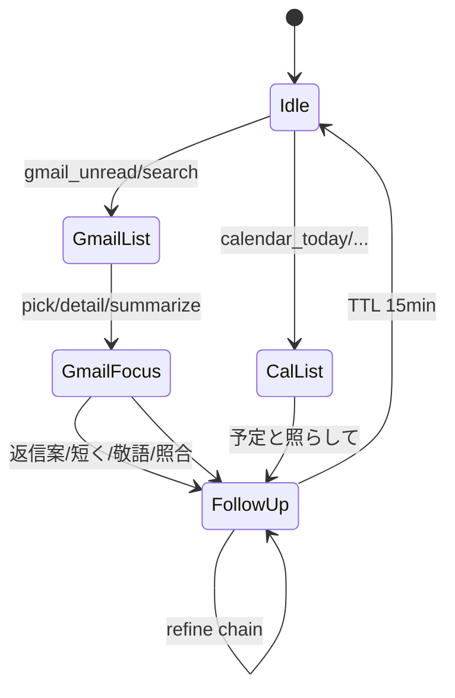
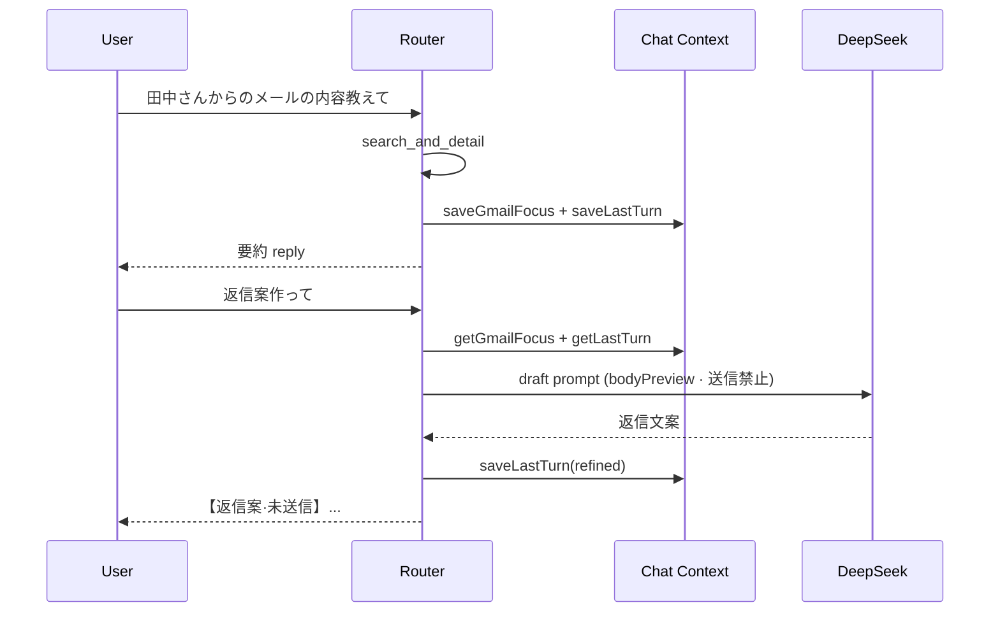

# AI秘書 — Google Chat Integration Phase 3c 設計

**実施日:** 2026-06-28  
**種別:** 調査・設計のみ（**実装 · git 変更 · commit 禁止**）  
**前提 commit:** `3b53858` (Phase 3a) · `5b02b6d` (Phase 3b)  
**参照:** `reports/ai-secretary-google-chat-integration-phase3b-plan.md` · Phase 3b 完了報告

**Secret / Token / UUID / messageId / bodyText 生データ / Token Vault 実データは記載しない**

---

## 1. 目的（Phase 3c）

Phase 3b で Gmail **本文取得・番号指定・詳細要約**まで完了。Phase 3c では **会話文脈を強化**し、直前のメール/予定/要約を踏まえた **フォローアップ会話**を可能にする。

| ユーザー例 | Phase 3b | Phase 3c 目標 |
| --- | --- | --- |
| 「未読メールある？」→「2件目詳しく」 | ✅ list + detail | 維持 |
| 「それ返信案作って」 | ❌ write_blocked | **返信文案のみ**（送信禁止） |
| 「もっと短く」「敬語にして」 | ❌ 汎用 DeepSeek へ fallthrough | **直前 assistant 出力を再整形** |
| 「今日の予定と照らして」 | ❌ | Gmail focus + Calendar today を合成要約 |
| 「このメール重要？」 | ❌ | triage 判定（read-only） |

**スコープ外（Phase 4）:** Gmail send · draft enqueue · Calendar insert/update/delete · Human Gate 実行

---

## 2. 現状

### 2.1 チャット履歴 — `admin-ai-secretary-phase2.js`

| 項目 | 実装 |
| --- | --- |
| 保存先 | `sessionStorage` key `tasu_admin_ai_secretary_chat_v1` |
| 上限 | `MAX_MESSAGES = 40` |
| 1 メッセージ shape | `{ role, content, at, channel, mock?, googleIntent?, ... }` |
| 描画 | `textContent` のみ（HTML 非使用 · XSS 低リスク） |
| 汎用 path | `requestAssistantReply(text, history)` → DeepSeek に **直近履歴**を渡す |
| Google path | `GoogleChatRouter.tryHandle(text, { history })` を **先に**呼ぶ |

**Google Router との関係**

```
dispatchSecretaryMessage
  → userMsg を history に push · DOM 描画
  → tryHandle(text, { history: history.slice(0, -1) })
       → handled=true なら assistant 返却（googleIntent 付与）
       → handled=false なら Orchestrator + 汎用 DeepSeek
```

**Gap:** Router は `options.history` を **受け取るが未使用**。フォローアップは phase2 履歴に依存せず、Router 内 intent のみで判定している。

### 2.2 Gmail list context — Phase 3b

**ファイル:** `admin-ai-secretary-google-chat-gmail-context.js`

| 項目 | 内容 |
| --- | --- |
| key | `tasu_secretary_chat_gmail_ctx_v1` |
| TTL | 15 分 |
| 保存タイミング | list 系 intent 成功後（unread / search / summarize 等） |
| items[] | `{ index, id, threadId, subject, from, snippet, date }` |
| API | `saveList` · `getByIndex` · `getLast` · `hasContext` · `clear` |

**未保存（Gap）**

- 直前 **detail 取得結果**（bodyText · 要約文）
- **active focus**（ユーザーが今議論中の 1 件）
- 直前 **assistant reply** の digest
- messageId は storage 内部のみ · DOM 非露出 ✅

### 2.3 Calendar context

**現状:** **なし**。`calendar_today` 等は reply 返却後に context 保存しない。

「今日の予定と照らして」は Phase 3c で **calendar list snapshot** が必要。

### 2.4 Router write 遮断

`isWriteIntent()` は `/返信/` を含むと **一律 write_blocked**。

→ 「返信**案**作って」も現状ブロックされる。**Phase 3c で draft 生成と execution を分離**必須。

### 2.5 既存 write 資産（Chat 未使用）

| 資産 | 用途 | Phase 3c |
| --- | --- | --- |
| `GmailClient.proposeReply` | snippet ベース返信案 · Dashboard UI | **参照のみ** — Chat からは **直接呼ばない**（Router 内 LLM で統一） |
| `enqueueDraftHumanGate` | Phase 6-D write | **禁止** |
| Edge write path | send/draft | **禁止** |

---

## 3. 既存流用

| # | 資産 | Phase 3c での使い方 |
| --- | --- | --- |
| R1 | phase2 `history` + `googleIntent` | フォールバック参照 · active turn 推定 |
| R2 | `TasuSecretaryGoogleChatGmailContext` | list 部分を **統合 context の gmail.list** に移行 or ラップ |
| R3 | Router `summarizeBodyForChat` / `deterministicBodyReply` | refine / draft の LLM 入力源 |
| R4 | `TasuSecretaryOpsContextSanitize` | bodyPreview / LLM 投入前マスク |
| R5 | Calendar `listEvents` | cross-calendar 時のみ read · snapshot 保存 |
| R6 | phase2 `tryHandle` 早期 return パターン | context intent を **fresh fetch より先**に match |
| R7 | Phase 3b テスト harness | 3c E2E 拡張ベース |

---

## 4. 不足（Gap）

| # | 不足 | 優先度 |
| --- | --- | --- |
| G1 | **統合 Google Chat Context**（gmail focus + calendar + last turn） | **P0** |
| G2 | detail / summarize 後の **focus 保存**（bodyPreview cap） | P0 |
| G3 | Calendar list **snapshot 保存** | P0 |
| G4 | フォローアップ **context intent** 群 + matcher | P0 |
| G5 | `isWriteIntent` と **返信案** の分離 | P0 |
| G6 | 「それ」「このメール」等 **代名詞解決** | P1 |
| G7 | phase2 history と context store の **二重管理整理** | P1 |
| G8 | 添付本文解析 | Out（3d 以降） |

---

## 5. 実装案

### 5.1 推奨: 統合 Context モジュール（新規）

**新規:** `admin-ai-secretary-google-chat-context.js`（名称例）

Phase 3b の `google-chat-gmail-context.js` は **list 専用**。Phase 3c は **上位統合**を追加し、gmail-context は内部 delegate または段階的に統合。

**sessionStorage key:** `tasu_secretary_chat_google_ctx_v2`  
**TTL:** 15 分（gmail-context と同値）

```javascript
{
  savedAt: ISO,
  ttlMs: 900000,
  gmail: {
    list: { label, sourceIntent, items[] },      // 3b 互換
    focus: {
      index, subject, from, snippet,
      bodyPreview,          // max 1500 · LLM 用
      bodyTruncated: bool,
      hasAttachment: bool,
      attachmentNames[]   // filename のみ
      // id / threadId: 内部のみ · export 禁止
    }
  },
  calendar: {
    list: { label, preset, items[] },  // { index, title, start, location, allDay }
    focus: { index, title, start, ... }
  },
  lastTurn: {
    sourceIntent,           // 直前 Router intent
    userTextPreview,        // max 200
    assistantPreview,       // max 800 · refine 用
    kind: "gmail"|"calendar"|"mixed"
  }
}
```

**公開 API（例）**

| API | 用途 |
| --- | --- |
| `saveGmailList(messages, meta)` | 3b 互換 |
| `saveGmailFocus(message, meta)` | detail 成功後 |
| `saveCalendarList(events, meta)` | calendar intent 成功後 |
| `saveLastTurn(meta)` | 毎 Google reply 後 |
| `getGmailFocus()` / `getCalendarList()` / `getLastTurn()` | handler 入力 |
| `hasFollowUpContext()` | context intent ゲート |
| `clear()` | TTL 失効 |

**bodyPreview 方針:** Edge `bodyText` を **1500 字 cap** して sessionStorage に保存。フル body は **保存しない**（再取得は `getMessage(includeBody)` で on-demand · API 増を許容）。

### 5.2 Router 拡張

**ファイル:** `admin-ai-secretary-google-chat-router.js`

#### A. write 遮断の refine

```javascript
function isWriteIntent(text) {
  // 「返信案|下書き案|文案」は除外
  if (/返信案|下書き案|文案|ドラフト案/.test(text)) return false;
  // 「返信して|送信|下書き保存|予定を追加…」は従来どおり block
}
```

#### B. matchIntent 優先順（追加分 · write 直後）

1. **context_refine_*** — `/もっと短く|短くして|要約して/` + hasFollowUpContext
2. **context_refine_keigo** — `/敬語|丁寧/` 
3. **context_refine_bullets** — `/箇条書き|ブレット/`
4. **context_reply_draft** — `/返信案|返信文|下書き案/` （write ではない）
5. **context_cross_calendar** — `/予定.*(照ら|比較|確認)/` + gmail focus
6. **context_triage_*** — `/重要|後で対応|優先/` + gmail focus
7. **context_more_detail** — `/^(それ|この).*(詳しく|もう少し)/` + focus
8. 既存 3a/3b intents

#### C. handler パターン

| Handler | API 呼び出し | LLM |
| --- | --- | --- |
| refine | **0**（lastTurn.assistantPreview 使用） | 再整形 |
| reply_draft | 0 または focus 無時 1× getMessage | 返信文案 |
| cross_calendar | 0（calendar snapshot 既存）または 1× listEvents(today) | 合成要約 |
| triage | 0 | 重要度/フォローアップ判定 |
| more_detail | 0（bodyPreview 拡張表示）または 1× getMessage | 追加要約 |

**DeepSeek 失敗時:** deterministic fallback（subject + snippet + 固定テンプレ）

### 5.3 phase2 変更（最小）

- **原則変更なし**（hook 1 箇所維持）
- 任意: `assistantMsg.meta = { googleContextKind }` を history に付与（DOM 非露出 · sessionStorage のみ）
- Router が context を自己完結させるなら phase2 改修 **不要**

### 5.4 Calendar snapshot

list intent 成功後:

```javascript
saveCalendarList(events, {
  label: "今日の予定",
  preset: "today",
  sourceIntent: "calendar_today"
});
```

番号指定（「3件目の予定詳しく」）は Phase 3c **後半 or 3d** — 初版は **list 全体 + focus なし** で cross-calendar 足りる。

### 5.5 Dashboard script

```html
<script src="admin-ai-secretary-google-chat-context.js"></script>
<!-- gmail-context は統合後 deprecate or delegate -->
```

---

## 6. Context model（概念）



**代名詞解決ルール**

| 語 | 解決先 |
| --- | --- |
| 「それ」「このメール」 | `gmail.focus` → 無ければ `gmail.list[0]` |
| 「2件目」 | `gmail.list[index=2]`（3b 既存） |
| 「今日の予定」 | `calendar.list`（preset=today） |
| 「さっきの要約」 | `lastTurn.assistantPreview` |

---

## 7. Intent / Flow

### 7.1 Intent 一覧（Phase 3c 追加分）

| intent_id | トリガー例 | 前提 context | 動作 |
| --- | --- | --- | --- |
| `context_more_detail` | それ詳しく · もう少し詳しく | gmail focus | bodyPreview 拡張 or re-get |
| `context_refine_short` | もっと短く · 3行で | lastTurn | LLM 短縮 |
| `context_refine_keigo` | 敬語にして · 丁寧に | lastTurn | LLM 敬語化 |
| `context_refine_bullets` | 箇条書きにして | lastTurn | LLM 箇条書き |
| `context_reply_draft` | 返信案作って · 返信文考えて | gmail focus | LLM 返信文案 · **送信なし** |
| `context_cross_calendar` | 今日の予定と照らして | gmail focus + cal list | LLM 突合 |
| `context_triage_importance` | このメール重要？ | gmail focus | LLM 重要度 |
| `context_triage_followup` | 後で対応すべき？ | gmail focus | LLM フォローアップ提案 |

**context なし時:** 「先にメールや予定を取得してください」（3b `NO_CONTEXT_REPLY` 拡張）

### 7.2 返信案フロー（Phase 3c · read-only）



**明示 footer（ユーザー向け）:** `※ read-only · 送信・下書き保存は未対応`

### 7.3 予定照合フロー

```
「今日の予定と照らして」
  → gmail.focus 必須
  → calendar.list 無ければ listEvents(today) 1回 · saveCalendarList
  → LLM: メール内容 vs 予定一覧 · 冲突/空き/アクション提案（実行なし）
```

---

## 8. セキュリティ方針

| 項目 | 方針 |
| --- | --- |
| Gmail send / draft API | **絶対禁止** — Router から write Client 非参照 |
| Calendar write | **禁止** |
| Human Gate / enqueue | **Phase 4** — 3c では UI も呼ばない |
| 返信案 | チャット **テキスト出力のみ** · 「送信しますか？」で実行に誘導しない |
| messageId / threadId | sessionStorage 内部 · DOM / console / report **禁止** |
| bodyPreview | sessionStorage max **1500** · ユーザー表示 max **2000** |
| lastTurn.assistantPreview | max **800** |
| PII ログ | `console.log` 禁止 · テストは pattern のみ |
| Token / UUID | 既存 sanitize 維持 |
| phase2 history.content | ユーザー/assistant 全文が DOM に表示 — **Google id は含めない** |

**返信案と write_blocked の境界**

| 入力 | 判定 |
| --- | --- |
| 返信案作って / 返信文を考えて | `context_reply_draft` ✅ |
| 返信して / 送信して / 下書き保存 | `write_blocked` ⛔ |

---

## 9. テスト方針

**新規:** `scripts/test-secretary-google-chat-integration-phase3c.mjs`

| 層 | シナリオ |
| --- | --- |
| Unit | context model save/load/TTL · intent matcher · write vs draft 分離 |
| Mock | list→detail→「返信案作って」→ 文案 · API write 0 |
| Refine | 「未読」→要約→「もっと短く」→ lastTurn のみ · get 0 |
| Cross | mail focus + 「今日の予定と照らして」· calendar list 1回 |
| Security | messageId / bodyPreview 非 DOM · write API 0 · disconnected 0 |
| 回帰 | 3b · 3a · 6-B/C/E · Step 1+2 |
| Viewport | 1280 / 768 / 390 @ 8788 |

---

## 10. 最小実装単位（推奨 1 PR）

| Step | 内容 | ファイル |
| --- | --- | --- |
| **3c-1** | 統合 Chat Context v2 | 新規 `admin-ai-secretary-google-chat-context.js` |
| **3c-2** | Router: save hooks（list/detail/calendar/lastTurn） | `admin-ai-secretary-google-chat-router.js` |
| **3c-3** | Router: context intents + isWriteIntent refine | 同上 |
| **3c-4** | gmail-context delegate or deprecate | `google-chat-gmail-context.js` 薄ラッパ |
| **3c-5** | dashboard script tag | `admin-operations-dashboard.html` |
| **3c-6** | 3c test + dist + 報告 | 新規 test · report |

**Edge / Gmail Client / Calendar Client:** 変更 **なし**（read path 再利用のみ）

**Option B — 2 PR**

- PR1: context store + save hooks + tests
- PR2: context intents + refine/draft/cross

---

## 11. 変更対象ファイル（実装時 · 予定）

| ファイル | 変更 |
| --- | --- |
| `admin-ai-secretary-google-chat-context.js` | **新規** 統合 context |
| `admin-ai-secretary-google-chat-gmail-context.js` | delegate 化 or 統合後削除 |
| `admin-ai-secretary-google-chat-router.js` | context intents · save hooks · write refine |
| `admin-operations-dashboard.html` | script tag 1 行 |
| `scripts/test-secretary-google-chat-integration-phase3c.mjs` | **新規** |
| `deploy/cloudflare/dist/*` | ミラー |

**変更しない:** phase2 hook 構造 · Edge · write path · Builder/TASFUL AI/Platform/TLV · DeepSeek Pages Function · Drive/Contacts

---

## 12. Go / No-Go（実装開始条件）

| 条件 | 必須 |
| --- | --- |
| Phase 3b commit 済（`5b02b6d`） | ✅ |
| 返信案 = テキストのみ · send 禁止 | 実装時 |
| Human Gate 非接続 | 実装時 |
| context 無時の安全案内 | 実装時 |
| 3b 回帰 PASS | 実装後 |

---

## 13. リスク

| リスク | 緩和 |
| --- | --- |
| 「返信」と「返信案」の誤 block/allow | regex 優先順 · 3c テスト固定ケース |
| sessionStorage 肥大 | bodyPreview 1500 · lastTurn 800 cap |
| 代名詞「それ」の誤解決 | focus 必須 · 曖昧時は確認質問 |
| phase2 history と context 不整合 | lastTurn を Router が毎回更新 |
| 汎用 DeepSeek との競合 | context intent を Router 内で **handled=true** 完結 |

---

*Generated: 2026-06-28 · AI Secretary Google Chat Integration Phase 3c — design only*
