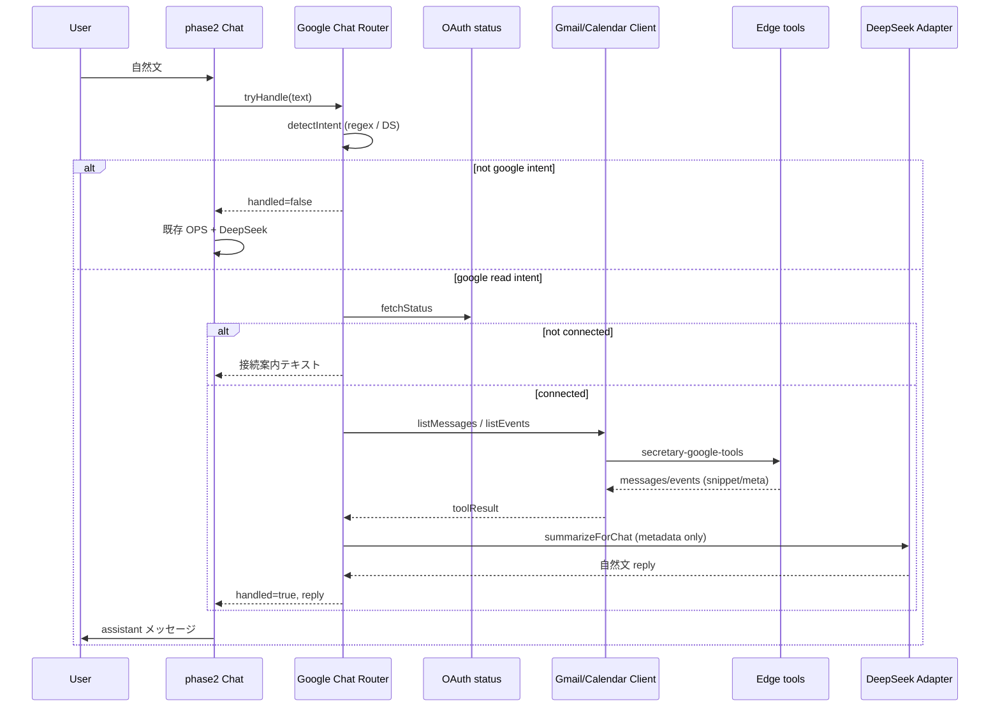

# AI秘書 Google Integration Phase 3 — チャット ↔ Gmail / Calendar 自然言語連携 設計

**実施日:** 2026-06-28  
**種別:** 調査・設計のみ（**実装 · git 変更 · commit 禁止**）  
**前提 commit:** `23ea8e7` — Step 2 `feat(secretary): add gmail labels and calendar list readonly ui`  
**参照:** `docs/AI/SECRETARY_AI.md` · Step 1/2 read-only UI 完了報告 · Phase 7-A Orchestrator

**Secret / Token / UUID / Token Vault 実データは記載しない**

---

## 1. 目的（Phase 3）

Google OAuth · Gmail · Calendar **read-only** が Dashboard UI まで完成した前提で、**AI秘書メインチャット**から自然文だけで Gmail / Calendar を利用できるようにする。

| 例（ユーザー発話） | 期待 |
| --- | --- |
| 「未読メールある？」 | 未読件数 + 件名一覧要約 |
| 「今日の予定は？」 | 今日の events 要約 |
| 「明日の予定教えて」 | tomorrow preset |
| 「○○さんからメール来てる？」 | from 検索 |
| 「昨日届いたメールを要約して」 | 日付 + 一覧 → 要約 |
| 「今週の予定を教えて」 | this_week preset |

**UI 方針:** チャットログのみ完結。サイドパネル · Google カード · Workspace Assistant 入力欄は **増やさない**。

---

## 2. 現状（棚卸し）

### 2.1 チャット本体

| 資産 | ファイル | 現状 |
| --- | --- | --- |
| **テキストチャット入口** | `admin-ai-secretary-phase2.js` | `[data-ops-secretary-input]` → `dispatchSecretaryMessage()` |
| **Voice 共通入口** | 同上 + `admin-ai-secretary-voice-integration.js` | `submit()` → 同一 `dispatchSecretaryMessage` |
| **会話ログ** | `[data-ops-phase2-chat-log]` | user / assistant テキストのみ |
| **DeepSeek 応答** | `TasuSecretaryDeepSeekAdapter.completeTurn()` | OpsContext 注入した **汎用秘書応答** |
| **モック応答** | `mockSecretaryReply()` | 挨拶 · 未対応/優先 の定型のみ。**Gmail/Calendar 未対応** |

**現フロー（簡略）**

```
ユーザー入力
  → TasuSecretaryOrchestrator（OPS 分類 · Agent stub · Human Gate L1–L4）
  → DeepSeek 汎用 reply（OpsContext 付き systemPrompt）
  → チャットログに assistant テキスト
```

**ギャップ:** Google Client / Edge は **呼ばれない**。自然文「未読メールある？」は DeepSeek 推測 or モック定型に留まる。

### 2.2 自然文解析（Intent）

| 資産 | スコープ | Gmail/Calendar |
| --- | --- | --- |
| `TasuSecretaryOpsContextBuilder.resolveIntent()` | OPS 6 ドメイン filter のみ | ❌ |
| `TasuSecretaryClassifier` | OPS Agent 分類（builder/ci/security…） | ❌ google カテゴリなし |
| `TasuSecretaryDeepSeekClassifier` | OPS structured 分類 | ❌ |
| **`TasuSecretaryGoogleOrchestrator.parseIntent()`** | Workspace 用 6 intent | △ **write 寄り**（返信 · 予定作成 · Drive） |

**Google Orchestrator 既存 INTENTS（Phase 7-A）**

| intent | 主用途 | Phase 3 |
| --- | --- | --- |
| `gmail_reply` | 返信案 → Human Gate → Draft | ❌ 禁止 |
| `calendar_create` | 予定作成 → Human Gate | ❌ 禁止 |
| `gmail_drive_search` | Gmail + Drive 横断 | △ Gmail 部分のみ流用可 |
| `gmail_search` | `listMessages` | ✅ ベース |
| `contacts_search` / `drive_search` | スコープ外 | ❌ |

**regex fallback（`parseIntentFallback`）:** 「返信」「打ち合わせ/予定」「探して」等。**read-only 専用 intent は未定義**。

### 2.3 Tool Router / Google Tool

| レイヤ | 資産 | read 能力 |
| --- | --- | --- |
| **OAuth** | `TasuSecretaryGoogleOAuthClient.fetchStatus()` | connected / mock 判定 |
| **Gmail Client** | `admin-ai-secretary-google-gmail-client.js` | `listMessages`（preset q · labelIds）· `getMessage` · `getThread` · `listLabels` |
| **Calendar Client** | `admin-ai-secretary-google-calendar-client.js` | `listCalendars` · `listEvents`（preset: today/tomorrow/this_week/next_7_days · q）· `getEvent` |
| **Edge** | `secretary-google-tools` | gmail read 4 method · calendar_read 3 method · **write 403** |
| **UI gating** | `TasuSecretaryGoogleReadonlyCoordinator` | パネル refresh · 接続状態 — **チャット未連携** |

**Gmail PRESETS（Client）:** `unread` · `important` · `attachment` · `inbox`  
**Calendar PRESETS（Client）:** `today` · `tomorrow` · `this_week` · `next_7_days`

**本文取得の現状**

- Edge `messages.list`（live）は内部で `messages.get` を逐次呼ぶが、`normalizeMessage()` は **snippet + metadata のみ**（本文 plain/html 未抽出）
- `messages.get` も同 shape — **フル本文フィールドなし**
- 要約 MVP は **snippet ベース**が Edge 変更なしの最小線

### 2.4 Orchestrator（2 系統 — 混同注意）

| 名称 | ファイル | 役割 | チャット連携 |
| --- | --- | --- | --- |
| **OPS Orchestrator** | `admin-ai-secretary-orchestrator.js` | Inbox/CI Agent 分類 · Task Queue · L1–L4 | ✅ phase2 から毎回呼び出し |
| **Google Workspace Orchestrator** | `admin-ai-secretary-google-orchestrator.js` | Gmail/Calendar Tool 実行 · Plan/Log | ❌ **別 UI のみ** |

**Workspace Assistant UI（チャットと分離）**

- DOM: `[data-ops-google-workspace-assistant-input]`（Dashboard Google タブ内）
- `runWorkspaceRequest()` → Plan 表示 · Human Gate ボタン
- メインチャット `[data-ops-secretary-input]` とは **未接続**

### 2.5 Human Gate

| 経路 | 用途 | Phase 3 |
| --- | --- | --- |
| OPS `TasuSecretaryHumanGate` | L3/L4 運営操作 | 維持（Google と独立） |
| Google `enqueueDraftHumanGate` / `enqueueCalendarHumanGate` | Gmail Draft · Calendar 作成 | **ルーターで到達禁止** |
| Google Orchestrator write step | `kind: "write"` | 実行ループで skip 済みだが intent 自体が write 系 |

**Phase 3 方針:** read-only intent **allowlist** のみ。write 系 intent は解析段階で reject または read 相当へフォールバック（「返信して」→「読むだけ」案内）。

### 2.6 DeepSeek（要約層）

| 用途 | 既存 |
| --- | --- |
| チャット reply | `phase2.requestAssistantReply` |
| Google 要約 | `GoogleOrchestrator.runSummarize`（検索結果 3 行要約） |
| 返信案 | `GmailClient.proposeReply` — **Phase 3 禁止** |

Adapter: `TasuSecretaryDeepSeekAdapter.completeTurn()` · modeId `ops_secretary` · mock fallback あり。

---

## 3. 既存流用（最優先）

| # | 流用元 | Phase 3 での使い方 |
| --- | --- | --- |
| R1 | `TasuSecretaryGoogleGmailClient.listMessages` | unread / from / keyword / 昨日 q |
| R2 | `TasuSecretaryGoogleCalendarClient.listEvents` | preset + optional q |
| R3 | `TasuSecretaryGoogleOAuthClient.fetchStatus` | 未接続時チャット案内 |
| R4 | `ReadonlyCoordinator.isConnected` / `syncConnection` | 接続 gating（任意 · Client status でも可） |
| R5 | `GoogleOrchestrator.parseIntent` **パターン** | DeepSeek JSON intent + regex fallback |
| R6 | `GoogleOrchestrator.runSummarize` **パターン** | Tool 結果 → DeepSeek 3–5 行要約 |
| R7 | `GoogleOrchestrator.ensureConnected` | not_connected エラー統一 |
| R8 | `GoogleOrchestrator.sanitizeRun` 思想 | チャットログに token/uuid 非露出 |
| R9 | `phase2.dispatchSecretaryMessage` | **pre-tool hook 1 箇所**でチャット統合 |
| R10 | `phase2.submit` / Voice | 同一経路で Voice も自然に対応 |
| R11 | Phase 6-B/C/E テスト · Live post-consent | 回帰ベース |
| R12 | Edge `secretary-google-tools` | **変更なし** |

**新規 UI 不要:** 既存 chat log テキスト出力のみ。

---

## 4. 不足（Gap）

| # | 不足 | 影響 | 優先度 |
| --- | --- | --- | --- |
| G1 | **チャット → Google Tool ルーター** | 現状ゼロ | P0 |
| G2 | **read-only 専用 Intent 定義** | 7-A は write 中心 | P0 |
| G3 | **phase2 と Google Orchestrator の統合点** | 二重 UI | P0 |
| G4 | **メール本文（full body）** | Edge normalize に body なし | P2（MVP は snippet） |
| G5 | **「要約」 intent と 2 段 fetch** | list → summarize → optional get | P1 |
| G6 | **write intent ブロック** | 誤ルーティングリスク | P0 |
| G7 | **未接続 / mock 時のチャット文言** | UX | P1 |
| G8 | **チャット専用テスト** | mock intent + tool + reply | P1 |
| G9 | **OpsContext と Google 結果の優先順** | 同時注入の混乱 | P1 |

---

## 5. 実装案

### 5.1 推奨アーキテクチャ（最小）

**新規モジュール 1 本（薄い Router）** + **phase2 フック 1 箇所**

```
admin-ai-secretary-google-chat-router.js   （新規 · 名称例）
  ├─ detectGoogleIntent(userText)          regex + DeepSeek JSON
  ├─ executeReadTool(intent, params)       Gmail/Calendar Client のみ
  ├─ summarizeForChat(toolResult, userText) DeepSeek · snippet/metadata のみ
  └─ formatChatReply(summary)              プレーンテキスト（カード HTML なし）
```

**phase2 変更（1 関数内）**

```javascript
// dispatchSecretaryMessage 内 · userMsg 保存後 · OPS Orchestrator 前後どちらか
const googleRoute = await GoogleChatRouter.tryHandle(text, { history });
if (googleRoute.handled) {
  // assistantMsg = googleRoute.reply （tool 実行済み · write 未使用）
  return;
}
// 既存: OPS Orchestrator + DeepSeek 汎用 reply
```

**配置順の推奨:** OPS Orchestrator **の前**に Google Router を置く。Google 命中時は OPS stub をスキップ可（無駄な L3 判定を避ける）。非命中時は現行どおり。

### 5.2 Workspace Orchestrator との関係

| 選択肢 | 内容 | 推奨 |
| --- | --- | --- |
| A | `GoogleOrchestrator` を拡張し chat から `runWorkspaceRequest` 直呼び | ❌ write intent · Plan UI 前提が混ざる |
| B | read step 関数（`runGmailSearch` 等）を共有 export | △ 可能だが write step 同居 |
| **C** | **Chat Router が Client を直接呼ぶ**（7-A と intent 表のみ概念共有） | ✅ **最小 · write 隔离** |

Phase 3 は **C** を推奨。7-A の `parseIntent` は **参考実装**として read intent 用に fork / 別 enum。

### 5.3 データ取得順（メール）

ユーザー要件どおり **3 段階:**

```
1. listMessages（maxResults 5–10 · subject/from/snippet/date のみ）
2. ユーザーが「要約」「詳しく」等 → DeepSeek に snippet 束ねて要約
3. 「全文」「このメールの内容」等の明示時のみ getMessage / getThread
   ※ MVP: get も snippet 止まり（Edge 拡張は Phase 3b）
```

Calendar は **listEvents のみ**で足りる（title/start/location/attendeeCount）。

### 5.4 write 遮断

| 層 | 手段 |
| --- | --- |
| Intent allowlist | read 7 種のみ受理 |
| Router | `gmail_write` / `calendar_write` Client 関数を **import しない** |
| 自然文 | 「返信して」「予定入れて」→ 固定文言「read-only のため…」 |
| Human Gate | Router から **enqueue 系を呼ばない** |

### 5.5 未接続時

```
Google 未接続 → assistant:
「Google アカウントが未接続のためメール/予定を取得できません。
 Dashboard の Google 接続から OAuth を完了してください。」
（email · token · UUID は出さない）
```

`fetchStatus().connected === false && mock === false` で判定。

---

## 6. Intent 一覧（Phase 3 · read-only）

| intent_id | ユーザー例 | Tool | Client 呼び出し |
| --- | --- | --- | --- |
| `gmail_unread` | 未読メールある？ / 未読は？ | Gmail | `listMessages({ preset: "unread", maxResults: 10 })` |
| `gmail_search` | ○○さんからメール / 件名に見積 | Gmail | `listMessages({ q: "from:…" or keyword, maxResults: 10 })` |
| `gmail_search_date` | 昨日届いたメール | Gmail | `listMessages({ q: "after:YYYY/MM/DD before:…", maxResults: 10 })` |
| `gmail_summarize` | 昨日のメールを要約して | Gmail + DS | list → `summarizeForChat` |
| `calendar_today` | 今日の予定は？ | Calendar | `listEvents({ preset: "today" })` |
| `calendar_tomorrow` | 明日の予定 | Calendar | `listEvents({ preset: "tomorrow" })` |
| `calendar_week` | 今週の予定 | Calendar | `listEvents({ preset: "this_week" })` |
| `calendar_search` | ○○ についての予定 / 会議 検索 | Calendar | `listEvents({ preset: "next_7_days", q: keyword })` |
| `none` | それ以外 | — | 既存 DeepSeek 汎用へフォールスルー |

**params 例（DeepSeek / regex 共通）**

```json
{
  "intent": "gmail_search",
  "params": {
    "contactName": "田中",
    "query": "見積",
    "dateHint": "yesterday"
  }
}
```

**regex fallback（オフライン · DeepSeek 未設定）:** 日本語キーワード表（未読 · 今日 · 明日 · 今週 · 昨日 · さん · 要約 · 予定）— 7-A `parseIntentFallback` と同粒度。

---

## 7. Tool Flow

### 7.1 全体



### 7.2 未読メール

```
「未読メールある？」
  → intent: gmail_unread
  → listMessages(unread, max 10)
  → 0件: 「未読はありません」
  → N件: DeepSeek「未読 N 件: 1) 件名 … 2) …」
```

### 7.3 要約（2 段）

```
「昨日届いたメールを要約して」
  → intent: gmail_summarize + dateHint=yesterday
  → listMessages(q=after/before, max 5)
  → summarizeForChat(snippets only, userText)
  → 「昨日 N 件。主な内容: …」
```

### 7.4 今日の予定

```
「今日の予定は？」
  → intent: calendar_today
  → listEvents(preset=today, max 25)
  → 0件 / N件を時刻順テキスト化（DeepSeek 整形 optional）
```

---

## 8. テスト方針

| 層 | 内容 | スクリプト案 |
| --- | --- | --- |
| Unit | intent regex · allowlist · write reject · date q builder | `test-secretary-google-chat-router-unit.mjs` |
| Mock fetch | connected mock · labels/messages/events 固定 · chat DOM | `test-secretary-google-chat-integration.mjs` |
| 回帰 | 6-B/C/E · Step 1/2 UI · 7-A Workspace **退行なし** | 既存スクリプト全 PASS |
| チャット E2E | 1280/768/390 · `[data-ops-phase2-chat-log]` に assistant 応答 · JS fatal 0 | 8788 |
| Live | post-consent · **再 consent 不要** · 空 inbox/calendar OK | verify 拡張（任意 · Phase 3 実装後） |
| Secret | DOM/console に token/uuid なし · toolResult sanitize | 全層 |

**代表 assert（mock）**

1. 「未読メールある？」→ assistant に「未読」+ 件名
2. 「今日の予定は？」→ assistant に予定 or なし
3. 「返信して」→ write 未呼び出し · read-only 案内
4. disconnected → OAuth 案内 · tools API 0 回
5. 非 Google「Connect 未対応は？」→ 既存 OPS/DeepSeek 経路（フォールスルー）

---

## 9. リスク

| リスク | 緩和 |
| --- | --- |
| DeepSeek が write intent を返す | allowlist + schema 固定 · fallback regex |
| 本文要約精度（snippet のみ） | MVP 明示 · Phase 3b で Edge body extract |
| `messages.list` live が N 回 get で遅い | maxResults 5 · 要約時のみ |
| OPS Orchestrator と二重応答 | `handled` フラグで早期 return |
| mock 時に live と UX 差 | status 行に mock 注記（チャット文末 · 1 行） |
| Voice 経路 | 同一 `submit()` — Router 共通化で自動対応 |
| RELEASE FROZEN 抵触 | Secretary Critical 扱い · 選別 commit · Edge 不変更 |

---

## 10. 最小実装単位（推奨 PR 分割）

**1 PR = Phase 3 全体可**（Router 薄い · phase2 フック 1 箇所 · Edge 不変更）

| Step | 内容 | ファイル（予定） |
| --- | --- | --- |
| **3-0** | `google-chat-router.js` 新規 · intent enum · regex · allowlist | 新規 |
| **3-1** | Gmail read 実行 + チャット reply 整形 | 同上 |
| **3-2** | Calendar read 実行 | 同上 |
| **3-3** | DeepSeek summarize 層（snippet/meta のみ） | 同上 |
| **3-4** | `phase2.dispatchSecretaryMessage` フック | `admin-ai-secretary-phase2.js` |
| **3-5** | Dashboard script tag 追加 | `admin-operations-dashboard.html` |
| **3-6** | mock 統合テスト + 回帰 | `scripts/test-secretary-google-chat-integration.mjs` |
| **3-7** | dist 同期 · 完了報告 | AD-009 |

**意図的に後回し（Phase 3b）**

- Edge `normalizeMessage` に plain body 追加
- Live チャット E2E（Vault bootstrap）
- `messages.get` 全文フォローアップ会話
- Calendar 複数 calendarId 選択（チャット内は primary 固定で可）

---

## 11. Go / No-Go（実装開始条件）

| 条件 | 必須 |
| --- | --- |
| Step 2 commit 済（`23ea8e7`） | ✅ |
| Edge 変更なし（Phase 3 初回） | ✅ |
| write Client / Human Gate 未到達 | ✅ |
| チャットのみ UI（カード追加なし） | ✅ |
| 8788 回帰 PASS | 実装後 |
| Secret 非露出 | 実装後 |

---

## 12. 変更対象ファイル（実装時 · 予定）

| ファイル | 変更 |
| --- | --- |
| `admin-ai-secretary-google-chat-router.js` | **新規** — intent · tool · summarize · chat reply |
| `admin-ai-secretary-phase2.js` | `dispatchSecretaryMessage` pre-hook |
| `admin-operations-dashboard.html` | script tag 1 行 |
| `scripts/test-secretary-google-chat-integration.mjs` | **新規** |
| `deploy/cloudflare/dist/*` | 上記ミラー |
| `reports/ai-secretary-google-chat-integration-step3.md` | 実装後報告 |

**変更しない:** Edge · Workspace Assistant UI · Gmail/Calendar パネル UI · Builder/TASFUL AI/Platform/TLV · DeepSeek Pages Function 契約

---

*Generated: 2026-06-28 · AI Secretary Google Integration Phase 3 — design only*
