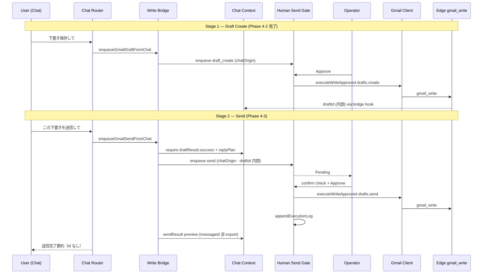

# AI秘書 — Google Integration Phase 4-3 設計（Gmail Send · Human Gate 二段承認）

**実施日:** 2026-06-28  
**種別:** 調査・設計のみ（**実装 · git 変更 · commit 禁止**）  
**前提 commit:** `6e6b616` — `feat(secretary): execute approved gmail draft creation`  
**参照:** `reports/ai-secretary-google-phase4-human-gate-plan.md` · `reports/ai-secretary-google-phase4-2-gmail-draft-execute.md` · `reports/secretary-google-phase6d-gmail-write-human-gate.md`

**Secret / Token / UUID / messageId / threadId / draftId / bodyText 生データ / Token Vault 実データは記載しない**

---

## 1. 目的

Phase 4-2 で **Human Gate 承認済み `drafts.create`** まで接続済み。Phase 4-3 では、その下書きを起点に **別 pending · 別承認 · 別 execute** で Gmail Send へ安全に進む設計を定義する。

| 原則 | 内容 |
| --- | --- |
| Chat から send 直接実行禁止 | Router / Bridge は **enqueue のみ** |
| executeWriteApproved | **HSG `approveAndExecute` 経由のみ** |
| Draft Create と Send の分離 | intent · pending type · executor · context state を独立 |
| Send は Draft より強い gate | severity 引き上げ · 送信前 preview 必須 · `drafts.send` 優先 |
| 送信後 rollback なし | 自動取り消し · compensating send **実装しない** |

**Phase 4-3 スコープ外:** Calendar · Builder · Platform · TLV · TASFUL AI · Drive · Contacts · Edge / OAuth / DeepSeek 本体変更

---

## 2. 現状調査サマリ

### 2.1 完了済み（Phase 4-1 / 4-2 · commit `995055b` / `6e6b616`）

| 能力 | 状態 | 主要ファイル |
| --- | --- | --- |
| Chat「下書き保存して」→ HSG enqueue | ✅ | `write-bridge.js` · `router.js` |
| Dashboard 承認 → `drafts.create` | ✅ | `admin-ai-human-send-gate.js` |
| Chat context 同期（draft 成功/失敗） | ✅ | `chat-context.js` · bridge hooks |
| Chat 由来 send execute | ⛔ **意図的ブロック** | HSG L467–473 |
| send API（Chat フロー） | **0** | Phase 4-2 テストで検証 |

**Phase 4-2 後の Chat 状態（内部）**

```
gmail.draftResult = { success, subjectPreview, draftId (内部), ... }
gmail.pendingGate = null  // 成功後 clear
gmail.replyPlan   = { subject, body, recipient, ... (内部 id あり) }
```

### 2.2 既存 Send 資産（Dashboard · Phase 6-D · 再利用対象）

| 資産 | ファイル | 内容 |
| --- | --- | --- |
| `enqueueSendHumanGate` | `admin-ai-secretary-google-gmail-client.js` | `gmailAction: "send"` · `draftId` 付き HSG enqueue |
| `executeWriteApproved` send 分岐 | 同上 + HSG | `draftId` あり → `drafts.send` · なし → `messages.send` |
| Dashboard 二段 UI | `admin-ai-secretary-google-gmail-ui.js` | 下書き保存 → 承認作成 → **送信確認 enqueue** → **チェックボックス** → 最終送信 |
| Edge write | `secretary-google-gmail.ts` | `drafts.send` / `messages.send` · `humanGateApproved` + `pendingId` 必須 |

**6-D Dashboard フロー（参照実装）**

```
返信案 → 下書き保存 enqueue → 承認 → drafts.create → draftId 保持
      → 送信確認 enqueue (send) → 確認チェック → 承認 → drafts.send
```

Chat Phase 4-3 は **HSG パネル（案 A）** を主経路とし、6-D の **確認チェック UX** を HSG send カードへ移植する。

### 2.3 Router / Intent 現状

**ファイル:** `admin-ai-secretary-google-chat-router.js`

| 入力例 | 現 intent | Phase 4-3 方針 |
| --- | --- | --- |
| 返信案作って | `context_reply_draft` | 維持 |
| 下書き保存して | `write_enqueue_gmail_draft` | 維持 |
| 送信して / 返信して | `write_blocked` | **維持 block** |
| この下書きを送信して | （未実装） | **新規** `write_enqueue_gmail_send` |
| 下書きを送信 / 承認済み下書きを送 | （未実装） | 同上（パターン要 unit 定義） |

`isWriteIntent()` は `isDraftEnqueueIntent` / 将来 `isSendEnqueueIntent` を **先に除外** する現構造を維持。

### 2.4 HSG 現状ギャップ（Phase 4-3 で埋める）

| # | Gap | 影響 |
| --- | --- | --- |
| G1 | Chat send enqueue intent / bridge 未実装 | ユーザーが send pending まで到達不可 |
| G2 | `enqueueSendHumanGate` に `chatOrigin` 未透過 | Chat / Dashboard 混在時の監査・hook 分岐不可 |
| G3 | Chat 由来 send が HSG execute で hard block | 4-3b で **send pending のみ** 解除 |
| G4 | HSG `renderPendingCard` が to/subject/body を構造化表示しない | 誤送信リスク · preview 要件未達 |
| G5 | Send 用 confirm checkbox が HSG に無い（6-D は Gmail カード側のみ） | 二段承認の「弱い gate」 |
| G6 | `draftResult.draftId` は内部保存済みだが send enqueue 未接続 | 4-3a で bridge が参照 |
| G7 | Send 成功後の Chat context / audit 同期未設計 | 4-3c |
| G8 | `messages.send` fallback が Chat send に使える余地 | Chat は **`drafts.send` のみ** に制限（設計判断） |

---

## 3. 目標アーキテクチャ

### 3.1 全体フロー（10 ステップ）

```
 1. 返信案作って          → context_reply_draft (LLM · API 0)
 2. 下書き保存して        → write_enqueue_gmail_draft (API 0)
 3. Dashboard 承認        → approveAndExecute #1
 4. drafts.create         → draftId 内部保存 · draftResult.success
 5. この下書きを送信して  → write_enqueue_gmail_send (API 0)
 6. Human Gate Pending #2  → gmailAction: send · severity: critical
 7. Dashboard 二段承認    → preview 確認 + confirm checkbox → Approve
 8. Gmail Send            → executeWriteApproved(drafts.send) ONLY
 9. Audit 更新            → execution log · outcome=sent
10. Chat context 同期     → sendResult preview · pending 消去
```



### 3.2 責務分離（Draft Create vs Send）

| 観点 | Draft Create (4-2) | Send (4-3) |
| --- | --- | --- |
| Chat intent | `write_enqueue_gmail_draft` | `write_enqueue_gmail_send` |
| HSG `payload.gmailAction` | `draft_create` | `send` |
| Context pending kind | `gmail_draft` | `gmail_send` |
| Execute method | `drafts.create` | **`drafts.send` のみ**（Chat） |
| 前提条件 | replyPlan + focus | **draftResult.success** + replyPlan |
| HSG severity | `warning` | **`critical`** |
| 確認 UI | proposal 表示 | **to / subject / body preview + confirm checkbox** |
| 失敗時 | pending 維持 (Retry) | 同型 |
| 成功後 rollback | 手動（Gmail UI 下書き削除） | **不可（自動 rollback なし）** |
| Bridge hook | `handleGateExecutionResult` | **`handleGateSendExecutionResult`**（新規） |

### 3.3 API 呼び出し境界

```
┌──────────────────────────────────────────────────────────────┐
│  Chat Router / Write Bridge                                  │
│  · read: Gmail/Calendar Client (既存)                        │
│  · write: enqueueDraftHumanGate / enqueueSendHumanGate のみ  │
│  · executeWriteApproved 呼び出し ⛔                           │
└────────────────────────────┬─────────────────────────────────┘
                             │ enqueue (API 0)
                             ▼
┌──────────────────────────────────────────────────────────────┐
│  Human Send Gate                                             │
│  · pending queue · preview UI · approve/reject/retry         │
│  · approveAndExecute → executeHumanSendAction のみ           │
└────────────────────────────┬─────────────────────────────────┘
                             │ humanGateApproved + pendingId
                             ▼
┌──────────────────────────────────────────────────────────────┐
│  Gmail Client.executeWriteApproved                           │
│  · postGmailWrite → Edge secretary-google-tools              │
└────────────────────────────┬─────────────────────────────────┘
                             ▼
┌──────────────────────────────────────────────────────────────┐
│  Edge secretary-google-gmail.ts                              │
│  · assertHumanGate · drafts.create | drafts.send             │
│  · messages.send（Chat 4-3 では Client 側で到達禁止）        │
└──────────────────────────────────────────────────────────────┘
```

---

## 4. Human Gate 二段承認設計

### 4.1 なぜ「二段」か

| 段階 | 運営者が確認すること | リスク |
| --- | --- | --- |
| **第 1 段（4-2）** | 文案が Gmail 下書きとして保存される内容 | 誤下書き（修正可能） |
| **第 2 段（4-3）** | **実際に外部へメールが送信される** | **不可逆** |

同一 pendingId の再利用は **禁止**。Send は **常に新規 pending** を enqueue する。

### 4.2 Send pending item shape（案）

既存 `enqueueFromGmailDraft` を拡張（Edge 変更なし）:

```javascript
{
  source: "gmail",
  category: "user_reply",
  actionType: "human_send",
  severity: "critical",                    // draft_create は warning
  recommendation: "Gmail 送信確認: {subject}",
  reason: "Gmail — 送信 Human Gate 必須（不可逆 · 自動送信禁止）",
  payload: {
    gmailAction: "send",
    chatOrigin: true,
    chatIntent: "write_enqueue_gmail_send",
    priorDraftPendingId: "...",              // 監査用 · DOM 非表示
    draftCreatedAt: "ISO8601",               // 第 1 段完了時刻
    to, subject, body,                       // execute / preview 用
    draftId: "...",                          // 内部 · HSG 詳細 UI のみ（esc 済み · id 風文字列はマスク検討）
    messageId, threadId, replyToMessageId,   // 内部 · export 禁止
  }
}
```

### 4.3 送信前 Preview（HSG カード拡張 · 4-3b）

**現状:** `renderPendingCard` は `proposal` 全文のみ — send には不十分。

**4-3b 追加（`payload.gmailAction === "send"` 時のみ）**

| 表示項目 | ソース | 制限 |
| --- | --- | --- |
| 宛先 (To) | `payload.to` | max 200 · esc |
| 件名 | `payload.subject` | max 200 · esc |
| 本文 preview | `payload.body` | max 1500 · 末尾 `…` |
| 操作種別 | 固定ラベル「Gmail 送信（不可逆）」 | — |
| 第 1 段完了 | `draftCreatedAt` または audit log 参照 | 日時のみ |
| Confirm checkbox | `送信内容を確認しました（取り消し不可）` | **Approve ボタン disabled 直到 checked** |

**禁止:** draftId / messageId / threadId / pendingId を Chat DOM · console · 公開 preview API に露出。

Dashboard Gmail カード（6-D）の confirm パターンを HSG send カードへ **移植** — 新規 Edge 不要。

### 4.4 Approve ボタン制御（Send 専用 · 強 gate）

```
[ ] 送信内容を確認しました（取り消し不可）
[ 承認して送信 ]  ← checkbox 未チェック時 disabled
[ 却下 ]
```

- `data-hsg-send-confirm` + `data-hsg-approve` 連動（6-D `data-gmail-confirm-check` 同型）
- Approve click 時に checkbox 再検証（DOM 改ざん対策 · client-side）
- Server-side: 既存 `humanGateApproved` + `pendingId`（変更なし）

### 4.5 Reject / Retry / Pending

| 操作 | Send pending 挙動 | Chat context |
| --- | --- | --- |
| **Pending** | enqueue 後 · execute 失敗後 | `pendingGate.kind=gmail_send` · `state=pending` |
| **Reject** | status=rejected · queue から除外 | `clearSendPendingGate` |
| **Retry** | execute 失敗 → status 維持 pending（4-2 同型） | `keepPending: true` + errorPreview |
| **Approve 成功** | status=approved · drafts.send 1 回 | `sendResult` + pending 消去 |

---

## 5. Chat Intent / Router 設計

### 5.1 新規 intent

```javascript
INTENTS.write_enqueue_gmail_send = "write_enqueue_gmail_send"
```

### 5.2 判定関数（案）

```javascript
function isSendEnqueueIntent(text) {
  return /この下書き.*送信|下書き.*送信して|承認済み.*下書き.*送|Gmail.*下書き.*送信/i.test(text);
}

function isBareSendIntent(text) {
  return /^(送信して|返信して|送って|メール.*送)/i.test(trim(text));
}
```

**matchIntent 優先順**

1. propose intents（返信案 · refine）
2. `isDraftEnqueueIntent` → `write_enqueue_gmail_draft`
3. **`isSendEnqueueIntent` → `write_enqueue_gmail_send`**
4. `isWriteIntent` / bare send → **`write_blocked`** + 二段フロー案内

### 5.3 enqueue 前提チェック（Bridge）

| チェック | 失敗時 Chat reply |
| --- | --- |
| `draftResult.success === true` | 「先に下書き保存と Dashboard 承認を完了してください」 |
| `replyPlan` 存在 | 「返信案がありません…」 |
| 進行中 `gmail_send` pending | 「送信承認待ちが既にあります。Dashboard を確認してください」 |
| L4 policy | Phase 4-1 同型 block |
| Google disconnected | 既存 DISCONNECT_REPLY |

### 5.4 Chat 返信テンプレ（enqueue 成功 · id 非露出）

```
【Human Gate 登録 · 送信未実行】
Gmail 送信を承認待ちに登録しました。

件名: {subjectPreview}
宛先: {recipientPreview}

Dashboard の Human Gate で送信内容（宛先・件名・本文）を必ず確認し、
チェック後に承認してください。
※ 送信後の自動取り消しはありません
```

---

## 6. Write Bridge 拡張（設計 · 未実装）

**ファイル:** `admin-ai-secretary-google-chat-write-bridge.js`

| API（新規） | 役割 |
| --- | --- |
| `canEnqueueSendFromChat()` | draftResult + replyPlan + pending 排他 |
| `buildSendPlanFromContext()` | replyPlan + 内部 draftId 合成 |
| `enqueueGmailSendFromChat(userText)` | → `Gmail.enqueueSendHumanGate({ chatOrigin, chatIntent, draftId, ... })` |
| `handleGateSendExecutionResult(item, exec)` | 成功/失敗 → context · **messageId 非 export** |
| `handleGateSendRejected(item)` | pending 消去 |

**Gmail Client 変更（最小）**

```javascript
enqueueSendHumanGate(fields) {
  HSG.enqueueFromGmailDraft({
    gmailAction: "send",
    chatOrigin: Boolean(fields.chatOrigin),
    chatIntent: fields.chatIntent,
    draftId: fields.draftId,
    ...
  });
}
```

---

## 7. Context 拡張（設計）

**ファイル:** `admin-ai-secretary-google-chat-context.js`

```javascript
gmail: {
  replyPlan: { ... },           // 既存
  draftResult: {                // 4-2 既存 · draftId 内部
    success, subjectPreview, draftId, savedAt, errorPreview
  },
  pendingGate: {                // draft / send 共用 · kind で区別
    kind: "gmail_draft" | "gmail_send",
    state: "pending" | "executed" | "failed",
  },
  sendResult: {                 // 4-3 新規 · 内部 messageId
    success, subjectPreview, recipientPreview,
    sentAt, errorPreview
  }
}
```

**公開 preview API**

| 関数 | export フィールド |
| --- | --- |
| `getDraftResultPreview()` | success · subjectPreview · errorPreview（既存） |
| `getSendResultPreview()` | success · subjectPreview · recipientPreview · errorPreview |
| `hasSendPendingGate()` | boolean のみ |
| `isDraftReadyForSend()` | draftResult.success && !hasSendPendingGate() |

**禁止:** draftId · messageId · threadId · pendingId · body 全文

---

## 8. HSG Execute 分岐（4-3b 設計）

### 8.1 Chat send block 解除条件

Phase 4-2 の unconditional block を **条件付き** に変更:

```javascript
if (action === "send" && payload.chatOrigin) {
  // 4-3b: 以下を ALL 満たす場合のみ execute 許可
  // - payload.gmailAction === "send"
  // - payload.draftId が非空
  // - enqueue 時 chatIntent === "write_enqueue_gmail_send"
  // method: drafts.send ONLY（messages.send fallback 禁止）
}
```

### 8.2 Execute パラメータ（Chat send）

```javascript
await Gmail.executeWriteApproved({
  method: "drafts.send",           // 固定 · messages.send 禁止
  pendingId: item.id,
  draftId: payload.draftId,        // 内部
  to: payload.to,                  // Edge ログ用 · gate 検証
  subject: payload.subject,
  body: payload.body,
});
```

**理由:** `drafts.send` は既存下書きを送信 — 第 1 段で保存済み内容との整合性が高い。`messages.send` は新規 MIME 生成のため Chat 二段フローと乖離し、誤送信 surface が広い。

### 8.3 失敗時 Retry

4-2 同型:

```
execute 失敗 → pending status 維持 → lastExecutionResult 記録
→ Audit: result=failed, status=failed
→ Chat context: errorPreview · pending 維持
```

---

## 9. Audit Log

### 9.1 既存ストア（変更なし）

| Store | Key |
| --- | --- |
| HSG execution log | `tasu_ai_execution_log_v1` |
| HSG pending | `tasu_ai_human_send_gate_pending_v1` |

### 9.2 Send 関連イベント

| イベント | result | outcome | detail（例） |
| --- | --- | --- | --- |
| send enqueue | — | — | `Gmail 送信確認: {subject}` |
| send approve 成功 | success | resolved / sent | 件名 preview のみ |
| send approve 失敗 | failed | unknown | error code（token なし） |
| send reject | rejected | rejected | — |

**二段監査の関連付け（任意 · payload 内部）**

- `priorDraftPendingId` — 第 1 段 pending と紐付け
- `draftCreatedAt` — 第 1 段 execute 時刻
- Workspace Activity 連携は **4-3c 以降 / 4-5 候補**（本フェーズ必須ではない）

---

## 10. 誤送信防止チェックリスト

| # | 対策 | 層 |
| --- | --- | --- |
| 1 | 「送信して」単独 → block + フロー案内 | Router |
| 2 | draft 未作成 → send enqueue 不可 | Bridge |
| 3 | AI / Router から execute 直呼び禁止 | Bridge / Router |
| 4 | 別 pending · 別 approve（第 2 段） | HSG |
| 5 | severity=critical | HSG enqueue |
| 6 | to / subject / body preview 必須表示 | HSG UI |
| 7 | confirm checkbox 必須 | HSG UI |
| 8 | Chat は `drafts.send` のみ | HSG execute |
| 9 | Edge `humanGateApproved` + `pendingId` | Server |
| 10 | L4 policy block | Bridge |
| 11 | id 類 DOM/console 非露出 | Context / テスト |
| 12 | 送信後自動 rollback なし（運営者認知） | UI 文言 |

---

## 11. 送信後 Rollback 不可方針

| 操作 | 自動 rollback | 方針 |
| --- | --- | --- |
| `drafts.create` | なし | Gmail UI で下書き手動削除 |
| **`drafts.send`** | **なし · 不可** | log 記録 + 運営者手動フォロー（謝罪・フォローメール等） |
| pending 却下（execute 前） | API 0 | 標準 cancel |

**UI 必須文言:** 「送信後の自動取り消しはありません」

**compensating transaction · unsend · recall — Phase 4-3 では設計・実装ともに行わない。**

---

## 12. ID 非露出方針（継続）

| ID | 保存 | Chat DOM | Console | Preview API | Report |
| --- | --- | --- | --- | --- | --- |
| draftId | sessionStorage 内部 | ⛔ | ⛔ | ⛔ | ⛔ |
| messageId | sendResult 内部 | ⛔ | ⛔ | ⛔ | ⛔ |
| threadId | replyPlan 内部 | ⛔ | ⛔ | ⛔ | ⛔ |
| pendingId | pendingGate 内部 | ⛔ | ⛔ | ⛔ | ⛔ |
| body 全文 | replyPlan 内部 | ⛔ | preview cap 1500 | bodyPreview のみ | ⛔ |

---

## 13. 実装分割 — Phase 4-3a / 4-3b / 4-3c

### 13.1 Phase 4-3a — Send Enqueue（execute 禁止）

**目的:** Chat「この下書きを送信して」→ HSG send pending まで。**gmail_write 0。**

| 変更 | 内容 |
| --- | --- |
| Router | `write_enqueue_gmail_send` · `isSendEnqueueIntent` · bare send block 案内強化 |
| Bridge | `enqueueGmailSendFromChat` · 前提チェック |
| Gmail Client | `enqueueSendHumanGate` + chatOrigin/chatIntent |
| Context | `saveSendPendingGate` · `isDraftReadyForSend` |
| HSG | send enqueue 時 `severity: critical`（execute はまだ block 維持可） |

**テスト:** `scripts/test-secretary-google-phase4-3a-gmail-send-enqueue.mjs`

| アサート | 期待 |
| --- | --- |
| draft 未完了 → enqueue 拒否 | PASS |
| send enqueue 成功 | PASS |
| gmail_write / send API | **0** |
| HSG pending gmailAction=send | PASS |
| 回帰 4-2 · 4-1 · 3c-3 · 3b | PASS |

**成果物:** `reports/ai-secretary-google-phase4-3a-gmail-send-enqueue.md`

---

### 13.2 Phase 4-3b — Send Execute + 強 gate UI

**目的:** Dashboard 二段承認 → `drafts.send` 実行。**messages.send 0（Chat）。**

| 変更 | 内容 |
| --- | --- |
| HSG | Chat send block 解除（条件付き）· send カード preview + confirm checkbox |
| HSG | `renderPendingCard` send 分岐 · Approve disabled 制御 |
| HSG | execute: `drafts.send` only for chatOrigin send |
| HSG | 失敗 Retry（4-2 同型） |

**テスト:** `scripts/test-secretary-google-phase4-3b-gmail-send-execute.mjs`

| アサート | 期待 |
| --- | --- |
| approve → drafts.send 1 | PASS |
| messages.send | **0** |
| confirm 未チェック → approve 不可 | PASS |
| preview to/subject/body 表示 | PASS |
| 失敗 → pending 維持 | PASS |
| 回帰 4-3a · 4-2 · 6-D send path | PASS |

**成果物:** `reports/ai-secretary-google-phase4-3b-gmail-send-execute.md`

---

### 13.3 Phase 4-3c — E2E 統合 + Context 同期 + 回帰

**目的:** 10 ステップフルフロー · Audit · Chat 結果通知 · 全回帰。

| 変更 | 内容 |
| --- | --- |
| Bridge | `handleGateSendExecutionResult` / `handleGateSendRejected` |
| Context | `sendResult` · `getSendResultPreview` |
| Router | send 完了後の assistant reply テンプレ（id なし） |
| （任意） | HSG log に priorDraft 関連メタ |

**テスト:** `scripts/test-secretary-google-phase4-3c-gmail-send-e2e.mjs`

| シナリオ | 期待 |
| --- | --- |
| 返信案 → draft enqueue → approve create → send enqueue → approve send | PASS |
| 両段 Audit log | PASS |
| send 後 pending 消去 | PASS |
| sendResult preview（messageId なし） | PASS |
| Viewport 1280 / 768 / 390 · Console Error 0 | PASS |
| 回帰 4-3a · 4-3b · 4-2 · 4-1 · 3c-3 · 3b · 6-D | PASS |

**成果物:** `reports/ai-secretary-google-phase4-3-gmail-send-e2e.md`（または 4-3 総合報告）

---

## 14. テスト方針（共通）

**検証環境:** `http://127.0.0.1:8788` のみ（`docs/local-dev.md`）

| 層 | 内容 |
| --- | --- |
| Unit | intent 分類 · bridge 前提チェック · preview export 形状 |
| Mock fetch | enqueue → write 0 · approve → drafts.send 1 |
| Security | Router/Bridge に executeWriteApproved 直接呼び出しなし |
| Security | DOM/console/report に id 類なし |
| E2E | Dashboard HSG approve × 2 · mock Edge |
| 回帰 | Phase 4-1/4-2 · 3c-3 · 3b · 6-D |

---

## 15. 禁止事項（4-3 設計 · 実装共通）

- 実装 / commit（本ドキュメント作成のみ）
- Chat / Router から send 直接 execute
- `messages.send` を Chat send 経路で使用
- 送信後自動 rollback / unsend
- Calendar · Builder · Platform · TLV · TASFUL AI · Drive · Contacts
- Edge / OAuth / DeepSeek 本体変更
- Secret / Token / UUID / .env / Token Vault 表示
- draftId / messageId / threadId / bodyText 生ログ
- git add -A

---

## 16. 関連ファイル索引

| ファイル | Phase 4-3 での役割 |
| --- | --- |
| `admin-ai-secretary-google-chat-router.js` | send enqueue intent |
| `admin-ai-secretary-google-chat-write-bridge.js` | send enqueue · result hooks |
| `admin-ai-secretary-google-chat-context.js` | sendResult · send pending gate |
| `admin-ai-secretary-google-gmail-client.js` | enqueueSendHumanGate · chatOrigin |
| `admin-ai-human-send-gate.js` | send preview UI · execute · audit |
| `admin-ai-secretary-google-gmail-ui.js` | 6-D 参照（confirm checkbox パターン） |
| `supabase/functions/_shared/secretary-google-gmail.ts` | gate assert（変更なし） |
| `scripts/test-secretary-google-gmail-phase6d.mjs` | Dashboard send 回帰参照 |

---

## 17. 結論

Phase 4-3 は **新規 Gmail API の追加ではなく**、Phase 4-2 の `drafts.create` 成功を前提とした **第 2 段 Human Gate（send）** の接続設計である。

**核心 invariant:**

1. **Enqueue と Execute の分離** — Chat は enqueue のみ  
2. **Draft Create と Send の分離** — pending · intent · executor 独立  
3. **Send は Draft より強い gate** — critical · preview · confirm checkbox · `drafts.send` only  
4. **送信後 rollback なし** — 運営者明示確認と audit でリスク管理  
5. **ID 非露出** — 4-2 方針継続  

**推奨実装順:** 4-3a（enqueue）→ 4-3b（execute + UI）→ 4-3c（E2E + context 同期）

---

## 18. 完了条件（本設計タスク）

- [x] Gmail Send の安全設計が整理されている
- [x] Draft Create との責務分離が明確
- [x] Human Gate 二段承認方針が明確
- [x] 実装範囲 4-3a / 4-3b / 4-3c に分割されている
