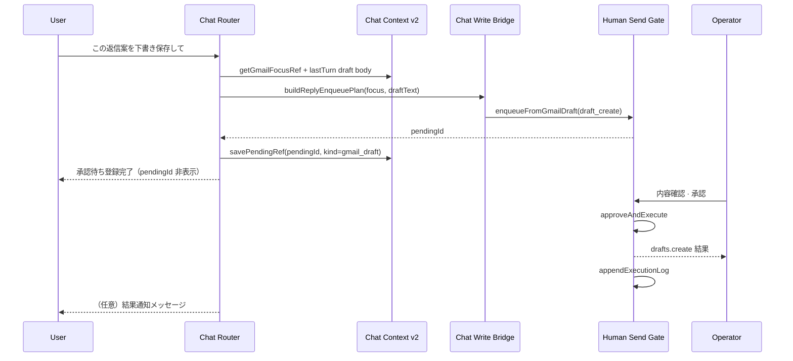

# AI秘書 — Google Integration Phase 4 設計（Human Gate Write）

**実施日:** 2026-06-28  
**種別:** 調査・設計のみ（**実装 · git 変更 · commit 禁止**）  
**前提 commit:** `a7e8229` (Phase 3c-3) · `b9ed3b8` (Phase 3c-2)  
**参照:** `reports/ai-secretary-google-chat-integration-phase3c-plan.md` · `reports/secretary-google-phase6d-gmail-write-human-gate.md` · `reports/secretary-google-phase6f-calendar-write-human-gate.md` · `reports/secretary-google-phase7a-workspace-orchestrator.md`

**Secret / Token / UUID / messageId / bodyText 生データ / Token Vault 実データは記載しない**

---

## 1. 目的

Read-only AI 秘書（Google Chat Phase 3c-3 完了）から、**Human Gate を必ず経由する Google Write** へ安全に移行する。

| 原則 | 内容 |
| --- | --- |
| AI 単独実行禁止 | すべての Write は **enqueue → 運営者承認 → execute** |
| 資産再利用 | Phase 6-D / 6-F / 7-A の HSG · Client · Edge を **新規 API なし** で接続 |
| Chat 境界 | Google Chat Router は **enqueue のみ** — `executeWriteApproved` は HSG 承認後のみ |
| AD-006 準拠 | 返信・予定変更は **下書き / 提案** — 自動確定禁止 |

**Phase 4 スコープ外:** Builder · Platform · TLV · TASFUL AI · Drive · Contacts · Edge 変更 · OAuth 変更 · DeepSeek 本体変更

---

## 2. 現状調査サマリ

### 2.1 Read-only Chat（Phase 3c-3 · 完了）

**ファイル:** `admin-ai-secretary-google-chat-router.js`

| 能力 | 状態 |
| --- | --- |
| Gmail list / get / 要約 / triage / cross-calendar | ✅ read-only |
| 返信案（`context_reply_draft`） | ✅ **テキストのみ** · footer `※ read-only · 送信・下書き保存は未対応` |
| refine（短く / 敬語 / 箇条書き / 件名案等） | ✅ 返信案加工のみ |
| Write 実行 | ⛔ `isWriteIntent()` → `write_blocked` |
| HSG / write Client 参照 | ⛔ テストで明示的に禁止 |

**Context v2:** `admin-ai-secretary-google-chat-context.js` — gmail.focus（内部 id）· calendar.list · lastTurn

### 2.2 既存 Write 資産（Dashboard / Workspace · 完了）

| Phase | 資産 | ファイル |
| --- | --- | --- |
| 6-D | Gmail draft_create / drafts.send / messages.send | `admin-ai-secretary-google-gmail-client.js` · Edge `gmail_write` |
| 6-F | Calendar insert / update / delete | `admin-ai-secretary-google-calendar-client.js` · Edge `calendar_write` |
| 7-A | Workspace Orchestrator + Human Gate | `admin-ai-secretary-google-orchestrator.js` |
| 7-B | Workspace Activity 監査 | `admin-ai-secretary-workspace-activity.js` |
| HSG | Pending queue + Execute + Log | `admin-ai-human-send-gate.js` |
| Policy | L1–L4 分類 | `admin-ai-secretary-human-gate.js` |

### 2.3 Gap（Phase 4 で埋める）

| # | Gap |
| --- | --- |
| G1 | Chat → HSG enqueue パスが存在しない |
| G2 | Chat 返信案が unstructured text — `{ to, subject, threadId, body }` plan 未保存 |
| G3 | Chat 内承認 UX なし（Dashboard HSG パネルのみ） |
| G4 | Chat 起点の Audit / Activity 連携なし |
| G5 | `isWriteIntent` が execute 系を一律 block — **enqueue 系 intent への分離**が必要 |
| G6 | Read-only Coordinator が Dashboard write UI を非表示 — Chat Phase 4 用 feature flag 検討 |

---

## 3. 目標アーキテクチャ

### 3.1 全体パイプライン

```
┌─────────────────────────────────────────────────────────────────┐
│  User (Google Chat · Operations Dashboard)                      │
└───────────────────────────┬─────────────────────────────────────┘
                            │
                            ▼
┌─────────────────────────────────────────────────────────────────┐
│  Read-only Router (Phase 3c)                                    │
│  · read intents → Gmail/Calendar read Client                    │
│  · draft/propose intents → LLM 文案（API 0）                    │
│  · write_enqueue intents → 構造化 plan 生成（API 0）            │
└───────────────────────────┬─────────────────────────────────────┘
                            │ enqueue only
                            ▼
┌─────────────────────────────────────────────────────────────────┐
│  Human Gate (HSG)                                               │
│  · enqueueFromGmailDraft / enqueueFromCalendarEvent             │
│  · pending queue (localStorage · max 80)                        │
│  · 運営者: 内容確認 · 編集 · 承認 / 却下                        │
└───────────────────────────┬─────────────────────────────────────┘
                            │ approveAndExecute (operator)
                            ▼
┌─────────────────────────────────────────────────────────────────┐
│  Draft / Preview（承認前の最終確認 UI）                           │
│  · Gmail: to / subject / body / thread 表示                     │
│  · Calendar: title / start / end / location 表示                │
│  · 二段階 send: draft_create 完了 → 別 pending で send          │
└───────────────────────────┬─────────────────────────────────────┘
                            │ humanGateApproved + pendingId
                            ▼
┌─────────────────────────────────────────────────────────────────┐
│  Execute（Client → Edge → Google API）                          │
│  · gmail_write: drafts.create | drafts.send | messages.send     │
│  · calendar_write: events.insert | update | delete              │
└───────────────────────────┬─────────────────────────────────────┘
                            │
                            ▼
┌─────────────────────────────────────────────────────────────────┐
│  Audit + Result                                                 │
│  · HSG execution log (localStorage · max 200)                   │
│  · Workspace Activity（chat 起点拡張）                          │
│  · Chat assistant reply（結果要約 · id 非露出）                 │
└─────────────────────────────────────────────────────────────────┘
```

### 3.2 レイヤ責務分離

| レイヤ | 責務 | API 呼び出し |
| --- | --- | --- |
| Chat Router | intent 判定 · context 解決 · LLM 文案 · **enqueue 委譲** | read のみ直接 |
| Chat Write Bridge（**新規 · Phase 4**） | focus → reply plan · HSG enqueue ラップ | 0（enqueue 前） |
| HSG | pending 管理 · 承認 UI · execute トリガ | approve 後のみ write |
| Gmail/Calendar Client | Edge proxy · gate パラメータ付与 | write は gate 必須 |
| Edge | `human_gate_required`  enforce | server-side 最終防壁 |

---

## 4. Write API 分離整理

### 4.1 Gmail

| 操作 | Google API | Client method | HSG | Chat intent（案） |
| --- | --- | --- | --- | --- |
| **返信案** | なし（LLM のみ） | — | 不要 | `context_reply_draft`（既存 · read-only） |
| **下書き保存** | `drafts.create` | `enqueueDraftHumanGate` | ✅ 必須 | `write_enqueue_gmail_draft` |
| **送信** | `drafts.send` or `messages.send` | `enqueueSendHumanGate` | ✅ 必須 + **二段確認** | `write_enqueue_gmail_send` |
| **返信（一括）** | plan 生成 → draft enqueue | `buildReplyPlan` + enqueue | ✅ | `write_enqueue_gmail_reply`（draft まで） |

**分離原則**

- **返信案** = 提案テキスト（Phase 3c 維持）
- **Draft** = Gmail 側下書き作成（承認後 API 1 回）
- **送信** = 別 pending · 別承認（6-D Dashboard フローと同型）
- Router から `postGmailWrite` / `executeWriteApproved` **直接呼び出し禁止**

### 4.2 Calendar

| 操作 | Google API | Client method | HSG | Chat intent（案） |
| --- | --- | --- | --- | --- |
| **作成** | `events.insert` | `enqueueCalendarHumanGate("create")` | ✅ | `write_enqueue_calendar_create` |
| **更新** | `events.update` | `enqueueCalendarHumanGate("update")` | ✅ | `write_enqueue_calendar_update` |
| **削除** | `events.delete` | `enqueueCalendarHumanGate("delete")` | ✅ | `write_enqueue_calendar_delete` |

**分離原則**

- LLM（`parseEventIntent`）= **意図抽出のみ** — API 実行判断は HSG + 運営者
- Recurring 予定の編集は **Phase 4 スコープ外**（6-F と同様）
- Chat から calendar write には **calendar.list / focus または明示フィールド** が前提

---

## 5. Human Gate 設計

### 5.1 既存 HSG 契約（変更なし）

**Pending item shape（抜粋）**

```javascript
{
  id,                          // pendingId = Edge humanGateApproved 検証用
  status: "pending" | "approved" | "rejected" | ...,
  source: "gmail" | "calendar" | "chat" | "orchestrator",
  category: "user_reply" | "notification_send" | ...,
  actionType: "human_send",
  proposal,                    // 表示用文案（max 2000）
  recommendation,              // 操作説明
  payload: { ... }              // gmailAction / calendarAction / fields
}
```

**Execute 条件（Edge · 既存）**

- `humanGateApproved === true`
- `pendingId` が HSG pending と一致
- 不一致 → `403 human_gate_required`

### 5.2 Chat 起点の enqueue フロー



### 5.3 Policy Level（L1–L4）と Chat

| Level | Chat Phase 4 扱い |
| --- | --- |
| L1 完全自動 | **適用しない** — Gmail/Calendar write は常に HSG |
| L2 報告のみ | read-only triage / 要約（現状維持） |
| L3 返信案→承認→送信 | **Chat write のデフォルト** |
| L4 オーナー対応 | 契約/法務/本番 migration 等 → enqueue **禁止** · 調査のみ reply |

**実装案:** Chat write enqueue 前に `TasuSecretaryHumanGate.resolveLevel(userText)` を呼び、L4 は `owner_only` reply で block。

### 5.4 承認 UX（2 案 · 推奨 A）

| 案 | 説明 | メリット |
| --- | --- | --- |
| **A（推奨）** | Chat enqueue 後、**Dashboard HSG パネル**で承認（既存 UI） | 実装最小 · 6-D/F 実績 |
| B | Chat 内に `[承認]` `[却下]` ボタン → HSG API | UX 向上 · XSS/権限設計が必要 |

Phase 4-1 は **案 A**、Phase 4-2 で Chat 内ミニパネル（`data-ops-human-send-gate` 連携）を検討。

---

## 6. Permission Model

### 6.1 Write Intent 再分類

現行 `isWriteIntent()` を **3 区分**に分割:

| 区分 | 例 | Router 処理 |
| --- | --- | --- |
| **propose** | 返信案作って · 件名案も | `context_reply_draft` / refine（API 0） |
| **enqueue** | 下書き保存して · 送信準備 · 予定を入れて | write bridge → HSG enqueue |
| **execute_direct** | 返信して · 送信して · 削除して | ⛔ block — 「Human Gate 承認が必要」案内 |

**判定優先（write_blocked より前）**

1. propose intents（既存 3c）
2. enqueue intents（Phase 4 新規）
3. execute_direct → block + HSG 案内文

### 6.2 権限・接続前提

| チェック | 失敗時 |
| --- | --- |
| Google OAuth connected | `DISCONNECT_REPLY`（既存） |
| mock モード | enqueue 可 · execute は mock 結果（6-D 同型） |
| focus / plan 不足 | `NO_FOLLOWUP_REPLY` |
| L4 policy | `owner_only` ガイダンス |
| HSG 未ロード | `human_send_gate_missing` |

### 6.3 OAuth Scope（調査結果 · 変更なし）

既存 `DEFAULT_GOOGLE_OAUTH_SCOPES` に write 用 scope 済み:

- `gmail.compose` — draft / send
- `calendar.events` — CRUD

**将来:** read-only 専用接続との scope 分離（live-prep doc 記載）— Phase 4 では既存 bundle 前提。

---

## 7. 返信案 → Draft → 送信フロー（詳細）

### 7.1 構造化 Reply Plan（新規 Context 拡張）

Phase 4 で `admin-ai-secretary-google-chat-context.js` に **内部専用** ref 追加（v2.1 または `gmail.pendingPlan`）:

```javascript
gmail: {
  focus: { ... },           // 既存
  replyPlan: {              // Phase 4 · sessionStorage 内部 · DOM export 禁止
    to, subject,             // 表示用 preview のみ export
    bodyPreview,             // max 1500
    // 内部: threadId, replyToMessageId, messageId
    sourceIntent,
    savedAt
  },
  pendingGate: {            // enqueue 後
    pendingId,               // 内部のみ
    kind: "gmail_draft" | "gmail_send" | "calendar_create" | ...,
    state: "pending" | "approved" | "rejected" | "executed"
  }
}
```

**Plan 生成:** 既存 `GmailClient.buildReplyPlan(focusMessage)` + LLM draft body（`lastTurn` から extract）

### 7.2 二段階 Send（6-D 準拠）

```
返信案 → [下書き保存 enqueue] → 承認 → drafts.create → draftId 保存
       → [送信 enqueue]         → 承認 → drafts.send(draftId)
```

Chat では **「送信して」単独入力は block**。「下書きを送信して」は draftId 付き send enqueue のみ許可。

### 7.3 Dashboard UI との関係

| 経路 | 返信案 LLM | Enqueue |
| --- | --- | --- |
| Dashboard Gmail カード | `proposeReply`（DeepSeek） | 同一 HSG |
| Google Chat | Router LLM（3c 統一） | 同一 HSG |

**設計判断（推奨）:** Chat は 3c Router LLM を維持 · enqueue 時に `buildReplyPlan` で構造化。Dashboard `proposeReply` との文案差異は許容（HSG proposal で運営者が確認）。

---

## 8. Calendar Write フロー（Chat）

### 8.1 トリガー例

| ユーザー入力 | 前提 | 処理 |
| --- | --- | --- |
| 明日15時に打ち合わせ入れて | parseIntent | `parseEventIntent` → enqueue create |
| この予定を変更して | calendar.list + 番号指定（4-2） | enqueue update |
| Standup を削除して | calendar.list 一致 | enqueue delete |

Phase 4-1 は **create のみ** — update/delete は calendar event pick（3c-4 以降）後。

### 8.2 Cross-calendar との境界

Phase 3c `context_cross_calendar` = read-only 照合。**Phase 4 では実行に進まない**（「予定を入れて」等は enqueue intent へ）。

---

## 9. Audit Log

### 9.1 既存ログ（再利用）

| Store | Key | 用途 |
| --- | --- | --- |
| HSG execution log | `tasu_ai_execution_log_v1` | approve / reject / execute 全記録 |
| HSG pending | `tasu_ai_human_send_gate_pending_v1` | 承認待ち |
| Workspace Activity | `tasu_secretary_workspace_activity_v1` | Orchestrator  runs |

### 9.2 Chat 拡張（Phase 4 新規）

**HSG item に chat メタデータ追加:**

```javascript
payload: {
  ...existing,
  chatRequestId,           // optional · phase2 turn correlation
  chatIntent,              // e.g. write_enqueue_gmail_draft
  focusSubjectPreview,     // max 120 · id なし
}
source: "chat"              // 新 source 値（HSG execute 分岐は gmail/calendar payload で既存 path）
```

**Workspace Activity 連携（任意 · 4-2）:**

- `recordFromChatGate({ requestId, intent, pendingId, humanGateState })`
- 禁止: bodyText · messageId · token in export

### 9.3 監査要件

| イベント | 記録先 | 必須フィールド |
| --- | --- | --- |
| enqueue | HSG pending + log | source, category, intent, timestamp |
| approve | execution log | approvedBy, pendingId, result |
| reject | execution log | outcome=rejected |
| execute success | execution log | result=success, detail(summary) |
| execute fail | execution log + chat reply | error code（token なし） |

---

## 10. Rollback

### 10.1 実行前（標準）

| 操作 | 方法 |
| --- | --- |
| 却下 | `rejectPendingItem(pendingId)` — API 未呼び出し |
| 提案編集 | `updatePendingProposal(pendingId, text)` — execute 前 |
| キャンセル | Orchestrator 同型 · pending state → rejected |

### 10.2 実行後（限定的）

| 操作 | Rollback 可否 | 方針 |
| --- | --- | --- |
| drafts.create | 低 | Gmail UI で下書き削除（自動 rollback **なし**） |
| send | **不可** | 送信後は compensating action なし · log + 運営者手動対応 |
| calendar create | 中 | 別 pending で delete enqueue（**新規承認必要**） |
| calendar update | 低 | 旧値が payload に無い場合は手動 |
| calendar delete | **不可** | 復元 API なし |

**設計原則:** Phase 4 では **自動 compensating transaction を実装しない**。HSG `approval_rollback` は Automation 内部向け — Gmail/Calendar には適用しない。

### 10.3 Execute 失敗時

```
approveAndExecute
  → executeWriteApproved fails
  → pending status: executed_with_error（新 status 検討）または approved + log failed
  → Chat: 「実行に失敗しました（error_code）。Human Gate で再確認してください」
  → pendingId は log に残る · 再 enqueue は運営者判断
```

---

## 11. Error Handling

### 11.1 エラー分類

| code | 層 | ユーザー向け |
| --- | --- | --- |
| `human_gate_required` | Edge | 「承認が必要です」 |
| `human_gate_pending_id_required` | Client | 開発者向け · UI では generic |
| `human_send_gate_missing` | Client | 「Human Gate が利用できません」 |
| `oauth_client_missing` / disconnected | Client | 既存 DISCONNECT_REPLY |
| `no_message_ref` / NO_FOLLOWUP_REPLY | Router | context 不足ガイド |
| `owner_only_policy` | Policy | L4 案内 |
| `write_forbidden` | Edge | method 遮断（既存） |
| Google API 4xx/5xx | Edge | sanitize 済み error · retry 案内 |

### 11.2 Chat Reply テンプレ（案）

| 状態 | 返却例 |
| --- | --- |
| enqueue 成功 | 「Human Gate に登録しました。Dashboard の承認パネルで内容を確認してください。」 |
| enqueue 失敗 | 「登録に失敗しました。Google 接続と内容を確認してください。」 |
| block（直接送信） | 「Google 連携は Human Gate 必須です。下書き保存から承認フローをご利用ください。」 |
| execute 成功（通知） | 「承認済みの下書きを Gmail に保存しました。」 |
| execute 失敗 | 「実行に失敗しました。Human Gate で状態を確認してください。」 |

**禁止:** messageId / threadId / draftId / token を chat DOM に表示

---

## 12. 新規モジュール案

### 12.1 `admin-ai-secretary-google-chat-write-bridge.js`（推奨）

Router から write Client を **間接参照** — テストで Router は bridge のみ mock。

| API | 役割 |
| --- | --- |
| `buildReplyEnqueuePlan(focus, draftText)` | buildReplyPlan + body |
| `enqueueGmailDraftFromChat(plan, meta)` | → Gmail.enqueueDraftHumanGate |
| `enqueueGmailSendFromChat(plan, meta)` | → Gmail.enqueueSendHumanGate |
| `enqueueCalendarFromChat(action, fields, meta)` | → Calendar.enqueueCalendarHumanGate |
| `resolvePolicyLevel(userText)` | → HumanGate.resolveLevel |

### 12.2 Router 変更（Phase 4 実装時）

- 新 INTENTS: `write_enqueue_gmail_draft`, `write_enqueue_gmail_send`, `write_enqueue_calendar_create`, ...
- `isWriteIntent` → `classifyWriteIntent()` に refactor
- `executeReadTool` は read のみ — write enqueue は `executeWriteEnqueueTool` 分離
- `tryHandle` 成功後 `persistLastTurn` · `savePendingGateRef`

**Script load order（Dashboard）:**

```
admin-ai-secretary-google-chat-context.js
admin-ai-secretary-google-chat-gmail-context.js
admin-ai-secretary-google-chat-write-bridge.js   ← Phase 4
admin-ai-secretary-google-chat-router.js
admin-ai-human-send-gate.js                      ← 既存
```

---

## 13. セキュリティ方針

| 項目 | 方針 |
| --- | --- |
| AI 単独 send | **絶対禁止** |
| Router → executeWriteApproved | **禁止** |
| Edge gate bypass | **禁止** — server assert 維持 |
| pendingId in DOM | **禁止** |
| focus internal ids | sessionStorage のみ |
| body in logs | cap + sanitize · 生 body ログ禁止 |
| Chat 「送信しますか？」自動実行 | **禁止** — enqueue のみ |
| AD-002/003/004 | Builder/Platform/TLV 非接触 |
| Production Ready 凍結 | AI 秘書 Critical/Security 例外として Phase 4 は **Secretary 領域のみ** |

---

## 14. フェーズ分割（実装ロードマップ · 参考）

| Sub-phase | 内容 | 依存 |
| --- | --- | --- |
| **4-1** | Gmail draft enqueue from chat · HSG 案 A · audit | 3c-3 |
| **4-2** | Gmail send enqueue（二段）· Chat pending 状態表示 | 4-1 |
| **4-3** | Calendar create enqueue · parseEventIntent 連携 | 4-1 |
| **4-4** | Calendar update/delete · event pick | 3c-4 pick |
| **4-5** | Workspace Activity 連携 · Chat 内承認 UX（案 B） | 4-1 |

**各 sub-phase:** 専用 test script · 8788 E2E · 3c 回帰 · 6-D/6-F 回帰

---

## 15. テスト方針（Phase 4 実装時）

**新規:** `scripts/test-secretary-google-chat-integration-phase4.mjs`

| 層 | シナリオ |
| --- | --- |
| Unit | classifyWriteIntent · propose vs enqueue vs block |
| Unit | buildReplyEnqueuePlan · policy L4 block |
| Mock | enqueue → HSG pending 1 件 · **write API 0** |
| Mock | approve → executeWriteApproved 1 回 · gate params 検証 |
| Security | Router ソースに executeWriteApproved 直接呼び出しなし |
| Security | DOM / console に messageId / pendingId なし |
| E2E 8788 | 返信案 → 下書き保存 enqueue → Dashboard 承認（mock execute） |
| 回帰 | 3c-3 · 3c-2 · 3b · 6-D · 6-F · 7-A |
| Viewport | 1280 / 768 / 390 |

---

## 16. 禁止事項（Phase 4 設計 · 実装共通）

- Builder / Platform / TLV / TASFUL AI / Drive / Contacts 変更
- Edge Function 契約変更（gate assert は既存維持）
- OAuth scope / Token Vault 変更
- DeepSeek Gateway 本体変更
- Router からの直接 write execute
- L1 自動送信
- git add -A

---

## 17. 結論

Phase 4 は **新規 Google Write API 開発ではなく**、Phase 3c Read-only Chat と Phase 6-D/F/7-A Human Gate 実行基盤の **接続設計**である。

**最小 MVP（4-1）:** Chat「下書き保存」→ 構造化 reply plan → HSG `enqueueFromGmailDraft` → Dashboard 承認 → `drafts.create` → audit log → Chat 結果通知。

**核心 invariant:** すべての Write は `Human Gate → User Approval → Execute → Audit → Result` の順序を崩さない。

---

## 18. 関連ファイル索引

| ファイル | Phase 4 での役割 |
| --- | --- |
| `admin-ai-secretary-google-chat-router.js` | intent 拡張 · read/enqueue 分離 |
| `admin-ai-secretary-google-chat-context.js` | replyPlan · pendingGate ref |
| `admin-ai-secretary-google-chat-write-bridge.js` | **新規** enqueue 橋渡し |
| `admin-ai-secretary-google-gmail-client.js` | enqueueDraft/Send · buildReplyPlan |
| `admin-ai-secretary-google-calendar-client.js` | enqueueCalendarHumanGate |
| `admin-ai-human-send-gate.js` | pending · approve · execute · log |
| `admin-ai-secretary-human-gate.js` | L3/L4 policy |
| `admin-ai-secretary-google-orchestrator.js` | 参照実装（7-A フロー） |
| `admin-ai-secretary-workspace-activity.js` | 監査拡張参照 |
| `admin-ai-secretary-google-readonly-coordinator.js` | feature flag 検討 |
| `supabase/functions/_shared/secretary-google-gmail.ts` | gate assert（変更なし） |
| `supabase/functions/_shared/secretary-google-calendar.ts` | gate assert（変更なし） |
