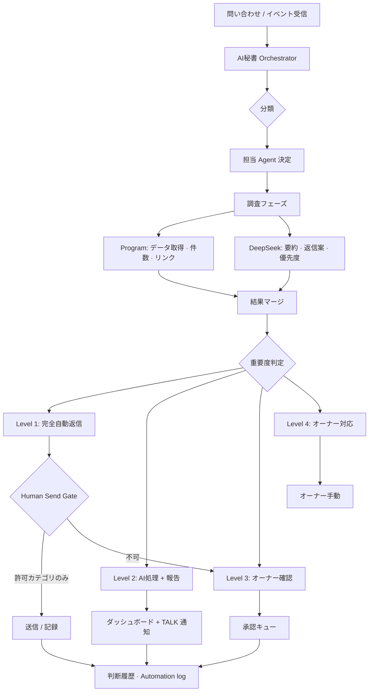

# AI秘書 Phase 5 — Operations Orchestrator 設計調査

**実施日:** 2026-06-26  
**種別:** 調査・設計のみ（**コード変更なし · コミットなし · deploy なし**）  
**正本参照:** [docs/AI/SECRETARY_AI.md](../docs/AI/SECRETARY_AI.md) · [docs/AI/AI_TEAM_CONSTITUTION.md](../docs/AI/AI_TEAM_CONSTITUTION.md) · [docs/DECISIONS.md](../docs/DECISIONS.md)

---

## 用語整理（重要）

| 名称 | 意味 |
| --- | --- |
| **本設計の Phase 5** | **Operations Orchestrator** — 19 Agent 司令塔化（今回の設計対象） |
| **`admin-ai-secretary-phase5.js`（既存）** | 仕事履歴フル表示の **UI スタブ**（オーケストレーターとは別物） |
| **Cursor Sub Agent 19 体** | `.cursor/agents/*.md` — **IDE / Cursor 開発時** の専門エージェント |
| **運営画面 AI 秘書** | `admin-operations-dashboard` 系 — **本番 OPS 向け** DeepSeek surface |

本レポートの Phase 5 は **製品フェーズ名** として使い、既存 phase5.js ファイル名との衝突は **Phase 5-A（Orchestrator コア）** 等のモジュール名で回避する。

---

## 1. 現在の AI 秘書 — できること一覧

### 1.1 AI 秘書 UI

| 画面 / コンポーネント | 状態 | できること |
| --- | --- | --- |
| **Command Center** (`#ops-ai-command-center`) | **実装済** | テキストチャット · クイックチップ · 本日サマリー brief · 優先 3 件スロット |
| **Phase7 デスク** (`admin-ai-secretary-phase7.js`) | **最小実装** | phase2 チャット起動 · opening 文言 · today slot |
| **モード切替** (`admin-ai-secretary-modes.js`) | **UI のみ** | secretary / inbox / connect — **同一ページ内スクロール**（Agent 切替ではない） |
| **Agent Level UI** (`[data-ops-phase2-agent-levels]`) | **未実装** | HTML プレースホルダのみ（L1–L4 表示なし） |
| **Phase3–6, 8** | **スタブ** | 仕事履歴 · Intelligence · 拡張パネル — 空関数 |
| **Floating shell** (`PERSISTENT_SHELL.mount`) | **スタブ** | 他管理ページ常駐 — 未実装 |
| **talk-ops-room** | **実装済** | 互換チャット + **運営コマンド**（regex 抽出） |
| **Daily Inbox / KPI / Connect / OPS WATCH 等** | **RELEASE FROZEN** | 秘書から **参照・リンク提案** は可能、横断 UI は既存 |

### 1.2 AI 秘書 Gateway（LLM 経路）

| 項目 | 現状 |
| --- | --- |
| **経路** | **`TasuSecretaryDeepSeekAdapter`** → `/api/secretary-deepseek-chat`（CF Pages Function） |
| **Gateway 混在** | **なし** — `TasuAiModelGateway` / `ai-model-gateway.js` **非経由**（AD-010 · AD-005） |
| **surface** | `ops_secretary` |
| **systemPrompt** | 固定 BASE + **OpsContextBuilder 注入**（Phase 2 実装 · 未コミット） |
| **フォールバック** | Secret 未設定 / API エラー時 **モック応答** |
| **本番運用** | DeepSeek 残高 · CF Secret · deploy smoke — **未完了**（SECRETARY_AI.md 運用残件） |

### 1.3 AI 秘書 Action（決定的処理）

| モジュール | 役割 | 秘書チャットとの関係 |
| --- | --- | --- |
| **`talk-ops-assistant.parseTalkOpsCommand`** | regex コマンド → 最大 8 件 + href 抽出 | **phase2 からは未連携**（別導線: talk-ops-room `postUserCommand`） |
| **`TasuAiOpsCommand.parseOpsCommand`** | 自然文 → AI Ops 案件フィルタ | 同上 |
| **`TasuTalkOpsAssistant.buildHubSections`** | 7 セクション hub 構築 | OpsContextBuilder が **読取委譲** |
| **`TasuAdminAiAutomationEngine`** | 定型自動化候補 · スケジュール | BAN/返金/停止は **自動実行しない** — 秘書 LLM 未接続 |
| **`TasuAdminAiHumanSendGate`** | 利用者向け送信の **Human Send** 必須 | カテゴリ定義済 · 秘書オーケストレーター未統合 |
| **`admin-ai-decision-learning.js`** | AI 判断履歴 | 参照可能 · 秘書から未ルーティング |
| **`ops-watch-analyzer`** | OPS WATCH — **Gateway** 経由 | 秘書 DeepSeek とは **別 LLM 経路** |

**原則（SECRETARY_AI.md）:** 画面遷移 · 件数 · DB 検索 · フィルタは **プログラム**。LLM は要約 · 優先付け · 自然文化のみ。

### 1.4 AI 秘書 Voice

| 項目 | 現状 |
| --- | --- |
| **モジュール** | `admin-ai-secretary-voice.js` |
| **Core** | `TasuAiVoiceCore` · `surface: ops_secretary` |
| **入力** | Voice toolbar を phase2 フォームに mount |
| **出力** | `tasu:ai-voice-assistant-reply` イベント → TTS 再生 |
| **送信時** | テキスト送信中は `stopVoice()` |

### 1.5 AI 秘書履歴

| 種別 | 保存先 | 上限 | 備考 |
| --- | --- | --- | --- |
| **チャット履歴** | `sessionStorage` `tasu_admin_ai_secretary_chat_v1` | 40 件 | タブ閉じで消える |
| **Adapter 履歴** | DeepSeek リクエストに直近 12 ターン | — | Edge へ送信 |
| **仕事履歴（Work History）** | — | — | phase3–5 **スタブ** |
| **Human Send / Automation log** | `localStorage` | 各 80–200 件 | 秘書 UI から横断表示 **未統合** |
| **Ops inbox ID diff** | `localStorage` `tasu_secretary_inbox_ids_v1` | — | 差分 intent 用 |

### 1.6 AI 秘書 Agent 切替

| 期待 | 現状 |
| --- | --- |
| 19 Agent へのルーティング | **存在しない** |
| モードピッカー 3 種 | **ページ内ナビ** のみ（Inbox / Connect セクションへ scroll） |
| Cursor Sub Agent 呼び出し | **ランタイム API なし**（IDE 専用） |

### 1.7 OpsContextBuilder — データドメイン（LLM 入力）

6 ドメイン正規化（`admin-ai-secretary-ops-context.js`）:

| ドメイン | データソース | 備考 |
| --- | --- | --- |
| support | Daily Inbox · Support · AI Ops · ANPI · TALK | 問い合わせ · 通報 · 安否 |
| builder | Builder partner eval / hub | |
| platform | market · content_gate · response_plan · automation | |
| stripe_connect | Connect hub · KPI revenue | |
| tlv | **stub** | FEATURE FROZEN · collector 未接続 |
| ai_usage | `TasuAiInteractionLog` 集計 | 件数サマリのみ |

**Intent（regex）:** Builder/Platform/Connect/Support/TLV/AI利用/差分/優先 — **分類器の原型**。

### 1.8 現状サマリー（能力マトリクス）

| 能力 | レベル |
| --- | --- |
| 運営者向け NL Q&A（要約・提案） | ◎ DeepSeek + OpsContext |
| 決定的案件抽出（コマンド） | ○ talk-ops 系（チャット未統合） |
| 音声入出力 | ○ Voice Core |
| 自動返信 / 自動実行 | △ Automation + Human Gate（秘書未統合） |
| 19 Agent オーケストレーション | ✕ |
| 重要度 L1–L4 自動判定 | ✕ UI プレースホルダのみ |
| 朝/夜レポート · 夜間監視 | △ OPS WATCH / KPI 別系統 |
| 本番 DeepSeek 安定応答 | △ 運用残件 |

---

## 2. 19 Agent との接続ポイント

### 2.1 Agent 一覧と現状の接続

| # | Agent | 定義 | 運営データ接続 | 秘書から呼び出し | ギャップ |
| --- | --- | --- | --- | --- | --- |
| 1 | Architecture | `.cursor/agents/architecture-agent.md` | docs / ADR | ✕ | ランタイム Router なし |
| 2 | Builder | builder-agent.md | OpsContext `builder` | ✕ | 製品 AI は Builder AI（別 surface） |
| 3 | Platform | platform-agent.md | OpsContext `platform` | ✕ | |
| 4 | TLV | tlv-agent.md | stub のみ | ✕ | collector 未実装 |
| 5 | Secretary | secretary-agent.md | phase2 / ops-context | △ 自己参照のみ | オーケストレーター本体 |
| 6 | TASFUL AI | tasful-ai-agent.md | ai_usage 件数 | ✕ | Gateway 経由別製品 |
| 7 | QA | qa-agent.md | test scripts 参照 | ✕ | CI 結果未 ingest |
| 8 | Review | review-agent.md | — | ✕ | diff / PR 未連携 |
| 9 | Release | release-agent.md | — | ✕ | Go/No-Go 未連携 |
| 10 | Docs | docs-agent.md | docs/ 正本 | ✕ | |
| 11 | Security | security-agent.md | OPS WATCH 一部 | ✕ | アラート ingest なし |
| 12 | Performance | performance-agent.md | — | ✕ | メトリクス未接続 |
| 13 | Database | database-agent.md | — | ✕ | Supabase 異常検知なし |
| 14 | CI | ci-agent.md | reports/*.json 散在 | ✕ | 統一 Event なし |
| 15 | Product | product-agent.md | — | ✕ | |
| 16 | Prompt AI | prompt-ai-agent.md | ai_usage | ✕ | Gateway 品質監視未接続 |
| 17 | UX/UI | ux-ui-agent.md | — | ✕ | |
| 18 | API Integration | api-integration-agent.md | Stripe/Connect 間接 | ✕ | webhook 状態未正規化 |
| 19 | DevOps/Infra | devops-infra-agent.md | deploy reports | ✕ | preflight 未 ingest |

### 2.2 接続アーキテクチャ（現状 vs 目標）

**現状:**

```
[運営者] → admin-operations-dashboard
              ├─ phase2 チャット → DeepSeek Adapter（単一 LLM）
              ├─ talk-ops postUserCommand（regex · 別導線）
              ├─ Automation / Human Gate（独立）
              └─ OPS WATCH → Gateway（別 LLM）

[開発者] → Cursor IDE → .cursor/agents/*.md（19 Agent）
              ↑
              └── 運営画面からは到達不可
```

**目標（Phase 5 設計）:**

```
[イベント / 問い合わせ / 監視]
        ↓
┌───────────────────────────────────────┐
│  Secretary Orchestrator（新規レイヤ）   │
│  · 分類 · 重要度 · Workflow · Queue    │
│  · Agent Registry（19 映射）           │
│  · Approval Gate（L1–L4）              │
└───────────────┬───────────────────────┘
                │
    ┌───────────┼───────────┐
    ↓           ↓           ↓
[Program]   [DeepSeek]   [Agent Task]
 決定的処理   要約/文案     IDE / 将来 API
```

### 2.3 不足している接続点（優先度順）

| ID | 接続点 | 説明 | Phase |
| --- | --- | --- | --- |
| G1 | **Orchestrator Registry** | intent → agentId · workflowId · requiredOutputs | 5-A |
| G2 | **Event Bus 正規化** | support / CI / ops-watch / stripe → `OpsEventV1` | 5-B |
| G3 | **Classification Layer** | regex + DeepSeek 二段（カテゴリ · 重要度 · L レベル） | 5-A |
| G4 | **Agent Task Queue** | 人間が Cursor で実行するタスク票 · localStorage → 将来 SDK | 5-C |
| G5 | **Human Approval 統合** | HumanSendGate + L3/L4 + Constitution 禁止事項 | 5-A |
| G6 | **チャット ↔ コマンド統合** | phase2 sendMessage 内で parseTalkOpsCommand 併用 | 5-B |
| G7 | **CI / Security / DB ingest** | `reports/gate-*.json` 等の読取 | 5-C |
| G8 | **Cursor Agent Runtime API** | `@cursor/sdk` 等 — **Phase 6+** | 6 |
| G9 | **TLV collector** | FEATURE FROZEN 尊重 · stub → 読取のみ | 6+ |
| G10 | **自動返信実行** | L1 のみ · Human Gate 必須 | 6 |

**設計原則:** Phase 5 では **Agent を直接コード実行させない**。Registry + Task 票 + DeepSeek 文案 + 既存 Human Gate で **司令塔の「判断と振り分け」** を完成させる。

---

## 3. 問い合わせフロー（理想設計）

### 3.1 全体フロー



### 3.2 分類 taxonomy（Orchestrator 入力）

| 大分類 | サブ分類 | 初期担当 Agent | データソース |
| --- | --- | --- | --- |
| inquiry | general / billing / account | Secretary → Support 系 | support-ticket |
| report | abuse / content / user | Secretary → Security | ai-ops-case |
| incident | outage / degradation | DevOps → CI → 担当製品 | ops-watch |
| builder_consult | partner / eval / dispute | Builder | builder store |
| platform_consult | listing / market / coupon | Platform | platform inbox |
| tlv_consult | live / payout | TLV | tlv stub |
| ai_quality | hallucination / gateway | Prompt AI → TASFUL AI | ai_usage log |
| db_anomaly | slow / error rate | Database | 将来 Supabase |
| ci_failure | build / test / smoke | CI → QA | reports/*.json |
| perf_regression | LCP / bundle | Performance | 将来 |
| security_alert | secret / RLS / abuse | Security | ops-watch |
| revenue | stripe / connect | API Integration | KPI |
| scheduled | morning / night | Secretary | KPI + inbox diff |

### 3.3 Level 1–4 判定基準（案）

| Level | 名称 | 条件（例） | 秘書の動き | Human |
| --- | --- | --- | --- | --- |
| **L1** | 完全自動返信 | FAQ 一致 · auto_done · リスク low · テンプレ適合 | Automation + Human Gate **internal のみ** → 限定 auto | 事後ログ |
| **L2** | AI処理 + 報告 | 要約 · 優先付け · 返信**案** · 内部整理 | DeepSeek + OpsContext · TALK/Command Center 通知 | 送信はしない |
| **L3** | オーナー確認 | 返金 · BAN 候補 · 法務 · 高リスク · 外部送信 | 文案 + 根拠 + リンク → **承認キュー** | **必須承認** |
| **L4** | オーナー対応 | 契約 · 訴訟 · 高額 · 本番変更 · 例外 | 調査結果のみ · 実行提案なし | **人間が全操作** |

**既存資産との対応:**

- L1 送信系 → `TasuAdminAiHumanSendGate`（`HUMAN_SEND_CATEGORIES` 以外は auto 不可）
- L3 キュー → `tasu_ai_human_send_gate_pending_v1`
- カテゴリ `needs_judgment` / `pending_approval` → OpsContext `mapCategory`

### 3.4 返信案生成パイプライン

1. **Program:** 案件 ID · ステータス · 画面 URL · 過去類似（decision-learning）
2. **DeepSeek:** OpsContext + 案件サマリ + 「実行操作禁止」ルール
3. **Orchestrator:** 返信案 + confidence + suggestedLevel
4. **Gate:** suggestedLevel を L1 昇格させない（デフォルト **L2**、リスク high 以上は **L3 固定**）

---

## 4. AI 運営フロー設計（14 業務）

秘書 Orchestrator が **イベントを受け · 分類し · Agent チェーンを起動 · レベル判定 · 記録** する。

| # | 業務 | トリガー | 分類 | Agent チェーン（短縮可） | デフォルト Level | 主データ |
| --- | --- | --- | --- | --- | --- | --- |
| 1 | 問い合わせ | ticket / inbox | inquiry | Secretary → Product? → UX/UI? | L2–L3 | support |
| 2 | 障害 | ops-watch / 手動 | incident | DevOps → CI → 担当製品 → QA | L2–L4 | ops-watch |
| 3 | 投稿通報 | ai-ops report | report | Security → Platform/TLV → Review | L3 | ai-ops-case |
| 4 | Builder 相談 | inbox builder | builder_consult | Builder → Review → QA | L2 | builder |
| 5 | Platform 相談 | inbox platform | platform_consult | Platform → UX/UI → QA | L2 | platform |
| 6 | TLV 相談 | inbox tlv | tlv_consult | TLV → Database? → QA | L2–L3 | tlv stub |
| 7 | AI 品質 | ai_usage 異常 | ai_quality | Prompt AI → TASFUL AI → QA | L2 | ai log |
| 8 | DB 異常 | 将来 webhook | db_anomaly | Database → Security → DevOps | L3–L4 | Supabase |
| 9 | CI 失敗 | report ingest | ci_failure | CI → QA → 担当 Agent → Review | L2 | reports |
| 10 | Performance 低下 | 将来 RUM | perf_regression | Performance → 担当 → QA | L2 | metrics |
| 11 | Security 警告 | ops-watch | security_alert | Security → Review → DevOps | L3–L4 | ops-watch |
| 12 | 売上サマリー | 定時 / 手動 | revenue | API Integration → Secretary | L2 | KPI / Stripe |
| 13 | 朝レポート | cron 08:00 JST | scheduled | Secretary → Docs（記録） | L2 | inbox diff + KPI |
| 14 | 夜間監視 | cron / ops-watch | scheduled | DevOps → Secretary → Security? | L2–L3 | ops-watch |

### 4.1 朝レポート / 夜間監視（スケジュール設計）

| ジョブ | 時刻（案） | 内容 | LLM |
| --- | --- | --- | --- |
| **朝レポート** | 08:00 | 前夜 diff · 未対応件数 · Connect 滞留 · CI 最終 · 売上速報 | DeepSeek 要約 |
| **夜間監視** | 22:00 / 02:00 | OPS WATCH サマリ · critical のみエスカレーション | critical → L3 通知 |

**実装方針:** 初版は **ダッシュボード open 時 + 手動「朝レポート生成」**（cron は Phase 6 · Service Worker / Edge Cron）。

---

## 5. Agent Workflow（AI Team Constitution 準拠）

憲法第5章標準フローを **Orchestrator のチェーン定義** として再利用。全ステップを毎回走らせず **workflow テンプレート** で必要 Agent のみ起動。

### 5.1 通常（一般 OPS / 軽微改修相談）

```
Secretary（分類 · OpsContext）
  → Architecture（AD 抵触チェック — 必要時）
  → 担当 Agent（Builder / Platform / TLV / Secretary）
  → QA（回帰影響 — 必要時）
  → Review（scope — 必要時）
  → Docs（記録 — 必要時）
```

**秘書の役割:** オペレーター質問が **開発タスクか OPS か** を切り分け。開発タスクは **Agent Task 票** を生成（Cursor 用プロンプト下書き）。

### 5.2 Builder 相談

```
Secretary → Builder → Database? → Prompt AI? → UX/UI? → Performance? → Security → QA → Review → Docs → CI → Release
```

| 段階 | Agent | 出力 |
| --- | --- | --- |
| 1 | Secretary | 案件整理 · partner 情報マスク済み |
| 2 | Builder | 技術/運用判断案 |
| 3 | Security | 直接取引 · 個人情報リスク |
| 4 | QA | 既存 Builder テスト影響 |
| 5 | Review | 凍結抵触チェック |

**Human:** パートナーへの正式連絡 · 契約変更 · BAN → **L3+**

### 5.3 Platform 相談

```
Secretary → Platform → Product? → UX/UI → Database? → API Integration? → Security → QA → Review → Docs
```

掲載停止 · 返金 · 決済 → **L3 固定**

### 5.4 障害（Incident）

```
Secretary → DevOps/Infra → CI → 担当製品 Agent → Database? → Security → QA → Docs
```

| 優先 | 动作 |
| --- | --- |
| P0 | L4 — オーナー即時 · deploy rollback 提案のみ |
| P1 | L3 — 調査票 + 影響範囲 |
| P2 | L2 — 報告 |

**憲法:** DevOps は deploy · preflight · 障害時にフロー合流。

### 5.5 問い合わせ（Support / ユーザー向け）

```
Secretary → Product?（ポリシー）→ Security（法務/虐待）→ UX/UI（文案）→ Human Send Gate
```

- データ取得: Program（ticket · 履歴）
- 文案: DeepSeek
- 送信: **L1 は限定** · 原則 **L2 案 → L3 承認**

### 5.6 レビュー（コード / リリース前）

```
Secretary → Review → Security → QA → CI → Release → Human Approval
```

秘書は **Go/No-Go チェックリスト** の入力材料を集約（test report · KNOWN_ISSUES · diff サマリ URL）。

### 5.7 Workflow 定義形式（Phase 5 成果物案）

```javascript
// admin-ai-secretary-orchestrator-registry.js（新規 · 設計のみ）
{
  id: "wf_builder_consult",
  steps: [
    { agent: "secretary", action: "classify_and_context" },
    { agent: "builder", action: "investigate", optional: false },
    { agent: "security", action: "review", when: "risk>=medium" },
    { agent: "qa", action: "regression_check", optional: true },
    { agent: "review", action: "scope_check", when: "touches_frozen" },
  ],
  defaultLevel: "L2",
  escalateWhen: ["ban", "refund", "legal"],
}
```

Phase 5 では **JSON/JS 定数 + UI 表示** のみ。Cursor 自動起動は Phase 6。

---

## 6. Human Approval 一覧

憲法第5章 · 第9章 · HumanSendGate · OpsContext ルールを統合。

### 6.1 必須 Human Approval（Agent いかんを問わず）

| カテゴリ | 具体例 | 默认 Level |
| --- | --- | --- |
| **返金** | 全額/部分返金 · chargeback 対応 | L3–L4 |
| **BAN / 停止** | アカウント停止 · 掲載停止 · Connect 制限実行 | L3–L4 |
| **契約** | パートナー契約変更 · 料率変更 | L4 |
| **法律 / コンプライアンス** | 法的リスク · 個人情報開示 · 規約改定 | L4 |
| **決済** | 外部決済許可 · 高額請求 · Stripe 設定変更 | L3–L4 |
| **本番 Deploy** | CF Pages · Edge · Workers | L4 |
| **本番 Migration** | Supabase schema · RLS apply | L4 |
| **Secret 変更** | API Key · env · webhook secret | L4 |
| **RLS / 認証変更** | ポリシー · OAuth 設定 | L4 |
| **Push / Merge** | main への push · PR merge | L3–L4 |
| **利用者への送信** | support 返信 · 通知 · Connect 案内 | L3（L1 はテンプレ限定） |
| **高額請求** | 閾値超え（要 Product 定義） | L4 |
| **データ削除** | ユーザーデータ消去 | L4 |
| **憲法 / ADR 改定** | AI_TEAM_CONSTITUTION · DECISIONS | L4 |

### 6.2 Human Send Gate カテゴリ（既存）

`admin-ai-human-send-gate.js` — **利用者影響あり → 必ず承認:**

- `user_reply` · `support_answer` · `notification_send` · `connect_guidance` · `complaint_response` · `anpi_check` · `builder_communication`

**Orchestrator 統合:** suggestedLevel=L1 でも `actionType=human_send` なら **自動送信禁止**。

### 6.3 Agent 別 — 人間必須操作

| Agent | 人間必須 |
| --- | --- |
| Database | 本番 migration apply |
| DevOps/Infra | deploy · Secret |
| Release | push · Go/No-Go 最終 |
| Security | RLS/Secret 修正の本番適用 |
| API Integration | 本番 webhook / billing 設定 |

---

## 7. Phase 5 実装設計（最小差分）

### 7.1 新規モジュール（ファイル案）

| ファイル | 責務 | 触る既存 |
| --- | --- | --- |
| `admin-ai-secretary-orchestrator.js` | 分類 · workflow 実行 · level 判定 | phase2 sendMessage から呼出 |
| `admin-ai-secretary-orchestrator-registry.js` | 19 Agent 映射 · workflow 定義 | 新規のみ |
| `admin-ai-secretary-orchestrator-queue.js` | Task 票 · 状態 · localStorage | 新規のみ |
| `admin-ai-secretary-orchestrator-levels.js` | L1–L4 UI · `[data-ops-phase2-agent-levels]` | dashboard HTML 既存 slot |
| `admin-ai-secretary-orchestrator-events.js` | OpsEventV1 ingest（ops-watch · inbox · CI file） | 読取のみ |

**非変更（Phase 5 厳守）:** Builder · Platform · TLV 製品コード · `.cursor/agents/*` · Gateway · Automation コアロジック。

### 7.2 phase2 統合フロー（sendMessage 拡張案）

```
sendMessage(text)
  1. Orchestrator.classify(text)           // regex + 将来 DeepSeek JSON mode
  2. parseTalkOpsCommand(text)             // 決定的 rows（併用）
  3. OpsContextBuilder.build(...)          // 既存
  4. Orchestrator.runWorkflow(classification)
  5. buildSystemPrompt + workflowSummary   // DeepSeek
  6. Adapter.completeTurn(...)
  7. Orchestrator.recordTurn + renderLevels
  8. if L3: HumanSendGate.enqueue(draft)
```

### 7.3 OpsEventV1（イベント正規化 · 設計）

```typescript
interface OpsEventV1 {
  id: string;
  source: "support" | "ai_ops" | "ops_watch" | "ci" | "manual" | "scheduler";
  category: string;       // §3.2 taxonomy
  severity: "low" | "medium" | "high" | "critical";
  title: string;
  summary: string;        // PII masked
  href?: string;
  suggestedAgents: string[];
  suggestedLevel: "L1" | "L2" | "L3" | "L4";
  at: string;             // ISO
}
```

### 7.4 Agent Task 票（Cursor 連携手順 · Phase 5）

Phase 5 では **クリップボード / TALK ルームへの Markdown 投稿**:

```markdown
## Agent Task: builder-agent
**Workflow:** wf_builder_consult
**Context:** [OpsContext 要約]
**依頼:** パートナー評価案件 #xxx の技術的判断
**制約:** Builder 領域のみ · 凍結抵触なし
```

Phase 6: `@cursor/sdk` または CI から subagent 起動。

---

## 8. 実装順序（最小差分）

| 順 | 項目 | 依存 | リスク | 成果 |
| --- | --- | --- | --- | --- |
| **1** | Orchestrator Registry + classify（regex） | なし | 低 | intent → agent · workflow |
| **2** | phase2 統合 + L1–L4 UI | 1 | 低 | チャットで level 表示 |
| **3** | parseTalkOpsCommand 併用 | 2 | 低 | NL + 決定的抽出統合 |
| **4** | Human Gate / Queue 連携 | 2 | 中 | L3 承認キュー接続 |
| **5** | OpsEvent ingest（inbox · ops-watch） | 1 | 低 | 14 業務の半自動 |
| **6** | 朝レポート（手動ボタン） | 5 | 低 | KPI + diff 要約 |
| **7** | CI report ingest | 5 | 中 | ci_failure フロー |
| **8** | Workflow 結果 · Task 票 UI | 1–4 | 低 | Cursor 用出力 |
| **9** | DeepSeek 分類 JSON（structured） | 1 | 中 | 精度向上 |
| **10** | DeepSeek 本番運用完了 | 既存 P0 | 運用 | モック脱却 |

**Phase 6 以降:** Cursor SDK · cron · L1 限定 auto-send · TLV collector · Site Assistant 集約 · Trend Scout · Work History 本実装 · Floating shell。

---

## 9. 完成度 · スコープ整理

### 9.1 現在の AI 秘書完成度

| 観点 | 重み | 完成度 | 備考 |
| --- | --- | --- | --- |
| OPS UI / Command Center | 15% | 85% | RELEASE FROZEN ベース solid |
| テキストチャット + Voice | 15% | 80% | phase2 + voice 実装済 |
| DeepSeek 接続 | 15% | 60% | 実装済 · 本番運用未完了 |
| OpsContext / データ注入 | 15% | 70% | Phase2 完了 · TLV stub |
| 決定的 Action / コマンド | 10% | 75% | talk-ops 系 · チャット未統合 |
| Automation / Human Gate | 10% | 65% | 存在 · 秘書未統合 |
| **19 Agent オーケストレーション** | **20%** | **5%** | IDE Agent のみ |
| **総合（司令塔視点）** | | **≈ 58%** | |
| **総合（OPS チャットのみ視点）** | | **≈ 72%** | オーケストレーター除外 |

### 9.2 Phase 5 で完成するもの

- **Secretary Orchestrator コア** — 分類 · Workflow Registry · L1–L4 判定 · 記録
- **19 Agent 映射表** — Constitution 準拠チェーン定義
- **phase2 統合** — チャット 1 本化（NL + コマンド + context + level）
- **Human Approval 統合** — Gate / Queue との接続
- **OpsEvent 正規化** — inbox · ops-watch · 手動 · CI（読取）
- **Agent Task 票** — Cursor 実行用 Markdown 出力
- **朝レポート（手動）** — DeepSeek 要約

### 9.3 Phase 6 以降に回すもの

| 項目 | 理由 |
| --- | --- |
| Cursor Agent Runtime（SDK / API） | IDE 外実行 · セキュリティ設計 |
| L1 完全自動返信の本番運用 | Human Gate · テンプレ監査 |
| cron 朝/夜 · 夜間エスカレーション | Edge Cron / SW |
| TLV 本格 collector | FEATURE FROZEN |
| Site Assistant → OPS 集約 | 別 backlog |
| Trend Scout | v1.2 backlog |
| Work History phase3–5 本実装 | UI 拡張 |
| Intelligence パネル phase6 | 依存 Orchestrator |
| DB 異常自動検知 | Supabase observability |
| Performance RUM ingest | 計測基盤 |
| Floating shell 常駐 | UX 拡張 |
| phase5.js（仕事履歴）リネーム/統合 | 名前衝突解消 |

### 9.4 リスクと制約

| リスク | 対策 |
| --- | --- |
| RELEASE FROZEN 抵触 | Orchestrator は **新規ファイル + phase2 最小 hook** のみ |
| AD-010 Gateway 混在 | Orchestrator は DeepSeek 文案のみ · 他 surface 非変更 |
| Agent 自動実行の暴走 | Phase 5 は **Task 票のみ** · 実行は Human / Cursor |
| phase5.js 名前衝突 | オーケストレーターは `orchestrator-*` 命名 |
| 未コミット phase 差分（KI-008） | Phase 5 着手前に secretary 差分の選別コミット推奨 |

---

## 10. 結論

AI 秘書は **OPS 向け NL チャット + OpsContext + 決定的コマンド + Human Gate** まで揃っており、**運営者の「聞く・整理する」** にはおおむね成立している。一方 **19 Agent の司令塔** としては、Cursor Sub Agent が IDE 専用であるため **ランタイム接続が皆無** で、オーケストレーション完成度は **約 5%** に留まる。

Phase 5 の本質は **新規 Orchestrator レイヤ** により、(1) 分類 · (2) Constitution 準拠 Workflow · (3) L1–L4 · (4) Human Approval · (5) Agent Task 票 — の **判断と振り分け** を admin 画面内で完結させることである。Agent の実コード実行は Phase 6 以降の Cursor SDK 連携に委ね、**最小差分** では Registry → phase2 統合 → Gate 連携 → Event ingest の順が最適。

---

## 参照ファイル

| 種別 | パス |
| --- | --- |
| チャット本体 | `admin-ai-secretary-phase2.js` |
| OpsContext | `admin-ai-secretary-ops-context.js` |
| DeepSeek Adapter | `admin-ai-secretary-deepseek-adapter.js` |
| Edge Function | `deploy/cloudflare/functions/api/secretary-deepseek-chat.js` |
| Voice | `admin-ai-secretary-voice.js` |
| モード | `admin-ai-secretary-modes.js` |
| 運営コマンド | `talk-ops-assistant.js` · `ai-ops-command-parser.js` |
| Human Gate | `admin-ai-human-send-gate.js` |
| Automation | `admin-ai-automation-engine.js` |
| 憲法 | `docs/AI/AI_TEAM_CONSTITUTION.md` |
| 秘書正本 | `docs/AI/SECRETARY_AI.md` |
| Agent 定義 | `.cursor/agents/*.md`（19 ファイル） |

---

**次アクション（実装フェーズ開始時）:** ユーザー指示後 · `admin-ai-secretary-orchestrator-registry.js` から着手 · secretary 未コミット差分の整理 · DeepSeek 本番 P0 並行。
