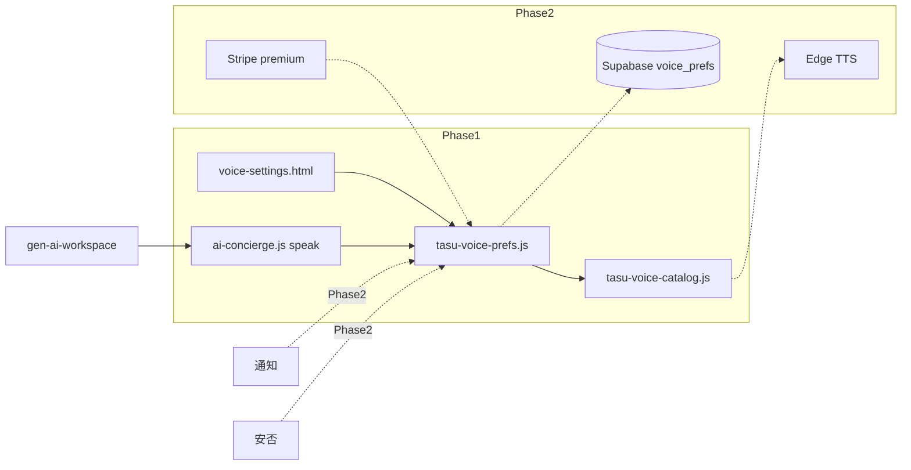

# AI音声選択 — Phase1 設計レビュー

**レビュー日:** 2026-06-17  
**種別:** 設計のみ（**実装しない**）  
**前提:** RELEASE FROZEN 維持 / TALK WebRTC Phase1 LOCK 済み / 通話基盤（`talk-call-*`）非接触

---

## 1. エグゼクティブサマリー

TASFUL 内の「AI音声」は現状 **生成AIワークスペース（`gen-ai-workspace`）に Web Speech API ベースの読み上げ ON/OFF のみ** が実装されている。音声の**選択・プラン・品質・通知読み上げ・安否案内**は未整備。

Phase1 は **新規 Epic** として「音声カタログ + ユーザー設定 UI + モック再生 + 無料/有料の表示設計」に限定し、**凍結済み領域（TALK コア / Builder / Connect / AI運営秘書 / WebRTC 通話）には触れない**。設定の単一ソースは **アカウント設定系** に置き、生成AI は既存 `ai-concierge.js` から参照するのが RELEASE FROZEN 整合上も安全。

**推奨判定:** Phase1 **実装する価値あり**（スコープを最小に限定した場合）。  
**ストレージ:** Phase1 は **localStorage + 静的カタログ JS** で十分。Supabase は **Phase2 移行設計のみ** 先行定義。

---

## 2. 現状調査

### 2.1 既存の AI 音声関連実装

| ファイル | 役割 | 音声選択 | ストレージ |
|----------|------|----------|------------|
| [`ai-concierge.js`](../ai-concierge.js) | Web Speech API 読み上げ土台（`speak` / ON-OFF） | ❌ 先頭の `ja` voice を自動選択 | `localStorage` `tasu_ai_voice_enabled` |
| [`gen-ai-workspace.js`](../gen-ai-workspace.js) | 音声会話モード・マイク・利用回数・口パク連動 | ❌ | `tasu_genai_usage` 等 localStorage |
| [`gen-ai-workspace.html`](../gen-ai-workspace.html) | `data-ai-voice-toggle` UI | ❌ | — |
| [`ai-workspace.html`](../ai-workspace.html) + [`ai-workspace-chat.js`](../ai-workspace-chat.js) | 旧 AI 相談（concierge 読み込み） | ❌ | 同上 |
| [`stripe-genai-config.js`](../stripe-genai-config.js) | プラン定義 `dailyVoiceLimit`（回数制限） | ❌ 品質/声種ではない | — |
| [`supabase/gen_ai_subscriptions.sql`](../supabase/gen_ai_subscriptions.sql) | `daily_voice_limit` 列 | 回数のみ | Supabase |
| [`supabase/gen_ai_usage_daily.sql`](../supabase/gen_ai_usage_daily.sql) | `voice_chat_used` | 将来移行用 | Supabase |

**読み上げの実装方式:** ブラウザ標準 `speechSynthesis` + `SpeechSynthesisUtterance`。外部 TTS API・ElevenLabs・Gemini TTS は **未接続**（[`reports/gemini-edge-diagnose.md`](gemini-edge-diagnose.md) に TTS モデル候補の記載のみ）。

**検証・ドキュメント:**

- [`docs/gen-ai-voice-manual-checklist.md`](../docs/gen-ai-voice-manual-checklist.md)
- [`scripts/browser-test-gen-ai.mjs`](../scripts/browser-test-gen-ai.mjs)
- [`scripts/verify-gen-ai-voice-ui-smoke.mjs`](../scripts/verify-gen-ai-voice-ui-smoke.mjs)

### 2.2 通知読み上げ / 安否 / TALK

| 領域 | 音声・読み上げ | 備考 |
|------|----------------|------|
| **通知読み上げ** | **未実装** | 通知音・TTS なし |
| **TALK 通知設定** | **未実装** | [`talk-notification-settings-store.js`](../talk-notification-settings-store.js) — カテゴリ ON/OFF のみ |
| **TASFUL 通知設定** | **未実装** | [`tasful-notification-settings-store.js`](../tasful-notification-settings-store.js) — 同上 |
| **TALK AI タブ** | **テキストのみ** | [`talk-home.html`](../talk-home.html) AI composer — 音声 UI なし |
| **AI運営秘書（admin）** | **未実装** | `admin-ai-*.js` に voice/speech 参照なし |
| **安否** | **未実装** | 音声案内・電話なし（[`reports/anpi-no-response-design-review.md`](anpi-no-response-design-review.md) は TALK 通話接続を Phase2 以降と記載） |
| **WebRTC 通話** | **P2P 音声** | [`scripts/talk-call-*`](../scripts/talk-call-webrtc.js) — **AI TTS とは別系統・LOCK 済み・非接触** |

### 2.3 設定系ページ

| ページ | 用途 | 音声設定 |
|--------|------|----------|
| [`profile-settings.html`](../profile-settings.html) | マイページハブ | ❌ |
| [`tasful-notification-settings.html`](../tasful-notification-settings.html) | 通知 ON/OFF | ❌ |
| [`talk-home.html`](../talk-home.html) | TALK 内通知設定モーダル | ❌ |
| [`payment-settings.html`](../payment-settings.html) | 支払い | ❌ |
| [`gen-ai-workspace.html`](../gen-ai-workspace.html) | 読み上げ ON/OFF のみ | 部分（トグルのみ） |

### 2.4 将来 TTS 候補（調査メモのみ）

[`ops-watch-categories.js`](../ops-watch-categories.js) に **ElevenLabs** を「音声通知・ナレーション・TALK音声化の候補」として記載。Gemini TTS モデル名は診断レポートに列挙。**いずれも製品未接続。**

### 2.5 既存プランとの関係

`stripe-genai-config.js` / `gen_ai_subscriptions` の **`dailyVoiceLimit` は「音声会話の 1 日あたり利用回数」** であり、**声の種類・品質プランではない**。  
Phase1 の「無料/有料音声」設計は **回数制限（既存）と 声カタログ（新規）を分離** して定義する必要がある。

---

## 3. ユースケース整理

| ID | ユースケース | 現状 | Phase1 | Phase2 |
|----|--------------|------|--------|--------|
| UC-1 | **通知読み上げ**（プッシュ/バッジ到着時） | なし | 設定項目 + モック再生のみ | Push 連携 + TTS |
| UC-2 | **AI運営秘書の音声返答** | なし（テキストのみ） | 対象外（凍結） | admin 別 Epic |
| UC-3 | **安否確認の音声案内** | なし | カタログ/設定への将来フック定義のみ | 安否 Epic + TTS |
| UC-4 | **TALK 内 AI 音声補助**（下書き読み上げ等） | なし | 設定参照 API のみ（TALK 本体変更最小） | TALK P2 |
| UC-5 | **生成AI キャラ会話の読み上げ** | ✅ Web Speech | **声選択 + プレビュー** | 外部 TTS |
| UC-6 | **有料プレミアム音声** | なし | UI 表示（ロック/Coming soon） | Stripe + provider |
| UC-7 | **長文読み上げ** | 800 文字切り詰め（`ai-concierge`） | 上限表示設計 | 分割 TTS / 課金 |

**WebRTC 1:1 通話（LOCK 済み）** は UC 対象外。マイク P2P と AI TTS はプロダクト上も技術上も分離を維持する。

---

## 4. 無料 / 有料プラン案

### 4.1 軸の分離（重要）

| 軸 | 既存 | Phase1 新規 |
|----|------|-------------|
| **利用回数** | `dailyVoiceLimit`（free 5 / basic 30 / pro 100） | 変更しない |
| **声の種類・品質** | なし | **voice catalog + plan_tier** |
| **読み上げ ON/OFF** | `tasu_ai_voice_enabled` | 統合設定へ移行（後方互換） |

### 4.2 無料プラン（voice tier: `standard`）

| 項目 | 内容 |
|------|------|
| 標準音声 | 3〜5 種（ブラウザ `speechSynthesis` 日本語 voice からマッピング、またはモック ID） |
| 通知読み上げ | ON/OFF 設定可（Phase1 は手動プレビューのみ） |
| 基本 AI 読み上げ | 生成AI 応答読み上げ（既存機能を選択声で再生） |
| 長文 | 短文のみ（例: 400 文字まで）— UI に上限表示 |

### 4.3 有料プラン（voice tier: `premium` — Phase1 は表示のみ）

| 項目 | 内容 | Phase1 |
|------|------|--------|
| 高品質音声 | ElevenLabs / Gemini TTS 等 | 🔒 Coming soon |
| 好きな声を選択 | カタログから選択 | 一覧表示 + ロック |
| キャラクター音声 | 生成AI キャラ連動 | 同上 |
| 長文読み上げ | 分割読み上げ | 同上 |
| 音声カスタム | クローン等 | **実装しない** |

### 4.4 プラン判定（Phase2 想定）

```
effective_voice_tier =
  gen_ai_subscriptions.plan in (basic_300, pro_980) → premium 候補
  OR gen_ai_entitlements.entitlement_type = 'voice_premium' → premium
  ELSE → standard
```

Phase1 では **常に standard として動作**し、premium 行は UI で「アップグレードで利用可能」と表示。

---

## 5. UI 配置案

### 5.1 原則

1. **設定の正:** アカウント設定（マイページ）— 全プロダクト横断の音声 pref
2. **利用の正:** 各画面は pref を**読むだけ**（生成AI は既存トグル + 「声を変更」リンク）
3. **凍結領域:** TALK コア / AI運営秘書 admin / Builder / Connect に**新 UI を埋め込まない**

### 5.2 配置マトリクス

| 配置先 | Phase1 | 内容 | 凍結リスク |
|--------|--------|------|------------|
| **新規 `voice-settings.html`**（推奨） | ✅ メイン | カタログ一覧・プレビュー・ON/OFF・プラン表示 | **低**（新規ページ） |
| **`profile-settings.html`** | ✅ リンク 1 行 | 「AI音声設定」→ voice-settings へ | **低** |
| **`gen-ai-workspace.html`** | ✅ 最小 | 既存トグル横に「⚙ 声の設定」外部リンク | **低**（リンクのみ） |
| **`ai-workspace.html`** | △ 任意 | 同上リンク | 低 |
| **`talk-home.html`** | ❌ Phase1 非推奨 | TALK FROZEN — AI タブ改修は避ける | **高** |
| **`tasful-notification-settings.html`** | △ Phase1 末尾 | 「通知を読み上げる」1 トグル（voice-settings と同期） | 中（新フィールド追加のみなら可） |
| **admin / ops** | ❌ | AI運営秘書 FROZEN | **高** |

### 5.3 Phase1 最小 UI ワイヤ（概念）

```
profile-settings.html
  └─ [AI音声設定] → voice-settings.html
        ├─ 読み上げ ON/OFF（全体）
        ├─ 通知読み上げ ON/OFF
        ├─ 標準音声リスト（ラジオ + ▶ プレビュー）
        ├─ プレミアム音声（グレーアウト + バッジ）
        └─ 利用プラン表示（回数は gen-ai 既存、声種は standard）
```

**生成AI 側:** `data-ai-voice-toggle` は維持。OFF 時は従来どおり。ON 時は `TasuVoicePrefs.getSelectedVoice()` を `ai-concierge.speak` が参照（**1 関数追加・既存 speak 内部のみ**）。

---

## 6. データ構造案

### 6.1 Phase1（localStorage + 静的カタログ）

**localStorage キー（提案）:** `tasu_voice_preferences_v1`

```json
{
  "enabled": true,
  "notifyReadAloud": false,
  "aiReplyReadAloud": true,
  "selectedVoiceId": "std_friendly_f",
  "locale": "ja-JP",
  "updatedAt": "2026-06-17T12:00:00.000Z"
}
```

**静的カタログ（新規 JS）:** `scripts/tasu-voice-catalog.js`

```javascript
// 概念スキーマ
{
  id: "std_friendly_f",           // voice_id（TASFUL 内部）
  label: "標準・やわらかい女性",
  provider: "browser",            // browser | mock | elevenlabs | gemini
  providerVoiceId: "",            // Phase2: 外部 ID
  planTier: "standard",           // standard | premium
  isPremium: false,
  enabled: true,
  previewText: "こんにちは。TASFULです。",
  sortOrder: 10,
  tags: ["notify", "ai_reply"]
}
```

**後方互換:** `tasu_ai_voice_enabled` が存在し `tasu_voice_preferences_v1` が無い場合、`enabled` にマップ。

### 6.2 Phase2（Supabase DDL 案 — 今回適用しない）

#### `tasful_voice_catalog`

| 列 | 型 | 備考 |
|----|-----|------|
| id | text PK | `std_friendly_f` |
| label | text | 表示名 |
| provider | text | `browser` / `elevenlabs` / `gemini` |
| provider_voice_id | text | 外部 voice ID |
| plan_tier | text | `standard` / `premium` |
| is_premium | boolean | |
| enabled | boolean | |
| preview_text | text | |
| preview_url | text | 任意（CDN） |
| max_chars | integer | 長文上限 |
| sort_order | integer | |
| metadata | jsonb | キャラ連動等 |

#### `user_voice_preferences`

| 列 | 型 | 備考 |
|----|-----|------|
| user_id | text PK | JWT / talk_user_id |
| selected_voice_id | text FK | catalog.id |
| enabled | boolean | 全体 ON/OFF |
| notify_read_aloud | boolean | |
| ai_reply_read_aloud | boolean | |
| locale | text | default `ja-JP` |
| updated_at | timestamptz | |

**RLS:** `user_id = talk_current_user_id()` — 既存 TALK RLS パターンに準拠。

#### `voice_usage_log`（Phase2）

利用監査・課金根拠用。Phase1 では不要。

#### 既存テーブルとの関係

| 既存 | 関係 |
|------|------|
| `gen_ai_subscriptions.daily_voice_limit` | **回数** — 維持 |
| `gen_ai_entitlements` | Phase2 で `entitlement_type = 'voice_premium'` 追加候補 |
| `gen_ai_usage_daily.voice_chat_used` | 回数カウント — 声種とは独立 |

---

## 7. 既存コードへの影響

### 7.1 触ってよい（Phase1 実装候補）

| ファイル | 変更種別 | 内容 |
|----------|----------|------|
| **新規** `scripts/tasu-voice-catalog.js` | 追加 | 静的カタログ |
| **新規** `scripts/tasu-voice-prefs.js` | 追加 | load/save/getSelectedVoice |
| **新規** `voice-settings.html` + `.css` | 追加 | 設定 UI |
| **新規** `scripts/voice-settings.js` | 追加 | プレビュー・保存 |
| [`ai-concierge.js`](../ai-concierge.js) | **最小** | `speak()` 内 voice 選択を prefs/catalog 参照に変更 |
| [`profile-settings.html`](../profile-settings.html) | **最小** | ナビ 1 リンク追加 |
| [`gen-ai-workspace.html`](../gen-ai-workspace.html) | **最小** | 「声の設定」リンク |

### 7.2 触らない（RELEASE FROZEN / LOCK）

| 領域 | ファイル例 | 理由 |
|------|------------|------|
| TALK コア | `talk-home-data.js`, `talk-line-room.js`, `talk-notify-*.js` | RELEASE FROZEN |
| WebRTC 通話 | `talk-call-*.js`, `talk-call*.sql` | Phase1 LOCK |
| AI運営秘書 | `admin-ai-*.js`, `admin-operations-dashboard.js` | RELEASE FROZEN |
| Builder | `builder/builder.js` | RELEASE FROZEN |
| Connect | `platform-chat-*`, bench 系 | RELEASE FROZEN |
| 安否コア | `anpi-*.js`（案内ロジック） | RELEASE FROZEN |
| Stripe / Edge | `supabase/functions/stripe-*` | Phase1 課金実装しない |

### 7.3 影響度評価

| 変更 | 既存挙動への影響 |
|------|------------------|
| `ai-concierge.speak` が選択声を使う | 読み上げ**音色のみ**変化。OFF 時・非対応時は現状同等 |
| 新規 voice-settings ページ | 既存画面に影響なし |
| gen-ai リンク追加 | 表示のみ |

**回帰リスク:** `browser-test-gen-ai.mjs` / `verify-gen-ai-voice-ui-smoke.mjs` — speak 経路変更時に要更新。**TALK / 安否 / Connect 監査には非接触。**

---

## 8. Phase1 / Phase2 分離

### 8.1 Phase1 スコープ（推奨）

| 項目 | 含む |
|------|------|
| 音声カタログ設計 | ✅ 静的 JS 5 件程度 |
| 無料/有料の**表示**設計 | ✅ premium 行はロック表示 |
| ユーザー設定 UI | ✅ `voice-settings.html` |
| モック再生 | ✅ Web Speech + ブラウザ voice マッピング |
| ストレージ | ✅ localStorage |
| 生成AI 連携 | ✅ `ai-concierge` 最小フック |
| 通知読み上げ | △ 設定トグルのみ（自動読み上げは Phase2） |
| E2E | ✅ 設定保存 + プレビュー + gen-ai 読み上げ 1 本 |

### 8.2 Phase2 バックログ

| 項目 | 内容 |
|------|------|
| 外部 TTS 接続 | ElevenLabs / Gemini TTS Edge Function |
| Stripe 連携 | `voice_premium` entitlement |
| 長文読み上げ | 分割キュー + 進捗 UI |
| 安否音声案内 | 安否 Epic 側で `TasuVoicePrefs` 参照 |
| Push 通知連携 | SW + 読み上げトリガ |
| 音声利用ログ | `voice_usage_log` + コスト管理 |
| Supabase 同期 | `user_voice_preferences` + Realtime 任意 |
| TALK AI タブ | 下書き読み上げ（TALK P2 解凍後） |
| AI運営秘書音声 | admin 別 Epic |

### 8.3 実装しない項目（ユーザー指定 + 設計確認）

| 項目 | Phase |
|------|-------|
| 音声クローン | 対象外 |
| ユーザー声登録 | 対象外 |
| 通話中リアルタイム変換 | 対象外（WebRTC 非接触） |
| 課金実装 | Phase2 |
| 外部 TTS 本接続 | Phase2 |
| 安否電話 | 対象外 |

---

## 9. リスク

| リスク | 深刻度 | 対策 |
|--------|--------|------|
| **RELEASE FROZEN 破壊** | 高 | 新規 Epic のみ。TALK/admin/builder 非接触 |
| **WebRTC 通話との混同** | 中 | 命名・UI で「AI読み上げ」と「通話」を明確分離 |
| **ブラウザ voice 差異** | 中 | catalog を `provider: browser` + fallback voice |
| **iOS Safari 読み上げ制限** | 中 | 既存と同様 `isSpeechSupported` ガード |
| **localStorage 端末依存** | 低 | Phase2 Supabase 移行パスを prefs スキーマで先行定義 |
| **プラン二重定義** | 中 | 回数（既存）と声種（新規）をドキュメント・UI で分離 |
| **premium 期待値** | 低 | Phase1 は「Coming soon」明示 |

---

## 10. Phase1 実装候補（最小パッケージ）

実装する場合の **最小 diff パッケージ:**

1. `scripts/tasu-voice-catalog.js` — 標準 3〜5 声 + premium 3 声（disabled）
2. `scripts/tasu-voice-prefs.js` — CRUD + `getSpeechVoice()` 解決
3. `voice-settings.html` + `voice-settings.js` + 軽量 CSS
4. `profile-settings.html` — リンク 1 件
5. `ai-concierge.js` — `speak()` 内 5〜15 行（voice 解決）
6. `gen-ai-workspace.html` — 設定リンク 1 件
7. `scripts/test-voice-settings-browser.mjs` — 保存・プレビュー smoke
8. `reports/ai-voice-selection-phase1-implementation.md` — 実装後レポート（別途）

**工数目安:** 小〜中（1 Epic、凍結領域非接触なら 1〜2 セッション）。

---

## 11. 最終提案

### 11.1 アーキテクチャ（概念）



### 11.2 設定をどこに置くか

| 質問 | 提案 |
|------|------|
| TALK に置くべきか | **No（Phase1）** — FROZEN。Phase2 も「参照のみ」 |
| AI運営秘書に置くべきか | **No** — FROZEN |
| アカウント設定に置くべきか | **Yes** — 正の配置。生成AI はリンクで誘導 |

### 11.3 localStorage vs Supabase

| 段階 | 判定 |
|------|------|
| **Phase1** | **localStorage で十分** — 単一端末・モック・課金なし |
| **Phase2** | **Supabase 必須** — マルチ端末・premium 権利・ログ |

移行: Phase2 初回ログイン時に localStorage → Supabase upsert（[`talk-notification-settings-store.js`](../talk-notification-settings-store.js) と同パターン）。

---

## 12. 判定（ユーザー指定 9 項目）

| # | 質問 | 判定 |
|---|------|------|
| 1 | **Phase1 で実装すべきか** | **Yes（条件付き）** — 新規 Epic として**最小スコープ**なら価値あり。カタログ + 設定 UI + 生成AI 連携は UX 改善と Phase2 の土台になる |
| 2 | **実装するなら最小スコープは** | 上記 §10 の 8 ファイルパッケージ。通知自動読み上げ・安否・課金・外部 TTS は**含めない** |
| 3 | **Supabase を使うべきか（Phase1）** | **No** — DDL 設計だけ先行。実データは Phase2 |
| 4 | **localStorage で十分か（Phase1）** | **Yes** —  prefs + 静的 catalog で足りる |
| 5 | **RELEASE FROZEN を崩すリスクは** | **低〜中（制御可能）** — 新規ページ + `ai-concierge` 最小変更 + リンク追加に留めれば **凍結領域は非接触**。TALK 本体改修・admin-ai 埋め込み・通話コード変更をすると **高リスク** |

### 12.1 Go / No-Go

| | |
|--|--|
| **Go 条件** | 新規 Epic ブランチ、`talk-call-*` / TALK コア / admin-ai / builder  diff ゼロ |
| **No-Go 条件** | TALK AI タブ内に設定を直埋め、Stripe 同時実装、外部 TTS 同時接続 |

**推奨:** **Phase1 実装 Go（最小スコープ）** — 設計レビュー完了。実装前に `talk-release-status.md` / `ai-ops-secretary-release-status.md` と整合する **新 Epic 宣言**（`reports/ai-voice-selection-phase1-implementation.md` 予定）を 1 行追加すると運用上安全。

---

## 13. 参照

| ファイル | 内容 |
|----------|------|
| [`ai-concierge.js`](../ai-concierge.js) | 現行 TTS 土台 |
| [`gen-ai-workspace.js`](../gen-ai-workspace.js) | 音声会話・利用回数 |
| [`stripe-genai-config.js`](../stripe-genai-config.js) | 回数制限プラン |
| [`docs/gen-ai-voice-manual-checklist.md`](../docs/gen-ai-voice-manual-checklist.md) | 手動確認 |
| [`reports/talk-webrtc-call-phase1-implementation.md`](talk-webrtc-call-phase1-implementation.md) | WebRTC LOCK（非接触） |
| [`reports/talk-release-status.md`](talk-release-status.md) | TALK FROZEN |
| [`reports/ai-ops-secretary-release-status.md`](ai-ops-secretary-release-status.md) | AI運営秘書 FROZEN |

---

*本ドキュメントは設計レビューのみ。コード・SQL・Stripe 変更は含まない。*
