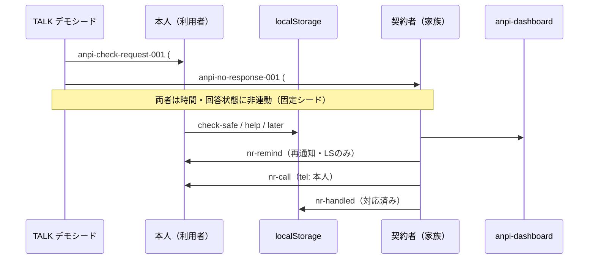
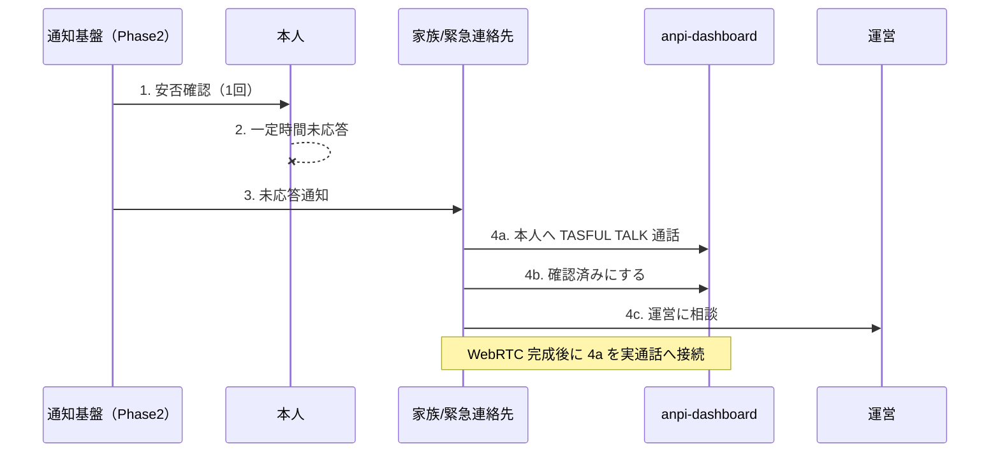
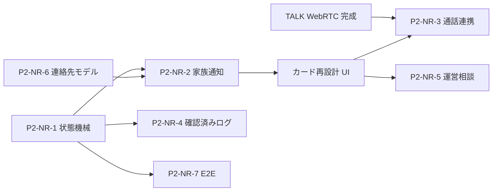

# 安否 未応答フロー — 設計見直し調査

**作成日:** 2026-06-17  
**目的:** 未応答時通知の現状実装と新方針の差分整理（**製品コード変更なし**）  
**凍結:** 安否 **RELEASE FROZEN** 維持 — 本ドキュメントは Phase2 設計入力のみ

**関連:** [`anpi-release-status.md`](anpi-release-status.md) · [`anpi-final-audit-remaining-issues.md`](anpi-final-audit-remaining-issues.md)（P2-9 未応答エスカレーション E2E）

---

## サマリー

| 項目 | 現状 | 新方針 |
|------|------|--------|
| 本人への安否確認 | TALK デモシード + `#check` UI | **1回のみ**（再送しない） |
| 未応答後 | 手動デモ状態・localStorage | **一定時間後に家族/緊急連絡先へ自動通知** |
| 家族側 CTA | 再通知 / tel:本人 / 対応済み | **TALK通話 / 確認済み / 運営相談** |
| 電話 | `tel:` で本人番号 | **Twilio 等は使わない**（WebRTC 完成後に TALK 通話） |
| 自動エスカレーション | **未実装** | Phase2 で状態機械 + イベント配信 |

**扱い:** 未応答エスカレーション再設計は **Phase2 / P2**。TALK WebRTC 通話実装後に通話導線を再検討する。

---

## 1. 現状フロー

### 1.1 全体像



現状は **UI デモ + localStorage** が中心。**サーバー側の未応答判定・自動エスカレーションは未実装**。

### 1.2 本人通知（安否確認）

| 項目 | 内容 |
|------|------|
| 定義 | `talk-anpi-notify-master-v1.js` — `anpi-check-request-001` |
| subType | `check` |
| audience | `user`（メタデータ。実ルーティング未実装） |
| 遷移 | `anpi-dashboard.html#check` |
| UI | `anpi-notify-cards.js` — 「無事です / 支援が必要 / 後で回答」 |
| 永続化 | `localStorage` キー `tasful_anpi_notify_demo_v1` の `check.response` |
| 連動 | `#no-response` リストとの **自動連動なし**（回答しても未応答項目は残る） |

### 1.3 no-response デモシード

| 項目 | 内容 |
|------|------|
| 定義 | `talk-anpi-notify-master-v1.js` — `anpi-no-response-001` |
| subType | `no_response` |
| audience | `family` |
| 文言 | 「未回答者がいます」— 安否確認にまだ応答していない登録家族がいます |
| 遷移 | `anpi-dashboard.html#no-response` |
| TALK ラベル | `talk-notify-content-type.js` — 「未回答」 |
| 連動 | `anpi-check-request-001` との **時間経過・回答状態による生成なし**（一覧に並ぶ固定シード） |

### 1.4 未応答カード UI（契約者向け `#no-response`）

実装: `anpi-notify-cards.js`（`renderNoResponseCard` / `handleAction`）

デモデータ例（`defaultState().noResponse.items`）:

- 名前: 田中 次郎、続柄: 父、`phone: 090-1234-5678`
- `lastNotifyAt` / `remindHistory` / `handled`

タイトル: **「未応答の家族がいます」**（未回答の **利用者** を契約者が見る構図だが、文言は「家族」）

#### アクション: 再通知する（`nr-remind`）

| 項目 | 内容 |
|------|------|
| ラベル | 再通知する |
| 動作 | `lastNotifyAt` 更新、`remindHistory` にタイムスタンプ追記 |
| 送信 | **なし**（Push / LINE / TALK メッセージ未発火） |
| 永続化 | `localStorage` のみ |
| E2E | `scripts/test-anpi-notify-dashboard-verify.mjs` — リロード後 `remindHistory` 永続を検証 |
| 方針上 | **本人への再通知** — 新方針「本人1回」と矛盾 |

#### アクション: 電話する（`nr-call`）

| 項目 | 内容 |
|------|------|
| ラベル | 電話する |
| 動作 | `location.href = tel:${item.phone}` — **利用者（本人）電話** |
| API | ブラウザ `tel:` のみ（Twilio / WebRTC **なし**） |
| E2E | `scripts/verify-talk-anpi-navigation.mjs` — `nr-call` を期待アクションに列挙 |
| 方針上 | **老人本人への電話優先** — 新方針と矛盾 |

#### アクション: 対応済みにする（`nr-handled`）

| 項目 | 内容 |
|------|------|
| ラベル | 対応済みにする |
| 動作 | `handled: true` — 一覧から非表示 |
| 意味 | 「本人安否を確認した」監査記録ではなく **対応完了フラグ** のみ |
| 全件完了時 | 「未応答の対応完了 / すべて対応済み」表示 |

### 1.5 localStorage 中心

| キー / モジュール | 用途 |
|-------------------|------|
| `tasful_anpi_notify_demo_v1` | ダッシュボード通知カード全状態（check / family / noResponse / disaster / drill / settings） |
| `tasu_anpi_notification_logs_v1` | 安否通知ログ（AI 相談・緊急キーワード等）— `anpi-notification-log.js` |
| Supabase | context / notification_logs の RLS・永続化は **別経路**（未応答エスカレーションとは未接続） |

未応答フロー本体（タイマー・エスカレーション・家族 Push）は **DB / Edge Function 未実装**。

### 1.6 自動エスカレーション未実装

| 欠落 | 詳細 |
|------|------|
| 未応答タイマー | 期限 `deadline`（例: 本日 18:00まで）は **表示用デモ** のみ |
| 状態遷移 | check 回答 → no_response 生成のロジックなし |
| LINE Push | `anpi-notification-log.js` — deliverable は `urgent_keyword_detected` 等のみ。**`no_response` 非対象** |
| Edge Function | `supabase/functions/anpi-line-send` — 同様に緊急系のみ |
| AI 運営 | `admin-ai-response-plans.js` — `anpi_no_response` プランは Hub 未読から生成するが **手動デモ依存** |
| E2E | 監査 P2-9: **未応答→エスカレーション専用 E2E なし** |

### 1.7 データモデル（登録）

`anpi-register.html` / `anpi-user-context.js`:

- **契約者 1名**（`contract_holder_*`）+ **利用者 1名**（`user_*`）
- 家族 / 緊急連絡先 **複数登録フィールドなし**
- `consent_emergency_contact_required` — 119/警察/家族等への直接連絡 **同意** のみ
- デモ `settings.familyMembers` — 通知設定カード表示用（本番 context 未連携）

---

## 2. 新方針

### 2.1 基本原則

1. **本人への安否確認は 1 回** — 未応答でも本人へ繰り返し通知しない。
2. **一定時間未応答 → 家族 / 緊急連絡先へ「未応答」通知** — まず家族に気づかせる。
3. **老人本人への自動電話を優先しない** — 電話 API は最終段階に回す（本フェーズでは使わない）。

### 2.2 理想フロー



### 2.3 家族側 CTA（目標）

| CTA | 意図 |
|-----|------|
| **本人へ TASFUL TALK 通話** | 家族が本人と音声/ビデオで確認（WebRTC 完成後に実装接続。それまではルーム誘導等の placeholder 可） |
| **確認済みにする** | 契約者が本人の安否を確認した旨を記録（監査ログ化を Phase2 で検討） |
| **運営に相談** | サポート / AI 運営 Inbox 等へのエスカレーション導線 |

### 2.4 電話・通話の扱い

| 手段 | 方針 |
|------|------|
| Twilio 等 PSTN API | **使わない**（最終保険として将来後付け可だが本設計スコープ外） |
| ブラウザ `tel:` 本人発信 | **primary CTA として使わない** |
| TALK WebRTC | **完成後**に「本人へ TASFUL TALK 通話」を実通話に接続 |

---

## 3. 現状との差分

| # | 観点 | 現状 | 新方針 | 変更種別 |
|---|------|------|--------|----------|
| 1 | 本人通知回数 | `nr-remind` で再通知 UI あり | 1 回のみ | **nr-remind 削除候補** |
| 2 | 未応答後の連絡先 | `tel:` で **本人** | 家族へ先に通知 | **nr-call の向き変更**（削除または secondary 化） |
| 3 | 家族カード | 再通知 / 電話 / 対応済み | TALK通話 / 確認済み / 運営相談 | **家族通知カード再設計** |
| 4 | 時間経過 | なし（固定シード） | 一定時間でエスカレーション | **未応答タイマー**（新規） |
| 5 | 連絡先 | 契約者 1名 | 家族 + 緊急連絡先 | **緊急連絡先モデル** 拡張 |
| 6 | AI 運営文案 | 「利用者へのフォロー連絡案を作成」 | 家族への気づき・確認支援 | **AI 運営の提案文変更** |
| 7 | LINE / Push | `no_response` 非 deliverable | 家族向け未応答イベント配信 | イベント種別追加 |
| 8 | 状態連動 | check ↔ noResponse 非連動 | 回答 or タイムアウトで遷移 | 状態機械 |

### 3.1 nr-remind 削除候補

- **ファイル:** `anpi-notify-cards.js`（`renderNoResponseCard`, `handleAction` case `nr-remind`）
- **テスト:** `scripts/verify-talk-anpi-navigation.mjs`, `scripts/test-anpi-notify-dashboard-verify.mjs`
- **理由:** 本人への繰り返し通知は新方針と両立しない

### 3.2 nr-call の向き変更

- **現状:** 未応答 **利用者** の `phone` へ `tel:`
- **新方針:** primary CTA から除外。通話は **TALK WebRTC → 本人ルーム** 経由（Phase2 以降）
- **注意:** `anpi-register` の利用者電話はマスク保存 — 家族 UI から直接 PSTN を primary にしない

### 3.3 家族通知カード再設計

| 現行ボタン | 新 CTA 案 |
|------------|-----------|
| 再通知する | **削除** |
| 電話する | **本人へ TASFUL TALK 通話**（WebRTC まで placeholder） |
| 対応済みにする | **確認済みにする**（意味を監査可能に再定義） |
| （なし） | **運営に相談**（新規） |

TALK 通知カード（`talk-anpi-notify-master-v1.js`）の `actionLabel` / `body` も家族向け文言に合わせて更新候補。

### 3.4 未応答タイマー

Phase2 で決定が必要な項目:

- 閾値（例: 30分 / 2時間 / 災害時短縮）
- 起点（安否確認送信時刻 vs 期限 `deadline`）
- 実装層（Supabase Edge Function + pg_cron / 外部 scheduler）
- 本人への追加リマインド **禁止** の enforcement

### 3.5 緊急連絡先モデル

| 現状 | 必要な検討 |
|------|------------|
| `contract_holder_*` 1名 | 追加の家族・緊急連絡先（複数） |
| RLS: 契約者は自分の logs のみ | 連絡先ごとの通知権限 |
| `notify_channels` | 連絡先単位のチャネル設定 |

### 3.6 AI 運営の提案文変更

`admin-ai-response-plans.js` — `collectFromAnpi()`:

- **現状 `aiSuggestion`:** 「安否通知の確認・**利用者へのフォロー連絡案**を作成」
- **新方針案:** 「**家族/契約者**への未応答通知確認・本人安否の確認支援・必要時運営エスカレーション」

`eventType: anpi_no_response` は維持可能。文案と `targetUrl`（運営相談導線）の見直しが Phase2 対象。

---

## 4. Phase2 実装候補

安否コア（登録・RLS・LINE 基盤・ダッシュボード骨格）は **RELEASE FROZEN**。以下は **Phase2 / P2** バックログとして切り出す。

| ID | 候補 | 概要 | 主なタッチポイント（参考） |
|----|------|------|---------------------------|
| P2-NR-1 | **未応答状態機械** | `pending_check` → `answered` / `no_response` → `confirmed_by_family` / `escalated_to_ops` | 新規スキーマ or `anpi_notification_logs` 拡張、Edge Function |
| P2-NR-2 | **家族通知イベント** | タイマー満了で TALK / tasful_chat /（任意）LINE Push | `talk-anpi-notify-master-v1.js` → 動的生成、`anpi-line-send` 種別追加 |
| P2-NR-3 | **TALK WebRTC 通話連携** | 「本人へ TASFUL TALK 通話」CTA を実通話に接続 | TALK WebRTC 完成後、`anpi-notify-cards.js`、ルーム作成 API |
| P2-NR-4 | **確認済み監査ログ** | 契約者の「確認済み」操作を immutable ログ化 | Supabase `anpi_notification_logs` or 専用テーブル、RLS |
| P2-NR-5 | **運営相談導線** | サポート / admin-ai Inbox へのワンタップ | `support-trouble-center.html`、admin-ai-response-plans |
| P2-NR-6 | **緊急連絡先モデル** | 複数連絡先登録・通知ルーティング | `anpi-register.html`, `anpi-user-context.js`, SQL |
| P2-NR-7 | **E2E** | 未応答→エスカレーション一連（監査 P2-9 昇格候補） | 新規 `scripts/test-anpi-no-response-escalation-*.mjs` |

### 4.1 未応答状態機械（案）

```
[check_sent] ──(本人回答)──> [answered]
      │
      └──(timeout, 再通知なし)──> [no_response]
                                      │
                    ┌─────────────────┼─────────────────┐
                    ▼                 ▼                 ▼
            [family_notified]  [confirmed]      [ops_consulted]
```

### 4.2 依存関係



---

## 5. 方針

### 5.1 RELEASE FROZEN 維持

| 区分 | 扱い |
|------|------|
| 安否コア（登録・RLS・通知センター・LINE OAuth・identity linking） | **変更しない** — [`anpi-release-status.md`](anpi-release-status.md) 維持 |
| 未応答エスカレーション再設計 | **Phase2 / P2** — 本調査は設計入力のみ |
| 現行 `nr-remind` / `nr-call` | フローズンコードとして **現状維持**（Phase2 着手まで触らない） |

### 5.2 優先順位

1. **設計確定** — タイマー閾値・連絡先モデル・「確認済み」の監査定義
2. **状態機械 + 家族通知イベント** — 自動エスカレーションの最小縦切り
3. **UI カード再設計** — CTA 差し替え（WebRTC 前は通話 placeholder）
4. **TALK WebRTC 完成後** — 通話 CTA の実装接続を再検討
5. **Twilio 等** — 本ロードマップでは **採用しない**（将来の最終保険として別 Epic）

### 5.3 既存 P2 との関係

| 既存 ID | 内容 | 本設計との関係 |
|---------|------|----------------|
| P2-9（`anpi-final-audit-remaining-issues.md`） | 未応答→エスカレーション E2E | **P2-NR-7 に統合・具体化** |
| P2-13 | Ops Watch 安否 confirmed KPI | P2-NR-4 確認済みログと連動可能 |

---

## 参照ファイル（現状実装）

| ファイル | 役割 |
|----------|------|
| `talk-anpi-notify-master-v1.js` | TALK 安否通知デモシード（check / no_response） |
| `anpi-notify-cards.js` | `#check` / `#no-response` カードと `nr-*` アクション |
| `anpi-notification-log.js` | 通知ログ・LINE deliverable 種別 |
| `supabase/functions/anpi-line-send/index.ts` | LINE Push（緊急系のみ） |
| `anpi-user-context.js` | 契約者・利用者コンテキスト |
| `admin-ai-response-plans.js` | `anpi_no_response` 運営プラン |
| `scripts/verify-talk-anpi-navigation.mjs` | TALK → ダッシュボード操作 E2E |

---

*本ドキュメントは調査・設計整理のみ。製品コード変更は Phase2 承認後に別タスクで実施する。*
