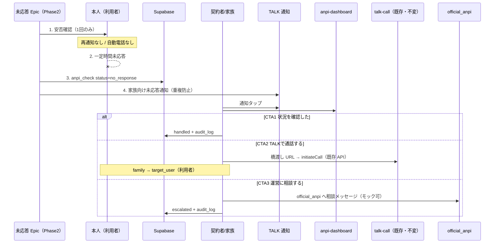
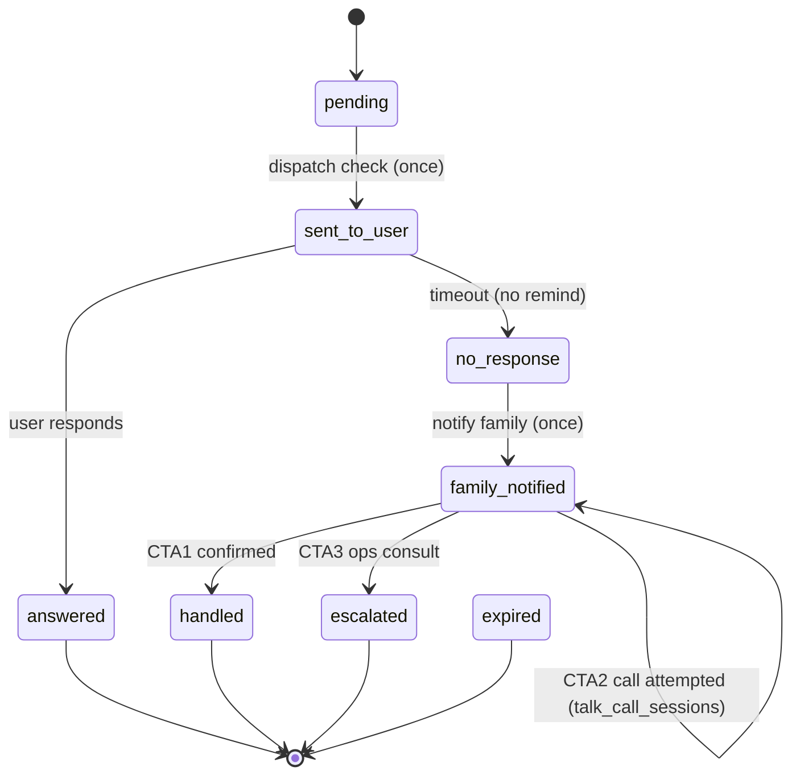

# 安否 未応答フロー — Phase2 設計レビュー

**作成日:** 2026-06-17  
**種別:** 設計のみ（**実装しない**）  
**前提:** 安否 / TALK / AI運営秘書 / Connect / Builder **RELEASE FROZEN** · TALK WebRTC Phase1 **LOCK** · AI音声 Phase1 **LOCK**

**関連資料:**

- [`anpi-no-response-design-review.md`](anpi-no-response-design-review.md) — Phase1 調査（現状差分）
- [`talk-webrtc-call-phase1-implementation.md`](talk-webrtc-call-phase1-implementation.md) — 通話基盤 LOCK
- [`ai-voice-selection-phase1-implementation.md`](ai-voice-selection-phase1-implementation.md) — AI音声 LOCK
- [`anpi-release-status.md`](anpi-release-status.md) · [`talk-release-status.md`](talk-release-status.md)

---

## 1. エグゼクティブサマリー

安否未応答は現状 **固定デモシード + localStorage** で、本人確認と未応答カードが **非連動**。CTA は新方針（本人1回・再通知なし・Twilio なし）と **矛盾**（`nr-remind` / `nr-call`）。

Phase2 は **新 Epic** として「未応答イベント → 家族 TALK 通知 → 3 CTA → WebRTC 既存発信の橋渡し」を実装する。**WebRTC / AI音声 / TALK コア / admin-ai 本体は触らない**。安否側は **限定解凍**（`anpi-notify-cards.js` CTA 差替え + 新規 bridge / SQL のみ）。

**推奨:** Phase2 **実装 Go**（最小縦切り）。**Supabase は本番未応答イベントに必須**。WebRTC **モジュール変更不要**（URL 橋渡し Epic のみ）。AI音声 **Phase2 変更不要**。

---

## 2. 現状調査

### 2.1 安否デモ導線

| レイヤ | ファイル | 内容 |
|--------|----------|------|
| TALK 通知シード | [`talk-anpi-notify-master-v1.js`](../talk-anpi-notify-master-v1.js) | `anpi-check-request-001`（本人 `#check`）/ `anpi-no-response-001`（家族 `#no-response`）— **固定・非連動** |
| ダッシュボード UI | [`anpi-dashboard.html`](../anpi-dashboard.html) + [`anpi-notify-cards.js`](../anpi-notify-cards.js) | `#check` / `#no-response` 等アンカー |
| 本人回答 | `anpi-notify-cards.js` | `check-safe` / `check-help` / `check-later` → `localStorage` `check.response` |
| TALK ラベル | [`talk-notify-content-type.js`](../talk-notify-content-type.js) | `no_response` → 「未回答」 |
| 公式ルーム | `official_anpi` | 安否通知センター（**WebRTC 発信不可** — `canCallThread` で official 除外） |

### 2.2 no-response デモ（`#no-response`）

| 項目 | 現状 |
|------|------|
| データ | `defaultState().noResponse.items` — 例: 田中次郎 / 父 / `phone` |
| 表示 | 「未応答の**家族**がいます」（契約者視点で利用者未回答のはずだが文言ゆれ） |
| 経過 | `formatElapsedSince(lastNotifyAt)` バッジあり |

### 2.3 nr-remind / nr-call / nr-handled

| アクション | 実装 | 新方針との関係 |
|------------|------|----------------|
| **nr-remind** | `remindHistory` + `lastNotifyAt` を LS 更新。**送信なし** | ❌ **削除**（本人再通知禁止） |
| **nr-call** | `tel:${item.phone}` — **本人 PSTN** | ❌ **削除**（Twilio/本人電話禁止） |
| **nr-handled** | `handled: true` — 一覧非表示のみ | △ **「状況を確認した」に再定義** + 監査ログ |

E2E: [`scripts/test-anpi-notify-dashboard-verify.mjs`](../scripts/test-anpi-notify-dashboard-verify.mjs) 等が `nr-remind` / `nr-handled` を検証。

### 2.4 localStorage 使用箇所（未応答関連）

| キー / モジュール | 用途 |
|-------------------|------|
| `tasful_anpi_notify_demo_v1` | ダッシュボード全状態（check / noResponse / family / …） |
| `tasu_anpi_user_context_v1` | 契約者・利用者コンテキスト（[`anpi-user-context.js`](../anpi-user-context.js)） |
| `tasu_anpi_notification_logs_v1` | 安否通知ログ（[`anpi-notification-log.js`](../anpi-notification-log.js)） |

**Supabase:** `anpi_user_contexts` / `anpi_notification_logs` あり（[`sql/anpi-user-context.sql`](../sql/anpi-user-context.sql), [`sql/anpi-notification-logs.sql`](../sql/anpi-notification-logs.sql)）。**未応答エスカレーション状態機械とは未接続**。

### 2.5 TALK 通知との接続

| 経路 | 状態 |
|------|------|
| TALK 一覧 | `talk-anpi-notify-master-v1.js` → `talk-platform-notify-master-v1.js` 経由でデモ行表示 |
| 動的生成 | **なし** — check 未回答から no_response 行を生成する処理なし |
| LINE Push | [`anpi-notification-log.js`](../anpi-notification-log.js) — `LINE_DELIVERABLE` は `urgent_keyword_detected` 等のみ。**`no_response` 非対象** |
| Edge | [`supabase/functions/anpi-line-send`](../supabase/functions/anpi-line-send/index.ts) — 同上 |

### 2.6 運営導線

| 導線 | 対象 | Phase2 家族 CTA との関係 |
|------|------|--------------------------|
| [`admin-operations-dashboard.html#ops-ai-secretary`](../admin-operations-dashboard.html) | 運営 | **FROZEN** — 家族向けではない |
| [`admin-ai-response-plans.js`](../admin-ai-response-plans.js) `anpi_no_response` | 運営 AI 提案 | Hub 未読から生成。**文案は「利用者フォロー」寄り → Phase2 で家族支援向けに変更候補**（admin FROZEN のため **新 Epic からの参照のみ**） |
| [`support-trouble-center.html`](../support-trouble-center.html) | **運営専用** Admin | 家族 CTA には **不適** |
| TALK `official_anpi` | 利用者・契約者 | **Phase2 最小の「運営相談」モック先**（メッセージ相談、通話不可） |

### 2.7 登録モデル制約

[`anpi-register.html`](../anpi-register.html): **契約者 1名 + 利用者 1名**。複数家族 / 緊急連絡先フィールド **なし**（`consent_emergency_contact_required` は同意のみ）。

Phase2 最小: **contract_holder_id → user_id（利用者）** の 1:1 エスカレーション。複数連絡先は Phase2 後半 or Phase3（P2-NR-6）。

### 2.8 WebRTC / AI音声（LOCK 済み）

| 基盤 | 状態 | 安否 Phase2 との関係 |
|------|------|----------------------|
| [`scripts/talk-call-*.js`](../scripts/talk-call-service.js) | **LOCK** — 1:1 direct のみ、official/group 不可 | **変更しない**。橋渡し URL のみ |
| [`reports/talk-webrtc-call-phase1-implementation.md`](talk-webrtc-call-phase1-implementation.md) | Supabase `talk_call_sessions` | 安否イベントと **疎結合**（`anpi_check_id` を metadata に持つ程度） |
| AI音声 | **LOCK** — `ai-concierge` / voice-settings | Phase2 **非使用** |

---

## 3. 新フロー設計（確定方針反映）

### 3.1 シーケンス



### 3.2 原則チェックリスト

| 原則 | Phase2 |
|------|--------|
| 本人へ安否確認 1 回 | ✅ サーバー側 `sent_to_user` で enforce |
| 本人再通知なし | ✅ `nr-remind` 削除、`remindHistory` 廃止 |
| 本人自動電話なし | ✅ `nr-call` / Twilio なし |
| 家族へ未応答通知 | ✅ TALK + ダッシュボード |
| 家族判断で TALK 通話 | ✅ WebRTC 既存 |
| Twilio 不使用 | ✅ |

---

## 4. 状態遷移

### 4.1 status 候補（採用案）

| status | 意味 | 遷移元 |
|--------|------|--------|
| `pending` | チェック作成前 | — |
| `sent_to_user` | 本人へ安否確認送信済（1回） | pending |
| `answered` | 本人回答済 | sent_to_user |
| `no_response` | 期限切れ・未回答 | sent_to_user |
| `family_notified` | 家族へ TALK 通知済 | no_response |
| `handled` | 家族が「状況を確認した」 | family_notified |
| `escalated` | 「運営に相談」実行 | family_notified |
| `expired` | 対応期限切れ（任意） | family_notified |

**終端:** `answered` / `handled` / `escalated` / `expired`

### 4.2 状態機械



**重複防止:** `family_notified` への遷移は **1 check_id あたり 1 回**（DB unique / idempotency key）。

---

## 5. CTA 仕様

### 5.1 CTA 1 — 状況を確認した

| 項目 | 内容 |
|------|------|
| ラベル | **状況を確認した** |
| 旧 `nr-handled` 置換 | ✅ |
| 動作 | `status → handled`、`handled_at` / `handled_by` / `action_type=confirmed` |
| 監査 | `anpi_no_response_audit_log` INSERT（immutable） |
| UI | カード非表示 or 完了表示 |
| 意味 | 「本人の安否を別手段で確認した」（電話/訪問/第三者 — システムは判断しない） |

### 5.2 CTA 2 — TALKで通話する

| 項目 | 内容 |
|------|------|
| ラベル | **TALKで通話する** |
| 発信方向 | **family_user（契約者）→ target_user（未応答の利用者）** |
| 根拠 | 新方針「家族が判断して本人と TALK 通話」。`official_anpi` / 運営へは **発信しない** |
| 実装 | **WebRTC 本体変更なし** — 新規 **橋渡し Epic** のみ |

**推奨 Phase2 最小パターン:**

```
1. CTA クリック
2. 遷移: talk-home.html?userId={contract_holder_id}&tab=chat
         &anpiCallTarget={target_user_id}
         &anpiCallThread=anpi-direct-{target_user_id}
         &from=anpi-no-response
3. 新規 scripts/anpi-talk-call-bridge.js（anpi / talk-home から条件付き load）
   - URL パラメータを読み、ephemeral thread を構築:
     { id, threadKind: "direct", partnerUserId: target_user_id, ... }
   - TasuTalkLineRoom.openThread(thread) 相当 + TasuTalkCallService.initiateCall(thread)
4. talk_call_sessions.caller_id = contract_holder, callee_id = target_user
5. metadata に anpi_check_id を任意で付与（通話 DB スキーマ変更なし）
```

**WebRTC モジュール変更:** **不要**（`talk-call-service.js` の `canCallThread` は direct thread ならそのまま動作）。  
**TALK コア変更:** **避ける** — bridge が ephemeral thread を渡すだけ。`talk-home-data.js` 改修は Phase2 後半。

**利用者が TALK 未起動時:** 着信不可（WebRTC Phase1 制限どおり）。CTA 近傍に「本人が TALK を開いている必要があります」注記。

### 5.3 CTA 3 — 運営に相談する

| 候補 | 適合 | Phase2 推奨 |
|------|------|---------------|
| `support-trouble-center.html` | 運営 Admin 専用 | ❌ |
| `admin-operations-dashboard#ops-ai-secretary` | 運営 FROZEN | ❌（家族不可） |
| **`official_anpi` TALK ルーム** | 既存・利用者/契約者が利用可 | ✅ **最小モック** |
| 新規 `anpi-escalation-ticket`（LS） | 家族向け | △ 次善 |

**Phase2 最小:**

```
talk-home.html?tab=chat&openRoom=official_anpi&anpiEscalate={check_id}
+ composer に下書き「安否未応答（{利用者名}）について相談します」
```

`status → escalated`、`action_type=ops_consult`、監査ログ。  
運営側は既存 `anpi_no_response` AI プラン / Hub で **間接参照**（admin-ai **文案変更は Phase3** — FROZEN）。

---

## 6. 通知設計

### 6.1 家族向け TALK 通知カード

| 項目 | 案 |
|------|-----|
| subType | `no_response`（維持） |
| audience | `family` |
| タイトル | **「安否確認が未回答です」** |
| 本文 | 「{利用者名}さんが安否確認に応答していません（{経過時間}）。ご確認ください。」 |
| 重要度 | `urgent` または `high`（災害時は `urgent` 固定も可） |
| actionLabel | **対応する** |
| href | `anpi-dashboard.html#no-response?checkId={anpi_check_id}` |
| officialRoomId | `official_anpi`（一覧表示用。CTA 通話先ではない） |

### 6.2 ダッシュボード `#no-response` カード（再設計）

```
┌─────────────────────────────────────────┐
│ 未応答 · 安否確認が未回答です              │
│ {利用者名}（{続柄}）— 未回答 {2時間15分}   │
│ 最終確認送信: 2026-06-17 14:00          │
├─────────────────────────────────────────┤
│ [状況を確認した]  [TALKで通話する]        │
│ [運営に相談する]                          │
└─────────────────────────────────────────┘
```

- **nr-remind / nr-call 削除**
- 経過時間: `no_response_at` 起点
- 既読: TALK 通知 `readAt` + ダッシュボード訪問で `viewed_at`（任意）
- 未対応: `status === family_notified` かつ CTA 未実行

### 6.3 重複通知防止

| ルール | 実装 |
|--------|------|
| 本人 | check **1 回** — DB `sent_to_user` 後は再 dispatch 禁止 |
| 家族 | `family_notified` **1 回** — unique `(anpi_check_id, notify_channel)` |
| TALK 一覧 | 同一 `checkId` の duplicate seed 抑制 |
| リマインド | **実装しない**（Phase3 も本人向け再送は禁止のまま） |

---

## 7. データ構造案

### 7.1 新規テーブル `anpi_check_sessions`（推奨）

安否チェック 1 回 = 1 行。`anpi_notification_logs` とは分離（ログはイベント履歴、本テーブルは状態機械）。

| 列 | 型 | 備考 |
|----|-----|------|
| id | uuid PK | **anpi_check_id** |
| target_user_id | text | 利用者 |
| contract_holder_id | text | 契約者 / 主通知先 |
| emergency_contact_user_id | text | nullable — Phase3 複数連絡先 |
| status | text | §4.1 |
| check_sent_at | timestamptz | 本人へ 1 回送信 |
| response_deadline_at | timestamptz | 未応答判定 |
| responded_at | timestamptz | nullable |
| no_response_at | timestamptz | nullable |
| family_notified_at | timestamptz | nullable |
| handled_at | timestamptz | nullable |
| handled_by | text | nullable — talk_user_id |
| action_type | text | `confirmed` / `talk_call` / `ops_consult` |
| metadata | jsonb | 災害フラグ、thread_id 等 |
| created_at / updated_at | timestamptz | |

**インデックス:** `(target_user_id, status)`, `(contract_holder_id, status)`, unique 制約で idempotency。

### 7.2 監査ログ `anpi_no_response_audit_log`

| 列 | 型 |
|----|-----|
| id | uuid PK |
| anpi_check_id | uuid FK |
| actor_user_id | text |
| action_type | text — `confirmed` / `talk_call_initiated` / `ops_consult` / `status_change` |
| payload | jsonb |
| created_at | timestamptz |

### 7.3 既存テーブルとの関係

| 既存 | 関係 |
|------|------|
| `anpi_notification_logs` | `event_type: anpi_no_response` / `anpi_check_sent` 等で **履歴追記**（metadata に `anpi_check_id`） |
| `anpi_user_contexts` | `target_user_id` / `contract_holder_id` 解決 |
| `talk_call_sessions` | **独立**。必要なら `metadata.anpi_check_id` のみ（スキーマ変更なし） |

---

## 8. localStorage / Supabase 分離

| データ | Phase2 デモ | Phase2 本番 |
|--------|-------------|---------------|
| ダッシュボード UI 状態 | `tasful_anpi_notify_demo_v1` **維持可** | DB から hydrate |
| 未応答イベント本体 | LS シミュレーション（開発） | **`anpi_check_sessions` 必須** |
| 監査ログ | LS 配列（E2E のみ） | **Supabase 必須** |
| 通話状態 | — | **`talk_call_sessions`（既存 WebRTC DB）** |
| 安否 ↔ 通話 | — | **疎結合**（check_id を audit / metadata のみ） |

**判断:** Phase2 本番縦切りでは **Supabase 必須**。デモモード (`talkDev=1`) では LS フォールバック可。

**タイマー実装:** Edge Function `anpi-check-timeout` + cron、または `response_deadline_at` ポーリング。閾値初期値 **2 時間**（災害短縮は Phase3 設定 UI）。

---

## 9. WebRTC 連携方針

| 質問 | 回答 |
|------|------|
| family → 誰に発信？ | **target_user（未応答利用者）** |
| family → 運営？ | **Phase2 では発信しない**（CTA3 は TALK メッセージ） |
| WebRTC 変更必要？ | **No** — 新規 `anpi-talk-call-bridge.js` のみ |
| talk-line-room 変更？ | **最小** — bridge から `initiateCall` 呼び出し。`talkCall=1` URL フックは **bridge 内** に�封じ |
| official ルーム | 通話 **不可**（既存 LOCK 維持） |
| 認証 | JWT `talk_user_id` = contract_holder（既存 RLS） |

---

## 10. AI音声連携方針

| 用途 | Phase2 | Phase3 |
|------|--------|--------|
| 安否案内音声（本人） | **使わない** | 通知読み上げ検討 |
| 家族通知読み上げ | **使わない** | `TasuVoicePreferences` 参照可 |
| AI運営秘書音声 | **使わない**（FROZEN） | admin Epic 解凍後 |
| 実装変更 | **なし** | voice-settings / anpi bridge |

---

## 11. 実装しない項目（明記）

- 本人への再通知 / リマインド
- 本人への自動電話（PSTN / Twilio / WebRTC 自動発信）
- Twilio / 外部 SMS・電話
- TURN 必須化 / coturn
- Push 必須化
- 通話録音
- AI による安否判断
- 自動 119 番 / 医療判断
- 安否専用 WebRTC スタック
- `talk-call-*` / `ai-concierge` / admin-ai 本体改修

---

## 12. Phase2 / Phase3 分離

### 12.1 Phase2（実装候補）

| ID | 内容 | 触るファイル（例） |
|----|------|-------------------|
| P2-NR-1 | `anpi_check_sessions` + Edge timeout | 新規 SQL / Edge |
| P2-NR-2 | 家族 TALK 通知（動的） | 新規 `anpi-no-response-notify.js` |
| P2-NR-3 | `#no-response` CTA 3 ボタン | `anpi-notify-cards.js` **限定解凍** |
| P2-NR-4 | 監査ログ | 新規 SQL + insert helper |
| P2-NR-5 | WebRTC 橋渡し | **新規** `scripts/anpi-talk-call-bridge.js` |
| P2-NR-6 | 運営相談モック | bridge → `official_anpi` |
| P2-NR-7 | E2E | `scripts/test-anpi-no-response-phase2-*.mjs` |
| P2-NR-8 | 既存 E2E 更新 | `nr-remind` / `nr-call` 削除に伴う test 差替え |

### 12.2 Phase3 バックログ

- Web Push / LINE `no_response` deliverable 追加
- 安否履歴・レポート UI
- 複数緊急連絡先モデル
- AI音声案内（家族通知読み上げ）
- coturn / 厳格 NAT
- 通知再送ポリシー（**本人向け除外**のまま）
- 外部 SMS / PSTN（Twilio）— 別 Epic・最終手段
- admin-ai 文案・`anpi_no_response` プラン更新
- `anpi_check` と災害モード連動

---

## 13. リスク

| リスク | 深刻度 | 対策 |
|--------|--------|------|
| **RELEASE FROZEN 破壊** | 高 | 新 Epic + `anpi-notify-cards` CTA のみ。register/RLS/LINE コア非接触 |
| WebRTC と混同 | 中 | CTA 文言「TALKで通話」/ 安否専用 PSTN 禁止を UI で明示 |
| 利用者 TALK 未起動 | 中 | 通話失敗時 toast + CTA1/3 誘導 |
| 1 契約者モデル | 中 | Phase2 は contract_holder のみ。複数は Phase3 |
| タイマー信頼性 | 中 | Supabase + Edge。クライアント timer のみにしない |
| テスト破壊 | 低 | `nr-*` E2E を Phase2 用に差替え |
| admin-ai FROZEN | 低 | 家族 CTA は official_anpi。運営 AI は間接 |

---

## 14. Phase2 実装候補（最小パッケージ）

1. SQL: `anpi_check_sessions` + `anpi_no_response_audit_log` + RLS
2. Edge: timeout → `no_response` → family notify（idempotent）
3. `scripts/anpi-no-response-service.js` — 状態 CRUD
4. `scripts/anpi-no-response-notify.js` — TALK 通知 1 件生成
5. `scripts/anpi-talk-call-bridge.js` — URL → ephemeral thread → `initiateCall`
6. `anpi-notify-cards.js` — CTA 3 つ（**唯一の凍結安否 UI 変更**）
7. `talk-anpi-notify-master-v1.js` — 動的行生成 hook（または完全動的化）
8. E2E 1 本（timeout 短縮 env 可）
9. `reports/anpi-no-response-phase2-implementation.md`（実装後）

**工数:** 中（WebRTC / 音声 LOCK 済みで通話は橋渡しのみ）。

---

## 15. 最終判定

| # | 質問 | 判定 |
|---|------|------|
| 1 | **Phase2 で実装すべきか** | **Yes** — 新方針と現状の gap が大きく、WebRTC LOCK により CTA2 が実装可能になった |
| 2 | **最小実装スコープ** | 上記 §14 の 1〜8。複数連絡先・Push・AI音声・admin 文案は **除外** |
| 3 | **Supabase 必須か** | **本番イベントは Yes**（状態・監査・重複防止）。デモ LS は開発補助のみ |
| 4 | **WebRTC 側に変更が必要か** | **No** — `anpi-talk-call-bridge.js` 新規 Epic のみ |
| 5 | **AI音声側に変更が必要か** | **No** — Phase3 で読み上げ検討 |
| 6 | **RELEASE FROZEN を崩すリスク** | **中（制御可能）** — `anpi-notify-cards.js` CTA 差替え + 新規ファイルに限定すれば **低**。TALK コア / WebRTC / admin-ai / 安否 register・RLS 触ると **高** |

### Go / No-Go

| | |
|--|--|
| **Go** | 新 Epic 宣言 + 限定解凍範囲を `anpi-release-status.md` に Phase2 追記 |
| **No-Go** | `talk-call-service.js` 改修、本人 `nr-remind` 温存、Twilio 導入、admin-ai 直改修 |

---

## 16. 参照ファイル

| ファイル | 役割 |
|----------|------|
| [`anpi-notify-cards.js`](../anpi-notify-cards.js) | 現行 nr-* CTA |
| [`talk-anpi-notify-master-v1.js`](../talk-anpi-notify-master-v1.js) | TALK デモシード |
| [`anpi-notification-log.js`](../anpi-notification-log.js) | ログ・LINE allowlist |
| [`anpi-user-context.js`](../anpi-user-context.js) | 契約者・利用者 |
| [`scripts/talk-call-service.js`](../scripts/talk-call-service.js) | WebRTC LOCK |
| [`admin-ai-response-plans.js`](../admin-ai-response-plans.js) | 運営 anpi_no_response |
| [`reports/anpi-no-response-design-review.md`](anpi-no-response-design-review.md) | Phase1 調査 |

---

*本ドキュメントは設計レビューのみ。製品コード変更は Phase2 承認・Epic 宣言後に別タスクで実施する。*
