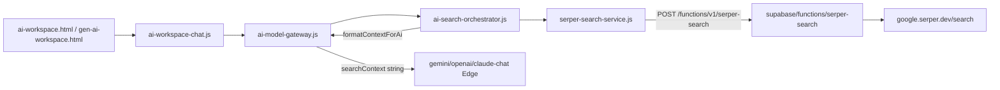

# Brave Search API 乗り換え調査

**実施日:** 2026-06-28  
**Git HEAD:** `d67631e`  
**スコープ:** 調査のみ（コード変更なし · コミットなし）  
**現状:** Web 検索は **Serper**（`google.serper.dev`）を Edge 経由で利用。Production ブロッカー: credits 枯渇。

---

## 1. エグゼクティブサマリー

| 項目 | 結論 |
| --- | --- |
| **推奨 API（第1段）** | **Brave Web Search API** — 既存 `{ title, url, snippet }` 契約への drop-in に最適 |
| **推奨 API（第2段・任意）** | **Brave LLM Context API** — `searchContext` 品質・トークン効率の改善用（UI カードとは別経路） |
| **Gateway 契約** | **`ai-model-gateway.js` 変更不要**（`searchContext: string` 維持で AD-005 遵守可能） |
| **最小変更ファイル数** | **1〜2**（Edge のみ差し替え + secret 名） |
| **フル移行（rename + テスト + docs）** | **約 25〜30 ファイル** |
| **想定工数** | 最小 **0.5〜1 日** / フル **3〜5 日** + 本番検証 **0.5〜1 日** |
| **Production 移行難易度** | **中**（Edge secret 切替 + live 回帰。日本語検索品質は要実測） |

---

## 2. 現行アーキテクチャ（Serper）



**Hybrid Search:** `ai-workspace-chat.js` が TASFUL 内検索 + Web 検索を並列。Web 側は `TasuAiWebSearchSerper.tryHandle` / orchestrator 経由で Serper 結果を HTML カード表示。

**Gateway:** Serper を直接呼ばない。`TasuAiSearchOrchestrator.prepare()` → `searchContext` 文字列を Edge chat に渡すのみ。

---

## 3. Serper 利用箇所一覧

### 3.1 Edge（本番検索の正本）

| ファイル | 役割 | Serper 依存 | Brave 置換時の変更量 |
| --- | --- | --- | --- |
| `supabase/functions/serper-search/index.ts` | `SERPER_API_KEY` で Serper POST。`organic[]` → `{ title, snippet, link, source }` に正規化して返却 | **完全依存**（唯一の upstream） | **大** — upstream URL・認証・レスポンスマッピング。secret 名 `BRAVE_SEARCH_API_KEY` 等 |
| `supabase/functions/_shared/ai-search-context.ts` | `searchContext` を system prompt に追記（6000 文字 cap） | **非依存**（文字列のみ） | **なし** |
| `supabase/functions/gemini-chat/index.ts` | `body.searchContext` 受信 | **非依存** | **なし** |
| `supabase/functions/openai-chat/index.ts` | 同上 | **非依存** | **なし** |
| `supabase/functions/claude-chat/index.ts` | 同上 | **非依存** | **なし** |
| `supabase/config.toml` | `[functions.serper-search] verify_jwt = false` | 関数名・CORS 設定 | **小** — 関数名維持なら不要。rename 時のみ |

**Edge secret:** `SERPER_API_KEY`（Supabase Edge secrets）

---

### 3.2 Client（ブラウザ）

| ファイル | 役割 | Serper 依存 | Brave 置換時の変更量 |
| --- | --- | --- | --- |
| `serper-search-service.js` | Edge `serper-search` を fetch。`normalizeResult`（title/url/snippet）。`formatContextForAi` で LLM 用テキスト生成。`PROVIDER = "serper"` | **完全依存**（エンドポイント名・provider 文字列・mock 名） | **中** — provider 抽象化 or rename。Edge 契約 `{ ok, query, results[] }` 維持なら **小** |
| `ai-search-orchestrator.js` | 意図判定後 `TasuSerperSearchService.search()`。`searchProvider: "serper"` をログ/Gateway に返す | **サービス名・provider 文字列** | **小〜中** — `TasuWebSearchService` 等に rename する場合は import 先変更 |
| `ai-web-search-serper.js` | **@deprecated** 互換層。HTML カード生成・`tryHandle` | Serper サービス経由 | **中** — ファイル名・global 名が Serper 固有。rename 推奨 |
| `search-intent-detector.js` | Web 検索要否判定 | **非依存** | **なし** |
| `ai-search-target.js` | TASFUL内 / Web / 両方 の UI 選択 | **非依存**（`web` / `both` ラベルのみ） | **なし** |
| `ai-workspace-chat.js` | Hybrid / Web 専用フロー。`formatWebSearchUnavailableMessage` が `serper_api_key` 等を検出 | **エラーメッセージ regex のみ** | **極小** — メッセージ文字列 |
| `ops-watch-service.js` | OPS 監視用 Web 検索 | `TasuSerperSearchService.search` 直接呼び出し | **小** — サービス rename に追随 |

**HTML script 読み込み:**

| ファイル | 読み込み |
| --- | --- |
| `ai-workspace.html` | `serper-search-service.js`, `ai-search-orchestrator.js`, `ai-web-search-serper.js` |
| `gen-ai-workspace.html` | `serper-search-service.js`, `ai-search-orchestrator.js` |
| `admin-operations-dashboard.html` | `serper-search-service.js` |
| `talk-ops-room.html` | `serper-search-service.js` |

---

### 3.3 Gateway

| ファイル | 役割 | Serper 依存 | Brave 置換時の変更量 |
| --- | --- | --- | --- |
| `ai-model-gateway.js` | `completeTurn` → `Orchestrator.prepare()` → `searchContext` を Edge chat に渡す。`search_provider` / `searchFailed` を返却 | **間接依存**（orchestrator 経由。Serper 文字列はログ/metadata） | **なし〜極小** — `searchProvider` 値が `"brave"` になる程度。**AD-005: シグネチャ変更不要** |

---

### 3.4 Workspace / Hybrid / Web Search

| 経路 | 実装 | Serper 依存 |
| --- | --- | --- |
| **Web Search**（検索対象=Web） | `ai-workspace-chat` → Gateway → Orchestrator → Serper service | あり |
| **Hybrid Search**（TASFUL内+Web） | 内部検索 + Web 側 `requestWebSearchReply` / `TasuAiWebSearchSerper` | Web 側のみ |
| **意図ベース自動検索** | `search-intent-detector` + orchestrator | あり |
| **添付あり時** | Gateway `skipSearch: true`（検索スキップ） | なし |

---

### 3.5 Environment / Secrets / Config

| 項目 | 内容 |
| --- | --- |
| Edge secret | `SERPER_API_KEY` |
| クライアント | API キー非保持（Edge 経由のみ） |
| Preflight | `scripts/test-tasful-ai-production-preflight.mjs` — `SERPER_API_KEY` 存在チェック |
| Live probe | `scripts/verify-tasful-ai-production-environment.mjs` — `serper-search` Edge |

---

### 3.6 Tests（Serper 参照）

| ファイル | 役割 | 変更量 |
| --- | --- | --- |
| `scripts/test-ai-serper-search-browser.mjs` | route 分類 · site/web/hybrid UI E2E | **中** — mock 名 `__TASU_SERPER_MOCK_RESPONSE__` |
| `scripts/test-ai-search-orchestrator-browser.mjs` | orchestrator + mock Serper | **小** |
| `scripts/test-tasful-ai-final-smoke-browser.mjs` | Gateway smoke · Serper mock | **小** |
| `scripts/test-tasful-ai-production-preflight.mjs` | secret 名 `SERPER_API_KEY` | **小** |
| `scripts/verify-tasful-ai-production-environment.mjs` | live `serper-search` probe | **小** |
| `scripts/test-ops-watch-phase1-browser.mjs` | OPS mock Serper | **小** |
| `scripts/test-ops-watch-phase2-browser.mjs` | 同上 | **小** |
| `scripts/test-ops-watch-live-production.mjs` | live 本番 | **小** |
| `scripts/test-secretary-ops-context-e2e.mjs` | console 許可 regex `serper-search` | **極小** |
| `scripts/test-secretary-deepseek-adapter-browser.mjs` | 同上 | **極小** |
| `scripts/test-admin-ai-secretary-text-chat-browser.mjs` | 同上 | **極小** |
| `scripts/test-admin-ops-dashboard-ui-final.mjs` | 同上 | **極小** |
| `scripts/test-tasful-regression-final.mjs` | console filter | **極小** |
| `scripts/report-deploy-git-manifest.mjs` | `ai-web-search-serper.js` を manifest 列挙 | **小**（rename 時） |

**AI 秘書 DeepSeek Edge:** `secretary-deepseek-chat` に Serper 直接依存 **なし**（dashboard 経由の `serper-search-service.js` のみ）。

---

### 3.7 Docs / Reports（参照のみ · 移行時更新対象）

| ファイル | 内容 |
| --- | --- |
| `docs/TODO.md` | Serper credits ブロッカー |
| `docs/KNOWN_ISSUES.md` | Production Ready No-Go |
| `docs/ai-search-beta-checklist.md` | Serper 手動確認手順 |
| `docs/RELEASE_CHECKLIST.md` | Serper 言及 |
| `docs/AI/TASFUL_AI.md` | P0 Serper credits |
| `docs/tasful-ai-ui-operation-assist-backlog.md` | 間接言及 |
| `reports/tasful-ai-production-ready-final*.md` 他 | 運用・preflight 証跡 |

---

### 3.8 dist（build 出力）

`npm run build:pages` で上記 JS/HTML のミラーが `deploy/cloudflare/dist/` に同期（AD-009）。ソース変更に追随。**一括手動 dist コミットは不要。**

---

## 4. Brave API — Web Search vs LLM Context

### 4.1 比較表

| 観点 | Serper（現状） | Brave **Web Search** | Brave **LLM Context** |
| --- | --- | --- | --- |
| **エンドポイント** | `POST google.serper.dev/search` | `GET/POST api.search.brave.com/res/v1/web/search` | `GET/POST api.search.brave.com/res/v1/llm/context` |
| **認証** | `X-API-KEY` | `X-Subscription-Token` | 同左 |
| **索引** | Google SERP 再提供 | Brave 自社インデックス | 同左（抽出付き） |
| **主な JSON 構造** | `{ organic: [{ title, link, snippet }] }` | `{ web: { results: [{ title, url, description, extra_snippets? }] } }` | `{ grounding: { generic: [{ url, title, snippets[] }] }, sources: {...} }` |
| **取得データ** | title · link · snippet · KG · PAA 等 | title · url · description · extra_snippets · rich/local 拡張 | 複数 snippet / URL · POI · map（local 時） |
| **検索品質** | Google 準拠（日本語 SERP 強） | 独自索引（**日本語は要実測**） | Web Search ベース + 関連 chunk 抽出 |
| **LLM への渡しやすさ** | クライアントで `formatContextForAi` 手動整形 | 同上（description → snippet マップ） | **API 側で chunk 化済み** · token budget 指定可 |
| **トークン効率** | 固定5件 × 800字 snippet cap | 同等（件数・description 長で調整） | **`maximum_number_of_tokens` 1024〜32768** · relevance threshold |
| **Hybrid UI カード** | **そのまま互換**（title/url/snippet） | **高互換**（description → snippet） | **要変換**（snippets[] を結合 or Web Search 併用） |
| **既存 Gateway 互換** | — | **高**（searchContext 文字列生成可能） | **高**（文字列化すれば可。形式は変わる） |
| **料金目安（公開情報）** | credits 制（現在枯渇） | Search プラン **$5 / 1k requests**（Web + LLM Context 含む） | 同一 Search プラン内（Answers は別） |
| **Brave 公式推奨** | — | 「人間向け結果」 | 「**agents / RAG / chatbots** — Web Search の代わりに LLM Context を使え」 |

### 4.2 どちらを使うべきか

#### 推奨: **段階的ハイブリッド**

| 段階 | API | 理由 |
| --- | --- | --- |
| **Phase A（必須）** | **Web Search API** | Edge `serper-search` の upstream 差し替えだけで **Production ブロッカー（credits）解消**。既存 `{ title, url, snippet }` · Hybrid HTML カード · orchestrator 契約を維持 |
| **Phase B（任意）** | **LLM Context API** | `formatContextForAi` / `searchContext` 生成を LLM Context に切替。**回答品質・トークン効率向上**。UI カードは Web Search の top-N を並行取得するか、LLM Context の `sources` から描画 |

#### LLM Context のみに一本化しない理由

1. **Hybrid UI** が `ai-web-search-serper.js` の **リンク付きカード HTML** を期待している
2. LLM Context の `grounding.generic[].snippets` は **段落配列** で、Serper snippet 1 件とは UI 形状が異なる
3. 一本化する場合は **Workspace chat の Web 結果表示** も設計変更（AD-005 外だが UX 回帰リスク）

#### Answers API は対象外

OpenAI 互換の **完成回答** エンドポイント。TASFUL は **自前 Gateway（OpenAI/Claude/Gemini）+ searchContext** パターンのため、既存アーキテクチャと重複。**採用非推奨**（AD-002/005 の Gateway 統合方針とも不一致）。

---

## 5. Serper → Brave マッピング（Web Search 最小移行）

### Edge レスポンス正規化（現行契約維持）

```text
Serper organic[].link     → 既存 results[].link / client url
Serper organic[].snippet  → Brave web.results[].description
Serper organic[].title    → Brave web.results[].title
```

**推奨 Brave パラメータ（日本向け）:**

- `country=JP`
- `search_lang=ja`
- `count=5`（現行 num 上限に合わせる）
- `extra_snippets=true`（任意 · snippet 情報量増）

### searchContext 文字列

現行 `formatContextForAi` フォーマットを **維持可能**:

```text
【Web検索結果（参考。タイトル・URL・スニペットのみ。要約して回答すること）】
検索クエリ: ...
1. タイトル
URL: ...
スニペット: ...
```

LLM Context 利用時のみ、snippet 結合ロジックを `join("\n")` 等に変更。

---

## 6. 移行パターン別 — 変更ファイル数

| パターン | 変更ファイル（ソース） | 内容 |
| --- | --- | --- |
| **A. 最小（Edge のみ）** | **1** + secret | `serper-search/index.ts` の upstream を Brave Web Search に差替。関数名・クライアント契約・Gateway **不変** |
| **B. 標準（Edge + provider rename）** | **~11** | A + `serper-search-service.js` rename、`ai-search-orchestrator.js`、`ai-web-search-serper.js`、`ops-watch-service.js`、HTML×4、`config.toml` |
| **C. フル（B + LLM Context 第2経路）** | **~13** | B + orchestrator に Context API 分岐 · token budget 設定 |
| **D. フル + テスト/docs** | **~25〜30** | C + テスト 14 + docs 6 + dist（build 自動） |

**dist:** パターン B 以上で `build:pages` により同名/リネーム JS が dist に反映（+4 HTML 相当）。

---

## 7. 総合評価

### ① 変更ファイル数

| シナリオ | ファイル数 |
| --- | --- |
| Production  unblock の最小 | **1**（Edge） |
| 推奨（命名整理込み） | **~25〜30**（テスト・docs 含む） |

### ② 想定工数

| シナリオ | 工数 |
| --- | --- |
| 最小 Edge 差替 + live smoke | **0.5〜1 人日** |
| 標準（rename + テスト更新 + docs） | **2〜3 人日** |
| LLM Context 第2段 + 品質 tuning | **+1〜2 人日** |
| Production deploy + 8788/本番 regression | **0.5〜1 人日** |

### ③ 回帰リスク

| 領域 | リスク | 理由 |
| --- | --- | --- |
| **Hybrid / Web UI** | **中** | HTML カード形状は維持可だが、結果件数・snippet 品質変化 |
| **日本語検索** | **中〜高** | Serper=Google SERP → Brave 独自索引。**相場・補助金・最新ニュース** 等は live 比較必須 |
| **Gateway / Attach / Vision** | **低** | 検索スキップ path 不変 |
| **Quota / Stripe** | **低** | 検索は quota 対象外（text turn のみ） |
| **Builder / Platform / 秘書** | **低** | 秘書 dashboard の OPS 検索のみ間接影響 |
| **テスト** | **低〜中** | mock 変数名・preflight secret 名の更新漏れ |

### ④ AD-005 への影響

| 項目 | 影響 |
| --- | --- |
| **`ai-model-gateway.js` 変更** | **不要**（`completeTurn` · `searchContext` · 戻り値 optional フィールド維持） |
| **Edge chat 契約** | **不要**（`searchContext?: string` 維持） |
| **Orchestrator 内部** | 変更可（Gateway 外） |
| **AD-005 遵守** | **Phase A なら遵守可能**。Gateway 触らず Edge upstream のみ差替 |

### ⑤ Gateway 契約変更の有無

| 契約 | 変更 |
| --- | --- |
| `TasuAiModelGateway.completeTurn(params)` シグネチャ | **なし** |
| `searchContext` 型（string · max 6000） | **なし** |
| 戻り値 `search_used` / `search_provider` / `searchFailed` | **なし**（`search_provider` 値が `brave` になるのみ） |
| **破壊的変更** | **なし**（Phase A/B） |

### ⑥ Production 移行難易度

| 項目 | 評価 |
| --- | --- |
| **総合** | **中** |
| **Secret 切替** | Supabase Edge: `BRAVE_SEARCH_API_KEY`（または `BRAVE_SUBSCRIPTION_TOKEN`）追加 → デプロイ → 旧 `SERPER_API_KEY` 削除 |
| **デプロイ順** | Edge `serper-search`（or rename）→ `npm run build:pages`（rename 時）→ Pages deploy |
| **検証** | `verify-tasful-ai-production-environment.mjs` · `test-ai-serper-search-browser.mjs` · Hybrid 390/768/1280 |
| **ロールバック** | Edge secret を Serper に戻すだけ（Phase A） |
| **残ブロッカーとの関係** | Serper credits **代替解**になる。**CF Access Service Token は別途必要** |

---

## 8. 推奨ロードマップ（実装時 · 本調査では未実施）

1. **PoC:** Brave Web Search で `country=JP` · 代表クエリ 10 件を Serper（credits 復旧後）or キャッシュと blind 比較
2. **Phase A:** Edge upstream 差替のみ → live PASS → Production Ready Serper ブロッカー解消
3. **Phase B:** `serper-*` → `web-search-*` rename（技術的負債整理）
4. **Phase C（任意）:** LLM Context で `searchContext` 生成 · `maximum_number_of_tokens=4096` 等 tuning
5. **docs:** `ai-search-beta-checklist.md` · TODO · preflight secret 名更新

---

## 9. 結論

| 質問 | 回答 |
| --- | --- |
| Brave 乗り換えは可能か | **可能** |
| 最初に使う API | **Web Search API**（drop-in） |
| LLM Context はいつ | **第2段**で `searchContext` 品質改善 |
| Gateway 変更 | **不要**（AD-005 維持） |
| 最小工数 | **Edge 1 ファイル · 0.5〜1 日** |
| 最大リスク | **日本語検索品質差** · Hybrid UI の見え方変化 |

**本レポートは調査のみ。コード変更・コミットは行っていません。**
