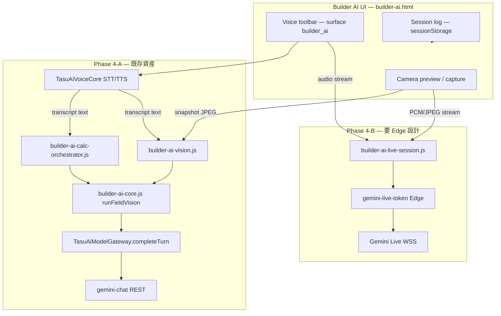

# Builder AI Live — Phase 4 計画 · 4-A 実装報告

**実施日:** 2026-06-26  
**状態:** **Phase 4-A 完了** · **commit `66051f7`** · **未 push · 未デプロイ**  
**前提:** Tool Phase 3 `05c32ad` · Vision `4aff9ec` · UI `5d28acc`  
**正本:** [docs/AI/BUILDER_AI.md](../docs/AI/BUILDER_AI.md) · [docs/builder-ai-gemini-live-field-diagnosis-backlog.md](../docs/builder-ai-gemini-live-field-diagnosis-backlog.md)

---

## Phase 4-A 完了（`66051f7`）

**現場 Live 風 MVP** — 真 Gemini Live（WebSocket）ではない。

| 項目 | 状態 |
| --- | --- |
| カメラプレビュー | **完了** · `builder-ai-live.js` |
| スナップショット Vision | **完了** · 既存 `runFieldVision` 再利用 |
| Voice Core adapter | **完了** · `builder-ai-voice.js` · `surface: builder_ai` |
| transcript → Calc / Vision | **完了** · Phase 3 orchestrator 連携 |
| Live panel UI | **完了** · `builder-ai-ui.css` / html |
| Free/Pro gate stub | **完了** · `builder-ai-live-gate.js` |
| 真 Gemini Live / WebSocket | **未実装**（Phase 4-B） |
| ephemeral token Edge | **未実装**（Phase 4-B） |
| Gateway / Secret / CF Function | **変更なし** |

### 検証（commit 時点）

| スクリプト | 結果 |
| --- | --- |
| `npm run build:pages` | **PASS** |
| `test-builder-ai-live-phase4.mjs` | **18/18 PASS** |
| `test-builder-ai-calc-phase3.mjs` | **15/15 PASS** |
| `test-builder-ai-tools-adaptation.mjs` | **85/85 PASS** |
| `test-builder-ai-p1-review.mjs` | **135/135 PASS** |
| `test-builder-ai-vision-phase2.mjs` | **8/8 PASS** |
| `test-builder-ai-ui-phase1.mjs` | **15/15 PASS** |

---

## 1. 目的

Builder AI に **Gemini Live 相当のリアルタイム現場 AI 導線**（カメラ · 音声入出力 · Vision / 計算連携 · 会話ログ）を追加する。

**不変条件（AD-002 / ユーザー指示）**

- Builder AI は **TASFUL AI 共有入口に統合しない**（`surface: builder_ai` 維持）
- Platform / TLV / AI秘書 / Site Assistant は巻き込まない
- Gateway 契約 · Secret · deploy / push は **計画承認前に勝手に変更しない**

---

## 2. 現状調査

### 2.1 Builder AI 現場 UI（Phase 1〜3 完了）

| ファイル | 役割 | Live 関連 |
| --- | --- | --- |
| `builder/builder-ai.html` | 現場 UI + legacy Gateway 下書き | `data-builder-ai-ui-camera` / `voice` ボタン **stub** |
| `builder/builder-ai-ui.js` | ルーティング: **calc → Vision** | `bindMediaStubs()` が固定文言のみ |
| `builder/builder-ai-core.js` | `runFieldVision` · `runAction` · `precalc` | REST Gateway のみ |
| `builder/builder-ai-vision.js` | 静止画 base64 · 4MB · `runFieldDiagnosis` | Vision 経路の正本 |
| `builder/builder-ai-calc-orchestrator.js` | NL → deterministic 計算 | `isCalcQuery` / `runFromNaturalLanguage` |
| `builder/builder-ai-ui.css` | `.builder-ai-ui-media-btn` 等 | Live パネル未実装 |

**メッセージルート（`builder-ai-ui.js` `sendMessage`）**

```
テキスト送信
  ├─ 写真なし + isCalcQuery → CalcOrchestrator（preferRemote: false）
  └─ それ以外 → Vision.runFieldDiagnosis → Core.runFieldVision
```

**会話ログ:** `sessionStorage` キー `tasu_builder_ai_field_ui_v1` · 最大 40 件 · 同一 UI ログに user/assistant/system。

**カメラ / 音声 stub（現状）**

```javascript
// builder-ai-ui.js
const CAMERA_STUB = "カメラ診断は次フェーズで対応予定です。";
const VOICE_STUB = "音声相談は次フェーズで対応予定です。";
```

### 2.2 Vision / Gateway 経路（Phase 2 · 変更なし想定）

```
builder-ai-ui.js
  → builder-ai-vision.js（fileToImageAttachment）
  → builder-ai-core.js runFieldVision
  → TasuAiModelGateway.completeTurn({ attachments, surface: builder_ai })
  → supabase/functions/gemini-chat（REST POST）
  → Gemini 2.5 Flash + inlineData 画像
```

- **契約:** `completeTurn` の `attachments` 配列（`kind: image`, `base64`, `mimeType`）
- **Edge:** 既存 `gemini-chat` + `_shared/ai-attachments.ts`
- **Secret:** 既存 `GEMINI_API_KEY`（Edge 側）— Builder 専用 Secret **なし**
- **制約:** 静止画 · リクエスト/レスポンス型 · **WebSocket / ストリーミング非対応**

### 2.3 計算ツール連携（Phase 3）

- 音声・Live セッションから得た **テキスト transcript** を `Orch.isCalcQuery(text)` に渡せば **追加 Gateway 変更なし**で再利用可能
- 数値は Orchestrator / calculators が算出 · `precalc` で再計算禁止（Phase 3 と同じ）

### 2.4 既存 Voice / Live 資産（TASFUL AI · 秘書側 — 参考のみ）

| 資産 | 内容 | Builder 流用可否 |
| --- | --- | --- |
| `tasful-ai-voice-core.js` | ブラウザ **Web Speech API** STT/TTS · `mountToolbar` | **可** — `surface: builder_ai` で独立マウント（Workspace 統合ではない） |
| `tasful-ai-voice.css` | Voice toolbar スタイル | **可** — Builder ページに CSS のみ追加 |
| `ai-workspace-voice.js` | Workspace composer 接続 | **不可** — TASFUL AI 専用 · Builder には使わない |
| `admin-ai-secretary-voice.js` | 秘書フォーム接続 | **不可** |
| `scripts/test-ai-voice-core-browser.mjs` | Voice Core E2E | パターン参考 · Builder 用は別 script |

**重要:** 既存 Voice Core は **Gemini Live ではない**。ブラウザ STT → テキスト入力欄、TTS ← 応答テキスト。

### 2.5 真の Gemini Live API（リポジトリ内）

| 項目 | 状態 |
| --- | --- |
| WebSocket `BidiGenerateContent` 実装 | **なし** |
| Ephemeral token 発行 Edge | **なし** |
| `getUserMedia`（Builder） | **なし** |
| Live 音声 PCM ストリーム | **なし** |

Google Live API 要件（公式）:

- **プロトコル:** Stateful **WebSocket (WSS)**
- **入出力:** 音声 PCM · 映像 JPEG（低 FPS）· テキスト · **音声応答 PCM**
- **本番:** API キーをブラウザに置かず **Ephemeral Token** または **サーバープロキシ** 推奨
- **既存 `gemini-chat` REST では代替不可**（`completeTurn` 拡張だけでは Live 相当にならない）

### 2.6 Free / Pro gating（設計のみ · 未実装）

[BUILDER_AI.md](../docs/AI/BUILDER_AI.md) 方針:

| tier | 現場 AI |
| --- | --- |
| **Free** | 簡易写真診断 · 一部計算 |
| **Pro** | Gemini Vision 本格 · **Live · Voice** · 全計算 |

実装状況:

- Builder 側に **plan enforcement コードなし**
- `TasuAiPlanModels.resolveUserPlan()` は **TASFUL AI / gen-ai 課金**向け · Builder AI から未参照
- Vision Phase 2 も Free/Pro enforcement は **📋 将来**（backlog 記載）

Phase 4 では **ゲート関数 stub + UI バッジ** のみ。本番課金連動は Phase 4 以降。

### 2.7 既存テスト資産

| スクリプト | 用途 | Live との関係 |
| --- | --- | --- |
| `test-builder-ai-ui-phase1.mjs` | stub / hooks 検証 | Phase 4 で stub 解除時に更新必要 |
| `test-builder-ai-vision-phase2.mjs` | Vision 経路 | フレームキャプチャ Vision 連携時に拡張 |
| `test-builder-ai-calc-phase3.mjs` | 計算 orchestrator | transcript 連携テスト追加可能 |
| `test-builder-ai-live-e2e.mjs` | Legacy **8 action Gateway** E2E | 名称に Live あるが **Gemini Live ではない** |
| `test-builder-ai-live-qa.mjs` | 本番 Edge QA チェックリスト | 同上 |
| `test-ai-voice-core-browser.mjs` | Voice Core | STT/TTS パターン参考 |

---

## 3. Phase 4 最小設計（2 段階）

Gemini Live を **一括実装すると Gateway / Edge / Secret 判断が必要**になるため、Phase 4 を **4-A（資産流用 MVP）** と **4-B（真 Gemini Live）** に分割する。

### 3.1 全体アーキテクチャ（目標）



### 3.2 Phase 4-A — 「Live 相当 UX」（**推奨最初の実装スコープ**）

**コンセプト:** リアルタイム **WebSocket Gemini Live ではない**が、現場 UX としてカメラプレビュー · 音声入力 · 読み上げ · 定期フレーム診断 · 計算連携を **既存 REST / ブラウザ API のみ**で実現。

| 機能 | 実装方針 |
| --- | --- |
| **Camera live** | `getUserMedia({ video })` プレビュー · ユーザー操作 or 5〜10 秒間隔で canvas → JPEG → 既存 `runFieldDiagnosis` |
| **Voice input** | `TasuAiVoiceCore` · `surface: "builder_ai"` · transcript を composer / Live セッションへ |
| **Voice output** | `playVoice`（browser TTS）· 応答後 `tasu:ai-voice-assistant-reply` を Builder 専用 dispatch |
| **Vision 連携** | キャプチャフレーム = Phase 2 と同一 attachments 経路 · 免責 8 項目維持 |
| **Calc 連携** | transcript / 確定テキスト → `isCalcQuery` 優先（写真なし時と同じ） |
| **会話ログ** | 既存 `tasu_builder_ai_field_ui_v1` 拡張 or `tasu_builder_ai_live_v1`（live セッション ID · キャプチャ履歴メタ） |
| **Free / Pro gating** | `TasuBuilderAILiveGate.check(feature)` stub — Free は「1 日 N 回」「Live ボタン Pro 案内」表示のみ |

**新規モジュール（案）**

| モジュール | 責務 |
| --- | --- |
| `builder/builder-ai-voice.js` | Voice Core ラッパー · `surface: builder_ai` · reply イベント |
| `builder/builder-ai-live.js` | カメラプレビュー · フレームキャプチャ · セッション状態 · stub 解除 |
| `builder/builder-ai-live-gate.js` | Free/Pro 判定 stub（将来 Supabase / Builder 課金接続口） |

**Infrastructure 変更**

| 項目 | Phase 4-A |
| --- | --- |
| 新規 CF Function | **不要** |
| 新規 Secret | **不要** |
| Gateway 契約変更 | **不要** |
| `gemini-chat` 変更 | **不要** |

### 3.3 Phase 4-B — 真 Gemini Live（**別ゲート · 設計レビュー後**）

| 機能 | 実装方針 |
| --- | --- |
| **Gemini Live セッション** | WebSocket `BidiGenerateContent` · 音声 PCM 16kHz in / 24kHz out |
| **リアルタイムカメラ** | `realtimeInput` へ JPEG ~1FPS |
| **Tool / Calc** | Live API **function calling** → Builder orchestrator コールバック（要プロトコル設計） |
| **認証** | **Ephemeral token** 発行 Edge（既存 `GEMINI_API_KEY` 流用可 · **新 Secret 名は不要**） |

**Infrastructure 変更（Phase 4-B のみ）**

| 項目 | 判定 |
| --- | --- |
| 新規 Supabase Edge Function | **必要** — 例: `gemini-live-token`（token mint のみ · ストリーム中継はクライアント直 or 別途検討） |
| 新規 Secret | **原則不要**（既存 `GEMINI_API_KEY`） |
| Gateway `completeTurn` 契約 | **変更しない** — Live は **別クライアントモジュール** |
| Cloudflare Pages Function | **不要**（Supabase Edge パターンを Vision と揃える） |

**Backlog との関係:** [builder-ai-gemini-live-field-diagnosis-backlog.md](../docs/builder-ai-gemini-live-field-diagnosis-backlog.md) は「新規 CF Function 禁止」とあるが、これは **Secretary DeepSeek 用 CF を Builder に持ち込まない**文脈。Gemini Live の **token mint Edge** は Vision と同系統の Gemini 接続であり、**Phase 4-B 着手前に DECISIONS / backlog へ追記承認が必要**。

---

## 4. 機能別詳細設計

### 4.1 Camera live（Phase 4-A）

1. 「カメラ診断」クリック → `#builder-ai-live-panel` 表示（プレビュー `<video>`）
2. 権限拒否 → system メッセージ（マイク/カメラガイド）
3. 「診断スナップショット」→ canvas キャプチャ → `File` 化 → 既存 `Vision.runFieldDiagnosis`
4. 連続モード（任意）: 10 秒間隔 · 送信中はスキップ · Pro gate stub で Free は手動のみ

### 4.2 Voice input / output（Phase 4-A）

1. `builder-ai-voice.js` が `TasuAiVoiceCore.initSurface("builder_ai")`
2. toolbar を `builder-ai-ui-composer` 近傍にマウント（Workspace / 秘書 JS は import しない）
3. STT 結果 → `[data-builder-ai-ui-input]` 填入 → 既存 `sendMessage()` or Live 専用 send
4. Assistant 応答後: `dispatchEvent(new CustomEvent("tasu:ai-voice-assistant-reply", { detail: { surface: "builder_ai", text } }))`
5. `speakerEnabled` 時のみ TTS（Secretary / Workspace とイベント surface で分離）

### 4.3 Vision / Calc 連携

| 入力 | ルート |
| --- | --- |
| 音声 transcript · テキスト · クイック相談 | calc 判定 → orchestrator or vision（現行と同じ） |
| カメラスナップショット + 音声質問 | vision（attachments あり） |
| Live セッション中の計算質問 | transcript を orchestrator へ · **数値再計算禁止** |

### 4.4 会話ログ

| 項目 | 方針 |
| --- | --- |
| 保存先 | `sessionStorage`（Phase 4-A）· P2-C 後 Supabase draft 連携は別フェーズ |
| 拡張フィールド | `source: "text" \| "voice" \| "camera_snapshot" \| "live_session"` |
| Live セッション | `liveSessionId` · `startedAt` · `frameCount` |
| クリア | 既存「履歴クリア」+ Live 停止でカメラストリーム解放 |

### 4.5 Free / Pro gating（stub）

```javascript
// builder-ai-live-gate.js（案）
function canUse(feature, actor) {
  const tier = resolveBuilderTier(actor); // 現状常に "free" or query ?tier=pro デバッグ
  const rules = {
    camera_continuous: tier === "pro",
    voice_output: true,
    vision_remote: tier === "pro" ? "full" : "limited", // limited = モック/ローカル優先（将来）
    gemini_live_ws: tier === "pro",
  };
  return rules[feature] ?? false;
}
```

UI: Pro 機能はボタンに `Pro` バッジ · タップ時 upgrade 案内（課金 API 未接続）。

---

## 5. Go / No-Go 判定

| スコープ | 判定 | 理由 |
| --- | --- | --- |
| **Phase 4-A**（Camera preview + Voice Core + Vision snapshot + Calc + log + gate stub） | **Go** | 既存 Phase 1〜3 資産を最大流用 · **Gateway / Secret / Edge 変更なし** · AD-002 遵守 |
| **Phase 4-B**（真 Gemini Live WebSocket） | **Conditional Go** | 技術的には既存 `GEMINI_API_KEY` で可能だが **新規 Edge（ephemeral token）必須** · 帯域/課金/本番 deploy 前提 · backlog 追記承認後 |
| **Gateway `completeTurn` 拡張で Live 実装** | **No-Go** | REST 1ターン契約と Live WSS は非両立 · AD-005 違反リスク |
| **TASFUL AI Workspace voice モジュール流用** | **No-Go** | `ai-workspace-voice.js` 直利用は統合に見える · Voice Core 共通 lib のみ可 |
| **Phase 4-A + 4-B 同時一括** | **No-Go** | インフラ判断が混ざる · ユーザー指示「本実装をいきなり始めない」 |

**Phase 4 全体:** **Go（4-A から着手）** · 真 Live は **4-B サブフェーズ**

---

## 6. 変更ファイル一覧（実装時 · 未着手）

### 6.1 Phase 4-A（最小差分）

| 種別 | パス |
| --- | --- |
| **新規** | `builder/builder-ai-live.js` |
| **新規** | `builder/builder-ai-voice.js` |
| **新規** | `builder/builder-ai-live-gate.js` |
| **変更** | `builder/builder-ai-ui.js`（stub 解除 · Live/Voice 委譲 · log meta） |
| **変更** | `builder/builder-ai-ui.css`（live panel · preview · session bar） |
| **変更** | `builder/builder-ai.html`（live panel markup · script 順） |
| **参照追加** | `../tasful-ai-voice-core.js` · `../tasful-ai-voice.css`（共通 lib · surface 分離） |
| **新規テスト** | `scripts/test-builder-ai-live-phase4.mjs` |
| **更新テスト** | `scripts/test-builder-ai-ui-phase1.mjs`（stub → live shell 断言） |

**dist 同期（`npm run build:pages` 後）**

- `deploy/cloudflare/dist/builder/builder-ai-live.js`
- `deploy/cloudflare/dist/builder/builder-ai-voice.js`
- `deploy/cloudflare/dist/builder/builder-ai-live-gate.js`
- `deploy/cloudflare/dist/builder/builder-ai-ui.js`
- `deploy/cloudflare/dist/builder/builder-ai-ui.css`
- `deploy/cloudflare/dist/builder/builder-ai.html`
- `deploy/cloudflare/dist/tasful-ai-voice-core.js`（HTML 参照時）
- `deploy/cloudflare/dist/tasful-ai-voice.css`（HTML 参照時）

**触らないもの**

- `ai-model-gateway.js` · `supabase/functions/gemini-chat/*`
- `ai-workspace-voice.js` · `admin-ai-secretary-voice.js`
- Platform / TLV / Site Assistant / 秘書 HTML

### 6.2 Phase 4-B（将来 · 承認後）

| 種別 | パス |
| --- | --- |
| **新規 Edge** | `supabase/functions/gemini-live-token/index.ts`（案） |
| **新規** | `builder/builder-ai-live-ws.js` |
| **変更** | `builder/builder-ai-live.js`（WS セッション統合） |
| **新規テスト** | `scripts/test-builder-ai-live-ws-phase4b.mjs` |
| **docs** | `docs/builder-ai-gemini-live-field-diagnosis-backlog.md` · DECISIONS 追記 |

---

## 7. 次に実装する最小差分（Phase 4-A · Step 1）

実装 PR の **最初のコミット**は以下に限定する（動作する縦スライス）。

1. **`builder-ai-live-gate.js`** — `canUse()` stub · `resolveBuilderTier()` 固定 free + `?tier=pro` デバッグ
2. **`builder-ai-voice.js`** — Voice Core マウント · `surface: builder_ai` · composer 連携
3. **`builder-ai-live.js`** — カメラ権限 · `<video>` プレビュー · 単発スナップショット → `Vision.runFieldDiagnosis`
4. **`builder-ai-ui.js`** — `bindMediaStubs` を Live/Voice モジュール起動に差し替え · transcript → `sendMessage`
5. **`builder-ai.html` + css** — live panel DOM · media ボタン状態
6. **`scripts/test-builder-ai-live-phase4.mjs`** — 静的 + Playwright: カメラ/音声 hooks · gate stub · Vision 委譲 · calc ルート維持

**Step 1 でやらないこと**

- Gemini Live WebSocket
- Ephemeral token Edge
- Free/Pro 本番課金
- 連続自動フレーム送信（Step 2）
- Phase 4-B function calling

---

## 8. テスト計画

| スクリプト | Phase 4-A 期待 |
| --- | --- |
| `test-builder-ai-live-phase4.mjs`（新規） | hooks · module load · gate stub · routing |
| `test-builder-ai-ui-phase1.mjs` | stub 文言削除 · live panel 存在 |
| `test-builder-ai-vision-phase2.mjs` | 回帰 PASS（Vision 経路不変） |
| `test-builder-ai-calc-phase3.mjs` | 回帰 PASS（transcript 相当テキスト） |
| `test-builder-ai-p1-review.mjs` | legacy isolation 維持 |
| `npm run build:pages` | dist 同期 PASS |

ブラウザ手動（チェックリスト）:

- カメラ許可 / 拒否
- マイク STT → 計算質問（例: 30坪 外壁）→ orchestrator 応答
- スナップショット + 音声質問 → Vision 応答 + 免責
- Workspace / 秘書ページ非回帰

---

## 9. リスク · 未確認

| 項目 | 内容 |
| --- | --- |
| **HTTPS** | `getUserMedia` は file:// / 非 secure context で制限 · dist サーバー or 本番 HTTPS で検証 |
| **iOS Safari** | STT/TTS · カメラ同時利用の制約 — 手動確認必要 |
| **Gemini 課金** | Phase 4-A は Vision REST 呼び出し頻度が増える可能性 · Pro gate 本番前に quota 調査 |
| **Vision 本番 deploy** | backlog 着手条件「Vision 本番 deploy」— 現状 **未 deploy · 未 push** · 4-A は mock fallback 可 |
| **RELEASE FROZEN** | Builder 製品 v1.0 凍結 — **Builder AI 画面**は Phase 1〜3 と同様 AI 機能追加レーン（Critical 以外） |

---

## 10. 完了条件（本計画フェーズ）

- [x] 現状調査（Builder / Gateway / Vision / Voice stub / 秘書・Workspace voice）
- [x] Phase 4 最小設計（4-A / 4-B 分割）
- [x] 本レポート作成
- [x] Go / No-Go 判定
- [x] 変更ファイル一覧
- [x] 次実装最小差分（Step 1）提示
- [x] コード変更 — **Phase 4-A 実装完了** · commit `66051f7`
- [ ] Phase 4-B（真 Gemini Live）— **未着手**

---

## 11. 関連

- [reports/builder-ai-tools-phase3.md](./builder-ai-tools-phase3.md)
- [reports/builder-ai-vision-phase2.md](./builder-ai-vision-phase2.md)
- [reports/ai-voice-core-first.md](./ai-voice-core-first.md)
- [docs/DECISIONS.md](../docs/DECISIONS.md) AD-002 · AD-005
