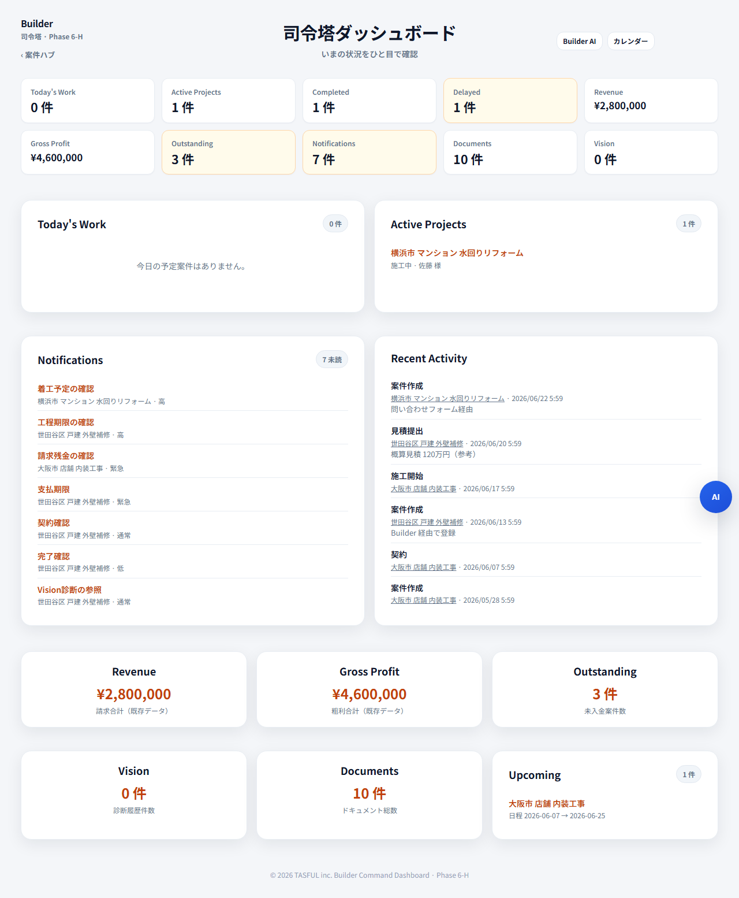

# Builder Command Dashboard — Phase 6-H 実装報告

**実施日:** 2026-06-27  
**状態:** **実装完了 · 未コミット**  
**正本:** [docs/AI/BUILDER_AI.md](../docs/AI/BUILDER_AI.md)

---

## 概要

Builder 全体の司令塔（Command Dashboard）を追加。既存 `TasuBuilderProjectStore` のデータを読み取り、ひと目で状況を把握できる画面。

**Builder 専用（AD-002）** · **AD-012 準拠**（情報は多くても UI はシンプル）

新規業務機能 · Store 変更 · Gateway · AI 自動更新 · 外部 API は **なし**。

---

## 画面

`builder/project-dashboard.html`

| ゾーン | 内容 |
| --- | --- |
| **上部 KPI** | Today's Work · Active · Completed · Delayed · Revenue · Gross Profit · Outstanding · Notifications · Documents · Vision |
| **中段** | Today's Work / Active / Notifications / Recent Activity 一覧 |
| **下段** | Revenue · Gross Profit · Outstanding · Vision · Documents 詳細 + Upcoming |

---

## データソース（既存 Store API のみ）

| 表示 | Store API |
| --- | --- |
| Today's Work | `getTodayProjects()` |
| Active | `getWorkingProjects()` / `getCompletionSummary()` |
| Completed | `getCompletionSummary()` |
| Delayed | `getDelayedProjects()` |
| Revenue | `getInvoiceSummary()` |
| Gross Profit | `getFinanceSummary()` |
| Outstanding | `getFinanceSummary()` |
| Notifications | `getNotificationSummary()` / `getUnreadNotifications()` |
| Documents | `getDocumentSummary()` |
| Vision | `listProjects()` の `visionDiagnoses` 件数（読取のみ） |
| Recent Activity | 各案件 `timeline`（読取のみ） |
| Upcoming | `getThisWeekProjects()` |

---

## テスト

`node scripts/test-builder-dashboard-phase6h.mjs`

- HTML/CSS/JS 静的検証
- Store 読取確認
- Phase 6-G 回帰
- `npm run build:pages` PASS
- スクリーンショット: `reports/builder-dashboard-phase6h-1280.png`

---

## スクリーンショット

---

## 未実装（今回スコープ外）

新規業務機能 · Store API 追加 · 通知/Vision/Finance 等の既存機能変更 · AI/Gateway 連携
