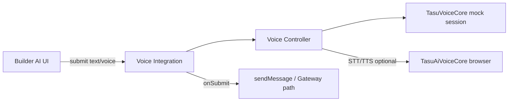

# Builder AI Voice Integration — Phase 1

**Status:** 実装済 · レビュー待ち（**コミットなし · deploy なし**）  
**Base:** Voice Core Phase 5-B (`phase5b-websocket-transport`)  
**Surface:** `builder_ai`（将来差し替え可能）

---

## 目的

Voice Core を **Builder AI から直接触らず**、Controller + Integration Layer 経由で利用できる構造を作る。

- 今回: **Mock のみ** · Realtime 接続禁止 · `useWebSocketTransport: false`
- Text / Voice は **同一 `submit()`** 経由

---

## 新規モジュール

| モジュール | 役割 |
|-----------|------|
| `builder/builder-voice-controller.js` | Voice Core ラッパー · Session · 状態 · Mock capture |
| `builder/builder-ai-voice-integration.js` | 共通 `submit()` · Controller 委譲 |

## 更新

| ファイル | 変更 |
|---------|------|
| `builder/builder-ai-ui.js` | `submit()` · Voice 状態 UI · Integration 初期化 |
| `builder/builder-ai-voice.js` | Integration 委譲（後方互換） |
| `builder/builder-ai.html` | Voice Core scripts + Controller |
| `builder/builder-ai-ui.css` | Voice 状態スタイル |

---

## クラス構成

```
TasuBuilderVoiceController
  init | startSession | stopSession | reconnectSession
  captureVoiceInput | notifySpeaking | onStateChange
  VOICE_STATE: ready | listening | thinking | speaking | error

TasuBuilderVoiceIntegration
  init({ onSubmit }) | submit | submitVoiceCapture
  reconnectSession | stopSession | getVoiceState

TasuBuilderAIUi
  submit(payload)  → Integration.submit
  sendMessage(...)  ← onSubmit コールバック（内部処理）
```

---

## データフロー



**Voice ボタン:** Integration.submitVoiceCapture → Controller.captureVoiceInput → submit(voice)

**テキスト送信:** submit({ channel: 'text', text }) → sendMessage

---

## Mock 運用

| 項目 | 値 |
|------|-----|
| `mockCompatible` | `true` |
| `useWebSocketTransport` | `false` |
| OpenAI Realtime | **禁止** |
| Session | Voice Core `openai_realtime` mock パス |

---

## テスト

```bash
node scripts/test-builder-voice-integration-phase1.mjs
```

---

## 影響範囲

| 領域 | 影響 |
|------|------|
| Builder AI UI | **あり** — 音声状態 · 共通 submit |
| Voice Core | **なし**（読込のみ） |
| AI秘書 / TASFUL AI / Gateway | **なし** |

---

## 次フェーズ

- Phase 1-B: OpenAI Realtime opt-in（Edge token + flag）
- 他 surface への Integration 流用（秘書 · TASFUL AI）
