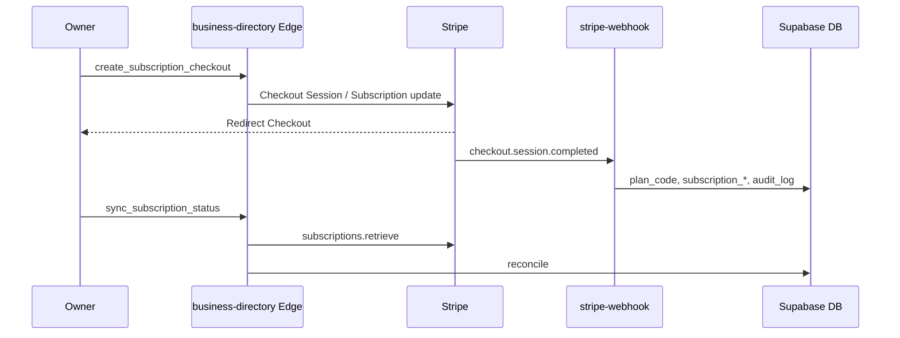

# Business Directory Phase 7 — Deploy Preflight / E2E 検証

**日付:** 2026-06-27  
**種別:** 検証 · build · dist 同期 · デプロイ前チェックリスト（**新機能なし**）  
**ブランチ:** `cf-pages-deploy`  
**BD コミット:** Phase 1 `3648e03` → Phase 6 `632e981`

---

## 結論（Go / No-Go）

| 項目 | 結果 |
| --- | --- |
| **ソース / テスト** | ✅ Phase 1–6 静的 + browser mock **PASS**（Phase 2 deno check はローカル env 要因で skip 可） |
| **Migration 事前確認** | ✅ 3 migration 存在 · idempotent · Marketplace `listings` 非変更 |
| **Edge 事前確認** | ✅ `business-directory` + `stripe-webhook` 分岐 · config.toml OK |
| **Stripe 設定** | ⚠️ **手動** — Price ID · Webhook イベント · Supabase secrets |
| **`npm run build:pages`** | ❌ **BLOCKED** — `deploy/cloudflare/dist` EPERM（フォルダロック） |
| **dist 同期** | ❌ **未同期** — `dist/business-directory/` 不在 · `index-top.html` BD 導線なし（stale） |
| **Preview / Production 載せ** | **No-Go** — build 成功 + dist 同期後に再検証 |

**Go 条件:** `npm run build:pages` 成功 · `dist/business-directory/**` 存在 · 本レポート再実行 **0 failed**

---

## 1. Build / dist 同期

### 実行

```bash
npm run build:pages
```

### 結果（2026-06-27）

```
Error: EPERM, Permission denied: deploy/cloudflare/dist
```

**原因:** Windows 上で `deploy/cloudflare/dist` がプロセスにロックされている（IDE · wrangler · dev server 等）。

**対処:**

1. `wrangler pages dev` / ローカル preview / dist を開いているタブを停止
2. Cursor / Explorer で `deploy/cloudflare/dist` を参照している場合は閉じる
3. 再実行: `npm run build:pages`
4. 成功後: `node scripts/test-business-directory-phase7-deploy-preflight.mjs`

### build 成功時に dist へ同期される BD 資産

| パス | 内容 |
| --- | --- |
| `business-directory/` | Owner / Admin / Public UI 一式 |
| `business-directory-repository.js` | クライアント API |
| `index-top.html` · `business.html` · `shop-store.html` | 市場 TOP 導線 |
| `chat-supabase-config.js` | 生成（`TASFUL_SUPABASE_*` 必須） |

`stage-cloudflare-pages.mjs` は repo ルートをコピー（`supabase/` · `reports/` は除外）。BD ソースは **除外対象外** のため build 成功で自動同期される。

---

## 2. Migration apply 前チェック

**適用順（本番 / staging 共通）:**

```text
1. 20260711100000_business_directory_phase1_schema.sql
2. 20260711100001_business_directory_phase1_seed.sql
3. 20260712100000_business_directory_phase6_stripe_subscription.sql
```

| 確認 | 状態 |
| --- | --- |
| Marketplace `public.listings` 変更なし | ✅ |
| Phase 6 `ADD COLUMN IF NOT EXISTS` | ✅ idempotent |
| RLS / public view 既存維持 | ✅ Phase 1 正本 |
| ロールバック | Phase 6 列 drop は **手動**（MVP では down migration なし） |

**apply コマンド（例 · 運営判断）:**

```bash
supabase db push
# または migration 単位 apply（環境ポリシーに従う）
```

**apply 後 smoke:**

```sql
select column_name from information_schema.columns
where table_name = 'business_directory_listings'
  and column_name in ('subscription_status', 'stripe_price_id', 'current_period_end');
```

---

## 3. Edge deploy 前チェック

| Function | JWT | 備考 |
| --- | --- | --- |
| `business-directory` | `verify_jwt = false` | Bearer + service role · CORS |
| `stripe-webhook` | — | 署名検証 · BD 分岐追加済 |

**deploy（例）:**

```bash
supabase functions deploy business-directory
supabase functions deploy stripe-webhook
```

**Secrets（Supabase Edge）:**

| Secret | 必須 |
| --- | --- |
| `SUPABASE_URL` | ✅ |
| `SUPABASE_ANON_KEY` | ✅ |
| `SUPABASE_SERVICE_ROLE_KEY` | ✅ |
| `STRIPE_SECRET_KEY` | ✅（Checkout / Portal） |
| `STRIPE_WEBHOOK_SECRET` | ✅ |
| `BUSINESS_DIRECTORY_STRIPE_PRICE_STANDARD` | ✅ |
| `BUSINESS_DIRECTORY_STRIPE_PRICE_PRO` | ✅ |
| `SITE_URL` | 推奨（Checkout redirect） |

**health check:**

```bash
curl -X POST "$SUPABASE_URL/functions/v1/business-directory" \
  -H "Content-Type: application/json" \
  -d '{"action":"health"}'
# 期待: {"ok":true,"service":"business-directory","phase":"6"}
```

---

## 4. Stripe Webhook 設定

**Endpoint:** `{SUPABASE_URL}/functions/v1/stripe-webhook`

**購読イベント（BD 分岐）:**

- `checkout.session.completed`
- `customer.subscription.created`
- `customer.subscription.updated`
- `customer.subscription.deleted`
- `invoice.payment_succeeded`
- `invoice.payment_failed`

**metadata 識別:** `order_type=business_directory_subscription`

**Staging 検証（手順）:**

1. Stripe Test mode · Test Price ID を secrets に設定
2. Owner 編集 → Standard アップグレード → Checkout 完了
3. Webhook ログ 200 · `kind: business_directory`
4. DB: `plan_code=standard` · `subscription_status=active`
5. `sync_subscription_status` または Checkout 戻り `?bd_checkout=success`

---

## 5. Owner → Admin → Public 導線（mock E2E）

ローカル: リポジトリルートを静的サーバで配信（または build 後 `dist`）。

| ステップ | URL | 確認 |
| --- | --- | --- |
| 1 Owner 一覧 | `/business-directory/index.html?bdMock=1` | ダッシュボード表示 |
| 2 Owner 新規 | `/business-directory/new.html?bdMock=1` | Free 固定 · 下書き作成 |
| 3 Owner 編集 | `/business-directory/edit.html?id={id}&bdMock=1` | プランカード · 申請 |
| 4 Admin 審査 | `/business-directory/admin/reviews.html?bdAdminMock=1` | キュー · approve/reject |
| 5 Public 一覧 | `/business-directory/public/list.html?bdPublicMock=1` | published のみ |
| 6 Public 詳細 | `.../detail.html?slug=...&bdPublicMock=1` | hp_mode · CTA |
| 7 市場 TOP | `/index-top.html` | BD 店舗/業務リンク |

**本番 E2E（mock なし）:** JWT ログイン · Edge API 接続 · Ops ロール · 審査 publish 後に Public 表示。

---

## 6. Checkout → Webhook → Plan 反映



| 段階 | 確認ポイント |
| --- | --- |
| Checkout 前 | `plan_code=free` · `stripe_customer_id` 任意 |
| Checkout 後 | `stripe_subscription_id` · `subscription_status=active/trialing` |
| Webhook | audit `subscription.sync` |
| past_due | Owner 警告バナー · 公開維持（MVP） |
| 解約完了 | `plan_code=free` · Pro/Standard 機能ロック |

---

## 7. Marketplace / Platform 非干渉

| ファイル | 結果 |
| --- | --- |
| `shop-checkout.js` | BD Stripe 参照なし |
| `stripe-create-shop-checkout` | BD 参照なし |
| `public.listings` migration | 変更なし |
| Platform Connect | 変更なし |

市場 TOP: `business-directory/public/list.html` **導線のみ**（Owner/Admin 直リンクなし）。

---

## 8. テスト集計

```bash
node scripts/test-business-directory-phase7-deploy-preflight.mjs
```

| スクリプト | 結果 |
| --- | --- |
| Phase 1 schema | **37/37** |
| Phase 2 API | **67/68**（deno check ローカル skip） |
| Phase 3 Owner | **55/55** |
| Phase 4 Admin | **35/35** |
| Phase 5 Public | **27/27** |
| Phase 6 Stripe | **52/52** |
| **Phase 7 Preflight** | **56 pass · 3 fail · 4 notes**（build/dist ブロック） |

---

## 9. デプロイ順序（推奨）

```text
1. Migration apply（staging）
2. Edge secrets 設定
3. Edge deploy（business-directory, stripe-webhook）
4. Stripe webhook 更新（staging endpoint）
5. npm run build:pages（TASFUL_SUPABASE_* 設定）
6. Cloudflare Pages preview deploy
7. Mock なし E2E（staging）
8. Production 同一手順
```

---

## 10. 参照

- [business-directory-mvp-design.md](../docs/business-directory-mvp-design.md)
- [business-directory-subscription-model.md](../docs/business-directory-subscription-model.md)
- [business-directory-ui-flow-design.md](../docs/business-directory-ui-flow-design.md)
- Phase 1–6 reports under `reports/business-directory-phase*.md`
