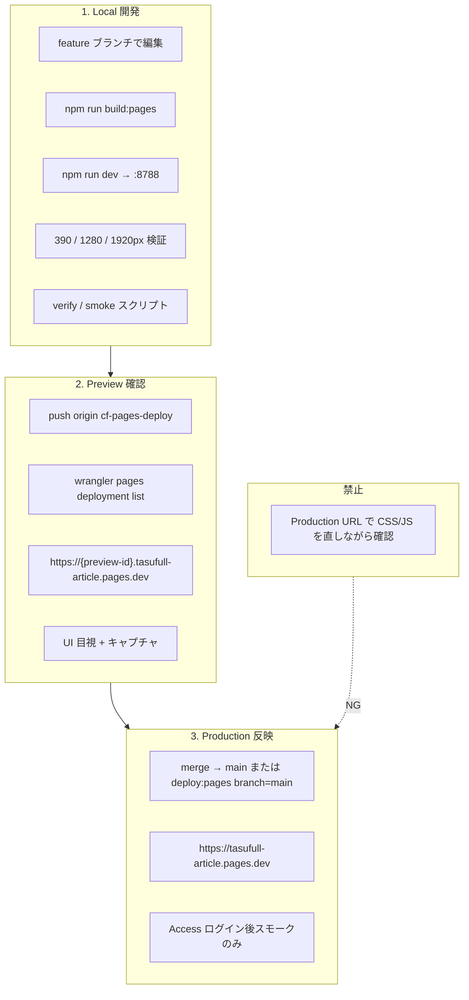

# 全プロダクト共通 — Local / Preview / Production 開発フロー

**制定日:** 2026-06-23  
**対象:** TLV · TALK · AI運営秘書 · MATCH · MARKET · Builder · Partner管理 · IWASHO · 管理画面系  
**ホスト:** Cloudflare Pages プロジェクト `tasufull-article`

---

## 基本方針（必須）

| # | ルール |
|---|--------|
| 1 | **Production URL で UI 調整しない** |
| 2 | **Local で実装・確認する** |
| 3 | **Local で 390 / 1280 / 1920px を検証する** |
| 4 | **Preview Deploy URL で確認する** |
| 5 | **問題なければ `main` / Production へ反映する** |
| 6 | **Production は完成版の動作確認のみ**（スモーク・1回限りの目視） |
| 7 | **Production で途中状態を見ながら直す運用は禁止** |

---

## フロー図



---

## 環境一覧

| 項目 | **Local** | **Preview** | **Production** |
|------|-----------|-------------|----------------|
| **用途** | 実装・デバッグ・UI 調整 | **UI 確認の正** | 完成版配信・最終スモーク |
| **ベース URL** | `http://127.0.0.1:8788/` | `https://{deployment-id}.tasufull-article.pages.dev` | `https://tasufull-article.pages.dev` |
| **Git ブランチ** | 任意 feature | **`cf-pages-deploy`**（push 先） | **`main`** |
| **Cloudflare Access** | なし | **なし**（通常） | **あり**（OTP ログイン） |
| **UI 変更** | ✅ 可 | ✅ deploy 毎に確認 | ❌ 直接いじらない |
| **配信元** | `deploy/cloudflare/dist/`（Wrangler dev） | Pages ビルド成果物 | Pages ビルド成果物 |
| **デプロイ方法** | `npm run dev` | `git push origin cf-pages-deploy` 等 | `git push origin main` または `npm run deploy:pages` |

### URL テンプレート

```
Local:      http://127.0.0.1:8788/{path}
Preview:    https://{PREVIEW_ID}.tasufull-article.pages.dev/{path}
Production: https://tasufull-article.pages.dev/{path}
```

**Preview ID の取得:**

```powershell
npx wrangler pages deployment list --project-name tasufull-article
# Environment = Preview の先頭行の Deployment ID（先頭8文字で URL 化）
```

**禁止:** 旧 Production スナップショット URL（例: `48d49d9c.tasufull-article.pages.dev`）を Preview の代わりに使わない。immutable であり、現行 Production とは一致しない。

---

## 標準コマンド

```powershell
# 1. ビルド（ソース編集のたびに必須）
$env:TASFUL_SUPABASE_URL="https://YOUR_PROJECT.supabase.co"
$env:TASFUL_SUPABASE_ANON_KEY="eyJ..."
npm run build:pages
npm run verify:pages-stage

# 2. Local 起動
npm run dev
# または一括: npm run dev:fresh

# 3. Local スモーク
npm run smoke:pages

# 4. Preview へ push（UI 確認用）
git push origin HEAD:cf-pages-deploy

# 5. Production へ反映（Preview OK 後のみ）
git push origin HEAD:main
# または
$env:CF_PAGES_BRANCH="main"
npm run deploy:pages

# 6. Production スモーク（Access 認証済みセッション推奨）
npm run smoke:gate-d
node scripts/smoke-cloudflare-pages.mjs --base https://tasufull-article.pages.dev
```

---

## ビューポート検証（全プロダクト共通）

| 幅 | 用途 | 確認方法 |
|----|------|----------|
| **390px** | モバイル | DevTools Responsive / Playwright |
| **1280px** | ラップトップ・TLV 3列など | 同上 |
| **1920px** | デスクトップ・TLV 4列など | 同上 |

**Local:** DevTools または各 `verify:*` / `screenshots:*` スクリプト  
**Preview:** DevTools + スクリーンショット保存（`reports/`）  
**Production:** 最終確認時のみ。レイアウト調整は行わない。

---

## CSS / JS キャッシュ対策

### 現状（`deploy/cloudflare/_headers`）

| パス | Cache-Control | 問題 |
|------|---------------|------|
| `/*.html` | `max-age=0, must-revalidate` | OK |
| `/live/*` | `max-age=0, must-revalidate` | HTML のみ実効 |
| `/*.css` | **`max-age=3600`** | `/live/live.css` に適用され **1時間キャッシュ** |
| `/*.js` | **`max-age=300`** | `/live/*.js` に **5分キャッシュ** |
| 境界 JS（`auth-*.js` 等） | `max-age=0` | OK |

`/*.css` / `/*.js` が `/live/*` より優先されるため、**デプロイ直後も旧 CSS が残ることがある**。

### 推奨 `_headers` 追記（全プロダクト共通）

```
/live/*.css
  Cache-Control: public, max-age=0, must-revalidate

/live/*.js
  Cache-Control: public, max-age=0, must-revalidate

/builder/*.css
  Cache-Control: public, max-age=0, must-revalidate

/builder/*.js
  Cache-Control: public, max-age=0, must-revalidate
```

### ビルド時バージョニング（任意・UI 変更時推奨）

```html
<link rel="stylesheet" href="live.css?v=COMMIT_SHA" />
<script src="live-videos.js?v=COMMIT_SHA" defer></script>
```

`stage-cloudflare-pages.mjs` でコミット SHA 置換を自動化できる。

### 環境別キャッシュの見え方

| 環境 | HTML | CSS/JS | 備考 |
|------|------|--------|------|
| Local | Wrangler dev（実質 no-cache） | 同上 | `build:pages` 後に反映 |
| Preview | `max-age=0` | 現状 TTL あり | **UI 確認は Preview で実施** |
| Production | `max-age=0` + Access | 現状 TTL あり | 反映後 DevTools で Size 確認 |

---

## Access / noindex / robots / Feature Flags（環境別）

### 全プロダクト共通

| 制御 | Local | Preview | Production |
|------|-------|---------|------------|
| **robots.txt** | `Disallow: /` | 同左 | 同左 |
| **X-Robots-Tag** | `noindex,nofollow,noarchive,nosnippet` | 同左 | 同左 |
| **`<meta robots>`** | ビルド時全 HTML 注入 | 同左 | 同左 |
| **Cloudflare Access** | なし | なし | **全站（pages.dev）** |

ビルド注入: `deploy/cloudflare/stage-cloudflare-pages.mjs` → `applySearchBlockingToDist()`

### TLV 専用

| 制御 | Local | Preview | Production |
|------|-------|---------|------------|
| **Feature flags** | `live/tlv-feature-flags.js` デフォルト | ビルド時上書き | ビルド時上書き |
| `TLV_PUBLIC_ENABLED` | `false`（ローカル JS） | env → 通常 `false` | **`false` 維持** |
| `TLV_PRIVATE_TEST_ENABLED` | `true` | env → 通常 `true` | **`true`** |
| `TLV_ALLOWED_TEST_EMAILS` | ローカル配列 | env | env |
| **Private test gate** | `.pages.dev` 以外はバナー弱 | Preview は `.pages.dev` | バナー + Access |
| **開発バイパス** | `?talkDev=1` | `?talkDev=1` | Access 必須 |

ビルド env: `TLV_PUBLIC_ENABLED`, `TLV_PRIVATE_TEST_ENABLED`, `TLV_ALLOWED_TEST_EMAILS`

### TALK

| 制御 | Local | Preview | Production |
|------|-------|---------|------------|
| デモモード | `?talkDev=1` | 可 | 本番データ |
| Ops ナビ | `?talkAdmin=1` / JWT | JWT / preview | JWT `is_ops` のみ |

### AI運営秘書 / 管理画面

| 制御 | Local | Preview | Production |
|------|-------|---------|------------|
| **auth-ops-guard.js** | `?talkAdmin=1` / demo | JWT ops | **JWT ops のみ** |
| 対象ページ | `admin-operations-dashboard`, `admin-ai-operations-center`, `support-trouble-center`, `talk-ops-room`, `anpi-line-admin` | 同左 | 同左 |

### MATCH

| 制御 | Local | Preview | Production |
|------|-------|---------|------------|
| **match-beta-gate.js** | ベータ UI | 同左 | 同左 |
| **match-login-gate.js** | ログイン要求 | 同左 | 同左 |

### MARKET / Builder / Partner / IWASHO

| 制御 | Local | Preview | Production |
|------|-------|---------|------------|
| Feature flags ファイル | なし | なし | なし |
| 認証境界 | `market-identity.js`, `auth-current-user.js`, `builder-actor-identity.js` | 同左 | 同左（本番 host 厳格） |
| noindex | ビルド注入 + headers | 同左 | 同左 |

---

## プロダクト別 — 確認 URL 一覧

Clean URLs 有効（`*.html` 省略可）。Local は `.html` 付きでも可。

### プラットフォーム

| 画面 | Local | Preview / Production パス |
|------|-------|---------------------------|
| TASFUL TOP | `http://127.0.0.1:8788/index-top.html` | `/index-top` |
| 会員ダッシュボード | `http://127.0.0.1:8788/dashboard.html` | `/dashboard` |

### TLV（TASFUL LIVE）

| 画面 | 確認 URL パス | Local 補足 |
|------|---------------|------------|
| LIVE TOP | `/live/` | |
| **VIEW 一覧（主 UI）** | **`/live/videos`** | `?talkDev=1` 推奨 |
| ショート | `/live/shorts` | |
| 視聴 | `/live/watch-video` | |
| プロフィール | `/live/profile` | |
| マイ動画 | `/live/my-videos` | |
| アップロード | `/live/video-upload` | |
| クリエイター DB | `/live/creator-dashboard` | |
| 動画管理 | `/live/admin-videos` | |

**TLV UI 検証:** `npm run verify:live-youtube-p15`  
**TLV カスケード:** `node scripts/tmp-tlv-v2-cascade-check.mjs`

### TALK

| 画面 | 確認 URL パス | Local 補足 |
|------|---------------|------------|
| Talk ホーム | `/talk-home?tab=chat` | `?talkDev=1` |
| チャット詳細 | `/chat-detail` | thread id 要 |
| プロフィール | `/talk-profile` | |
| カレンダー | `/talk-calendar` | |

**Gate-D 必須:** `/talk-home?tab=chat`

### AI運営秘書

| 画面 | 確認 URL パス | Local 補足 |
|------|---------------|------------|
| AI運営司令塔 | `/admin-operations-dashboard#ops-ai-secretary` | `?talkAdmin=1` |
| AI運営センター | `/admin-ai-operations-center` | `?talkAdmin=1` |
| 問い合わせセンター | `/support-trouble-center` | `?talkAdmin=1` |

### MATCH

| 画面 | 確認 URL パス |
|------|---------------|
| TOP | `/match/match-top` |
| 一覧 | `/match/match-list` |
| スワイプ | `/match/match-swipe` |
| マイページ | `/match/match-mypage` |
| TALK 連携 | `/match/match-talk-bridge` |
| 管理 | `/match/match-admin` |

**Gate-D 必須:** `match-top`, `match-list`, `match-talk-bridge`

### MARKET（TASFUL 市場）

| 画面 | 確認 URL パス |
|------|---------------|
| 市場 TOP | `/shop-store` |
| 検索 | `/shop-search` |
| 商品一覧 | `/shop-products` |
| カート | `/shop-market-cart` |
| チェックアウト | `/shop-market-checkout` |
| マイページ | `/shop-market-mypage` |
| 出品 | `/shop-market-listing-new` |

**検証:** `npm run verify:market-top-viewports`（390 等）, `npm run verify:market-pc`（1280）

### Builder

| 画面 | 確認 URL パス |
|------|---------------|
| Builder TOP | `/builder/builder-top` |
| ダッシュボード | `/builder/` |
| 案件一覧 | `/builder/mvp-projects` |
| 新規案件 | `/builder/mvp-project-new` |
| スレッド | `/builder/mvp-threads` |
| 施工ツール | `/builder/construction-tools` |
| ユーザー DB | `/builder/user-dashboard` |

**Gate-D 必須:** `/builder/`

### Partner管理

| 画面 | 確認 URL パス |
|------|---------------|
| 協力パートナー管理 | `/builder/partner-management` |
| パートナー詳細 | `/builder/partner-detail` |
| 登録 | `/builder/mvp-partner-register` |
| Builder Admin | `/builder-admin/admin-index` |
| パートナー評価 | `/builder/admin-partner-evaluations` |
| IWASHO 登録 | `/iwasho/partner-register` |

### IWASHO

| 画面 | 確認 URL パス |
|------|---------------|
| TOP | `/iwasho/` |
| About | `/iwasho/about` |
| Services | `/iwasho/services` |
| Partners | `/iwasho/partners` |
| Contact | `/iwasho/contact` |

### 管理画面系（その他）

| 画面 | 確認 URL パス | ガード |
|------|---------------|--------|
| 運営ダッシュボード | `/admin-operations-dashboard` | ops |
| AI運営センター | `/admin-ai-operations-center` | ops |
| LINE 安否管理 | `/anpi-line-admin` | ops |
| 安否ダッシュボード | `/anpi-dashboard` | member |
| Builder 管理 | `/builder/admin` | builder admin |
| AI Workspace | `/ai-workspace` | member |
| 生成 AI WS | `/gen-ai-workspace` | member |

---

## Preview 専用チェック手順（テンプレート）

### 1. Preview URL を確定

```powershell
npx wrangler pages deployment list --project-name tasufull-article
# Preview 行の URL をコピー → PREVIEW_BASE
```

### 2. ビューポート別 UI（変更したプロダクトのみ）

| 幅 | 操作 |
|----|------|
| 390 | Responsive モードで主要画面を開く |
| 1280 | 同上 |
| 1920 | 同上 |

### 3. 共通チェック

- [ ] `view-source:` で `<meta name="robots" content="noindex...">` がある
- [ ] 変更した CSS/JS が Network で 200（Size が想定どおり）
- [ ] Console に赤エラーなし
- [ ] Local と Preview で見た目が一致

### 4. プロダクト別（該当時）

| プロダクト | 追加確認 |
|------------|----------|
| TLV | `live.css` ~62KB（v2）, 1280=3列, 1920=4列, sidebar 72px |
| TALK | チャット一覧・送信 UI |
| MARKET | ヘッダー・カート導線 |
| Builder | 案件 CRUD 導線 |
| Ops | `?talkAdmin=1` on Preview で 403 にならないこと（JWT あれば本番同等） |

### 5. Production 昇格条件

- [ ] Preview で 390 / 1280 / 1920 PASS
- [ ] `npm run verify:pages-stage` PASS
- [ ] 該当 `verify:*` / `smoke:*` PASS
- [ ] スクリーンショット `reports/` 更新（UI 変更時）
- [ ] **Production ではレイアウト修正をしない**前提で merge

---

## Production 反映後（動作確認のみ）

1. Access でログイン（許可メール）
2. Gate-D スモーク: `npm run smoke:gate-d`
3. 変更箇所を **1回だけ** 目視
4. DevTools で主要アセットの Size / ETag 確認
5. 問題があれば **Local に戻って修正 → Preview → 再反映**（Production 上で直さない）

---

## やってはいけないこと

| NG | 理由 |
|----|------|
| Production URL をブックマークして UI 調整 | Access あり・キャッシュあり・本番影響 |
| 旧 deploy URL を Preview 代替に使う | immutable スナップショット |
| `build:pages` せず Local 確認 | dist が古い |
| `TLV_PUBLIC_ENABLED=true` を勝手に変更 | 意図しない公開 |
| Production で noindex を外す | インデックス事故 |
| main 直 push で UI 未検証 | Preview バイパス |

---

## 関連ドキュメント

| ファイル | 内容 |
|----------|------|
| `docs/local-dev.md` | Local 起動詳細 |
| `reports/tlv-url-environment-diff-check.md` | TLV `/live/videos` 環境差分 |
| `reports/tlv-videos-v2-not-applied-root-cause.md` | TLV v2 CSS カスケード調査 |
| `reports/tlv-production-clean-url-cache-check.md` | deploy alias / キャッシュ |
| `reports/production-private-test-ready-report.md` | 非公開本番テスト状態 |
| `reports/gate-d-smoke-last.json` | Gate-D 最終スモーク |

---

## ブランチ戦略まとめ

```
feature/*  →  開発（Local）
     ↓
cf-pages-deploy  →  Preview Deploy（UI 確認の正）
     ↓ merge（Preview OK 後）
main  →  Production（完成版のみ）
```

**単一リポジトリ・単一 Pages プロジェクト**のため、全プロダクトが同一 dist に共存する。  
**あるプロダクトの UI 変更も、必ず Preview 全体を対象に smoke してから Production へ進める。**
