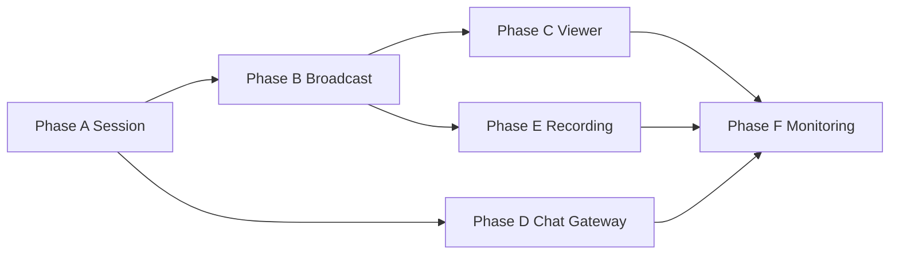

# Live Platform 共通基盤 — 設計・実装計画

**日付:** 2026-06-28  
**Priority:** **P2**（TASFUL AI P1 完了後）  
**TLV:** **Pause 維持** — TLV 固有機能 · Wallet 接続 · Phase 1 運用ゲートは触らない  
**種別:** 設計正本 · **実装は本計画承認後に段階着手**

---

## Executive summary

TASFUL 全サービス（TLV · Talk · Builder · Platform · 将来）が共有する **Live Platform 共通基盤** を、`live/` UI や TLV 制度から分離して整備する。

| 項目 | 方針 |
| --- | --- |
| **共通化** | Session · Broadcast · Viewer · Chat Gateway · Recording · Monitoring |
| **禁止** | TLV 固有 · Builder 固有 · Wallet/Coin/Tip · 30分サバイバル · Moderation UI |
| **Provider** | Interface 維持 · ZEGO PoC 資産を `platform-live/` へ段階移管 |
| **コード変更（本フェーズ）** | **計画のみ** — 実装は Phase A 承認後 |

**正本参照:** [TLV_LIVE_PROVIDER.md](../docs/TLV_LIVE_PROVIDER.md) §15 · [LIVE_SYSTEM.md](../docs/LIVE_SYSTEM.md)（制度は REL-F-01 Future）

---

## 1. 現状分析

### 1.1 既存資産（再利用可能）

| 領域 | 場所 | 状態 | 備考 |
| --- | --- | --- | --- |
| **Session Manager** | `live/session/live-session-manager.js` 他 8 ファイル | **Skeleton 実装済** | Phase2-01〜05 テスト PASS · **TLV 命名** |
| **Live Service** | `live/live-service.js` | PoC 配線済 | Session Manager ↔ Provider |
| **Provider Interface** | `live/providers/live-provider-interface.js` | **正本** | ZEGO のみ実装 |
| **ZEGO Provider** | `live/providers/zego-live-provider.js` | PoC 実装済 | E2E = **`.env` Blocker** |
| **Provider Signals** | `live/session/live-provider-signals.js` | 抽象 signal 定義済 | SDK イベント非漏洩 |
| **Broadcasts bridge** | `live/live-broadcasts-session-bridge.js` | flag OFF · no-op | Phase2-03 |
| **Broadcasts UI/DB** | `live/live-broadcasts.js` | `public.live_*` 直 CRUD | **lifecycle Edge なし** |
| **Comments** | `live/live-comments.js` | UI + DB 直結 | **Gateway パターンなし** |
| **Talk 連携** | `live/live-talk-bridge.js` | 相談 room 導線 | Live Session 非統合 |
| **Config** | `live/live-config.js` | TLV/Talk テーブル名 | サービス横断化要 |

### 1.2 テスト・検証（既存）

| スクリプト | 内容 |
| --- | --- |
| `test:live-session-manager` | Session 状態機械 |
| `test:live-service-session` | Service ↔ Manager |
| `test:live-broadcasts-session-bridge` | Bridge hooks |
| `test:live-session-provider-signals` | Provider 抽象 signal |
| `verify:live-zego-poc-e2e` | ZEGO 実機（**要 credentials**） |

### 1.3 Supabase Edge（現状）

| Function | 用途 | 共通基盤との関係 |
| --- | --- | --- |
| `live-video-*` | VOD 署名 URL · view カウント | **VOD** · Live Session 外 |
| `live-notify` | 通知 | 横断通知 · Session 非連動 |
| `live-security-events` | セキュリティログ | 横断 |
| `live-monetization-admin` | TLV 収益 admin | **TLV 固有 · 対象外** |

**未存在:** Session lifecycle RPC · Viewer join/leave · Broadcast start/stop · Chat Gateway · Recording metadata API

### 1.4 DB / Schema

| 項目 | 状態 |
| --- | --- |
| `public.live_broadcasts` 等 | TLV UI から使用中 · stub 配信あり |
| `live_p0_schema` | **DRAFT · staging 適用待ち**（TODO TLV-P0-01） |
| `tlv.streams` | Payment 側 · **Live 共通基盤 Phase では未接続** |

### 1.5 ギャップ（共通基盤として不足）

| # | ギャップ |
| --- | --- |
| G1 | **命名・配置が TLV 前提**（`TlvLive*` · `live/` 配下） |
| G2 | **Edge 正本 API なし** — join/leave/CCU/lifecycle が client 直 DB |
| G3 | **Chat = UI 直結** — Message/Reaction/System Event の Gateway 層なし |
| G4 | **Viewer Presence / Heartbeat 未実装** |
| G5 | **Recording** — VOD Edge のみ · Live 録画 metadata なし |
| G6 | **Monitoring 分散** — verify:live-p* 個別 · 横断 smoke なし |
| G7 | **サービス surface 契約未定** — `surface: tlv|talk|builder|platform` |

### 1.6 TLV v1.0 / Pause との関係

| 項目 | 方針 |
| --- | --- |
| `live/*.html` UI | **FROZEN** — 共通基盤実装中は **新規 UI 接続しない** |
| TLV Payment / Wallet | **Pause** — 共通基盤に含めない |
| ZEGO PoC | **資産として移管** — Provider 実装のみ再利用 |
| TLV Phase 1 Complete | **不要**（P2 共通基盤は TLV Complete 非依存で着手可） |

---

## 2. 共通化対象

### 2.1 目標パッケージ構成（新規 · 移行先）

```text
platform-live/                    # 全サービス共通（新規ディレクトリ）
├── core/
│   ├── live-session-manager.js   # live/session/* から移管・リネーム
│   ├── live-session-states.js
│   ├── live-session-events.js
│   ├── live-session-event-bus.js
│   ├── live-session-error-codes.js
│   └── live-session-validation.js
├── provider/
│   ├── live-provider-interface.js
│   ├── live-provider-types.js
│   ├── live-provider-signals.js
│   └── adapters/
│       └── zego-live-provider.js
├── broadcast/
│   └── live-broadcast-service.js # Start/Stop/Health · Edge クライアント
├── viewer/
│   └── live-viewer-service.js    # Watch/Permission/State/Heartbeat
├── chat/
│   └── live-chat-gateway.js      # Message/Reaction/SystemEvent（UI なし）
├── recording/
│   └── live-recording-service.js # Metadata/Archive/Storage 参照
└── monitoring/
    └── live-platform-health.js   # 横断 probe 定義

supabase/functions/
├── live-platform-session/        # lifecycle · join · leave · reconnect
├── live-platform-broadcast/        # start · stop · health
├── live-platform-viewer/           # heartbeat · ccu · permission
├── live-platform-chat/             # message · reaction · system_event
└── live-platform-recording/        # archive metadata（Provider API 範囲）
```

### 2.2 サービス surface 契約（共通）

全 Edge / Client API に **`surface` + `tenantId`（任意）** を付与。サービス固有ロジックは **アダプター層**（将来）のみ。

```json
{
  "surface": "tlv | talk | builder | platform",
  "sessionId": "uuid",
  "roomId": "string",
  "userId": "string",
  "role": "host | viewer"
}
```

| surface | 初期接続 | Phase |
| --- | --- | --- |
| `platform` | 検証用 · 最小 demo | MVP |
| `talk` | Talk dev stub 連携 | MVP+ |
| `tlv` | **Complete 後** | Post-MVP |
| `builder` | Future | Future |

### 2.3 共通化マトリクス（Phase A–F → モジュール）

| ユーザー Phase | 共通モジュール | 既存からの移行 |
| --- | --- | --- |
| **A Session** | `core/*` · `live-platform-session` Edge | `live/session/*` 移管 |
| **B Broadcast** | `broadcast/*` · `live-platform-broadcast` | 新規 · `live-broadcasts.js` は未接続 |
| **C Viewer** | `viewer/*` · `live-platform-viewer` | 新規 |
| **D Chat Gateway** | `chat/*` · `live-platform-chat` | `live-comments.js` から **ロジック抽出**（UI 残す） |
| **E Recording** | `recording/*` · `live-platform-recording` | Provider 録画 API のみ |
| **F Monitoring** | `monitoring/*` · `verify-live-platform-monitoring.mjs` | 既存 verify 統合 |

### 2.4 共通化しないもの（明示除外）

| 除外 | 理由 |
| --- | --- |
| TLV tip / wallet / coin | Payment Engine · Pause |
| 30分サバイバル / Gauge | REL-F-01 制度 |
| Moderation 実行 | 別サービス · Event 購読のみ将来 |
| Chat UI | 本スコープ外 |
| Builder 現場診断 Live | Builder 専用 · AD-002 |
| `live/*.html` ページ群 | FROZEN · 後 phase で配線 |

---

## 3. 実装順（Phase A → F）



### Phase A — Live Session（最優先）

| タスク | 内容 | 成果 |
| --- | --- | --- |
| A1 | `platform-live/core/*` 作成 · `TlvLive*` → `TasuLivePlatform*` リネーム | 共通 Session API |
| A2 | 既存 unit テスト移行 · PASS 維持 | CI 継続 |
| A3 | `live-platform-session` Edge — create/join/leave/reconnect/presence | server 正本 |
| A4 | Provider signal → Session Event 配線（既存 Phase2-05 拡張） | Reconnect 完結 |
| A5 | stub provider モード（ZEGO なしで lifecycle 検証） | Blocker 回避 |

**完了条件:** Session lifecycle E2E（stub）· 8788 smoke · Edge 200 · 既存 `test:live-session-*` 全 PASS

### Phase B — Broadcast

| タスク | 内容 |
| --- | --- |
| B1 | `live-broadcast-service.js` — start/stop/health 状態 |
| B2 | Edge `live-platform-broadcast` — idempotent start/end |
| B3 | Health: provider reachability + session state 合成 |
| B4 | Viewer count 入力 hook（CCU は Phase C で正本化） |

### Phase C — Viewer

| タスク | 内容 |
| --- | --- |
| C1 | join/leave · permission check（RLS / Edge） |
| C2 | Heartbeat + presence TTL |
| C3 | Watch state（buffering · ended · forbidden） |
| C4 | CCU 集計（Edge + DB roll-up · bot 除外は Future） |

### Phase D — Chat Gateway

| タスク | 内容 |
| --- | --- |
| D1 | Edge `live-platform-chat` — POST message · rate limit |
| D2 | Reaction · system_event イベント型 |
| D3 | Realtime channel 名規約（`live:{sessionId}:chat`） |
| D4 | **UI 非実装** — gateway client のみ |

### Phase E — Recording

| タスク | 内容 |
| --- | --- |
| E1 | Provider 録画 start/stop API ラップ（ZEGO ドキュメント範囲） |
| E2 | Metadata 保存（storage path · duration · sessionId） |
| E3 | Archive 参照 API（署名 URL は既存 VOD パターン流用可） |

### Phase F — Monitoring

| タスク | 内容 |
| --- | --- |
| F1 | `scripts/verify-live-platform-monitoring.mjs` |
| F2 | Session · Broadcast · Viewer · Chat · Recording probe |
| F3 | `reports/live-platform-monitoring-runbook.md` |

---

## 4. 依存関係

```text
ZEGO credentials (.env)          ──► Provider E2E（Phase A 実機 · 任意）
live_p0_schema (DRAFT)           ──► Edge RPC 本番 DB（Phase B/C）
platform-live/core (Phase A)     ──► Phase B/C/D すべて
Phase B Broadcast              ──► Phase E Recording
Phase A Session                ──► Phase D Chat（sessionId 必須）
Supabase Realtime              ──► Phase D Chat Gateway（配信）
TLV Phase 1 Complete           ──► TLV surface 本番接続のみ（MVP 後）
```

| 依存 | Blocker 度 | 回避 |
| --- | --- | --- |
| ZEGO `.env` | **中**（実機のみ） | stub provider で Phase A–C 先行 |
| `live_p0_schema` | **高**（本番 CCU/lifecycle） | MVP = `public.live_*` 最小列 + Edge |
| Realtime 有効化 | **中**（Chat Gateway） | Phase D まで REST polling fallback |
| TLV Wallet | **なし**（除外） | — |

---

## 5. ブロッカー

| # | Blocker | 種別 | 対応 |
| --- | --- | --- | --- |
| **B1** | コードが `live/` + `Tlv*` に集中 | 設計 | `platform-live/` 移管計画（Phase A1） |
| **B2** | lifecycle Edge / RPC 未存在 | 技術 | Phase A3/B2 で新規 |
| **B3** | ZEGO 資格情報未設定 | 運用 | stub 先行 · `verify:live-zego-poc-e2e` |
| **B4** | `live_p0_schema` 未 apply | DB | database-agent + staging apply（TLV 非依存） |
| **B5** | Chat が UI 直結 | 設計 | Phase D で Gateway 抽出 |
| **B6** | 横断 monitoring 未統合 | Ops | Phase F |
| **B7** | TLV UI FROZEN | プロセス | 共通 lib のみ · HTML 非変更 |

**TLV Pause 関連（P2 開発を止めない）:** Backup/Stripe 運用ゲートは **TLV Complete 専用** — 共通基盤 Phase A stub 開発は **並行可**。

---

## 6. MVP 範囲

### 6.1 MVP に含める

| Phase | MVP 内容 |
| --- | --- |
| **A** | Session lifecycle · join/leave/reconnect · presence · stub + ZEGO optional |
| **B** | Broadcast start/stop · health endpoint |
| **C** | Viewer join · heartbeat · basic CCU |
| **D** | Chat Gateway — **message のみ** · system_event 最小 |
| **E** | Recording **metadata stub** + Provider API hook 1 本 |
| **F** | 横断 monitoring 1 コマンド · Runbook |

**surface:** `platform` 検証用のみ（TLV HTML 未接続）

**DB:** 最小テーブル `live_platform_sessions` · `live_platform_viewers` · `live_platform_chat_events`（新規 migration · TLV テーブル非変更）

### 6.2 MVP 完了判定

- [ ] `platform-live/` 配下に Session/Provider/Broadcast/Viewer/Chat/Recording モジュール
- [ ] Edge 5 functions deploy · stub E2E PASS
- [ ] 既存 `test:live-session-*` 移行後 PASS
- [ ] `verify-live-platform-monitoring.mjs` Go
- [ ] **TLV / Builder / Wallet / Chat UI 変更 0**

---

## 7. Future 範囲

| 項目 | 分類 | 備考 |
| --- | --- | --- |
| Agora / LiveKit Provider | Future | Interface 済 |
| 30分サバイバル · Gauge · Raid | REL-F-01 | 制度 · Session Event 購読のみ |
| Wallet / Tip / Coin 接続 | TLV Post-Complete | Payment Pause |
| Moderation · BAN · NG | Future | Chat Gateway 拡張 |
| Chat UI · 投げ銭強調 | TLV-P0-06/07 | UI 層 |
| AI Subtitle / Clip | Future | AD-004 |
| Builder Live 現場診断 | Builder 専用 | AD-002 |
| Redis 横断 Rate Limit | Ops | Voice P2 同様 |
| LL-HLS · DVR · 4K | LIVE_SYSTEM Hold | |
| Talk / TLV / Builder surface 本番配線 | Post-MVP | surface adapter |

---

## 8. ドキュメント / AD 整合

| 正本 | 関係 |
| --- | --- |
| [TLV_LIVE_PROVIDER.md](../docs/TLV_LIVE_PROVIDER.md) §15 | Session Manager 設計 · **本計画が実装正本に昇格** |
| [LIVE_PLATFORM_CONCEPT.md](../docs/LIVE_PLATFORM_CONCEPT.md) | 制度 Future · **実装しない** |
| [LIVE_SYSTEM.md](../docs/LIVE_SYSTEM.md) | 30分等 Future |
| [DECISIONS.md AD-014](../docs/DECISIONS.md) | Vision · 共通基盤は infra 層のみ |
| [DECISIONS.md AD-004](../docs/DECISIONS.md) | TLV 専用 AI なし · 維持 |

**新規正本（実装開始時）:** `docs/LIVE_PLATFORM_CORE.md` — API 契約 · surface · Event 一覧

---

## 9. 次のアクション（実装フェーズ入口）

1. **承認** — 本計画 · パッケージ構成 · MVP 範囲
2. **Phase A1** — `platform-live/core` スキャフォールド + テスト移行（**TLV HTML 非変更**）
3. **DB 設計レビュー** — `live_platform_*` 最小 schema（database-agent · TLV 非依存）
4. **Phase A3** — `live-platform-session` Edge 初版
5. ZEGO `.env` 取得後 — Provider 実機 E2E を monitoring に追加

---

## 10. 変更ファイル（本フェーズ）

| ファイル | 操作 |
| --- | --- |
| `reports/live-platform-common-foundation-plan.md` | **新規（本書）** |
| `docs/TODO.md` | P2 セクション追記 |
| `docs/ROADMAP.md` | P2 状態更新 |
| 実装コード | **変更なし** |

---

*Priority 2 — 設計・計画フェーズ完了。実装は Phase A 承認後。*
