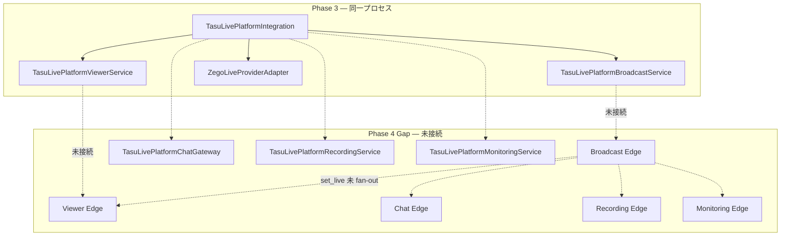

# Platform Live ZEGO Integration — Phase 4 Design Gate

**Date:** 2026-06-29  
**Base commit:** `234a7c3` (Phase 3 COMPLETE)  
**Type:** 設計ゲート · 実装なし  
**Scope:** Platform Live 配下 · Interface / TLV PoC 非変更 · 本番 deploy なし

---

## 1. 目的

Phase 3 で `TasuLivePlatformIntegration` に接続した ZEGO Provider を、**Edge broadcast sync / Chat / Recording / Monitoring / retry policy** へ接続する前に、責務境界・sync policy・実装順序を確定する。

Phase 4 は **RTC 実装の拡張ではなく、横断配線（wiring + sync）** が主題。

---

## 2. Phase 3 到達点（前提）

| 項目 | 状態 |
| --- | --- |
| Integration | Session · Broadcast · Viewer · Provider 配線済 |
| Host | `startPublish` → Broadcast.start → Adapter RTC |
| Audience（別クライアント） | `joinLive` → Provider + Session（**ローカル broadcast LIVE 不要**） |
| Coordinated viewer | `joinAsViewer` → ViewerService（**ローカル broadcast LIVE 必須**） |
| Error map / diagnostics | `mapZegoError` · `shouldRetry` · timeline（**自動 retry 未適用**） |
| Chat / Recording / Monitoring | Phase D–F **local service + edge stub 存在** · Integration **未接続** |
| Edge clients | 5 種実装済 · **Integration / PoC から未使用** |

---

## 3. 現状ギャップ（設計の出発点）



**最大の構造問題:** Edge 各ドメインが **別 in-memory store** を持ち、`broadcastLive` は `set_live` で各 room に個別設定されるが、**JS edge client に `set_live` API がなく**、host publish 成功時に fan-out する経路がない。

---

## 4. 設計領域

### 4.1 Edge broadcast sync

#### 4.1.1 正本（Source of Truth）方針

| レイヤ | 正本 | Phase 4 役割 |
| --- | --- | --- |
| **RTC / メディア** | ZEGO Provider（Adapter → TLV delegate） | 変更なし |
| **Broadcast メタ + 状態機械** | `TasuLivePlatformBroadcastService`（host プロセス） | ローカル正本 |
| **Cross-client broadcast LIVE フラグ** | Edge broadcast store + `set_live` fan-out | **Phase 4 新設 sync 層** |
| **CCU** | `TasuLivePlatformViewerCcuRegistry`（local）+ viewer edge `ccu` | edge mode 時は edge を read path に |

#### 4.1.2 provider=live → broadcast / session / CCU 反映

| イベント | Local Broadcast | Session | Edge broadcast | Edge fan-out (`set_live`) | CCU |
| --- | --- | --- | --- | --- | --- |
| `startPublish` 成功 | `DRAFT→LIVE` | `start` → LIVE | `create` + `start`（idempotent） | `live=true` → viewer/chat/recording/monitoring | host 登録 |
| Provider `PROVIDER_CONNECTED` | 維持 LIVE | CONNECTED/LIVE | 変更なし | 変更なし | — |
| Provider `PROVIDER_RECONNECTING` | **維持 LIVE** | RECONNECTING | **維持 live** | **維持 true**（視聴継続可能） | heartbeat 継続 |
| Provider `PROVIDER_RECONNECTED` | LIVE | RECONNECTED | live | true | — |
| `stopPublish` 成功 | `STOPPING→ENDED` | `end`/`leave` | `stop` | `live=false` 全 room | CCU reset |
| Publish / Provider fatal | `FAILED` | FAILED | `failed` or stop | `live=false` | clear |
| Adapter dispose | ended/disposed | IDLE | stop if owner | false | clear |

**原則:** `provider=live` は **Adapter 内部状態**。Platform broadcast `LIVE` は **publish 成功 + BroadcastService 遷移完了** で確定。Edge `broadcastLive` は **BroadcastService LIVE 確定後** に fan-out（Provider signal だけでは flip しない）。

#### 4.1.3 reconnect / stop / failed の sync policy

| シナリオ | Broadcast edge | Viewer/Chat/Recording edge | Session |
| --- | --- | --- | --- |
| **Network reconnect（recoverable）** | state=live 維持 | broadcastLive=true 維持 | RECONNECTING → RECONNECTED |
| **Host stop（正常）** | stop → ended | set_live false | end |
| **Publish fatal（permission/config）** | failed | set_live false | failed · chat/recording 不可 |
| **Edge cold start** | store 空 | 全 false | クライアントは edge state 再 fetch · host は re-publish 必要 |
| **Duplicate startPublish** | create 409 → existing live なら idempotent ok | set_live true（no-op） | 既存 LIVE なら拒否 or already live |

#### 4.1.4 Idempotency

| 操作 | 既存パターン | Phase 4 追加方針 |
| --- | --- | --- |
| `createBroadcast` (edge) | 409 if exists & not ended | `broadcastId` 必須 · surface+broadcastId キー固定 |
| `set_live` | boolean 代入（暗黙 idempotent） | sync モジュールから **同一 payload 再送 OK** |
| `joinViewer` (local) | `alreadyJoined: true` | edge join も同様（viewer edge で状態確認） |
| `startRecording` (edge) | 409 already recording | Integration は **明示 start のみ** · 自動開始しない |
| Chat send (edge) | server 生成 messageId | **client messageId 必須化**（retry 時 duplicate 防止） |

**非目標（Phase 4）:** `Idempotency-Key` HTTP ヘッダ · DB 永続 · マルチ region。

#### 4.1.5 新規モジュール（候補）

`platform-live/core/live-platform-edge-sync.js`

```text
propagateBroadcastLive({ surface, broadcastId, roomId, live, reason })
  → broadcast edge (state/start/stop)
  → parallel set_live on viewer / chat / recording edge
  → monitoring patch { broadcastLive, sessionActive }
```

Integration オプション: `{ edgeSync?: TasuLivePlatformEdgeSync, useEdgeSync?: boolean }`  
**デフォルト false** — Phase 3 挙動（local-only）を維持。

---

### 4.2 Chat Gateway 連携

#### 4.2.1 Enable policy

| タイミング | Chat 状態 | 根拠 |
| --- | --- | --- |
| initialize 後 · publish 前 | **disabled** | `_validateChatContext` → broadcast ≠ LIVE |
| publish 成功後 | **enabled**（send 可） | local broadcast LIVE + edge set_live |
| publish 失敗 | **disabled** | broadcast FAILED / 未 LIVE |
| stop 後 | **disabled** | broadcast ENDED · set_live false |
| reconnect 中 | **enabled 維持** | broadcast LIVE 維持 · viewer WATCHING なら send 可 |

#### 4.2.2 Provider failure と chat

Provider error **単体**では chat を落とさない（broadcast が LIVE のままなら chat 継続）。  
**Publish 失敗**で broadcast が FAILED になった場合のみ chat deny。

#### 4.2.3 Viewer join/play と chat permission

| Path | Viewer 状態 | Chat 前提 |
| --- | --- | --- |
| `joinAsViewer`（coordinated） | ViewerService → WATCHING | local `getWatchState === WATCHING` |
| `joinLive`（cross-client PoC） | Session join のみ | Phase 4: edge `set_watching` + optional local viewer registry 登録 |
| Edge chat send | — | `room.broadcastLive && room.watching.has(userId)` |

**設計決定:** Phase 4 では Chat Gateway を Integration に載せ、`joinLive` 成功時に **edge `set_watching`** を呼ぶ。local ViewerService を経由しない audience も chat 可能にする（edge 正本）。

#### 4.2.4 Integration API（追加候補 · Interface 非変更）

- `sendChatMessage(options)` → ChatGateway → optional ChatEdgeClient
- `getChatMessages(options)` → read path
- 内部: broadcast LIVE 確定時に system event `broadcast_started`（optional · Phase 4 PR3）

---

### 4.3 Recording 連携

#### 4.3.1 Boundary（Phase 4 でやらないこと）

| 項目 | Phase 4 | 将来 |
| --- | --- | --- |
| ZEGO Cloud Recording 開始 | **しない** | Provider `startRecording` 実装 |
| 実ファイル / playback URL | stub のみ | Edge + storage |
| 自動録画開始 | **しない** | 明示 UI / API |

#### 4.3.2 Lifecycle（wire のみ）

| イベント | Recording 動作 |
| --- | --- |
| publish success | **candidate event** のみ（Monitoring / diagnostics）· `RECORDING_CANDIDATE` lifecycle log |
| 明示 `startRecording()` | local service + edge start（broadcast LIVE 必須）· idempotent 409 尊重 |
| provider stop / broadcast stop | `stopRecording` if status=recording · else noop |
| provider error + broadcast FAILED | recording → failed / idle |

#### 4.3.3 Integration API（追加候補）

- `startRecording` / `stopRecording` / `getRecordingStatus` — thin delegate to RecordingService
- PoC: ボタン 1 つ追加可（**最小 UI** · デフォルト off）

---

### 4.4 Monitoring 連携

#### 4.4.1 入力ソース

| ソース | 内容 |
| --- | --- |
| `TasuLivePlatformDiagnostics` | provider / broadcast / viewer / session timeline |
| `getIntegrationDiagnostics()` | canonical state · publish diag |
| `mapZegoError` 結果 | code · recoverable · retryAfterMs |
| Lifecycle hooks | publish:success/failed · reconnect · set_live |

#### 4.4.2 MonitoringService 配線

```text
Integration._createStack()
  → MonitoringService.wire({ session, broadcast, viewer, chat, recording, provider })
  → getHealth / getMetrics / getProviderStatus
```

Edge `patch` action（monitoring edge に存在 · client 未暴露）:

- `broadcastLive`, `sessionActive`, `recordingActive`, `providerState`, `lastErrorCode`

#### 4.4.3 Smoke runner

- 現状: stub-only 9-step smoke
- Phase 4: `TasuLivePlatformIntegration` + stub provider variant を追加（ZEGO mock / 8788 E2E とは別 unit）

---

### 4.5 Retry policy

#### 4.5.1 分類（`zego-platform-error-map.js` 正本）

| 分類 | Platform code | recoverable | auto retry | 例 |
| --- | --- | --- | --- | --- |
| **fatal / permission** | `PERMISSION_DENIED` | false | **不可** | Permissions-Policy, getUserMedia denied |
| **fatal / config** | `CONFIG_ERROR` | false | **不可** | appId/server 未設定 |
| **transient / token** | `TOKEN_ERROR` | true | **可** (max 2) | 503, 401, empty token |
| **transient / network** | `NETWORK_ERROR` | true | **可** (max 2) | websocket, offline |
| **transient / timeout** | `TIMEOUT` | true | **可** (max 2) | publish timeout |
| **unknown** | `PROVIDER_ERROR` | false | **不可** | 分類不能 |

#### 4.5.2 auto retry vs reconnect vs manual retry

| 机制 | 適用箇所 | 挙動 |
| --- | --- | --- |
| **auto retry** | `startPublish`, `joinLive`, `joinAsViewer` 内 | `executeWithRetry(fn, { maxAttempts: 2, shouldRetry, retryAfterMs })` · **permission/config は即 fail** |
| **reconnect** | ユーザー/API 明示 `reconnect()` | Provider `reconnectLive` + session reconnect · **1 回 orchestration** · auto retry ループに含めない |
| **manual retry** | fatal 後 | UI/呼び出し側が再度 `startPublish` / `joinLive` · 新しい attempt として diagnostics に記録 |

**新規ヘルパ（候補）:** `platform-live/core/live-platform-retry.js` — `executeWithRetry` · diagnostics に `retry:attempt` 記録

#### 4.5.3 Edge / Chat retry

- Chat rate limit `THROTTLE` → client backoff（既存 hook）· Integration は `retryAfterMs` を返すのみ
- Edge sync 失敗 → **broadcast LIVE local は維持** · edge sync retry 1 回 · 失敗は diagnostics warning（RTC は成功のまま）

---

## 5. Phase 4 でやること / やらないこと

### 5.1 やること

1. Edge sync モジュール + edge client `set_live` / monitoring `patch` 暴露
2. Integration への Chat / Recording / Monitoring 配線（opt-in `useEdgeSync`）
3. Cross-client `joinAsViewer` が edge broadcast LIVE を参照できる path
4. `joinLive` 成功時の edge `set_watching`（chat permission 整合）
5. Recording candidate event + 明示 start/stop wire（stub 録画）
6. Monitoring health/metrics + retry decision logging
7. Integration 層 `executeWithRetry`（限定 API）
8. Phase 4 unit test + Phase 3/E2E/Browser Play regression 維持

### 5.2 やらないこと

| 除外 | 理由 |
| --- | --- |
| Production deploy / Supabase prod migration | ゲート外 |
| TLV PoC / `live/providers/zego-live-provider.js` 変更 | AD / Phase 3 凍結 |
| `PlatformLiveProviderInterface` 変更 | 契約凍結 |
| ZEGO Cloud Recording 実開始 | Phase 4 boundary |
| ZEGO IM 実 chat | Chat Gateway + Edge stub 正本 |
| DB 永続 broadcast store | Edge in-memory stub 継続 |
| UI 大幅変更 | PoC 最小追加のみ可 |
| Builder / AI Workspace / Secretary | スコープ外 |
| `joinLive` PoC path の破壊 | E2E / Browser Play 必須 PASS |

---

## 6. 実装順序（小 PR / commit 単位）

| PR | 内容 | Rollback 容易性 | 主な新規テスト |
| --- | --- | --- | --- |
| **P4-1** | `live-platform-edge-sync.js` + edge client `setLive`/`patch` + broadcast start/stop hook | Integration 未変更 · flag off | edge sync unit · set_live idempotency |
| **P4-2** | Integration `{ useEdgeSync }` + host publish/stop → sync · edge state read for permission | flag default false | dual-context joinAsViewer mock |
| **P4-3** | Chat Gateway in Integration · client messageId on chat edge · `set_watching` on joinLive | chat methods additive | chat + joinLive integration test |
| **P4-4** | Recording service wire · candidate event · explicit start/stop | recording opt-in | recording lifecycle unit |
| **P4-5** | Monitoring wire · diagnostics feed · smoke Integration variant | monitoring read-only path | monitoring health unit |
| **P4-6** | `executeWithRetry` on publish/join · retry diagnostics | retry wrapper isolated | retry classification tests |

**Merge 規則:** 各 PR 後 `test:platform-live-zego-integration-phase3` + Phase A–F + E2E + Browser Play **必須 PASS**。

---

## 7. 影響範囲

| 領域 | 影響 | リスク |
| --- | --- | --- |
| `platform-live/core/*` | Integration · sync · retry 新規 | 中 — flag で隔離 |
| `platform-live/*/live-*-edge-client.js` | API 追加 | 低 — 後方互換 |
| `platform-live/chat/*` | messageId passthrough | 中 — edge contract |
| `supabase/functions/live-platform-*` | set_live / messageId 整合 | 低 — stub only |
| `platform-live/zego-platform-poc.*` | 最小デバッグ UI optional | 低 |
| TLV / Interface / ZEGO adapter RTC | **なし** | — |
| `deploy/cloudflare/dist` | build:pages 同期のみ | — |

---

## 8. 必要テスト

| テスト | タイミング |
| --- | --- |
| `test-platform-live-zego-integration-phase4.mjs`（新規） | 各 PR |
| Phase 3 test (42) regression | 毎 PR |
| Phase 1 + A–F regression | 毎 PR |
| `verify-platform-live-zego-integration-e2e` | P4-2 以降 |
| `verify-platform-live-zego-browser-play-check` | 毎 PR（**joinLive path 維持**） |
| Edge sync dual-client unit（mock fetch） | P4-1, P4-2 |
| Retry: permission never retried · token retried once | P4-6 |
| TLV PoC / Interface SHA unchanged | 毎 PR |

---

## 9. 実装候補ファイル一覧

### 新規

- `platform-live/core/live-platform-edge-sync.js`
- `platform-live/core/live-platform-retry.js`
- `scripts/test-platform-live-zego-integration-phase4.mjs`
- `reports/live-platform-zego-phase4-integration.md`（実装完了時）

### 更新（順次）

- `platform-live/core/live-platform-integration.js`
- `platform-live/broadcast/live-broadcast-service.js`（optional sync callback）
- `platform-live/broadcast/live-broadcast-edge-client.js`
- `platform-live/viewer/live-viewer-edge-client.js`
- `platform-live/chat/live-chat-edge-client.js`
- `platform-live/chat/live-chat-gateway.js`（edge delegate optional）
- `platform-live/recording/live-recording-edge-client.js`
- `platform-live/monitoring/live-monitoring-edge-client.js`
- `platform-live/monitoring/live-monitoring-smoke-runner.js`
- `supabase/functions/live-platform-chat/index.ts`（client messageId）
- `platform-live/zego-platform-poc.js`（optional debug）
- `package.json`
- `docs/LIVE_PLATFORM_ZEGO_ADAPTER.md`

### 触らない

- `platform-live/provider/live-provider-interface.js`
- `live/providers/zego-live-provider.js`
- `live/live-zego-poc.*`

---

## 10. TODO 整理（Phase 4 着手前）

| ID | タスク | Owner layer |
| --- | --- | --- |
| P4-T1 | edge sync モジュール設計レビュー · broadcastId キー統一 | core |
| P4-T2 | chat edge client messageId 契約確定 | chat |
| P4-T3 | `useEdgeSync` デフォルト false · PoC 影響確認 | integration |
| P4-T4 | joinLive path regression を CI ゲートに固定 | qa |
| P4-T5 | recording 自動開始を code / doc で禁止明記 | recording |

---

## 11. Phase 4 実装 Go / No-Go

| ゲート | 判定 |
| --- | --- |
| Phase 3 COMPLETE · 234a7c3 | **PASS** |
| 設計境界確定（本ドキュメント） | **PASS** |
| Interface / TLV 非変更方針 | **PASS** |
| Edge stub 前提の sync 設計 | **PASS**（cold start 限界は文書化済） |
| 実装順序 · rollback 単位 | **PASS** |
| テスト計画 | **PASS** |

### 総合判定: **Phase 4 実装 GO**

**条件付き:**

1. **P4-1（edge sync）から着手** — Chat/Recording/Monitoring より先
2. **`useEdgeSync: false` デフォルト** — Phase 3 挙動を全 PR で regression 維持
3. **`joinLive` cross-client path を削除・弱体化しない**
4. **実録画・prod edge deploy は Phase 4 スコープ外**

---

## 12. 関連

- Phase 3: [live-platform-zego-phase3-integration.md](./live-platform-zego-phase3-integration.md)
- Adapter 設計: [docs/LIVE_PLATFORM_ZEGO_ADAPTER.md](../docs/LIVE_PLATFORM_ZEGO_ADAPTER.md)
- Platform Live README: [platform-live/README.md](../platform-live/README.md)
