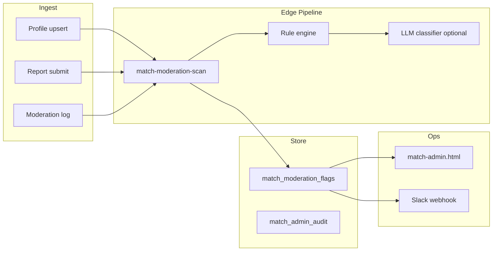

# TASFUL MATCH — AI 監視 MVP 設計

| 項目 | 内容 |
|------|------|
| 版 | v1.0 |
| 作成日 | **2026-06-22** |
| スコープ | **設計のみ**（実装禁止 · 本フェーズ） |
| 背景 | β判定レポート: マーケ「AI監視」と実装乖離 · 安全運用の最小構成を定義 |

---

## 1. 目的

クローズドβ〜一般公開に向け、**人力運営を補助する AI 監視 MVP** の範囲を限定定義する。フル自動モデレーションではなく、**検知 → キュー → 人的判断** を原則とする。

---

## 2. MVP 候補機能

| # | 機能 | 優先 | 説明 |
|---|------|------|------|
| 1 | **NGワード検知** | P0 | メッセージ/プロフィール bio の禁止語 · 連絡先直書き |
| 2 | **危険会話検知** | P1 | 金銭要求 · 外部誘導 · 脅迫ニュアンス（LLM 分類） |
| 3 | **通報多発ユーザー検知** | P0 | N 件/24h でフラグ · 管理画面通知 |
| 4 | **自動停止候補** | P1 | スコア閾値超過で **suspend 候補**（自動停止は人手承認） |
| 5 | **AI運営秘書通知** | P2 | 日次サマリ · Slack/email · 要対応キュー |

**本フェーズ対象外:** 顔認識 · 画像 NSFW モデル · リアルタイムチャット全量監視（MATCH 内チャット無し · TALK 連携は別プロダクト）

---

## 3. アーキテクチャ概要



---

## 4. 機能詳細

### 4.1 NGワード検知（P0）

| 項目 | 内容 |
|------|------|
| トリガー | `match-upsert-profile` · 将来 TALK メッセージ webhook |
| 方式 | 辞書（正規表現 + Aho-Corasick）· カテゴリ: 連絡先 · 外部 SNS · スパム · 性的強要 |
| 出力 | `severity: low|medium|high` · `matched_rule_id` |
| 自動アクション | high → **プロフィール非公開候補**（自動公開停止はしない） |
| 設定 | `match_moderation_rules` テーブル · 管理 UI で編集 |

### 4.2 危険会話検知（P1）

| 項目 | 内容 |
|------|------|
| トリガー | TALK 側イベント（`transaction_messages` insert hook）— **MATCH スコープ外連携** |
| 方式 | ルールフィルタ後 · 小型 LLM（gpt-4o-mini 等）で `safe|suspicious|dangerous` |
| コスト | 1 通/ユーザー/日 cap · β では sampling 10% |
| 出力 | `match_moderation_flags` + 根拠テキスト（管理のみ） |

### 4.3 通報多発ユーザー検知（P0）

| 項目 | 内容 |
|------|------|
| トリガー | `match-submit-report` 成功後 |
| ルール | 同一 `target_user_id` で **3 件/24h** または **5 件/7d** |
| 出力 | `flag_type: report_spike` · 既存 `match-admin-review` キューへ |
| 連携 | 既存 suspend guard（`match-talk-room.ts`）と整合 |

### 4.4 自動停止候補（P1）

| 項目 | 内容 |
|------|------|
| スコア | NG high +1 · report +2 · 危険会話 dangerous +3 |
| 閾値 | score ≥ 5 → `auto_suspend_candidate` |
| 動作 | **通知のみ** · 管理画面で Approve/Reject |
| 自動 suspend | **MVP では禁止**（誤停止リスク） |

### 4.5 AI運営秘書通知（P2）

| 項目 | 内容 |
|------|------|
| スケジュール | 毎朝 9:00 JST · Edge cron |
| 内容 | 新規通報 · pending 本人確認 · フラグサマリ · β redemption 数 |
| チャネル | Slack `#match-ops` · メール fallback |

---

## 5. データモデル（案）

```sql
-- match_moderation_flags
id uuid pk
target_user_id text
source text  -- profile|report|talk|batch
flag_type text
severity text
score int
payload jsonb
status text  -- open|reviewed|dismissed
created_at timestamptz

-- match_moderation_rules
id uuid pk
pattern text
category text
severity text
enabled bool
```

---

## 6. Edge Functions（実装フェーズ）

| Function | 役割 |
|----------|------|
| `match-moderation-scan` | 同期スキャン（profile/report） |
| `match-moderation-digest` | cron 日次通知 |
| 既存 `match-admin-review` | フラグ一覧 API 拡張 |

---

## 7. 管理 UI 拡張（実装フェーズ）

| 画面 | 追加 |
|------|------|
| `match-admin.html` | フラグキュー · ルール編集 · スコア履歴 |
| フィルタ | open flags · report_spike · ng_word |

---

## 8. 非機能要件

| 項目 | 要件 |
|------|------|
| レイテンシ | profile scan < 500ms（LLM 除く） |
| プライバシー | LLM 送信は最小テキスト · ログ 30 日 |
| 誤検知 | ユーザー異議申立て導線（将来） |
| コスト | β 月 $50 cap アラート |

---

## 9. ロールアウト計画

| Phase | 内容 | β |
|-------|------|---|
| M0 | report_spike のみ（SQL + admin 通知） | **β 推奨最小** |
| M1 | NGワード辞書 v1 | β 中期 |
| M2 | 危険会話（TALK 連携） | 一般公開前 |
| M3 | LLM 秘書 digest | 一般公開前 |

---

## 10. 判定

| 項目 | 状態 |
|------|------|
| 設計 | **完了** |
| 実装 | **未着手**（M0 から開始推奨） |
| β公開ブロッカー | **No** — 人力 + 既存通報で開始可。M0 は **推奨** |
