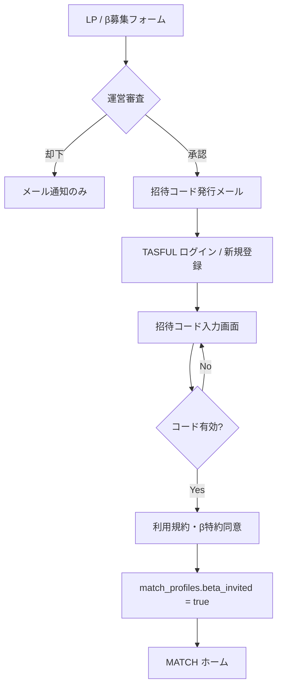

# TASFUL MATCH — クローズドβ 招待フロー設計

| 項目 | 内容 |
|------|------|
| 版 | v1.0 |
| 作成日 | **2026-06-22** |
| 目的 | 一般公開ではなく**招待制β**での利用開始フローを定義 |
| スコープ | 設計のみ（本指示では未実装） |

---

## 1. ゴール

```
β募集 → 審査/発行 → 招待コード入力 → 利用規約同意 → MATCH利用可
```

| 確認項目 | 期待動作 |
|----------|----------|
| 未招待ユーザー | MATCH コア API / ページを **403 またはログイン後ゲート** で拒否 |
| 招待ユーザー | 通常フロー（プロフィール → スワイプ → マッチ → TALK） |

---

## 2. ユーザージャーニー



---

## 3. コンポーネント設計

### 3.1 β募集フォーム

| 項目 | 内容 |
|------|------|
| 配置 | `match/match-beta-apply.html`（新規）または既存 `company/contact.html` 派生 |
| 収集項目 | 氏名 · メール · 生年月日 · 都道府県 · 利用目的 · 紹介元（任意） |
| 送信先 | Edge `match-beta-apply` → `match_beta_applications` テーブル |
| スパム対策 | Turnstile / honeypot · レート制限 |

### 3.2 招待コード

| 項目 | 内容 |
|------|------|
| 形式 | `MATCH-XXXX-XXXX`（8〜12 文字 · 大文字英数 · 紛らわしい文字除外） |
| 保存 | `match_beta_invites`（code_hash · max_uses · expires_at · created_by） |
| 紐付け | 利用時 `match_beta_redemptions`（user_id · redeemed_at） |
| 管理 | 管理画面 `match-admin.html` から手動発行 · 一括 CSV |

**セキュリティ:** 平文コードはメールのみ。DB は SHA-256 hash。

### 3.3 招待ゲート（利用可判定）

**方式 A（推奨 · DB フラグ）**

```sql
-- match_profiles または auth.users app_metadata
beta_invited_at timestamptz
beta_invite_code_id uuid references match_beta_invites(id)
```

Edge `_shared/match-auth.ts` の `requireUser` / `requireUserAsync` 後段で:

```typescript
if (!await isBetaInvited(user.matchUserId)) {
  throw new MatchFunctionError("beta_not_invited", "Beta access required", 403);
}
```

**方式 B（allowlist · 既存 L7 スロット拡張）**

- テストユーザー T1–T5 と同様 `match_beta_allowlist(talk_user_id)` 
- クローズドβ初期は **方式 B で即開始可能** → 方式 A へ移行

### 3.4 利用規約同意

| 項目 | 内容 |
|------|------|
| 画面 | 招待コード入力直後 · チェックボックス必須 |
| 対象文書 | `company/legal/terms.html` · **β特約 addendum**（新規 markdown → HTML） |
| 記録 | `match_legal_consents(user_id, doc_version, agreed_at, ip_hash)` |
| 再同意 | 規約改定時 `doc_version` bump → 次回ログインで再同意 |

---

## 4. フロント配線

| ファイル | 変更 |
|----------|------|
| `match-bootstrap.js` | JWT あり + `beta_invited` なし → `/match-beta-gate.html` へ redirect |
| `match-beta-gate.html` | コード入力 + 規約同意 UI（新規） |
| `match-api.js` | `403 beta_not_invited` をトースト + ゲートへ誘導 |
| 全 β HTML | 未招待時 skeleton 非表示 |

---

## 5. API 一覧（新規 · 実装フェーズ）

| Function | 役割 |
|----------|------|
| `match-beta-apply` | 募集フォーム POST |
| `match-beta-redeem` | コード検証 + redemption + フラグ設定 |
| `match-beta-status` | 現在ユーザーの招待状態 GET |

---

## 6. 確認テスト計画

| # | ケース | 期待 |
|---|--------|------|
| 1 | 未ログインで match-swipe | ログインへ |
| 2 | ログイン済 · 未招待 | 403 / ゲート画面 |
| 3 | 無効コード | 422 invalid_code |
| 4 | 期限切れコード | 422 expired |
| 5 | 有効コード + 規約未同意 | 同意必須 |
| 6 | 有効コード + 同意済 | スワイプ可 |
| 7 | 既 redemption ユーザー | コード再入力不要 |

---

## 7. 運用

| 項目 | 内容 |
|------|------|
| 初期招待数 | 50–100 名（手動審査） |
| 監視 | 日次 redemption 数 · 通報率 |
| ロールバック | `beta_invited_at` 一括 NULL で即停止 |

---

## 8. 実装優先度

| Phase | 内容 | 工数目安 |
|-------|------|----------|
| **β0** | allowlist テーブル + Edge 403 ガード | 0.5d |
| **β1** | 招待コード redeem + ゲート HTML | 1.5d |
| **β2** | 募集フォーム + 管理発行 UI | 2d |
| **β3** | 規約同意ログ + 改定再同意 | 1d |

**本指示スコープ外:** 決済 · プレミアム · 自動審査 AI

---

## 9. 判定

| 項目 | 状態 |
|------|------|
| 設計完了 | **Yes** |
| 実装 | **未着手**（β0 allowlist から開始推奨） |
