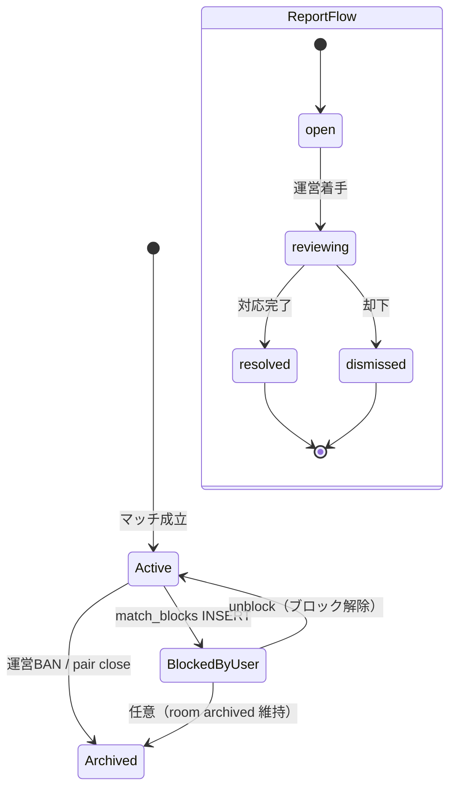
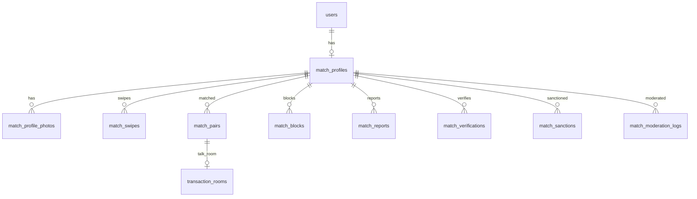

# TASFUL MATCH — DB・API 設計レビュー（実装前）

| 項目 | 内容 |
|------|------|
| 版 | v1.0（レビューのみ） |
| 作成日 | 2026-06-21 |
| 前提 | UIモック完成（`match/` Phase1+2）。本書は DDL 適用・API 実装・認証接続を行わない |
| 参照 | `docs/match-mvp-design.md`、`supabase/transaction_chat.sql`、`supabase/reports.sql`、`supabase/blocked_users.sql`、`supabase/moderation_logs.sql` |

---

## 0. レビュー方針

### 0.1 守るべき制約

| 制約 | 方針 |
|------|------|
| 既存 TASFUL 本体を壊さない | MATCH 用テーブルは `match_*` プレフィックスで新設。既存 `listings` / `business_listings` / `shop_*` には触れない |
| Builder を壊さない | Builder 専用テーブル・Edge Function とは独立。共通は `auth.users`（会員 ID）のみ |
| TALK を壊さない | `transaction_rooms` / `transaction_messages` の既存フローは維持。マッチ用は **列追加 + `listing_type = 'match'`** で拡張 |
| 認証・課金・広告・AI API | 本フェーズでは接続しない。差し込み口とログ設計のみ定義 |

### 0.2 ID・会員基盤の整合

既存 TALK は `transaction_rooms.buyer_id` / `seller_id` が **text** 型（`user_member_profile.sql` の `users.id` と同系）。Supabase Auth の `auth.users.id`（uuid）との対応はアプリ層で **文字列化して統一** する。

| レイヤ | 推奨 |
|--------|------|
| MATCH 新規テーブル | `user_id text not null`（TALK と同一キー空間） |
| 将来 | `profiles.user_id` / `members.user_id` との 1:1 を維持し、MATCH は `match_profiles.user_id` でぶら下げる |
| 理由 | `transaction_rooms` 改修範囲を最小化し、チャット一覧・既読・通報の既存 JS を流用しやすい |

---

## 1. 必要テーブル案

### 1.1 コア（Phase 1 必須）

| テーブル | 用途 |
|----------|------|
| `match_profiles` | 恋活・婚活プロフィール（会員 1:1） |
| `match_profile_photos` | 写真メタ（順序・ストレージパス・モデレーション結果） |
| `match_swipes` | スキップ / いいね履歴 |
| `match_pairs` | 相互いいね（マッチ）と TALK ルーム紐付け |
| `match_blocks` | ユーザー間ブロック（MATCH スコープ） |
| `match_reports` | 通報（プロフィール・スワイプ・チャット文脈） |
| `match_verifications` | 本人確認申請・審査履歴 |
| `match_moderation_logs` | MATCH 文脈の AI / ルール監視ログ |

### 1.2 安全・運営（Phase 1 軽量 + Phase 2 拡張）

| テーブル | 用途 |
|----------|------|
| `match_sanctions` | BAN・機能制限・警告（MATCH スコープ） |
| `match_daily_limits` | 日次いいね上限など（将来課金・広告と連携） |
| `match_hobby_tags` | 趣味タグマスタ（任意・Phase 1 は text[] でも可） |

### 1.3 既存テーブル拡張（TALK 接続）

| テーブル | 変更案 |
|----------|--------|
| `transaction_rooms` | `listing_type = 'match'` を許可。任意で `match_pair_id uuid` 列追加 |
| `moderation_logs` | 任意列 `source_app text default 'talk'`、`match_pair_id`（MATCH チャットを TALK 経由で記録する場合） |

**採用しない案（本レビューでの推奨）**

- 既存 `reports` / `blocked_users` を MATCH から直接流用しない  
  → 理由コード・必須カラム（`target_message_id` 必須など）が取引チャット前提のため。将来は運営ダッシュボードで **ビュー統合** する。

---

## 2. 各テーブルの目的

| テーブル | 目的 | 主な読み手 | 主な書き手 |
|----------|------|------------|------------|
| `match_profiles` | 探索・表示用プロフィールの単一ソース | スワイプ API、他者プロフィール | 本人（下書き）、Edge（審査結果反映） |
| `match_profile_photos` | 写真の順序・公開可否・NG 判定 | プロフィール API | 本人アップロード、モデレーション Worker |
| `match_swipes` | 重複いいね防止・候補除外・マッチ判定材料 | スワイプ / マッチ API | Edge `match-record-swipe` |
| `match_pairs` | マッチ成立事実と TALK `room_id` の対応 | マッチ一覧、TALK bridge | Edge `match-create-pair` |
| `match_blocks` | 双方向非表示・チャット停止の根拠 | 候補クエリ、一覧フィルタ | 本人 |
| `match_reports` | ユーザー通報と運営キュー | マイページ履歴、運営 | 本人 |
| `match_verifications` | 電話・身分証・審査ステップの監査証跡 | 本人確認 UI、運営 | 本人（申請）、Edge / 運営（審査） |
| `match_sanctions` | BAN・一時停止の明示的記録 | 全 MATCH API のゲート | 運営 / 自動判定（将来） |
| `match_moderation_logs` | プロフィール文・写真の送信前後監視 | 運営、リスク分析 | Edge / クライアント（非同期） |
| `match_daily_limits` | いいね残数（無料枠） | スワイプ UI | Edge（消費・リセット） |

---

## 3. 主なカラム案

### 3.1 `match_profiles`

| カラム | 型 | 説明 |
|--------|-----|------|
| `id` | uuid PK | |
| `user_id` | text UNIQUE NOT NULL | TASFUL 会員 ID |
| `nickname` | text NOT NULL | 1〜20 文字 |
| `gender` | text NOT NULL | `male` / `female` / `other` / `private` |
| `birth_date` | date NOT NULL | 表示は年齢のみ算出 |
| `prefecture` | text NOT NULL | |
| `city` | text | 市区町村（任意） |
| `bio` | text | 0〜500 文字 |
| `hobby_tags` | text[] | 最大 5 |
| `verification_status` | text NOT NULL DEFAULT `none` | 下記 §8 |
| `profile_status` | text NOT NULL DEFAULT `draft` | `draft` / `active` / `hidden` / `suspended` |
| `main_photo_id` | uuid FK → `match_profile_photos` | 表示用デノーマライズ可 |
| `last_active_at` | timestamptz | |
| `created_at` / `updated_at` | timestamptz | |

**インデックス案:** `(profile_status, verification_status)`、`user_id` UNIQUE。

### 3.2 `match_profile_photos`

| カラム | 型 | 説明 |
|--------|-----|------|
| `id` | uuid PK | |
| `profile_id` | uuid FK → `match_profiles` ON DELETE CASCADE | |
| `storage_path` | text NOT NULL | Supabase Storage パス |
| `sort_order` | smallint NOT NULL DEFAULT 0 | 0 = メイン |
| `moderation_status` | text DEFAULT `pending` | `pending` / `approved` / `rejected` |
| `moderation_reasons` | text[] | |
| `created_at` | timestamptz | |

### 3.3 `match_swipes`

| カラム | 型 | 説明 |
|--------|-----|------|
| `id` | uuid PK | |
| `swiper_user_id` | text NOT NULL | |
| `target_user_id` | text NOT NULL | |
| `action` | text NOT NULL | `like` / `skip` |
| `created_at` | timestamptz NOT NULL DEFAULT now() | |

**制約:** `UNIQUE (swiper_user_id, target_user_id)`。

### 3.4 `match_pairs`

| カラム | 型 | 説明 |
|--------|-----|------|
| `id` | uuid PK | |
| `user_a_id` | text NOT NULL | `LEAST(user_id_1, user_id_2)` |
| `user_b_id` | text NOT NULL | `GREATEST(...)` |
| `matched_at` | timestamptz NOT NULL DEFAULT now() | |
| `talk_room_id` | uuid FK → `transaction_rooms.id` | nullable まで bridge で作成 |
| `status` | text NOT NULL DEFAULT `active` | `active` / `blocked` / `unmatched` |
| `blocked_by_user_id` | text | `status = blocked` 時 |
| `created_at` | timestamptz | |

**制約:** `UNIQUE (user_a_id, user_b_id)`、`CHECK (user_a_id < user_b_id)`。

### 3.5 `match_blocks`

| カラム | 型 | 説明 |
|--------|-----|------|
| `id` | uuid PK | |
| `blocker_user_id` | text NOT NULL | |
| `blocked_user_id` | text NOT NULL | |
| `source` | text | `swipe` / `profile` / `chat` / `report` |
| `match_pair_id` | uuid | 任意 |
| `created_at` | timestamptz | |

**制約:** `UNIQUE (blocker_user_id, blocked_user_id)`。

### 3.6 `match_reports`

| カラム | 型 | 説明 |
|--------|-----|------|
| `id` | uuid PK | |
| `reporter_user_id` | text NOT NULL | |
| `reported_user_id` | text NOT NULL | |
| `reason_code` | text NOT NULL | `inappropriate_message` / `impersonation` / `harassment` / `other`（UIモック準拠） |
| `detail` | text | |
| `context_type` | text NOT NULL | `profile` / `swipe` / `chat` |
| `context_id` | text | `match_pair_id` / `talk_room_id` / `profile_id` 等 |
| `status` | text NOT NULL DEFAULT `open` | `open` / `reviewing` / `resolved` / `dismissed` |
| `moderation_log_ids` | uuid[] | 関連 AI ログ |
| `created_at` / `updated_at` | timestamptz | |

### 3.7 `match_verifications`

| カラム | 型 | 説明 |
|--------|-----|------|
| `id` | uuid PK | |
| `user_id` | text NOT NULL | |
| `phone_verified_at` | timestamptz | 電話番号認証完了 |
| `phone_hash` | text | 生番号は保存しない |
| `id_document_type` | text | `drivers_license` / `mynumber` / `passport` / `residence_card` |
| `id_document_storage_path` | text | 身分証画像（暗号化バケット） |
| `status` | text NOT NULL DEFAULT `phone_pending` | 下記 §8 |
| `submitted_at` | timestamptz | |
| `reviewed_at` | timestamptz | |
| `reviewed_by` | text | 運営者 ID |
| `reject_reason` | text | |
| `provider` | text DEFAULT `manual` | `manual` / `ekyc_vendor` |
| `provider_metadata` | jsonb | 外部 eKYC 連携用 |
| `created_at` / `updated_at` | timestamptz | |

複数申請履歴を残す場合は `user_id` UNIQUE を外し、最新行を `match_profiles` から参照。

### 3.8 `match_sanctions`（BAN）

| カラム | 型 | 説明 |
|--------|-----|------|
| `id` | uuid PK | |
| `user_id` | text NOT NULL | |
| `sanction_type` | text NOT NULL | `warning` / `feature_restrict` / `temporary_ban` / `permanent_ban` |
| `scope` | text NOT NULL DEFAULT `match` | **MATCH 限定**（マーケットプレイス全体 BAN は別途） |
| `reason_code` | text | |
| `reason_detail` | text | |
| `related_report_ids` | uuid[] | |
| `starts_at` | timestamptz NOT NULL DEFAULT now() | |
| `ends_at` | timestamptz | 一時 BAN |
| `revoked_at` | timestamptz | |
| `created_by` | text | `system` / 運営者 ID |
| `created_at` | timestamptz | |

**有効判定:** `revoked_at IS NULL AND (ends_at IS NULL OR ends_at > now())`。

### 3.9 `match_moderation_logs`

| カラム | 型 | 説明 |
|--------|-----|------|
| `id` | uuid PK | |
| `user_id` | text | |
| `content_type` | text NOT NULL | `profile_bio` / `profile_photo` / `chat_message` |
| `content_ref` | text | photo_id / room_id / message_id |
| `input_text` | text | マスク済みテキスト |
| `level` | text NOT NULL | `ok` / `warning` / `blocked` |
| `reasons` | text[] | |
| `allowed` | boolean NOT NULL | |
| `engine` | text DEFAULT `rules` | `rules` / `ai`（将来） |
| `source_app` | text DEFAULT `match` | |
| `created_at` | timestamptz | |

### 3.10 `match_daily_limits`（Phase 1 軽量）

| カラム | 型 | 説明 |
|--------|-----|------|
| `user_id` | text | |
| `limit_date` | date | JST 基準 |
| `likes_used` | int DEFAULT 0 | |
| `likes_quota` | int DEFAULT 10 | |

**PK:** `(user_id, limit_date)`。

### 3.11 `transaction_rooms` 拡張（既存）

| カラム | 型 | 説明 |
|--------|-----|------|
| `listing_type` | text | 既存列に `'match'` を追加 |
| `match_pair_id` | uuid | 新規列（nullable） |
| `listing_id` | text | マッチ時は `match_pair_id` の文字列でも可 |
| `title` | text | 例: `【マッチ】{nickname}` |
| `buyer_id` / `seller_id` | text | 辞書順で user_a → buyer、seller は user_b 等、**一貫ルールを固定** |
| `expires_at` | timestamptz | マッチルームは遠い未来日 or NULL 許容ポリシーを要定義 |
| `status` | text | `active` / `archived`（ブロック時） |

---

## 4. RLS 方針

### 4.1 原則

| 原則 | 内容 |
|------|------|
| デフォルト拒否 | 全 `match_*` で RLS 有効。ポリシーなし INSERT/UPDATE は不可 |
| 本人データ | `auth.uid()::text`（または JWT custom claim の `user_id`）と行の `user_id` を一致 |
| 他者プロフィール | **SECURITY DEFINER 関数 + ビュー** 経由のみ。直接テーブル SELECT は不可 |
| 特権操作 | マッチ成立・相互判定・BAN・審査完了は **Edge Function（service_role）** |
| 運営 | 本番は `service_role` または `admin` ロール専用ポリシー（開発用 `using (true)` は本番禁止） |

### 4.2 テーブル別ポリシー概要

| テーブル | SELECT | INSERT | UPDATE | DELETE |
|----------|--------|--------|--------|--------|
| `match_profiles` | 本人: 全列。他者: ビュー `match_profiles_public` のみ | 本人 | 本人（`suspended` 時は拒否） | 不可（退会は status 変更） |
| `match_profile_photos` | 本人 + 公開ビュー経由 | 本人 | 本人 | 本人 |
| `match_swipes` | 本人の `swiper_user_id` のみ | 不可（Edge のみ） | 不可 | 不可 |
| `match_pairs` | 参加者のみ | Edge のみ | Edge のみ | 不可 |
| `match_blocks` | `blocker_user_id = me` | `blocker_user_id = me` | 不可 | `blocker_user_id = me`（解除） |
| `match_reports` | `reporter_user_id = me` | `reporter_user_id = me` | 不可 | 不可 |
| `match_verifications` | 本人 | 本人（申請） | Edge / 運営 | 不可 |
| `match_sanctions` | 本人は **有効制裁の有無のみ**（理由詳細は非表示可） | 運営のみ | 運営のみ | 不可 |
| `match_moderation_logs` | 本人は自分の `warning` 以上のみ（任意） | Edge / 非同期 Worker | 不可 | 不可 |
| `transaction_rooms` | 既存ポリシー拡張: `listing_type = 'match'` かつ buyer/seller に含まれる | Edge `match-ensure-talk-room` | 参加者 / Edge | 不可 |

### 4.3 候補除外ロジック（RLS 外でも可）

スワイプ候補は DB 関数 `match_get_candidates(me_id, limit)` で以下を除外:

- 自分自身
- 既 `match_swipes` 対象
- `match_blocks` 双方向
- `profile_status != 'active'`
- 相手が `suspended` / 有効 `match_sanctions`
- （任意）`verification_status` が探索に必要な条件

---

## 5. API / Edge Function 案

クライアントから Supabase 直叩きを最小化し、**ビジネスルールは Edge Function** に集約する。

### 5.1 Phase 1 Edge Functions

| 関数 | メソッド | 役割 | 主な副作用 |
|------|----------|------|------------|
| `match-profile-upsert` | POST | プロフィール作成・更新 | `match_profiles`、bio/写真のモデレーションキュー |
| `match-profile-publish` | POST | 下書き → 公開 | `profile_status = active`、本人確認ゲート判定 |
| `match-record-swipe` | POST | いいね / スキップ | `match_swipes`、日次上限、`match-create-pair` 呼び出し |
| `match-create-pair` | POST（内部） | 相互いいね検出 | `match_pairs` INSERT |
| `match-get-candidates` | GET | スワイプ候補 | 読み取り専用 |
| `match-list-pairs` | GET | マッチ一覧 | `match_pairs` + TALK 最終メッセージ（join または別 API） |
| `match-ensure-talk-room` | POST | TALK ルーム確保 | `transaction_rooms` INSERT、`match_pairs.talk_room_id` 更新 |
| `match-block-user` | POST | ブロック | `match_blocks`、pair `status=blocked`、room `archived` |
| `match-unblock-user` | POST | ブロック解除 | `match_blocks` DELETE |
| `match-submit-report` | POST | 通報 | `match_reports` |
| `match-verification-submit-phone` | POST | 電話認証完了記録 | `match_verifications` |
| `match-verification-submit-id` | POST | 身分証提出 | Storage + `status` 更新 |
| `match-moderate-content` | POST | プロフィール文・写真の送信前審査 | `match_moderation_logs`（rules のみ Phase 1） |

### 5.2 Phase 2 Edge Functions

| 関数 | 役割 |
|------|------|
| `match-verification-review` | 運営審査 approve / reject |
| `match-apply-sanction` | BAN・制限付与 |
| `match-revoke-sanction` | BAN 解除 |
| `match-admin-list-reports` | 通報キュー（service_role） |

### 5.3 REST 風パス案（Cloudflare Pages + Supabase Functions）

```
POST /functions/v1/match-record-swipe     { targetUserId, action }
GET  /functions/v1/match-get-candidates   ?limit=10
GET  /functions/v1/match-list-pairs
POST /functions/v1/match-ensure-talk-room { matchPairId }
POST /functions/v1/match-block-user       { blockedUserId, source }
POST /functions/v1/match-submit-report    { reportedUserId, reasonCode, detail, context }
POST /functions/v1/match-profile-upsert   { ... }
POST /functions/v1/match-profile-publish
```

### 5.4 認証（接続時の想定）

| 項目 | 方針 |
|------|------|
| トークン | 既存 `auth-current-user.js` / Supabase Auth JWT |
| Edge 検証 | `Authorization: Bearer` + `auth.getUser()` |
| 本番 | `talkProductionMode` 時は fallback ID 禁止（既存 TALK 方針踏襲） |
| **本レビュー** | 接続しない。上記は実装フェーズの契約のみ |

---

## 6. 既存 TASFUL TALK との接続方針

### 6.1 フロー（UIモック `match-talk-bridge.html` 準拠）

```
match-list / マッチ成立
    → POST match-ensure-talk-room { matchPairId }
        → transaction_rooms 未作成なら INSERT
            listing_type = 'match'
            match_pair_id = ...
            buyer_id / seller_id = マッチ双方
            title = '【マッチ】{相手ニックネーム}'
        → match_pairs.talk_room_id を更新
    → 302 / クライアント redirect → talk-home.html または chat-detail.html?room={id}
```

### 6.2 既存コードとの接続点

| 既存 | MATCH での利用 |
|------|----------------|
| `chat-supabase.js` | `fetchRoomById`、メッセージ CRUD をそのまま利用 |
| `chat-service.js` | `moderateMessage()` をマッチルームでも適用 |
| `chat-moderation.js` | ルールベース審査（電話・LINE・外部 URL） |
| `chat-reports.js` | **参照のみ**。MATCH 通報理由は `match_reports.reason_code` で別定義 |
| `moderation_logs` | チャット送信時は既存 `insertModerationLog` を継続。`source_app = 'match'` 列追加で横断分析 |
| `talk-home.html` | 一覧に `listing_type === 'match'` を表示（Phase 2 でタブ統合可） |

### 6.3 壊さないためのルール

| ルール | 説明 |
|--------|------|
| 取引チャットの `listing_type` を上書きしない | `product` / `business` / `job` 等は現状維持 |
| マッチルームに `listing_id` 必須を課さない | 取引 listing なしで room 作成可能に |
| 既存 `reports` テーブルスキーマを変更しない | MATCH は `match_reports` |
| `blocked_users` と `match_blocks` は同期しない（Phase 1） | ブロックはスコープ別。運営ビューで UNION 将来 |

### 6.4 `transaction_rooms` 参加者の正規化

**要固定ルール（スキーマ草案前に文書化）:**

```
user_a = min(user_id_1, user_id_2)  // 文字列比較
buyer_id = user_a
seller_id = user_b
```

`chat-list` が buyer/seller どちらでも自分を判定できるよう、既存 `getCurrentUserId()` との整合をテストする。

---

## 7. 通報・ブロック・BAN の状態管理

### 7.1 状態遷移図



### 7.2 ブロック時の副作用

| 対象 | 処理 |
|------|------|
| `match_blocks` | INSERT（冪等） |
| `match_pairs` | `status = 'blocked'`, `blocked_by_user_id` |
| `transaction_rooms` | `status = 'archived'`（新規メッセージ不可） |
| スワイプ候補 | 双方向除外 |
| TALK `blocked_users` | Phase 1 は **作成しない**（MATCH ブロックは `match_blocks` のみ） |

### 7.3 通報と BAN の関係

| 段階 | 動作 |
|------|------|
| ユーザー通報 | `match_reports.status = open` |
| 閾値超過（将来） | `match-apply-sanction` で `temporary_ban` |
| 重大違反 | `permanent_ban` + `match_profiles.profile_status = suspended` |
| チャット証拠 | `match_reports.moderation_log_ids` + TALK `moderation_logs` を参照 |

**BAN スコープ:** 本レビューでは **`match_sanctions.scope = 'match'` のみ** を推奨。マーケットプレイス全体の停止は既存運営フローと別テーブル（将来 `platform_sanctions`）で切り離し、誤って Builder / 出品を止めない。

### 7.4 UIモックとの対応

| UI | DB 操作 |
|----|---------|
| `match-report.html` 通報する | `match-submit-report` |
| `match-block.html` 解除 | DELETE `match_blocks` WHERE blocker = me |
| `match-swipe.html` ブロックする | `match-block-user` |
| `match-safety.html` | 各画面への導線のみ（DB 操作なし） |

---

## 8. 本人確認ステータス管理

### 8.1 二層ステータス

| 層 | カラム | 用途 |
|----|--------|------|
| プロフィール表示用 | `match_profiles.verification_status` | UI バッジ「本人確認済み」等 |
| 申請ワークフロー | `match_verifications.status` | 審査オペレーション |

### 8.2 `match_profiles.verification_status`

| 値 | UI 表示（モック準拠） | スワイプ |
|----|----------------------|----------|
| `none` | 未確認 | 不可（または制限付き） |
| `phone_verified` | 電話認証済み | 身分証提出まで制限可 |
| `pending` | 審査中 | 不可 |
| `verified` | 本人確認済み | 可 |
| `rejected` | 却下 | 不可（再提出導線） |

### 8.3 `match_verifications.status`

| 値 | 説明 |
|----|------|
| `phone_pending` | 電話未認証 |
| `phone_verified` | 電話完了 |
| `id_submitted` | 身分証提出済み |
| `under_review` | 審査中 |
| `approved` | 承認 → `match_profiles.verification_status = verified` |
| `rejected` | 却下 |

### 8.4 同期ルール

- Edge `match-verification-review` が **単一トランザクション** で両テーブルを更新
- クライアントは `verification_status` の直接 UPDATE 不可（RLS）
- 電話番号は **ハッシュのみ** 保存。身分証画像は **private bucket** + 短期署名 URL

---

## 9. AI 監視ログの保存方針

### 9.1 二系統ログ（推奨）

| ログ | テーブル | タイミング | Phase 1 |
|------|----------|------------|---------|
| MATCH プロフィール | `match_moderation_logs` | bio 保存・写真アップロード時 | ルールエンジンのみ（`chat-moderation.js` 相当をサーバー移植） |
| MATCH チャット | `moderation_logs` | TALK 送信前（既存） | 既存 `persistModerationLog` を継続 + `source_app` |

### 9.2 保存条件（TALK 既存と揃える）

| level | 保存 |
|-------|------|
| `ok` | 原則保存しない（負荷対策）。必要ならサンプリング |
| `warning` | 保存 |
| `blocked` | 保存 + 送信拒否 |

### 9.3 個人情報

| 項目 | 方針 |
|------|------|
| プロフィール文 | マスク後テキストまたは長さ制限コピー |
| 写真 | URL ではなく `storage_path` + photo_id |
| 保持期間 | 通報未関連 90 日、通報関連は法務ポリシーに従い延長（要法務確認） |
| AI API | Phase 1 は **接続しない**。`engine = 'rules'` のみ |

### 9.4 通報・BAN 連携

```
match-submit-report
  → 直近 match_moderation_logs / moderation_logs を reported_user で検索
  → match_reports.moderation_log_ids に格納
  → 将来: スコア閾値で match-apply-sanction
```

---

## 10. Phase 別実装順

### Phase 1 — 出会いの最小ループ（DB + API）

| 順 | 内容 | 依存 |
|----|------|------|
| 1 | `match_profiles` + RLS + Storage バケット設計 | 会員 ID 方針確定 |
| 2 | `match-profile-upsert` / `publish` + モデレーション（rules） | 1 |
| 3 | `match_verifications` + 電話・身分証提出 API（審査は手動） | 1 |
| 4 | `match_swipes` + `match-record-swipe` + `match_daily_limits` | 2, 3（ゲート） |
| 5 | `match_pairs` + `match-create-pair` | 4 |
| 6 | `transaction_rooms` 拡張 + `match-ensure-talk-room` | 5 |
| 7 | `match_blocks` + `match_reports` + Edge | 5 |
| 8 | `match_moderation_logs` | 2 |
| 9 | UI モック → `match-api.js` 接続（認証は STEP 別） | 1〜8 |

**Phase 1 DoD（DB/API）:** 登録会員がプロフィール公開 → 本人確認フロー → スワイプ → マッチ → TALK ルーム → 通報・ブロックを DB に記録できる。

### Phase 2 — 安全・運営強化

| 順 | 内容 |
|----|------|
| 1 | `match_sanctions` + 運営審査 API |
| 2 | `match-verification-review`（eKYC ベンダー差し替え可） |
| 3 | `talk-home` マッチタブ・通知統合 |
| 4 | 通報キュー管理 UI |
| 5 | AI API 接続（`engine = 'ai'`）— **別承認ゲート** |

### Phase 3 — 収益・体験（本レビュー範囲外の参照）

- `match_daily_limits` と課金・広告連携
- レコメンド・フィルタ
- スーパーいいね等

---

## 11. ER 概要



---

## 12. リスク・未決事項（スキーマ草案前の確認推奨）

| # | 論点 | 推奨デフォルト | 影響 |
|---|------|----------------|------|
| D1 | 会員 ID を text 統一 vs uuid ネイティブ | **text 統一**（TALK 互換） | `transaction_rooms` 接続 |
| D2 | `reports` / `blocked_users` 共用 vs `match_*` 分離 | **分離** | 運営 UI の統合コスト |
| D3 | BAN を MATCH 限定 vs プラットフォーム全体 | **MATCH 限定**（`match_sanctions`） | マーケットプレイス影響 |
| D4 | 本人確認 Phase 1 は手動審査 vs eKYC API | **手動 + metadata 拡張** | リリース速度 |
| D5 | マッチ `transaction_rooms.expires_at` | 固定遠未来 or NULL 許容 | 既存期限切れロジック |
| D6 | スワイプ未本人確認時の挙動 | 完全ブロック（モック準拠） | コンバージョン |
| D7 | 法務（出会い系届出・画像保持期間） | 別チケット | 本番リリースゲート |

**D1〜D6 は推奨デフォルトでスキーマ草案を起こせる。** D7 は本番ゲートだが DDL 草案のブロッカーではない。

---

## 13. UIモックとのトレーサビリティ

| UIモック | 主テーブル / API |
|----------|------------------|
| `match-top.html` | 認証後 `match-profile-upsert` へ |
| `match-profile-create.html` | `match_profiles`, `match_profile_photos`, `match-profile-publish` |
| `match-swipe.html` | `match-get-candidates`, `match-record-swipe` |
| `match-list.html` | `match-list-pairs` |
| `match-talk-bridge.html` | `match-ensure-talk-room` |
| `match-safety.html` | 読み取り専用 + 各安全 API への導線 |
| `match-mypage.html` | `match_profiles`, 各サブ API |
| `match-verify.html` | `match_verifications` |
| `match-report.html` | `match_reports` |
| `match-block.html` | `match_blocks` |
| `match-review.html` | 開発用（DB なし） |

---

## 14. 判定

| チェック項目 | 結果 |
|--------------|------|
| テーブル責務が UI モック領域と対応している | OK |
| TALK / Builder / 本体との境界が定義されている | OK |
| RLS・特権 API の分離方針がある | OK |
| 通報・ブロック・BAN・本人確認の状態機械が定義されている | OK |
| AI ログは接続なしで拡張可能 | OK |
| Phase 実装順が明確 | OK |
| 未決事項に推奨デフォルトがある | OK（§12） |

### 総合判定

```
READY_FOR_SCHEMA_DESIGN
```

**次ステップ（本レビュー範囲外）:** `supabase/migrations/` に DDL 草案作成 → ステージング適用 → Edge Function スタブ → UI `match-api.js` 接続。適用前に D1・D5 を関係者確認することを推奨。

---

## 15. 改訂履歴

| 版 | 日付 | 内容 |
|----|------|------|
| v1.0 | 2026-06-21 | 初版（DB・API 設計レビュー。適用・実装なし） |
