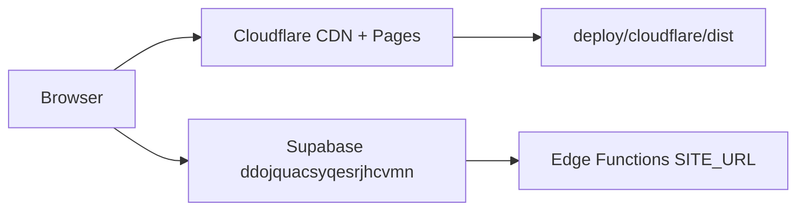

# NB-1A — Cloudflare Pages ホスト実装計画

**作成日:** 2026-06-18  
**種別:** 計画・設定ファイル草案（**DNS 変更・本番デプロイは未実施**）  
**目的:** `https://tasful.jp` を **HTTPS 200** で公開し、[`auth-production-smoke-runbook.md`](auth-production-smoke-runbook.md) **Phase A** を開始可能にする  
**前提:** [`nb1-host-production-readiness.md`](nb1-host-production-readiness.md)（NB-1 FAIL — origin 未到達）· Supabase `ddojquacsyqesrjhcvmn` · `SITE_URL` 方針 `https://tasful.jp`

---

## エグゼクティブサマリ

| 項目 | 推奨 |
|------|------|
| **ホスト** | **Cloudflare Pages**（採用可） |
| **理由** | リポジトリは **静的 MPA**（HTML/CSS/JS）· Vite は dev のみ · TLS/ CDN 一体 · apex CNAME flatten 対応 |
| **ビルド** | **要** — ステージングスクリプトで `deploy/cloudflare/dist/` を生成 |
| **SPA fallback** | **不要** — 各ページが `.html` 直リンク |
| **www → apex** | **Cloudflare Redirect Rule（第一）** + `_redirects` はパス補助のみ |
| **ブロッカー解消** | DNS + 初回デプロイ + `chat-supabase-config.js` 注入 + Supabase Auth `Site URL` + `SITE_URL` Secret |

**今回の成果物:** 本計画書 + `deploy/cloudflare/` 草案（`_redirects` · `_headers` · `stage-cloudflare-pages.mjs`）

---

# 推奨ホスト構成

## Cloudflare Pages 採用可否

| 観点 | 評価 | 備考 |
|------|------|------|
| 静的 MPA 配信 | ✅ 適合 | `index.html` · `talk-home.html` · `builder/` 等をそのまま配信 |
| Node サーバー不要 | ✅ | Supabase / Edge Functions は別ホスト |
| TLS 自動発行 | ✅ | カスタムドメイン追加で Universal SSL |
| apex `tasful.jp` | ✅ | ゾーンを Cloudflare に置けば CNAME flatten / A 自動 |
| シークレット注入 | ✅ | Pages **Environment variables（Encrypted）** + ビルド時生成 |
| ロールバック | ✅ | Deployments 一覧から 1 クリック |
| 代替（Netlify / S3+CF） | 可 | 本リポジトリに deploy 設定なし。CF Pages が最短 |

**結論:** **Cloudflare Pages を第一候補として採用可。**

## アーキテクチャ（案）



| レイヤ | 役割 |
|--------|------|
| **DNS** | `tasful.jp` / `www.tasful.jp` → Cloudflare ゾーン |
| **Pages** | 静的ファイル配信 · ビルド時 `chat-supabase-config.js` 生成 |
| **Redirect Rule** | `www.tasful.jp` → `https://tasful.jp` 301 |
| **Supabase** | Auth · REST · RLS（既存） |
| **Edge Secrets** | `SITE_URL=https://tasful.jp`（Checkout 戻り URL 等） |

## デプロイ対象の整理

| 区分 | 内容 |
|------|------|
| **含める** | ルート `*.html` · `*.css` · `*.js`（auth スタック含む）· `images/` · `builder/` · その他フロント資産 |
| **除外** | `node_modules/` · `reports/` · `scripts/` · `supabase/` · `backups/` · `.env*` · `deploy/`（出力以外）· `package.json` 等 |
| **ビルド生成** | `chat-supabase-config.js`（環境変数から）· `_redirects` · `_headers` |

**根拠:** [`vite.config.js`](../vite.config.js) は `appType: "mpa"` · `publicDir: false` — **本番バンドルは未固定**。`npm run build` は存在しない。Pages では **ステージングコピー + 設定注入** が最小差分。

## build command / output directory

| Cloudflare Pages 設定 | 値 |
|----------------------|-----|
| **Framework preset** | None |
| **Build command** | `node deploy/cloudflare/stage-cloudflare-pages.mjs` |
| **Build output directory** | `deploy/cloudflare/dist` |
| **Root directory** | `/`（リポジトリルート） |
| **Node.js version** | `20`（Environment variables: `NODE_VERSION=20`） |

**ローカル検証（デプロイ前）:**

```powershell
cd C:\Users\rubih\tasufull-article
$env:TASFUL_SUPABASE_URL="https://ddojquacsyqesrjhcvmn.supabase.co"
$env:TASFUL_SUPABASE_ANON_KEY="<anon public key from Dashboard>"
node deploy/cloudflare/stage-cloudflare-pages.mjs
npx --yes serve deploy/cloudflare/dist -p 8788
# http://127.0.0.1:8788/index.html を確認
```

## SPA fallback 要否

| 項目 | 判定 |
|------|------|
| **SPA fallback (`/* /index.html 200`)** | **不要 · 禁止** |
| **理由** | 全画面が `*.html` 直 URL。fallback を入れると存在しないパスが市場トップに化け、Auth Smoke の 404 検知が壊れる |
| **404** | デフォルトの Pages 404 で可。必要なら将来 `404.html` を追加 |

## www → apex 301

| 方式 | 優先 | 設定 |
|------|------|------|
| **Cloudflare Redirect Rule** | **第一推奨** | ゾーン `tasful.jp` → Rules → Redirect Rules: `http.host eq "www.tasful.jp"` → Dynamic `https://tasful.jp${http.request.uri.path}` · **301** |
| **Pages カスタムドメイン** | 併用 | apex `tasful.jp` を Primary · `www.tasful.jp` も Pages に追加（証明書用） |
| **`_redirects`** | 補助 | パス正規化のみ（[`deploy/cloudflare/_redirects`](../deploy/cloudflare/_redirects)）— **ホスト名リダイレクトは Redirect Rule に任せる** |

**Phase A-3 PASS 条件:** `curl -sI https://www.tasful.jp/` → `301/308` → `Location: https://tasful.jp/...`

## キャッシュ方針

| 種別 | Cache-Control | 意図 |
|------|---------------|------|
| `auth-*.js` · `connect-state.js` · `market-identity.js` · `builder-actor-identity.js` | `max-age=0, must-revalidate` | Phase A-6: STEP7 fallback lockdown が即反映 |
| `chat-supabase-config.js` | 同上 | 設定変更を即反映 |
| `*.html` | `max-age=0, must-revalidate` | MPA · デプロイ直後の内容確認 |
| `images/*` | `max-age=86400` | 変更頻度低 · 初回は immutable 付けない |
| その他 `*.css` / `*.js` | 3600s / 300s | バランス型（[`deploy/cloudflare/_headers`](../deploy/cloudflare/_headers)） |

**デプロイ後パージ:** 通常は HTML/ auth JS の短 TTL で足りる。不整合時は Cloudflare Dashboard → **Caching → Purge Everything**（または URL 単位）。

---

# 必要ファイル

## リポジトリに追加した草案（NB-1A）

| ファイル | 役割 |
|----------|------|
| [`deploy/cloudflare/stage-cloudflare-pages.mjs`](../deploy/cloudflare/stage-cloudflare-pages.mjs) | ステージングビルド · `chat-supabase-config.js` 生成 |
| [`deploy/cloudflare/_redirects`](../deploy/cloudflare/_redirects) | パスリダイレクト（草案） |
| [`deploy/cloudflare/_headers`](../deploy/cloudflare/_headers) | セキュリティヘッダ + キャッシュ（草案） |
| 本書 | 実装計画 |

## 実装時に追加推奨（NB-1B 以降 · 今回は未作成）

| ファイル | 役割 |
|----------|------|
| `.github/workflows/deploy-cloudflare-pages.yml` | `main` push → Pages 自動デプロイ |
| `package.json` → `"build:pages"` | `node deploy/cloudflare/stage-cloudflare-pages.mjs` のエイリアス |

## `_redirects`（草案）

配置: ビルド出力ルート。内容は [`deploy/cloudflare/_redirects`](../deploy/cloudflare/_redirects) を参照。

- **含む:** `/builder` → `/builder/` 等のパス正規化
- **含まない:** `www` → apex（Redirect Rule で実施）

## `_headers`（草案）

配置: ビルド出力ルート。内容は [`deploy/cloudflare/_headers`](../deploy/cloudflare/_headers) を参照。

- `X-Content-Type-Options` · `Referrer-Policy` · `Permissions-Policy`
- Auth 関連 JS と HTML は **no long-term cache**

## `chat-supabase-config.js` 本番配置方法

| 項目 | 方針 |
|------|------|
| **Git** | 本番 anon key を **commit しない**（[`chat-supabase-config.example.js`](../chat-supabase-config.example.js) はテンプレのみ） |
| **生成** | ビルド時 `stage-cloudflare-pages.mjs` が出力 |
| **Pages 変数** | `TASFUL_SUPABASE_URL` · `TASFUL_SUPABASE_ANON_KEY`（**Encrypted**） |
| **値** | URL: `https://ddojquacsyqesrjhcvmn.supabase.co` · anon: Dashboard → Settings → API → **anon public** |
| **本番で除外** | `currentUserId` · `me` · `?userId=` 用フィールド — [`auth-current-user.js`](../auth-current-user.js) が本番 host で fallback 禁止 |
| **TURN / VAPID** | Auth Smoke Phase A 範囲外。必要時は別変数で `TASU_TALK_CALL_CONFIG` を拡張 |

---

# DNS設定

**⚠️ 本計画段階では実施しない。** 手順のみ記載。

## 前提

1. ドメイン `tasful.jp` のレジストラで **ネームサーバーを Cloudflare に変更**
2. Cloudflare アカウントにゾーン `tasful.jp` を追加

## レコード案

| 名前 | タイプ | 内容 | Proxy |
|------|--------|------|-------|
| `@`（apex） | **CNAME** | `<project-name>.pages.dev` | Proxied（オレンジ雲） |
| `www` | **CNAME** | `<project-name>.pages.dev` | Proxied |

> apex に CNAME を置くにはゾーンが Cloudflare 上にある必要あり（CNAME flattening）。

## Pages カスタムドメイン

1. Workers & Pages → 対象プロジェクト → **Custom domains**
2. `tasful.jp` を追加（Primary）
3. `www.tasful.jp` を追加
4. SSL: **Full** または **Full (strict)**（Pages オリジンは CF 管理のため通常 Full で可）
5. **Redirect Rule** で www → apex（上記）

## 切替手順（運用）

1. 切替 **48h 前:** TTL を **300s** に下げる（レジストラ側で可能な場合）
2. ネームサーバー変更 → 伝播待ち（`nslookup tasful.jp` で CF NS を確認）
3. Pages 初回デプロイ **成功** を `*.pages.dev` で確認してからカスタムドメイン追加
4. `curl -sI https://tasful.jp/` が **200** になるまで Phase A を開始しない

---

# 環境変数/Secret

## Cloudflare Pages（Production）

| 変数名 | 必須 | 例 | 備考 |
|--------|------|-----|------|
| `TASFUL_SUPABASE_URL` | ✅ | `https://ddojquacsyqesrjhcvmn.supabase.co` | Encrypted |
| `TASFUL_SUPABASE_ANON_KEY` | ✅ | `eyJ...` または `sb_publishable_...` | **anon public のみ** · Encrypted |
| `NODE_VERSION` | 推奨 | `20` | ビルド用 |

**禁止:** `service_role` · `sb_secret_*` を Pages に置かない。

## Supabase — `SITE_URL` 反映手順

**タイミング:** `https://tasful.jp` が **200** で開けることを確認した **直後**（Stripe Live は対象外）。

```bash
# プロジェクトリンク済み CLI から（対話承認が必要な環境あり）
supabase secrets set SITE_URL=https://tasful.jp

# 確認（一覧に SITE_URL が表示されること）
supabase secrets list
```

| 項目 | 値 |
|------|-----|
| **Secret 名** | `SITE_URL` |
| **値** | `https://tasful.jp`（**末尾スラッシュなし**） |
| **影響** | `stripe-create-checkout` · `stripe-create-genai-checkout` 等の `resolveSiteOrigin()` フォールバック |
| **注意** | 設定後、ローカル Featured Checkout は referer より `SITE_URL` が優先され戻り先が本番になる — [`stripe-ready-check.md`](stripe-ready-check.md) 参照 |

## Supabase Auth — Site URL 設定手順

**Dashboard:** [Supabase](https://supabase.com/dashboard/project/ddojquacsyqesrjhcvmn/auth/url-configuration)

| 設定項目 | 値 |
|----------|-----|
| **Site URL** | `https://tasful.jp` |
| **Redirect URLs** | `https://tasful.jp/**` |
| | `https://tasful.jp/talk-home.html` |
| | `https://tasful.jp/payment-settings.html` |
| | `https://tasful.jp/builder/index.html` |
| | （OAuth / メールリンクで使うパスを追加） |

**確認（Phase A-4）:** Site URL が `localhost` · ステージング URL のままなら **FAIL**。

**メールテンプレート:** リンクが `{{ .SiteURL }}` 前提なら Site URL 変更で自動追従。カスタム URL があれば個別確認。

---

# デプロイ手順

**⚠️ 本番デプロイは NB-1B で実施。** ここでは手順書のみ。

## 1. Cloudflare Pages プロジェクト作成

1. Dashboard → Workers & Pages → Create → Pages → Connect to Git（推奨）または Direct Upload
2. リポジトリ: `tasufull-article`
3. Production branch: `main`（運用ブランチに合わせる）
4. Build settings:
   - Build command: `node deploy/cloudflare/stage-cloudflare-pages.mjs`
   - Output directory: `deploy/cloudflare/dist`
5. Environment variables（**Production**）に `TASFUL_SUPABASE_*` を設定

## 2. 初回ビルド確認

1. `*.pages.dev` URL で代表ページを開く:
   - `/` · `/talk-home.html` · `/auth-current-user.js`
2. `chat-supabase-config.js` が存在し、URL/anon が正しいこと（DevTools → Sources）
3. ビルドログに `stage-cloudflare-pages OK` 相当の出力

## 3. カスタムドメイン接続

1. Custom domains → `tasful.jp` · `www.tasful.jp`
2. Redirect Rule（www → apex）を有効化
3. SSL ステータス **Active** を待つ

## 4. Supabase 設定

1. Auth Site URL / Redirect URLs（上記）
2. `supabase secrets set SITE_URL=https://tasful.jp`

## 5. Phase A 再検証（デプロイ後）

### DNS / HTTPS（bash）

```bash
dig +short tasful.jp A
dig +short tasful.jp AAAA
curl -sI https://tasful.jp/
curl -sI https://www.tasful.jp/
curl -sI https://tasful.jp/talk-home.html
curl -sI https://tasful.jp/auth-current-user.js
```

### Windows（PowerShell）

```powershell
nslookup tasful.jp
nslookup www.tasful.jp
curl.exe -sI https://tasful.jp/
curl.exe -sI https://www.tasful.jp/
curl.exe -sI https://tasful.jp/talk-home.html
curl.exe -sI https://tasful.jp/auth-current-user.js
```

### 代表 URL 一括（Phase A-5）

```powershell
$urls = @(
  "https://tasful.jp/",
  "https://tasful.jp/talk-home.html",
  "https://tasful.jp/chat-detail.html",
  "https://tasful.jp/payment-settings.html",
  "https://tasful.jp/admin-operations-dashboard.html",
  "https://tasful.jp/builder/index.html",
  "https://tasful.jp/auth-current-user.js"
)
foreach ($u in $urls) {
  $r = curl.exe -sI $u | Select-String -Pattern "^HTTP"
  Write-Host "$u -> $r"
}
```

### DB / RLS probe（origin 独立 · デプロイ前後どちらでも可）

```bash
node scripts/verify-auth-step8b-legacy-rls.mjs
node scripts/verify-auth-step10-review-scores.mjs
```

### キャッシュ確認（Phase A-6）

```powershell
curl.exe -sI https://tasful.jp/auth-current-user.js | Select-String Cache-Control
# 期待: max-age=0 または must-revalidate
```

### Phase A 判定

[`auth-production-smoke-runbook.md`](auth-production-smoke-runbook.md) の A-1〜A-6 をすべて PASS した時点で **Auth Smoke Phase B 開始可**。

---

# rollback手順

| シナリオ | 手順 | 所要 |
|----------|------|------|
| **直近デプロイが不良** | CF Pages → Deployments → 前回成功デプロイ → **Rollback to this deployment** | 数分 |
| **auth JS 回帰** | 同上 + 必要なら Cache Purge | 5〜15 min |
| **DNS 誤設定** | レジストラ/CF で旧レコード復元 · TTL 待ち | 5 min〜48h |
| **`SITE_URL` 誤設定** | `supabase secrets set SITE_URL=https://tasful.jp` 再確認 · 旧値へ戻す必要は通常なし | 即時 |
| **Auth Site URL 誤設定** | Dashboard で Site URL を戻す | 即時 |

**ロールバック後:** Phase A の `curl` + 代表 7 URL を再実行し、**200** を確認してから Smoke 再開。

---

# Auth Smoke開始条件

Phase A **PASS** 後に [`auth-production-smoke-runbook.md`](auth-production-smoke-runbook.md) Phase B へ。

| # | 条件 | 確認方法 |
|---|------|----------|
| 1 | **DNS** apex が解決する | `dig` / `nslookup` |
| 2 | **HTTPS 200** `https://tasful.jp/` | `curl -sI` |
| 3 | **www → apex 301/308** | `curl -sI https://www.tasful.jp/` |
| 4 | **Supabase Auth Site URL** = `https://tasful.jp` | Dashboard |
| 5 | **`SITE_URL` Secret** 投入済 | `supabase secrets list` |
| 6 | **静的配信 7 URL** すべて 200 | Runbook A-5 表 |
| 7 | **`auth-current-user.js` 最新**（キャッシュ） | A-6 · DevTools |
| 8 | **`chat-supabase-config.js`** 本番 URL/anon · **fallback フィールドなし** | Sources タブ |
| 9 | **DB RLS / AUTH-H-1** | probe スクリプト PASS（既存） |
| 10 | **テストユーザー 9 ロール** | Runbook「テストユーザー準備」 |

| 判定 | 条件 |
|------|------|
| **Phase A 開始可** | 上記 1〜8 がデプロイ・設定完了後に PASS |
| **Phase B 開始可** | Phase A 全項目 PASS |
| **NO-GO** | いずれか FAIL · `tasful.jp` で `?talkDev=1` 有効 · fallback 漏洩 |

---

## 実施順序（NB-1A → NB-1B）

```text
[NB-1A] 本計画 + 草案ファイル          ← 今回（完了）
[NB-1B] CF Pages プロジェクト + 初回デプロイ（pages.dev のみ）
[NB-1C] DNS + カスタムドメイン + Redirect Rule
[NB-1D] Supabase Site URL + SITE_URL Secret
[NB-1E] Phase A 再検証 → PASS なら Auth Smoke Phase B
```

---

## 関連ドキュメント

- [`nb1-host-production-readiness.md`](nb1-host-production-readiness.md) — 現状 FAIL 監査
- [`auth-production-smoke-runbook.md`](auth-production-smoke-runbook.md) — Phase A〜E
- [`auth-step10-exec-apply.md`](auth-step10-exec-apply.md) — DB 側適用済
- [`stripe-ready-check.md`](stripe-ready-check.md) — `SITE_URL` 詳細

---

**ステータス:** 計画・草案作成済 · **DNS 変更・本番デプロイは未実施**
