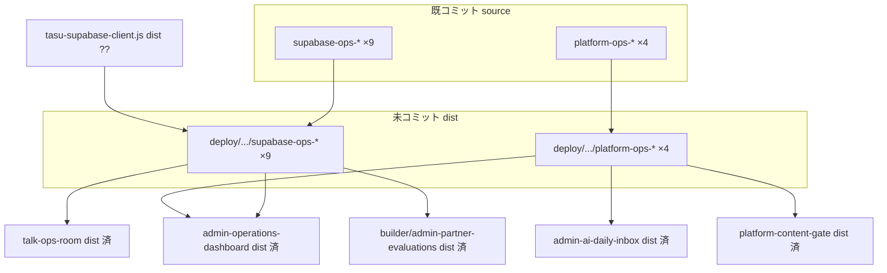

# 共通 OPS（supabase-ops / platform-ops）差分棚卸し（Gateway 完了後）

**実施日:** 2026-06-26  
**HEAD:** `0f6328d` — `build(gateway): sync Pages dist for attachment-aware ai-model-gateway`  
**作業種別:** 調査・分類のみ（コード変更 / stage / commit なし）

---

## 1. git status 概要

| 区分 | 件数 | 備考 |
|------|------|------|
| 全体 `M`（tracked 変更） | **18** | OPS 直結 **0**（tracked diff に ops なし） |
| 全体 `??`（未追跡） | **~85+** | OPS dist **13** · support · Voice · site CSS 等 |
| **supabase-ops source `M`** | **0** | root 9 ファイルは HEAD と一致 |
| **platform-ops source `M`** | **0** | root 4 ファイルは HEAD と一致 |
| **supabase-ops dist `??`** | **9** | すべて初回 dist 同梱 |
| **platform-ops dist `??`** | **4** | すべて初回 dist 同梱 |
| **OPS test/scripts `M`** | **0** | 変更なし |
| **OPS reports `M`** | **0** | 専用レポート未コミット（本ファイルは `??`） |

`git diff --stat` 全体: **18 files, +586 / -506**（OPS ファイルは **tracked diff に含まれない**）

### 直近コミット（Gateway 完了済み）

```
0f6328d build(gateway): sync Pages dist for attachment-aware ai-model-gateway
31476e8 build(secretary): sync Pages dist for ops dashboard and secretary phases
8b15ac4 feat(secretary): complete daily inbox item when ai-ops case resolves
27ecb18 build(tlv): sync Pages dist for live modules and payout assets
```

### OPS source 既コミット（参考）

```
c6df896 feat(platform): NB-1M Content Gate and OPS-FLOW-2 for production FE
         → platform-ops-* 4 ファイル
fd23dba sync site for cloudflare pages deploy
         → supabase-ops-* 9 ファイル（他資産と一括）
```

**結論:** 機能本体は **source 済み**。**未コミットは dist 初回同梱 13 ファイルのみ**（`??`）。

---

## 2. 対象一覧

### 2-1. パターン抽出（`git diff --name-status`）

パターン `supabase-ops|platform-ops|ops-` → **ヒット 0**（tracked 変更に ops なし）

### 2-2. パターン抽出（`git status --short`）

#### B. supabase-ops dist（9件 · すべて `??`）

| パス | 役割 |
|------|------|
| `deploy/cloudflare/dist/supabase-ops-primary-config.js` | Primary source 設定 |
| `deploy/cloudflare/dist/supabase-ops-primary-cache.js` | Primary キャッシュ · `tasu:supabase-ops-primary-synced` |
| `deploy/cloudflare/dist/supabase-ops-read-config.js` | Read 設定 |
| `deploy/cloudflare/dist/supabase-ops-read-adapter.js` | Read アダプタ · `TasuSupabaseOpsRead` · prefetch/merge |
| `deploy/cloudflare/dist/supabase-ops-read-bootstrap.js` | DOMContentLoaded prefetch 起動 |
| `deploy/cloudflare/dist/supabase-ops-data-source-ui.js` | データソースバッジ UI |
| `deploy/cloudflare/dist/supabase-ops-data-source.css` | データソース UI スタイル |
| `deploy/cloudflare/dist/supabase-ops-write-config.js` | Write 設定 |
| `deploy/cloudflare/dist/supabase-ops-write-adapter.js` | Write アダプタ · dual-write |

#### D. platform-ops dist（4件 · すべて `??`）

| パス | 役割 |
|------|------|
| `deploy/cloudflare/dist/platform-ops-action-url.js` | Content Gate / 案件 / support への深いリンク URL 生成 |
| `deploy/cloudflare/dist/platform-ops-inbox-bridge.js` | Platform モデレーション信号 → AI秘書 Daily Inbox |
| `deploy/cloudflare/dist/platform-ops-content-review.js` | Content Gate レビュー操作 |
| `deploy/cloudflare/dist/platform-ops-chat-report-bridge.js` | チャット通報 → `TasuAiOpsCaseStore` + inbox イベント |

### 2-3. dist 限定パターン（`git diff --name-status -- deploy/cloudflare/dist`）

→ **ヒット 0**（ops は `??` のため `git diff` に出ない）

### 2-4. root ↔ dist 一致検証

13 ファイルすべて **root と dist がバイト一致**（サンプル全件 + 一括比較済み）。

---

## 3. 分類表

### A. supabase-ops source（0件 · 変更なし）

| ファイル | 最終コミット |
|----------|--------------|
| `supabase-ops-*.js` ×8 + `.css` ×1 | `fd23dba` 等 |

`git diff HEAD -- supabase-ops-*` → **空**

### B. supabase-ops dist（9件）

上記 2-2 参照。すべて `??`。

### C. platform-ops source（0件 · 変更なし）

| ファイル | 最終コミット |
|----------|--------------|
| `platform-ops-action-url.js` | `c6df896` |
| `platform-ops-inbox-bridge.js` | `c6df896` |
| `platform-ops-content-review.js` | `c6df896` |
| `platform-ops-chat-report-bridge.js` | `c6df896` |

`git diff HEAD -- platform-ops-*` → **空**

### D. platform-ops dist（4件）

上記 2-2 参照。すべて `??`。

### E. test/scripts（0件 · 未コミット変更なし）

| ファイル | 状態 | 用途 |
|----------|------|------|
| `scripts/test-platform-ops-flow-2.mjs` | 追跡済み · クリーン | platform-ops 静的結線検証 |
| `scripts/smoke-platform-ops-flow-2-browser.mjs` | 追跡済み · クリーン | Content Gate / Inbox Playwright |
| `scripts/test-supabase-phase2-read-poc.mjs` | 追跡済み | supabase-ops read POC |
| `scripts/test-supabase-phase3-dual-write.mjs` | 追跡済み | write dual-write |
| `scripts/test-supabase-phase5-update-dual-write.mjs` | 追跡済み | update dual-write |
| `scripts/test-supabase-phase6-primary-source.mjs` | 追跡済み | primary source / prefetch |

### F. reports（0件 · OPS コミット対象外）

| ファイル | 状態 | 備考 |
|----------|------|------|
| `reports/platform-nb1m-frontend-prod-deploy-ready.md` | M | Platform デプロイ準備（ops 言及あり · コード外） |
| `reports/auth-step3-ops-guard.md` | 追跡済み | 認証ガード設計（参考） |
| `reports/platform-ops-flow-2-browser.json` | smoke 出力先 | テスト生成物 |

### G. Voice 依存（0件）

`supabase-ops-*` · `platform-ops-*` 内に `voice` / `Voice` 参照 **なし**。

### H. support 依存（論理結合あり · dist 同梱は不要）

| 結合 | 内容 | OPS コミットへの影響 |
|------|------|----------------------|
| `supabase-ops-read-adapter.js` | `support_tickets` / `support_events` テーブル read | データモデル参照のみ · support dist 不要 |
| `platform-ops-action-url.js` | `support-trouble-center.html` への URL 文字列 | support ページ未デプロイ時はリンク先 404 のみ |
| `platform-ops-chat-report-bridge.js` | `TasuAiOpsCaseStore`（秘書系 · 既コミット） | secretary dist 済み · support モジュール不要 |

**判定:** support **dist を OPS コミットに混ぜない**（別トラック）。ランタイム統合は既存 HTML/JS 契約上想定内。

### I. 判断不能（0件）

13 ファイルすべて分類確定。

---

## 4. 必須確認

| 確認対象 | 結果 |
|----------|------|
| **supabase-ops-\*** | source 9 · dist 9 · read/write/primary/cache/bootstrap/UI 一式 |
| **platform-ops-\*** | source 4 · dist 4 · inbox bridge / content review / action URL / chat report |
| **ops bridge** | `platform-ops-inbox-bridge.js` · `platform-ops-chat-report-bridge.js` |
| **ops api** | Edge 直接呼び出しなし · `TasuSupabase` クライアント経由（`tasu-supabase-client.js`） |
| **ops adapters** | `supabase-ops-read-adapter.js` · `supabase-ops-write-adapter.js` |
| **ops helper** | `supabase-ops-primary-cache.js` · `supabase-ops-data-source-ui.js` |
| **dashboard loader** | `admin-operations-dashboard.html` L611–631 で全 ops スクリプト読込（**dashboard dist は `31476e8` 済み**） |
| **共通読込イベント** | `tasu:supabase-ops-read-hydrated` · `tasu:supabase-ops-primary-synced` |
| **Platform 依存** | `platform-ops-*` は Content Gate / NB-1M 専用 · Platform 本体 HTML は別コミット済み |
| **Talk 依存** | `talk-ops-room.html` が supabase-ops 9 件読込（Talk dist `b655014` 済み） |
| **AI秘書 依存** | dashboard + `admin-ai-daily-inbox.js` が platform-ops bridge 先（秘書 dist `31476e8` 済み） |
| **ANPI 依存** | **なし**（anpi HTML/JS に ops 読込なし） |
| **Builder 依存** | `builder/admin-partner-evaluations.html` が supabase-ops 9 件読込（Builder dist 済み） |
| **TLV 依存** | **なし**（`live/**` に ops 参照なし） |
| **Gateway 依存** | **なし** |

### 読込側（既コミット · dist 同期済みトラック）

```
admin-operations-dashboard.html  → supabase-ops×9 + platform-ops×4  (secretary dist 済)
talk-ops-room.html               → supabase-ops×9                    (talk dist 済)
builder/admin-partner-evaluations.html → supabase-ops×9             (builder dist 済)
support-trouble-center.html      → supabase-ops×9                    (support 未コミット · 別トラック)
admin-ai-operations-center.html  → supabase-ops×9                    (root のみ追跡 · center dist 要確認)
```

### ランタイム前提（OPS コミット範囲外 · 注意）

| ファイル | dist 状態 | 備考 |
|----------|-----------|------|
| `tasu-supabase-client.js` | `??` | ops の `TasuSupabase.getClient()` 前提 |
| `chat-supabase-config.js` | `??` | **ビルド生成** · `stage-cloudflare-pages.mjs` EXCLUDE · **コミット禁止** |
| CDN `@supabase/supabase-js@2` | 外部 | HTML から CDN 読込 |

Pages 本番で ops を動かすには **`tasu-supabase-client.js` dist** も別途必要（ops 単独コミット後も config はビルドで生成）。

---

## 5. Go / No-Go

| 判定 | 結果 | 理由 |
|------|------|------|
| **source だけ切れるか** | **N/A（済）** | `fd23dba` / `c6df896` で root コミット済み |
| **dist だけか** | **Yes** | 未コミットは dist `??` 13 件のみ |
| **共通基盤として単独コミット可能か** | **Yes** | 13 ファイルで完結 · 他トラック diff なし |
| **Voice 依存ありか** | **No** | |
| **support 依存ありか** | **論理のみ** | support dist を同梱しなければ **単独コミット可** |

**No-Go 条件:** `tasu-supabase-client.js` · `support-*` · `voice-settings.*` · `chat-supabase-config.js` を stage しないこと。

**リスク:** dashboard dist は ops JS を参照するが ops dist 未デプロイ → Pages 上で **404**（`31476e8` 以降の既知ギャップ）。本コミットで解消。

---

## 6. 除外一覧

| パス | 理由 |
|------|------|
| `deploy/cloudflare/dist/tasu-supabase-client.js` | supabase クライアント（隣接 · 別コミット推奨） |
| `deploy/cloudflare/dist/chat-supabase-config.js` | ビルド生成（AD/stage スクリプト EXCLUDE） |
| `deploy/cloudflare/dist/supabase-client.js` | 汎用クライアント（ops 範囲外） |
| `deploy/cloudflare/dist/supabase-public-key.js` | 公開鍵ヘルパ（ops 範囲外） |
| `deploy/cloudflare/dist/support-*` | support トラック |
| `deploy/cloudflare/dist/voice-settings.*` | Voice トラック |
| `deploy/cloudflare/dist/live/tlv-feature-flags.js` | TLV ビルド生成 |
| `reports/**` · `scripts/tmp-*` | レポート / テストアーティファクト |
| root `supabase-ops-*` / `platform-ops-*` | 差分なし（二重コミット不要） |

---

## 7. 依存関係



- **横断:** Builder / Talk / AI秘書 dashboard は **読込のみ**（各トラック dist 済み）
- **縦:** supabase-ops は read/write · platform-ops はモデレーション → inbox ブリッジ
- **ANPI / TLV / Gateway:** 無関係

---

## 8. 推奨コミット単位

### Commit 1（OPS dist のみ · 推奨）

```
build(ops): sync Pages dist for supabase-ops and platform-ops common modules
```

**stage 対象（13 ファイル）:**

```
deploy/cloudflare/dist/supabase-ops-data-source-ui.js
deploy/cloudflare/dist/supabase-ops-data-source.css
deploy/cloudflare/dist/supabase-ops-primary-cache.js
deploy/cloudflare/dist/supabase-ops-primary-config.js
deploy/cloudflare/dist/supabase-ops-read-adapter.js
deploy/cloudflare/dist/supabase-ops-read-bootstrap.js
deploy/cloudflare/dist/supabase-ops-read-config.js
deploy/cloudflare/dist/supabase-ops-write-adapter.js
deploy/cloudflare/dist/supabase-ops-write-config.js
deploy/cloudflare/dist/platform-ops-action-url.js
deploy/cloudflare/dist/platform-ops-chat-report-bridge.js
deploy/cloudflare/dist/platform-ops-content-review.js
deploy/cloudflare/dist/platform-ops-inbox-bridge.js
```

**stage 禁止:** `git add -A` · support · Voice · `chat-supabase-config.js`

### 任意 Commit 2（隣接 · ops 稼働に必要）

```
build(supabase): sync Pages dist for tasu-supabase-client
```

→ `deploy/cloudflare/dist/tasu-supabase-client.js` のみ（ops コミットとは分離可だが、Pages 実効性のため直後推奨）

### 分割案（非推奨）

supabase-ops dist 9 + platform-ops dist 4 を別コミットに分けることは可能だが、`admin-operations-dashboard.html` が両方を同時読込するため **1 コミットが自然**。

---

## 9. 推奨テスト

| 優先 | コマンド | 目的 |
|------|----------|------|
| 1 | `node scripts/test-platform-ops-flow-2.mjs` | platform-ops 静的結線 · inbox · content gate |
| 2 | `node scripts/test-supabase-phase6-primary-source.mjs` | supabase-ops read/cache/prefetch |
| 3 | `node scripts/test-supabase-phase3-dual-write.mjs` | write adapter |
| 4 | `node scripts/smoke-platform-ops-flow-2-browser.mjs` | dashboard Content Gate E2E（dev server 要） |
| 5 | `node scripts/test-ops-watch-phase1-browser.mjs` | 秘書 dashboard + ops 連携回帰 |

**コミット前軽量確認:**

```powershell
git status --short | Select-String "supabase-ops|platform-ops"
# 期待: deploy/cloudflare/dist/ 配下 13 件のみ（すべて ??）

# root=dist 一致（任意）
Compare-Object (Get-Content supabase-ops-read-adapter.js -Raw) (Get-Content deploy/cloudflare/dist/supabase-ops-read-adapter.js -Raw)
# 期待: 差分なし
```

---

## 10. 注意点

1. **source は既コミット** — 今回は **dist 初回同梱**のみ。root を stage しない。
2. **`31476e8` dashboard dist** は ops スクリプトを参照済み — ops dist 未同期の間、Pages は ops JS **404** の可能性。
3. **`chat-supabase-config.js`** はビルド生成 · **コミットしない**（`stage-cloudflare-pages.mjs` L40–41）。
4. **`tasu-supabase-client.js` dist** は ops 稼働の実質前提 — ops コミット直後に別コミット推奨。
5. **platform-ops** は AI秘書 inbox / Content Gate と結合 — 秘書 dist は済み · platform-ops dist が不足していた状態。
6. **support-trouble-center** も supabase-ops を読むが、support は **別トラック** — 混在禁止。
7. **Builder / Talk** は supabase-ops のみ使用（platform-ops なし）— ops コミットは横断基盤として妥当。

---

## 11. サマリー（①–⑧）

| # | 項目 | 件数 / 判定 |
|---|------|-------------|
| ① | source 件数 | **0**（supabase 9 + platform 4 = **13 済**） |
| ② | dist 件数 | **13**（supabase 9 + platform 4 · すべて `??`） |
| ③ | test 件数 | **0**（未コミット変更なし · 関連テスト 6+ 本は追跡済み） |
| ④ | reports 件数 | **0**（OPS コミット対象外） |
| ⑤ | 依存関係 | Voice **なし** · support **論理のみ** · secretary/dashboard **読込済** · `tasu-supabase-client` dist **隣接必須** |
| ⑥ | コミット可能範囲 | **`deploy/cloudflare/dist/supabase-ops-*` ×9 + `platform-ops-*` ×4** |
| ⑦ | 推奨テスト | `test-platform-ops-flow-2` → `test-supabase-phase6-primary-source` → `smoke-platform-ops-flow-2-browser` |
| ⑧ | 推奨コミット順 | **OPS dist（13）** → **tasu-supabase-client dist** → support → Voice |

---

*調査のみ実施。コード変更 · stage · commit · push なし。*
