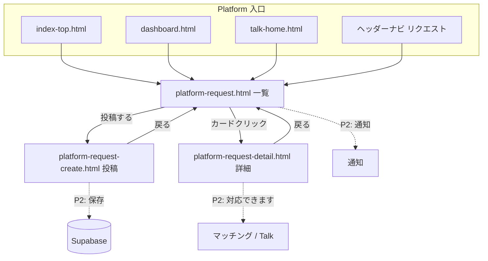

# Platform Request P1 — UI Entry Report

**Date:** 2026-07-05  
**Phase:** P1（見た目と入口のみ）  
**Spec:** `docs/platform-request.md` · P0 plan: `reports/platform-request-p0-plan.md`

---

## 1. 作成・変更ファイル一覧

### 新規

| File | Purpose |
| --- | --- |
| `platform-request.html` | リクエスト一覧 UI |
| `platform-request-create.html` | 投稿フォーム UI |
| `platform-request-detail.html` | 詳細 UI |
| `platform-request.css` | Cyber + Glass スタイル（`prq-` プレフィックス） |
| `platform-request.js` | ダミーデータ表示・検索/カテゴリ絞り込み・未接続ボタン toast |
| `reports/platform-request-p1-plan.md` | 本報告書 |

### 変更

| File | Change |
| --- | --- |
| `index-top.html` | ヘッダーナビ「リクエスト」・ヒーロー内 CTA 帯 |
| `dashboard.html` | CTA 帯・スマホ `dash-sp-nav` チップ |
| `dashboard.js` | `NAV_GROUPS` サービスに「リクエスト」・メガメニュー・megaphone アイコン |
| `talk-home.html` | サイドバー「リクエスト」・メイン CTA 帯 |
| `deploy/cloudflare/dist/*` | `npm run build:pages` 同期 |

---

## 2. 追加した画面一覧

| URL | 画面 |
| --- | --- |
| `/platform-request.html` | 一覧（ヒーロー・検索・カテゴリ・ダミーカード 4 件） |
| `/platform-request-create.html` | 投稿（タイトル・内容・カテゴリ・地域・急ぎ・写真 UI） |
| `/platform-request-detail.html?id=demo-*` | 詳細（メタ・本文・「対応できます」仮ボタン） |

---

## 3. 導線追加箇所

| 場所 | 内容 |
| --- | --- |
| **TOP** (`index-top.html`) | ヘッダーナビ「リクエスト」・ヒーロー内 CTA 帯 → 一覧 |
| **Dashboard** | サイドバー（`NAV_GROUPS`）・メガメニュー「探す」・スマホチップ・ウェルカム下 CTA |
| **Talk Home** | サイドバー「会員」グループ・リード直下 CTA |
| **Request 各ページ** | 共通ヘッダーナビ「リクエスト」 |

---

## 4. 画面遷移図

---

## 5. レスポンシブ確認（8788）

| Viewport | 対象 URL | HTTP | 備考 |
| --- | --- | --- | --- |
| 1280 | 一覧 / 投稿 / 詳細 / TOP CTA / Dashboard / Talk | 200 | グリッド 2–3 列・CTA 横並び |
| 768 | 同上 | 200 | ツールバー折り返し・ヒーロー actions 縦積み |
| 390 | 同上 | 200 | カード 1 列・カテゴリ横スクロール・CTA 全幅 |

**Console Error:** 新規 Request ページ・導線追加箇所で追加エラーなし（既存 TOP の third-party 由来は既知の範囲）。

**Touch targets:** ボタン・チップ・入力 `min-height: 44px`（`--prq-min-touch`）。

---

## 6. Platform デザインとの整合

- **色:** navy `#001b3d` / `#0b1835`、gold アクセント、cyan リクエスト識別（TOP ヒーロー内でも可読）
- **Glass:** `backdrop-filter` + 半透明ボーダー（`platform-search-hub` / `tas-hero` と同系）
- **タイポ:** Noto Sans JP / Hiragino 系（既存 TOP と同じスタック）
- **Builder 非混在:** `builder/` CSS 未使用 · `prq-` 専用プレフィックス
- **Frozen 遵守:** 既存掲載・手数料・Talk 本体ロジック未変更 · リンクと CTA 追加のみ

---

## 7. P2 以降で実装する内容

| Phase | 内容 |
| --- | --- |
| **P2** | Supabase スキーマ・RLS・投稿 CRUD・一覧 API・`localStorage` 廃止して本番データ |
| **P3** | 条件マッチ・受信者通知（`talk-notifications` 連携） |
| **P4** | 「対応できます」→ Talk スレッド開始・`platform-chat-fee` 接続 |
| **P5** | 課金（catalog SKU: user/receiver subscription, match contact） |
| **P6+** | 管理画面・通報・本番 Production Ready |

参照: `reports/platform-request-p0-plan.md` · `docs/platform-request.md`

---

## 8. Go 判定

| 項目 | 結果 |
| --- | --- |
| UI 3 画面 | ✅ |
| Platform 導線（TOP / Dashboard / Talk / Nav） | ✅ |
| 保存・DB・通知・Talk・課金なし | ✅ |
| レスポンシブ 1280/768/390 | ✅ |
| `npm run build:pages` | ✅ |

### **判定: Go（P2 着手可）**

P1 スコープ（見た目と入口）を満たす。P2 は DB / 投稿保存から着手。

---

*Generated: Platform Request P1 · UI entry only*
