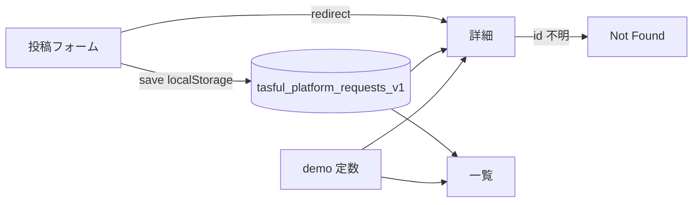

# Platform Request P2 — localStorage Report

**Date:** 2026-07-05  
**Phase:** P2（localStorage · UI 動作）  
**Spec:** `docs/platform-request.md` · P1: `reports/platform-request-p1-plan.md`

---

## 1. 変更ファイル一覧

| File | Change |
| --- | --- |
| `platform-request.js` | localStorage ストア・投稿保存・一覧/詳細連携・バリデーション |
| `platform-request-create.html` | 必須マーク・エラー表示・`area`/`budget` フィールド・文言更新 |
| `platform-request-detail.html` | ステータス/予算表示・Not Found UI |
| `platform-request.css` | バリデーションエラー・ステータスタグ・Not Found |
| `scripts/test-platform-request-p2.mjs` | P2 Playwright 回帰（新規） |
| `deploy/cloudflare/dist/*` | `npm run build:pages` 同期 |

---

## 2. localStorage key

```
tasful_platform_requests_v1
```

グローバル参照: `window.TasuPlatformRequestStore`

---

## 3. 保存データ構造

```json
{
  "id": "prq-1783219506802-e5idnca",
  "title": "string",
  "body": "string",
  "category": "string",
  "area": "string",
  "urgency": "通常 | 急ぎ | 至急",
  "budget": "string (optional)",
  "photos": [{ "id": "mock-photo-…", "name": "request-photo-1.jpg", "addedAt": "ISO8601" }],
  "status": "open | closed | cancelled",
  "createdAt": "ISO8601",
  "updatedAt": "ISO8601"
}
```

- 初期 `status`: `open`
- 配列は新しい投稿が先頭（`unshift`）
- demo 投稿は JS 内定数（`demo-1` 〜）· localStorage とは別管理

---

## 4. 投稿 → 詳細 → 一覧の確認結果（8788）

| Step | Result |
| --- | --- |
| 空投稿 → 画面内エラー 4 件 | PASS |
| 入力投稿 → `platform-request-detail.html?id=prq-…` へ遷移 | PASS |
| 詳細にタイトル・受付中ステータス表示 | PASS |
| 一覧に「自分の投稿」カードが先頭付近に表示 | PASS |
| 存在しない ID → Not Found UI | PASS |

コマンド: `node scripts/test-platform-request-p2.mjs` → **ALL PASS**

---

## 5. バリデーション確認

| Field | Rule | UI |
| --- | --- | --- |
| title | 必須 | `.prq-field__error` + `is-invalid` |
| body | 必須 | 同上 |
| category | 必須 | 同上 |
| area | 必須 | 同上 |
| budget / urgency / photos | 任意 | — |

- `alert` 未使用
- 入力時にエラー自動クリア

---

## 6. レスポンシブ確認（8788）

| Viewport | HTTP | Layout |
| --- | --- | --- |
| 1280 | 200 | PASS |
| 768 | 200 | PASS（CTA/Not Found 縦積み） |
| 390 | 200 | PASS（カード 1 列） |

**Console Error:** P2 テスト対象ページ 0 件

---

## 7. 既存 smoke 結果

```
npm run smoke:pages
→ FAIL: missing TASU_CHAT_SUPABASE_CONFIG on /
```

- **P2 変更起因ではない**（環境・Supabase 設定未注入の既知条件）
- Platform Request P2 専用テストは ALL PASS
- TOP / Dashboard / Talk / Builder へのコード変更なし（Request 領域のみ）

---

## 8. P3 に残す内容

| Item | Phase |
| --- | --- |
| 「対応できます」→ マッチングフロー | P3 |
| 受信者への通知（Talk notifications 連携） | P3 |
| ステータス変更 UI（closed / cancelled 操作） | P3+ |
| 写真の実アップロード | P3+ |
| Supabase / DB / RLS | P5+ |
| Talk 開始・課金 | P4–P5 |

---

## 9. Go 判定

| 項目 | 結果 |
| --- | --- |
| localStorage 投稿・一覧・詳細 | ✅ |
| 投稿後詳細遷移 | ✅ |
| バリデーション（画面内） | ✅ |
| 検索・カテゴリ維持 | ✅ |
| Not Found UI | ✅ |
| レスポンシブ 1280/768/390 | ✅ |
| Supabase/DB 未接続 | ✅ |

### **判定: Go（P3 着手可）**

---

## 画面遷移（P2 更新）



---

*Generated: Platform Request P2 · localStorage only*
