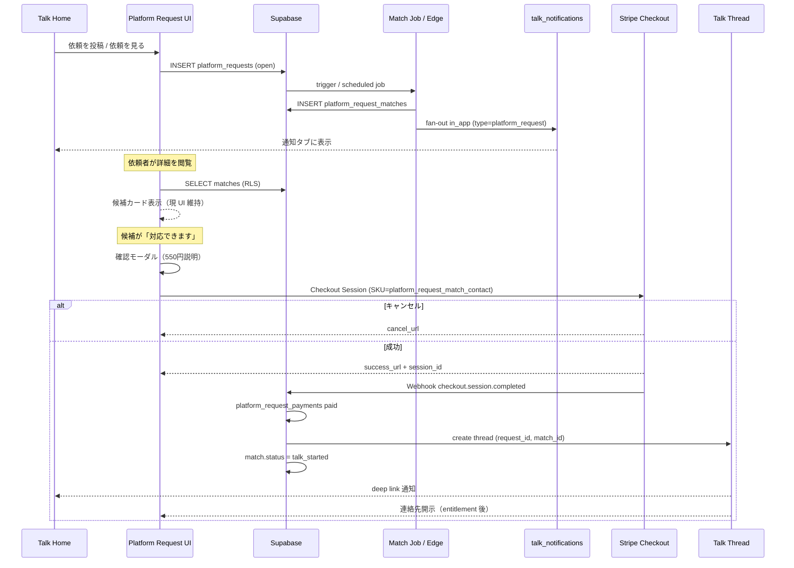

# Platform Request P4.7 — P5 Integration Blueprint

**Date:** 2026-07-05  
**Phase:** P4.7（設計・調査・ドキュメントのみ）  
**Prior:** P4.6 `reports/platform-request-p4.6-navigation.md`  
**SSOT 補足:** [docs/platform-request-p5-integration.md](../docs/platform-request-p5-integration.md)

---

## 0. スコープ宣言

| 区分 | P4.7（本フェーズ） | P5（次フェーズ） |
| --- | --- | --- |
| 成果物 | 本 Blueprint · 接続順 · 検証計画 | Staging 実装 |
| コード | **変更ゼロ** | `platform-request.js` adapter 等 |
| DB / SQL | **作成・適用禁止** | Staging migration のみ |
| Stripe Live | **禁止** | Staging Test mode のみ |
| Cloudflare Production | **禁止** | Preview / 8788 のみ |
| Production Supabase | **10月まで凍結** | 手動 runbook 承認後のみ |

---

## 1. 現状整理（P0〜P4.6）

### 1.1 フェーズ別完成物

| Phase | 状態 | 完成内容 | 主なファイル |
| --- | --- | --- | --- |
| **P0** | ✅ | 仕様正本 · Pricing SKU ×3（draft）· 導線調査 | `docs/platform-request.md` · `tasful-pricing-catalog.json` |
| **P1** | ✅ | UI 入口 · 3 ページ · CTA/nav | `platform-request*.html` · `index-top` / `dashboard` / `talk-home` |
| **P2** | ✅ | localStorage 永続化 · 投稿→詳細→一覧 | `tasful_platform_requests_v1` · `Store` API |
| **P3** | ✅ | 候補マッチ UI · デモ/ローカル候補 · スコアリング | `matchCandidates` · `DEMO_CANDIDATES` |
| **P4** | ✅ | 550円確認モーダル（仮）· ステータス local 更新 | `openRespondModal` · `DISCLOSURE_FEE_YEN=550` |
| **P4.5** | ✅ | 商用品質 UI（カード・Empty・a11y） | CSS/HTML polish |
| **P4.6** | ✅ | Talk Home メイン入口 · パンくず · 成功バナー | 導線のみ |

### 1.2 現在のランタイム契約（P5 まで維持）

| 項目 | 現状 |
| --- | --- |
| 依頼データ LS | `tasful_platform_requests_v1` — 配列 · フィールド固定（P2 報告書参照） |
| 候補データ LS | `tasful_platform_request_candidates_v1`（任意） |
| UI 専用 LS | `tasful_platform_request_posted_banner_v1`（成功バナー表示済み ID） |
| 公開 API | `window.TasuPlatformRequestStore` · `TasuPlatformRequestMatcher` · `TasuPlatformRequestCandidates` · `TasuPlatformRequestFee` |
| 課金 SKU（catalog） | `platform_request_match_contact` ¥550 · `platform_request_user_subscription` · `platform_request_receiver_subscription`（いずれも draft / enabled:false） |
| 認証 | **未接続** — 投稿者は匿名表示 · RLS 前提は `auth.uid()` |
| 通知 | toast のみ（「P5 以降で接続予定」） |
| Talk | モーダル仮導線のみ · スレッド作成なし |
| Stripe | 表示のみ · 決済なし |

### 1.3 P5 で置き換える部分

| 領域 | 現状（仮） | P5 目標 |
| --- | --- | --- |
| **依頼 CRUD** | `localStorage` のみ | Supabase `platform_requests` が正本 · LS はキャッシュ/移行用 |
| **候補ソース** | `DEMO_CANDIDATES` + 任意 LS | listings / profiles / receiver サブスク + サーバー側マッチ |
| **マッチ結果** | クライアント `matchCandidates()` | DB `platform_request_matches` + Edge または RPC で fan-out |
| **通知** | なし | `talk_notifications` type=`platform_request` · fan-out キュー |
| **550円** | モーダル + toast | Stripe Checkout（Staging Test）→ Webhook → entitlement |
| **Talk 開始** | なし | 決済成功後にスレッド作成 · deep link |
| **ステータス** | open/closed/cancelled（local のみ） | DB 正本 + P0 状態モデルへ段階拡張（matched / in_talk / expired） |

### 1.4 そのまま流用できる部分

| 資産 | 流用方針 |
| --- | --- |
| **UI 一式** | `platform-request.html` / `create` / `detail` / `platform-request.css` — Store を adapter 化して裏側だけ差し替え |
| **`matchCandidates` ロジック** | スコアリング・理由チップ生成をサーバー側へ移植する **参照実装**（アルゴリズム変更は別 ADR） |
| **P2〜P4 Playwright** | 回帰の土台 · P5 用に Staging モード分岐を追加 |
| **`platform-chat-fee.js` / `platform-chat-fee-pay.html`** | 550円 Checkout UI パターン · SKU 分岐追加 |
| **`talk-notifications-store.js`** | `VALID_TYPES` に `platform_request` 追加 · `enqueueNotification` 再利用 |
| **`TasuPricingRuntime`** | `platform_request_match_contact` 参照（catalog SSOT） |
| **導線（P4.6）** | Talk Home 入口 · パンくず · 成功バナー — 変更不要 |
| **Pricing catalog** | SKU 3 件は登録済み · Staging で `stripePriceEnvKey` 追加のみ |

---

## 2. Supabase 設計（テーブル案 · SQL 禁止）

> **環境:** Staging `ahlxuyvhzqdqaojiywmu` のみ。Production `ddojquacsyqesrjhcvmn` は **2026年10月まで migration 禁止**。

### 2.1 テーブル一覧と責務

```text
platform_requests          … 依頼投稿の正本
platform_request_matches   … 依頼×受信者のマッチ・反応・Talk 接続状態
platform_request_notifications … 通知 fan-out キュー（送信前/送信済み）
platform_request_payments  … 550円都度課金の idempotent 台帳（任意: 既存 payment テーブル統合も可）
platform_request_subscriptions … 投稿/受信サブスク entitlement（P5 後半 or P6）
```

### 2.2 `platform_requests`

| カラム（案） | 型（案） | 責務 |
| --- | --- | --- |
| `id` | uuid | **PK** · サーバー発行 |
| `public_id` | text unique | 外部 URL 用（例: `prq-{uuid}` または ULID）· LS 移行 ID との対応 |
| `user_id` | uuid | **FK → auth.users** · 投稿者 |
| `title` | text | 依頼タイトル（現 LS 互換 · 80 字上限） |
| `body` | text | 依頼本文 |
| `category` | text | カテゴリ（現 select 値） |
| `area` | text | 地域文字列（将来 `prefecture` + `radius_km` へ正規化可） |
| `urgency` | text | `通常` / `急ぎ` / `至急` |
| `budget` | text nullable | 任意予算感 |
| `photos` | jsonb | 写真メタ配列（P5 初版は URL 参照 or 空配列） |
| `status` | text | `open` / `closed` / `cancelled`（P5 初版）→ 将来 `matched` / `in_talk` / `expired` |
| `expires_at` | timestamptz nullable | 有効期限（将来 · 初版は created + 7日で算出でも可） |
| `source` | text | `user` / `migrated_local` / `demo` |
| `legacy_local_id` | text nullable | LS 移行元 `prq-*`（重複投稿防止） |
| `created_at` | timestamptz | 作成 |
| `updated_at` | timestamptz | 更新 |

**更新タイミング**

| 操作 | タイミング |
| --- | --- |
| INSERT | 投稿フォーム送信（認証済み） |
| UPDATE status | 依頼者が終了/キャンセル · 期限切れバッチ |
| UPDATE matched 系 | 初回候補反応時（P5+） |

### 2.3 `platform_request_matches`

| カラム（案） | 型（案） | 責務 |
| --- | --- | --- |
| `id` | uuid | **PK** |
| `request_id` | uuid | **FK → platform_requests** |
| `receiver_user_id` | uuid | **FK → auth.users** · 候補者（業者/ワーカー） |
| `receiver_listing_id` | uuid nullable | **FK → listings** · マッチ元掲載 |
| `match_score` | numeric | クライアント `matchCandidates` 相当 |
| `match_reasons` | jsonb | 理由チップ配列（`カテゴリ一致` 等） |
| `status` | text | `suggested` / `notified` / `responded` / `payment_pending` / `talk_started` / `declined` |
| `notified_at` | timestamptz nullable | 通知送信完了 |
| `responded_at` | timestamptz nullable | 「対応できます」押下 |
| `payment_id` | uuid nullable | **FK → platform_request_payments** |
| `talk_thread_id` | text nullable | Talk スレッド参照（既存 Talk ID 体系に合わせる） |
| `created_at` | timestamptz | マッチ生成 |

**更新タイミング:** マッチジョブ生成 → 通知後 `notified` → 候補 CTA → `responded` → 決済 → `talk_started`

### 2.4 `platform_request_notifications`

| カラム（案） | 型（案） | 責務 |
| --- | --- | --- |
| `id` | uuid | **PK** |
| `request_id` | uuid | **FK** |
| `match_id` | uuid nullable | **FK** · 個別マッチ通知時 |
| `recipient_user_id` | uuid | 受信者 |
| `channel` | text | `in_app` / `email` / `push`（P5 は `in_app` のみ） |
| `payload` | jsonb | タイトル・本文・deep link |
| `status` | text | `pending` / `sent` / `failed` / `skipped` |
| `idempotency_key` | text unique | `request_id:recipient:channel` で重複防止 |
| `scheduled_at` | timestamptz | 送信予定 |
| `sent_at` | timestamptz nullable | 送信完了 |

**責務:** Edge / Worker が fan-out · `talk_notifications` への橋渡し前の durable キュー

### 2.5 `platform_request_payments`（都度 550円）

| カラム（案） | 型（案） | 責務 |
| --- | --- | --- |
| `id` | uuid | **PK** |
| `match_id` | uuid | **FK → platform_request_matches** |
| `payer_user_id` | uuid | 支払者（通常は候補者 = initiator） |
| `catalog_sku` | text | `platform_request_match_contact` |
| `amount_yen` | int | 550 |
| `stripe_checkout_session_id` | text unique nullable | Checkout 参照 |
| `stripe_payment_intent_id` | text nullable | 決済参照 |
| `status` | text | `pending` / `paid` / `cancelled` / `refunded` |
| `paid_at` | timestamptz nullable | Webhook 適用時刻 |
| `metadata` | jsonb | request_id · candidate_name 等 |

**代替案:** TLV の `payment_provider_events` パターンを Platform 用に拡張し、専用テーブルを省略（ADR で選択）

### 2.6 `platform_request_subscriptions`（P6 寄り · 設計先行）

| カラム（案） | 型（案） | 責務 |
| --- | --- | --- |
| `user_id` + `role` | composite PK | `poster` / `receiver` |
| `catalog_sku` | text | subscription SKU |
| `stripe_subscription_id` | text | Stripe 参照 |
| `status` | text | `active` / `past_due` / `cancelled` |
| `current_period_end` | timestamptz | 有効期限 |

---

## 3. RLS 設計（方針のみ · 実装禁止）

### 3.1 原則

- 全テーブル **RLS ON**
- クライアント直書きは最小限 · 決済確定・fan-out は **service_role Edge** のみ
- demo 行は Staging seed · Production では非表示

### 3.2 `platform_requests`

| ロール | SELECT | INSERT | UPDATE |
| --- | --- | --- | --- |
| **投稿者（owner）** | 自分の行 | `user_id = auth.uid()` | `status` のみ（open→closed/cancelled）· 本文は open 中のみ |
| **認証ユーザー（公開一覧）** | `status = open` のみ · 自分の行は全ステータス | — | — |
| **マッチ済み受信者** | match 経由で **自分に関連する依頼** の限定列（title/body/area） | — | — |
| **匿名** | 不可（一覧は認証必須にするか、公開 demo のみ別 view） | — | — |

### 3.3 `platform_request_matches`

| ロール | 操作 |
| --- | --- |
| **依頼者** | 自分の request に紐づく match 一覧（候補名・スコア・status） |
| **受信者** | 自分が `receiver_user_id` の行のみ SELECT · `responded` 更新 |
| **service_role** | INSERT（マッチジョブ）· 全 status 更新 |

### 3.4 通知・決済テーブル

| テーブル | 方針 |
| --- | --- |
| `platform_request_notifications` | recipient のみ SELECT · INSERT/UPDATE は Edge |
| `platform_request_payments` | payer のみ SELECT 自分の行 · 書き込みは Edge + Webhook |

---

## 4. Talk 連携フロー（実装禁止 · 設計のみ）



### 4.1 既存資産への接続点

| ステップ | 接続先（調査済み） |
| --- | --- |
| 通知表示 | `talk-notifications-store.js` · `talk-home.html` 通知タブ |
| type 追加 | `TasuTalkCategory.NOTIFICATION_TYPE_KEYS` + `platform_request` |
| 550円 UI | `platform-chat-fee-pay.html` / `platform-chat-fee-pay.js` パターン |
| SKU 参照 | `TasuPricingRuntime` · `platform_request_match_contact` |
| Talk スレッド | 既存 inquiry/chat 作成フロー（`platform-chat-live-flow.js` 等）を **Request 専用 metadata** で分岐 |
| deep link | `talk-home.html?tab=notifications` + `request_id` / `match_id` query |

### 4.2 P5 初版のスコープ切り

| 含む | 含まない（P6+） |
| --- | --- |
| 決済成功 → Talk スレッド 1 件作成 | 双方向複数スレッド |
| in_app 通知 | Email / Push 実送信 |
| 連絡先開示フラグ（DB） | 電話番号自動マスク解除 UI の本番化 |

---

## 5. Stripe 550円フロー（文章 · コード禁止）

### 5.1 前提

- **SKU:** `platform_request_match_contact` · ¥550 · `billingType: fixed`
- **環境:** Staging のみ · **Test mode** · Live key **禁止**
- **参照実装:** `listing-featured.js` + `supabase/functions/stripe-create-checkout` · `platform-chat-fee-pay.js`

### 5.2 Checkout 開始

1. 候補が詳細画面で「対応できます」→ 確認モーダル（現 P4 UI）
2. 「進む」押下 → クライアントが Edge `platform-request-create-checkout`（新規・P5）を呼ぶ
3. リクエスト body: `match_id` · `request_id` · `catalog_sku` · `success_url` · `cancel_url`
4. Edge: 認証 JWT 検証 · match の ownership · 重複決済チェック（idempotency）
5. Stripe `checkout.sessions.create` mode=`payment` · metadata に `match_id` · `request_id` · `sku`
6. クライアント redirect → Stripe Hosted Checkout

### 5.3 成功

1. `success_url` に `session_id` 付与（`platform-chat-fee-pay` と同様 `fee_checkout=success`）
2. クライアントが `platform-request-confirm-checkout`（新規・P5）を呼び、状態確認
3. **並行:** Stripe Webhook `checkout.session.completed`
4. Webhook handler: 署名検証 → `platform_request_payments.status = paid` → `match.status = payment_pending → talk_started`
5. Talk スレッド作成ジョブ enqueue
6. UI: 詳細 or Talk Home へ遷移 · toast「Talk を開始しました」

### 5.4 キャンセル

1. `cancel_url` → `fee_checkout=cancelled`
2. payment 行は `cancelled` or 未作成のまま
3. match は `responded` のまま · 再試行可能（同一 match で session 再発行 · 古い session は無効化）

### 5.5 Webhook

| 項目 | 方針 |
| --- | --- |
| エンドポイント | Staging Supabase Edge `stripe-webhook` 拡張 or 専用 `platform-request-stripe-webhook` |
| イベント | `checkout.session.completed` · 将来 `charge.refunded` |
| 冪等性 | `stripe_checkout_session_id` UNIQUE · `payment_provider_events` 相当の event log |
| 失敗時 | DLQ ログ · 手動 reconcile runbook · UI は「処理中」表示 |

---

## 6. 通知設計（送信実装禁止）

### 6.1 チャネル優先順（P0 仕様踏襲）

1. **In-app（Talk）** — P5 必須
2. **Web Push** — P7
3. **Email** — P7
4. **SMS** — 将来

### 6.2 呼び出しポイント

| イベント | 処理場所（案） | 通知内容 |
| --- | --- | --- |
| 依頼投稿 `open` | Edge: post-insert hook | 受信者へ「新しい依頼が届きました」 |
| マッチ生成 | Match job | `platform_request_notifications` INSERT |
| fan-out 完了 | Notification worker | `talk-notifications-store.enqueueNotification` 相当をサーバーから |
| 候補が対応 | DB update `responded` | 依頼者へ「候補が対応可能です」 |
| 決済完了 | Webhook 後 | 双方へ「Talk が開始されました」 |
| 依頼終了 | status `closed` | 未反応マッチへ「依頼が終了しました」（任意） |

### 6.3 既存モジュール

- `talk-notifications-store.js` — `VALID_TYPES` · `FANOUT_KEY` · Supabase `talk_notifications`
- `talk-platform-notify.js` — Platform 連携ラッパ
- `talk-home.js` — 通知タブ UI · フィルタ

**P5 作業:** type `platform_request` 追加 · payload schema 定義 · Staging E2E

---

## 7. localStorage 移行（互換性維持）

### 7.1 方針: Adapter パターン（破壊的変更なし）

```text
現 UI / テスト
    ↓
TasuPlatformRequestStore（公開 API 維持）
    ↓
PlatformRequestStoreAdapter（P5 新規）
    ├─ mode=local      … 現行 LS のみ（オフライン・未ログイン）
    ├─ mode=supabase   … DB 正本
    └─ mode=dual       … 移行期間（書き込み両方・読み取りは DB 優先）
```

### 7.2 フィールドマッピング

| LS フィールド | DB カラム |
| --- | --- |
| `id` (`prq-*`) | `legacy_local_id` + 新 `public_id` |
| `title` | `title` |
| `body` | `body` |
| `category` | `category` |
| `area` | `area` |
| `urgency` | `urgency` |
| `budget` | `budget` |
| `photos` | `photos` jsonb |
| `status` | `status` |
| `createdAt` | `created_at` |
| `updatedAt` | `updated_at` |

### 7.3 移行手順（P5 実装時）

1. **ログイン後初回:** 「この端末の依頼を同期しますか？」（任意 UI）
2. LS 配列を走査 → `legacy_local_id` で UPSERT（重複スキップ）
3. 成功した行に `migrated: true` フラグを LS 側に付与（**既存配列構造は不変** · 要素に optional field 追加のみ）
4. `dual` モード終了後も LS は read-only キャッシュとして残せる
5. demo 行（`demo-*`）は移行対象外 · 引き続き JS 定数

### 7.4 テスト互換

- `scripts/test-platform-request-p2.mjs` 等は **local モード** で継続 PASS
- P5 用 `test-platform-request-p5-staging.mjs` を新規追加（認証 fixture · Staging URL）

---

## 8. P5 接続順（推奨）

| Step | 内容 | 依存 | 検証 |
| --- | --- | --- | --- |
| **P5-1** | Staging DDL migration + RLS 草案レビュー | 本 Blueprint 承認 | `database-agent` review · MCP read-only 確認 |
| **P5-2** | `PlatformRequestStoreAdapter` · 認証ゲート | P5-1 | P2 回帰 PASS（local モード） |
| **P5-3** | 投稿/一覧/詳細を Supabase 読み書き（dual） | P5-2 | Staging 手動 + Playwright |
| **P5-4** | サーバー側マッチジョブ + `platform_request_matches` | P5-3 · listings メタ | P3 相当 UI が DB 候補を表示 |
| **P5-5** | in_app 通知 fan-out | P5-4 · talk_notifications | Talk Home 通知タブ |
| **P5-6** | Stripe Checkout + Webhook（550円） | P5-4 | Test card · idempotency |
| **P5-7** | Talk スレッド作成 + deep link | P5-6 | E2E: モーダル→決済→Talk |
| **P5-8** | LS 移行 UI + dual→supabase 切替 | P5-3〜7 | 移行テスト |
| **P6** | 投稿/受信サブスク（Stripe Subscription） | P5 安定 | entitlement ゲート |

---

## 9. テスト計画（P5）

### 9.1 Staging 検証

| # | シナリオ | 環境 |
| --- | --- | --- |
| S1 | 認証ユーザーが依頼投稿 → DB 行確認 | Staging Supabase Dashboard / MCP SELECT |
| S2 | 別ユーザーで RLS 拒否確認（他人の draft） | Staging |
| S3 | マッチ生成 → notifications pending | Staging |
| S4 | Stripe Test 決済 550円 → payment paid | Staging + Test mode |
| S5 | Webhook 冪等（同一 session 2 回） | Staging |
| S6 | Talk スレッド作成後 deep link | 8788 + Staging |

### 9.2 Playwright

| スクリプト | 用途 |
| --- | --- |
| `test-platform-request-p2.mjs` | local 回帰（**継続必須**） |
| `test-platform-request-p3.mjs` | マッチ UI 回帰 |
| `test-platform-request-p4.mjs` | モーダル・550 表示 |
| `test-platform-request-p5-staging.mjs`（新規） | 認証 mock / Staging flag · 投稿→DB→通知 |
| `test-platform-request-p5-checkout-staging.mjs`（新規） | Stripe test redirect（skip if no keys） |

### 9.3 Smoke / 回帰

```bash
npm run build:pages
npm run dev   # 8788
node scripts/test-platform-request-p2.mjs
node scripts/test-platform-request-p3.mjs
node scripts/test-platform-request-p4.mjs
node scripts/test-platform-request-p5-staging.mjs   # P5 追加後
npm run smoke:pages   # 全体退行なし
```

### 9.4 完了ゲート（P5 Go）

- [ ] Staging migration 適用済み（Production **未**適用）
- [ ] RLS ポリシーレビュー PASS（security-agent）
- [ ] P2〜P4 回帰 PASS（local モード）
- [ ] P5 Staging E2E PASS
- [ ] Console Error 0（8788）
- [ ] Stripe **Live** 未使用証跡
- [ ] Production deploy / SQL **未**実行

---

## 10. Production 凍結（10月まで）

| 項目 | 方針 |
| --- | --- |
| **Production Supabase** `ddojquacsyqesrjhcvmn` | migration · DDL · 手動 SQL **禁止**（2026年10月まで） |
| **Cloudflare Pages Production** | Platform Request P5 機能の本番有効化 **禁止** |
| **Stripe Live** | API key · Webhook · Product/Price 本番作成 **禁止** |
| **Staging** | `ahlxuyvhzqdqaojiywmu` · Preview · `http://127.0.0.1:8788` のみ |
| **根拠** | [supabase-environments.md](../docs/supabase-environments.md) · Builder 一般案件と同様の 10 月リリース窓 |

**P5 完了の定義:** Staging で E2E PASS · Production へは **runbook + 人間承認** 後に別フェーズ（P8 Production Ready）

---

## 11. リスク・未決事項

| # | 項目 | 推奨 |
| --- | --- | --- |
| R1 | 未ログイン投稿の扱い | P5 は **認証必須** · 未ログインは Talk Home からログイン誘導 |
| R2 | `platform_match_general_contact` との二重 550円 | SKU 分離維持 · UI で用途明示 |
| R3 | マッチのスパム | 日次上限 · receiver サブスク（P6）· fan-out 上限 50 |
| R4 | 写真アップロード | P5 は jsonb メタのみ · Storage は P6 |
| R5 | Platform 凍結（AD-008） | 既存 frozen HTML のレイアウト変更禁止 · adapter / Edge のみ |

---

## 12. Go / No-Go 判定（P4.7）

| 項目 | 結果 |
| --- | --- |
| P0〜P4.6 現状整理 | ✅ |
| Supabase テーブル案（SQL なし） | ✅ |
| RLS 方針 | ✅ |
| Talk / Stripe / 通知フロー図 | ✅ |
| localStorage 移行案（API 互換） | ✅ |
| P5 接続順 · テスト計画 | ✅ |
| Production 10月凍結明記 | ✅ |
| コード / DB / 設定変更ゼロ | ✅ |

### **判定: Go（P5 Staging 実装着手可）**

**条件付き No-Go（P5 実装中も継続）:**

- Production Supabase / Cloudflare Production / Stripe Live への一切の反映 → **No-Go until 2026-10**
- `tasful_platform_requests_v1` スキーマ破壊 · 公開 Store API 削除 → **No-Go**
- Platform 専用 AI エンジン追加（AD-003 違反）→ **No-Go**

---

## 13. 参照ドキュメント

| ドキュメント | 用途 |
| --- | --- |
| [docs/platform-request.md](../docs/platform-request.md) | P0 仕様正本 |
| [docs/platform-request-p5-integration.md](../docs/platform-request-p5-integration.md) | P5 接続 SSOT（短縮） |
| [docs/pricing-catalog.md](../docs/pricing-catalog.md) | SKU · generate/verify |
| [docs/supabase-environments.md](../docs/supabase-environments.md) | Staging / Production 分離 |
| [reports/platform-request-p2-plan.md](./platform-request-p2-plan.md) | LS 構造 |
| [reports/platform-request-p4-plan.md](./platform-request-p4-plan.md) | 550円仮導線 |

---

*Generated: Platform Request P4.7 · design and documentation only · no code/DB changes*
