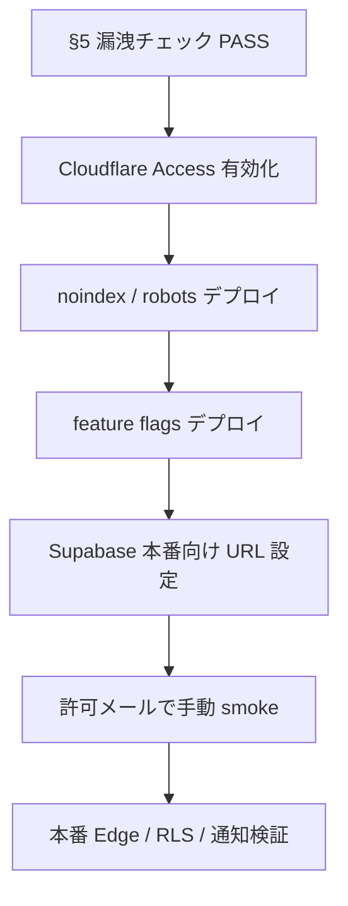

# 本番URL非公開テスト — Cloudflare Access 準備計画

| 項目 | 内容 |
|------|------|
| 作成日 | **2026-06-23** |
| 種別 | **計画・手順書のみ**（本ドキュメント作成時点で **一般公開・Access 有効化・UI 変更は未実施**） |
| 目的 | 本番 URL / Edge / Storage / RLS / 通知の **許可者のみ** による検証 |
| 許可ユーザー | **`rubi.hiro0613@gmail.com` のみ** |
| 前提 | TASFUL LIVE P0 **Go（技術完了）** — [`tasful-live-p0-final-review.md`](tasful-live-p0-final-review.md) |

---

## エグゼクティブサマリー

| 原則 | 内容 |
|------|------|
| **最重要** | 一般公開しない · **Access 有効化前に本番 URL を公開導線へ出さない** |
| **入口** | Cloudflare Zero Trust Access が **唯一の人間向けゲート** |
| **深層防御** | noindex · robots.txt · feature flag · OGP/sitemap 非掲載 |
| **テスト開始条件** | §8 **Go** をすべて満たしてから（Access なしで本番 URL テスト **禁止**） |

**対象ホスト（いずれも保護必須）:**

| ホスト | 備考 |
|--------|------|
| `https://tasful.jp` | 本番カスタムドメイン（[`auth-current-user.js`](../auth-current-user.js) の `PRODUCTION_HOSTS`） |
| `https://www.tasful.jp` | www（Redirect Rule で apex へ） |
| `https://tasufull-article.pages.dev` | Pages デフォルト URL — **DNS なしでも到達可能なため漏洩経路** |

> **注意:** `pages.dev` は過去デプロイレポートに記載済み（[`nb1c-pages-dev-smoke.md`](nb1c-pages-dev-smoke.md)）。カスタムドメイン未公開でも **必ず Access をかける**。

---

## 1. Cloudflare Access 設定手順

### 1.1 事前条件

- [ ] Cloudflare アカウントで **Zero Trust** が有効（Free 枠で可 · 1 ユーザー運用向け）
- [ ] ゾーン `tasful.jp` が Cloudflare 管理下（カスタムドメイン利用時）
- [ ] Pages プロジェクト `tasufull-article` の Production デプロイが存在
- [ ] **本番 URL を SNS・メール・README・UI に掲載していない**（§5 チェックリスト）

### 1.2 IdP（ログイン方式）— 推奨

**推奨: One-time PIN（メール OTP）**

| 項目 | 設定 |
|------|------|
| Zero Trust → Settings → Authentication | **One-time PIN** を有効化 |
| 理由 | Google 連携不要 · 許可メール `rubi.hiro0613@gmail.com` への PIN のみで入れる |
| 代替 | Google ログイン + Policy で当該 Gmail に限定（Google アカウント必須） |

### 1.3 Application 作成（ホストごとに 2 本）

**A. カスタムドメイン**

1. Zero Trust → **Access** → **Applications** → **Add an application**
2. Type: **Self-hosted**
3. Application name: `TASFUL Production Private (tasful.jp)`
4. Session Duration: `24 hours`（テスト期間 · 必要なら短縮）
5. **Application domain:**
   - Subdomain: `@`（または apex 表記）
   - Domain: `tasful.jp`
   - Path: 空（サイト全体）
6. **Policies** → Add a policy:
   - Policy name: `Allow rubi only`
   - Action: **Allow**
   - Include: **Emails** → `rubi.hiro0613@gmail.com`
   - （厳格化）Exclude ルールは追加しない
7. **Default** の Block 動作を確認（Allow 以外は拒否）

**B. Pages デフォルトドメイン（必須）**

同手順で別 Application:

- Application name: `TASFUL Production Private (pages.dev)`
- Application domain: `tasufull-article.pages.dev`
- Policy: 上記と **同一**（`rubi.hiro0613@gmail.com` のみ Allow）

### 1.4 www の扱い

| 方式 | 推奨 |
|------|------|
| Redirect Rule | `www.tasful.jp` → `https://tasful.jp` 301（[`nb1a-cloudflare-pages-hosting-plan.md`](nb1a-cloudflare-pages-hosting-plan.md)） |
| Access | **apex と www の両方**に Application を付けるか、Redirect 後に apex のみ保護でも可（Redirect 先が保護されていれば OK） |

### 1.5 動作確認（Access 有効化直後）

| # | 手順 | 期待結果 |
|---|------|----------|
| 1 | シークレットウィンドウで `https://tasful.jp/` を開く | Cloudflare Access ログイン画面 |
| 2 | 許可外メールでログイン試行 | **拒否** |
| 3 | `rubi.hiro0613@gmail.com` で OTP 受信・入力 | **200** · サイト表示 |
| 4 | 同上を `https://tasufull-article.pages.dev/` で実施 | 同様 |
| 5 | curl（Cookie なし） | **302/403**（Access ブロック） |

### 1.6 CI / 自動検証（任意 · 後追い可）

Access 配下の URL に `npm run verify:*` を流す場合:

- **Service Auth**（Access Service Token）を Zero Trust で発行
- 検証スクリプトに `CF-Access-Client-Id` / `CF-Access-Client-Secret` ヘッダを付与
- **P0 非公開テストの初回は手動ブラウザ検証を優先**（トークン漏洩リスク低減）

---

## 2. 許可メール設定

| 項目 | 値 |
|------|-----|
| 許可メール（唯一） | `rubi.hiro0613@gmail.com` |
| Policy Include | Emails: `rubi.hiro0613@gmail.com`（完全一致） |
| グループ / ドメイン許可 | **禁止**（`@gmail.com` 全体許可などしない） |
| Bypass / WARP / ドメイン全体許可 | **禁止**（`@gmail.com` 等で広げない） |
| 追加テスター | 必要時のみ **別 Policy を追加**（本計画では 1 名固定） |

**運用メモ:**

- OTP は Gmail 受信トレイを確認（迷惑メールフォルダも）
- セッション切れ時は再 OTP · 本番公開前に Session Duration を見直す

---

## 3. noindex / robots.txt 方針

**目的:** 検索エンジン・プレビューボットによるインデックスと OGP キャッシュを防ぐ（Access と併用）。

### 3.1 多層方針（推奨）

| 層 | 手段 | 設定案 |
|----|------|--------|
| **HTTP ヘッダ** | `deploy/cloudflare/_headers` に追加（実装フェーズ） | 全パス: `X-Robots-Tag: noindex, nofollow, noarchive, nosnippet` |
| **robots.txt** | ビルド出力ルートに配置 | `User-agent: *` / `Disallow: /` |
| **HTML meta** | 主要テンプレートまたはビルド注入 | `<meta name="robots" content="noindex, nofollow">` |
| **既存** | `chat-list.html` 等 | 個別 noindex あり — **サイト全体統一が必要** |

### 3.2 robots.txt 草案（非公開テスト期間）

```txt
# TASFUL — private production test (do not index)
User-agent: *
Disallow: /

# 明示的に主要ボットも拒否
User-agent: Googlebot
Disallow: /

User-agent: Bingbot
Disallow: /

Sitemap:
# （空 — sitemap URL を載せない）
```

### 3.3 OGP / プレビュー

| 項目 | 非公開テスト期間 |
|------|------------------|
| `og:url` | **設定しない** または Access 付き URL を載せない |
| `og:image` / `twitter:card` | **削除または無効化**（SNS 展開時にサムネが漏れる） |
| `link rel=canonical` | 本番 URL を **載せない** |

### 3.4 公開前に解除する項目

→ §7 参照（`X-Robots-Tag` 削除 · robots.txt 更新 · sitemap 追加）

---

## 4. feature flag 方針

**目的:** Access を突破した場合でも、LIVE / MATCH / Marketplace / Builder を **意図せず一般相当で使わせない**（深層防御 + UX 明示）。

### 4.1 対象モジュール

| フラグキー | パス例 | P0 非公開テスト |
|------------|--------|-----------------|
| `live` | `/live/*` | テスト対象なら **ON**（許可者のみ Access 内で検証） |
| `match` | `/match/*` | デフォルト **OFF** または招待制βのみ |
| `marketplace` | `/shop-market-*` · 出品系 | デフォルト **OFF** |
| `builder` | `/builder/*` | デフォルト **OFF** |

> **LIVE 本番検証**が目的のため、`live` のみ ON · 他 3 モジュール OFF が初期推奨。横断回帰が必要なときだけ一時 ON。

### 4.2 実装方針（次フェーズ · 本タスクでは未実装）

| 項目 | 方針 |
|------|------|
| 注入元 | `deploy/cloudflare/stage-cloudflare-pages.mjs` が生成する `tasful-feature-flags.js`（ビルド時 · **git にコミットしない**） |
| ランタイム | `tasful-module-gate.js` — `isModuleEnabled("live")` 等 |
| UI | トップ / dashboard / company / index-top から **該当モジュールへのリンクを非表示** |
| 直 URL | フラグ OFF 時は「非公開テスト中」静的ページへリダイレクトまたは 404 風表示 |
| 本番 host | [`talk-runtime.js`](../talk-runtime.js) / [`auth-current-user.js`](../auth-current-user.js) と同様、`tasful.jp` では `talkDev=1` **無効**（既存） |

### 4.3 設定例（ビルド時 JSON）

```javascript
// Generated — private test only
window.TASFUL_FEATURE_FLAGS = {
  privateTestMode: true,
  live: true,        // LIVE 本番検証 ON
  match: false,
  marketplace: false,
  builder: false,
};
```

### 4.4 既存の関連機構

| 機構 | 用途 |
|------|------|
| `match/match-beta-gate.js` | Edge 403 `match_beta_not_allowed` UI — **サーバー側β** と併用 |
| `talk-runtime.js` `isTalkProductionMode()` | 本番 host 判定 · dev パラメータ遮断 |
| `auth-current-user.js` `PRODUCTION_HOSTS` | `tasful.jp` / `www.tasful.jp` |

---

## 5. 本番URL漏洩防止チェックリスト

**Access 有効化前に実施（すべてチェック必須）**

### 5.1 公開導線・コンテンツ

- [ ] `index-top.html` · `dashboard.html` · `company/*` · `iwasho/*` に **本番絶対 URL**（`https://tasful.jp` · `pages.dev`）がない
- [ ] ナビ・フッター・CTA に **LIVE / MATCH / Marketplace / Builder** への本番直リンクを出さない（feature flag 実装まで **リンク追加禁止**）
- [ ] `README.md` · `reports/*.md` の **新規コミット**に本番 URL を書かない（既存レポートは社内限定扱い）
- [ ] SNS · ブログ · メール署名に URL を載せない
- [ ] **sitemap.xml** を生成・配信しない
- [ ] OGP / canonical に本番 URL を載せない

### 5.2 Supabase / Edge

- [ ] **Access 有効化前**に Supabase Auth **Site URL** を `https://tasful.jp` に変更しない（または変更する場合は同時に Access 必須）
- [ ] Redirect URLs に本番 URL を追加するタイミング = **Access 後**
- [ ] Edge `SITE_URL` シークレット — 本番値設定時は Checkout 戻り先が外部に露出しないか確認
- [ ] メールテンプレート · 通知 `target_url` に本番 URL がハードコードされていないか spot 確認

### 5.3 Cloudflare / DNS

- [ ] `tasful.jp` DNS を向ける前に **Access Application 草案を Ready** にする
- [ ] `pages.dev` に **必ず** Access をかける（カスタムドメイン未公開でも）
- [ ] Deploy 通知（GitHub · Slack）が外部チャンネルに飛ばない

### 5.4 リポジトリ内の既知露出（管理）

| ファイル | 内容 | 対応 |
|----------|------|------|
| `reports/nb1c-pages-dev-smoke.md` 等 | `tasufull-article.pages.dev` 記載 | 社内限定 · 外部共有禁止 |
| `chat-supabase-config.js` | Supabase URL（staging ref） | anon key は公開前提 · **service_role は絶対にクライアント注入しない** |

---

## 6. 非公開テスト手順

### 6.1 フェーズ順序（厳守）



| Phase | 内容 | 実施者 |
|-------|------|--------|
| **0** | §5 チェックリスト完了 | 運営 |
| **1** | Access 2 Application + 許可メール Policy | Cloudflare Admin |
| **2** | `_headers` · `robots.txt` · feature flags を含む Production デプロイ | CI / 手動 |
| **3** | Supabase Auth Redirect · Edge secrets（必要最小） | Supabase Admin |
| **4** | 許可メールでログイン → 手動 smoke（§6.2） | `rubi.hiro0613@gmail.com` |
| **5** | 本番 RLS / Storage / 通知の観測テスト（§6.3） | 同上 |

**禁止:** Phase 1 より前に本番 URL でテスト開始 · Access なし curl/共有

### 6.2 手動 smoke（Access ログイン後）

ベース: `https://tasful.jp`（または `pages.dev` — 同一ビルドであることを確認）

| # | URL（相対） | 確認 |
|---|-------------|------|
| 1 | `/live/index.html` | 表示 · console error 0 |
| 2 | `/live/shorts.html` | フィード |
| 3 | `/live/watch.html?broadcast_id=stub` | stub 視聴（本番は talkDev 無効） |
| 4 | `/live/gifts.html` | stub ギフト |
| 5 | `/live/profile.html?userId=<test>` | プロフィール · TALK CTA |
| 6 | `/talk-home.html` | TALK 基盤 |
| 7 | `/match/match-top.html` | feature OFF ならゲート表示 |
| 8 | `/shop-market-top.html` | feature OFF ならブロック |
| 9 | `/builder/index.html` | feature OFF ならブロック |

**Viewport:** 390 / 768 / 1280 — DevTools で console error 0

**自動化（Access 後 · 任意）:**

```bash
# ローカルからは不可 — Access 配下のみ
# Service Token 設定後:
npm run verify:live-p7
# … 他 LIVE verify（要 CF-Access-* ヘッダ拡張 · 未実装）
```

### 6.3 本番バックエンド検証項目

| 領域 | 検証内容 |
|------|----------|
| **Edge** | `live-short-signed-url` · `live-notify` · `ensure-talk-room` が本番 JWT で動作 |
| **Storage** | `short-videos` signed URL · bucket policy |
| **RLS** | 他ユーザー JWT で他人行が読めないこと |
| **通知** | `talk_notifications type=live` · `live_notify_dedupe` |
| **集計** | follower / like / tip_total トリガー |
| **Auth** | `talkDev=1` が **無効**（本番 host） · LS fallback 遮断 |

### 6.4 記録

- 結果を `reports/production-private-test-run-YYYYMMDD.md` に記録（別途）
- 失敗時は **本番公開せず** staging / ローカルで修正 → 再デプロイ

---

## 7. 公開前に解除する項目

| 項目 | 非公開テスト | 一般公開時 |
|------|--------------|------------|
| Cloudflare Access | 1 メールのみ Allow | 削除 or 対象パス限定（管理画面のみ等） |
| `X-Robots-Tag: noindex` | ON | **削除** |
| `robots.txt` Disallow: / | ON | Allow ルール + sitemap |
| `TASFUL_FEATURE_FLAGS.privateTestMode` | true | false |
| LIVE/MATCH/Marketplace/Builder flags | 個別 OFF/ON | 製品判断で ON |
| OGP / canonical / sitemap | 無効 | 有効化 |
| Supabase Site URL | 本番確定値 | 維持 |
| 規約 · ガイドライン | 未掲載可 | **必須** — [`tasful-live-p0-final-review.md`](tasful-live-p0-final-review.md) §15 |
| 本番 E2E チェックリスト | 手動中心 | 自動化拡張 |

---

## 8. Go / No-Go 判定

### 8.1 非公開テスト開始 Go（すべて必須）

| ID | 条件 | 状態 |
|----|------|------|
| G-PRE-01 | §5 漏洩防止チェックリスト **全項目** 確認済み | ⬜ 未実施 |
| G-PRE-02 | Cloudflare Access **2 ホスト** 有効 | ⬜ 未実施 |
| G-PRE-03 | 許可メール `rubi.hiro0613@gmail.com` **のみ** Allow | ⬜ 未実施 |
| G-PRE-04 | 許可外アクセスが **ブロック** されることを確認 | ⬜ 未実施 |
| G-PRE-05 | noindex（ヘッダ or meta）+ `robots.txt` デプロイ | ⬜ 未実施 |
| G-PRE-06 | feature flag で LIVE/MATCH/Marketplace/Builder 制御方針確定 | ⬜ 計画済み · 実装待ち |
| G-PRE-07 | 本番 URL が **ユーザー向け UI・SNS・sitemap** に未掲載 | ⬜ 要確認 |
| G-PRE-08 | LIVE P0 verify（staging）PASS — 回帰基準あり | ✅ 済 — [`tasful-live-p0-final-review.md`](tasful-live-p0-final-review.md) |

**現時点の判定: No-Go（非公開テスト開始）**

理由: Cloudflare Access · noindex/robots · feature flag **実装・有効化が未完了**（本ドキュメントは準備計画のみ）。

### 8.2 非公開テスト完了 → 一般公開検討 Go

| ID | 条件 |
|----|------|
| G-PUB-01 | 非公開テスト run レポートで **重大欠陥 0** |
| G-PUB-02 | 規約 · プライバシー · 配信者ガイドライン **掲載済み** |
| G-PUB-03 | 本人確認 / 配信者開放条件の **運用フロー確定** |
| G-PUB-04 | Stripe / Stream **本接続の Go** が別途承認済み（P0 外） |
| G-PUB-05 | §7 の制限解除計画が承認済み |
| G-PUB-06 | 本番 migration ランブック実行済み |

**現時点の判定: No-Go（一般公開）** — 想定どおり

---

## 9. 本タスクのスコープと次アクション

### 本タスクで実施したこと

- 本計画書の作成
- 既存アーキテクチャ（Pages · `auth-current-user` · `stage-cloudflare-pages.mjs` · MATCH β gate）との整合確認

### 本タスクで実施していないこと（意図的）

- Cloudflare Dashboard 操作（Access 有効化）
- `robots.txt` / `_headers` / feature flag の **コード実装**
- 本番デプロイ · Supabase Site URL 変更
- 本番 URL でのテスト実行

### 推奨次アクション（優先順）

1. **Cloudflare Access** — §1 を Dashboard で実施（**最優先**）
2. **漏洩チェック** — §5 を実際に grep / 目視
3. **ビルド注入** — `robots.txt` · `X-Robots-Tag` · `tasful-feature-flags.js`（小 PR · 別タスク）
4. **Access 後デプロイ** — Production 1 回
5. **手動 smoke** — §6.2 · 記録レポート作成
6. **規約ドラフト** — 一般公開ゲート（[`tasful-live-p0-final-review.md`](tasful-live-p0-final-review.md) §15）

---

## 10. 参照

| 資料 | 用途 |
|------|------|
| [`tasful-live-p0-final-review.md`](tasful-live-p0-final-review.md) | LIVE P0 技術完了 · 本番前作業 |
| [`nb1a-cloudflare-pages-hosting-plan.md`](nb1a-cloudflare-pages-hosting-plan.md) | Pages / DNS / `_headers` |
| [`auth-step7-localstorage-fallback-lockdown.md`](auth-step7-localstorage-fallback-lockdown.md) | 本番 host 偽装遮断 |
| [`nb1d-custom-domain-auth-precheck.md`](nb1d-custom-domain-auth-precheck.md) | カスタムドメイン + Auth 前提 |
| [Cloudflare Access for Pages](https://developers.cloudflare.com/cloudflare-one/access-controls/applications/http-apps/self-hosted-public-app/) | 公式手順 |

---

**署名:** 本番URL非公開テスト準備計画 — レビュー・検証準備のみ · **一般公開なし**
