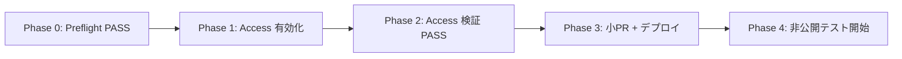

# 本番非公開テスト — 実装前ゲート（Preflight）

| 項目 | 内容 |
|------|------|
| 作成日 | **2026-06-23** |
| 種別 | **チェックリスト / ゲート定義のみ**（コード変更 · Access 有効化 · デプロイ **未実施**） |
| 親文書 | [`production-private-test-access-plan.md`](production-private-test-access-plan.md) |
| 許可ユーザー | `rubi.hiro0613@gmail.com` のみ |
| 本番ホスト | `tasful.jp` · `www.tasful.jp` · `tasufull-article.pages.dev` |

---

## ゲートの位置づけ



| フェーズ | 本ドキュメント | 実施タイミング |
|----------|----------------|----------------|
| **Phase 0 — Preflight** | §2〜§4 · §7 Gate-A | **Access 有効化の前** |
| **Phase 1 — Access 作成** | §5 · §7 Gate-B | Dashboard 操作（本タスク外） |
| **Phase 2 — Access 検証** | §5 続き · §7 Gate-C | Application 保存直後 |
| **Phase 3 — 小 PR** | §6 · §7 Gate-D | Access 検証 PASS 後 |
| **Phase 4 — 非公開テスト** | 親文書 §6 | デプロイ後 |

**鉄則:** Phase 0 が **No-Go** のまま Phase 1 に進まない · Access なしで本番 URL テスト **禁止**

---

## 1. 本番 URL 定義（チェック対象）

検索・目視で扱う **本番露出 URL**（完全一致または部分一致）:

| ID | パターン | 用途 |
|----|----------|------|
| `PROD-APEX` | `https://tasful.jp` | カスタムドメイン（末尾 `/` なしが正） |
| `PROD-WWW` | `https://www.tasful.jp` | www |
| `PROD-PAGES` | `https://tasufull-article.pages.dev` | Pages デフォルト |
| `PROD-PAGES-WC` | `tasufull-article.pages.dev` | スキーム省略・テキスト露出 |
| `PROD-APEX-NO-SCHEME` | `tasful.jp` | メール・文言（**ユーザー向け UI では相対パス推奨**） |

**許容（本番 URL ではない）:**

- `http://127.0.0.1:*` · `localhost`
- `*.supabase.co`（プロジェクト ref — anon 前提）
- 相対パス（`/live/` · `match-top.html` 等）

---

## 2. §5 漏洩チェック — grep 手順（Phase 0）

実施者がリポジトリルートで実行。**結果を §8 記録欄に転記**。

### 2.1 一括 grep（コピペ用）

PowerShell（リポジトリルート）:

```powershell
# A. ユーザー向け配信物 — 本番絶対 URL（必須 PASS: 0 件）
rg -n "https://tasful\.jp|https://www\.tasful\.jp|tasufull-article\.pages\.dev" `
  --glob "*.html" --glob "*.js" --glob "*.css" `
  --glob "!deploy/**" --glob "!reports/**"

# B. dist ビルド出力（デプロイ直前にも再実行）
rg -n "https://tasful\.jp|tasufull-article\.pages\.dev" deploy/cloudflare/dist `
  --glob "*.html" --glob "*.js"

# C. sitemap（存在したら FAIL）
rg -l "sitemap" --glob "*.xml" --glob "sitemap*.xml" --glob "robots.txt"

# D. OGP / canonical 本番 URL
rg -n "og:url|property=\"og:url\"|rel=\"canonical\"" --glob "*.html" `
  --glob "!reports/**"

# E. README ルート
rg -n "tasful\.jp|pages\.dev" README.md

# F. 新規 reports（社内限定 — 外部共有禁止の確認）
rg -n "tasufull-article\.pages\.dev|https://tasful\.jp" reports --glob "*.md"
```

bash 相当:

```bash
rg -n 'https://tasful\.jp|tasufull-article\.pages\.dev' \
  --glob '*.html' --glob '*.js' --glob '!deploy/**' --glob '!reports/**'
```

### 2.2 判定基準（grep）

| ID | コマンド | PASS 条件 | FAIL 時の対応 |
|----|----------|-----------|---------------|
| G-URL-01 | 2.1-A | **0 件**（HTML/JS ソース） | 絶対 URL を相対化または削除してから Phase 1 |
| G-URL-02 | 2.1-B | **0 件**（dist） | stage 再ビルド前に修正 |
| G-URL-03 | 2.1-C | sitemap **ファイルなし** | 生成パイプライン停止 |
| G-URL-04 | 2.1-D | `og:url` に本番ホスト **なし** | meta 削除または相対のみ |
| G-URL-05 | 2.1-E | README に本番 URL **なし** | README 修正 |
| G-URL-06 | 2.1-F | reports 内は **社内管理**（外部 PR/公開に含めない） | 共有範囲を限定 |

### 2.3 ベースライン監査（2026-06-23 · 本ドキュメント作成時）

| 項目 | 結果 | 備考 |
|------|------|------|
| G-URL-01 HTML/JS（`deploy/` `reports/` 除外） | **0 件** | ハードコード本番 URL なし |
| `robots.txt` | **未存在** | 小 PR で追加予定 |
| OGP `og:url` / `twitter:card` | **未検出**（ルート HTML） | |
| `meta robots` | `chat-list.html` のみ | サイト全体統一は小 PR 後 |
| README 本番 URL | **なし** | |
| reports 内 pages.dev | **多数**（`nb1c-*` 等） | **社内限定 · 外部共有禁止** |

> 本ベースラインは **スナップショット**。マージ前に **必ず 2.1 を再実行**すること。

---

## 3. §5 漏洩チェック — 目視チェック（Phase 0）

grep では拾えない露出を確認。**チェック欄は実施時に `[x]` を付ける。**

### 3.1 HTML — 公開導線

| ID | 対象ファイル / ディレクトリ | 確認内容 | ☐ |
|----|------------------------------|----------|---|
| V-HTML-01 | `index-top.html` | 本番絶対 URL · LIVE/MATCH/Marketplace/Builder への **新規**目立つ導線がない | ☐ |
| V-HTML-02 | `dashboard.html` · `dashboard-mobile-home.js` | タイルに本番 URL なし · モジュール直リンク方針確認 | ☐ |
| V-HTML-03 | `company/*.html` | フッター `/builder/` は相対のみ · `https://tasful.jp` なし | ☐ |
| V-HTML-04 | `iwasho/*.html` | 同上 | ☐ |
| V-HTML-05 | `live/*.html` | ページ内に本番 URL なし · SNS シェアボタンなし | ☐ |
| V-HTML-06 | `match/*.html` | 同上 | ☐ |
| V-HTML-07 | `login.html` · `signup.html` | リダイレクト説明に本番 URL を **印刷していない** | ☐ |
| V-HTML-08 | 全主要 HTML `<head>` | `og:url` / `canonical` / `twitter:*` で本番ホストを **載せていない** | ☐ |

### 3.2 JS — ランタイム露出

| ID | 対象 | 確認内容 | ☐ |
|----|------|----------|---|
| V-JS-01 | `auth-current-user.js` | `PRODUCTION_HOSTS` は host 名のみ（URL 露出ではない）· 問題なし | ☐ |
| V-JS-02 | `talk-notifications-store.js` · `live/live-notify.js` | `target_url` が `/live/...` 相対 · 本番絶対 URL ハードコードなし | ☐ |
| V-JS-03 | `stripe-*` · `platform-chat-*` | Checkout 戻りが `location.origin` 依存 · **SITE_URL 未設定時**の挙動を把握 | ☐ |
| V-JS-04 | `chat-supabase-config.js`（コミット品） | **service_role なし** · 本番 URL 文字列なし | ☐ |
| V-JS-05 | `deploy/cloudflare/stage-cloudflare-pages.mjs` | 生成 config に本番 URL を **書き込まない**（Supabase URL のみ） | ☐ |

### 3.3 sitemap / robots.txt / OGP

| ID | 対象 | 確認内容 | ☐ |
|----|------|----------|---|
| V-SEO-01 | `sitemap.xml` / `sitemap_index.xml` | **リポジトリ・dist に存在しない** | ☐ |
| V-SEO-02 | `robots.txt` | 未デプロイ or `Disallow: /`（小 PR 後） | ☐ |
| V-SEO-03 | `deploy/cloudflare/_headers` | 非公開テスト前は `X-Robots-Tag` **未設定** → 小 PR で追加 | ☐ |
| V-SEO-04 | SNS プレビュー | 本番 URL を Slack / X / LINE に **未投稿** | ☐ |

### 3.4 Supabase Redirect URL（Dashboard 目視）

**Access 有効化前に変更しない項目:**

| ID | 場所 | 確認内容 | ☐ |
|----|------|----------|---|
| V-SB-01 | Supabase → Authentication → URL Configuration → **Site URL** | `https://tasful.jp` に **未変更**（または変更済みなら Access が **既に**有効） | ☐ |
| V-SB-02 | **Redirect URLs** allow list | 本番 `https://tasful.jp/**` を **Access 前に追加していない** | ☐ |
| V-SB-03 | Edge Secrets `SITE_URL` | `https://tasful.jp` が **未設定** or 設定時は Access 済み | ☐ |
| V-SB-04 | Auth メールテンプレート | プレビューに本番リンクが **外部に届いていない** | ☐ |

**Access 有効化後にのみ実施（Phase 3）:**

| ID | 設定値 |
|----|--------|
| V-SB-POST-01 | Site URL = `https://tasful.jp`（末尾 `/` なし） |
| V-SB-POST-02 | Redirect URLs += `https://tasful.jp/**`（代表パス明示追加可） |
| V-SB-POST-03 | `supabase secrets set SITE_URL=https://tasful.jp`（必要時） |

参照: [`nb1d-custom-domain-auth-precheck.md`](nb1d-custom-domain-auth-precheck.md)

### 3.5 README / reports / SNS

| ID | 対象 | 確認内容 | ☐ |
|----|------|----------|---|
| V-DOC-01 | `README.md` | 本番 URL なし · clone 手順が pages.dev を **宣伝していない** | ☐ |
| V-DOC-02 | `reports/*.md` | 既存の `pages.dev` 記載は **社内限定**（GitHub public ならリスク承知） | ☐ |
| V-DOC-03 | 未コミット差分 | 新規コミットに本番 URL を **追加していない** | ☐ |
| V-SNS-01 | X / Facebook / LinkedIn / note | 本番 URL **未投稿** | ☐ |
| V-SNS-02 | メール署名 · 名刺 · QR | 本番 URL **未掲載** | ☐ |
| V-SNS-03 | GitHub Pages Description / Website | 本番 URL **未設定** | ☐ |

### 3.6 Cloudflare / DNS / CI

| ID | 対象 | 確認内容 | ☐ |
|----|------|----------|---|
| V-CF-01 | DNS `tasful.jp` | 向ける場合は **Access Application 草案が Ready** | ☐ |
| V-CF-02 | Pages Production | デプロイ通知が **公開 Slack / メール**に飛ばない | ☐ |
| V-CF-03 | `tasufull-article.pages.dev` | **無防備で公開していない**（Access 前に URL を共有しない） | ☐ |

### 3.7 モジュール導線（feature flag 前の暫定）

| ID | 確認内容 | ☐ |
|----|----------|---|
| V-MOD-01 | トップ / dashboard から **LIVE への新規バナー・絶対 URL リンクを追加していない** | ☐ |
| V-MOD-02 | `company/services.html` 等の `/builder/` は相対 · 本番ホストなし | ☐ |
| V-MOD-03 | 非公開テスト開始まで **SNS で LIVE/MATCH を宣伝しない** | ☐ |

---

## 4. 本番 URL 露出チェック — 対象マトリクス

| カテゴリ | スコープ | grep | 目視 | 小 PR | Access 後 |
|----------|----------|------|------|-------|-----------|
| **HTML** | `*.html`（`deploy/` 除く） | G-URL-01 | V-HTML-* | — | smoke |
| **JS** | `*.js`（`scripts/` `reports/` 除く） | G-URL-01 | V-JS-* | feature gate | smoke |
| **sitemap** | `sitemap*.xml` | G-URL-03 | V-SEO-01 | 追加禁止 | — |
| **OGP** | `<head>` meta | G-URL-04 | V-HTML-08 | — | プレビュー確認 |
| **robots.txt** | ルート / dist | G-URL-03 | V-SEO-02 | **追加** | curl 確認 |
| **Supabase Redirect** | Dashboard | — | V-SB-* | — | V-SB-POST-* |
| **README** | `README.md` | G-URL-05 | V-DOC-01 | — | — |
| **reports** | `reports/*.md` | G-URL-06 | V-DOC-02 | — | — |
| **SNS 導線** | 社外チャネル | — | V-SNS-* | — | — |
| **dist 出力** | `deploy/cloudflare/dist` | G-URL-02 | デプロイ前 | robots/_headers | curl |

---

## 5. Access Application 作成後の確認（Phase 1〜2）

親文書 §1 に沿った **Dashboard 作業後**の検証リスト。

### 5.1 IdP — One-time PIN

| ID | 手順 | 期待結果 | ☐ |
|----|------|----------|---|
| A-IDP-01 | Zero Trust → Settings → Authentication → **One-time PIN** 有効 | ON | ☐ |
| A-IDP-02 | 他 IdP（Google 等）を **広く許可していない** | PIN のみ or 限定 | ☐ |

### 5.2 Application — `tasful.jp`

| ID | 設定項目 | 期待値 | ☐ |
|----|----------|--------|---|
| A-APP-JP-01 | Type | Self-hosted | ☐ |
| A-APP-JP-02 | Application domain | `tasful.jp`（全パス） | ☐ |
| A-APP-JP-03 | Policy Action | **Allow** | ☐ |
| A-APP-JP-04 | Policy Include | Emails: `rubi.hiro0613@gmail.com` **のみ** | ☐ |
| A-APP-JP-05 | `@gmail.com` ドメイン許可 | **なし** | ☐ |
| A-APP-JP-06 | Bypass / Service Auth | 意図しない Bypass **なし** | ☐ |

### 5.3 Application — `tasufull-article.pages.dev`

| ID | 設定項目 | 期待値 | ☐ |
|----|----------|--------|---|
| A-APP-PD-01 | Application domain | `tasufull-article.pages.dev` | ☐ |
| A-APP-PD-02 | Policy | A-APP-JP-04 と **同一** | ☐ |

### 5.4 動作確認（シークレットウィンドウ）

| ID | 手順 | 期待結果 | ☐ |
|----|------|----------|---|
| A-BHV-01 | 未ログインで `https://tasful.jp/` | **Access ログイン画面**（サイト本体が見えない） | ☐ |
| A-BHV-02 | 未ログインで `https://tasufull-article.pages.dev/` | 同上 | ☐ |
| A-BHV-03 | 許可外メールで OTP 試行 | **拒否** | ☐ |
| A-BHV-04 | `rubi.hiro0613@gmail.com` で OTP | **ログイン成功** · 200 | ☐ |
| A-BHV-05 | `curl -sI https://tasful.jp/`（Cookie なし） | **302/403**（Access） | ☐ |
| A-BHV-06 | `curl -sI https://tasufull-article.pages.dev/` | 同上 | ☐ |
| A-BHV-07 | www → apex Redirect 後も Access が効く | apex で A-BHV-01 と同等 | ☐ |

### 5.5 許可メールの厳格性

| 項目 | 値 |
|------|-----|
| 唯一の Allow | `rubi.hiro0613@gmail.com` |
| 禁止例 | `*@gmail.com` · `@tasful.jp` グループ · Everyone |

---

## 6. 小 PR 対象整理（Phase 3 · Access 検証 PASS 後）

**本タスクでは実装しない。** 次 PR のスコープ定義。

### 6.1 PR タイトル案

`chore: private production test — robots, noindex header, feature flags`

### 6.2 変更ファイル一覧（予定）

| ファイル | 変更内容 |
|----------|----------|
| `deploy/cloudflare/robots.txt` | 新規 · `Disallow: /` · Sitemap 行なし |
| `deploy/cloudflare/stage-cloudflare-pages.mjs` | `robots.txt` を dist にコピー · `tasful-feature-flags.js` 生成 |
| `deploy/cloudflare/_headers` | 全パス `X-Robots-Tag: noindex, nofollow, noarchive, nosnippet` |
| `tasful-feature-flags.js` | **生成物**（gitignore または dist のみ · コミットしない方針推奨） |
| `tasful-module-gate.js` | 新規 · `isModuleEnabled(name)` |
| 主要 HTML または共通 bootstrap | `tasful-module-gate.js` + flags 読込（最小） |

### 6.3 `tasful-feature-flags.js` 初期値（非公開テスト）

```javascript
window.TASFUL_FEATURE_FLAGS = {
  privateTestMode: true,
  live: true,         // LIVE 本番検証 ON
  match: false,       // 初期 OFF
  marketplace: false, // 初期 OFF
  builder: false,     // 初期 OFF
};
```

| フラグ | パス目安 | 初期 | OFF 時の挙動（PR 実装時） |
|--------|----------|------|---------------------------|
| `live` | `/live/*` | **ON** | 「非公開テスト中」 |
| `match` | `/match/*` | **OFF** | ゲート / 404 風 |
| `marketplace` | `/shop-market-*` 等 | **OFF** | 同上 |
| `builder` | `/builder/*` | **OFF** | 同上 |

### 6.4 小 PR の受け入れ条件

| ID | 条件 |
|----|------|
| PR-01 | `deploy/cloudflare/dist/robots.txt` が `Disallow: /` |
| PR-02 | 本番デプロイ後 `curl -sI https://tasful.jp/robots.txt` が 200（Access 内） |
| PR-03 | レスポンスヘッダに `X-Robots-Tag` 含む |
| PR-04 | `match` / `marketplace` / `builder` 直 URL がブロック |
| PR-05 | `live` パスは許可者（Access 内）で到達可 |
| PR-06 | **本番絶対 URL を HTML/JS に追加していない**（G-URL-01 再 PASS） |

### 6.5 小 PR と Access の順序

| 順序 | 作業 |
|------|------|
| 1 | Phase 0 Preflight PASS |
| 2 | Access 有効化 + §5 検証 PASS |
| 3 | 小 PR マージ |
| 4 | Production デプロイ **1 回** |
| 5 | Phase 4 非公開テスト |

---

## 7. Go / No-Go 判定表

### Gate-A — Access 有効化の前（Phase 0 Preflight）

**すべて PASS で Phase 1 へ。1 つでも FAIL なら No-Go。**

| ID | 条件 | 状態 |
|----|------|------|
| GA-01 | G-URL-01 HTML/JS 本番絶対 URL **0 件** | ✅ PASS（2026-06-23） |
| GA-02 | V-HTML-01〜08 目視完了 | ✅ PASS |
| GA-03 | V-JS-01〜05 目視完了 | ✅ PASS |
| GA-04 | V-SEO-01 sitemap **なし** | ✅ PASS |
| GA-05 | V-SB-01〜02 Site URL / Redirect **Access 前に本番化していない** | ⚠️ 要人手確認 |
| GA-06 | V-SNS-01〜03 社外露出 **なし** | ⚠️ 要人手確認 |
| GA-07 | V-CF-03 pages.dev を **無防備共有していない** | ⚠️ 要対応（pages.dev 200 無認証 → Gate-B） |
| GA-08 | LIVE P0 staging verify PASS（回帰基準） | ✅ [`tasful-live-p0-final-review.md`](tasful-live-p0-final-review.md) |

**Gate-A 判定:** ✅ **Go**（2026-06-23）— 詳細 [`production-private-test-gate-a-result.md`](production-private-test-gate-a-result.md)

---

### Gate-B — Access Application 作成直後（Phase 2）

| ID | 条件 | 状態 |
|----|------|------|
| GB-01 | A-IDP-01 One-time PIN 有効 | ❌ 未実施（API 403） |
| GB-02 | A-APP-JP-* `tasful.jp` Application + 単一メール Policy | ❌ 未作成 |
| GB-03 | A-APP-PD-* `pages.dev` Application + 同一 Policy | ❌ 未作成 |
| GB-04 | A-BHV-01〜07 動作確認 PASS | ❌ pages.dev **200**（Access なし） |
| GB-05 | 許可外メール **拒否**確認済み | ⬜ 未検証 |

**Gate-B 判定:** ❌ **No-Go**（2026-06-23）— 詳細 [`production-private-test-gate-b-result.md`](production-private-test-gate-b-result.md)

---

### Gate-C — 小 PR + デプロイ後（Phase 3）

| ID | 条件 | 状態 |
|----|------|------|
| GC-01 | PR-01〜06 受け入れ PASS | ⬜ |
| GC-02 | V-SB-POST-01〜03 Supabase 本番 URL 設定（必要分のみ） | ⬜ |
| GC-03 | G-URL-02 dist 本番 URL **0 件** | ⬜ |

**Gate-C 判定:** ✅ **GO with note**（2026-06-23）— [`gate-c-search-blocking-report.md`](gate-c-search-blocking-report.md)

---

### Gate-D — 非公開テスト開始（Phase 4）

| ID | 条件 | 状態 |
|----|------|------|
| GD-01 | Gate-A · B · C **すべて Go** | ⬜ |
| GD-02 | 許可メールで親文書 §6.2 smoke 実施 | ⬜ |
| GD-03 | 結果を `production-private-test-run-YYYYMMDD.md` に記録 | ⬜ |

**Gate-D 判定:** ✅ **GO**（2026-06-23）— gemini-chat CORS 修正後 · 必須 7 URL PASS · [`production-private-test-run-20260623.md`](production-private-test-run-20260623.md)

**Gate-E 判定:** ✅ **GO**（2026-06-23）— Stripe Test · Webhook · 通知 · [`production-private-test-gate-e-result.md`](production-private-test-gate-e-result.md)

---

### Gate-PUB — 一般公開（参考 · 本ゲートの範囲外）

| ID | 条件 |
|----|------|
| GP-01 | 非公開テスト run で重大欠陥 0 |
| GP-02 | 規約 · ガイドライン掲載 |
| GP-03 | Access 解除 or 方針変更の承認 |
| GP-04 | robots/noindex 解除 · sitemap 有効化 |

**Gate-PUB:** ⬜ **No-Go**（想定どおり）

---

## 8. 実施記録

| 項目 | 値 |
|------|-----|
| Preflight 実施日 | **2026-06-23** |
| 実施者 | Cursor Agent（grep / 目視 / curl） |
| G-URL-01 結果 | **0 件** PASS |
| G-URL-02 結果 | **0 件** PASS |
| G-URL-03 結果 | sitemap/robots **なし** PASS |
| G-URL-04 結果 | **0 件** PASS |
| G-URL-05 結果 | **0 件** PASS |
| G-URL-06 結果 | reports 内 **~22 ファイル** — PASS（社内限定） |
| Gate-A | **Go** |
| 詳細レポート | [`production-private-test-gate-a-result.md`](production-private-test-gate-a-result.md) |
| Access 有効化日 | —（未実施） |
| Gate-B | **No-Go** — API トークンに Zero Trust 権限なし |
| Gate-B 詳細 | [`production-private-test-gate-b-result.md`](production-private-test-gate-b-result.md) |
| 小 PR マージ commit | — |
| デプロイ日 | — |
| Gate-C | **GO with note** — [`gate-c-search-blocking-report.md`](gate-c-search-blocking-report.md) |
| Gate-D | **GO** — storage-state smoke · 必須 7 URL PASS |
| Gate-E | **GO** — Stripe Test · Webhook 衛生 · 通知 · [`production-private-test-gate-e-result.md`](production-private-test-gate-e-result.md) |
| Supabase 疎通 | **GO** — [`production-private-test-supabase-connectivity.md`](production-private-test-supabase-connectivity.md) |
| 備考 | Gate-C OTP 人手確認済 · 次: Supabase/RLS/Edge/Storage |

---

## 9. 次アクション（厳守順序）

1. ~~**§2 grep + §3 目視** を実施 → Gate-A を Go にする~~ ✅ **2026-06-23 完了**
2. **Cloudflare Access**（§5）— Gate-B → ❌ **No-Go**（Zero Trust API 403）· **再実施必須**
3. **小 PR**（§6）— Gate-C
4. ~~**Supabase URL 設定**（V-SB-POST）— Access 後のみ~~ → 疎通確認 **GO** — [`production-private-test-supabase-connectivity.md`](production-private-test-supabase-connectivity.md)
5. **非公開テスト** — **READY** — [`production-private-test-ready-report.md`](production-private-test-ready-report.md)

---

## 10. 参照

| 文書 | 用途 |
|------|------|
| [`production-private-test-access-plan.md`](production-private-test-access-plan.md) | 全体計画 · 非公開テスト手順 |
| [`tasful-live-p0-final-review.md`](tasful-live-p0-final-review.md) | LIVE P0 技術完了 |
| [`nb1d-custom-domain-auth-precheck.md`](nb1d-custom-domain-auth-precheck.md) | Supabase Site URL / Redirect |
| [`auth-current-user.js`](../auth-current-user.js) | `PRODUCTION_HOSTS` |

---

**署名:** Gate-A 実施済（2026-06-23）· Access / コード / デプロイは未実施
