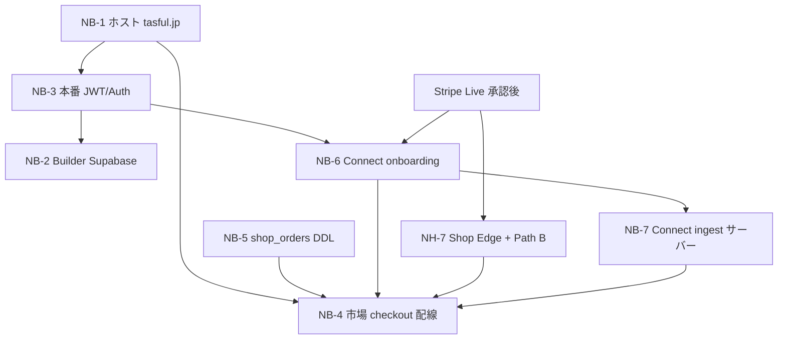

# P0-W6: RELEASE BLOCKER 解消ロードマップ

**作成日:** 2026-06-18  
**種別:** 計画のみ（**コード / UI / DB 変更なし**）  
**対象:** [`prelaunch-blockers-review.md`](prelaunch-blockers-review.md) **NB-1〜NB-7**  
**除外:** Stripe Live 切替本体（[`stripe-ready-check.md`](stripe-ready-check.md) READY 管轄）— **依存関係としては記載**

**Supabase プロジェクト:** `ddojquacsyqesrjhcvmn`  
**本番 URL（確定）:** `https://tasful.jp`

---

## 依存関係マップ（概要）

**クリティカルパス（フル本番・実 GMV）:**  
`NB-1` → `NB-3` → `NB-5` + `NB-6` + `Stripe Live` → `NH-7` → `NB-7` → `NB-4`  
**並行可能:** `NB-2`（Builder DB）は `NB-3` と設計並行可 · 本番切替は Auth 後

---

## BLOCKER 別詳細

### NB-1 — 本番静的ホスト `https://tasful.jp` 未稼働

| 項目 | 内容 |
|------|------|
| **原因** | ドメイン DNS 未登録（2026-06-18 監査）· 静的フロントのデプロイパイプライン未構築 · `npm run build` 相当の本番配信先なし |
| **解消方法** | ① ドメイン取得 / DNS  apex `tasful.jp` → ホスト（Cloudflare Pages · S3+CloudFront · Netlify 等）② `npm run preview` 相当の build 成果物を CI デプロイ ③ HTTPS 強制 · `www` → apex 301（任意）④ 代表ページ smoke（`index.html` · `talk-home.html` · `gen-ai-workspace.html` · `detail-skill.html`）⑤ **`SITE_URL=https://tasful.jp`** Supabase Secret 投入（[`stripe-ready-check.md`](stripe-ready-check.md)）⑥ `chat-supabase-config.js` 本番 anon key / URL 確認 |
| **想定工数** | **1〜3 人日**（Ops/Infra 中心 · ホスト選定済みなら 1d） |
| **依存関係** | **なし**（全 BLOCKER の共通前提） |
| **単独リリース可否** | **✅ 可** — 凍結 6 領域 UX を本番 URL で **限定公開 / パイロット**可能。実データ・実決済は不可 |

---

### NB-2 — Builder MVP 全状態 localStorage · Supabase DDL 未実行

| 項目 | 内容 |
|------|------|
| **原因** | Builder は意図的デモ MVP（`builder.js`「DB/Supabase ロジックは扱わない」）· `sql/builder-schema.sql` · `builder-rls-policies.sql` · `builder-storage-policies.sql` が **リポジトリのみ未適用** |
| **解消方法** | ① Supabase SQL Editor で schema + RLS + Storage 実行 ② `builder-create-signed-url` Edge デプロイ ③ フロントを LS 読み書き → Supabase RPC/REST に **段階置換**（凍結解除が必要な領域）④ `migrate-builder-export-to-supabase.mjs --execute` でデモデータ移行 ⑤ `review-builder-user-flow.mjs` / general-flow bench 再実行 |
| **想定工数** | **8〜12 人日**（DDL 0.5d + 配線 5〜8d + migration/QA 2〜3d） |
| **依存関係** | **NB-3**（RLS は JWT claims `actor_id` / `partner_id` 前提）· NB-1（本番 URL で E2E） |
| **単独リリース可否** | **⚠️ 部分可** — DDL のみ先行デプロイ可。本番利用は **NB-3 必須**。Builder 単体パイロット（既知 user_id）なら Auth 簡易版とセット |

---

### NB-3 — 本番認証 / JWT 未統合（デモロール）

| 項目 | 内容 |
|------|------|
| **原因** | 横断で `talkDev` · 固定 `userId` · デモロール切替（`builder-top.html`）· サーバー側ロール検証なし（[`prelaunch-blockers-review.md`](prelaunch-blockers-review.md) NH-5 と同一根） |
| **解消方法** | ① Supabase Auth（または既存 member-auth）で **本番 JWT 発行** ② JWT custom claims 設計（`talk_user_id` · Builder `actor_id` / `partner_id` · marketplace owner）③ クライアントからデモ切替 UI を **本番ビルドで無効化** ④ Edge / RLS が JWT を信頼する経路に統一 ⑤ 安否 `issue-anpi-rls-jwt.mjs` 運用を CI/ops 手順化 |
| **想定工数** | **10〜15 人日**（設計 2d + 横断配線 6〜10d + 検証 2〜3d） |
| **依存関係** | **NB-1**（本番 origin · cookie/session）· Marketplace / Connect / 安否 RLS と **横断** |
| **単独リリース可否** | **❌ 不可**（フル本番）— 単独では解消不能。**NB-2 / NB-4 / NB-6 の前提**。限定パイロットは allowlist + 固定 JWT で **暫定可**（本番判定からは BLOCKER 残） |

---

### NB-4 — 市場 checkout Path A モック（実注文不可）

| 項目 | 内容 |
|------|------|
| **原因** | RELEASE FROZEN の Path A（`shop-market-checkout.js`）が **localStorage 注文のみ** · Path B（`checkout.html` + `shop-checkout.js`）は **HTML 未 include** · buy CTA が Path A に向いている（[`marketplace-payment-production-gap.md`](marketplace-payment-production-gap.md)） |
| **解消方法** | ① **Market EC 凍結解除**（最小 diff）— buy → Path B または create-shop-checkout 呼出 ② `shop-market-checkout.js` を Stripe パスへ接続 or Path A を read-only 化 ③ confirm フォールバック + 注文履歴を `shop_orders` 読取に切替 ④ `verify-marketplace-rls.mjs` · 購入 smoke ⑤ 売主 `payout_enabled` ゲート（NB-6 連動） |
| **想定工数** | **5〜8 人日**（配線 3〜5d + QA 2〜3d · 凍結解除レビュー含む） |
| **依存関係** | **NB-1** · **NB-5** · **NB-6** · **NH-7**（Shop Edge デプロイ）· **Stripe Live**（実決済 · 別管轄）· **NB-3**（購入者/売主 JWT）· **NB-7**（運営 KPI · 任意だが推奨） |
| **単独リリース可否** | **❌ 不可** — 単体では解消不能。前提 BLOCKER が揃って初めて「実注文」成立 |

---

### NB-5 — `shop_orders` テーブル未デプロイ（REST 404）

| 項目 | 内容 |
|------|------|
| **原因** | `supabase/shop_orders.sql` · `shop_orders_connect_columns.sql` が **リンク DB に未適用** · `apply-shop-order.ts` はコードのみ存在 |
| **解消方法** | ① SQL Editor / migration で `shop_orders` + RLS 適用 ② service_role / authenticated ポリシー確認 ③ REST `GET /rest/v1/shop_orders?limit=1` で 200 確認 ④ `stripe-confirm-shop-checkout` から insert smoke |
| **想定工数** | **0.5〜1 人日**（Ops/SQL 中心） |
| **依存関係** | **なし**（DDL 単体）— ただし **効果発現は NB-4 / NH-7 後** |
| **単独リリース可否** | **✅ 可**（インフラのみ）— テーブル先行作成は **非破壊** · ユーザー影響なし |

---

### NB-6 — 実 Stripe Connect onboarding 未実装

| 項目 | 内容 |
|------|------|
| **原因** | `accounts.create` / AccountLink **Edge なし** · `payment-settings.js` が localStorage ステップマシンのみ（[`connect-production-gap.md`](connect-production-gap.md)） |
| **解消方法** | ① Stripe Dashboard で Connect 有効化（Express/Standard 選定）② 新規 Edge `stripe-connect-onboarding`（create account + AccountLink + return URL）③ `business_listings.stripe_account_id` / `payout_enabled` を Supabase 永続化 ④ `payment-settings.js` を API 応答で状態同期（凍結解除）⑤ onboarding 完了 smoke |
| **想定工数** | **5〜7 人日**（Edge 3〜4d + UI 配線 1〜2d + QA 1d） |
| **依存関係** | **NB-1**（return URL）· **NB-3**（売主 JWT）· **Stripe Live**（Test mode で開発可 · 本番は Live） |
| **単独リリース可否** | **⚠️ 部分可** — Connect onboarding **単体リリース**可（売主登録のみ）。Marketplace 分配決済（NB-4）には **未十分** |

---

### NB-7 — Connect ingest サーバー経路なし（LS sim のみ）

| 項目 | 内容 |
|------|------|
| **原因** | `stripe-connect-ingest.js` が **ブラウザ localStorage のみ** · `stripe-webhook/index.ts` に Connect イベント分岐なし · `ingestProductionWebhook` が HTTP endpoint 未接続 |
| **解消方法** | ① `stripe-webhook` 拡張 or 専用 `stripe-connect-webhook` — `account.*` · `payout.*` · `capability.updated` 等 ② DB 同期（`business_listings` / trouble テーブル · `sql/stripe-connect-trouble-ddl-draft.sql` 適用判断）③ サーバー ingest Edge（browser sim 廃止）④ 運営 AI KPI / Daily Inbox を DB イベント源に切替 ⑤ `test-stripe-connect-trouble-hardening-browser.mjs` を本番イベントで再実行 |
| **想定工数** | **5〜8 人日**（Webhook 2〜3d + ingest 2〜3d + ops QA 1〜2d） |
| **依存関係** | **NB-6**（`acct_*` が存在）· **Stripe Webhook**（Live/Test · Dashboard 登録）· **NB-3**（運営 JWT） |
| **単独リリース可否** | **⚠️ 部分可** — ingest 単体は **NB-6 後**に意味あり。Market 決済なしでも **運営 Connect 監視**として単独価値あり |

---

## 工数サマリ

| ID | 領域 | 工数（人日） | 種別 |
|----|------|-------------|------|
| NB-1 | 共通 | 1〜3 | Ops |
| NB-2 | Builder | 8〜12 | Eng + Ops |
| NB-3 | 共通 | 10〜15 | Eng（横断） |
| NB-4 | 市場 | 5〜8 | Eng（凍結解除） |
| NB-5 | 市場 | 0.5〜1 | Ops |
| NB-6 | Connect | 5〜7 | Eng |
| NB-7 | Connect | 5〜8 | Eng + Ops |
| **合計（直列理想化）** | | **35〜54** | |
| **クリティカルパス実効** | | **約 28〜40** | 並行で圧縮 |

**関連 HIGH（NB 外だが同時推奨）:**

| ID | 工数 | NB との関係 |
|----|------|-------------|
| NH-7 Shop Edge + Path B | 2〜3d | NB-4 **必須** |
| NH-6 出品 Supabase 永続化 | 4〜6d | NB-4 と並行 |
| NH-3/4 安否 LINE + cron | 3〜5d | NB とは独立 Epic |

---

## 実装順（推奨フェーズ）

| フェーズ | 対象 | 目的 |
|----------|------|------|
| **F0** | NB-1 | 本番 URL · 全領域パイロットの土台 |
| **F1** | NB-5 · NB-3（設計開始） | DB 先行 · Auth 設計並行 |
| **F2** | NB-6 · NH-7 · Stripe Live | 売主 onboarding · Shop Edge（Stripe READY 後） |
| **F3** | NB-7 · NB-4 | 実 GMV · ingest + checkout 配線 |
| **F4** | NB-2 · NB-3（完了） | Builder 本番データ |
| **F5** | NH-3/4 等 | 安否本番（収益外 · 信頼） |

---

## 最短本番順

フル本番（**NB-1〜7 すべて解消** + Stripe Live は別ゲート）の **最短クリティカルパス**。

### STEP 1 — ホスト立ち上げ（NB-1）

- DNS · 静的デプロイ · HTTPS · `tasful.jp` smoke  
- `SITE_URL` Secret · 本番 `chat-supabase-config.js`  
- **成果:** 限定公開 GO · Stripe smoke 可能な origin  
- **工数:** 1〜3d · **依存:** なし

### STEP 2 — Auth 設計 + DB 先行（NB-3 設計 / NB-5）

- JWT claims 確定 · デモフラグ本番無効化方針  
- **`shop_orders` DDL 適用**（NB-5 単独完了可）  
- **並行:** Builder schema レビュー（NB-2 準備）  
- **工数:** 2〜4d · **依存:** STEP 1

### STEP 3 — 本番 JWT 横断配線（NB-3 実装）

- Supabase Auth 統合 · RLS 用 claims  
- 安否 / Marketplace owner / Connect seller の ID 解決  
- **工数:** 8〜12d · **依存:** STEP 2

### STEP 4 — Connect onboarding（NB-6）

- Connect Edge · AccountLink · DB `stripe_account_id`  
- Stripe Dashboard Connect 設定（**Stripe Live 承認後**推奨）  
- **工数:** 5〜7d · **依存:** STEP 1, 3 · **Stripe Live と並行可（Test→Live 切替）**

### STEP 5 — Shop 基盤（NH-7 + Stripe Live）

- `stripe-create-shop-checkout` / `stripe-confirm-shop-checkout` デプロイ  
- Path B 入口配線 · Live Webhook（GenAI/Featured/Shop イベント）  
- **工数:** 3〜5d · **依存:** STEP 4, 5(NB-5), **Stripe READY 実行**  
- **参照:** [`stripe-ready-check.md`](stripe-ready-check.md) 承認後手順

### STEP 6 — Connect ingest サーバー化（NB-7）

- Webhook Connect 分岐 · 運営 KPI 実データ  
- browser sim 廃止 · trouble DDL 判断  
- **工数:** 5〜8d · **依存:** STEP 4, 5

### STEP 7 — 市場実 checkout（NB-4）

- Path A → Stripe/Path B · 凍結解除最小 diff  
- 購入 smoke · 売主 payout ゲート · 注文履歴 `shop_orders`  
- **工数:** 5〜8d · **依存:** STEP 1, 3, 5, 6

### STEP 8 — Builder 本番 DB（NB-2）

- schema/RLS/Storage 実行 · migration · signed-url  
- **工数:** 8〜12d · **依存:** STEP 3（**STEP 7 と並行可**）

### STEP 9 — 総合 GO 判定

- `review-*-user-flow.mjs` · `verify-marketplace-rls.mjs` · Connect trouble 13/13  
- NB-1〜7 チェックリストクローズ · フル本番 **GO**

---

## 並行実行イメージ（カレンダー）

| 週 | トラック A（収益クリティカル） | トラック B（データ/Auth） |
|----|-------------------------------|---------------------------|
| W1 | STEP 1 NB-1 | STEP 2 NB-5 |
| W2 | STEP 4 NB-6 着手 | STEP 3 NB-3 |
| W3 | STEP 5 NH-7 + Stripe Live | STEP 3 継続 |
| W4 | STEP 6 NB-7 | STEP 8 NB-2 着手 |
| W5 | STEP 7 NB-4 | STEP 8 継続 + STEP 9 |

**実効 5〜7 週**（1 FTE 換算 · 並行 2 トラック想定）

---

## 単独リリース可否 — 早見表

| ID | 単独リリース | リリースできる範囲 |
|----|-------------|-------------------|
| NB-1 | ✅ | 本番 URL 上の **デモ/凍結 UX パイロット** |
| NB-2 | ⚠️ | DDL のみ · 本番利用は Auth 後 |
| NB-3 | ❌ | 暫定 allowlist のみ（BLOCKER 残） |
| NB-4 | ❌ | — |
| NB-5 | ✅ | 空テーブル先行 · ユーザー無影響 |
| NB-6 | ⚠️ | 売主 onboarding のみ |
| NB-7 | ⚠️ | 運営 Connect 監視のみ（NB-6 後） |

---

## NB 解消完了定義（DoD）

| ID | 完了条件 |
|----|----------|
| NB-1 | `https://tasful.jp/talk-home.html` HTTPS 200 · `SITE_URL` 設定済 |
| NB-2 | Builder 主要状態が Supabase 読み書き · bench 45/45 維持 |
| NB-3 | デモロール無効 · JWT で RLS verify PASS |
| NB-4 | 市場購入 1 件が `shop_orders` に paid 行 · Path A モック無効 |
| NB-5 | REST `shop_orders` 200 · RLS verify PASS |
| NB-6 | 実 AccountLink 完了 · DB に `stripe_account_id` |
| NB-7 | Connect Webhook 200 · ingest sim off · 運営 Inbox が DB イベント反映 |

---

## 参照

| ドキュメント | 用途 |
|-------------|------|
| [`prelaunch-blockers-review.md`](prelaunch-blockers-review.md) | BLOCKER 定義 |
| [`platform-phase-next-review.md`](platform-phase-next-review.md) | M-/B-/C-/A- タスク詳細 |
| [`marketplace-payment-production-gap.md`](marketplace-payment-production-gap.md) | Path A/B |
| [`connect-production-gap.md`](connect-production-gap.md) | Connect 工数 |
| [`stripe-ready-check.md`](stripe-ready-check.md) | Stripe 承認後 STEP 5 連携 |
| [`dev-rls-p0-drop-result.md`](dev-rls-p0-drop-result.md) | RLS dev DROP 済 |

---

**計画のみ完了:** コード / UI / DB 変更 0 件
