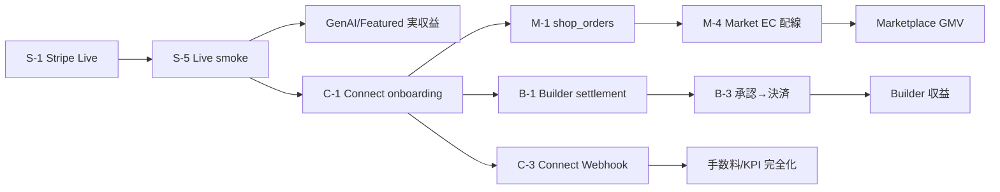

# 収益導線・本番決済レビュー

**作成日:** 2026-06-18  
**種別:** 調査のみ（**コード変更なし**）  
**凍結:** TALK / AI運営司令塔 / サポート導線 — 回帰 PASS 済み（不具合対応以外は変更禁止）

**優先順位:**

| 優先 | 対象 |
|------|------|
| **P0** | 1. Stripe Live · 2. Marketplace Checkout · 3. Builder決済 |
| **P1** | 4. Connect本番 · 5. 安否本番 |

**参照:** [`stripe-webhook-final-check.md`](stripe-webhook-final-check.md) · [`platform-phase-next-review.md`](platform-phase-next-review.md) · [`pre-production-p0-action-plan.md`](pre-production-p0-action-plan.md) · [`market-ec-release-status.md`](market-ec-release-status.md) · [`builder-release-status.md`](builder-release-status.md) · [`connect-release-status.md`](connect-release-status.md) · [`anpi-release-status.md`](anpi-release-status.md)

---

## エグゼクティブサマリー

| 収益ストリーム | コード | Test | Live | 実GMV |
|----------------|--------|------|------|-------|
| GenAI サブスク / チケット | ✅ | ✅ Webhook PASS | ❌ P0-W2 | **不可** |
| Featured 出品課金 | ✅ | ✅ | ❌ P0-W2 | **不可** |
| Market EC 商品販売 | ⚠️ 二系統 | デモのみ | ❌ | **ゼロ** |
| Shop Connect 分配 checkout | ⚠️ Edge 未デプロイ | — | ❌ | **不可** |
| Builder 完了→決済 | ❌ 未配線 | — | ❌ | **不可** |
| Connect 売主受取 / 手数料 | UI のみ | sim | ❌ | **不可** |
| 安否 LINE | ✅ 製品 PASS | mock | ❌ | 直接売上なし |

**結論:** 実売上が発生する唯一の近道は **GenAI + Featured の Stripe Live 切替（P0-1）**。Marketplace GMV と Builder 収益化は **Connect + shop_orders + フロー配線** が前提で、いずれも P0 単体では完結しない。

---

## 1. Stripe Live

### 現状

Stripe は **Supabase Edge Functions + Hosted Checkout** 構成。クライアントに `pk_test_` / `pk_live_` はなく、anon キー経由で Edge Function を呼び出し Stripe へリダイレクトする。

```
Stripe Dashboard ──POST──> stripe-webhook (唯一のサーバー Webhook)
                              ├── GenAI (subscriptions / entitlements / 3D tickets)
                              └── Featured listings

フォールバック（Webhook 非依存・JWT なし）:
  stripe-confirm-checkout / stripe-confirm-genai-checkout / stripe-confirm-shop-checkout

Connect / 運営 KPI:
  stripe-connect-ingest.js → localStorage のみ（本番 HTTP endpoint なし）
```

**プロジェクト:** `ddojquacsyqesrjhcvmn`  
**Webhook URL:** `https://ddojquacsyqesrjhcvmn.supabase.co/functions/v1/stripe-webhook`  
**Secrets（Supabase）:** `STRIPE_SECRET_KEY`, `STRIPE_WEBHOOK_SECRET`, GenAI Price IDs 4種 — 設定済み（Test 想定）

### 完了

| 項目 | 根拠 |
|------|------|
| `stripe-webhook` 実装（署名検証・DB apply） | `supabase/functions/stripe-webhook/index.ts` · ACTIVE v21 |
| GenAI checkout / confirm / plan / portal | `stripe-create-genai-checkout`, `stripe-confirm-genai-checkout`, `stripe-get-genai-plan`, `stripe-create-genai-portal` |
| Featured checkout / confirm | `stripe-create-checkout`, `stripe-confirm-checkout` |
| Shop checkout **コード** | `stripe-create-shop-checkout`, `stripe-confirm-shop-checkout`, `apply-shop-order.ts` |
| Service fee create | `stripe-create-service-fee` |
| Test Webhook 配線 PASS（P0-W1） | `reports/stripe-webhook-p0-w1-delivery-check.md` — confirm 前 DB 更新を確認 |
| GenAI E2E スモーク | `scripts/test-genai-stripe.mjs` PASS |
| 秘密鍵スキャン | `scripts/scan-staged-secrets.mjs` |

### 未完了

| 項目 | 影響 |
|------|------|
| **Live `sk_live_` + Live `whsec_`（P0-W2）** | 全 Stripe 実収益ブロック |
| **Live Price IDs**（GenAI 4種 + Featured） | Live checkout 失敗 |
| **`SITE_URL` 本番ドメイン** | success/cancel URL が localhost フォールバック |
| Shop Functions **未デプロイ** | Marketplace GMV 不可 |
| **`stripe-confirm-service-fee` 未実装** | プラットフォーム手数料 confirm 不可 |
| Webhook: `shop_product` / `service_platform_fee` 分岐なし | success_url 依存のみ |
| Connect イベント（`account.*`, `payout.*`, dispute 等）未処理 | 売主状態・出金同期不可 |
| confirm-* 関数 JWT 未検証 | session_id 悪用リスク（P1-W2） |
| `stripe_webhook_events` 冪等テーブルなし | 監査・再送追跡弱い |
| E2E simulate 関数が prod にデプロイ可能 | テスト専用関数の本番制限 |

### localStorage依存

| キー / モジュール | 用途 | 本番影響 |
|-------------------|------|----------|
| `tasu_stripe_event_ingest_logs_v1` | Connect ingest シミュログ | 運営 KPI が実 Stripe と不一致 |
| `tasu_stripe_ingest_mode_v1` | `simulation`（デフォルト） | 本番 ingest 未接続 |
| `tasu_shop_orders` | Shop デモ注文 | KPI connectRevenue がデモ由来 |
| `tasu_ai_kpi_center_snapshots_v1` | KPI スナップショット | 観測のみ |

**Stripe 秘密鍵は localStorage に保存されていない**（Supabase Secrets のみ）。

### 本番前必須

| # | 作業 | 種別 | 依存 |
|---|------|------|------|
| S-1 | Stripe Dashboard **Live** Webhook 登録 + `whsec_` を Supabase に設定 | Ops | — |
| S-2 | `STRIPE_SECRET_KEY` を `sk_live_` に切替 | Ops | S-1 |
| S-3 | Live Price IDs 4種 + Featured Price を Secrets / Catalog に反映 | Ops | S-2 |
| S-4 | `SITE_URL` を本番ドメインに設定 | Ops | S-2 |
| S-5 | Live smoke: checkout → **confirm を呼ばない** → Webhook で DB 更新確認 | QA | S-1〜S-4 |
| S-6 | `supabase functions list` で shop / GenAI / webhook が ACTIVE であることを確認 | Ops | — |
| S-7 | `stripe-e2e-*` 関数の本番アクセス制限 | Ops | S-2 |

### 後回し可能

| 項目 | 理由 |
|------|------|
| confirm-* JWT バインディング | Live 初期は Webhook 主経路で運用可能（P1） |
| `stripe_webhook_events` 監査テーブル | 観測性 P2 |
| Connect イベント Webhook 拡張 | Marketplace/Connect Epic と同時（P1） |
| Dashboard delivery スクリーンショット | 運用記録 P2 |

### 想定工数

| フェーズ | 工数 | 内訳 |
|----------|------|------|
| **GenAI + Featured Live 切替** | **2〜3 人日** | Dashboard 設定 · Secrets · smoke · ロールバック手順 |
| Shop Functions デプロイ + Live smoke | **1 人日** | deploy · `shop_orders` 前提 |
| Connect Webhook 拡張（別 Epic） | **5〜8 人日** | 新イベント分岐 · DB 同期 · ingest サーバー化 |

### リスク

| リスク | 深刻度 | 対策 |
|--------|--------|------|
| Test/Live Price ID 混在で checkout 失敗 | 高 | 切替チェックリスト · ロールバック手順 |
| confirm フォールバック悪用 | 中 | P1 で JWT バインディング |
| Live 切替後も Marketplace UI がデモ checkout のまま | 高 | Market EC 凍結解除 + 配線（§2） |
| Webhook 未達時の entitlement 未付与 | 高 | Live smoke で confirm 非呼出を必須化 |

### Stripe 利用箇所一覧

| 領域 | クライアント | Edge Function | Webhook |
|------|-------------|---------------|---------|
| GenAI | `gen-ai-workspace.js`, `stripe-genai-config.js` | create/confirm/plan/portal | ✅ |
| Featured | `listing-featured.js`, `stripe-featured-config.js` | create/confirm | ✅ |
| Shop | `shop-checkout.js`, `checkout-page.js`, `stripe-shop-config.js` | create/confirm-shop | ❌ |
| Service fee | `service-fee-pay.js`, `stripe-service-fee-config.js` | create only | ❌ |
| Connect onboarding | `payment-settings.js` | **なし** | ❌ |
| Builder | **なし**（GenAI workspace 間接のみ） | — | GenAI 経由 |

---

## 2. Marketplace

### 現状

**二系統の checkout が共存**し、凍結 UI（Path A）と Stripe Connect 設計（Path B）が未統合。

| Path | 入口 | 決済 | 永続化 |
|------|------|------|--------|
| **A. TASFUL市場（RELEASE FROZEN）** | `shop-market-checkout.html` | **モック**（決済なし） | localStorage |
| **B. Shop Connect（設計済み）** | `checkout.html` | Stripe Hosted + destination charge | `shop_orders` Supabase |

```
Path A（現行ユーザー導線）:
  detail-shop-product.html → shop-market-product-detail.js (buyNow)
  → shop-market-checkout.js → localStorage → shop-market-complete.html

Path B（未配線）:
  checkout.html → shop-checkout.js → stripe-create-shop-checkout
  → Stripe → order-complete.html → stripe-confirm-shop-checkout → shop_orders
```

**重要:** `detail-shop-product.html` の購入ボタンは **Path A** へ向く。`detail-shop-product-page.js`（Stripe 経路）は HTML に未 include。

### 完了

| 項目 | 根拠 |
|------|------|
| Market EC UI（TOP/検索/詳細/checkout/完了）RELEASE FROZEN | `market-ec-release-status.md` |
| ユーザー導線 E2E PASS | `scripts/review-market-user-flow.mjs` |
| listings RLS P1–P3 · verify 38/38 | `marketplace-rls-final-lock-review.md` |
| Shop Stripe Edge **コード** | `stripe-create-shop-checkout`, `stripe-confirm-shop-checkout`, `apply-shop-order.ts` |
| Payout 解決ロジック | `resolve-shop-payout.ts` → `business_listings` |
| TALK 購入通知（デモ） | `shop-market-notify.js` |
| Featured 課金 Webhook 分岐 | `stripe-webhook` に `listing_id` + `featured_plan` |

### 未完了

| 項目 | 影響 |
|------|------|
| **`shop_orders` テーブル未デプロイ** | REST 404 · 注文永続化不可 |
| Shop Edge Functions **未デプロイ** | Stripe checkout 呼出不可 |
| Path A → Path B **未接続** | ユーザー購入が常にデモ |
| Webhook `shop_product` 分岐なし | ブラウザ閉じで注文消失リスク |
| 注文履歴 / 売上 KPI が localStorage | 管理画面が実売上と不一致 |
| `shop_orders` RLS ポリシー未整備 | デプロイ時セキュリティ gap |
| 出品 `publishSellerProduct()` → localStorage | 本番在庫不在 |
| 住所 `DEMO_ADDRESS` 固定 · 送料 0 | 実配送不可 |
| カート Stripe checkout | Path B は単品のみ |

### localStorage依存

| キー | ファイル | 用途 |
|------|----------|------|
| `tasu_market_cart_count` / `tasu_market_cart_items` | `shop-market-product-data.js` | カート |
| `tasu_market_last_order` | 同上 | 完了ページ表示 |
| `tasu_market_order_history` | 同上, `shop-market-order-history.js`, `shop-market-seller-orders.js`, `shop-market-event-store.js` | 注文履歴 · 売主管理 · KPI 合成 |
| `tasu_shop_orders` | `shop-checkout.js`, `admin-ai-ops-watch.js`, `admin-ai-kpi-center.js` | デモ Stripe 注文 · Connect KPI |
| `tasu_market_admin_events_v1` | `shop-market-event-store.js` | 管理イベントログ |
| `tasu_market_notify_sent_v1` | `shop-market-notify.js` | TALK 通知 dedupe |
| `tasu_market_favorites` / `_favorite_items` / `_recent_*` | `shop-market-product-data.js` | UX（決済非依存） |
| `tasu_market_seller_products` / `_seller_profile` | 同上 | 出品デモ |
| `shop_store_products` | `shop-store-products-db.js` | 店舗商品（Supabase fallback） |
| `tasful_listings` | `listing-local-store.js` | 出品プール fallback |

**注:** checkout ページでは `shop-market-event-store.js` が未 load のため、`recordCheckout` は no-op。

### 本番前必須

| # | 作業 | 種別 | 依存 |
|---|------|------|------|
| M-1 | `supabase/shop_orders.sql` + RLS を本番 DB デプロイ | SQL/Ops | — |
| M-2 | `stripe-create-shop-checkout` / `stripe-confirm-shop-checkout` デプロイ | Edge/Ops | S-2 Live 鍵 |
| M-3 | Live Webhook または confirm 経路で shop 注文 E2E smoke | QA | M-1, M-2, S-1 |
| M-4 | **Market EC 凍結解除** — buy CTA を `checkout.html`（Path B）へ接続 | 製品 | M-2 |
| M-5 | 注文履歴 API — `shop_orders` 読取に置換 | 製品 | M-1 |
| M-6 | 売主注文管理 — `seller_user_id` / `shop_id` フィルタ | 製品 | M-1 |
| M-7 | KPI center — `shop_orders` Supabase クエリ | 製品 | M-1 |
| M-8 | 出品永続化 — `business_listings` + JWT オーナー CRUD | 製品/Auth | marketplace RLS 済 |
| M-9 | Webhook `checkout.session.completed` + `order_type: shop_product` | Edge | M-2 |

### 後回し可能

| 項目 | 理由 |
|------|------|
| カート複数品 Stripe checkout | 単品 MVP で GMV 開始可 |
| 在庫減算 | 初期は手動運用 |
| `DEMO_CATALOG` 除去 | カタログ整備 P2 |
| PC CTA 42px 等 UX WARNING | P2 |
| `shop_notified` バックグラウンド通知 | P2 |

### 想定工数

| フェーズ | 工数 | 内訳 |
|----------|------|------|
| DB + Edge デプロイ + smoke | **2〜3 人日** | M-1, M-2, M-3 |
| フロー配線 + 凍結解除 | **3〜5 人日** | M-4, buy 導線, 住所 |
| 注文履歴 / 売主 / KPI 接続 | **5〜7 人日** | M-5〜M-7 |
| Webhook バックアップ + RLS 強化 | **2〜3 人日** | M-9 |
| **合計（Marketplace GMV 開始）** | **12〜18 人日** | Connect 売主 onboarding 前提 |

### リスク

| リスク | 深刻度 | 対策 |
|--------|--------|------|
| Path A デモのまま Live 切替しても GMV ゼロ | 高 | M-4 を Live と同時リリース |
| 売主 `payout_enabled=false` で checkout 失敗 | 高 | Connect onboarding 先行（§4） |
| success_url 未到達で注文未保存 | 中 | M-9 Webhook |
| 同一ブラウザのみ売主/買主ステータス同期 | 中 | M-6 サーバー truth |
| Market EC 凍結解除による回帰 | 中 | `review-market-user-flow.mjs` 再実行 |

### 注文フロー詳細

| ステップ | Path A（現行） | Path B（本番設計） |
|----------|----------------|-------------------|
| 注文作成 | `confirmOrder()` 即時 | `createCheckoutSession()` → Stripe Session |
| 決済 | なし（UI のみ） | Stripe Hosted Checkout |
| 完了 | `tasu_market_last_order` 書込 | `confirmCheckoutSession()` → `upsertShopOrderFromCheckout` |
| 状態更新 | `updateOrderStatus()` localStorage | `shop_orders.payment_status` / `payout_status` |
| 売上反映 | `TasuMarketEventStore.synthesizeFromOrderHistory` | `seller_amount`, `platform_fee_amount` in DB |
| 出品者反映 | 同一 LS キー共有（同一端末のみ） | `shop_id` / `seller_stripe_account_id` |

---

## 3. Builder

### 現状

Builder は **運用クローズ（完了→承認→チャットロック→評価）が RELEASE FROZEN PASS** だが、**収益ループは未実装**。全 MVP 状態は localStorage。Supabase DDL はリポジトリに存在するが **未実行**。

```
完了報告 submitThreadCompletionReport()
  → status: completion_pending
  → TALK notify (completion_submitted)

承認 approveThreadCompletionReport()
  → status: completed
  → chat lock + review_request notify
  → ❌ 決済 / Connect / sales-fees 連携なし

支払い導線:
  builder/user-dashboard.html → ../sales-fees.html（業務サービス Connect 取引 · Builder 非連動）
```

### 完了

| 項目 | 根拠 |
|------|------|
| 完了報告 / 承認 / 却下フロー | `builder/builder.js` · E2E PASS |
| 3 フロー general-flow 45/45 | `builder-general-flow.js` |
| TALK 通知チェーン | `talk-builder-notify-master-v1.js` · 7/7 |
| パートナー評価（localStorage + ops 部分 Supabase） | `builder-partner-evaluation-store.js` |
| Supabase **設計** | `sql/builder-schema.sql`, RLS, Storage, migration script |
| Export bridge | `buildSupabaseReadyPayload()` — completion_reports, invoice_meta 含む |

### 未完了

| 項目 | 影響 |
|------|------|
| **承認後の決済 emit なし** | 収益ゼロ |
| Builder 内 Stripe / Connect 参照 **ゼロ** | 決済基盤未接続 |
| `sales-fees.html` は `TasuServiceDealsDb`（業務サービス）のみ | Builder 取引未表示 |
| PDF 生成 stub | 請求書として不可用 |
| `invoice_meta.finalized` ワークフロー未配線 | B2B 請求不可 |
| Supabase schema **未実行** | マルチデバイス不可 |
| デモロール切替 · ログイン未実装 | 本番 Auth 不可 |
| `builder-create-signed-url` ドラフト · RPC TODO | 添付本番不可 |
| `payment_completed` notify 行は **静的 seed のみ** | 実イベント未生成 |

### localStorage依存

| キー | 用途 |
|------|------|
| `tasful:builder:mvp:v1` | プロジェクト · スレッド · 応募 · 完了報告（**中核**） |
| `tasful:builder:mvp:threads:v1` | スレッド索引 |
| `tasful:builder:mvp:role` / `:partner_id` | デモロール |
| `tasful:builder:mvp:notifications:v1` | Builder 内通知 |
| `tasful:builder:admin:partners:v1` 等 | 管理データ |
| `tasful:builder:partner_evaluations:v1` 等 | 評価 |
| `tasful_talk_notifications` | TALK 通知（外部 · 完了チェーン） |

### Supabase未接続箇所

| 領域 | 状態 |
|------|------|
| `builder_projects`, `builder_threads`, `builder_messages` | DDL のみ · UI 未接続 |
| `builder_completion_reports` | export bridge のみ |
| `builder_invoice_meta`, `builder_pdf_outputs` | 同上 |
| **決済 / settlement テーブル** | **スキーマ自体なし** |
| Partner evaluations | ops admin のみ partial read/write |
| Edge `builder-create-signed-url` | ドラフト · 未デプロイ |
| Migration `--execute` | TODO |

### 本番前必須

| # | 作業 | 種別 | 依存 |
|---|------|------|------|
| B-1 | settlement / deal モデル設計（amount, platform_fee, payout_status） | 設計+SQL | — |
| B-2 | `approveThreadCompletionReport()` から deal レコード emit | 製品 | B-1, Connect |
| B-3 | 決済 UI（承認後ステップ or Connect カード流用） | 製品 | S-2, C-1 |
| B-4 | Supabase schema + RLS + Storage **実行** | Ops | — |
| B-5 | JWT claims + 本番 Auth | Auth | B-4 |
| B-6 | Migration `--execute` | Ops | B-4 |
| B-7 | 実 PDF 生成（完了報告 / 請求書） | 製品 | — |
| B-8 | Builder 売上ビュー（`sales-fees` 拡張 or 専用） | 製品 | B-1, B-2 |

### 後回し可能

| 項目 | 理由 |
|------|------|
| dual-window bench flaky | QA P2 |
| 390px ボタン到達性 | UX P2 |
| 評価 Supabase スキーマ単独実行 | localStorage MVP 完結 |
| `[data-builder-board-thread-invoice]` 表示 | B-7 と同時で可 |

### 想定工数

| フェーズ | 工数 | 内訳 |
|----------|------|------|
| Deal モデル + 承認連携 | **3〜5 人日** | B-1, B-2 |
| Supabase 基盤（schema/auth/migration） | **5〜8 人日** | B-4〜B-6 |
| 決済 UI + Connect 接続 | **5〜8 人日** | B-3 · Connect Epic 依存 |
| PDF + 売上ビュー | **3〜5 人日** | B-7, B-8 |
| **合計（Builder 収益化）** | **16〜26 人日** | Connect + Stripe Live 前提 |

### リスク

| リスク | 深刻度 | 対策 |
|--------|--------|------|
| Builder 単独では収益化不可（Connect 必須） | 高 | §4 と並行計画 |
| settlement スキーマ未設計のまま patch 連鎖 | 中 | B-1 を先行 |
| localStorage データ移行失敗 | 中 | dry-run migration 検証 |
| 承認後未払いのまま chat lock | 中 | 決済ゲート設計 |

### Connect 連携参照点（Builder 外 · 流用候補）

| モジュール | 役割 |
|------------|------|
| `platform-chat-connect-chat-flow.js` | completion → payment カード |
| `platform-chat-fee-pay.js` | 手数料決済 UI |
| `tasful_platform_connect_payments_v1` | Connect 決済 localStorage |
| `TasuServiceDealsDb` / `business-service-sales-db.js` | 既存 deal モデル（業務サービス） |

---

## 4. Connect

### 現状

Connect は **UX / ops シミュレーション RELEASE FROZEN PASS**。**実 Stripe Connect API・サーバー Webhook は未接続**。売主状態は localStorage ステップマシン。

```
payment-settings.js / connect-member-ui.js
  → tasful_connect_onboarding_v1 (localStorage)
  → identity submit = デモボタン（AccountLink なし）

stripe-connect-ingest.js
  → ingestSimulatedEvent() のみ本番経路
  → support ticket + connect_issue + AI ops + KPI

Shop 分配決済（コードのみ）:
  stripe-create-shop-checkout → destination charge + application_fee
  → business_listings.stripe_account_id / payout_enabled 必須
```

### 完了

| 項目 | 根拠 |
|------|------|
| Connect ハブ UX（identity → qualification → ready） | `payment-settings.js` · 36 PASS |
| TALK Connect 取引 UX（完了カード · 手数料ゲート） | `platform-chat-connect-*.js` |
| 運営トラブル ingest → チケット | `stripe-connect-ingest.js` · 13/13 |
| Marketplace payout **コード** | `stripe-create-shop-checkout`, `resolve-shop-payout.ts` |
| イベント分類マップ（14+ 種） | `stripe-connect-event-map.js` |
| GenAI / Featured Webhook（Connect とは別経路） | Test PASS |

### 未完了

| 項目 | 影響 |
|------|------|
| **`accounts.create` / AccountLink 未実装** | 売主 `acct_*` 不在 |
| Connect Webhook サーバー処理なし | 状態同期不可 |
| ingest 本番 HTTP endpoint なし | 運営 KPI が sim のみ |
| `stripe_account_id` Supabase 永続化未配線 | Shop checkout 前提不成立 |
| `stripe-confirm-service-fee` + Webhook なし | TALK 手数料 5% 自動決済不可 |
| Live Stripe 未切替 | 全 Connect 収益不可 |
| Connect trouble DDL ドラフトのみ | 監査ログ弱い |
| サーバー JWT + Connect 状態検証 | クライアント信頼のみ |

### localStorage依存

| キー | 用途 |
|------|------|
| `tasful_connect_onboarding_v1` | オンボーディングステップ |
| `tasful_demo_connect_seller_status_v1` | 売主 Connect 状態 |
| `tasful_payment_settings` | 設定デモ blob |
| `tasu_stripe_ingest_mode_v1` | simulation / production 切替（endpoint なし） |
| `tasu_stripe_event_ingest_logs_v1` | ingest 監査 |
| `tasu_connect_issues_v1` | Connect issue レコード |
| `tasu_offplatform_risk_events_v1` | オフプラットフォームリスク |
| `tasful_platform_connect_payments_v1` | TALK Connect 決済デモ |

### 本番前必須

| # | 作業 | 種別 | 依存 |
|---|------|------|------|
| C-1 | Stripe Connect onboarding API（accounts.create + AccountLink） | 新規 Edge | S-2 |
| C-2 | `stripe_account_id` / `payout_enabled` を `business_listings` 等に永続化 | DB+Webhook | C-1 |
| C-3 | Webhook: `account.*`, `capability.updated`, `payout.*`, dispute | Edge 拡張 | S-1 |
| C-4 | ingest をブラウザ → サーバー Edge へ移行 | Edge | C-3 |
| C-5 | Shop Functions + `shop_orders` デプロイ（§2 共通） | Ops | M-1, M-2 |
| C-6 | `stripe-confirm-service-fee` + Webhook 分岐 | Edge | S-2 |
| C-7 | JWT + Connect 状態サーバー検証 | Auth | C-2 |
| C-8 | Live smoke: onboarding → payout_enabled → shop checkout | QA | C-1〜C-5 |

### 後回し可能

| 項目 | 理由 |
|------|------|
| payout requirement stale 表示 | P2 UX |
| payout エラー再セットアップ wizard | P2-9 |
| Category bench ヘッドレス timeout | QA のみ |
| `stripe_webhook_events` 冪等 | P2 観測 |

### 想定工数

| フェーズ | 工数 | 内訳 |
|----------|------|------|
| Connect onboarding Edge + UI 接続 | **5〜7 人日** | C-1, C-2 |
| Webhook + ingest サーバー化 | **5〜8 人日** | C-3, C-4 |
| Service fee confirm + smoke | **2〜3 人日** | C-6 |
| **合計（Connect 本番）** | **12〜18 人日** | Marketplace と C-5 共有 |

### リスク

| リスク | 深刻度 | 対策 |
|--------|--------|------|
| Marketplace GMV が Connect なしでは開始不可 | 高 | C-1 を M-2 と並行 |
| 本人確認追加情報（requirements_past_due）の見逃し | 中 | C-3 Webhook + 既存 trouble UI |
| ブラウザ sim ingest が本番で残存 | 高 | C-4 + mock キー削除手順 |
| dispute / chargeback 未自動化 | 中 | C-3 + evidence pack 連携 |

### 機能別マップ

| 機能 | 現状 | 本番に必要 |
|------|------|------------|
| onboarding | localStorage ステップ | C-1 AccountLink |
| account_link | **未実装** | C-1 |
| webhook | sim のみ | C-3 |
| 本人確認 | デモ submit ボタン | C-1 + `account.updated` |
| 出金 | UI 表示 · sim イベント | C-3 `payout.*` |
| 失敗時 | ingest → ticket（sim） | C-4 サーバー ingest |

---

## 5. 安否

### 現状

安否は **製品 12 領域 + Phase2 no-response RELEASE FROZEN PASS**。**直接売上はない**が、信頼・解約抑止に影響。本番 gap は **LINE Edge 未デプロイ** と **mock フラグ**。

```
anpi-notification-log.js
  → anpi-line-send Edge（リポジトリのみ · 未デプロイ）
  → ANPI_LINE_MOCK=1 or missing token → mock

Supabase:
  → core + Phase2 RLS prod 定義済
  → linked DB: dev RLS DROP PASS (2026-06-17)
  → verify 17/17 PASS (JWT fresh 時)
```

### 完了

| 項目 | 根拠 |
|------|------|
| コア 12 領域 UX RELEASE FROZEN | `anpi-release-status.md` |
| No-response Phase2（schema · RLS · service · E2E） | `anpi-no-response-phase2-implementation.md` |
| LINE Edge **コード** | `anpi-line-send`, `anpi-line-token-exchange` |
| RLS 検証 17/17（JWT fresh） | `anpi-rls-jwt-refresh-result.md` |
| dev RLS DROP（core + Phase2） | `dev-rls-p0-drop-result.md` |
| Ops 読取（Inbox · Watch · 司令塔） | admin-ai-* · talk-hub-ops-anpi |
| E2E（dashboard 37/38 · notifications 26/26 · line 26/26） | 各 test-anpi-*.mjs |

### 未完了

| 項目 | 影響 |
|------|------|
| **LINE Edge Functions 未デプロイ** | 実 LINE 配信不可 |
| クライアント mock localStorage キー残存 | 本番誤 mock |
| No-response timeout が **クライアント polling のみ** | 取りこぼしリスク |
| Edge cron for timeout **未構築** | 可用性 |
| 本番 DB への SQL 適用確認（環境差） | セキュリティ |
| TALK 配信 E2E headless flaky | 低（TALK 凍結境界） |

### localStorage依存

| キー / フラグ | 用途 |
|---------------|------|
| `tasu_anpi_line_send_mock_v1` | LINE 送信 mock 強制 |
| `tasu_anpi_context_supabase_mock_v1` | context mock |
| `tasu_anpi_notification_logs_supabase_mock_v1` | ログ mock |
| `tasu_anpi_no_response_phase2_mock_v1` | Phase2 timeout mock |
| `tasful_anpi_notify_demo_v1` | ダッシュボード seed |
| `window.__ANPI_LINE_SEND_MOCK__` | テスト override |

**Edge:** `ANPI_LINE_MOCK`, `ANPI_LINE_TOKEN_MOCK` — 本番は unset / `0`

### 本番前必須

| # | 作業 | 種別 | 依存 |
|---|------|------|------|
| A-1 | `anpi-line-send` / `anpi-line-token-exchange` デプロイ | Edge/Ops | — |
| A-2 | Secrets: `LINE_CHANNEL_ACCESS_TOKEN`, LINE Login ID/Secret · mock off | Ops | A-1 |
| A-3 | クライアント mock キー削除手順 · 本番ビルド確認 | 運用 | A-2 |
| A-4 | LINE Developers callback URL 登録 | Ops | A-1 |
| A-5 | 本番 DB: SQL 1–5 + Phase2 適用確認 · dev 0 rows verify | SQL/Ops | — |
| A-6 | `docs/anpi-line-manual-test.md` 本番 smoke | QA | A-1〜A-4 |
| A-7 | JWT 発行・ローテーション運用 | Ops | A-5 |
| A-8 | No-response timeout Edge + cron（推奨） | Edge | Phase2 |

### 後回し可能

| 項目 | 理由 |
|------|------|
| dashboard quick-action E2E 1件 | P2 |
| LINE バッジ文言統一 | P2 |
| TALK delivery headless 安定化 | TALK 凍結 · P2 |
| 複数緊急連絡先 | Phase3+ |

### 想定工数

| フェーズ | 工数 | 内訳 |
|----------|------|------|
| LINE Edge デプロイ + secrets + smoke | **2〜3 人日** | A-1〜A-6 |
| RLS 本番確認 + JWT 運用 | **1 人日** | A-5, A-7 |
| timeout cron Edge | **2〜3 人日** | A-8 |
| **合計（安否本番）** | **5〜7 人日** | 収益非依存 · P1 |

### リスク

| リスク | 深刻度 | 対策 |
|--------|--------|------|
| mock フラグ残存で LINE 未送信 | 高 | A-3 チェックリスト |
| dev RLS 再混入 | 高 | staging-verify section 3 = 0 |
| LINE API コスト未見積 | 低 | 配信量モニタ |
| クライアント timeout のみで escalation 漏れ | 中 | A-8 cron |

---

## 6. 本番売上発生までの最短クリティカルパス

以下は **実際に売上（GMV / サブスク）が発生する** ための順序。安否（§5）は信頼基盤だが **直接売上には含めない**。

### Phase 0 — 即時収益（GenAI + Featured）【P0 · 2〜3 人日】

```
Step 1  Stripe Live 鍵 + Live Webhook whsec_ 設定          [S-1, S-2]
Step 2  Live Price IDs + SITE_URL 本番ドメイン              [S-3, S-4]
Step 3  Live smoke（confirm 非呼出 · Webhook DB 更新確認）   [S-5]
        ──> GenAI サブスク / 3D·2D チケット / Featured 課金 が実収益化
```

**この時点で発生する売上:** GenAI · Featured のみ（Marketplace / Builder は未発生）

---

### Phase 1 — Marketplace GMV【P0 · 12〜18 人日 · Connect 前提】

```
Step 4  Connect onboarding API + 売主 acct_* 永続化       [C-1, C-2]  ← Marketplace の前提
Step 5  shop_orders DDL + RLS デプロイ                        [M-1]
Step 6  stripe-create/confirm-shop-checkout デプロイ        [M-2, C-5]
Step 7  Live shop checkout E2E smoke                          [M-3]
Step 8  Market EC 凍結解除 · buy → checkout.html 配線         [M-4]
Step 9  Webhook shop_product バックアップ                       [M-9]
Step 10 注文履歴 / KPI を shop_orders 接続                    [M-5, M-7]
        ──> Marketplace 商品販売 GMV + プラットフォーム手数料
```

**ブロッカー:** Step 4 がなければ Step 7 で `payout_enabled` エラー。

---

### Phase 2 — Builder 収益化【P0 · 16〜26 人日 · Phase 0–1 後】

```
Step 11 Builder settlement モデル設計                       [B-1]
Step 12 Supabase schema 実行 + Auth                         [B-4, B-5]
Step 13 承認 → deal emit + 決済 UI                          [B-2, B-3]
Step 14 実 PDF + Builder 売上ビュー                           [B-7, B-8]
        ──> B2B 取引完了後のプラットフォーム課金
```

---

### Phase 3 — Connect / 手数料完全化【P1 · 12〜18 人日】

```
Step 15 Connect Webhook（account/payout/dispute）            [C-3]
Step 16 ingest サーバー化                                     [C-4]
Step 17 service-fee confirm + Webhook                         [C-6]
Step 18 JWT + Connect サーバー検証                            [C-7]
        ──> TALK 取引手数料 5% · チャット開始料 · 運営 KPI 実データ化
```

---

### Phase 4 — 安否本番【P1 · 5〜7 人日 · 収益非依存】

```
Step 19 LINE Edge デプロイ + secrets + mock 除去             [A-1〜A-6]
Step 20 RLS 本番確認 + timeout cron                          [A-5, A-8]
        ──> 信頼 · 解約抑止（直接売上なし）
```

---

### クリティカルパス図（売上視点）



### 順序サマリー（番号付き）

| 順 | タスク | 売上への効果 | 優先 | 工数 |
|----|--------|--------------|------|------|
| **1** | Stripe Live + Webhook + smoke | GenAI / Featured **即収益** | P0 | 2〜3d |
| **2** | Connect onboarding + DB 永続化 | Marketplace / Builder の **前提** | P0 | 5〜7d |
| **3** | shop_orders + Shop Edge デプロイ | Marketplace **GMV** | P0 | 2〜3d |
| **4** | Market EC checkout 配線（凍結解除） | ユーザー購入体験接続 | P0 | 3〜5d |
| **5** | Builder settlement + Supabase + 決済 | B2B **取引課金** | P0 | 16〜26d |
| **6** | Connect Webhook + ingest サーバー化 | 手数料 / KPI **実データ** | P1 | 5〜8d |
| **7** | 安否 LINE 本番 | 信頼（非売上） | P1 | 5〜7d |

**最短で「最初の1円」:** Step **1** のみ（GenAI / Featured）。  
**最短で「Marketplace GMV」:** Step **1 → 2 → 3 → 4**（約 **12〜18 人日**）。  
**最短で「Builder 収益」:** Step **1 → 2 → 5**（約 **23〜36 人日** · Step 3–4 と並行可）。

---

## 7. 横断 — 収益ストリーム × ブロッカー

| 収益 | 現状 | 最短 unblock | 担当章 |
|------|------|--------------|--------|
| GenAI サブスク | Test PASS | S-1〜S-5 | §1 |
| Featured 課金 | Test PASS | S-1〜S-5 | §1 |
| Market EC GMV | デモ checkout | M-1〜M-4 + C-1 | §2, §4 |
| Shop Connect 分配 | コードのみ | M-2, C-5 | §2, §4 |
| TALK 手数料 5% | localStorage | C-6, C-3 | §4 |
| Builder 完了課金 | 未配線 | B-1〜B-3 | §3 |
| 安否 | mock LINE | A-1〜A-3 | §5（非売上） |

---

## 8. 検証コマンド（調査再現用）

| 用途 | コマンド |
|------|----------|
| GenAI Stripe smoke | `node scripts/test-genai-stripe.mjs` |
| Stripe Webhook P0-W1 | `reports/stripe-webhook-p0-w1-delivery-check.md` 手順 |
| Marketplace RLS | `node scripts/verify-marketplace-rls.mjs` |
| Market EC 導線 | `node scripts/review-market-user-flow.mjs` |
| Connect 導線 | `node scripts/review-connect-user-flow.mjs` |
| Connect trouble | `node scripts/test-stripe-connect-trouble-hardening-browser.mjs` |
| Builder 導線 | `node scripts/review-builder-user-flow.mjs` |
| 安否 Phase2 | `node scripts/test-anpi-no-response-phase2-browser.mjs` |
| 安否 RLS | `node scripts/verify-anpi-rls-real-db.mjs` |
| TALK/司令塔回帰（凍結域） | `node scripts/test-tasful-regression-final.mjs` |

---

**判定:** P0 三项（Stripe Live · Marketplace Checkout · Builder決済）のうち、**即実行可能なのは Stripe Live のみ**。Marketplace と Builder は **Connect onboarding + shop_orders** を挟まないと GMV / 取引課金は成立しない。Connect と安否は P1 だが、Marketplace GMV の **物理的前提** は Connect（P0 内 Step 2）である。
