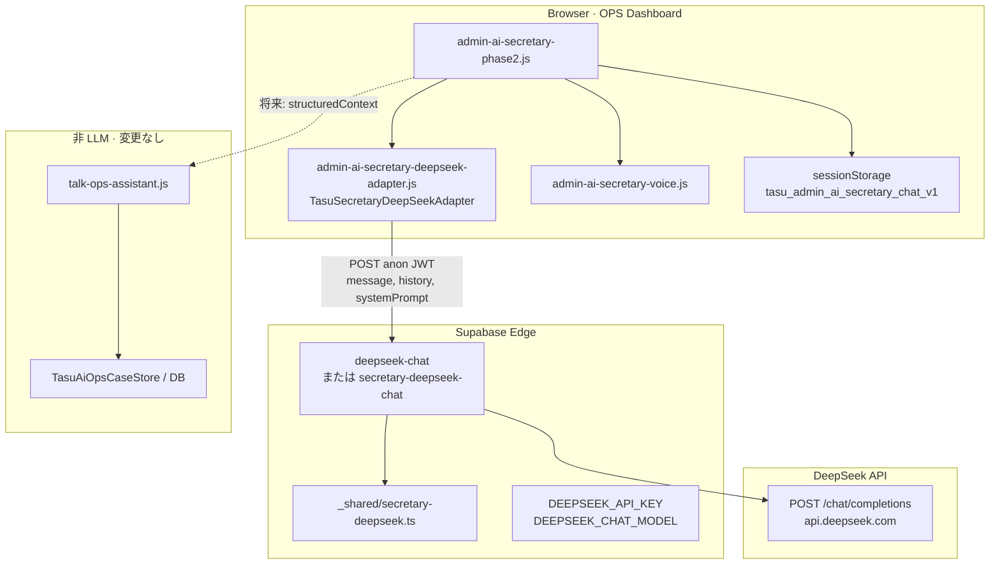
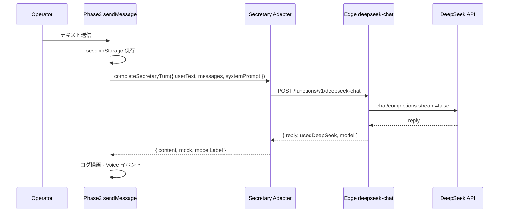

# AI 秘書 — DeepSeek 専用 Adapter 設計（P0-3 調査）

**実施日:** 2026-06-26  
**状態:** 設計調査完了 → **Phase 1 実装時に Secret 保管先を Cloudflare に変更**（`reports/secretary-deepseek-adapter-phase1.md` 参照 · Supabase Secret は不使用）  
**参照:** `docs/TODO.md` §AI秘書 DeepSeek · `docs/AI/SECRETARY_AI.md` · `docs/DECISIONS.md` AD-010 · `reports/ai-secretary-text-chat-first.md`

---

## 目的

AI 運営秘書の LLM 呼び出しを **`TasuAiModelGateway` から分離**し、AD-010 どおり **DeepSeek 専用 Adapter**（クライアント薄層 + Supabase Edge）へ移行する。

| 制約 | 内容 |
| --- | --- |
| AD-010 | Gateway に DeepSeek ルートを **追加しない** |
| AD-005 | `ai-model-gateway.js` 契約は **変更しない** |
| 凍結 | AI 秘書 RELEASE FROZEN — **P0 Critical（本番接続）** のみ例外 |
| スコープ外 | Builder AI · TASFUL AI Workspace · Site Assistant · gen-ai |

---

## 1. 現状構成

### 1.1 レイヤー概要

```
admin-operations-dashboard.html / talk-ops-room.html
  ├─ talk-ops-assistant.js        … 案件集約 · コマンド検索（regex / DB · LLM なし）
  ├─ ops-watch-analyzer.js        … OPS WATCH 分析（Gateway · surface=ops_watch）
  ├─ ai-model-gateway.js          … Gemini / OpenAI / Claude Edge ルーティング
  ├─ admin-ai-secretary-phase2.js … テキストチャット（★ Gateway 依存）
  ├─ admin-ai-secretary-voice.js  … Voice Core（Phase2 応答イベント購読）
  └─ admin-ai-secretary-phase3–8.js … スタブ（LLM 呼び出しなし）
```

### 1.2 Gateway 利用箇所（秘書関連）

| ファイル | 関数 | 呼び出し | surface | 備考 |
| --- | --- | --- | --- | --- |
| **`admin-ai-secretary-phase2.js`** | `requestAssistantReply` | `TasuAiModelGateway.completeTurn` | `ops_secretary` | **唯一の秘書 LLM 経路** |
| `admin-ai-secretary-phase3.js` | — | なし | — | スタブ |
| `admin-ai-secretary-phase4.js` | — | なし | — | スタブ |
| `ops-watch-analyzer.js` | `callAiJsonAnalysis` | `completeTurn` | `ops_watch` | **秘書チャットではない**（OPS WATCH · 現状 Gemini デフォルト） |

**HTML での Gateway 読込:**

| ページ | `ai-model-gateway.js` |
| --- | --- |
| `admin-operations-dashboard.html` | あり（Phase2 + OPS WATCH 共用） |
| `talk-ops-room.html` | あり（Phase2 のみ） |

### 1.3 Phase2 の現行フロー

1. ユーザー入力 → `sendMessage` → `sessionStorage`（`tasu_admin_ai_secretary_chat_v1` · 最大 40 件）
2. `requestAssistantReply` → `Gateway.completeTurn({ surface: "ops_secretary", skipSearch: true, modeId: "ops_secretary", systemPrompt, messages, mockFallback })`
3. Gateway 内部:
   - `TasuAiPlanModels.getSelectedModelId()` → 通常 **gemini-flash**（Workspace 系プラン UI と共有）
   - `TasuAiSearchOrchestrator.prepare`（検索は skip だが orchestrator は実行）
   - `postEdge("gemini-chat" | "openai-chat" | "claude-chat")` — **DeepSeek 分岐なし**
4. 失敗時 `mockSecretaryReply`（クライアントモック）
5. 成功時 `tasu:ai-voice-assistant-reply`（`surface: ops_secretary`）→ Voice 読上げ

### 1.4 Edge Functions（現状）

| Edge | 用途 | 秘書 |
| --- | --- | --- |
| `gemini-chat` | Gemini テキスト / Vision | Gateway 経由で **間接利用** |
| `openai-chat` | OpenAI | 同上 |
| `claude-chat` | Anthropic | 同上 |
| **`deepseek-chat` / `secretary-*`** | — | **未存在** |

DeepSeek 用 Edge · shared · 環境変数は **リポジトリ内に未実装**。

### 1.5 非 LLM 処理（変更しない · AD-010）

| 処理 | 実装 | LLM |
| --- | --- | --- |
| 画面遷移 · ナビ | `admin-operations-dashboard.js` | なし |
| 件数 · KPI | `talk-ops-assistant` metrics | なし |
| DB 検索 · フィルター | `TasuAiOpsCaseStore` · `parseTalkOpsCommand` | なし |
| 運営コマンド | `talk-ops-assistant.postUserCommand`（regex + Action） | なし |

---

## 2. 問題点

| # | 問題 | 影響 |
| --- | --- | --- |
| 1 | **AD-010 違反（実装）** | 秘書が Gateway 経由で Gemini/OpenAI/Claude になりうる |
| 2 | **プロバイダ混在** | 運営秘書と TASFUL AI Workspace が同一 Gateway · 同一モデル selector を暗黙共有 |
| 3 | **不要な orchestrator 実行** | `skipSearch: true` でも `prepare()` が走り、秘書に不要な検索パイプライン依存 |
| 4 | **interaction log 混在** | `TasuAiInteractionLog` に `surface: ops_secretary` が Gateway 経由で混在 |
| 5 | **コスト方針と不一致** | DeepSeek 採用理由（要約 · 低コスト）がコードに反映されていない |
| 6 | **本番接続未完了** | Edge 未設定時は常にモック（`reports/ai-secretary-text-chat-first.md` 設計時点の意図） |
| 7 | **dashboard が Gateway 必須ロード** | Phase2 切替後も OPS WATCH 用に Gateway 残存（秘書だけでは除去不可） |

---

## 3. 目標アーキテクチャ

### 3.1 原則

1. **秘書 LLM = DeepSeek のみ**（Edge で API キー保持）
2. **Gateway 非経由** — `completeTurn` を秘書から呼ばない
3. **データ取得はプログラム** — LLM 入力は「取得済みコンテキスト + ユーザー発話」
4. **既存 UI / Voice / 履歴キーは維持** — Phase2 の DOM · イベント契約は極力不変
5. **OPS WATCH は Phase 1 対象外** — 別 surface · 別プロバイダ方針（現状 Gateway 維持）

### 3.2 Adapter 構成図



### 3.3 シーケンス（Phase 1 · 非ストリーミング）



---

## 4. 調査項目への回答

### 4.1 Gateway 利用箇所（秘書）

**確定:** `admin-ai-secretary-phase2.js` の `requestAssistantReply` のみ（`completeTurn` 1 箇所）。

### 4.2 DeepSeek 依存処理の最小切り出し

| 層 | 責務 |
| --- | --- |
| **Phase2** | UI · 履歴 · loading/error · Voice イベント（**LLM 呼び出しを Adapter に委譲**） |
| **Adapter（新規）** | Supabase URL/anon 解決 · history 整形 · Edge POST · タイムアウト · mock フォールバック |
| **Edge（新規）** | DeepSeek API 呼び出し · プロンプト trim · エラー JSON · **API キー** |
| **将来 shared** | メッセージ build · JSON モード · トークン上限 |

**LLM に渡す入力（Phase 1）:** 既存 `SYSTEM_PROMPT` + `messages`（user/assistant）+ 現在の `userText` — **DB コンテキスト注入は Phase 2**。

### 4.3 新規 Adapter 要否

| 案 | 評価 |
| --- | --- |
| Gateway に DeepSeek 追加 | ❌ AD-010 禁止 |
| Phase2 内に Edge fetch 直書き | △ 可能だがテスト · 再利用 · Edge URL 重複 |
| **専用 Adapter モジュール + Edge** | ✅ **推奨** — openai-chat パターン踏襲 · Gateway と独立 |

### 4.4 Edge エンドポイント構成

| 項目 | 提案 |
| --- | --- |
| **関数名** | `deepseek-chat`（汎用）または `secretary-deepseek-chat`（秘書専用 · 推奨） |
| **メソッド** | `POST` のみ · `OPTIONS` CORS（`_shared/cors.ts`） |
| **Request body** | `{ message, history[], systemPrompt?, mode?, surface? }` — `openai-chat` と同型 |
| **Response** | `{ reply, usedDeepSeek: true, model, error? }` |
| **デプロイ** | `supabase functions deploy secretary-deepseek-chat`（本番 Secret 設定後） |

秘書専用 Edge に `surface === "ops_secretary"` を必須にすると、将来の DeepSeek 誤用を防げる。

### 4.5 API キー管理

| 項目 | 方針 |
| --- | --- |
| **保存場所** | Supabase Edge Secrets **`DEEPSEEK_API_KEY`** |
| **モデル** | **`DEEPSEEK_CHAT_MODEL`**（default: `deepseek-v4-flash` または `deepseek-chat` — デプロイ時に固定） |
| **クライアント** | キー **非露出** · 既存 `TASU_CHAT_SUPABASE_CONFIG` の anon JWT のみ |
| **ローカル** | `.env` / Supabase CLI secrets · **`chat-supabase-config.js` に DeepSeek キーを置かない** |
| **ログ** | Edge レスポンスにキー・生プロンプト全文を含めない |

### 4.6 ストリーミング対応

| フェーズ | 方針 |
| --- | --- |
| **Phase 1** | **非ストリーミング**（現 Phase2 UI は一括 `textContent` 表示） |
| **Phase 2+** | DeepSeek `stream: true` + SSE · Phase2 ログを delta 追記 · Edge `ReadableStream` または fetch SSE プロキシ |
| **Voice** | ストリーミング時も **完了後** `tasu:ai-voice-assistant-reply`（現 Voice Core 契約） |

既存 Edge（`openai-chat` / `gemini-chat`）も非ストリーミング — **Phase 1 は整合**。

### 4.7 エラー処理 · リトライ

| 項目 | Phase 1 方針 |
| --- | --- |
| **タイムアウト** | クライアント **12s**（Gateway `DEFAULT_TIMEOUT_MS` 準拠） |
| **リトライ** | **自動リトライなし**（1 回）— 429/5xx は mock + status error |
| **Edge 未設定** | anon/url 欠如 → 即 mock（現 Phase2 同等） |
| **402/429** | ユーザー向け短い日本語 + OPS 向け `apiError` ログ（console.warn） |
| **UI** | 既存 `[data-ops-phase4-status]` error · モック時「API未接続」表示維持 |

Phase 2 で指数バックオフ 1 回 · 429 専用メッセージを検討。

### 4.8 会話履歴

| 項目 | 現状 | Phase 1 |
| --- | --- | --- |
| **保存** | `sessionStorage` `tasu_admin_ai_secretary_chat_v1` | **維持** |
| **上限** | 40 件 | 維持 |
| **Edge 送信** | Gateway `buildHistory` 相当: 直近 **12 ターン** · 各 **2000 文字** truncate | Adapter 内で同等実装 |
| **サーバー永続** | なし | Phase 2 以降（Supabase ops テーブル · 監査） |

Gateway の `TasuAiInteractionLog` への記録は **Phase 1 では行わない**（秘書専用 `TasuSecretaryInteractionLog` 任意 · localStorage · Phase 2）。

### 4.9 Voice API 将来考慮

| 項目 | 設計 |
| --- | --- |
| **現 Voice** | `TasuAiVoiceCore` · Browser Speech API · **LLM 非依存** |
| **Phase2 契約** | `tasu:ai-voice-assistant-reply` + `surface: ops_secretary` — **Adapter 切替後も不変** |
| **将来 DeepSeek Voice** | Adapter に `completeSecretaryTurnStream` / `surface` 拡張 · Edge 別関数 — **Gateway 不使用** |
| **モジュール境界** | `admin-ai-secretary-voice.js` は Phase2 にのみフック — **変更不要（Phase 1）** |

---

## 5. Phase 1 実装範囲

| # | タスク | 詳細 |
| --- | --- | --- |
| 1 | Edge `secretary-deepseek-chat` | `openai-chat` クローン · DeepSeek API · `_shared` で message build |
| 2 | `admin-ai-secretary-deepseek-adapter.js` | `TasuSecretaryDeepSeekAdapter.completeTurn()` export |
| 3 | Phase2 差し替え | `requestAssistantReply` → Adapter のみ · Gateway import 削除 |
| 4 | HTML script 順 | dashboard / talk-ops-room: Adapter 追加 · **Gateway は OPS WATCH 用に dashboard のみ残す** · talk-ops-room から Gateway **削除可** |
| 5 | Secrets | `DEEPSEEK_API_KEY` · `DEEPSEEK_CHAT_MODEL` 本番設定 |
| 6 | テスト | `test-admin-ai-secretary-text-chat-browser.mjs` + Edge mock / hook ケース追加 |
| 7 | ドキュメント | `SECRETARY_AI.md` 接続完了 · `TODO.md` §P0-3 更新 |

**Phase 1 非スコープ:** DB コンテキスト注入 · ストリーミング · OPS WATCH の DeepSeek 化 · Trend Scout · サーバー側履歴 · Edge 管理者 JWT 検証強化。

---

## 6. Phase 2 以降

| フェーズ | 内容 |
| --- | --- |
| **Phase 2** | Inbox / triage **structured context** をプログラム取得 → Adapter に `opsContext` 付与 · サーバー履歴 · interaction log |
| **Phase 3** | SSE ストリーミング UI · typing indicator |
| **Phase 4** | Edge で ops ロール検証（JWT claims / service role バックエンド） |
| **Phase 5** | Trend Scout · 要約バッチ · JSON schema 出力（優先度カード） |
| **Phase 6** | OPS WATCH とのプロバイダ方針整理（Watch 継続 Gateway か DeepSeek 要約のみか） |
| **Phase 7** | DeepSeek Voice / リアルタイム（公式 API 可用時） |

---

## 7. 変更予定ファイル一覧（Phase 1 実装時）

| ファイル | 変更内容 |
| --- | --- |
| **`supabase/functions/secretary-deepseek-chat/index.ts`** | **新規** — DeepSeek プロキシ |
| **`supabase/functions/_shared/secretary-deepseek.ts`** | **新規** — message build · trim · fetch |
| **`admin-ai-secretary-deepseek-adapter.js`** | **新規** — クライアント Adapter |
| `admin-ai-secretary-phase2.js` | Gateway → Adapter 差し替え |
| `admin-operations-dashboard.html` | script タグ追加（Adapter） |
| `talk-ops-room.html` | Adapter 追加 · Gateway 削除検討 |
| `scripts/test-admin-ai-secretary-text-chat-browser.mjs` | Adapter / mock パス検証拡張 |
| `docs/AI/SECRETARY_AI.md` | 接続完了ステータス |
| `docs/TODO.md` | §P0-3 完了チェック |

**dist:** `npm run build:pages` 同期のみ（実装フェーズ · AD-009）。

---

## 8. 新規作成予定ファイル一覧

| ファイル | Phase |
| --- | --- |
| `admin-ai-secretary-deepseek-adapter.js` | 1 |
| `supabase/functions/secretary-deepseek-chat/index.ts` | 1 |
| `supabase/functions/_shared/secretary-deepseek.ts` | 1 |
| `scripts/test-secretary-deepseek-edge.mjs` | 1（任意 · Edge 直叩き smoke） |
| `admin-ai-secretary-interaction-log.js` | 2（任意） |

---

## 9. 非対象ファイル一覧（触らない）

| ファイル / 領域 | 理由 |
| --- | --- |
| **`ai-model-gateway.js`** | AD-005 · AD-010 |
| `ai-workspace-*.js` · `gen-ai-workspace.js` | TASFUL AI 別製品 |
| `builder/builder-ai-*` | AD-002 · Builder 別 surface |
| Site Assistant 関連 | 別 Backlog |
| `admin-ai-secretary-phase3–8.js` | スタブ · LLM なし（Phase 1 変更不要） |
| `admin-ai-secretary-voice.js` | Phase 1 契約維持で変更不要 |
| `talk-ops-assistant.js`（コマンド系） | 非 LLM · AD-010 |
| `ops-watch-analyzer.js` | 別 surface（Phase 1 対象外） |
| Edge `gemini-chat` / `openai-chat` / `claude-chat` | Workspace / Gateway 用 |
| `deploy/cloudflare/dist/**` 直接編集 | build 同期のみ |

---

## 10. Go / No-Go 判定

### 設計 Go（本レポート）

| 項目 | 判定 |
| --- | --- |
| AD-010 Gateway 非混在 | ✅ 専用 Adapter + Edge で分離可能 |
| AD-005 Gateway 契約不変更 | ✅ Gateway ファイル無変更 |
| 最小差分（Phase 1） | ✅ Phase2 1 箇所 + 新規 2〜3 ファイル |
| 既存テスト拡張可能 | ✅ `test-admin-ai-secretary-text-chat-browser.mjs` |
| Voice / 履歴互換 | ✅ イベント · sessionStorage 維持 |
| API キー Edge 保持 | ✅ openai-chat パターン踏襲 |

### 実装 Go 条件

| # | 条件 | 現状 |
| --- | --- | --- |
| 1 | DeepSeek API キー（運用） | ⏳ Supabase Secret 未設定 |
| 2 | 本レポートレビュー | ⏳ ユーザー確認待ち |
| 3 | 凍結例外（P0 Critical） | ✅ TODO / SECRETARY_AI で明示 |
| 4 | Edge デプロイ手順 | ✅ 既存 chat functions  precedents |

### 実装 No-Go（Phase 1 でやらない）

| 理由 |
| --- |
| Gateway に `provider === "deepseek"` を追加する案 |
| 秘書チャットに Web 検索 orchestrator を載せる案 |
| クライアントに DeepSeek API キーを置く案 |
| OPS WATCH と秘書を同一 Adapter に混ぜる案（Phase 1） |

---

## 11. テスト計画（実装フェーズ用 · 参考）

| スクリプト | 内容 |
| --- | --- |
| `test-admin-ai-secretary-text-chat-browser.mjs` | 送信 · ログ · Enter · mock フォールバック |
| `test-admin-operations-dashboard-browser.mjs` | 回帰 53 チェック |
| `test-secretary-deepseek-edge.mjs`（新規任意） | Edge 200 · usedDeepSeek · 402/503 |
| 手動 | CF Access 下 dashboard · DeepSeek 本番 1 ターン |

---

## 12. 関連レポート

- `reports/ai-secretary-text-chat-first.md` — Phase2 テキストチャット初版（Gateway 利用記載 · **移行対象**）
- `reports/gateway-diff-triage-after-secretary.md` — Gateway dist 同期 · DeepSeek ルートなし確認
- `reports/ai-secretary-diff-triage-after-tlv.md` — 秘書 dist コミット整理

---

**次ステップ（実装時）:** DeepSeek API キー取得 → Edge 実装 → Adapter → Phase2 差し替え → browser/E2E → docs 正本更新。**本タスクでは設計レポートのみ完了。**
