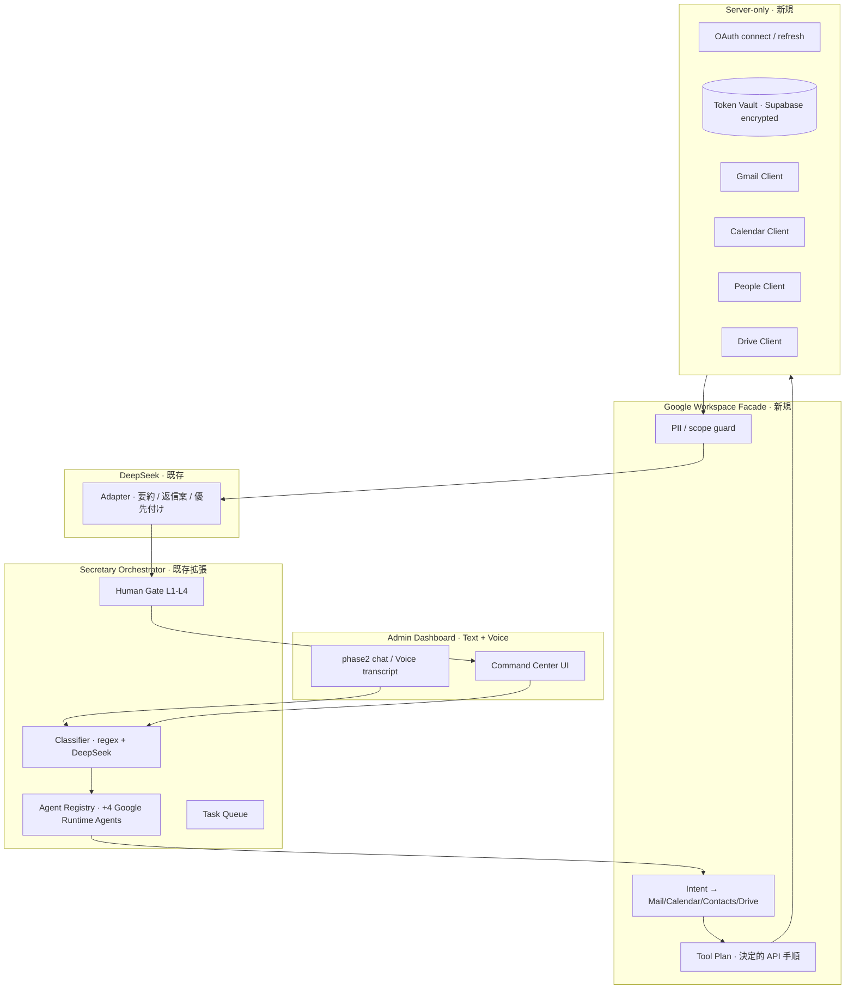
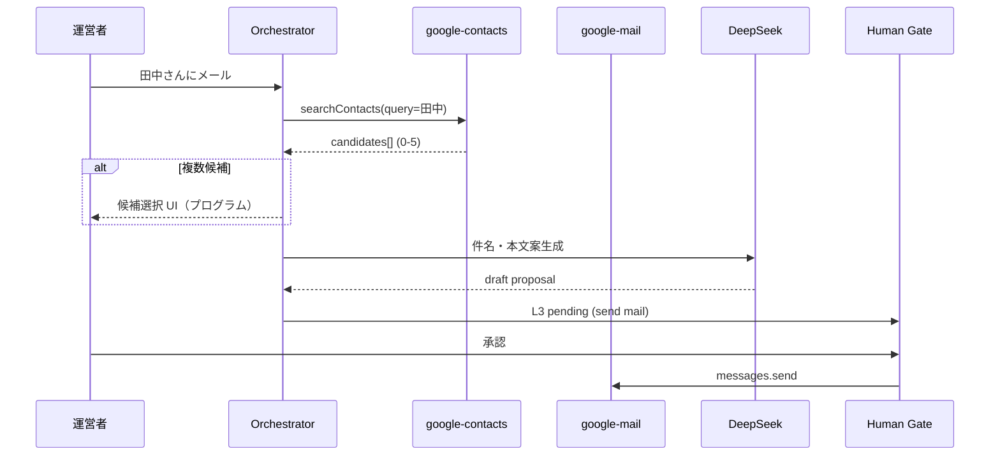

# AI秘書 Phase 6-A — Google Workspace Integration 調査・設計

**実施日:** 2026-06-27  
**種別:** 調査・設計のみ（**コード変更なし · OAuth 未作成 · Secret 未追加 · API 呼び出しなし**）  
**正本参照:** [docs/AI/SECRETARY_AI.md](../docs/AI/SECRETARY_AI.md) · [docs/DECISIONS.md](../docs/DECISIONS.md) AD-001 / AD-010 · [reports/ai-secretary-phase5-orchestrator-plan.md](./ai-secretary-phase5-orchestrator-plan.md)

---

## 用語整理（Phase 6 番号）

| 名称 | 意味 |
| --- | --- |
| **Phase 6-A（本設計）** | **Google Workspace Integration** — Gmail / Calendar / Contacts / Drive |
| **Phase 6-B 以降（Orchestrator 既存計画）** | Cursor SDK · cron · L1 自動送信 · OpsEvent 永続化（Phase 5 計画の「Phase 6」を繰り下げ） |
| **19 Cursor Agent** | IDE 専用（`.cursor/agents/*.md`）— 本設計の **Runtime Google Agent** とは別レイヤ |

---

## 1. 目的と前提

### 1.1 目的

TASFUL **運営 OPS 専用** AI秘書が、オーナー / 運営者の **Google Workspace**（個人 Gmail または Workspace アカウント）と連携し、メール・予定・連絡先・Drive を **読取中心** で参照し、**書込は Human Gate 必須** で支援する。

### 1.2 設計原則（既存資産との整合）

| 原則 | 根拠 |
| --- | --- |
| **Google API 呼び出し = プログラム**（決定的） | SECRETARY_AI.md — LLM は要約・文案のみ |
| **DeepSeek = 文案・要約のみ** | AD-010 · Gateway 非混在 |
| **外部送信 = Human Send Gate 必須** | `TasuAdminAiHumanSendGate` · デフォルト **L3** |
| **トークンはサーバー側のみ** | Platform OAuth（ユーザー Auth）と **分離** |
| **Builder / TASFUL AI / Platform 非変更** | AD-002 / AD-003 · 秘書 surface のみ |
| **RELEASE FROZEN 尊重** | v1.2 以降の機能追加として計画 |

### 1.3 Platform Google OAuth との分離

| 項目 | Platform（`platform-google-auth.js`） | AI秘書 Google Workspace |
| --- | --- | --- |
| **用途** | 一般ユーザー Supabase Auth ログイン | **運営者 OPS** の Gmail/Calendar 等 |
| **利用者** | 出品者・購入者 | admin-operations-dashboard 限定 |
| **OAuth アプリ** | 既存 Supabase Google provider | **別 GCP プロジェクト推奨** |
| **トークン保存** | Supabase Auth session | **秘書専用 token vault**（後述） |
| **スコープ** | `openid email profile` 等 | Gmail / Calendar / People / Drive |

**推奨:** GCP 上に **`tasful-secretary-workspace`** 等の **専用プロジェクト** を切り、Platform ユーザー OAuth と混在させない。

---

## 2. 推奨アーキテクチャ

### 2.1 全体構成



### 2.2 Text / Voice 共通レイヤ

| レイヤ | Text | Voice | 共通 |
| --- | --- | --- | --- |
| **入力** | phase2 `sendMessage` | Voice → transcript → 同一 `sendMessage` | ✅ |
| **分類** | Orchestrator Classifier | 同上 | ✅ |
| **Google 実行** | Workspace Facade | 同上（音声専用 API なし） | ✅ |
| **出力** | Command Center + チャット | TTS + 同一 UI カード | ✅ |

**Voice 変更は Phase 6-A スコープ外。** Voice Core は transcript を phase2 に渡す既存経路をそのまま利用する。

### 2.3 Runtime Agent 提案（Registry 拡張）

既存 19 Agent（Cursor 映射）は維持し、**Google Workspace 用 Runtime Agent を 4 体追加**（Phase 6-C 以降で Registry v2）。

| agentId | ラベル | 担当 API | 優先 |
| --- | --- | --- | --- |
| `google-mail` | Google Mail | Gmail API v1 | ① |
| `google-calendar` | Google Calendar | Calendar API v3 | ② |
| `google-contacts` | Google Contacts | People API v1 | ③ |
| `google-drive` | Google Drive | Drive API v3 | ④ |

**Classifier ルーティング例（regex 第 1 段）:**

| パターン | agentId |
| --- | --- |
| メール / Gmail / 受信 / 未読 / 返信 / 送信 / inbox | `google-mail` |
| 予定 / カレンダー / 空き / ミーティング / 今日の予定 | `google-calendar` |
| 連絡先 / 電話 / ○○さん / アドレス帳 | `google-contacts` |
| Drive / ファイル / PDF / スプレッドシート / 探して | `google-drive` |

**複合 intent（例: 「田中さんにメール」）:** `google-contacts` → resolve → `google-mail` の **2 段 Tool Plan**（Contacts は Mail の前置き）。

### 2.4 Google Workspace Facade（新規モジュール案）

```
admin-ai-secretary-google-workspace/
├── google-workspace-router.js      # intent → agent + toolPlan
├── google-workspace-tool-plan.js   # 決定的 API 手順（LLM 非依存）
├── google-workspace-sanitize.js    # レスポンス PII / サイズ制限
└── google-workspace-context.js     # DeepSeek 注入用正規化（OpsContext 第 7 ドメイン）
```

**Edge / Pages Function（サーバー専用）:**

```
supabase/functions/secretary-google-oauth/     # connect · callback · refresh
supabase/functions/secretary-google-proxy/     # Gmail/Cal/People/Drive 実行
  または
deploy/cloudflare/dist/functions/api/secretary-google-*.js  # DeepSeek と同様 CF 経路
```

**方針:** DeepSeek Adapter と同様 **秘書専用 Edge / Pages Function** · Gateway 非経由（AD-010）。

---

## 3. Gmail 調査

### 3.1 API と主要メソッド

| 要求 | Gmail API | クエリ / メソッド | 備考 |
| --- | --- | --- | --- |
| **受信一覧** | `users.messages.list` | `q=` · `labelIds=INBOX` | `maxResults` デフォルト 20 |
| **未読** | 同上 | `q=is:unread` | |
| **重要** | 同上 | `q=is:important` | |
| **添付あり** | 同上 | `q=has:attachment` | 本文取得時 `attachments.get` 追加 |
| **検索** | 同上 | `q={Gmail search syntax}` | ユーザー自然文 → **プログラムで q 変換**（LLM は q を直接生成しない） |
| **ラベル一覧** | `users.labels.list` | — | |
| **スレッド** | `users.threads.list` / `threads.get` | `q=` | 会話単位表示 |
| **返信** | `users.messages.send` | `threadId` + `In-Reply-To` / `References` | **L3 Human Gate** |
| **送信** | `users.messages.send` | raw RFC822 base64url | **L3** |
| **下書き** | `drafts.create` | — | **L3**（送信前確認） |
| **アーカイブ** | `users.messages.modify` | `removeLabelIds=INBOX` | L2 提案 · L3 実行可 |
| **ラベル付け** | `users.messages.modify` | `addLabelIds` / `removeLabelIds` | L2/L3 |
| **削除** | `users.messages.trash` | — | **L3 固定** · 完全削除スコープは使わない |

### 3.2 AI秘書統合フロー（Gmail）

```
[運営者] 「未読で重要なメールを要約して」
  → Classifier → google-mail
  → ToolPlan: labels.list + messages.list(q="is:unread is:important", max=10)
  → Edge Gmail Client（OAuth access token）
  → Sanitize（件名・差出人・snippet · 本文は top-N 文字）
  → DeepSeek: 要約 + 優先 3 件 + 返信案（送信はしない）
  → Command Center カード表示

[運営者] 「1 件目に返信案を作って」
  → messages.get → DeepSeek 返信案
  → Human Gate L3 pending（送信ボタンは承認後のみ）

[運営者] 「送信して」
  → Gate 承認済みのみ messages.send 実行
```

**OpsContext 第 7 ドメイン `google_mail`:** 未読件数 · 重要 top-3 件名 · 本日送信待ち下書き数（プログラム集計）。

### 3.3 スコープ推奨（Gmail）

| フェーズ | スコープ | 分類 | 用途 |
| --- | --- | --- | --- |
| **6-C read** | `gmail.readonly` | **Restricted** | 一覧 · 検索 · スレッド · 添付メタ |
| **6-D write** | `gmail.compose` | Restricted | 下書き · 送信 |
| **6-D write** | `gmail.modify` | Restricted | ラベル · アーカイブ · trash |
| **使わない** | `https://mail.google.com/` | Restricted | 完全削除不要 |

**Google 審査:** `gmail.readonly` / `gmail.modify` は **OAuth App Verification + 年次 CASA（セキュリティ評価）** が必要。未検証アプリは **テストユーザー 100 人上限 · トークン 7 日失効**。

---

## 4. Google Calendar 調査

### 4.1 API と主要メソッド

| 要求 | API | メソッド / パラメータ |
| --- | --- | --- |
| **今日の予定** | Calendar v3 | `events.list` · `calendarId=primary` · `timeMin`/`timeMax` = 当日 JST |
| **今週** | 同上 | `timeMin` = 週始 · `singleEvents=true` · `orderBy=startTime` |
| **空き時間** | 同上 | `freebusy.query` · `items[].id=primary` |
| **予定検索** | 同上 | `events.list` · `q={keyword}` |
| **予定追加** | 同上 | `events.insert` | **L3** |
| **変更** | 同上 | `events.patch` / `update` | **L3** |
| **削除** | 同上 | `events.delete` | **L3** |
| **出席** | 同上 | `events.patch` · `attendees[].responseStatus` | **L3** |

### 4.2 AI秘書統合フロー（Calendar）

```
「今日の予定は？」→ events.list(today) → DeepSeek 要約 → チャット表示
「来週火曜 14時空いてる？」→ freebusy.query → プログラム判定 → DeepSeek 説明文
「打ち合わせを入れて」→ events.insert 案 → L3 承認 → insert
```

**OpsContext `google_calendar`:** 本日予定件数 · 次の予定 1 件 · 本日空きブロック概要。

### 4.3 スコープ推奨（Calendar）

| フェーズ | スコープ | 分類 |
| --- | --- | --- |
| **6-E read** | `calendar.readonly` | Sensitive |
| **6-E read** | `calendar.events.readonly` | Sensitive（より狭い） |
| **6-F write** | `calendar.events` | Sensitive |
| **空きのみ** | `calendar.events.freebusy` | Sensitive（最小） |

**Quota（参考）:** プロジェクト **10,000 req/min** · ユーザー **600 req/min**（超過時 403/429 · exponential backoff）。

---

## 5. Google Contacts 調査

### 5.1 API（People API v1）

| 要求 | メソッド | 備考 |
| --- | --- | --- |
| **名前検索** | `people.searchContacts` | `query=` · `readMask=names,emailAddresses,phoneNumbers,organizations` |
| **メール検索** | 同上 | query に email 断片 |
| **電話番号** | `people.connections.list` + filter | または searchContacts |
| **会社** | `organizations` field | readMask に含める |

**Legacy Contacts API は 2022 終了。** People API のみ。

### 5.2 「○○さんへメール」導線



**LLM はメールアドレスを推測しない。** 必ず People API の結果を正本とする。

### 5.3 スコープ推奨（Contacts）

| スコープ | 分類 | 用途 |
| --- | --- | --- |
| `contacts.readonly` | Sensitive | 個人連絡先読取 |
| `contacts.other.readonly` | Sensitive | その他連絡先（任意） |
| `directory.readonly` | Sensitive | **Workspace 組織のみ** · 個人 Gmail では不可 |

**Quota:** People API は **Critical read** 単位（searchContacts 1 回 = 1 unit 等）· デフォルト **90 read/min/user** 程度（GCP Console で確認）。

---

## 6. Google Drive 調査

### 6.1 API と検索

| 要求 | `files.list` クエリ例 |
| --- | --- |
| **ファイル検索** | `q=name contains 'keyword' and trashed=false` |
| **全文** | `fullText contains 'keyword'`（インデックス済みのみ） |
| **PDF** | `mimeType='application/pdf'` |
| **Google Docs** | `mimeType='application/vnd.google-apps.document'` |
| **Sheets** | `mimeType='application/vnd.google-apps.spreadsheet'` |
| **Slides** | `mimeType='application/vnd.google-apps.presentation'` |
| **フォルダ** | `mimeType='application/vnd.google-apps.folder'` |

**エクスポート:** Docs/Sheets は `files.export` で text/csv/pdf（読取フェーズのみ）。

### 6.2 「○○を探して」導線

```
「契約書 PDF を探して」
  → Classifier → google-drive
  → ToolPlan: files.list(q="fullText contains '契約' and mimeType='application/pdf'", pageSize=10)
  → 結果カード（名前 · 更新日 · リンク）— 中身要約は export 後 DeepSeek（サイズ上限）
```

### 6.3 スコープ推奨（Drive）

| 方針 | スコープ | 分類 | トレードオフ |
| --- | --- | --- | --- |
| **A: 広い検索（秘書向け）** | `drive.readonly` | **Restricted** | 全 Drive 検索可 · CASA 必要 |
| **B: 最小（段階導入）** | `drive.file` + **Google Picker** | Non-sensitive | ユーザーが都度ファイル選択 · 「探して」は弱い |
| **推奨** | **6-H は A** · 検証負荷を見て B にフォールバック可能 | | |

**Quota:** プロジェクト **1,000,000 units/min** · `files.list` = **100 units/req**。

---

## 7. OAuth 設計

### 7.1 フロー

| 項目 | 設計 |
| --- | --- |
| **Grant type** | Authorization Code + **PKCE** |
| **Offline access** | `access_type=offline` · 初回 `prompt=consent` |
| **Refresh Token** | サーバー vault に **1 運営者 = 1 refresh set**（Google は refresh ローテーションあり） |
| **Access Token** | Edge メモリのみ · **TTL ~1h** · クライアント非公開 |
| **Redirect URI** | `https://{ops-domain}/api/secretary-google-oauth/callback`（staging / prod 別登録） |
| **State / CSRF** | `state` + ops session 紐付け |
| **Incremental auth** | Gmail 接続後 · Calendar 追加時は `include_granted_scopes=true` |

### 7.2 推奨スコープ一覧（段階付与）

| 段階 | スコープ |
| --- | --- |
| **Base** | `openid` · `email` · `profile`（接続アカウント表示） |
| **6-C Gmail read** | `gmail.readonly` |
| **6-D Gmail write** | `gmail.compose` · `gmail.modify` |
| **6-E Calendar read** | `calendar.readonly` |
| **6-F Calendar write** | `calendar.events` |
| **6-G Contacts** | `contacts.readonly` |
| **6-H Drive read** | `drive.readonly` |

### 7.3 未検証 / 本番前の制約

| 状態 | 制約 |
| --- | --- |
| **Testing（未検証）** | 最大 100 test users · refresh 7 日 · 「未確認アプリ」警告 |
| **Production（検証済）** | Sensitive: OAuth verification · Restricted: + **CASA 年次** |
| **Limited Use** | ポリシー準拠 · 秘書機能外のデータ利用禁止 |

---

## 8. Quota / Rate Limit / 無料枠（まとめ）

| API | 主な制限 | 超過時 | 無料枠 |
| --- | --- | --- | --- |
| **Gmail** | 6,000 units/min/user · 1.2M/min/project | 429 · backoff | 標準利用無料 · 2026 以降超過課金予定 |
| **Calendar** | 600/min/user · 10,000/min/project | 403/429 | 同上 |
| **People** | ~90 read/min/user（要 Console 確認） | 429 | 従量課金なし · throttle |
| **Drive** | 1M units/min/project · list=100 units | 403/429 | 同上 |

**実装ガード（設計）:**

- Edge 側 **token bucket**（秘書 1 ユーザー · API 別）
- 429 → exponential backoff + ユーザー向け「しばらく待って再試行」
- 1 ターンあたり API 呼び出し上限（例: max 5 methods / user message）

---

## 9. セキュリティ設計

| 項目 | 方針 |
| --- | --- |
| **OAuth のみ** | サービスアカウント + ドメイン全体委任は **初期非採用**（個人 Gmail も想定） |
| **Access Token** | Edge プロセスメモリ · ログ出力禁止 · レスポンスに含めない |
| **Refresh Token** | Supabase **暗号化カラム**（または Vault secret 参照）· **RLS: ops_admin のみ** |
| **Client Secret** | Supabase Secret または CF Pages Encrypted · リポジトリ禁止 |
| **Supabase** | `secretary_google_connections` · `secretary_google_token_vault` 等 · audit log |
| **クライアント** | **OAuth 開始 URL のみ** · callback は server-side |
| **Human Gate** | `messages.send` · `drafts.send` · `events.insert/patch/delete` · Drive 共有変更 = **L3+** |
| **AD-006** | AI 文案 ≠ 自動送信 · 承認なし実行禁止 |
| **PII** | OpsContext 注入前 sanitize（既存 `ops-context-sanitize` 拡張） |
| **監査** | 全 Google API 呼び出し `secretary_google_audit_log`（who · action · resourceId · ts） |

### Platform Supabase Auth との共存

- Platform ユーザー Google ログイン用 OAuth クライアントと **別 client_id**
- 秘書トークンを Supabase Auth `user_metadata` に **保存しない**

---

## 10. Phase 分割（実装ロードマップ案）

| Phase | 内容 | 依存 | 優先 |
| --- | --- | --- | --- |
| **6-A** | **本調査・設計** | Phase 5 Orchestrator | ✅ 今回 |
| **6-B** | OAuth connect UI + Token Vault + Edge skeleton | GCP プロジェクト（人間作業） | P1 |
| **6-C** | Gmail **read-only** + Command Center カード | 6-B · `gmail.readonly` | ① |
| **6-D** | Gmail write + Human Gate 送信 | 6-C · 検証/CASA 計画 | ① |
| **6-E** | Calendar read + freebusy | 6-B | ② |
| **6-F** | Calendar write + RSVP | 6-E | ② |
| **6-G** | Contacts search + Mail 連携導線 | 6-C · 6-D | ③ |
| **6-H** | Drive search + export 要約 | 6-B · scope 方針確定 | ④ |
| **6-I** | OpsContext 第 7 ドメイン + 朝レポート統合 | 6-C〜H 一部 | 横断 |
| **6-J** | Orchestrator Registry v2 · Classifier 拡張 · E2E tests | 6-C 以降 | 横断 |
| **7-A** | Cursor SDK / cron / L1 自動送信（旧 Phase 6） | Phase 5 + Google 安定後 | 後続 |

**MVP 提案:** **6-B + 6-C + 6-D（Gmail のみ）** で v1.2 最初のリリース候補。

---

## 11. 既知リスクと未決事項

| ID | リスク | 対策案 |
| --- | --- | --- |
| R1 | Gmail/Drive **Restricted scope** → CASA コスト・期間 | 6-C は readonly から · 別 dev GCP で test user 運用 |
| R2 | Phase 6 番号衝突（Cursor SDK vs Google） | 本設計で **6-A〜H = Google** · **7-A = Cursor** に整理 |
| R3 | RELEASE FROZEN | v1.2 マイナー計画 · Critical/Security 以外は feature flag |
| R4 | 複数運営者 | 1 connection / Supabase user · 将来 multi-mailbox |
| R5 | 自然文 → Gmail `q` 変換 | **テンプレ + regex** 優先 · DeepSeek は候補提示のみ（実行 q は program 確定） |

---

## 12. 参照

- [Gmail API scopes](https://developers.google.com/workspace/gmail/api/auth/scopes)
- [Gmail API quota](https://developers.google.com/gmail/api/reference/quota)
- [Calendar API usage limits](https://developers.google.com/calendar/api/guides/quota)
- [People API contacts](https://developers.google.com/people/v1/contacts)
- [Drive API scopes](https://developers.google.com/workspace/drive/api/guides/api-specific-auth)
- [Google OAuth restricted scope verification](https://developers.google.com/identity/protocols/oauth2/production-readiness/restricted-scope-verification)

---

## 13. 更新ドキュメント

| ファイル | 更新内容 |
| --- | --- |
| `docs/AI/SECRETARY_AI.md` | Phase 6-A Google Workspace 設計セクション |
| `docs/TODO.md` | Phase 6-A 設計完了 · 6-B 以降サブタスク |
| `docs/ROADMAP.md` | AI 秘書 Google Workspace 行追加 |
