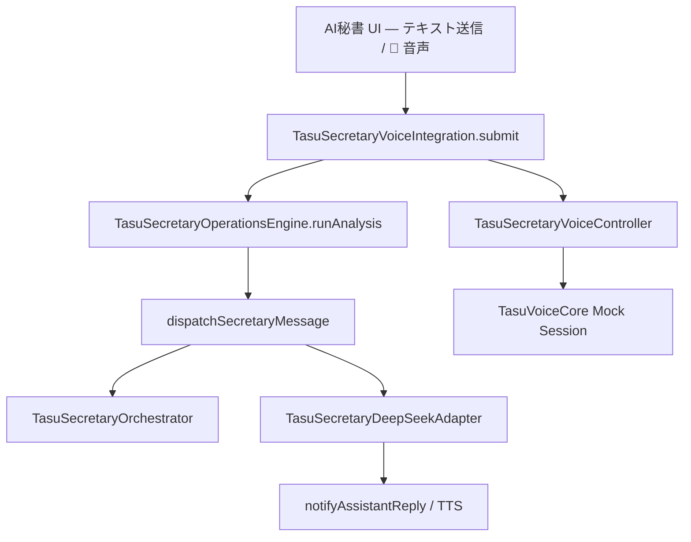

# AI 秘書 Voice Integration Phase 1 — 実装計画・完了報告

**Status:** レビュー待ち（コミット / push / deploy 禁止）

## 目的

Builder AI と同型のアーキテクチャで AI 秘書へ Voice Core を統合。Builder 専用コードの流用ではなく、秘書専用 Controller / Integration Layer を新設。

## スコープ遵守

| 対象 | 状態 |
|------|------|
| AI 秘書 UI / Phase2 | ✅ |
| Secretary Voice Controller | ✅ 新規 |
| Secretary Voice Integration | ✅ 新規 |
| Mock のみ（Realtime 禁止） | ✅ |
| shared/voice-core/** | ✅ 未変更 |
| Builder / TASFUL AI / Platform / TLV / Gateway / DeepSeek Adapter | ✅ 未変更 |

## 変更ファイル一覧

### 新規

| ファイル | 役割 |
|----------|------|
| `admin-ai-secretary-voice-controller.js` | Voice Core ラッパー（session / timeout / state） |
| `admin-ai-secretary-voice-integration.js` | 共通 `submit()` · Operations Engine 前置 |
| `scripts/test-secretary-voice-integration-phase1.mjs` | Phase 1 テスト |
| `reports/secretary-voice-integration-phase1-plan.md` | 本ドキュメント |

### 更新

| ファイル | 変更概要 |
|----------|----------|
| `admin-ai-secretary-phase2.js` | `submit()` / `dispatchSecretaryMessage()` · Voice UI 連携 |
| `admin-ai-secretary-voice.js` | Integration 委譲 · TTS `notifyAssistantReply` |
| `admin-operations-dashboard.html` | Voice Core スクリプト · 音声ボタン · 状態表示 |
| `admin-operations-dashboard.css` | Voice ボタン / 状態スタイル |

## クラス構成

```
TasuSecretaryVoiceController
  ├── init / startSession / stopSession / reconnectSession
  ├── handleSessionTimeout / captureVoiceInput
  ├── notifySpeaking / stopSpeaking
  └── onStateChange / getState (Ready|Listening|Thinking|Speaking|Error)

TasuSecretaryVoiceIntegration
  ├── init({ onSubmit })
  ├── submit({ channel, text })          ← Text / Voice 共通
  ├── submitVoiceCapture()
  ├── runOperationsIntelligence()        ← Engine.runAnalysis ラッパー
  └── stopSession / reconnectSession / notifyAssistantReply

TasuAdminAiSecretaryPhase2
  ├── submit()                           ← UI 共通入口
  ├── dispatchSecretaryMessage()         ← 内部処理（Orchestrator + DeepSeek）
  ├── initVoiceIntegration() / bindVoiceButton() / renderVoiceState()
  └── sendMessage() → submit() 委譲
```

## データフロー



**Mock 設定（固定）**

- `mockCompatible: true`
- `useWebSocketTransport: false`
- Realtime WebSocket 接続なし

## テスト結果

```text
node scripts/test-secretary-voice-integration-phase1.mjs
=== Secretary Voice Integration Phase 1: 23/23 PASS ===
```

| 項目 | 結果 |
|------|------|
| Controller 初期化 | PASS |
| Session 開始 / 停止 / 再接続 | PASS |
| Timeout | PASS |
| Voice 送信（mock capture） | PASS |
| Text 送信 | PASS |
| 共通 submit | PASS |
| Operations Engine 経由（text / voice） | PASS |
| opsAnalysis ペイロード付与 | PASS |
| voice-core 非汚染 | PASS |
| Phase 6 Operations 回帰 | PASS |

## AI 秘書への影響

- **既存テキストチャット:** フォーム / クイックチップは `submit()` 経由に統一。Orchestrator · DeepSeek パスは維持。
- **Operations Intelligence:** すべての submit（text / voice）で `runAnalysis()` を先行実行。モック応答にインサイト件数を付加可能。
- **Voice UI:** デスク AI チャットに 🎤 ボタンと Ready / Listening / Thinking / Speaking / Error 表示を追加。
- **破壊的変更なし:** `sendMessage()` は後方互換で残し、内部は `submit()` に委譲。
- **Legacy `TasuAiVoiceCore.mountToolbar`:** 削除。Phase2 専用ボタンに置換。

## Go / No-Go

| 判定 | 理由 |
|------|------|
| **Go（レビュー後）** | 23/23 PASS · スコープ内 · Mock のみ · Engine バイパスなし |
| **保留事項** | ブラウザ実機 STT/TTS · `npm run build:pages` dist 反映 · Realtime Phase 2 |

---

**次ステップ（レビュー承認後）:** 選別ステージング → コミット → dist ビルド → 手動ブラウザ確認
