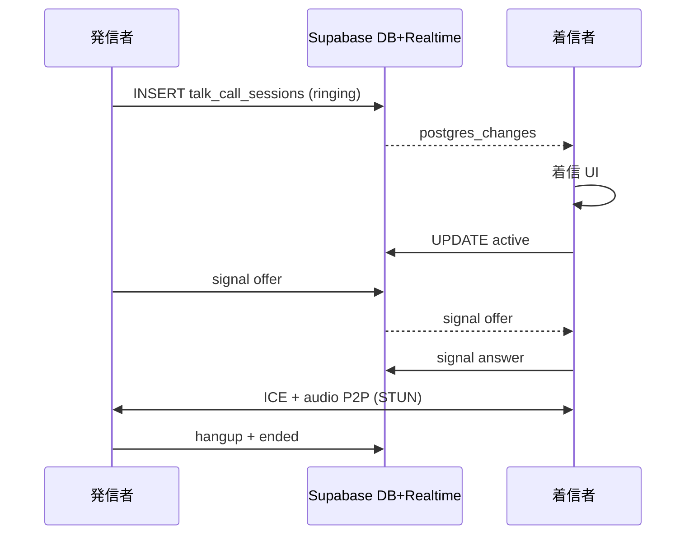

# TASFUL TALK 通話機能 — 実装状況整理

**作成日:** 2026-06-17  
**Epic:** TALK WebRTC 1:1 音声通話 Phase1  
**関連:** [`talk-webrtc-call-phase1-implementation.md`](talk-webrtc-call-phase1-implementation.md) · [`talk-webrtc-call-mvp-design.md`](talk-webrtc-call-mvp-design.md)

---

## サマリー一覧

| 項目 | 状態 | 備考 |
|------|------|------|
| **実装済み** | ✅ Phase1 コア | 1:1 音声 · Supabase シグナリング · 発信/着信/切断/通話中 UI |
| **未実装** | ⬜ Phase2 以降 | TURN · ビデオ · 通話履歴 UI · Push 着信 · chat-detail 連携 |
| **ベンチ PASS** | ✅ | `test-talk-webrtc-call-browser.mjs`（非 STRICT / STRICT 両方） |
| **ベンチ FAIL** | — | 通話専用 E2E の FAIL **記録なし** |
| **発信** | ✅ 実装済 | `TasuTalkCallService.initiateCall` |
| **着信** | ✅ 実装済 | Realtime + 着信オーバーレイ（**フォアグラウンドのみ**） |
| **切断** | ✅ 実装済 | 終話 / 拒否 / キャンセル / hangup signal |
| **通話中 UI** | ✅ 実装済 | タイマー · ミュート · 終話 |
| **通話履歴** | ⬜ 未実装 | DB `talk_call_sessions` のみ（一覧 UI なし） |
| **通知連携** | ⚠️ 部分 | ANPI→TALK 橋渡し ✅ / TALK 通知センター着信 ❌ |
| **WebRTC 接続** | ✅ 実装済 | `RTCPeerConnection` + 音声 P2P |
| **TURN/STUN 設定** | ⚠️ STUN のみ | Google STUN 1 本 · **TURN 未実装** |
| **モバイル対応** | ⚠️ 部分 | レスポンシブ overlay · 📞 条件付き表示 · フォアグラウンド制約 |
| **本番投入可否** | ⚠️ **条件付き可** | Phase1 LOCK 合格 · 限定ロールアウト向け |

---

## 1. 実装済み（Phase1）

### 1.1 コアモジュール

| ファイル | 責務 |
|----------|------|
| [`scripts/talk-call-service.js`](../scripts/talk-call-service.js) | 状態機械 · 発信/着信/切断 · busy · 60s timeout |
| [`scripts/talk-call-webrtc.js`](../scripts/talk-call-webrtc.js) | RTCPeerConnection · getUserMedia · ICE · mute |
| [`scripts/talk-call-signaling.js`](../scripts/talk-call-signaling.js) | `talk_call_sessions` / `talk_call_signals` CRUD + Realtime |
| [`scripts/talk-call-ui.js`](../scripts/talk-call-ui.js) | 発信中 / 着信 / 通話中オーバーレイ |
| [`talk-call.css`](../talk-call.css) | オーバーレイ · モバイル 📞 表示 override |

### 1.2 DB / RLS

| ファイル | 状態 |
|----------|------|
| [`sql/talk-call-schema.sql`](../sql/talk-call-schema.sql) | ✅ 適用済（linked project） |
| [`sql/talk-call-realtime-publication.sql`](../sql/talk-call-realtime-publication.sql) | ✅ Realtime publication |
| [`sql/talk-call-rls-production.sql`](../sql/talk-call-rls-production.sql) | ✅ 参加者のみ RLS（dev ポリシー drop 済） |

### 1.3 UI 統合

| 箇所 | 内容 |
|------|------|
| [`talk-home.html`](../talk-home.html) | call CSS + script 4 本 load |
| [`talk-line-room.js`](../talk-line-room.js) | 📞 ボタン enable/disable · `initiateCall` 配線 · dev 相手 remap |
| 対象スレッド | **1:1 direct のみ**（公式 / グループ / static hub は発信不可） |

### 1.4 付帯機能

| 機能 | 状態 |
|------|------|
| busy 判定 | ✅ ringing / active 中の二重発信ブロック |
| 60 秒 timeout | ✅ 無応答 → `missed` |
| 拒否 | ✅ `rejected` |
| ANPI 連携 | ✅ [`scripts/anpi-talk-call-bridge.js`](../scripts/anpi-talk-call-bridge.js) — URL 経由で talk-home 自動発信 |
| 監査ログ | ✅ `anpi-no-response-service` — `talk_call_initiated` |

---

## 2. 未実装（Phase2 以降）

| 機能 | 設計上の位置づけ |
|------|------------------|
| **TURN / coturn** | 厳格 NAT 下の接続保証 |
| **ビデオ通話** | 🎥 ボタンは HTML 上 disabled スタブ |
| **通話履歴 UI** | sessions 一覧 · 再発信 |
| **Web Push / バックグラウンド着信** | アプリ非起動時の着信 |
| **TALK 通知センター着信カード** | `talk-notifications-store.js` に通話種別なし |
| **`chat-detail.html` 通話** | 取引チャットからの発信 |
| **Supabase Edge `talk-call-initiate`** | 任意 · 未作成 |
| **PSTN / Twilio** | 明示的スコープ外 |
| **グループ / 公式ルーム通話** | Phase1 で意図的に除外 |
| **録音 / 通話内容保存** | スコープ外 |

---

## 3. ベンチ PASS

| スクリプト | モード | 結果 | 最終確認 |
|------------|------|------|----------|
| [`scripts/test-talk-webrtc-call-browser.mjs`](../scripts/test-talk-webrtc-call-browser.mjs) | 通常 | **PASS** (0 errors) | 2026-06-17 再実行 ✅ |
| 同上 | `SUPABASE_STRICT=1` | **PASS** (0 errors) | 2026-06-17（実装レポート） |
| [`scripts/test-anpi-no-response-phase2-browser.mjs`](../scripts/test-anpi-no-response-phase2-browser.mjs) | ANPI 橋渡し | **PASS** | 2026-06-17 |
| [`scripts/test-voice-settings-browser.mjs`](../scripts/test-voice-settings-browser.mjs) | WebRTC 非回帰 | **PASS** | AI 音声 Phase1 |
| RLS 監査 | `talk_call_*` | **PASS / 本番 Ready** | [`supabase-rls-final-audit.md`](supabase-rls-final-audit.md) |

### 3.1 E2E で検証済みの項目（`test-talk-webrtc-call-browser.mjs`）

```
OK  call modules loaded
OK  direct thread: call button enabled=true
OK  group thread: call button disabled
OK  official thread: call button disabled
OK  A→B initiate
OK  B incoming UI (Realtime)
OK  both sides active session
OK  audio path ok (A.pc=connected, B.pc=connected)
OK  hangup cleanup
OK  busy blocks duplicate caller initiate
OK  busy blocks callee while ringing
OK  60s timeout → missed
OK  60s timeout: caller UI cleared
=== PASS (0 errors) ===
```

---

## 4. ベンチ FAIL

| スクリプト | 通話関連 | 結果 |
|------------|----------|------|
| 通話専用 E2E | — | **FAIL 記録なし** |
| [`scripts/review-talk-user-flow.mjs`](../scripts/review-talk-user-flow.mjs) | **対象外**（TALK 凍結監査 · 通話 OFF デフォルト） | PASS（通話は未検証） |
| [`builder/bench-bridge.html`](../builder/bench-bridge.html) | **対象外**（Builder iframe 橋 · WebRTC なし） | 通話ベンチではない |
| `verify-talk-rls-staging.mjs` | 間接 | 他テーブル dev policy 残存で FAIL 報告あり · **`talk_call_*` 自体は OK** |

---

## 5. 機能別詳細

### 5.1 発信 ✅

| 項目 | 内容 |
|------|------|
| エントリ | `talk-line-room` ヘッダー 📞 · ANPI `nr-talk-call` CTA |
| API | `TasuTalkCallService.initiateCall(thread)` |
| 前提 | Supabase 接続 · JWT · direct 1:1 · `partnerUserId` 解決 |
| DB | `talk_call_sessions` INSERT · `status=ringing` · `expires_at=+60s` |
| UI | 発信中オーバーレイ · キャンセル |

### 5.2 着信 ✅（制限あり）

| 項目 | 内容 |
|------|------|
| 検知 | Supabase Realtime `postgres_changes` + `pollRingingSessions` fallback |
| UI | 着信オーバーレイ · 応答 / 拒否 |
| **制限** | **TALK フォアグラウンド必須** — Push / SW 着信なし |
| **制限** | 通知センターに着信カードは出ない（in-app overlay のみ） |

### 5.3 切断 ✅

| 操作 | 挙動 |
|------|------|
| 通話中 終話 | hangup signal · `status=ended` · MediaTrack stop · PC close |
| 発信中 キャンセル | session ended / cleanup |
| 着信 拒否 | `status=rejected` |
| 60s 無応答 | `status=missed` · UI クリア |

### 5.4 通話中 UI ✅

| 要素 | 実装 |
|------|------|
| 状態表示 | 「通話中」 |
| タイマー | 経過 MM:SS |
| ミュート | ローカル audio track toggle |
| 終話 | 赤ボタン |
| 配置 | `talk-home.html` 上 fixed オーバーレイ |

### 5.5 通話履歴 ⬜

| 項目 | 状態 |
|------|------|
| DB 保存 | ✅ `talk_call_sessions`（ringing / active / ended / missed / rejected / busy） |
| 一覧 UI | ❌ なし |
| 再発信 | ❌ 履歴からの UI なし（スレッド内 📞 のみ） |

### 5.6 通知連携 ⚠️

| 経路 | 状態 |
|------|------|
| **ANPI → TALK 通話** | ✅ `anpi-talk-call-bridge.js` · `talk-home?anpiCallTarget=&anpiCallAuto=1` |
| **TALK 通知センター** | ❌ 着信 /  missed カード未実装 |
| **Web Push** | ❌ Phase2 |
| **Service Worker 着信** | ❌ Phase2 |

### 5.7 WebRTC 接続 ✅

| 項目 | 内容 |
|------|------|
| API | `RTCPeerConnection` |
| メディア | `getUserMedia({ audio: true, video: false })` |
| シグナリング | offer / answer / ICE candidate → `talk_call_signals` |
| 再生 | remote `<audio autoplay>` |
| 接続確認 | E2E: `pc=connected` + ontrack |

### 5.8 TURN / STUN ⚠️

| 項目 | 状態 |
|------|------|
| **STUN** | ✅ `stun:stun.l.google.com:19302`（[`talk-call-webrtc.js`](../scripts/talk-call-webrtc.js)） |
| **TURN** | ❌ 未設定 · 厳格 NAT / 企業 FW で P2P 失敗の可能性 |
| **Twilio ICE** | ❌ 未使用 |

### 5.9 モバイル対応 ⚠️

| 項目 | 状態 |
|------|------|
| オーバーレイ CSS | ✅ 360px パネル · safe-area toast |
| 📞 ボタン | `talk-home.css` では ≤960px で非表示 → `talk-call.css` が **enabled 時のみ** `display: inline-flex !important` |
| マイク権限 | HTTPS 必須（`getUserMedia`） |
| iOS PWA / バックグラウンド | ❌ フォアグラウンド着信のみ · Push なし |
| 実機 E2E | 自動テストは Playwright + fake media · **実機 NAT は未自動検証** |

---

## 6. 本番投入可否

### 判定: ⚠️ **条件付きで投入可（Phase1 LOCK）**

| 観点 | 評価 |
|------|------|
| Phase1 LOCK | ✅ 2026-06-17 合格（[`talk-webrtc-call-phase1-implementation.md`](talk-webrtc-call-phase1-implementation.md) §12） |
| SQL / RLS | ✅ 本番 RLS 適用済 · 参加者分離 PASS |
| E2E | ✅ STRICT 全 10 項目 PASS |
| TALK コア凍結 | ✅ 通話は FROZEN 外 Epic · 最小フックのみ |

### 投入条件（推奨）

1. 双方が **TALK を開いた状態**（フォアグラウンド）で利用する想定に限定
2. **HTTPS** 環境（マイク API 要件）
3. **1:1 direct スレッド** のみ（公式 / グループは UI disabled）
4. **STUN-only** のため、NAT 越え失敗時の UX（「接続できませんでした」）を運用で許容

### 本番投入前の残リスク

| リスク | 深刻度 | Phase2 対応 |
|--------|--------|-------------|
| TURN なし → 接続失敗 | 中 | coturn |
| アプリ閉じていると着信不可 | 高 | Web Push |
| 通話履歴なし | 低 | UI 一覧 |
| `chat-detail` 非対応 | 中 | 取引チャット連携 |
| 実機 NAT 未検証 | 中 | TURN + 実機テスト |

### 投入不可とするケース

- **PSTN / 電話番号発信**が必要な場合 → 未実装
- **バックグラウンド着信**が必須の場合 → Push 未実装
- **全 NAT 環境での接続保証**が必要な場合 → TURN 未実装

---

## 7. アーキテクチャ（参考）



---

## 8. 関連ドキュメント

| ドキュメント | 内容 |
|--------------|------|
| [`talk-webrtc-call-mvp-design.md`](talk-webrtc-call-mvp-design.md) | MVP 設計 · Phase 境界 |
| [`talk-webrtc-call-phase1-implementation.md`](talk-webrtc-call-phase1-implementation.md) | 実装 · LOCK 判定 · E2E ログ |
| [`anpi-no-response-phase2-implementation.md`](anpi-no-response-phase2-implementation.md) | ANPI 通話橋渡し |
| [`supabase-rls-final-audit.md`](supabase-rls-final-audit.md) | `talk_call_*` RLS PASS |
| [`talk-release-status.md`](talk-release-status.md) | TALK コア RELEASE FROZEN（通話は対象外） |

---

*本レポートはリポジトリ現状・2026-06-17 ベンチ再実行・既存実装レポートに基づく整理である。*
