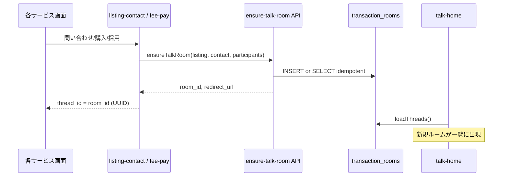

# TASFUL — やり取りチャット → TASFUL TALK 統合計画（P0〜P1）

| 項目 | 内容 |
|------|------|
| 版 | v1.0 |
| 作成日 | **2026-06-22** |
| スコープ | **P0（入口・通知整理）+ P1（ルーム生成 Supabase 寄せ）** |
| スコープ外 | `chat-detail.js` 全面分解 · 業務 UI の案件ページ分離 · 友達チャット DB 統合（**P2 以降**） |
| 作業種別 | **計画書のみ**（本ドキュメント作成時点でコード変更なし） |

---

## 0. エグゼクティブサマリ

やり取りチャットと TASFUL TALK は **DB 上は既に同一**（`transaction_rooms` / `transaction_messages`）。統合の本質は次の3点である。

1. **入口の一本化** — `chat-list.html` と `talk-home.html?tab=chat` の二重運用を解消
2. **通知 CTA の整理** — 「TALK へ行く」「案件ページへ行く」の2系統に集約
3. **ルーム生成の一本化** — `chat-thread-store.js`（localStorage）を Supabase `transaction_rooms` INSERT へ寄せる（MATCH の `match-ensure-talk-room` を一般化）

**P0〜P1 完了後の到達点:**

- ユーザーは **TALK が会話の唯一の入口**
- 新規案件のルームは **原則 Supabase に作成**（LS は読取フォールバックのみ）
- 会話 UI は **当面 `chat-detail.html` のまま**（P2 で TALK 内インライン化を検討）
- 業務ボタン（完了・承認・決済等）は **現状どおり各フロー／chat-detail 内**（変更しない）

---

## 1. 現状整理（計画の前提）

| 項目 | 現状 |
|------|------|
| 共通 DB | `transaction_rooms` · `transaction_messages` · `transaction_reads` |
| サービス識別 | `listing_type`（`skill` / `worker` / `product` / `job` / `business` / `shop_store` / `match` 等） |
| TALK 一覧 | `talk-home.js` → `TasuChatService.loadThreads()` + LS マージ |
| 旧一覧 | `chat-list.html` → 同一 API + ほぼ同一フィルタ UI |
| 会話本体 | `chat-detail.html` + `chat-detail.js`（5,800行超 · 変更は P2 へ） |
| LS 生成 | `chat-thread-store.createThreadFromContact` → `tasful_chat_threads` |
| Supabase 生成 | `chat-supabase.createBusinessConsultRoom`（business のみ）· `match-ensure-talk-room` Edge（match のみ） |
| 通知 CTA | `platform-notify-action-labels.js` + `talk-notify-actions.js`（ラベル多数・遷移先混在） |

---

## 2. フェーズ定義

### P0 — 入口統一・通知 CTA 整理（UI/導線のみ）

**目的:** ユーザーが「やり取りチャット」と「TALK」を別サービスと認識しないようにする。DB・ルーム生成ロジックは触らない。

| # | 作業 | 成果 |
|---|------|------|
| P0-1 | `chat-list.html` を **TALK へリダイレクト**（クエリ保持） | 二重一覧の解消 |
| P0-2 | 全サイトの `chat-list.html` リンクを `talk-home.html?tab=chat` に置換 | ナビ統一 |
| P0-3 | `chat-detail` の「← 一覧」を TALK へ | 戻り導線統一 |
| P0-4 | `talk-home.html` から「従来の取引チャット一覧」リンク削除 | 製品メッセージ統一 |
| P0-5 | 通知 CTA を **2分類**に整理（下表） | 通知→TALK/案件の明確化 |
| P0-6 | 検証スクリプト・パンくず・ドキュメント更新 | 回帰可能状態 |

### P1 — ルーム生成 Supabase 寄せ（データ経路）

**目的:** 新規案件発生時の会話ルームを `transaction_rooms` に作成し、TALK 一覧と整合させる。LS は既存データ読取と段階的廃止。

| # | 作業 | 成果 |
|---|------|------|
| P1-1 | 共通 `ensureTalkRoom` API 設計（Edge 推奨 · クライアント fallback 可） | MATCH 以外も同パターン |
| P1-2 | `createThreadFromContact` を Supabase 経由に差し替え | skill/worker/product/job/shop 等 |
| P1-3 | `activateThreadAfterFeePaid` を `transaction_rooms.status` 更新に接続 | 手数料後アクティブ化 |
| P1-4 | `listing-contact-requests-store` の `thread_id` を UUID 化 | 問い合わせ↔ルーム紐付け |
| P1-5 | LS 既存スレッドの読取互換（マージ順・ID 判定維持） | 既存ユーザー影響最小化 |
| P1-6 | 回帰検証（ベンチ・通知・購入フロー） | P1 完了判定 |

---

## 3. P0 詳細 — 変更ファイル一覧

### 3.1 必須（コア導線）

| ファイル | 変更内容 | 優先度 |
|----------|----------|--------|
| `chat-list.html` | メタ refresh または `chat-list.js` 先頭で `talk-home.html?tab=chat` へ redirect（`thread` / `room` / `roomId` クエリを `#thread=` または `highlight` へ写経） | **P0-1** |
| `chat-list.js` | リダイレクトロジック · 旧 `?thread=` ハイライトの TALK 側委譲 | P0-1 |
| `talk-home.js` | `?thread=` / `?room=` / `?roomId=` 受け取り · 一覧ハイライト or インラインオープン | P0-1 |
| `talk-home.html` | 「従来の取引チャット一覧」リンク削除 · `chat-list.html` ナビリンク削除 | P0-4 |
| `chat-detail.html` | `← 一覧` href を `talk-home.html?tab=chat&from=chat` に | P0-3 |
| `chat-detail.js` | プログラム遷移の `chat-list.html` → TALK（L5265 付近） | P0-3 |

### 3.2 ナビゲーション置換（`chat-list.html` → TALK）

| ファイル | 箇所 |
|----------|------|
| `dashboard.html` | スマホナビ「チャット」 |
| `dashboard.js` | メガメニュー `chats` · `href: chat-list.html`（2箇所）· active 判定 |
| `dashboard-mobile-home.js` | 「すべてのやりとり」タイル |
| `payment-settings.html` | ヘッダーメッセージリンク |
| `profile-settings.html` | 同上 |
| `listing-management.html` | 同上 |
| `sales-fees.html` | 同上 |
| `notification-settings.html` | 同上 |
| `anpi-dashboard.html` | 同上 |
| `anpi-notifications.html` | 同上 |
| `anpi-register.html` | 同上 |
| `breadcrumb-config.js` | `chat-list.html` エントリ → TALK へリダイレクト定義 or ラベル統合 |
| `common-breadcrumb.js` | TALK パンくずとの整合（必要時） |

**置換ルール（統一）:**

```text
chat-list.html
  → talk-home.html?tab=chat

chat-list.html?thread={id}
  → talk-home.html?tab=chat&thread={id}

chat-detail 戻り
  → talk-home.html?tab=chat&from=chat
```

### 3.3 通知 CTA 整理（P0-5）

**新 CTA taxonomy（ユーザー向けラベル）:**

| 分類 | ラベル（案） | 遷移先 | 例 |
|------|-------------|--------|-----|
| **TALK** | `TALKで確認する` / `TALKを開く` | `talk-home.html?tab=chat&thread={uuid}` または `chat-detail.html?roomId={uuid}&from=notify`（当面） | やりとり開始 · 完了申請 · レビュー |
| **案件** | `案件を見る` / `応募を見る` / `注文を見る` | `detail-*.html` · `#applications` · 注文管理 | 応募受信 · Builder 案件 · 店舗注文 |

**マッピング方針（旧 → 新）:**

| 旧ラベル例 | 新分類 |
|-----------|--------|
| やり取りチャットを開く | **TALK** |
| チャットを開く / やりとりを開く | **TALK** |
| 応募者を確認する / 応募を見る | **案件** |
| 購入を確認する / 注文を見る | **案件** |
| 承認する / 評価する（チャット内操作） | **TALK**（`chat-detail` + カード deep link） |
| 詳細を見る / 確認する | 文脈依存（案件 or TALK） |

| ファイル | 変更内容 |
|----------|----------|
| `platform-notify-action-labels.js` | 上記2分類へのラベル集約 · `やり取りチャット` 文言廃止 |
| `talk-notify-actions.js` | `resolveNotifyAction` 系で href 生成を TALK 優先に · `appendFromNotifyParam` 維持 |
| `talk-platform-notify.js` | マスター通知の `targetUrl` / `chat-detail` 直リンクを TALK 経由オプション追加 |
| `platform-chat-category-flow-config.js` | `expectedCta` ドキュメント整合（テスト期待値） |
| `docs/platform-notify-unified.md` | CTA 表を2分類で更新 |

**P0 で触らない（参照のみ）:**

- `chat-detail.js` 内の完了/決済 UI
- `platform-chat-*-flow.js` の業務ロジック本体
- Edge Functions（P1 で追加）

### 3.4 P0 テスト・ドキュメント

| ファイル | 対応 |
|----------|------|
| `scripts/test-chat-list-browser.mjs` | redirect 先が TALK であることを検証に変更 |
| `scripts/test-talk-chat-hub-browser.mjs` | `chat-list.html` リンク不存在を確認 |
| `scripts/test-platform-all-browser.mjs` | ナビ href 更新 |
| `scripts/test-dashboard-*-browser.mjs` | メガメニュー href 更新 |
| `scripts/verify-platform-notify-routing.mjs` | CTA ラベル・href 期待値更新 |
| `scripts/verify-detail-contact-cta-routing.mjs` | TALK 経由を許容 |
| `scripts/test-tasful-ui-final-smoke.mjs` | `chat-list` → `talk-home?tab=chat` |
| `deploy/cloudflare/dist/**` | 本番 dist はビルド/コピー手順に従い同期（別タスクで明示） |

---

## 4. P1 詳細 — ルーム生成 Supabase 寄せ

### 4.1 目標アーキテクチャ



**参照実装:** `supabase/functions/_shared/match-talk-room.ts`

- idempotent: `(listing_type, listing_id)` または `contact_id` で既存再利用
- `buyer_id` / `seller_id` = JWT `talk_user_id`
- `redirect_url` = `chat-detail.html?room={uuid}`（P2 まで維持）

### 4.2 新規・変更ファイル（P1）

| ファイル | 種別 | 変更内容 |
|----------|------|----------|
| `supabase/functions/ensure-talk-room/index.ts` | **新規** | 汎用ルーム ensure（match 以外） |
| `supabase/functions/_shared/talk-room-ensure.ts` | **新規** | 共有ロジック（match-talk-room から抽出可能） |
| `talk-room-ensure.js` | **新規（クライアント）** | Edge 呼び出し + Supabase 直 insert fallback（開発用） |
| `chat-supabase.js` | 変更 | `createListingTalkRoom` 一般化（`createBusinessConsultRoom` を包含） |
| `chat-thread-store.js` | 変更 | `createThreadFromContact` → API 委譲 · LS は fallback/legacy read |
| `chat-service.js` | 変更 | `loadThreads` マージ順序・重複排除（UUID vs `chat-*` ID） |
| `listing-contact-requests-store.js` | 変更 | `activate*Chat` 系で UUID `thread_id` 保存 |
| `platform-chat-fee.js` | 変更 | 手数料後 `activateThreadAfterFeePaid` → room status 更新 |
| `platform-chat-connect-entry-flow.js` | 変更 | connect 購入後ルーム ensure |
| `platform-chat-fee-pay.js` | 変更 | 支払い完了後の遷移先 thread ID |
| `talk-home-data.js` | 変更 | `resolveChatTalkHref` — UUID は `roomId` / `room` 統一 |
| `talk-chat-thread-model.js` | 変更 | `chatDomain: work` メタデータ付与（表示用） |

**任意（DB · P1 後半）:**

| ファイル | 内容 |
|----------|------|
| `supabase/migrations/YYYYMMDD_talk_room_contact_bridge.sql` | `transaction_rooms.contact_id text` · `source text` 列（冪等検索用）· 既存 `service_deal_id` / `match_pair_id` と並立 |
| `sql/talk-chat-foundation.sql` | コメントアウトされていた `chat_domain` / `thread_kind` の一部適用検討 |

**P1 で意図的に触らない:**

- `chat-detail.js`（会話+業務 UI モノリス）
- `talk-friend-hub-store.js`（友達チャット LS）
- `platform-chat-completion-flow.js` 等の完了ロジック本体（呼び出し先 ID が UUID になるのみ）

### 4.3 `ensureTalkRoom` API 仕様（案）

**入力:**

```typescript
{
  listing_id: string;
  listing_type: string;       // skill | worker | product | job | business | shop_store | ...
  contact_id?: string;        // listing-contact-requests の ID
  buyer_id: string;           // talk_user_id
  seller_id: string;
  title: string;
  source?: string;            // listing-contact-paid | hire | purchase | ...
  service_deal_id?: string;   // business のみ
  expires_at?: string;        // 省略時は +14d（business 既存に合わせる）
}
```

**出力:**

```typescript
{
  room_id: string;            // UUID
  created: boolean;
  reused: boolean;
  redirect_url: string;       // ../chat-detail.html?room={id}&from={context}
}
```

**冪等キー（優先順）:**

1. `contact_id` があれば `transaction_rooms` に unique 索引
2. なければ `(listing_type, listing_id, buyer_id, seller_id)` + `status=active`
3. business: 既存 `service_deal_id`
4. match: 既存 `match_pair_id`（現行維持 · 別 Function でも可）

### 4.4 LS → Supabase 移行方針

| 段階 | 挙動 |
|------|------|
| **P1-alpha** | 新規のみ Supabase · LS 既存は `loadThreads` でマージ表示 |
| **P1-beta** | `chat-*` ID を開いたとき lazy migration（room 作成して contact に UUID 書き戻し）— 任意 |
| **P2** | LS 書込停止 · 読取のみ |

**リスク低減:**

- `isLocalRoomId()` / `^chat-/` 判定は P1 全体を通じて維持
- デモモード（`talkDev=1` · `client_stub`）では LS フォールバックを残す

### 4.5 P1 実装順（推奨）

```text
1. talk-room-ensure 共有モジュール + ensure-talk-room Edge（business を一般化して試験）
2. chat-supabase.createListingTalkRoom + クライアント talk-room-ensure.js
3. chat-thread-store.createThreadFromContact の API 委譲（skill/worker から）
4. platform-chat-fee.js / listing-contact-requests-store の thread_id UUID 化
5. platform-chat-connect-entry-flow.js（connect 購入）
6. talk-home-data.resolveChatTalkHref の room/thread パラメータ統一
7. migration（contact_id 列）— 必要なら
8. 回帰スクリプト一括
```

---

## 5. 影響範囲マトリクス

| 領域 | P0 | P1 | 備考 |
|------|----|----|------|
| **DB スキーマ** | なし | 小（optional 列追加） | 新テーブル不要 |
| **Edge Functions** | なし | 中（1本追加） | match 既存は維持 |
| **会話 UI** | 小（戻りリンク） | 小（URL パラメータ） | chat-detail 本体は不変 |
| **TALK 一覧** | 中 | 中 | 同一データソース |
| **通知** | 中 | 小 | CTA ラベル/href |
| **各 detail ページ** | 小 | 小 | 問い合わせ後の thread ID 形式 |
| **Builder** | 小 | 小 | 既に TALK 導線多い |
| **MATCH** | なし | なし | 連携済み · 変更不要 |
| **ベンチ/E2E** | 中 | 大 | `platform-chat-bench-flow-diag.js` 等 |
| **deploy/dist** | 中 | 中 | 静的コピー同期 |

**波及ファイル数（概算）:**

| フェーズ | HTML | JS（本体） | JS（scripts） | 設定/ドキュメント |
|----------|------|------------|---------------|-------------------|
| P0 | ~15 | ~12 | ~15 | ~3 |
| P1 | 0 | ~10 + 2新規 | ~10 | 1 migration |

---

## 6. テスト計画

### 6.1 P0 受入テスト

| ID | 項目 | 操作 | 期待結果 |
|----|------|------|----------|
| P0-T01 | chat-list リダイレクト | `/chat-list.html` を開く | `talk-home.html?tab=chat` へ遷移 |
| P0-T02 | thread クエリ保持 | `/chat-list.html?thread={id}` | TALK で当該スレッドがハイライト or オープン |
| P0-T03 | ダッシュボード導線 | ダッシュボード「チャット」 | TALK チャットタブ |
| P0-T04 | chat-detail 戻り | 会話画面「← 一覧」 | TALK チャットタブ |
| P0-T05 | 二重リンク削除 | talk-home 内に「従来の取引チャット」がない | — |
| P0-T06 | 通知 CTA · 求人応募 | 応募通知の CTA | **案件**（`detail-job#applications`） |
| P0-T07 | 通知 CTA · 採用後 | やりとり開始通知 | **TALK**（chat-detail or TALK 経由） |
| P0-T08 | 通知 CTA · 購入 | スキル購入通知（掲載者） | **案件** or **TALK**（文脈に応じ定義どおり） |
| P0-T09 | パンくず | chat-list 旧 URL | TALK へ誘導 or リダイレクト |
| P0-T10 | 回帰 smoke | `npm run` / 既存 talk smoke | PASS |

**自動化（優先）:**

```bash
node scripts/test-chat-list-browser.mjs      # redirect 検証に改修
node scripts/test-talk-chat-hub-browser.mjs  # legacy リンク非存在
node scripts/verify-platform-notify-routing.mjs
node scripts/test-tasful-ui-final-smoke.mjs
```

### 6.2 P1 受入テスト

| ID | 項目 | 操作 | 期待結果 |
|----|------|------|----------|
| P1-T01 | skill 購入後ルーム | 手数料支払い → チャット開始 | `transaction_rooms` に行 · UUID · `listing_type=skill` |
| P1-T02 | worker 同上 | 同上 | `listing_type=worker` |
| P1-T03 | product/shop | 購入フロー | 同上 |
| P1-T04 | job 採用後 | 採用 → チャット | UUID · job 用メタ |
| P1-T05 | business 相談 | 業務サービス相談開始 | `service_deal_id` 紐付け維持 |
| P1-T06 | 冪等性 | 同一 contact で2回 ensure | 同一 `room_id` · `reused=true` |
| P1-T07 | TALK 一覧 | 新規ルーム作成後 TALK 更新 | 一覧に表示 · 未読プレビュー |
| P1-T08 | LS 既存互換 | 旧 `chat-*` スレッド | 一覧に残る · オープン可能 |
| P1-T09 | 通知→TALK | 購入/開始通知 CTA | 新 UUID で会話オープン |
| P1-T10 | RLS | 当事者以外が room 読めない | 403/0件 |
| P1-T11 | MATCH 回帰 | match-ensure-talk-room | 既存 PASS 維持 |
| P1-T12 | ベンチ | marketplace connect bench | ルーム作成・完了フロー |

**自動化（優先）:**

```bash
node scripts/verify-platform-fee-rules.mjs
node scripts/verify-skill-connect-completion-flow.mjs
node scripts/verify-worker-connect-completion-flow.mjs
node scripts/verify-product-shop-payment-final-review.mjs
node scripts/verify-platform-notify-routing.mjs
node scripts/lib/verify-marketplace-connect-bench.mjs
# 新規推奨:
# node scripts/verify-talk-room-ensure-live.mjs
```

### 6.3 P0+P1 完了判定

```text
TALK_CHAT_UNIFY_P0_READY
  - P0-T01〜P10 PASS
  - chat-list 直アクセスが TALK に統一
  - 通知 CTA が2分類ドキュメントどおり

TALK_CHAT_UNIFY_P1_READY
  - P1-T01〜P12 PASS
  - 新規 createThreadFromContact が Supabase 生成（LS 書込なし）
  - MATCH 回帰 PASS
```

---

## 7. リスクと対策

| # | リスク | 影響 | 対策 |
|---|--------|------|------|
| R1 | **LS 既存データが TALK にだけ出て Supabase に無い** | 端末間非同期 · 本番データ分裂 | P1-alpha はマージ維持 · optional lazy migration · 期限付き LS 読取 |
| R2 | **`thread` vs `roomId` vs `room` パラメータ混在** | リンク切れ · 通知 CTA 失敗 | P0 で TALK 受け口統一 · `talk-home-data.resolveChatTalkHref` で正規化 |
| R3 | **chat-list ブックマーク・外部リンク** | 404 ではないが UX 変化 | 301 相当 redirect · クエリ写経 · リリースノート |
| R4 | **RLS: クライアント INSERT 拒否** | ルーム作成失敗 | Edge `service_role` 経由を primary に（MATCH 同様）· ポリシー確認 |
| R5 | **ベンチ/デモが LS 前提** | E2E 大量 FAIL | `talkDev=1` では LS fallback 維持 · ベンチ seed を UUID 対応 |
| R6 | **通知マスター href 硬直** | `talk-platform-notify.js` 直 `chat-detail` | P0 でマスター生成側を段階修正 · ラベルのみ先に統一も可 |
| R7 | **deploy/cloudflare/dist 未同期** | 本番だけ旧導線 | リリースチェックリストに dist 同期を明記 |
| R8 | **business / match の特殊列** | 一般化時の regression | 既存パスをラップし、match は現行 Function を触らない |
| R9 | **P0 と P1 の並行開発コンフリクト** | href と room ID 形式の不一致 | **P0 先行マージ** → P1 は UUID 前提で実装 |

---

## 8. 推奨スケジュール（目安）

| 週 | 内容 |
|----|------|
| W1 | P0-1〜P0-4（リダイレクト・ナビ置換）+ P0 テスト |
| W2 | P0-5〜P0-6（通知 CTA · ドキュメント）+ P0 完了判定 |
| W3 | P1-1〜P1-3（ensure API · business/skill パイロット） |
| W4 | P1-4〜P1-6（connect/fee · 回帰 · P1 完了判定） |

---

## 9. P2 以降（参考 · 本計画のスコープ外）

| 項目 | 内容 |
|------|------|
| chat-detail 分解 | 業務 UI を `detail-*` / 案件ページへ移動 · TALK は会話のみ |
| TALK インライン会話 | `talk-home` 内 `#thread=` を全カテゴリで完結 |
| 友達チャット DB 化 | `talk_friend_requests` · `chat_domain=friend` |
| LS 廃止 | `tasful_chat_threads` 読取停止 |
| 文言 | 製品全体から「やり取りチャット」表記削除 |

---

## 10. 関連ドキュメント・参照実装

| ファイル | 用途 |
|----------|------|
| `docs/platform-notify-unified.md` | 通知 CTA 統一方針（P0 で更新） |
| `reports/talk-p1-triage-conclusion.md` | TALK 一覧の既知テスト差分 |
| `reports/match-talk-room-integration-report.md` | MATCH→TALK 橋渡し（P1 参照実装） |
| `supabase/functions/_shared/match-talk-room.ts` | ensure ロジックの金型 |
| `chat-supabase.js` `createBusinessConsultRoom` | クライアント insert の既存例 |
| `platform-chat-category-flow-config.js` | カテゴリ別期待フロー |

---

## 11. 変更しないもの（明示）

以下は P0〜P1 では **変更禁止** とする。

- `chat-detail.js` の業務ボタン・完了フロー・決済 UI の構造
- `match-ensure-talk-room` の挙動（MATCH 回帰優先）
- `service_deals` / `reviews` スキーマと RPC
- 友達チャット（`talk-friend-hub-store.js`）
- TALK 通知ストアの根本構造（`talk_notifications`）

---

## 12. 次のアクション

1. **レビュー** — 本計画の P0 redirect 方式（HTML meta vs JS）と CTA ラベル案の承認
2. **P0 実装** — `chat-list` リダイレクト + ナビ一括置換（小 PR 推奨）
3. **P1 設計確定** — `ensure-talk-room` を Edge 単体か match 統合か決定
4. **検証スクリプト** — `verify-talk-room-ensure-live.mjs` 新規作成を P1 と同時に計画
