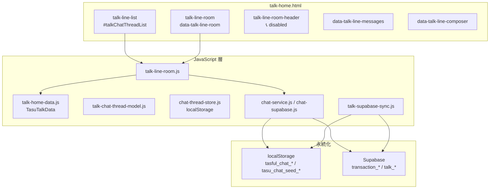
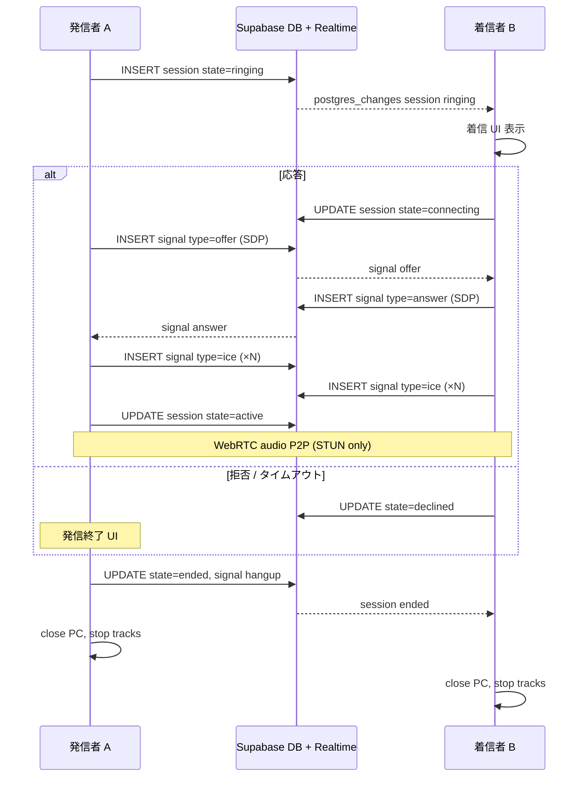
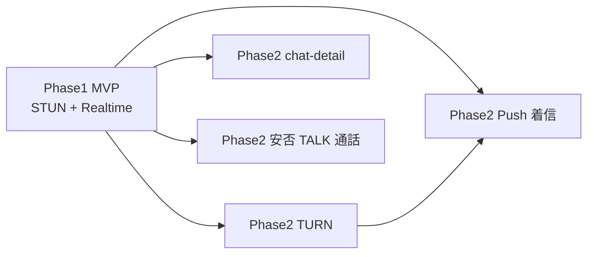

# TASFUL TALK — WebRTC 1対1音声通話 MVP 設計

**作成日:** 2026-06-17  
**目的:** TASFUL TALK に 1対1 音声通話を追加するための MVP 設計（**製品コード変更なし** — 設計書のみ）  
**凍結:** TALK **RELEASE FROZEN** 維持 — 実装は **新規モジュール追加 + 最小接続点** で Phase1 として別 Epic 扱い

**関連:** [`talk-release-status.md`](talk-release-status.md) · [`anpi-no-response-design-review.md`](anpi-no-response-design-review.md)（WebRTC 完成後の安否通話連携）

---

## サマリー

| 項目 | MVP 方針 |
|------|----------|
| スコープ | **1対1・音声のみ**（グループ / ライブ / 録画 / 画面共有 なし） |
| 技術 | ブラウザ **WebRTC** + **Supabase Realtime** シグナリング |
| STUN | Google 公開 STUN のみ（`stun:stun.l.google.com:19302` 等） |
| TURN | **Phase2**（coturn）— 厳格 NAT 下は Phase1 で接続失敗の可能性あり |
| 課金 PSTN | **Twilio 等は使わない** |
| 主画面 | **`talk-home.html` → `talk-line-room`**（チャット詳細 = 右ペイン会話 UI） |
| PWA | `talk-home` に manifest / SW 追加（Builder PWA を参考） |

### MVP 完了条件

| # | 条件 | 設計上の到達点 |
|---|------|----------------|
| 1 | チャット詳細画面から発信できる | `talk-line-room-header` の 📞 ボタン有効化 → 発信オーバーレイ |
| 2 | 相手側に着信通知が出る | Supabase Realtime で `ringing` イベント受信 → 着信モーダル |
| 3 | 応答できる | Accept → SDP answer 交換 |
| 4 | 音声通話できる | `getUserMedia({ audio: true })` + RTCPeerConnection |
| 5 | 通話終了できる | Hangup → リソース解放 + session `ended` |

---

## 1. 既存 TALK 構造と組み込み箇所

### 1.1 アーキテクチャ（現状）



**TALK の「チャット詳細」= `talk-line-room`（SPA 内右ペイン）。**  
`chat-detail.html` は取引・Builder 系の **別ルート**（レガシーリンクあり）。MVP は **`talk-line-room` を主対象** とし、`chat-detail.html` 連携は Phase2。

### 1.2 既存の通話 UI プレースホルダ

`talk-home.html` に **未配線・disabled** のボタンが既にある:

```html
<button ... data-talk-line-action="call" title="通話（準備中）" disabled>📞</button>
<button ... data-talk-line-action="video" ... disabled>🎥</button>
```

| 接続点 | ファイル | MVP での扱い |
|--------|----------|----------------|
| 発信トリガ | `talk-home.html` — `data-talk-line-action="call"` | disabled 解除 + 新モジュールへ委譲 |
| クリック配線 | `talk-line-room.js` — `wireRoomActions()` | `call` 分岐追加（**数行の委譲のみ**） |
| スレッド文脈 | `talk-line-room.js` — `activeThread` | `thread.id`, `partnerUserId` を call session に渡す |
| 公式ルーム除外 | `TasuTalkOfficialRooms.isOfficialRoomId` | 発信 **禁止**（既存 composer 非表示と同様） |
| 1対1判定 | `talk-chat-thread-model.js` — `THREAD_KINDS.direct` | `group` / `official` は発信不可 |

**RELEASE FROZEN 方針:** 上記は **拡張点への最小フック** に留め、通話ロジック本体は **新規ファイル** に集約する。

### 1.3 新規モジュール（実装 Phase1 候補 — 本書では未作成）

| モジュール（案） | 責務 |
|------------------|------|
| `talk-webrtc-call.js` | RTCPeerConnection ライフサイクル、getUserMedia、mute/end |
| `talk-call-signaling.js` | Supabase Realtime 購読・offer/answer/ICE 送受信 |
| `talk-call-ui.js` | 発信中 / 着信 / 通話中オーバーレイ DOM |
| `talk-call-session.js` | 状態機械（idle → ringing → connecting → active → ended） |
| `talk-call.css` | オーバーレイ・モーダル（`talk-home.css` への大量追加は避ける） |

`talk-home.html` 末尾で上記を **追加 script 読み込み**（既存 JS のロジック変更を最小化）。

### 1.4 対象スレッドの制約（MVP）

| 条件 | 発信 |
|------|------|
| `thread_kind === direct` かつ 参加者 2 名 | ✅ |
| `official_anpi` / `official_tasful` 等公式ルーム | ❌ |
| `_staticCard` / 通知ハブのみ | ❌ |
| `group`（将来） | ❌ |
| 相手 `partnerUserId` 未解決 | ❌ |

---

## 2. シグナリング設計

### 2.1 方式選定

| 方式 | 評価 | 採用 |
|------|------|------|
| **Supabase Realtime（postgres_changes）** | 既存 `talk-supabase-sync.js` / `chat-supabase.js` と同パターン。永続・監査可能 | **MVP 推奨** |
| Supabase Realtime Broadcast | 低遅延。DB 残らない | 補助（ICE バッチ用）可 |
| localStorage / CustomEvent | タブ間・端末間不可 | **シグナリングに不採用** |
| 自前 WebSocket Edge | 運用コスト増 | Phase2 以降 |

**方針:** メタデータ・状態は **DB + Realtime**、SDP/ICE は **DB 行または Broadcast** で交換（Twilio 不使用）。

### 2.2 データモデル（新規 SQL — Phase1 実装時）

#### `talk_call_sessions`

| 列 | 型 | 説明 |
|----|-----|------|
| `id` | uuid PK | call_id |
| `thread_id` | text | 会話スレッド ID（`transaction_rooms.id` または local thread id） |
| `caller_id` | text | 発信者 user_id |
| `callee_id` | text | 着信者 user_id |
| `state` | text | `ringing` \| `connecting` \| `active` \| `ended` \| `declined` \| `missed` \| `failed` |
| `ended_reason` | text | `hangup` \| `decline` \| `timeout` \| `error` \| null |
| `created_at` | timestamptz | 発信時刻 |
| `answered_at` | timestamptz | 応答時刻 |
| `ended_at` | timestamptz | 終了時刻 |

インデックス: `(callee_id, state)`, `(thread_id, created_at desc)`

#### `talk_call_signals`

| 列 | 型 | 説明 |
|----|-----|------|
| `id` | uuid PK | |
| `call_id` | uuid FK | sessions.id |
| `sender_id` | text | |
| `type` | text | `offer` \| `answer` \| `ice` \| `hangup` |
| `payload` | jsonb | SDP または `{ candidate }` |
| `created_at` | timestamptz | |

**Realtime:** `sql/talk-realtime-publication.sql` パターンで両テーブルを `supabase_realtime` に追加。

#### RLS（概要）

- `caller_id` または `callee_id` が JWT `talk_user_id` / `member_id` と一致する行のみ read/write
- 既存 TALK RLS（[`sql/talk-rls-production.sql`](sql/talk-rls-production.sql)）と同系統で **別マイグレーション**

### 2.3 シグナリングシーケンス



### 2.4 着信検知の前提（重要）

| シナリオ | Phase1 | Phase2 |
|----------|--------|--------|
| 相手が **同一 `talk-home.html` を開いている** | Realtime で着信 UI | 同左 |
| 相手が **別タブ / バックグラウンド** | 着信取りこぼしリスク | Web Push + SW |
| 相手が **オフライン** | session → `missed` | プッシュ + 履歴 |

MVP 完了条件 2〜3 は **「相手が TALK を開いている」E2E** で満たす。バックグラウンド着信は Phase2。

### 2.5 認証・参加者検証

| 項目 | ソース |
|------|--------|
| 現在ユーザー | `TasuChatUserIdentity.getEffectiveUserId()` / `talk-runtime.js` Auth セッション |
| 相手 ID | `TasuTalkChatThreadModel.resolvePartnerUserId(activeThread)` |
| スレッド所属 | Phase1: thread_id + partner 一致のみ。Phase2: `transaction_rooms` buyer/seller 照合 |
| Edge 検証（任意） | `supabase/functions/talk-call-initiate` — 不正 thread 拒否 |

---

## 3. WebRTC イベント設計

### 3.1 アプリケーションイベント（`talk-call-session.js`）

| イベント名 | 発火タイミング | payload 例 |
|------------|----------------|------------|
| `talk:call-initiated` | 発信ボタン → session 作成後 | `{ callId, threadId, calleeId }` |
| `talk:call-incoming` | Realtime `ringing` 受信 | `{ callId, threadId, callerId, callerName }` |
| `talk:call-accepted` | 応答タップ後 | `{ callId }` |
| `talk:call-declined` | 拒否 | `{ callId, reason }` |
| `talk:call-connected` | `connectionState === connected` | `{ callId }` |
| `talk:call-ended` | 終了・拒否・失敗 | `{ callId, reason }` |
| `talk:call-error` | getUserMedia / PC 失敗 | `{ code, message }` |

DOM / モジュール間は `CustomEvent` on `window`（既存 `tasu:*` パターンに合わせ `talk:*`）。

### 3.2 シグナリングメッセージ（DB `talk_call_signals.type`）

| type | 方向 | payload |
|------|------|---------|
| `offer` | caller → callee | `{ sdp, type: "offer" }` |
| `answer` | callee → caller | `{ sdp, type: "answer" }` |
| `ice` | 双方向 | `{ candidate, sdpMid, sdpMLineIndex }` |
| `hangup` | 双方向 | `{ reason }` |

### 3.3 RTCPeerConnection 設定（Phase1）

```javascript
// 設計値（実装時）
const pcConfig = {
  iceServers: [{ urls: "stun:stun.l.google.com:19302" }],
  // Phase2: { urls: "turn:...", username, credential }
};
const mediaConstraints = { audio: true, video: false };
```

| WebRTC 内部イベント | ハンドラ責務 |
|---------------------|--------------|
| `onicecandidate` | ICE → `talk_call_signals` insert |
| `ontrack` | リモート audio を `<audio autoplay>` に attach |
| `onconnectionstatechange` | `failed` → UI エラー + session `failed` |
| `oniceconnectionstatechange` | `disconnected` 15s → 終了提案（Phase2） |

### 3.4 状態機械

```
idle
  └─ initiate ──> ringing (caller) / incoming (callee)
        ├─ accept ──> connecting ──> active
        ├─ decline ──> ended (declined)
        ├─ timeout(45s) ──> ended (missed)
        └─ hangup ──> ended (hangup)
active ── hangup ──> ended
```

---

## 4. localStorage 依存の確認

### 4.1 現状マップ

| キー / モジュール | 用途 | 通話 MVP との関係 |
|-------------------|------|-------------------|
| `tasful_chat_threads` / `tasful_chat_messages` | 相談スレッド・メッセージ | thread_id 参照。**通話状態は保存しない** |
| `tasu_chat_seed_v1` | Supabase 未接続時チャット seed | ローカルルームでも通話可（相手同一ブラウザ demo 除く） |
| `tasful_talk_sync_pending_v1` | TALK Supabase 同期キュー | 無関係 |
| `talk-notifications-store` 系 | 通知一覧 | 着信 **UI は Realtime 優先**。Phase2 で通知ログ連携可 |
| `talk-line-room` composer 送信 | **メモリのみ**（`displayMessages` 追記） | 通話中も composer **非表示**推奨 |

### 4.2 設計上のルール

| ルール | 理由 |
|--------|------|
| **シグナリング / session 状態を localStorage 主存储にしない** | 多端末・着信側が別タブ |
| 進行中 call_id は **メモリ + sessionStorage（任意）** | PWA リロード時のガード（Phase2） |
| 通話履歴 Phase1 では **DB sessions のみ**（UI 一覧なし） | MVP スコープ削減 |

---

## 5. Supabase 利用有無

| 用途 | Supabase | 備考 |
|------|----------|------|
| シグナリング | **必須（MVP）** | 新規 `talk_call_*` テーブル + Realtime |
| メディア中継 | **不要** | WebRTC P2P。TURN は Phase2 で自前 coturn |
| 認証 | **既存 Auth 流用** | `TasuTalkRuntime.hasAuthenticatedTalkSession()` |
| スレッド master | **任意** | `transaction_rooms` 本番 / local id 開発 |
| Edge Function | **推奨（Phase1 後半）** | session 作成時の権限チェック |
| 既存 `talk_notifications` | **Phase2** | 「着信」通知カードを notifications 連携 |

**既存 Realtime 参考実装:**

- `chat-supabase.js` — `subscribeRoomDetail()` — `postgres_changes` on `transaction_messages`
- `talk-supabase-sync.js` — `subscribeRealtime()` — store 単位 pull

---

## 6. MVP 画面構成

### 6.1 画面一覧（すべて `talk-home.html` オーバーレイ）

| 状態 | UI | 主要要素 |
|------|-----|----------|
| **idle** | 通常 `talk-line-room` | 📞 有効（direct のみ） |
| **outgoing** | 発信中バナー / フルスクリーン（SP） | 相手名、アニメ、「キャンセル」 |
| **incoming** | 着信モーダル（最前面） | 相手名、「応答」「拒否」 |
| **active** | 通話中バー | 経過時間、mute、**終了** |
| **ended** | トースト / 短表示 | 「通話が終了しました」→ idle |

### 6.2 ワイヤ（論理）

```
┌─────────────────────────────────────────┐
│ ← 相手名                    📞 🔇  ⋮   │  ← talk-line-room-header（既存）
├─────────────────────────────────────────┤
│  メッセージ一覧（既存）                    │
│                                         │
├─────────────────────────────────────────┤
│  [メッセージ入力]              [送信]    │  ← 通話中は hidden
└─────────────────────────────────────────┘

┌─ 着信オーバーレイ（incoming）────────────┐
│  📞 着信中                               │
│  田中 花子                               │
│  [拒否]              [応答]              │
└─────────────────────────────────────────┘
```

### 6.3 PWA / モバイル

| 項目 | MVP |
|------|-----|
| `manifest.json` + SW | `talk-home.html` から登録（Builder [`builder/mvp-calendar.html`](builder/mvp-calendar.html) 参考） |
| `viewport-fit=cover` | 既存 [`talk-home.html`](talk-home.html) 対応済み |
| `getUserMedia` | **HTTPS 必須**（localhost 可） |
| iOS Safari PWA | 着信は **フォアグラウンド限定** をドキュメント化 |
| バックグラウンド着信 | Phase2（Push + SW） |

### 6.4 アクセシビリティ

- 着信: `role="alertdialog"` + フォーカストラップ
- 通話中: mute / end に `aria-label`
- 音声のみ — ビデオボタンは MVP では **disabled 維持**

---

## 7. Phase1 / Phase2 分割案

### 7.1 Phase1 — MVP（本設計の完了条件）

| 項目 | 内容 |
|------|------|
| 通話種別 | 1対1 音声のみ |
| 画面 | `talk-line-room` オーバーレイ |
| シグナリング | Supabase `talk_call_sessions` + `talk_call_signals` + Realtime |
| ICE | Google STUN のみ |
| 対象 | `direct` スレッド、非 official |
| E2E 前提 | 発信・着信双方が `talk-home` を開いている |
| 新規ファイル | `talk-webrtc-call.js` 等（§1.3） |
| 既存変更 | `talk-home.html` script 追加、`talk-line-room.js` call 分岐 **最小** |
| テスト | `scripts/test-talk-webrtc-call-browser.mjs`（新規） |

**MVP 非包含（明示的に除外）:**

- グループ / 公式ルーム / ビデオ
- 録画・画面共有
- TURN / coturn
- Twilio / PSTN
- `chat-detail.html` 発信ボタン
- 通話履歴 UI
- バックグラウンド Push 着信

### 7.2 Phase2 — 拡張

| 項目 | 内容 |
|------|------|
| **TURN** | 自前 coturn、ICE 設定追加 |
| **NAT 失敗 UX** | 「接続できませんでした — TURN 経由を再試行」 |
| **Push 着信** | Service Worker + Web Push（PWA 閉じた状態） |
| **chat-detail 連携** | 取引チャット [`chat-detail.html`](chat-detail.html) から発信 |
| **通話履歴** | sessions 一覧・再発信 |
| **再接続** | ICE restart / 短切断復帰 |
| **安否連携** | [`anpi-no-response-design-review.md`](anpi-no-response-design-review.md) P2-NR-3 |
| **運営監査** | 通話メタログ（録音なし） |
| **ビデオ** | 既存 🎥 ボタン — Phase2 以降 |

### 7.3 依存関係



---

## 8. RELEASE FROZEN との整合

| 領域 | 方針 |
|------|------|
| TALK コア（通知・一覧・既存 chat フロー） | **変更しない** |
| 通話機能 | **新規 Epic** — 追加 JS / SQL / 最小 HTML フック |
| 凍結監査 | 既存 `review-talk-user-flow.mjs` は **通話 OFF デフォルト** で PASS 維持。通話 E2E は **別スクリプト** |
| 安否 / Builder / Connect 等 | **触らない** |

---

## 9. リスクと緩和

| リスク | 影響 | 緩和 |
|--------|------|------|
| STUN のみで NAT 越え失敗 | 通話不可 | Phase2 TURN。Phase1 UI で明示 |
| フォアグラウンド限定着信 | 取りこぼし | MVP テスト条件に明記。Phase2 Push |
| local thread id | 相手が別 DB 行と不一致 | 本番は `transaction_rooms` UUID 統一 |
| マイク権限拒否 | 発信不可 | `talk:call-error` + 設定案内 |
| 同時 2 通話 | 状態混乱 | session 1 件 / user を Phase1 で enforce |

---

## 10. 実装前チェックリスト（Phase1 着手時）

- [ ] SQL: `talk_call_sessions` / `talk_call_signals` + RLS + Realtime publication
- [ ] 新規 JS 4 モジュール + CSS
- [ ] `talk-home.html`: script タグ追加、📞 disabled 解除条件
- [ ] `talk-line-room.js`: `call` action → `TasuTalkWebRtcCall.initiate(activeThread)`
- [ ] E2E: 2 ブラウザ context — 発信・着信・応答・音声・終了
- [ ] ドキュメント: STUN-only 制限、PWA HTTPS 要件
- [ ] `talk-release-status.md` には **通話 Epic は FROZEN 外** と注記（実装 PR 時）

---

## 参照ファイル

| ファイル | 関連 |
|----------|------|
| [`talk-home.html`](talk-home.html) | チャット詳細 UI、📞 プレースホルダ |
| [`talk-line-room.js`](talk-line-room.js) | 会話ペイン、`activeThread`、`wireRoomActions` |
| [`talk-chat-thread-model.js`](talk-chat-thread-model.js) | direct / partner 解決 |
| [`chat-supabase.js`](chat-supabase.js) | Realtime パターン |
| [`talk-supabase-sync.js`](talk-supabase-sync.js) | TALK Supabase 同期 |
| [`talk-runtime.js`](talk-runtime.js) | Auth / 本番判定 |
| [`sql/talk-realtime-publication.sql`](sql/talk-realtime-publication.sql) | Realtime 有効化手順 |
| [`reports/talk-release-status.md`](talk-release-status.md) | RELEASE FROZEN |

---

*本書は設計のみ。WebRTC 実装・既存凍結コードの変更は Phase1 Epic 承認後に別タスクで行う。*
