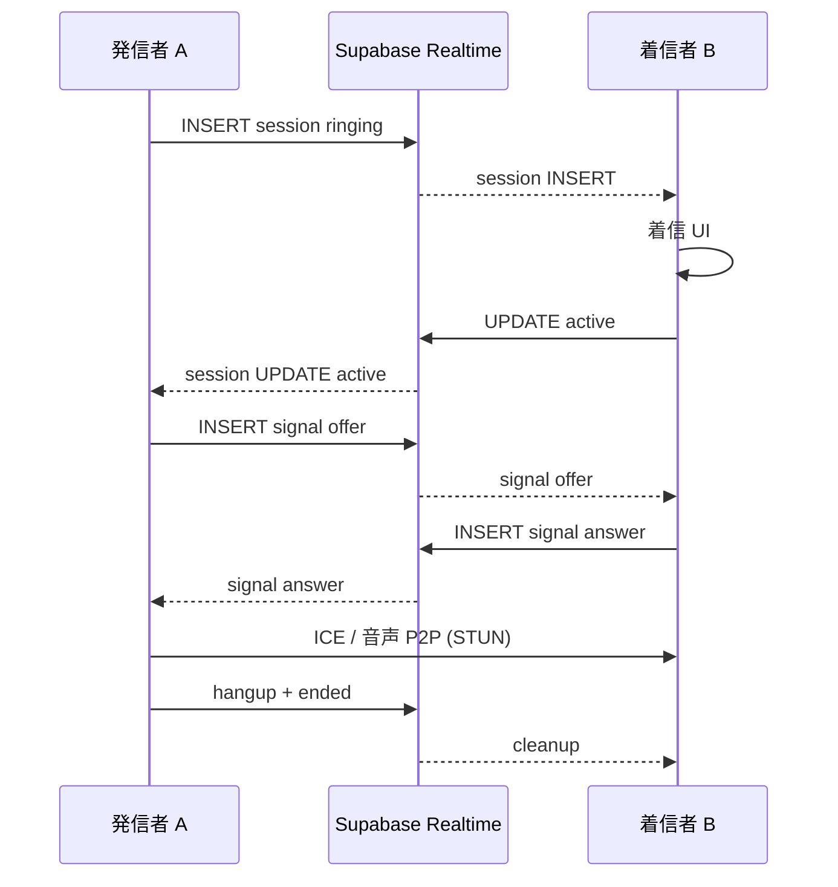

# TALK WebRTC 1対1音声通話 — Phase1 実装レポート

**実装日:** 2026-06-17  
**Epic:** TALK WebRTC MVP（RELEASE FROZEN 既存機能への最小接続のみ）

---

## 1. 概要

`talk-home.html` の `talk-line-room` に 1対1 音声通話（WebRTC + Supabase Realtime シグナリング）を **新規 Epic** として追加した。既存チャット（localStorage）・メッセージ送信ロジックは **変更していない**。

---

## 2. DB スキーマ

### 2.1 ファイル

| ファイル | 内容 |
|----------|------|
| [`sql/talk-call-schema.sql`](../sql/talk-call-schema.sql) | テーブル作成 + 開発用 RLS |
| [`sql/talk-call-rls-production.sql`](../sql/talk-call-rls-production.sql) | 本番 RLS（参加者のみ） |
| [`sql/talk-call-realtime-publication.sql`](../sql/talk-call-realtime-publication.sql) | `supabase_realtime` 追加 |

### 2.2 `talk_call_sessions`

| 列 | 型 | 備考 |
|----|-----|------|
| id | uuid PK | |
| room_id | text | スレッド ID |
| caller_id | text | 発信者 |
| callee_id | text | 着信者 |
| status | text | ringing / active / ended / missed / rejected / busy |
| created_at | timestamptz | |
| expires_at | timestamptz | 作成 + **60秒** |
| started_at | timestamptz | 応答時 |
| ended_at | timestamptz | 終了時 |

### 2.3 `talk_call_signals`

| 列 | 型 | 備考 |
|----|-----|------|
| id | uuid PK | |
| session_id | uuid FK | sessions.id |
| sender_id | text | |
| signal_type | text | offer / answer / candidate / hangup |
| payload | jsonb | SDP / ICE |
| created_at | timestamptz | |

---

## 3. RLS 方針

### 開発（`talk-call-schema.sql`）

- `*_dev` ポリシー: anon / authenticated 全許可（既存 TALK sync と同系統）
- ローカル / ステージング検証用

### 本番（`talk-call-rls-production.sql`）

| テーブル | ポリシー | 内容 |
|----------|----------|------|
| sessions | select | caller / callee / admin |
| sessions | insert | caller_id = `talk_current_user_id()` |
| sessions | update | 参加者 / admin |
| signals | select / insert | セッション参加者のみ、sender_id = 本人 |

前提: [`sql/talk-rls-production.sql`](../sql/talk-rls-production.sql) の `talk_current_user_id()` 適用済み。

---

## 4. 追加ファイル一覧

| ファイル | 責務 |
|----------|------|
| [`scripts/talk-call-webrtc.js`](../scripts/talk-call-webrtc.js) | RTCPeerConnection / getUserMedia / STUN |
| [`scripts/talk-call-signaling.js`](../scripts/talk-call-signaling.js) | Supabase CRUD + Realtime |
| [`scripts/talk-call-ui.js`](../scripts/talk-call-ui.js) | 発信 / 着信 / 通話中オーバーレイ |
| [`scripts/talk-call-service.js`](../scripts/talk-call-service.js) | セッション状態機械・busy / timeout |
| [`talk-call.css`](../talk-call.css) | オーバーレイ UI |
| [`scripts/test-talk-webrtc-call-browser.mjs`](../scripts/test-talk-webrtc-call-browser.mjs) | E2E |

### 既存ファイルの最小変更

| ファイル | 変更 |
|----------|------|
| [`talk-home.html`](../talk-home.html) | CSS + script 4 本追加 |
| [`talk-line-room.js`](../talk-line-room.js) | `syncCallButton` / `call` アクション / `getActiveThread` / `init` で CallService.init / **dev: mock-friend 通話相手 remap** |

**変更していない:** `chat-detail.html`、チャットメッセージ store、Composer 送信、通知マスター等。

---

## 5. イベントフロー



### busy 判定

発信前に `talk_call_sessions` を検索:

- 対象ユーザーが **ringing**（expires_at 有効）または **active** のセッションを保持 → 「相手は通話中です」

### 60 秒 timeout

- `expires_at = created_at + 60s`
- クライアント `setTimeout(60s)` → 仍 ringing なら `status = missed`

### 終話

- `hangup` signal 送信
- `status = ended`
- MediaTrack stop / PC close / Realtime 購読はページ寿命で維持（通話 state のみクリア）

---

## 6. WebRTC 設定

| 項目 | 値 |
|------|-----|
| メディア | `audio: true`, `video: false` |
| STUN | `stun:stun.l.google.com:19302` |
| TURN | **未実装**（Phase2） |
| Twilio | **未使用** |

---

## 7. UI

| 状態 | 表示 |
|------|------|
| 発信中 | 発信中... / キャンセル |
| 着信 | 着信しています / 応答 / 拒否 |
| 通話中 | 通話中 / 経過 MM:SS / ミュート / 終話 |

配置: `talk-line-room` 上に fixed オーバーレイ（同一ページ）。

📞 ボタン: 既存ヘッダーを利用。公式 / グループ / static hub は **disabled**。

---

## 8. 動作確認

### 8.1 自動テスト

```bash
# モジュール + ボタン eligibility（Supabase なしでも可）
node scripts/test-talk-webrtc-call-browser.mjs

# フルフロー（要 SQL 適用 + 認証）
SUPABASE_STRICT=1 node scripts/test-talk-webrtc-call-browser.mjs
```

**前提（STRICT）:**

1. Supabase SQL Editor で `sql/talk-call-schema.sql` → `sql/talk-call-realtime-publication.sql`
2. dev server: `BASE_URL=http://127.0.0.1:8765`
3. 双方 `talk-home.html` を開いた状態（着信は Realtime・フォアグラウンド）

### 8.2 完了条件チェックリスト

| # | 条件 | 実装 | 検証 |
|---|------|------|------|
| 1 | A→B 発信 | ✅ `initiateCall` | ✅ STRICT E2E |
| 2 | B 着信 | ✅ Realtime + UI | ✅ STRICT E2E |
| 3 | B 応答接続 | ✅ offer/answer | ✅ STRICT E2E |
| 4 | 双方音声 | ✅ ontrack + audio | ✅ fake media + connected |
| 5 | 終話 | ✅ hangup | ✅ STRICT E2E |
| 6 | 60s timeout | ✅ missed | ✅ STRICT E2E (62s wait) |
| 7 | busy | ✅ findBusyUser | ✅ STRICT E2E |
| 8 | Realtime | ✅ postgres_changes | ✅ STRICT E2E |
| 9 | 公式不可 | ✅ syncCallButton | ✅ E2E |
| 10 | グループ不可 | ✅ syncCallButton | ✅ E2E |

### 8.3 ローカル実行結果

| コマンド | 結果 | 備考 |
|----------|------|------|
| `node scripts/test-talk-webrtc-call-browser.mjs` | **PASS** (0 errors) | modules / direct enabled / group+official disabled |
| `SUPABASE_STRICT=1 node scripts/test-talk-webrtc-call-browser.mjs` | **PASS** (0 errors) | 発信〜終話・busy・60s timeout フルフロー |

**2026-06-17 実行ログ（非 STRICT）:**

```
OK  call modules loaded
OK  direct thread: call button enabled=true
OK  group thread: call button disabled
OK  official thread: call button disabled
=== PASS (0 errors) ===
```

**2026-06-17 Supabase SQL 適用（linked project `ddojquacsyqesrjhcvmn`）:**

| 順序 | ファイル | 結果 |
|------|----------|------|
| 1 | `sql/talk-call-schema.sql` | ✅ 適用済 |
| 2 | `sql/talk-call-realtime-publication.sql` | ✅ `talk_call_sessions` / `talk_call_signals` を publication 確認 |
| 3 | `sql/talk-call-rls-production.sql` | ✅ 適用済（dev ポリシー drop → participant RLS） |

**2026-06-17 実行ログ（SUPABASE_STRICT=1、BASE_URL=http://127.0.0.1:8765）:**

```
OK  call modules loaded
OK  direct thread: call button enabled=true
OK  group thread: call button disabled
OK  official thread: call button disabled
OK  A thread partner=u_store (dev mock remap)
OK  A→B initiate
OK  B incoming UI (Realtime)
OK  both sides active session
OK  audio path ok (A.pc=connected, B.pc=connected)
OK  hangup cleanup
OK  busy blocks duplicate caller initiate
OK  busy blocks callee while ringing
OK  timeout test: ringing started
OK  60s timeout → missed
OK  60s timeout: caller UI cleared
=== PASS (0 errors) ===
```

### 8.4 検証項目マトリクス（Phase1 完了判定）

| # | 条件 | 検証方法 | 結果 |
|---|------|----------|------|
| 1 | A→B 発信 | STRICT E2E | ✅ PASS |
| 2 | B 着信 | Realtime + 着信 UI | ✅ PASS |
| 3 | B 応答接続 | offer/answer + session active | ✅ PASS |
| 4 | 双方音声 | fake media + `pc=connected` + remote audio | ✅ PASS |
| 5 | 終話 | hangup + session クリア | ✅ PASS |
| 6 | 60s timeout | 62s 無応答 → DB `missed` + UI クリア | ✅ PASS |
| 7 | busy 判定 | 発信者二重 / 着信側発信ブロック | ✅ PASS |
| 8 | Realtime 同期 | B 着信 UI（postgres_changes） | ✅ PASS |
| 9 | 公式ルーム発信不可 | call button disabled | ✅ PASS |
| 10 | グループルーム発信不可 | call button disabled | ✅ PASS |

### 8.5 手動確認（2 ブラウザ）

Playwright STRICT E2E（u_me / u_store 2 ページ）で上記フローを再現済み。手動でも以下で同等確認可能:

1. `talk-home.html?talkDev=1&userId=u_me&tab=chat`（ブラウザ A、JWT サインイン推奨）
2. `talk-home.html?talkDev=1&userId=u_store&tab=chat`（ブラウザ B）
3. 双方 `talk-mock-friend-001` を開く（**talkDev 時は相手 ID を u_me ↔ u_store に自動 remap**）
4. A が 📞 → B 着信 → 応答 → 音声 → 終話

> **Note:** `talk-mock-friend-001` の静的データ上の partner は `u_demo_friend_001` だが、`talkDev=1` かつ `u_me`/`u_store` ログイン時は [`talk-line-room.js`](../talk-line-room.js) の dev remap で相互に通話可能。

---

## 12. Phase1 LOCK 判定

| 項目 | 判定 |
|------|------|
| **Phase1 LOCK** | **✅ LOCK（合格）** |
| 判定日 | 2026-06-17 |
| 根拠 | Supabase DDL + Realtime + 本番 RLS 適用済。`SUPABASE_STRICT=1` E2E 全 10 項目 PASS。 |
| 残リスク（Phase2 へ） | TURN なし（厳格 NAT）、Push なし（フォアグラウンド着信のみ）、`chat-detail.html` 非対応 |

**LOCK 条件:** 1:1 音声通話の発信・着信・応答・P2P 接続・終話・timeout・busy・Realtime・公式/グループ除外が実環境 Supabase 上で動作すること → **満たす**。

---

*旧 Note（解消済）: SQL 適用後 STRICT E2E を再実行 — 2026-06-17 完了。*

---

## 9. 手動確認手順

1. SQL 3 ファイルを Supabase で実行（2026-06-17 適用済）
2. `npm run dev` → `talk-home.html?talkDev=1&userId=u_me&tab=chat`
3. 別ブラウザ / プロファイルで `userId=u_store`
4. 双方 `talk-mock-friend-001` を開く（dev 時 u_me ↔ u_store に remap）
5. A が 📞 → B が着信 → 応答 → 終話

---

## 10. 既知の制限（Phase1）

| 制限 | Phase2 |
|------|--------|
| TURN なし — 厳格 NAT で失敗可 | coturn |
| Push なし — 相手は TALK 起動中のみ着信 | Web Push + SW |
| 通話履歴 UI なし | sessions 一覧 |
| `chat-detail.html` 非対応 | 取引チャット連携 |
| モバイル CSS で 📞 非表示 → `talk-call.css` で enabled 時のみ表示 | — |

---

## 11. RELEASE FROZEN 整合

- TALK コアロジック（メッセージ・通知・一覧）は **挙動変更なし**
- 通話は **追加 Epic**（新規 JS / SQL / 最小フック 3 箇所）
- 凍結監査スクリプトは通話 OFF 時も従来どおり PASS 想定

---

*Phase1 LOCK 判定: 2026-06-17 — 合格（§12 参照）。*
