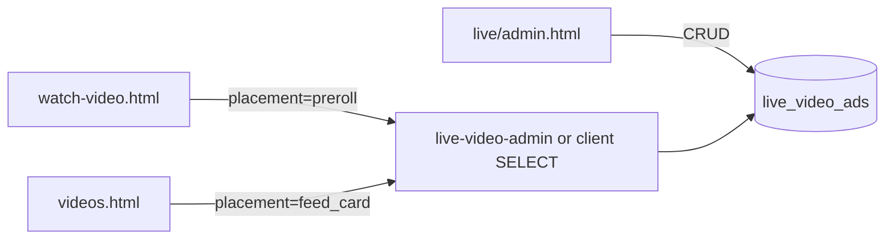

# TASFUL TALK → YouTube型動画サービス拡張 — P1 調査・設計

| 項目 | 内容 |
|------|------|
| 版 | v1.0 |
| 作成日 | 2026-06-23 |
| 種別 | **調査・設計のみ**（実装なし） |
| 方針 | YouTube完全コピーではなく、**既存 LIVE / TALK 資産に動画投稿・視聴・広告の土台を段階追加** |

---

## 0. エグゼクティブサマリー

### 現状の整理

| 領域 | 実体 | 動画との関係 |
|------|------|--------------|
| **TASFUL LIVE** | `live/` HTML・JS・`live_*` テーブル | **TikTok Lite / Shorts 系の主戦場**。投稿・一覧・いいね・フォロー・ライブ視聴が P0 実装済み |
| **TASFUL TALK** | `talk-home.html` + `talk-*` | **メッセージ・通知ハブ**。動画フィードではないが、通知受信箱・DM 導線として再利用価値が高い |
| **chat-*** | `chat-detail.html` 等 | 取引・案件チャット。**動画とは別軸**（LIVE 相談ブリッジのみ接続） |

**結論:** YouTube 型 P1 は **TALK を置き換えず、`live/` を「長尺動画 + チャンネル + 専用視聴ページ」へ拡張**するのが最短。TALK は通知・相談・ダッシュボード導線のハブとして維持する。

### P1 で届ける体験（ユーザー向け）

1. ログイン済みユーザーが **動画を投稿**（MP4、長尺上限は P1 で緩和）
2. **動画一覧**（新着・チャンネル別）を閲覧
3. **専用再生ページ**（共有 URL `live/watch-video.html?id=`）
4. **チャンネル / マイページ**（投稿グリッド + 登録者数）
5. **最小限の動画広告**（運営が手動登録したバナー/動画枠の挿入）
6. **最小限の管理画面**（動画ステータス・広告枠・通報ログ閲覧）

---

## 1. 既存で流用できるもの

### 1.1 フロントエンド（LIVE モジュール）

| 資産 | パス | 流用内容 | P1 での扱い |
|------|------|----------|-------------|
| 共通設定 | `live/live-config.js` | テーブル名、Storage バケット、署名 URL TTL、投稿上限定数 | **拡張**（長尺用定数・新テーブル名追加） |
| 動画投稿 | `live/live-short-upload.js` | `storage.upload()` → DB insert、ドラフト/公開 | **ベースコピー** → `live-video-upload.js`（duration/MIME 緩和） |
| 動画一覧 | `live/live-shorts.js` | 公開一覧 fetch、いいね、カード描画 | **分岐 or 新規** `live-videos.js`（横長サムネ・一覧レイアウト） |
| チャンネル | `live/live-profile.js` | `live_creator_profiles` 表示、フォロワー数、TALK 相談 CTA | **拡張**（投稿グリッド追加） |
| フォロー | `live/live-follow.js` | `live_creator_follows` CRUD、`mountFollowButton()` | **そのまま流用**（チャンネル登録） |
| いいね | `live/live-shorts.js` | `live_short_likes` + RPC 連動 | **パターン流用**（長尺用 likes テーブル） |
| 通知クライアント | `live/live-notify.js` | Edge `live-notify` 呼び出し | **イベント追加**（`video_published` 等） |
| TALK ブリッジ | `live/live-talk-bridge.js` | `ensure-talk-room`（`service_type=live`） | **維持**（チャンネルから相談） |
| ライブ視聴 | `live/live-broadcasts.js`, `live/live-comments.js` | 配信一覧・ライブチャット | **P1 対象外**（既存維持のみ） |
| スタイル | `live/live.css` | ダークテーマ、カード、プロフィール | **追加クラス**（YouTube 風 watch / grid） |

### 1.2 TALK / 認証

| 資産 | パス | 流用内容 |
|------|------|----------|
| Supabase クライアント | `tasu-supabase-client.js` | セッション・JWT |
| ユーザー ID | `auth-current-user.js` | `talk_user_id`（LIVE と共通） |
| ログイン | `login.js`, `member-auth.js` | 会員ログイン → LIVE 投稿ゲート |
| 通知受信箱 | `talk-notifications-store.js`, `talk-home.js` | `talk_notifications` 表示・既読 |
| 通知 CTA | `talk-notify-actions.js` | 深いリンク（再生ページ・チャンネルへ） |
| ルーム確保 | `talk-room-ensure.js`, Edge `ensure-talk-room` | クリエイター相談 DM |

### 1.3 バックエンド（Supabase）

| 資産 | パス / テーブル | 流用内容 |
|------|-----------------|----------|
| LIVE スキーマ | `supabase/migrations/20260628100000_live_p0_schema.sql` | 9 テーブル + Storage + RLS パターン |
| カウンター RPC | `supabase/migrations/20260629100000_live_p0_counts.sql` | フォロワー・いいね数の denorm 更新 |
| 署名 URL | `supabase/functions/live-short-signed-url/index.ts` | 非公開 Storage の再生 URL 発行 |
| 通知 fanout | `supabase/functions/live-notify/index.ts` | `talk_notifications` への配信 |
| RLS ヘルパー | `sql/talk-rls-production.sql` | `talk_current_user_id()`, `talk_is_admin()` |
| モデレーション | `live_moderation_logs` | admin のみ read — 管理画面の監査ログ |

**適用状況メモ:** migration ファイル先頭に `DRAFT · NOT APPLIED` 表記があるが、`reports/tasful-live-p0-schema-apply-result.md` では staging 適用済みの記録あり。**P1 着手前に対象環境のテーブル存在を必ず確認**すること。

### 1.4 既存画面（そのまま or 拡張）

| URL | 状態 | P1 |
|-----|------|-----|
| `live/index.html` | LIVE ハブ | 導線追加（長尺一覧・投稿） |
| `live/shorts.html` | ショートカード一覧 | **維持**（TikTok Lite 系は共存） |
| `live/short-upload.html` | ショート投稿 | **維持** |
| `live/profile.html?userId=` | チャンネル骨格 | **拡張**（動画グリッド） |
| `live/settings.html` | クリエイター設定 | **維持** |
| `talk-home.html` | TALK ハブ | 通知・導線タイルのみ（タブ統合は P1 外） |

---

## 2. 新規追加が必要なもの

### 2.1 画面・フロント

| 項目 | 理由 |
|------|------|
| **長尺動画再生ページ** | `live/short.html` 未実装。YouTube 型は共有 URL 必須 |
| **長尺動画一覧** | 現状はショートのみ。横長サムネ + タイトル + 再生数のリスト/グリッド |
| **長尺投稿 UI** | 60 秒制限・縦型前提の `live-short-upload.js` では不足 |
| **チャンネル投稿グリッド** | `live-profile.js` に動画一覧なし |
| **マイページ（自分）** | 下書き・公開済み・非公開の管理（`live/studio-videos.html` 等） |
| **広告枠コンポーネント** | 再生ページ・一覧への挿入 UI（静的運営登録） |
| **管理画面（最小）** | `live_moderation_logs` は DB のみ。HTML なし |
| **再生数インクリメント** | `view_count` カラムはあるが増分ロジック未実装 |
| **動画コメント** | ショート/長尺とも **未実装**（ライブチャットのみ） |

### 2.2 DB・API

| 項目 | 理由 |
|------|------|
| **`live_videos` テーブル**（推奨） | `live_shorts` は 60 秒・ショート前提。長尺は別エンティティが安全 |
| **`live_video_likes`** | 長尺いいね（または汎用 `live_content_likes`） |
| **`live_video_ads` + `live_ad_impressions`（最小）** | 広告枠の手動運用 |
| **Edge: `live-video-signed-url`** | 長尺バケット用署名 URL（既存のコピー拡張） |
| **Edge: `live-video-view`** | 再生数の冪等インクリメント（乱用防止） |
| **Edge: `live-video-admin`**（最小） | 動画ステータス変更・広告 CRUD（admin JWT） |

### 2.3 意図的に新規にしないもの（P1）

- トランスコード / HLS パイプライン
- レコメンド AI / For You アルゴリズム
- Stripe 収益分配・クリエイター収益化
- ライブ配信の Cloudflare Stream 本接続
- TALK 内フルスクリーン縦スワイプフィード（TikTok 完全体）

---

## 3. 画面一覧（P1 設計）

### 3.1 ユーザー向け

| ID | 画面 | URL 案 | ベース | 優先度 |
|----|------|--------|--------|--------|
| V-01 | 動画ホーム / 一覧 | `live/videos.html` | 新規（`live-shorts.js` パターン） | **P1 必須** |
| V-02 | 動画再生 | `live/watch-video.html?id={uuid}` | 新規（専用プレイヤー + 説明 + チャンネル帯） | **P1 必須** |
| V-03 | 動画投稿 | `live/video-upload.html` | `short-upload` 派生 | **P1 必須** |
| V-04 | チャンネル（公開） | `live/profile.html?userId=` | **既存拡張** | **P1 必須** |
| V-05 | マイチャンネル管理 | `live/my-videos.html` | 新規（自分の動画一覧・下書き） | **P1 必須** |
| V-06 | 登録チャンネル一覧 | `live/subscriptions.html` | 新規（`live_creator_follows`） | P1 任意 |
| — | ショート一覧 | `live/shorts.html` | 既存維持 | 共存 |
| — | LIVE ハブ | `live/index.html` | 既存・導線追加 | **P1 必須** |

### 3.2 運営向け（最小管理）

| ID | 画面 | URL 案 | 機能 |
|----|------|--------|------|
| A-01 | 動画・広告管理 | `live/admin.html` または `admin-live-videos.html` | 動画 `status` 変更、広告枠 CRUD、通報ログ閲覧 |
| A-02 | （将来）モデレーションキュー | — | AI 審査・一括処理は P2 以降 |

**ゲート:** `talk_is_admin()` JWT または既存 ops ロールパターン（`match_admin` / `tasu_admin` と同型）。

### 3.3 既存画面への導線追加（HTML 新規なし）

| 画面 | 追加 |
|------|------|
| `dashboard.html` | 「動画を見る」「動画を投稿」タイル |
| `talk-home.html` | `type=live` 通知 CTA → `watch-video.html` / `profile.html` |
| `live/index.html` | 長尺セクションカード |

---

## 4. DB 設計案（P1）

### 4.1 方針

- **ショート（`live_shorts`）は変更最小** — TikTok Lite 系を壊さない
- **長尺は `live_videos` を新設** — YouTube 型の主エンティティ
- **クリエイターは `live_creator_profiles` を共用** — チャンネル = 既存プロフィール
- **ID は `talk_user_id`（text）** — TALK / LIVE 既存と統一

### 4.2 新規テーブル: `live_videos`

```sql
-- 案（P1 · migration 新規）
create table public.live_videos (
  id uuid primary key default gen_random_uuid(),
  creator_id text not null references live_creator_profiles(user_id),
  title text not null,
  description text,
  tags text[] not null default '{}',
  storage_path text not null,
  thumb_storage_path text,
  duration_sec integer not null check (duration_sec > 0 and duration_sec <= 7200), -- P1: 最大2h
  width integer,
  height integer,
  status text not null default 'draft'
    check (status in ('draft','processing','published','hidden','removed')),
  visibility text not null default 'public'
    check (visibility in ('public','unlisted','private')),
  view_count bigint not null default 0,
  like_count integer not null default 0,
  published_at timestamptz,
  created_at timestamptz not null default now(),
  updated_at timestamptz not null default now()
);
```

| カラム | 備考 |
|--------|------|
| `status=processing` | P1 では即 `published` でも可（トランスコードなし） |
| `visibility=unlisted` | URL 知っている人のみ（YouTube 同等の最小） |
| `view_count` | Edge RPC でのみ更新 |

**インデックス:** `(status, published_at desc)`, `(creator_id, published_at desc)`

### 4.3 新規テーブル: `live_video_likes`

```sql
create table public.live_video_likes (
  video_id uuid not null references live_videos(id) on delete cascade,
  user_id text not null,
  created_at timestamptz not null default now(),
  primary key (video_id, user_id)
);
```

既存 `live_refresh_short_like_count` と同型の `live_refresh_video_like_count` RPC を追加。

### 4.4 新規テーブル: 広告（最小）

```sql
create table public.live_video_ads (
  id uuid primary key default gen_random_uuid(),
  name text not null,
  placement text not null check (placement in ('preroll','midroll','feed_card')),
  media_type text not null check (media_type in ('image','video')),
  storage_path text,           -- 画像/動画（Storage）
  click_url text,
  is_active boolean not null default true,
  weight integer not null default 1,
  starts_at timestamptz,
  ends_at timestamptz,
  created_at timestamptz not null default now()
);

-- P1: インプレッション集計は任意（まずは表示のみなら不要）
create table public.live_ad_impressions (
  id uuid primary key default gen_random_uuid(),
  ad_id uuid not null references live_video_ads(id),
  video_id uuid references live_videos(id),
  user_id text,
  created_at timestamptz not null default now()
);
```

### 4.5 既存テーブル（変更なし / 参照のみ）

| テーブル | P1 での利用 |
|----------|-------------|
| `live_creator_profiles` | チャンネルメタ・投稿権限ゲート |
| `live_creator_follows` | チャンネル登録 |
| `live_shorts` / `live_short_likes` | ショート共存 |
| `talk_notifications` | 新着動画・登録者向け通知 |
| `live_notify_dedupe` | 通知重複防止 |
| `live_moderation_logs` | 管理画面からの処分記録 |
| `live_broadcasts` | P1 非拡張 |

### 4.6 RLS 方針（既存パターン踏襲）

| 操作 | ルール |
|------|--------|
| `live_videos` SELECT | `published` + `public` は認証ユーザー、`unlisted` は ID 直指定、`private` は本人のみ |
| INSERT/UPDATE | `creator_id = talk_current_user_id()` + `live_has_broadcast_permission()` |
| `live_video_ads` | SELECT: 認証ユーザー（active のみ） / ALL: `talk_is_admin()` |
| カウンター列 | トリガーで直接 UPDATE 禁止（既存 LIVE と同じ） |

---

## 5. Storage 設計案（P1）

### 5.1 既存バケット（流用）

| バケット | 用途 | P1 |
|----------|------|-----|
| `short-videos` | ショート MP4 | 維持 |
| `short-video-thumbnails` | ショートサムネ | 維持 |
| `live-avatars` | チャンネルアイコン | 維持 |
| `live-thumbnails` | 汎用サムネ（公開 read） | 長尺サムネにも流用可 |

### 5.2 新規バケット（推奨）

| バケット | public | 上限 | MIME | パス規約 |
|----------|--------|------|------|----------|
| `live-videos` | **private** | 2 GB（P1 暫定） | `video/mp4` | `{talk_user_id}/{video_id}.mp4` |
| `live-video-thumbnails` | private | 5 MB | jpeg/png/webp | `{talk_user_id}/{video_id}.jpg` |

**再生:** Storage 直リンクは使わず、Edge `live-video-signed-url`（TTL 300s、既存ショートと同じ）。

### 5.3 P1 でやらない Storage こと

- `live-archives`（ライブアーカイブ）の有効化
- マルチビットレート / トランスコード出力
- CDN キャッシュポリシーの最適化
- クライアント側のチャンクアップロード（Resumable）

### 5.4 サムネイル

P1 最小: **投稿時にクライアントで 1 フレーム抽出 or 画像アップロード**。サーバー側サムネ生成は P2。

---

## 6. Edge Function / API 設計案（P1）

### 6.1 既存拡張

| Function | 変更 |
|----------|------|
| `live-notify` | イベント追加: `video_published`, `video_liked`（`target_url` → `watch-video.html?id=`） |
| `live-short-signed-url` | 変更なし |

### 6.2 新規 Edge Functions

| Function | Method | 認可 | 役割 |
|----------|--------|------|------|
| `live-video-signed-url` | POST | 認証ユーザー | `live_videos` が視聴可能なら署名 URL 発行 |
| `live-video-view` | POST | 認証ユーザー | `view_count` +1（`video_id` + `user_id` + 日次 dedupe） |
| `live-video-publish` | POST | クリエイター | 下書き → 公開、上限チェック、通知 fanout |
| `live-video-admin` | GET/POST/PATCH | `talk_is_admin()` | 動画 status 変更、広告 CRUD |

### 6.3 クライアント API（`live-config.js` 拡張）

```text
TasuLiveConfig.fetchPublishedVideos({ limit, cursor })
TasuLiveConfig.fetchVideoById(id)
TasuLiveConfig.fetchCreatorVideos(creatorId)
TasuLiveConfig.uploadVideo(file, metadata)      // storage + insert draft
TasuLiveConfig.publishVideo(id)
TasuLiveConfig.likeVideo(id) / unlikeVideo(id)
TasuLiveConfig.fetchVideoSignedUrl(id)
TasuLiveConfig.recordVideoView(id)
TasuLiveConfig.fetchActiveAds(placement)
```

### 6.4 直接 Supabase クライアントでよい操作（P1）

- `live_creator_profiles` の bio 更新（既存）
- `live_creator_follows` insert/delete（既存）
- `live_video_likes` insert/delete（RLS 許可時）

**原則:** 再生 URL・view_count・公開処理は **Edge 経由**（service_role 濫用防止）。

---

## 7. 動画広告の最小構成（P1）

### 7.1 スコープ

**本格広告配信（入札・ターゲティング・収益分配）は P1 外。** 運営が手動登録した枠を表示するだけ。

### 7.2 配置（最小）

| placement | 表示箇所 | 形式 |
|-----------|----------|------|
| `feed_card` | `live/videos.html` 一覧の 5 件ごと | 画像カード + 外部リンク |
| `preroll` | `watch-video.html` 再生前 | 5 秒スキップ不可の静止画 or 短 MP4（P1 は静止画推奨） |

### 7.3 データフロー



### 7.4 P1 でやらない広告機能

- 第三者広告ネットワーク連携
- インプレッション課金・CPM 計算
- クリエイター収益配分
- A/B テスト・頻度キャップ（`live_ad_impressions` は P1 任意）

---

## 8. 実装フェーズ分け

| Phase | 内容 | 依存 |
|-------|------|------|
| **Phase 0** | 環境確認（`live_*` テーブル適用状況、署名 URL 動作） | — |
| **Phase 1** | Migration: `live_videos`, `live_video_likes`, Storage バケット, RLS | Phase 0 |
| **Phase 2** | Edge: `live-video-signed-url`, `live-video-view`, `live-video-publish` | Phase 1 |
| **Phase 3** | UI: `video-upload.html`, `videos.html`, `watch-video.html` | Phase 2 |
| **Phase 4** | UI: `profile.html` グリッド, `my-videos.html`, `live/index` 導線 | Phase 3 |
| **Phase 5** | 通知拡張（`live-notify` + TALK 通知タブ CTA） | Phase 3 |
| **Phase 6** | 広告最小（`live_video_ads` + 一覧/再生への挿入） | Phase 3 |
| **Phase 7** | 管理画面最小（`live/admin.html` + `live-video-admin`） | Phase 1, 6 |
| **Phase 8** | E2E 検証スクリプト（390/768/1280）+ ステージング smoke | 全 Phase |

**推奨工期感（目安）:** Phase 1–4 が P1 コア（2–3 スプリント相当）、Phase 5–7 は同スプリント後半または P1.1。

---

## 9. P1 でやること / やらないこと

### 9.1 P1 でやること ✅

| # | 項目 |
|---|------|
| 1 | 長尺動画投稿（MP4・ドラフト/公開・上限緩和） |
| 2 | 動画一覧（新着・グリッド） |
| 3 | 動画再生専用ページ（共有 URL） |
| 4 | チャンネルページ拡張（投稿グリッド・登録者数・フォロー） |
| 5 | マイ動画管理（自分の一覧・ステータス） |
| 6 | いいね（長尺） |
| 7 | 再生数カウント（最小 RPC） |
| 8 | 署名付き再生 URL |
| 9 | TALK 通知連携（新着動画・フォロー中チャンネル） |
| 10 | 運営向け最小管理（動画非公開化・広告枠登録） |
| 11 | ダッシュボード / LIVE ハブからの導線 |

### 9.2 P1 でやらないこと ❌

| # | 項目 | 理由 |
|---|------|------|
| 1 | 本格広告配信・入札 | スコープ外 |
| 2 | 収益分配・Stripe クリエイター支払い | 2026-09 以降の別 Epic |
| 3 | ライブ拡張（HLS 本番・Stream） | P0 スタブ維持 |
| 4 | レコメンド AI / For You | 新着順で十分 |
| 5 | 高度な動画変換・トランスコード | コスト・複雑度 |
| 6 | 動画コメント | P1.1 候補（ライブチャットのパターン流用） |
| 7 | 縦スワイプ全画面ショートフィード | TikTok 完全体は別トラック |
| 8 | 匿名視聴 | 既存 LIVE は認証必須 — P1 も踏襲 |
| 9 | TALK タブへの動画フィード統合 | UI 破壊リスク — 導線のみ |

---

## 10. リスクと注意点

### 10.1 技術リスク

| リスク | 影響 | 緩和策 |
|--------|------|--------|
| **Migration 未適用環境** | 開発と staging で挙動不一致 | Phase 0 で `live_*` 存在チェックを CI 化 |
| **大容量 MP4 の直アップロード** | タイムアウト・モバイル失敗 | P1 上限 500MB〜2GB 明示、失敗時メッセージ |
| **署名 URL TTL 300s** | 長時間再生で切れる | プレイヤー側で期限前に再取得 |
| **`talk_user_id` と `auth.uid` 混在** | RLS 漏れ | 既存 `talk_current_user_id()` のみ使用 |
| **ショートと長尺の二重実装** | 保守コスト | 共通 `live-upload-core.js` へ段階抽出 |

### 10.2 プロダクトリスク

| リスク | 緩和策 |
|--------|--------|
| YouTube クローンに見える | 建設・スキル・地域ビジネス文脈のカテゴリ・コピー |
| TALK ユーザー混乱 | TALK = 会話、LIVE/Video = 視聴と明記 |
| フォロー二重系（`talk_follow_subscriptions` vs `live_creator_follows`） | UI ではチャンネル登録 = `live_creator_follows` のみ |

### 10.3 法務・運用

| 項目 | P1 対応 |
|------|---------|
| 著作権・不適切動画 | `live_moderation_logs` + 管理画面から `removed` |
| 投稿資格 | 既存 `live_permission_status` ゲートを長尺にも適用 |
| 個人情報 | 動画メタに電話番号等を載せないガイドライン（静的ページ） |

### 10.4 既知ギャップ（調査時点）

| 項目 | 状態 |
|------|------|
| `live/short.html` | 未実装（ショート共有 URL） |
| `live/following.html`, `live/search.html` | 未実装 |
| ショートコメント | 未実装 |
| `view_count` 増分 | 未実装 |
| dashboard / talk-home → LIVE タイル | 未配線（設計のみ） |
| 本番 LIVE ローンチ | P0 技術完了・本番 GO は別判断 |

---

## 付録 A. 既存ファイルマップ（調査参照）

### LIVE（動画主戦場）

```
live/
  index.html          # ハブ
  shorts.html         # ショート一覧
  short-upload.html   # ショート投稿
  profile.html        # チャンネル
  settings.html       # 設定
  watch.html          # ライブ視聴
  studio.html         # 配信スタジオ
  live-config.js
  live-shorts.js
  live-short-upload.js
  live-profile.js
  live-follow.js
  live-notify.js
  live-talk-bridge.js
  live.css
```

### TALK（通知・会話）

```
talk-home.html / talk-home.js
talk-notifications-store.js
talk-notify-actions.js
talk-room-ensure.js
chat-detail.html
tasu-supabase-client.js
auth-current-user.js
```

### Supabase

```
supabase/migrations/20260628100000_live_p0_schema.sql
supabase/migrations/20260629100000_live_p0_counts.sql
supabase/functions/live-short-signed-url/
supabase/functions/live-notify/
sql/talk-rls-production.sql
sql/talk-sync-schema.sql
```

### 設計ドキュメント（既存）

- `reports/tasful-live-p0-design.md` — LIVE P0 全体設計
- `reports/tasful-live-p0-final-review.md` — P0 完了レビュー
- `reports/tasful-live-p1-profile-follow-result.md` — プロフィール/フォロー検証

---

## 付録 B. P1 完了の受け入れ基準（案）

1. 認証ユーザーが MP4 を投稿し、一覧に表示される
2. `watch-video.html?id=` で再生でき、署名 URL が機能する
3. チャンネルページに投稿グリッドが表示される
4. フォロー・いいねが動作し、TALK 通知タブに新着が届く
5. 運営 admin が動画を非公開にでき、広告枠を 1 件登録して一覧に表示できる
6. 390 / 768 / 1280 px で主要画面が崩れない
7. 既存 `live/shorts.html`・TALK チャットが回帰しない

---

*本ドキュメントは実装指示書ではなく P1 設計のたたき台である。着手時は migration 名・URL 最終名をチームで確定すること。*
