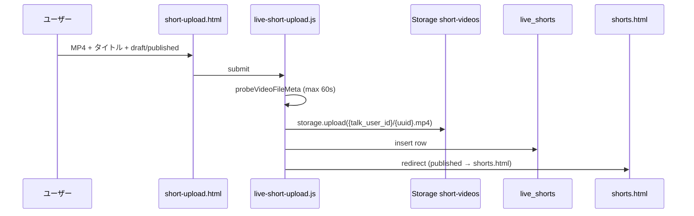

# TASFUL LIVE Phase 0 監査 — YouTube型 P1 着手前調査

| 項目 | 内容 |
|------|------|
| 版 | v1.0 |
| 作成日 | 2026-06-23 |
| 種別 | **調査のみ**（DB / Edge / HTML / JS 変更なし） |
| 参照設計 | [`talk-youtube-conversion-p1-plan.md`](talk-youtube-conversion-p1-plan.md) |
| 方針 | `youtube/` 新設なし · 既存 `live/` 拡張 · TALK は通知/DM ハブ |

---

## 0. エグゼクティブサマリー

### ショート動画フロー（現状）

| ステップ | 実装状況 | 備考 |
|----------|----------|------|
| **投稿** | ✅ 実装済 | `short-upload.html` + `live-short-upload.js` |
| **保存** | ✅ 実装済 | Storage `short-videos` + `live_shorts` INSERT |
| **一覧** | ✅ 実装済 | `shorts.html` + `live-shorts.js`（カードグリッド） |
| **再生** | △ 部分実装 | 一覧内インライン再生のみ。**専用視聴 URL なし** |
| **チャンネル表示** | △ 部分実装 | `profile.html` は bio/フォロワー。**投稿グリッドなし** |

### YouTube型（長尺）に必要なこと

`live_shorts` は **60 秒上限・縦型ショート前提**のため、長尺 YouTube 型は **`live_videos` 新規テーブル + 新バケット** が必須。ただし **投稿〜署名 URL〜いいね〜フォロー〜通知のパターンはほぼそのまま流用可能**。

### Phase 1 へ進んでよいか

| 判定 | **条件付き Go（Proceed with pre-flight）** |
|------|---------------------------------------------|
| 意味 | LIVE P0 基盤は staging で動作実績あり。YouTube P1 の **Phase 1（migration 追加）に進める**が、下記「P1 着手前チェックリスト」を先に実施すること |

**No-Go 条件:** 対象 Supabase に `live_shorts` が存在しない / Edge `live-short-signed-url` 未デプロイ / `talk-rls-production.sql` 未適用。

---

## 1. 現在の LIVE 資産一覧

### 1.1 HTML（`live/` · 23 ファイル）

| ファイル | 役割 | YouTube P1 関連 |
|----------|------|-----------------|
| `index.html` | LIVE ハブ | 導線追加先 |
| `shorts.html` | ショート一覧フィード | 一覧パターンの参照 |
| `short-upload.html` | ショート投稿 | 投稿 UI の参照 |
| `profile.html` | クリエイターチャンネル | **拡張対象**（動画グリッド） |
| `settings.html` | クリエイター設定 | 維持 |
| `watch.html` | **ライブ配信**視聴 | 長尺動画視聴とは別物 |
| `create.html` / `studio.html` | ライブ配信作成/管理 | P1 対象外 |
| `gifts.html` / `tips.html` | 投げ銭 UI（スタブ） | P1 対象外 |

**未実装（設計のみ）:** `short.html?id=`（単体ショート視聴）、`following.html`、`search.html`、**`videos.html` / `watch-video.html`（長尺）**

### 1.2 JavaScript

| ファイル | 役割 | 行数規模 |
|----------|------|----------|
| `live-config.js` | 定数・Storage パス・署名 URL・Edge 呼び出し | 中核 |
| `live-short-upload.js` | MP4 アップロード → DB insert | 投稿の雛形 |
| `live-shorts.js` | 一覧・いいね・再生 URL 解決 | 一覧+再生の雛形 |
| `live-profile.js` | チャンネル表示・設定 upsert | チャンネルの雛形 |
| `live-follow.js` | フォロー/解除 | そのまま流用 |
| `live-notify.js` | Edge `live-notify` クライアント | 通知連携 |
| `live-talk-bridge.js` | TALK DM ルーム確保 | 維持 |
| `live-broadcasts.js` | ライブ一覧/視聴（stub） | P1 外 |
| `live-comments.js` | ライブチャット | 動画コメント未実装 |
| `live-gifts.js` / `live-tips.js` | 投げ銭スタブ | P1 外 |

### 1.3 CSS

| ファイル | 内容 |
|----------|------|
| `live/live.css` | ダークテーマ · カードグリッド · 9:16 メディア · プロフィール |

### 1.4 Edge Functions（LIVE 関連）

| Function | パス | 状態 |
|----------|------|------|
| `live-short-signed-url` | `supabase/functions/live-short-signed-url/index.ts` | 実装済 · staging デプロイ記録あり |
| `live-notify` | `supabase/functions/live-notify/index.ts` | 実装済 · `talk_notifications` fanout |

### 1.5 検証スクリプト（`package.json`）

| npm script | 内容 |
|------------|------|
| `verify:live-p0-schema` | migration 静的 + DB/RLS/bucket |
| `verify:live-p1` 〜 `p7` | プロフィール〜通知の段階 smoke |

### 1.6 設計・適用レポート

| レポート | 内容 |
|----------|------|
| `tasful-live-p0-design.md` | P0 全体設計 |
| `tasful-live-p0-schema-apply-result.md` | **staging 適用成功**（2026-06-23） |
| `tasful-live-p0-final-review.md` | P0 技術完了 Go（本番公開は別ゲート） |
| `tasful-live-p3-shorts-result.md` | 投稿/一覧/いいね |
| `tasful-live-p4-short-signed-url-result.md` | 他者動画視聴 Edge |
| `tasful-live-p7-notify-counts-result.md` | いいね/フォロワー RPC |

---

## 2. ショート動画投稿フロー（現状）



### 2.1 ゲート条件

| 条件 | 実装 |
|------|------|
| ログイン | `talk_user_id` 必須（`auth-current-user.js`） |
| 形式 | `video/mp4` のみ |
| 長さ | クライアント **≤ 60 秒**（`LIVE_SHORT_MAX_DURATION_SEC`） |
| DB CHECK | `duration_sec between 1 and 60` |
| 投稿権限 | RLS: `live_has_broadcast_permission()` + `creator_status=active` |
| 日次上限 | UI 注意文のみ（**Edge 強制なし**） |
| active 上限 | `live_creator_profiles.short_active_count` CHECK ≤ 50 |

### 2.2 保存データ

| 層 | 内容 |
|----|------|
| Storage | `short-videos/{talk_user_id}/{short_uuid}.mp4` |
| DB | `live_shorts`: title, description, storage_path, duration_sec, status, published_at |
| サムネ | `thumb_storage_path` カラムあり · **アップロード UI なし** |

### 2.3 未完了・既知ギャップ

| 項目 | 状態 |
|------|------|
| 専用視聴ページ `short.html` | **未実装** |
| チャンネル投稿一覧 | **未実装** |
| `view_count` 増分 | カラムのみ · **RPC/Edge なし** |
| ショートコメント | **未実装** |
| トランスコード | なし（生 MP4） |
| `talkDev=1` | Edge 署名 URL スキップ（owner direct のみ） |

---

## 3. Storage 設計の現状

### 3.1 バケット（migration 定義）

| バケット | public | 上限 | MIME | P1 用途 |
|----------|--------|------|------|---------|
| `short-videos` | **false** | 80 MB | video/mp4 | ショート（既存） |
| `short-video-thumbnails` | false | 2 MB | image/* | サムネ（未使用） |
| `live-avatars` | true | 2 MB | image/* | チャンネルアイコン |
| `live-thumbnails` | true | 2 MB | image/* | 汎用サムネ |
| `live-archives` | — | — | — | **コメントアウト**（P1 VOD 用予約） |

### 3.2 パス規約

```
short-videos/{talk_user_id}/{asset_uuid}.mp4
```

`live-config.js` の `buildShortStoragePath(userId, shortId)` で生成。

### 3.3 Storage RLS（`short-videos`）

| policy | 内容 |
|--------|------|
| `live_storage_short_videos_select_own` | **所有者のみ** SELECT |
| insert/update/delete | 所有者のみ |

**視聴者が Storage を直接読めない**ため、他者視聴は **Edge 経由 signed URL が必須**（Phase 4 で解決済み）。

### 3.4 YouTube 長尺向け Storage（未作成）

設計案（P1 計画より）:

| バケット | 用途 |
|----------|------|
| `live-videos` | 長尺 MP4（private） |
| `live-video-thumbnails` | 長尺サムネ（private） |

---

## 4. signed URL の現状

### 4.1 定数

| 定数 | 値 | 定義場所 |
|------|-----|----------|
| `LIVE_SIGNED_URL_TTL_SECONDS` | **300** | `live-config.js` / Edge |

### 4.2 Edge: `live-short-signed-url`

```
POST /functions/v1/live-short-signed-url
Authorization: Bearer <user_jwt>
{ "short_id": "<uuid>" }
→ { signedUrl, expiresIn: 300 }
```

| チェック | 内容 |
|----------|------|
| 認証 | Bearer 必須 |
| 公開状態 | `status === 'published'` のみ |
| 発行 | service_role で `short-videos` の `createSignedUrl` |

### 4.3 フロント解決順（`live-shorts.js` `resolveVideoUrl`）

| 順 | 経路 | 条件 |
|----|------|------|
| 1 | `fetchShortSignedUrlViaEdge` | `talkDev=1` **以外** |
| 2 | `getSignedShortVideoUrl`（client） | Edge 失敗かつ **自分の動画** |
| 3 | プレースホルダ | 上記失敗 |

### 4.4 長尺向けギャップ

- `live-video-signed-url` Edge は **未実装**
- 長尺バケットは **未作成**

---

## 5. DB / migration 適用状況

### 5.1 migration ファイル

| ファイル | 内容 | ファイル先頭表記 |
|----------|------|------------------|
| `20260628100000_live_p0_schema.sql` | 9 テーブル + 4 bucket + RLS 52 policy | **`DRAFT · NOT APPLIED`** |
| `20260629100000_live_p0_counts.sql` | follower/like count RPC + guard 更新 | 同上系 |

### 5.2 実環境 vs ファイル表記のズレ

| 観点 | ファイル上 | 実環境（レポート記録） |
|------|------------|------------------------|
| 適用状態 | DRAFT / NOT APPLIED | **staging (`ddojquacsyqesrjhcvmn`) 適用成功**（2026-06-23） |
| 適用方法 | — | `npx supabase db query --linked -f ...`（**個別適用**） |
| migration 履歴 | — | `supabase db push` は MATCH キューで停止 · **履歴整合が未完了** |
| 本番 | — | **本番適用の記録なし**（staging のみ） |

**結論:** ファイル先頭コメントは **陳腐化**。実 DB 状態は **適用レポートを正**とし、着手前に対象環境でテーブル存在を再確認すること。

### 5.3 `live_*` テーブル（9）

| テーブル | 主用途 | 長尺流用 |
|----------|--------|----------|
| `live_creator_profiles` | チャンネル・権限ゲート | ✅ そのまま |
| `live_shorts` | ショート動画メタ | △ 60s 制約 · 別テーブル推奨 |
| `live_short_likes` | ショートいいね | △ パターン流用 |
| `live_broadcasts` | ライブ配信 | P1 外 |
| `live_broadcast_messages` | ライブチャット | コメント設計の参考 |
| `live_creator_follows` | チャンネル登録 | ✅ そのまま |
| `live_tips` | 投げ銭スタブ | P1 外 |
| `live_moderation_logs` | 運営監査 | ✅ 管理画面で利用 |
| `live_notify_dedupe` | 通知重複防止 | ✅ そのまま |

### 5.4 関連 TALK テーブル

| テーブル | LIVE 連携 |
|----------|-----------|
| `talk_notifications` | `type=live` で fanout（`live-notify` Edge） |
| `transaction_rooms` | `service_type=live` で相談 DM（`live-talk-bridge.js`） |

### 5.5 静的検証（本監査で実施）

```bash
npm run verify:live-p0-schema -- --static-only
# PASS: 43 / FAIL: 0 / SKIP: 7
```

DB 到達性検証は **SERVICE_ROLE_KEY 未設定のため未実施**。staging 再確認は Phase 0.5 チェックリストで実施推奨。

---

## 6. 長尺動画に流用できる部分

### 6.1 そのまま流用（コード変更最小）

| 領域 | 資産 |
|------|------|
| 認証 | `tasu-supabase-client.js`, `auth-current-user.js`, `member-auth.js` |
| チャンネル | `live_creator_profiles`, `live-profile.js`, `live-follow.js` |
| フォロー通知 | `live-notify` event `follow_created` |
| Storage パターン | private bucket + owner path + Edge signed URL |
| 投稿 UI 構造 | `live-short-upload.js`（ファイル選択・メタ・draft/publish） |
| 一覧 UI 構造 | `live-shorts.js`（fetch → card → signed URL） |
| いいねパターン | `live_short_likes` + `live_refresh_short_like_count` RPC |
| TALK 通知 UI | `talk-home.js` notify タブ |
| RLS パターン | `talk_current_user_id()`, `live_has_broadcast_permission()` |

### 6.2 拡張が必要（既存テーブルでは不足）

| 要件 | 理由 |
|------|------|
| **`live_videos` 新規** | `live_shorts.duration_sec ≤ 60` CHECK · ショート前提カラム設計 |
| **長尺バケット** | 80MB/60s とは別上限が必要 |
| **`live_video_likes`** | 既存 likes は `short_id` FK |
| **視聴ページ** | `short.html` 未実装 · 長尺用 `watch-video.html` 新規 |
| **チャンネルグリッド** | `live-profile.js` に fetch/render なし |
| **view_count RPC** | 両テーブルとも未配線 |

### 6.3 `live_shorts` を長尺に流用しない理由

```sql
-- 20260628100000_live_p0_schema.sql
constraint live_shorts_duration_sec_chk
  check (duration_sec between 1 and 60),
```

CHECK 変更は **既存ショートデータ・検証スクリプト・P0 契約を破壊**するリスクがある。YouTube 長尺は **別テーブル**が安全。

---

## 7. 新規実装が必要な部分（P1 コア）

優先順は「投稿 → 保存 → 一覧 → 再生 → チャンネル」の通しを最優先。

### 7.1 DB（Phase 1）

| オブジェクト | 内容 |
|--------------|------|
| `live_videos` | 長尺メタ（duration 上限緩和 · visibility） |
| `live_video_likes` | 長尺いいね |
| Storage buckets | `live-videos`, `live-video-thumbnails` |
| RLS policies | 既存 LIVE パターン踏襲 |
| RPC（任意 P1） | `live_refresh_video_like_count`, view increment |

### 7.2 Edge（Phase 2）

| Function | ベース |
|----------|--------|
| `live-video-signed-url` | `live-short-signed-url` のコピー拡張 |
| `live-video-view`（推奨） | view_count 冪等更新 |
| `live-notify` 拡張 | event `video_published` 追加 |

### 7.3 JS（Phase 3 — UI 作り込み前の骨格）

| ファイル | 役割 |
|----------|------|
| `live-video-upload.js` | `live-short-upload.js` 派生 |
| `live-videos.js` | 一覧 + いいね + signed URL |
| `live-watch-video.js` | 単体再生ページ |
| `live-profile.js` 拡張 | `fetchCreatorVideos()` + グリッド |
| `live-config.js` 拡張 | 定数・テーブル・Edge 名 |

### 7.4 HTML（Phase 3）

| ファイル | 役割 |
|----------|------|
| `live/videos.html` | 長尺一覧 |
| `live/video-upload.html` | 長尺投稿 |
| `live/watch-video.html` | 長尺再生（**YouTube 視聴ページ**） |
| `live/profile.html` | 既存 · JS 拡張でグリッド |
| `live/my-videos.html`（任意） | 自分の動画管理 |

### 7.5 管理画面（P1 最小 · Phase 7）

| ファイル | 役割 |
|----------|------|
| `live/admin.html` | 動画 status 変更 · `live_moderation_logs` 閲覧 |

### 7.6 広告（P1 最小 · Phase 6）

| オブジェクト | 内容 |
|--------------|------|
| `live_video_ads` | 手動登録枠 |
| 一覧/再生への静的挿入 | 入札なし |

---

## 8. 本番影響が出る箇所

| 箇所 | 影響 | 緩和 |
|------|------|------|
| **Supabase migration 追加** | `live_videos` 等の新テーブル · 既存 `live_*` は非破壊 | 新 migration ファイルのみ · 既存 ALTER 禁止 |
| **Storage 新バケット** | 課金・ポリシー追加 | 既存 bucket 無変更 |
| **Edge 新規 deploy** | Functions 枠 · 既存 2 本は無変更 | 新関数のみ追加 |
| **`live-notify` 拡張** | `talk_notifications` に新 event | 後方互換 event 追加のみ |
| **TALK / MATCH** | migration が MATCH 待ちキューに影響 | **MATCH 保留中 · LIVE 単独 migration ファイルで適用**（P0 と同手法） |
| **Marketplace / Builder** | P0 設計で非接触 | 遵守 |
| **既存 `live/shorts.html`** | 触らなければ影響なし | ショート系ファイルは分離 |
| **本番 Supabase** | **未適用の可能性** | staging で検証後 · 本番は別ランブック |

---

## 9. P1 実装前に潰すべきリスク

| # | リスク | 深刻度 | 対策（Phase 0.5） |
|---|--------|--------|-------------------|
| R1 | migration ファイル表記と実 DB の不一致 | 高 | 対象 ref で `live_shorts` SELECT · レポート更新 |
| R2 | `supabase migration list` 履歴未整合 | 高 | `migration repair` 方針文書化 · P0 踏襲 |
| R3 | 本番未適用で dev のみ動作 | 高 | 環境ごと適用チェックリスト |
| R4 | Edge 未デプロイ環境で再生不可 | 高 | `live-short-signed-url` の deploy 確認を P1 前に |
| R5 | `talkDev=1` で Edge スキップ | 中 | 本番検証は `talkDev` なしで実施 |
| R6 | 投稿権限ゲートで一般ユーザーが投稿不可 | 中 | テスト用 `ops_approved` ユーザー準備 |
| R7 | 署名 URL TTL 300s · 長尺再生中断 | 中 | プレイヤー再取得（P1 JS で対応） |
| R8 | `live_shorts` と `live_videos` の二重実装コスト | 中 | 共通 `live-media-core.js` へ段階抽出 |
| R9 | dist 同期漏れ（`:8788`） | 中 | `deploy/cloudflare/dist/live/` 同期を CI 化 |
| R10 | 匿名視聴不可（認証必須） | 低 | P1 スコープ外 · 要件として明示 |

---

## 10. 推奨実装順（YouTube P1）

設計書 Phase 1〜8 を、**「通し優先・UI 最後」**に再整理。

| Step | 内容 | 成果 |
|------|------|------|
| **0.5** | 環境監査（本レポートのチェックリスト実行） | DB/Edge 存在確認 |
| **1** | migration: `live_videos`, likes, buckets, RLS | データ層 |
| **2** | Edge: `live-video-signed-url`, `live-video-view` | 再生可能 |
| **3a** | `live-config.js` 拡張 + `live-video-upload.js` | **投稿→保存** |
| **3b** | `live-videos.js` + `videos.html` | **一覧** |
| **3c** | `live-watch-video.js` + `watch-video.html` | **再生** |
| **3d** | `live-profile.js` 拡張 | **チャンネル表示** |
| **4** | `live-notify` に `video_published` | TALK 通知 |
| **5** | `live/index.html` · `dashboard` 導線 | 発見性 |
| **6** | 広告最小（`live_video_ads`） | 収益土台 |
| **7** | `live/admin.html` | 運営 |
| **8** | `live.css` 作り込み · 390/768/1280 verify | UI 仕上げ |

**ショート系との関係:** `live/shorts.html` は **並行維持**。長尺は別 URL 体系（`videos.html` / `watch-video.html`）で共存。

---

## 11. Phase 1 へ進んでよいか — 最終判定

### 判定: **条件付き Go**

| 観点 | 評価 |
|------|------|
| 既存ショート投稿〜再生パターン | ✅ コード・設計ともに実績あり |
| staging DB 基盤 | ✅ 適用レポートあり（要再確認） |
| 長尺用スキーマ | ❌ 未作成 → **Phase 1 の作業範囲** |
| 専用視聴・チャンネルグリッド | ❌ 未実装 → Phase 3 で対応 |
| 本番影響 | ⚠️ 新規追加のみなら既存機能は非破壊 |
| MATCH 保留 | ✅ LIVE 単独 migration で進行可 |

### P1 着手前チェックリスト（必須）

- [ ] 対象 Supabase ref で `live_shorts` / `live_creator_profiles` が SELECT できる
- [ ] `live-short-signed-url` / `live-notify` が対象環境にデプロイ済み
- [ ] `sql/talk-rls-production.sql` 適用済み（`talk_current_user_id` 存在）
- [ ] migration ファイル先頭の `DRAFT · NOT APPLIED` を実態に合わせて更新（**文書のみ**）
- [ ] テスト用クリエイター（`live_permission_status` = `identity_verified` or `ops_approved`）を用意
- [ ] `npm run verify:live-p3` / `verify:live-p4` を staging JWT で再実行

### 最初に実装してはいけないもの（ユーザー指示）

- UI の作り込み先行
- `live_shorts` の CHECK 緩和による長尺混在
- 本格広告・収益分配・ライブ拡張・レコメンド AI

---

## 付録 A. 認証・通知・フォロー（調査メモ）

### 認証チェーン

```
login.js → TasuSupabase.auth → TasuMemberAuth
→ auth-current-user.js (JWT app_metadata.talk_user_id)
→ live-config.js getTalkUserId() / ensureSupabaseSession()
```

### フォロー

- **チャンネル登録:** `live_creator_follows` + `live-follow.js`
- **求人フォロー（別系統）:** `talk_follow_subscriptions` — YouTube P1 では使用しない

### 通知

- **fanout:** `live-notify` Edge → `talk_notifications`（`type=live`）
- **イベント:** `follow_created`, `tip_created`, `broadcast_started`, `like_changed`
- **未実装:** `video_published`（P1 で追加予定）

### コメント・いいね

| 機能 | 状態 |
|------|------|
| ショートいいね | ✅ `live_short_likes` |
| ライブチャット | ✅ `live_broadcast_messages` |
| 動画コメント | ❌ P1 外（P1.1 候補） |

---

## 付録 B. dist 同期

| 項目 | 状態 |
|------|------|
| `live/` ソース | 23 ファイル |
| `deploy/cloudflare/dist/live/` | **存在** · `live-shorts.js` タイムスタンプ一致（2026-06-23） |
| ローカル dev (`:8788`) | dist 経由配信 |

---

*本レポートは Phase 0 監査のみ。次アクションは Phase 0.5 チェックリスト完了後、Phase 1 migration 設計・適用（[`talk-youtube-conversion-p1-plan.md`](talk-youtube-conversion-p1-plan.md) §4）へ。*
