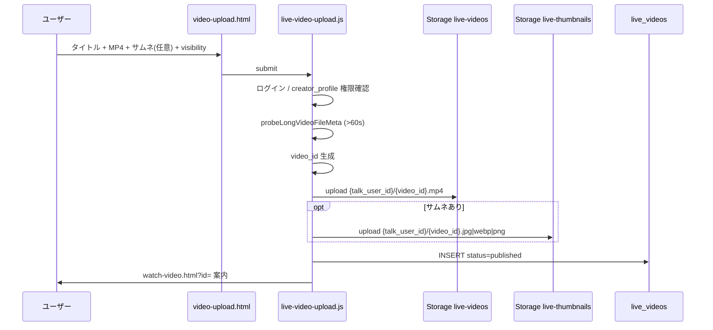

# TASFUL LIVE → YouTube型 P1 — Phase 3 投稿 UI/JS 実装結果

| 項目 | 内容 |
|------|------|
| 版 | v1.0 |
| 実施日 | 2026-06-23 |
| 環境 | staging `ddojquacsyqesrjhcvmn` · dev server `:8788` |
| 前提 | Phase 1 migration GO · Phase 2 Edge GO |

---

## 最終判定

| 判定 | **GO** |
|------|--------|
| 意味 | 長尺動画の **投稿 → Storage 保存 → `live_videos` INSERT** が `u_store` で通過。権限ゲート・duration 制約・既存ショート回帰も PASS。**Phase 4 一覧/再生 UI に進行可能。** |

---

## 作成 / 変更ファイル

| ファイル | 種別 | 内容 |
|----------|------|------|
| [`live/live-config.js`](../live/live-config.js) | 変更 | 長尺動画定数・ヘルパー追加（ショート設定は不変） |
| [`live/video-upload.html`](../live/video-upload.html) | 新規 | 長尺投稿ページ |
| [`live/live-video-upload.js`](../live/live-video-upload.js) | 新規 | 投稿ロジック |
| [`deploy/cloudflare/dist/live/`](../deploy/cloudflare/dist/live/) | 同期 | 上記 3 ファイル |
| [`scripts/verify-live-youtube-p3-upload.mjs`](../scripts/verify-live-youtube-p3-upload.mjs) | 新規 | smoke 検証 |
| `package.json` | 変更 | `verify:live-youtube-p3` 追加 |

**変更なし:** `live-short-upload.js` · `short-upload.html` · Edge Functions · migration

---

## 投稿フロー



---

## live-config.js 追加内容

| 定数 / 関数 | 値 / 役割 |
|-------------|-----------|
| `TABLES.videos` | `live_videos` |
| `VIDEO_BUCKET` | `live-videos` |
| `STORAGE_BUCKET_VIDEO_THUMBS` | `live-thumbnails` |
| `VIDEO_MAX_SIZE_BYTES` | 2147483648 (2GB) |
| `VIDEO_ALLOWED_MIME_TYPES` | `['video/mp4']` |
| `VIDEO_MIN_DURATION_SEC` | 61 |
| `VIDEO_SIGNED_URL_FUNCTION` | `live-video-signed-url` |
| `VIDEO_VIEW_FUNCTION` | `live-video-view` |
| `buildVideoStoragePath` | `{talk_user_id}/{video_id}.mp4` |
| `buildVideoThumbStoragePath` | `{talk_user_id}/{video_id}.{ext}` |
| `probeLongVideoFileMeta` | ブラウザ metadata（上限キャップなし） |
| `fetchCreatorProfile` | `live_creator_profiles` 取得 |
| `watchVideoUrl` | `watch-video.html?id=` |
| `fetchVideoSignedUrlViaEdge` | Phase 4 再生用（先行追加） |

**既存ショート定数**（`LIVE_SHORT_MAX_DURATION_SEC` 等）は **変更なし**。

---

## バリデーション内容

| 項目 | ルール | 実装箇所 |
|------|--------|----------|
| ログイン | `talk_user_id` 必須 | `getTalkUserId()` |
| クリエイター資格 | `active` + (`identity_verified` \| `ops_approved`) | `hasBroadcastPermission()` |
| タイトル | 1〜120 文字 | JS + DB CHECK |
| 動画形式 | MP4 のみ | `accept` + JS |
| ファイルサイズ | ≤ 2GB | JS |
| 動画長 | **> 60 秒**（61秒以上） | `probeLongVideoFileMeta` |
| metadata 取得不可 | 投稿不可 | reject |
| サムネイル | 任意 · JPG/PNG/WebP | JS |
| visibility | `public` / `unlisted` / `private` | ラジオ |
| status | 常に `published` | INSERT 固定 |

---

## Storage path

| 種別 | bucket | path |
|------|--------|------|
| 動画 | `live-videos` (private) | `{talk_user_id}/{video_id}.mp4` |
| サムネイル | `live-thumbnails` (public) | `{talk_user_id}/{video_id}.jpg` / `.png` / `.webp` |

失敗時: アップロード済み Storage オブジェクトを `remove()` で削除試行。

---

## DB insert 内容

```javascript
{
  id: videoId,                    // 事前生成 UUID
  talk_user_id: talkUserId,       // text
  creator_profile_id: profile.user_id,
  title,
  description,
  video_path,
  thumbnail_path,                // nullable
  duration_sec,                  // > 60
  file_size_bytes,
  mime_type: "video/mp4",
  status: "published",
  visibility,                    // public | unlisted | private
  published_at: now()
}
```

**service_role は使用しない**（ユーザ JWT + RLS）。

---

## 検証結果

`npm run verify:live-youtube-p3` — **PASS 34 / FAIL 0**

| # | 項目 | 結果 |
|---|------|------|
| 1 | 未ログイン → 投稿不可 | ✅ UI `.live-error` |
| 2 | `u_me` → profile なしで投稿不可 | ✅ REST 403 · Storage 403 |
| 3 | `u_store` → 投稿可 | ✅ Storage + INSERT 201 |
| 4 | 60秒以下 → 投稿不可 | ✅ DB CHECK 400 · JS 静的検証 |
| 5 | mp4 以外 | ✅ JS `isMp4File` |
| 6 | title 空 | ✅ DB CHECK 400 |
| 7 | 投稿成功 → Storage + DB | ✅ |
| 8 | `short-upload.html` 無破壊 | ✅ UI + 静的コード |
| 9 | `verify:live-youtube-p2` | ✅ PASS |
| 10 | `verify:live-p4 --skip-deploy` | ✅ PASS |

追加: `verify:live-p3`（ショート）回帰 ✅

---

## 回帰確認

| 対象 | 結果 |
|------|------|
| `live-short-upload.js` | ✅ 変更なし |
| `verify:live-p3` | ✅ PASS |
| `verify:live-p4` | ✅ PASS |
| `verify:live-youtube-p2` | ✅ PASS |
| dist 同期 | ✅ 3 ファイル |

---

## 未解決事項

| # | 項目 | Phase 4 影響 |
|---|------|-------------|
| 1 | **`watch-video.html` 未実装** | 成功時リンク先は Phase 4 で作成 |
| 2 | **下書き (`draft`) 非対応** | P3 は常に `published` 投稿 |
| 3 | **動画一覧 UI なし** | Phase 4 `videos.html` / `live-videos.js` |
| 4 | **サムネ必須化なし** | 任意のまま |
| 5 | **`index.html` 導線未追加** | UI 作り込みは Phase 4/5 で可 |

---

## Phase 4 に進めるか

| 判定 | **GO** |
|------|--------|
| 次ステップ | 1. `live-videos.js` + `videos.html`（一覧） 2. `watch-video.html` + `live-watch-video.js`（再生 · signed-url Edge 呼び出し） 3. `live-profile.js` 拡張（チャンネルグリッド） |

**データ層・Edge・投稿経路は揃っている。** Phase 4 は読取・再生 UI が主作業。

---

*Phase 3 投稿 UI/JS 完了 — 一覧/再生は Phase 4。*
