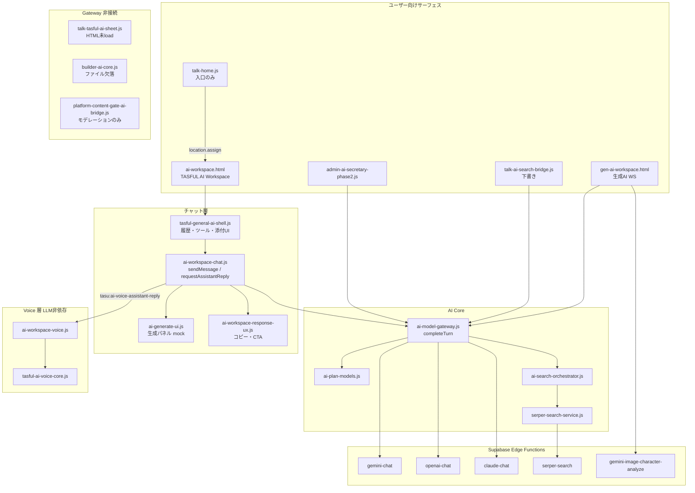

# TASFUL AI / AI Workspace / AI Core — 現状棚卸し

調査日: 2026-06-26  
**コード変更なし**（読取・grep・既存テスト参照のみ）

---

## エグゼクティブサマリー

| 領域 | 総合判定 | 一言 |
| --- | --- | --- |
| **TASFUL AI Workspace** (`ai-workspace.html`) | **部分完成** | テキスト相談・検索・モデル切替・コピー・Voice 準備は動く。添付/画像/ストリーミング/メッセージ再生成は未接続 |
| **生成AIワークスペース** (`gen-ai-workspace.html`) | **別製品として部分完成** | 画像解析・キャラ会話・3D（Tripo）は実装。`ai-workspace` とは別 HTML |
| **AI Core / Gateway** (`ai-model-gateway.js`) | **接続済み（Edge 依存）** | Gemini / OpenAI / Claude + Serper は Edge 経由で実装。Grok / Deep Research / ストリーミングは未実装 |
| **Voice Core** (`tasful-ai-voice-core.js`) | **接続準備完了** | ブラウザ STT/TTS のみ。外部 TTS 未接続 |
| **Platform → AI Core** | **LLM 非接続** | `platform-content-gate-ai-bridge.js` はモデレーション信号のみ |
| **TASFUL Talk → AI Core** | **部分接続** | QA/相談は `ai-workspace` へリダイレクト。下書きは `completeTurn`。シート UI は未接続 |
| **Builder AI** | **Gateway 非接続** | `builder-ai-core.js` が HTML から参照されるが **リポジトリに存在しない** |

**次にやるべき最小単位（優先順）**

1. **添付ファイル送信** — `tasful-general-ai-shell.js` のプレビュー → `ai-workspace-chat.js` `sendMessage` / Gateway へファイル渡し（Vision API 設計含む）
2. **画像生成パネル** — `ai-generate-ui.js` の mock ギャラリーを Edge 画像生成 API に接続（現状は `buildImagePanel` がデモ SVG のみ）
3. **メッセージ再生成** — `ai-workspace-response-ux.js` に `[data-ai-message-regen]` を追加し `sendMessage` 再利用
4. **`talk-tasful-ai-sheet.js`** — HTML 未読込。Gateway 接続するか削除/統合を決定
5. **`builder-ai-core.js` 欠落** — 44 builder HTML が参照。復元 or 参照削除
6. **Gateway / Voice の production staging 登録** — `.stage-production-files.txt` に未掲載

---

## 用語と主要ファイル

| 名称 | 実体 | 読み込み HTML（代表） |
| --- | --- | --- |
| TASFUL AI Workspace | `ai-workspace.html` + `ai-workspace-chat.js` | `ai-workspace.html` |
| シェル（履歴・ツール・添付 UI） | `tasful-general-ai-shell.js` | 同上 |
| 生成AIワークスペース | `gen-ai-workspace.html` + `gen-ai-workspace.js` | `gen-ai-workspace.html` |
| AI Core / Gateway | `ai-model-gateway.js` | `ai-workspace.html`, `gen-ai-workspace.html`, `admin-operations-dashboard.html` 等 |
| モデル定義・プラン | `ai-plan-models.js` | Gateway より前に load |
| モデル UI | `ai-model-selector.js` | `[data-ai-model-selector-host]` |
| Web 検索 | `ai-search-orchestrator.js` + `serper-search-service.js` | 同上 |
| Voice Core | `tasful-ai-voice-core.js` | `ai-workspace.html`, `admin-operations-dashboard.html` |
| Workspace Voice 橋 | `ai-workspace-voice.js` | `ai-workspace.html` |

### `ai-workspace.html` スクリプト順（抜粋）

```
ai-plan-models.js → ai-model-gateway.js → ai-search-orchestrator.js → ai-model-selector.js
→ ai-workspace-chat.js → tasful-ai-voice-core.js → ai-workspace-voice.js → tasful-general-ai-shell.js
```

公開 API:

- `window.TasuAiChat` — `init`, `sendMessage`, `requestAssistantReply`, `resetChatSession` 等（`ai-workspace-chat.js` L1628–1641）
- `window.TasuAiModelGateway` — `completeTurn`, `callModel`, `postEdge`（`ai-model-gateway.js` L353 付近）
- `window.TasuAiVoiceCore` — `speechToText`, `playVoice`, `mountToolbar` 等（`tasful-ai-voice-core.js`）

---

## 依存関係図



---

## 1. 実装済み機能

### TASFUL AI Workspace（`ai-workspace.html`）

| 機能 | 状態 | 根拠 |
| --- | --- | --- |
| テキスト送信・Enter 送信 | **完成** | `sendMessage()` L1397–1510、`bind()` L1512+ |
| 会話履歴（モード別） | **完成** | `sessionStorage` キー `tasu_ai_chat_{modeId}`、`getStoredMessages` / `setStoredMessages` L72–107 |
| 新規チャット | **完成** | `resetChatSession()` + `TasuTgaShell` `[data-tga-new-chat]` |
| モデル切替 UI | **完成** | `ai-model-selector.js` `mount()` / `initWorkspaceChat()` |
| LLM 応答（Gateway 経由） | **完成** | `runWebSearchTurn()` → `completeTurn()` L300–311、`requestModelWritingReply()` L370–395 |
| Web 検索付き応答 | **完成** | `TasuAiSearchOrchestrator.prepare()` → Serper Edge |
| TASFUL 内検索 + Web ハイブリッド | **完成** | `requestCrossMatchingReply()` L397+、`mergeInternalAndWeb()` |
| ツール切替（相談/TASFUL/Web/両方/メディア） | **完成** | `tasful-general-ai-shell.js` `applyWorkspaceTool()` |
| コピー | **完成** | `ai-workspace-response-ux.js` `[data-ai-message-copy]` L213, L360+ |
| 生成パネル内コピー・再生成 | **完成（パネル限定）** | `ai-generate-ui.js` `[data-ai-generate-copy]`, `[data-ai-generate-regen]` L787–793 |
| 問い合わせ下書き → TALK | **完成** | `ai-workspace-inquiry.js` + `talk-inquiry-drafts-store.js` |
| Voice Core 接続準備 | **完成** | `ai-workspace-voice.js` + `tasu:ai-voice-assistant-reply`（`ai-workspace-chat.js` L1485–1489） |
| コンシェルジュモード → 生成AI WS 委譲 | **完成** | `redirectToGenAiConcierge()` L65–69 |

### 生成AIワークスペース（`gen-ai-workspace.html` — TASFUL AI とは別画面）

| 機能 | 状態 | 根拠 |
| --- | --- | --- |
| テキストチャット（Gateway） | **完成** | `gen-ai-workspace.js` L1233+ `completeTurn` |
| **画像解析（キャラ外見/seed）** | **完成（Edge 依存）** | `analyzeCharacterImage()` → Edge `gemini-image-character-analyze` L894+, L715 |
| 口元推定（画像→AI） | **完成（Edge 依存）** | `fetchMouthHintFromAi()` L1507+ |
| Tripo 3D 生成 | **完成（別 API）** | `gen-ai-workspace.js` Tripo 関連 L1970+ |
| 会話履歴 | **完成** | `localStorage` `tasu_genai_history_{mode}` |

### AI Core / Gateway

| 機能 | 状態 | 根拠 |
| --- | --- | --- |
| `completeTurn()` オーケストレーション | **完成** | `ai-model-gateway.js` L238–348 |
| Gemini | **Edge 接続済** | `supabase/functions/gemini-chat/index.ts` |
| OpenAI | **Edge 接続済** | `supabase/functions/openai-chat/index.ts` |
| Claude | **Edge 接続済** | `supabase/functions/claude-chat/index.ts` |
| Serper Web 検索 | **Edge 接続済** | `supabase/functions/serper-search/index.ts` |
| プラン・モデル gating（表示/選択） | **完成** | `ai-plan-models.js` `MODELS`, `listModelsForPlan()` |
| Workspace では Gemini/GPT/Claude 全 enabled | **完成** | `isWorkspaceSurface()` L239–241 |
| インタラクションログ | **完成** | `ai-interaction-log.js` ← Gateway `logTurn` |
| モック fallback | **完成** | `mockReply()` L95+、`mockFallback` コールバック |

### TASFUL Talk → AI Core

| 機能 | 状態 | 根拠 |
| --- | --- | --- |
| QA / vendor_search → Workspace リダイレクト | **完成** | `talk-home.js` `openAiWorkspaceConsult()` L990+, `goToAiMode()` L1016+ |
| 下書きモード → Gateway | **完成** | `talk-ai-search-bridge.js` `tasuTalkProvider()` L43–55 |
| QA モード → Consult Bridge | **完成** | 同上 L26–40 `TasuAiConsultBridge.runConsultTurn` |

### Voice Core

| 機能 | 状態 | 根拠 |
| --- | --- | --- |
| ブラウザ STT/TTS | **完成** | `tasful-ai-voice-core.js` |
| Workspace toolbar | **完成** | `ai-workspace-voice.js` `mountWorkspaceVoice()` |
| 読み上げ ON 時のみ返答 TTS | **完成** | `playVoice()` + `speakerEnabled` ガード |

---

## 2. UI だけあるが未接続の機能

| UI | 場所 | 現状 |
| --- | --- | --- |
| **ファイル添付** | `[data-ai-attach-btn]`, `[data-ai-attach-input]`, `[data-ai-attach-preview]`（`ai-workspace.html` L130, L177–188） | `tasful-general-ai-shell.js` L339–354 でファイル名プレビューのみ。**`sendMessage` は files を読まない** |
| **画像生成開始ボタン** | `[data-ai-generate-image-start]`（`ai-generate-ui.js` L796–798） | composer に文言を入れるだけ。画像 API 未呼び出し |
| **ユーザープロフィール** | `.user-profile-area`（`ai-workspace.html` L72–78） | 静的プレースホルダー |
| **モードタブ** | `[data-ai-mode-tabs-host]`（`ai-workspace-chat.js` `renderModeTabs()` L1266–1303） | **HTML にホストなし** — デッドコード |
| **`[data-ai-chat-form]`** | `ai-search-target.js` が参照 | **HTML に存在しない** |
| **`talk-tasful-ai-sheet.js`** | シート UI 実装あり | **どの HTML も `<script>` 未読込**（grep: 0 件） |
| **Grok モデル chip** | `ai-plan-models.js` `grok` `comingSoon: true` | UI に出る場合あり、Gateway は 503 |

---

## 3. スタブ / モックのままの機能

| 機能 | 状態 | 根拠 |
| --- | --- | --- |
| **画像生成パネル（Workspace）** | **モック** | `ai-generate-ui.js` 先頭コメント L1–2、「API接続前プレースホルダー」、`buildImagePanel()` L566–588 デモ SVG |
| **Gateway モック応答** | **fallback** | `mockReply()` / 各 caller の `mockFallback`（API 未接続・エラー時） |
| **Grok** | **常に stub** | `comingSoon: true`, Edge `grok-chat` 未使用 |
| **TALK 下書きモック文** | **fallback** | `talk-ai-search-bridge.js` L47–53 |
| **Builder AI** | **ローカル mock のみ** | `builder/builder-ai-engine.js` `analyze()` L103+。`TasuBuilderAICore` 参照先 **ファイル不存在** |
| **TALK compact sheet 履歴** | **localStorage のみ** | `talk-tasful-ai-sheet.js` — Gateway 未使用 |
| **プラン課金 enforcement** | **表示のみ** | `ai-plan-models.js` コメント「課金接続なし・表示・選択用」 |

---

## 4. API キー / 環境変数が必要な機能

### クライアント（ブラウザ）

| 設定 | ファイル | 用途 |
| --- | --- | --- |
| `TASU_CHAT_SUPABASE_CONFIG.url` / `anonKey` | `chat-supabase-config.js` | 全 Edge Function 呼び出し |
| `tasu_ai_selected_model` | localStorage | モデル選択 |
| `tasu_ai_user_plan` / `?ai_plan=` | localStorage / URL | ベータプラン override |

**プロバイダ API キーはクライアントに無し**（`docs/production-release-checklist.md` L26–27 と一致）

### Supabase Edge Secrets（サーバー）

| Secret | Edge Function | 必要度 |
| --- | --- | --- |
| `GEMINI_API_KEY` | `gemini-chat`, `gemini-image-character-analyze` | Gemini 利用時 **必須** |
| `OPENAI_API_KEY` | `openai-chat` | GPT 選択時 |
| `OPENAI_CHAT_MODEL` | `openai-chat` | 任意（default `gpt-4o-mini`） |
| `ANTHROPIC_API_KEY` | `claude-chat` | Claude 選択時 |
| `ANTHROPIC_CHAT_MODEL` | `claude-chat` | 任意 |
| `SERPER_API_KEY` | `serper-search` | Web 検索 **必須**（未設定時は検索スキップ） |

セットアップ: `scripts/setup-ai-model-secrets.mjs`, `scripts/setup-openai-claude-secrets.mjs`

---

## 5. テスト済み機能

| テストコマンド | カバー範囲 |
| --- | --- |
| `node scripts/test-tasful-ai-workspace-ui.mjs` | Welcome、ツール切替、starter chips、モバイル drawer |
| `node scripts/test-ai-workspace-consult-browser.mjs` | Consult Bridge スモーク |
| `node scripts/test-ai-voice-core-browser.mjs` | Voice Core API、秘書/Workspace toolbar、speaker ON/OFF |
| `node scripts/test-ai-search-orchestrator-browser.mjs` | Intent → Orchestrator → Gateway（Serper **mock**） |
| `node scripts/test-ai-plan-model-selector-browser.mjs` | 上記 orchestrator テストのラッパー |
| `node scripts/test-ai-serper-search-browser.mjs` | Search router + Serper mock |
| `node scripts/test-ai-cross-search-browser.mjs` | クロス検索カード |
| `node scripts/test-ai-search-target-browser.mjs` | 検索ターゲット radio |
| `node scripts/test-ai-search-state-browser.mjs` | 検索状態 restore |
| `node scripts/test-ai-anpi-notification-browser.mjs` | ANPI 緊急検知 on workspace |
| `node scripts/test-ai-concierge-handoff-browser.mjs` | gen-ai-workspace リダイレクト |
| `node scripts/test-talk-ai-draft-apply-browser.mjs` | TALK 下書き適用 |
| `node scripts/test-talk-tasful-ai-sheet-browser.mjs` | シート UI（**HTML 未 load なら限定的**） |
| `node scripts/smoke-cloudflare-pages.mjs` | `/ai-workspace.html` HTTP 200 |
| `node scripts/test-tasful-regression-final.mjs` | TALK hub 等広域回帰 |

### 手動 / キャプチャ系（ライブ API）

| コマンド | 内容 |
| --- | --- |
| `node scripts/capture-ai-workspace-real-api.mjs` | ライブ OpenAI + Claude via Edge |
| `node scripts/capture-chatgpt-real-api.mjs` | ライブ OpenAI |
| `node scripts/test-gemini-natural-chat.mjs` | ライブ Gemini 品質 |
| `node scripts/verify-gemini-deploy.mjs` | Edge deploy smoke |
| `scripts/verify-ai-workspace-generate-ui.mjs` 等 | UI スクリーンショット QA |

---

## 6. 未テスト / テスト薄い機能

| 機能 | 理由 |
| --- | --- |
| **LLM ストリーミング** | 機能自体未実装 |
| **Deep Research** | 機能自体未実装 |
| **Workspace 添付ファイル送信** | UI のみ、送信 path なし |
| **Workspace 画像生成 API** | mock パネルのみ |
| **Workspace 画像入力/解析** | `ai-workspace` 側未実装（gen-ai 側は別テスト: `test-gen-ai-*`） |
| **メッセージ単位の再生成** | UI なし |
| **Grok プロバイダ** | comingSoon |
| **Gateway 単体ユニットテスト** | 専用 test なし（orchestrator 経由のみ） |
| **本番 CI での live GPT/Claude 切替** | capture スクリプトは手動想定 |
| **`talk-tasful-ai-sheet` + Gateway** | 未接続 |
| **サーバー永続チャット履歴** | 未実装のためテストなし |

---

## 7. 本番運用前に必要な残タスク

### P0（TASFUL AI Workspace を「完成」と言うため）

1. **添付ファイル → Gateway/Vision 接線**（現 UI はプレビューのみ）
2. **画像生成 mock → 実 API**（`ai-generate-ui.js` `buildImagePanel` / Edge 新設）
3. **メタ説明と実装の整合** — `ai-workspace.html` L7 description に「画像解析」とあるが Workspace 本体では未接続（gen-ai 側に実装あり）。UX 上の誤解解消
4. **Gateway / Voice / Secretary を production staging リストへ** — `scripts/.stage-production-files.txt` に `ai-model-gateway.js`, `tasful-ai-voice-core.js`, `admin-ai-secretary-phase2.js` 等が **未掲載**（`ai-workspace-chat.js` と `gen-ai-workspace.*` は掲載済）

### P1（品質・運用）

5. **ストリーミング応答** — Edge + `sendMessage` + UI typewriter（未着手）
6. **メッセージ再生成ボタン** — toolbar 拡張
7. **プラン課金と Gateway gating の接続** — 現状 localStorage のみ
8. **Serper / 各 provider key の本番 secrets 確認** — `docs/production-release-checklist.md` 参照
9. **`talk-tasful-ai-sheet.js`** — 読込 HTML 追加 + Gateway 接続、または廃止判断
10. **`builder-ai-core.js` 欠落解消** — builder HTML 44 ファイルが `<script src="builder-ai-core.js">` 参照、glob **0 件**

### P2（将来）

11. **Deep Research モード** — 診断レポート `reports/gemini-edge-diagnose.md` にモデル名列挙のみ、アプリ未実装
12. **Grok provider** — Edge `grok-chat` stub
13. **外部 TTS（OpenAI / ElevenLabs）** — `TasuAiVoiceCore.setTtsAdapter()` は用意済み、adapter 未登録
14. **サーバー側会話履歴** — 現状 sessionStorage / localStorage のみ
15. **TLV AI 接続** — Voice Core コメント上の将来用途、未接続

---

## 8. 触ってはいけない既存 Production Ready 領域

`scripts/.stage-production-files.txt` が **本番ステージング対象の正** とみなす（抜粋）。

| カテゴリ | ファイル（例） | 理由 |
| --- | --- | --- |
| Workspace チャット本体 | `ai-workspace-chat.js`, `ai-workspace-chat.css` | staging 掲載 |
| 生成AI WS | `gen-ai-workspace.html/js/css` | staging 掲載 |
| TASFUL 内検索 | `ai-cross-search.js`, `ai-search.js`, `ai-modes.js` | staging 掲載 |
| TALK 入口 | `talk-home.html/js/css`, `talk-ai-draft.js`, `talk-ai-drafts-store.js` | staging 掲載 |
| ANPI 一式 | `anpi-*.js/html` | staging 掲載 |
| Builder MVP | `builder/mvp-*.html`, `builder/builder.js` 等 | staging 掲載 |
| Platform chat | `chat-detail.*`, `platform-chat-*` 関連 | 回帰テスト多数 |

**staging 未掲載だが本番で既に load されているモジュール（変更は慎重に）**

- `ai-model-gateway.js`, `ai-plan-models.js`, `serper-search-service.js`
- `tasful-ai-voice-core.js`, `admin-ai-secretary-phase*.js`
- `ai-workspace.html` 本体（chat JS は staging 対象だが HTML 行はリスト外 — build は全 repo copy）

**変更禁止（ユーザー指示・Gateway コア）**

- `postUserCommand` / Action Registry コア
- `TasuAiModelGateway.completeTurn()` の既存挙動（search → model → log → fallback の契約）
- AI秘書 Phase2 テキストフロー（Voice はイベント追加のみ済）

---

## 機能別マトリクス（完成 / 接続待ち / 未実装）

| 機能 | Workspace | Gen-AI WS | Gateway | 判定 |
| --- | --- | --- | --- | --- |
| テキストチャット | ○ | ○ | ○ | **完成** |
| 会話履歴（ブラウザ） | ○ | ○ | — | **完成** |
| コピー | ○ | ○ | — | **完成** |
| 再生成（メッセージ） | × | × | — | **未実装** |
| 再生成（生成パネル） | ○ | — | — | **完成** |
| ストリーミング | × | × | × | **未実装** |
| モデル切替 UI | ○ | ○ | ○ | **完成** |
| OpenAI / Gemini / Claude | ○ | ○ | ○ Edge | **接続済**（secrets 依存） |
| Grok | × | × | stub | **未実装** |
| Web 検索 Serper | ○ | ○ | ○ Edge | **接続済**（`SERPER_API_KEY` 依存） |
| Deep Research | × | × | × | **未実装** |
| 添付ファイル | UI のみ | ○ gen-ai | — | **接続待ち**（WS） |
| 画像入力 / 解析 | × | ○ Edge | ○ | **WS 未実装 / Gen-AI 完成** |
| 画像生成 | mock | Tripo/別 | — | **WS mock / Gen-AI 部分完成** |
| Voice Core | ○ 準備 | × | — | **接続準備完了** |
| Platform → Core | × | — | × | **未接続**（moderation のみ） |
| Talk → Core | リダイレクト+下書き | — | ○ | **部分完成** |
| Builder → Core | × | — | × | **未接続** |

---

## 参照した主要関数・イベント

| 名前 | ファイル | 役割 |
| --- | --- | --- |
| `sendMessage(root, opts)` | `ai-workspace-chat.js` | Workspace 送信エントリ |
| `requestAssistantReply({...})` | `ai-workspace-chat.js` | ルーティング（執筆/生成UI/クロスマッチ/FAQ/検索） |
| `completeTurn(params)` | `ai-model-gateway.js` | AI Core 単一ターン |
| `callModel(model, params)` | `ai-model-gateway.js` | プロバイダ別 Edge POST |
| `TasuAiSearchOrchestrator.prepare()` | `ai-search-orchestrator.js` | Web 検索前処理 |
| `openAiWorkspaceConsult()` | `talk-home.js` | Talk → Workspace |
| `tasuTalkProvider()` | `talk-ai-search-bridge.js` | Talk 下書き → Gateway |
| `tasu:ai-voice-assistant-reply` | CustomEvent | TTS トリガ（speaker ON 時） |
| `analyzeCharacterImage()` | `gen-ai-workspace.js` | 画像解析 Edge 呼び出し |
| `onContentGate()` | `platform-content-gate-ai-bridge.js` | モデレーション信号（LLM なし） |

---

## 結論

**TASFUL AI Workspace は「テキスト相談・検索・マルチモデル・コピー・Voice 準備」まで完成。**  
**「添付・Workspace 画像生成・ストリーミング・メッセージ再生成・Deep Research」は未実装または mock。**  
**AI Core（Gateway）は Edge 経由で 3 プロバイダ + Serper が接続済みだが、secrets と fallback モックが共存するベータ状態。**  
**画像解析は `gen-ai-workspace.html` 側に実装があり、`ai-workspace.html` の attach UI とは未統合。**

次の最小作業は **(1) 添付送信の Gateway 接線 → (2) 画像生成 mock の API 化 → (3) メッセージ再生成 UI** の順が妥当。
