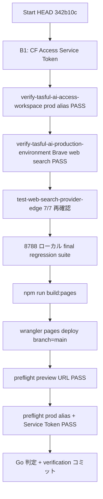

# TASFUL AI — Production Ready 残タスク実行計画

**作成日:** 2026-06-28  
**Git HEAD（開始）:** `342b10c` — `feat(tasful-ai): add brave web search provider`  
**前提:** Brave Search Phase 1 完了（Edge live / Unit / Hybrid / JA spot **PASS**）  
**ステータス:** ✅ **完了** — `reports/tasful-ai-production-ready-verification.md`（Go · deploy `bbe9eb2a`）

---

## 1. 現在の Production Ready 判定

| 項目 | 判定 |
| --- | --- |
| **TASFUL AI Workspace 機能** | ✅ 完成（`5ed9672` Final Phase + quota Phase 2 `e9c3dd0` / deploy `5437d70e`） |
| **Edge 接続（chat / Vision / quota）** | ✅ live PASS（Final Phase 2026-06-28 時点 6/6 Vision + quota 11/11） |
| **Web Search** | ✅ **Brave Phase 1 PASS**（`342b10c` · Edge 7/7 · Hybrid mock PASS） |
| **Stripe / quota enforcement** | ✅ Production Edge simulate PASS |
| **CF Access prod alias E2E** | ❌ **未達** — Service Token 未設定 |
| **formal build → prod alias deploy** | ❌ **未実施** — alias が旧 deployment のまま |
| **Production Ready 総合** | **No-Go** |

**根拠レポート**

| レポート | 内容 |
| --- | --- |
| `reports/brave-search-phase1.md` | Web Search Go · Production Ready 総合は CF Access + deploy 残 |
| `reports/tasful-ai-production-ready-final.md` | Final Phase No-Go（Serper → **Brave で解消済**） |
| `reports/tasful-ai-production-ready-final-verification.md` | 事前確認 FAIL で verification 未実施 |
| `reports/tasful-ai-access-workspace-check.json` | Access gate OK · authenticated MIME **FAIL** |

---

## 2. 残ブロッカー一覧

| # | ブロッカー | 種別 | 現状 | 解消条件 |
| --- | --- | --- | --- | --- |
| **B1** | **CF Access Service Token 未設定** | 運用 / Zero Trust | `.env` に `CF_ACCESS_CLIENT_ID/SECRET` なし · `verify-tasful-ai-access-workspace.mjs` authenticated 行 FAIL | Token 発行 + Policy Include → prod alias E2E **全 PASS** |
| **B2** | **prod alias 未 redeploy** | 運用 / deploy | 最終 formal deploy は quota 系（`5437d70e` 付近）。`342b10c` 以降の formal `build:pages` → `branch=main` deploy **未実施** | `CLOUDFLARE_API_TOKEN` + build + deploy 成功 |
| ~~B3~~ | ~~Serper credits 枯渇~~ | ~~運用~~ | **解消** — Brave Phase 1（`SERPER_API_KEY` rollback 保持） | — |
| ~~B4~~ | ~~build:pages EPERM~~ | ~~環境~~ | **解消** — `scripts/stop-pages-dev.mjs`（`d67631e`） | — |

**Go 条件外（記録のみ）**

| 項目 | 備考 |
| --- | --- |
| gen-ai-workspace `@pixiv/three-vrm` import | TASFUL AI Workspace 本体 Go 条件外（52/53 smoke） |
| `test-tasful-regression-final.mjs` Talk timeout | TALK モジュール · TASFUL AI スコープ外 |
| 動画/音楽 API `enabled: true` | P0-2 backlog · Production Ready 必須条件ではない |

---

## 3. 確認結果詳細

### 3.1 CF Access Service Token + E2E

**正本スクリプト:** `scripts/verify-tasful-ai-access-workspace.mjs`

| チェック | prod alias（`tasufull-article.pages.dev`） | deploy preview（Access なし） |
| --- | --- | --- |
| 未認証 Access gate | ✅ PASS（login HTML = 期待） | N/A |
| Service Token 設定 | ❌ **未設定** | — |
| MIME `ai-workspace.html` / `*.js` / css | ❌ Token なしでは不可 | ✅ 4/4 PASS（Final Phase 記録） |
| Workspace load + composer + 390px | ❌ Token なしでは不可 | ✅ PASS |

**設定手順（人間作業 · コード変更なし）**

1. Cloudflare Zero Trust → **Access** → **Service Auth** → Create Service Token
2. Application **`tasufull-article.pages.dev`** の Policy に **Service Auth Include**
3. ローカル `.env`（**git 禁止** · 値をログに出さない）:
   ```
   CF_ACCESS_CLIENT_ID=...
   CF_ACCESS_CLIENT_SECRET=...
   ```
4. 再検証:
   ```bash
   node --env-file=.env scripts/verify-tasful-ai-access-workspace.mjs
   PAGES_BASE_URL=https://tasufull-article.pages.dev node --env-file=.env scripts/verify-tasful-ai-access-workspace.mjs
   ```
5. 横断 smoke（任意）:
   ```bash
   node --env-file=.env scripts/smoke-gate-d-production.mjs
   ```

**代替:** `reports/gate-d-auth-storage.json` OTP Cookie — Final Phase 時点で **prod alias 認証失効**。Service Token が preflight / readiness と整合。

**関連:** `reports/tasful-ai-p0-2-production-connection-triage.md` §4 · `reports/tasful-ai-production-ready-final.md` §③

---

### 3.2 formal `build:pages` 実行条件

**コマンド:** `npm run build:pages`  
**実装:** `node scripts/stop-pages-dev.mjs && node deploy/cloudflare/stage-cloudflare-pages.mjs`

| 条件 | 状態 |
| --- | --- |
| dev 停止（8788 / workerd ロック） | ✅ `stop-pages-dev.mjs` が build 前置で自動実行 |
| `npm install` 済み | 前提 |
| ソース正本 | リポジトリルート → `deploy/cloudflare/dist/` へ stage |
| Supabase 注入 | deploy 時 `TASFUL_SUPABASE_URL` + `TASFUL_SUPABASE_ANON_KEY`（`deploy-cloudflare-pages.mjs`） |
| Brave Phase 1 との関係 | **Edge のみ変更** — Pages ソース（`ai-workspace.html` 等）は HEAD `342b10c` で **clean**（working tree 変更なし） |

**注意**

- working tree の `deploy/cloudflare/dist/*` 変更は **手動 cp や部分 build の残骸** を含む。**commit せず** formal build で上書きする。
- `file://` / VSCode Preview 禁止 — 検証は `http://127.0.0.1:8788`（`docs/local-dev.md`）

---

### 3.3 prod alias redeploy

**正本手順**

```bash
# 方法 A（推奨 · Supabase 注入込み）
$env:TASFUL_SUPABASE_URL="https://ddojquacsyqesrjhcvmn.supabase.co"
$env:TASFUL_SUPABASE_ANON_KEY="<anon>"
$env:CLOUDFLARE_API_TOKEN="<token>"
node scripts/deploy-cloudflare-pages.mjs

# 方法 B（build 済み dist のみ）
npm run build:pages
npx wrangler pages deploy deploy/cloudflare/dist --project-name tasufull-article --branch main
```

| 項目 | 内容 |
| --- | --- |
| **必須 secret** | `CLOUDFLARE_API_TOKEN`（Pages Edit） |
| **branch** | `main` → Production alias `https://tasufull-article.pages.dev` |
| **preview URL** | `https://{hash}.tasufull-article.pages.dev` — Access なし · MIME 検証用 |
| **ブロッカー** | API Token 未設定 · B1 未解消だと alias 上の自動 E2E 不可 |
| **推奨順** | preview deploy URL で preflight PASS → 続けて alias 確認（Service Token） |

**deploy 後 preflight**

```bash
PAGES_BASE_URL=https://<new-hash>.tasufull-article.pages.dev node scripts/test-tasful-ai-production-preflight.mjs
PAGES_BASE_URL=https://tasufull-article.pages.dev node --env-file=.env scripts/test-tasful-ai-production-preflight.mjs
```

---

## 4. working tree 分類（126 件 · 2026-06-28 時点）

> 440 件 → Brave Phase 1 コミット後 **126 件**（M 49 · ?? 77）。Production Ready 実行時は **選別ステージングのみ**（AD-007）。

### 4.1 Production Ready に **必要**（検証フェーズで使用 · コミットは Go 後）

| カテゴリ | ファイル例 | 扱い |
| --- | --- | --- |
| 検証スクリプト（コミット済） | `scripts/test-web-search-provider-*.mjs` | ✅ `342b10c` 済 |
| 検証スクリプト（既存 HEAD） | `verify-tasful-ai-*.mjs`, `test-tasful-ai-production-preflight.mjs` | 実行のみ · 変更不要（任意: Serper ラベル→Web search） |
| 証跡 JSON | `reports/web-search-provider-edge-last.json` | ✅ `342b10c` 済 |
| 証跡 JSON（未コミット） | `reports/tasful-ai-access-workspace-check.json`, `tasful-ai-production-environment-probes.json` | Go 後 verification コミットに含める |
| 計画 / final レポート | 本ファイル · `tasful-ai-production-ready-final*.md` | Go 後 docs 同期コミット |

### 4.2 Production Ready に **不要**（触らない / コミットしない）

| カテゴリ | 例 | 理由 |
| --- | --- | --- |
| **Builder AI** | `builder/builder-ai.html`, `reports/builder-ai-v2-*`, `user-dashboard-builder-ai-card/` | スコープ外 · 凍結 |
| **Platform** | `reports/platform-*`, `verify-platform-ui3-*` | スコープ外 |
| **Business Directory** | `reports/business-directory-*`, `docs/README.md` BD 行 | スコープ外 |
| **Materials / backlog** | `docs/free-download-service-backlog.md`, `tasful-ai-ui-operation-assist-backlog.md` | backlog · P0 後 |
| **TLV / Live / ANPI** | `deploy/cloudflare/dist/live/*`, `reports/tlv-*`, `anpi-*` | スコープ外 · 凍結 |
| **AI 秘書 phase ファイル** | `admin-ai-secretary-phase*.js`（dist 含む） | KI-008 · 別スコープ |
| **tmp / デバッグ** | `scripts/tmp-*`, `reports/_gemini-recovery-probe.png` | 一時 · 破棄 or 別 PR |
| **dist 残骸（126 件の大半）** | `deploy/cloudflare/dist/builder/*`, `dist/live/*`, `dist/.cursor/` | formal build で再生成 · **単独 commit 禁止** |
| **Brave 調査のみ** | `reports/brave-search-migration-study.md` | Phase 1 完了 · 任意で別 docs コミット |
| **package.json wrangler date** | KI-007 | AI 無関係 · 単独判断 |

### 4.3 TASFUL AI 関連 dist のみ変更（ソース clean）

| ファイル | 判定 |
| --- | --- |
| `deploy/cloudflare/dist/ai-workspace.html` | dist 残骸 — formal build で上書き · **単独 add 不要** |
| `deploy/cloudflare/dist/member-auth.js` | 同上 · AI 直接関係薄 · build 任せ |
| `deploy/cloudflare/dist/shared/voice-core/*` | 同上 |
| ルート `ai-workspace.html` 等 | **変更なし（clean）** |

**結論:** Production Ready Go には **新規ソース変更は不要**。ops（B1 + B2）+ 検証 + レポート更新が主作業。

---

## 5. 実行順序



| Step | 作業 | 種別 | 完了条件 |
| --- | --- | --- | --- |
| **0** | 本計画確認 · dev 8788 起動確認 | 読取 | HTTP 200 |
| **1** | CF Access Service Token 発行 + `.env` | **運用** | Token 2 変数設定 |
| **2** | `verify-tasful-ai-access-workspace.mjs`（prod alias） | 検証 | **全 PASS · Access HTML なし** |
| **3** | `verify-tasful-ai-production-environment.mjs` | 検証 | text/Vision 6/6 + **Web search PASS**（`serper-search` Edge · provider=brave） |
| **4** | `test-web-search-provider-edge.mjs` | 検証 | 7/7 PASS |
| **5** | 8788 regression（下表） | 検証 | TASFUL AI コア全 PASS |
| **6** | `npm run build:pages` | build | exit 0 |
| **7** | `deploy-cloudflare-pages.mjs` or wrangler deploy | **deploy** | main alias 更新 |
| **8** | preflight（preview → alias） | 検証 | 39/39 相当 PASS |
| **9** | レポート + docs 更新 + Go コミット | docs | 下記コミット分割 |

---

## 6. 変更してよい範囲

| 対象 | 許可 |
| --- | --- |
| `.env`（ローカル / CI secret） | ✅ CF Access Token のみ |
| Cloudflare Zero Trust Policy | ✅ Service Auth Include |
| Supabase Edge secrets | ✅ 既存維持（Brave 設定済 · Serper rollback 保持） |
| `reports/tasful-ai-production-ready-*.md` | ✅ 検証結果反映 |
| `docs/TODO.md`, `KNOWN_ISSUES.md`, `ROADMAP.md`, `PROJECT_STATUS.md` | ✅ Go 判定後同期 |
| `scripts/verify-tasful-ai-production-environment.mjs` | ⚠️ **任意最小** — プローブ表示名 `Serper` → `Web search (Brave)` のみ |
| `deploy/cloudflare/dist/` | ✅ **formal build 出力のみ**（手動編集禁止） |

---

## 7. 変更禁止範囲

| 対象 | 理由 |
| --- | --- |
| `ai-model-gateway.js` 契約 | AD-005 凍結 |
| `342b10c` Brave Phase 1 実装 | 完了 · revert 禁止（rollback は secret 切替のみ） |
| Builder AI / Platform / BD / Materials ソース | ユーザー指示 · 製品凍結 |
| AI 秘書 `admin-ai-secretary-*` | RELEASE FROZEN |
| TLV / Live HTML·JS | FEATURE FROZEN |
| UI / CSS / Workspace 機能追加 | Production Ready = 接続完了のみ |
| `git add -A` | AD-007 |
| 手動 dist cp / `_patch_worker_*` | AD-009 違反 |

---

## 8. 必要なテスト

### 8.1 Edge / live（本番 Supabase）

```bash
node scripts/verify-tasful-ai-production-environment.mjs
node scripts/test-web-search-provider-edge.mjs
node scripts/test-ai-workspace-quota-edge.mjs
node scripts/test-ai-workspace-quota-production-compat.mjs
```

### 8.2 CF Access（prod alias）

```bash
node --env-file=.env scripts/verify-tasful-ai-access-workspace.mjs
PAGES_BASE_URL=https://tasufull-article.pages.dev node --env-file=.env scripts/verify-tasful-ai-access-workspace.mjs
```

### 8.3 ローカル 8788 regression（TASFUL AI コア）

```bash
npm run dev   # 8788 LISTEN 確認
node scripts/test-tasful-ai-final-phase.mjs
node scripts/test-tasful-ai-final-smoke-browser.mjs
node scripts/test-tasful-ai-attach-vision-browser.mjs
node scripts/test-ai-workspace-usage-enforcement-browser.mjs
node scripts/test-tlv-tasful-ai-entry.mjs
node scripts/test-tasful-ai-voice-integration-phase1.mjs
node scripts/test-ai-search-orchestrator-browser.mjs
node scripts/test-ai-serper-search-browser.mjs
```

### 8.4 deploy 後 preflight

```bash
PAGES_BASE_URL=https://<deploy-hash>.tasufull-article.pages.dev node scripts/test-tasful-ai-production-preflight.mjs
PAGES_BASE_URL=https://tasufull-article.pages.dev node --env-file=.env scripts/test-tasful-ai-production-preflight.mjs
```

**完了報告必須項目（qa ルール）:** HTTP Status · Console Error · Viewport 1280/768/390（8788 または deploy URL）

---

## 9. コミット分割案

| # | タイミング | メッセージ案 | 対象 |
| --- | --- | --- | --- |
| — | ✅ 済 | `feat(tasful-ai): add brave web search provider` | Edge + tests + phase1 report（`342b10c`） |
| **1** | Step 1–5 PASS 後 | `docs(tasful-ai): production ready verification prep` | 本計画 · access-workspace JSON · environment probes（任意） |
| **2** | Step 6–8 PASS · **Go 判定後** | `chore(tasful-ai): production ready final verification` | final verification report · `docs/TODO|KNOWN|ROADMAP|PROJECT_STATUS` |
| **3** | deploy 必須時のみ | dist は **deploy スクリプト経由** — 原則 dist 単独コミットなし（Cloudflare 側が正本） |

**禁止:** working tree 126 件の一括 commit · Builder/Platform dist 混入

---

## 10. Go / No-Go 判定基準（更新版）

| チェック | 必須 |
| --- | --- |
| Brave Web Search Edge live | ✅ 済 |
| OpenAI / Claude / Gemini text + Vision live | ✅ 済（再確認 1 回） |
| Quota Edge Production | ✅ 済 |
| CF Access prod alias E2E（Service Token） | ❌ **未達** |
| formal build + main deploy | ❌ **未達** |
| TASFUL AI コア regression 8788 | 再実行 |
| Gateway / UI 変更なし | ✅ |

**Go 宣言条件:** B1 + B2 解消 · 上表全 PASS · `docs/KNOWN_ISSUES.md` KI-003 解消更新

---

## 11. 参照

| ドキュメント | 用途 |
| --- | --- |
| `docs/TODO.md` §P0-2 | 残タスク正本 |
| `docs/KNOWN_ISSUES.md` KI-003 | Production Ready No-Go |
| `docs/ROADMAP.md` TASFUL AI 本番接続行 | ロードマップ |
| `reports/brave-search-phase1.md` | Web Search 完了証跡 |
| `reports/tasful-ai-production-ready-final.md` | Final Phase ベースライン |
| `scripts/verify-tasful-ai-production-environment.mjs` | Edge live プローブ |
| `scripts/verify-tasful-ai-access-workspace.mjs` | CF Access E2E |
| `scripts/test-tasful-ai-production-preflight.mjs` | deploy 後 preflight |

---

## 12. 次に実装すべき最小タスク

**コード変更なし · 運用 1 件**

> **CF Access Service Token を Zero Trust で発行し、`.env` に `CF_ACCESS_CLIENT_ID` / `CF_ACCESS_CLIENT_SECRET` を設定する。**

直後の検証:

```bash
PAGES_BASE_URL=https://tasufull-article.pages.dev node --env-file=.env scripts/verify-tasful-ai-access-workspace.mjs
```

**PASS 後の最小実装タスク:** formal `npm run build:pages` → `node scripts/deploy-cloudflare-pages.mjs`（`CLOUDFLARE_API_TOKEN` 必須）→ preflight → Go コミット。
