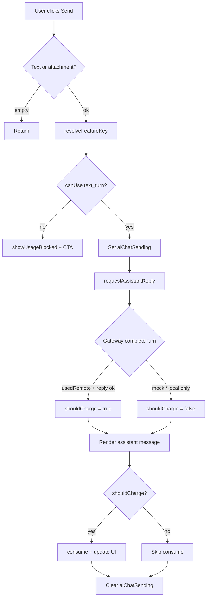

# TASFUL AI Workspace — 課金 / Quota Enforcement 設計

**実施日:** 2026-06-26  
**状態:** 設計確定（**実装前**）  
**参照:** `reports/tasful-ai-p0-2-production-connection-triage.md` · `docs/TODO.md` §P0-2 · `docs/AI/TASFUL_AI.md` · `docs/DECISIONS.md` AD-005  
**正本パターン:** `gen-ai-workspace.js` · `stripe-genai-config.js` · `supabase/functions/_shared/genai-plans.ts`

---

## 目的

TASFUL AI Workspace（`ai-workspace.html`）で **無料回数・サブスク日次上限** を **判定（check）** と **消費（consume）** できるようにする。

- **AD-005:** `TasuAiModelGateway.completeTurn()` 契約は変更しない
- **スコープ:** Workspace 専用 · gen-ai / 秘書 / Builder / Site Assistant は触らない
- **最小構成:** Phase 1 は **クライアント localStorage + 既存 Stripe プラン同期** のみ

---

## 1. gen-ai 正本パターン（調査結果）

### 1.1 責務分割

| 責務 | gen-ai 実装 | モジュール |
| --- | --- | --- |
| プラン定義（無料/有料 limit） | `DEFAULT_GENAI_PLAN` · `getGenAiPlan()` | `gen-ai-workspace.js` L38–44, L4012–4045 |
| プラン同期（Stripe/DB） | `syncGenAiPlanFromServer()` → `stripe-get-genai-plan` | L4503–4523 |
| 日次 usage 保存 | `tasu_genai_usage`（JST date key） | L4552–4575 |
| limit 取得 | `getGenAiUsageLimit(type)` ← plan の `daily*Limit` | L4587–4595 |
| 判定 | `canUseGenAiFeature(type)` | L4608–4610 |
| 消費 | `incrementGenAiUsage(type)` — **送信成功後** | L4612–4618 |
| 送信前ゲート | `sendMessage` 先頭で check → block | L5335–5338 |
| 消費条件 | **`usedGemini` のときのみ increment** | L5369–5371 |
| UI | `updateGenAiUsageUi()` · `showUsageLimitBlocked()` | L4634–4688 |
| user_id | `getGenAiUserId()` ← `TASU_CHAT_SUPABASE_CONFIG.currentUserId` | L4092–4095 |

### 1.2 usage 型（gen-ai）

```javascript
GENAI_USAGE_TYPES = { TEXT_CHAT, VOICE_CHAT, IMAGE_CHARACTER }
```

Workspace Phase 1 では **TEXT 相当 1 バケット** に集約（後述）。

### 1.3 Edge / サーバー

- gen-ai の enforcement は **クライアント localStorage のみ**（bypass 可能）
- Edge `gemini-chat` / `openai-chat` / `claude-chat` に **quota チェックなし**
- プラン正本 DB: `gen_ai_subscriptions`（`apply-genai-plan.ts`）— **gen-ai Stripe 専用**

---

## 2. Workspace 側の現状

| ファイル | 課金関連 | ギャップ |
| --- | --- | --- |
| `ai-workspace-chat.js` | `sendMessage` → `requestAssistantReply` → Gateway | **check/consume なし** |
| `ai-plan-models.js` | `resolveUserPlan()` · Workspace では全モデル **enabled**（beta） | モデル gating 無効 · **turn 上限なし** |
| `ai-workspace-tlv-source.js` | `tasu_ai_tlv_free_remaining` バナー | **decrement なし** |
| `ai-model-gateway.js` | `user_plan` を **interaction log のみ** | quota なし · **変更禁止** |
| `ai-workspace.html` | usage UI **なし** | バナー DOM 未設置 |
| `gen-ai-workspace.js` | 未ロード（別 HTML） | 関数は非共有 |

**Gateway 呼び出し箇所（Workspace）:**

- `requestGatewayWithAttachments` → `completeTurn({ surface: "ai-workspace", attachments })`
- `runWebSearchTurn` → `completeTurn({ forceSearch, surface: "ai-workspace" })`
- `requestAssistantReply` 末尾 → `completeTurn({ surface: "ai-workspace" })`

`completeTurn` 戻り値の `usedRemote` / `fallback_used` は **現状 sendMessage まで未伝播**。

---

## 3. 新規 `ai-workspace-usage.js` の要否

### 判定: **新規ファイルが必要**

| 案 | 評価 |
| --- | --- |
| `gen-ai-workspace.js` を Workspace から読む | ❌ HTML 未包含 · 60k 行超の gen-ai 専用 UI と結合 |
| `ai-plan-models.js` に usage を足す | ❌ 責務混在（モデル選択 vs 消費カウンタ） |
| `ai-workspace-chat.js` に直書き | ❌ 送信ロジックが肥大化 · gen-ai パターン複製が散在 |
| **`ai-workspace-usage.js` 新設** | ✅ gen-ai と同 API 形状 · Gateway 非接触 · テスト容易 |

**公開 API（案）:** `global.TasuAiWorkspaceUsage`

```javascript
// 読み取り
getContext()           // { source, userId, planCode, featureKey }
getLimits()
getRemaining(featureKey)
canUse(featureKey)
shouldChargeTurn(turnMeta)

// 書き込み
consume(featureKey)
syncPlanFromServer()   // stripe-get-genai-plan（任意 · 初回/フォーカス時）

// UI
mountUsageBanner(hostEl)
updateUsageUi()
showUsageBlocked(featureKey)
```

---

## 4. Phase 1 / Phase 2 境界

### Phase 1 — クライアント enforcement（今回設計の実装範囲）

| 項目 | 内容 |
| --- | --- |
| 保存 | `localStorage`（JST 日次リセット） |
| プラン | **既存 `tasu_genai_plan` を正本**（Stripe 同期 API 再利用） |
| usage キー | **`tasu_ai_workspace_usage`**（Workspace 専用カウンタ · gen-ai と独立） |
| 上限値 | `stripe-genai-config.js` / `genai-plans.ts` と同じ `dailyTextLimit` |
| ゲート | `ai-workspace-chat.js` `sendMessage` 送信前 |
| 消費 | Gateway **リモート成功後** のみ |
| TLV | `source=tlv` 時 · TLV 無料枠と日次上限の **両方** を check · consume |
| UI | 残数バナー · 枯渇時送信ブロック · プラン CTA |
| Gateway / Edge | **変更なし** |

**Phase 1 でやらないこと:**

- Edge 402/429 quota 応答
- DB `ai_usage_daily` テーブル
- JWT 必須化 · サーバー正本
- gen-ai-workspace との usage プール統合（別キー · 別カウンタ）
- 動画/音楽/資料カテゴリの quota（`ai-media-gen-config` 別フェーズ）
- Stripe 新プラン SKU 追加

### Phase 2 — サーバー enforcement（P0-2 完了後 · 別フェーズ）

| 項目 | 内容 |
| --- | --- |
| DB | `ai_workspace_usage_daily`（`user_id`, `date_jst`, `text_used`, `vision_used`） |
| Edge middleware | `gemini-chat` / `openai-chat` / `claude-chat` 入口で JWT `user_id` 検証 + increment |
| 正本 | **DB が正本** · localStorage は表示キャッシュ |
| 402 応答 | `{ error: "quota_exceeded", feature: "text_turn" }` |
| Serper | `serper-search` は AI turn とは **別枠**（Phase 2 では任意） |
| Stripe | 既存 `gen_ai_subscriptions` 参照で limit 解決 |

**Phase 1 → 2 移行:** `TasuAiWorkspaceUsage` の内部実装を差し替え。`ai-workspace-chat.js` の呼び出し点は **固定**。

---

## 5. 識別子設計

### 5.1 `user_id`

| Phase | 扱い |
| --- | --- |
| Phase 1 | `TASU_CHAT_SUPABASE_CONFIG.currentUserId`（gen-ai と同 `getGenAiUserId` パターン）。**未ログイン時は `"anonymous"`** — 端末ローカル quota のみ |
| Phase 2 | Supabase Auth JWT **`sub` 必須** — anonymous は free tier のみ Edge 側でも同上限 |

### 5.2 `user_plan`

| 用途 | ソース |
| --- | --- |
| **日次 limit** | `tasu_genai_plan.plan` → `free` / `basic_300` / `pro_980` → `dailyTextLimit` |
| **モデル選択 UI** | 現状 `ai-plan-models.js` `resolveUserPlan()` — Phase 1 **変更しない**（beta 全モデル enabled 維持） |
| Gateway log | 既存 `user_plan` フィールド — **そのまま** |

**注意:** `ai-plan-models` の tier（`free`/`light`/`standard`）と gen-ai plan code は `GENAI_PLAN_TO_TIER` で橋渡し済み。limit 取得は **gen-ai plan payload 優先**。

### 5.3 `workspace_id`

**導入しない。** 代わりに:

| フィールド | 値 |
| --- | --- |
| `surface` | 固定 `"ai-workspace"`（Gateway 既存） |
| `source` | URL `source=` — `tlv` · `platform` · `talk` · 空 |

quota ポリシー Phase 1 では **source による limit 差分なし**（TLV 無料枠 UI のみ追加 check）。

### 5.4 `feature_key`（Phase 1）

| key | 意味 | limit ソース |
| --- | --- | --- |
| **`text_turn`** | 1 回の composer 送信で Gateway リモート応答が成功した場合 | `dailyTextLimit` |

Phase 2 で分割候補: `vision_turn`（画像添付）· `web_search_turn`（Serper 成功時）— Phase 1 では **text_turn に含める**（最小）。

---

## 6. `ai-workspace-chat.js` フック設計

### 6.1 送信前（check）

**位置:** `sendMessage` · テキスト/添付バリデーション後 · `dataset.aiChatSending = "1"` **直前**

```text
sendMessage(root, opts)
  ├─ collect attachments / validate text
  ├─ [NEW] featureKey = TasuAiWorkspaceUsage.resolveFeatureKey({ attachments, modeId })
  ├─ [NEW] if (!TasuAiWorkspaceUsage.canUse(featureKey)) {
  │       showUsageBlocked(); return;   // aiChatSending を立てない
  │     }
  ├─ aiChatSending = "1"
  ├─ push user message / render
  └─ requestAssistantReply(...)
```

**`canUse` 内部（Phase 1）:**

1. `resetDailyIfNeeded()` — JST date
2. `remaining = dailyTextLimit - workspaceUsage.textTurnUsed`
3. `source=tlv` の場合: `remaining = min(remaining, tasu_ai_tlv_free_remaining)`
4. `remaining > 0`

### 6.2 送信後（consume）

**位置:** `requestAssistantReply` 成功 · assistant message 保存 **直後** · `finally` **前**

**`requestAssistantReply` 拡張（Gateway 契約は不変）:**

- 内部で `completeTurn` 結果から `turnMeta` を組み立て
- 戻り値に **`_usageCharge: boolean`** を付与（既存 `plain`/`html` 形状は維持 · オプショナルフィールド）

```javascript
// 戻り例
{ plain, html, model_id, ..., _usageCharge: true, _usageFeature: "text_turn" }
```

**`shouldChargeTurn(turnMeta)` 条件（すべて満たす）:**

| # | 条件 |
| --- | --- |
| 1 | `usedRemote === true` |
| 2 | `fallback_used !== true` **または** リモート reply が非空 |
| 3 | 応答が quota ブロック用ダミー **ではない** |
| 4 | `apiError` 空 · HTTP 429/402 以外 |

**consume:**

```javascript
if (reply._usageCharge) {
  TasuAiWorkspaceUsage.consume(reply._usageFeature || "text_turn");
  TasuAiWorkspaceTlvSource?.decrementFreeRemaining?.(); // source=tlv のみ
}
```

**消費しない例:**

- `mockGenerateReply` のみ（`usedRemote: false`）
- FAQ / internal search のみで Gateway 未呼び出し
- Gateway エラー → catch 節の固定エラーメッセージ
- Serper 失敗で Web 専用エラー文のみ（AI 未呼び出しパス）

**gen-ai との差:** gen-ai は `usedGemini` のみ課金。Workspace は **全プロバイダで `usedRemote`**（OpenAI/Claude/Gemini 同等）。

### 6.3 フロー図 — quota 判定



### 6.4 フロー図 — consume

```text
consume("text_turn"):
  1. read tasu_ai_workspace_usage[date_jst].textTurnUsed
  2. textTurnUsed += 1
  3. write localStorage
  4. if source=tlv: tasu_ai_tlv_free_remaining -= 1
  5. updateUsageUi() + TLV banner refresh
```

---

## 7. UI 挙動

### 7.1 通常（残数あり）

| 要素 | 挙動 |
| --- | --- |
| バナー | `#bottom-container` 上部 · `data-ai-workspace-usage` — 「本日 残り **N** 回（プラン名）」 |
| 送信ボタン | 有効 |
| TLV バナー | 既存 `data-tlv-free-quota` と **併記**（TLV 時） |
| モデルバー | 変更なし（beta 全モデル） |

### 7.2 無料回数 / 日次上限 超過

| 要素 | 挙動 |
| --- | --- |
| 送信 | **ブロック**（user message 追加前に return） |
| バナー | エラー色 · 「本日の利用回数を使い切りました」 |
| CTA | **プラン primary:** `gen-ai-workspace.html`（既存 Stripe 導線） |
| CTA secondary | `stripe-get-genai-plan` 同期ボタン（任意） |
| composer | 入力は可能 · **送信のみ不可** |
| mock 応答 | **提供しない**（gen-ai と同じ · 枯渇時は完全停止） |

### 7.3 サブスク有効時

| 条件 | 挙動 |
| --- | --- |
| `tasu_genai_plan.plan` = `basic_300` / `pro_980` | `dailyTextLimit` = 30 / 100 |
| `subscriptionStatus` active / trialing | limit 適用 |
| cancel scheduled · period 内 | 既存 gen-ai 同様 **limit 継続**（`currentPeriodEnd` 参照） |
| 未同期 | `DEFAULT FREE` limit（5/日）— `syncPlanFromServer()` 失敗時 |

### 7.4 エラー時（AI 送信を止める条件）

| 状況 | 送信ブロック | consume |
| --- | --- | --- |
| quota 枯渇（事前 check） | ✅ 止める | — |
| Gateway 429 / billing | ❌ 送信は通す | ❌ 課金しない |
| Gateway 502 / network | ❌ 送信は通す | ❌ 課金しない |
| Serper credits 枯渇（Web モード） | ❌ 送信は通す | AI 応答成功時のみ consume |
| 添付エラーのみ | ❌ 送信可 | 成功時ルールに従う |

---

## 8. localStorage スキーマ（Phase 1）

### `tasu_ai_workspace_usage`

```json
{
  "date": "2026/06/26",
  "textTurnUsed": 3
}
```

- date: JST `getTokyoDateKey()` — gen-ai と同関数をコピー
- 日付不一致時リセット

### 読み取り専用（既存 · 変更しない）

| キー | 用途 |
| --- | --- |
| `tasu_genai_plan` | Stripe 同期済みプラン |
| `tasu_ai_tlv_free_remaining` | TLV 無料枠（初期 10） |
| `tasu_ai_user_plan` | beta override（limit には不使用） |

---

## 9. 変更予定ファイル一覧

### Phase 1 実装時

| ファイル | 変更内容 |
| --- | --- |
| **`ai-workspace-usage.js`** | **新規** — check/consume/UI/sync |
| `ai-workspace-chat.js` | `sendMessage` 前後フック · `requestAssistantReply` に `_usageCharge` 付与 |
| `ai-workspace.html` | script タグ追加 · usage バナー DOM（`data-ai-workspace-usage`） |
| `ai-workspace.css` または `ai-workspace-chat.css` | バナー样式（gen-ai `gen-ai-usage-limit` 踏襲） |
| `ai-workspace-tlv-source.js` | `decrementFreeRemaining()` · バナー refresh  export |

### Phase 2 実装時（参考 · 今回触らない）

| ファイル | 変更内容 |
| --- | --- |
| `supabase/functions/_shared/ai-workspace-quota.ts` | **新規** shared |
| `supabase/functions/gemini-chat/index.ts` 等 | quota middleware |
| SQL migration | `ai_workspace_usage_daily` |
| `ai-workspace-usage.js` | fetch 正本 · localStorage キャッシュ化 |

---

## 10. 新規作成予定ファイル

| ファイル | Phase |
| --- | --- |
| `ai-workspace-usage.js` | 1 |
| `scripts/test-ai-workspace-usage-enforcement-browser.mjs` | 1 |
| `supabase/functions/_shared/ai-workspace-quota.ts` | 2 |
| SQL `sql/ai-workspace-usage-daily.sql` | 2 |

---

## 11. 触らないファイル一覧

| ファイル / 領域 | 理由 |
| --- | --- |
| `ai-model-gateway.js` | AD-005 Gateway 契約凍結 |
| `supabase/functions/gemini-chat` 等（Phase 1） | Edge quota は Phase 2 |
| `gen-ai-workspace.js` | 別製品 HTML · 共通化は Phase 2 以降 |
| `admin-ai-secretary-*` | DeepSeek 別フェーズ |
| `builder/builder-ai-*` | AD-002 |
| Site Assistant 関連 | 別 Backlog |
| `deploy/cloudflare/dist/**` | build:pages 同期のみ |
| `ai-plan-models.js` | Phase 1 ではモデル beta 維持（turn のみ制限） |

---

## 12. テスト計画

### Phase 1

| スクリプト | 内容 |
| --- | --- |
| **`test-ai-workspace-usage-enforcement-browser.mjs`**（新規） | localStorage seed · 残 0 で送信ブロック · CTA 表示 · mock Gateway `usedRemote:true` で consume |
| `test-tasful-ai-final-smoke-browser.mjs` | 回帰 — quota 未設定時は従来 PASS（デフォルト limit 内） |
| `test-tlv-tasful-ai-entry.mjs` | TLV バナー decrement 連動 |
| 手動 | free 5 回送信 → 6 回目 block · basic 同期後 30 回 |

**テスト用 hook（実装時）:**

```javascript
// ai-workspace-usage.js — テストのみ
if (global.__TASU_WORKSPACE_USAGE_TEST__) { ... }
```

### Phase 2

| スクリプト | 内容 |
| --- | --- |
| `verify-ai-workspace-quota-edge.mjs` | JWT 付き Edge · 402 応答 |
| E2E | 2 ブラウザ同一 user_id で共有カウント |

---

## 13. Go / No-Go 判定

### 設計 Go（本レポート）

| 項目 | 判定 |
| --- | --- |
| AD-005 順守（Gateway 非変更） | ✅ |
| gen-ai パターン踏襲 | ✅ |
| Workspace 最小スコープ | ✅ |
| Phase 1/2 境界明確 | ✅ |
| 既存 Stripe プラン再利用 | ✅ |

### 実装 Go 条件（Phase 1 着手前）

| # | 条件 | 現状 |
| --- | --- | --- |
| 1 | P0-2 triage 完了 | ✅ |
| 2 | 本設計レビュー承認 | ⏳ ユーザー確認待ち |
| 3 | Serper / Access | Phase 1 **非依存**（並行可） |
| 4 | `ai-workspace.html` DOM 差分 OK | ⏳ |

### 実装 No-Go（Phase 1 のみで Production 課金完了としない）

| 理由 |
| --- |
| localStorage のみ — **DevTools bypass 可能** |
| anonymous user — 端末単位 limit |
| Edge 未検証 — API 直叩き bypass |

**Production 課金 Ready:** Phase 1 + Phase 2 + Stripe 本番 E2E 完了後。

---

## 14. 最小差分実装チェックリスト（Phase 1 · 参考）

実装フェーズ用 · **今回未実施**

- [ ] `ai-workspace-usage.js` 作成 · `TasuAiWorkspaceUsage` export
- [ ] `ai-workspace.html` script + バナー DOM
- [ ] `sendMessage` pre-check / post-consume
- [ ] `requestAssistantReply` 各 Gateway 戻りに `_usageCharge` 付与
- [ ] `ai-workspace-tlv-source.js` decrement + refresh
- [ ] CSS バナー
- [ ] `test-ai-workspace-usage-enforcement-browser.mjs`
- [ ] `docs/TODO.md` §P0-2 に Phase 1 完了条件追記（実装 PR 時）

---

## 15. 関連参照

| ドキュメント | 内容 |
| --- | --- |
| `reports/tasful-ai-p0-2-production-connection-triage.md` | P0-2 残タスク triage |
| `reports/tasful-ai-production-readiness.md` | §C 課金 enforcement 現状 |
| `docs/DECISIONS.md` AD-005 | Gateway 凍結 |
| `stripe-genai-config.js` | FREE / 有料 limit 定数 |
| `supabase/functions/_shared/genai-plans.ts` | Edge 側 limit 正本 |
