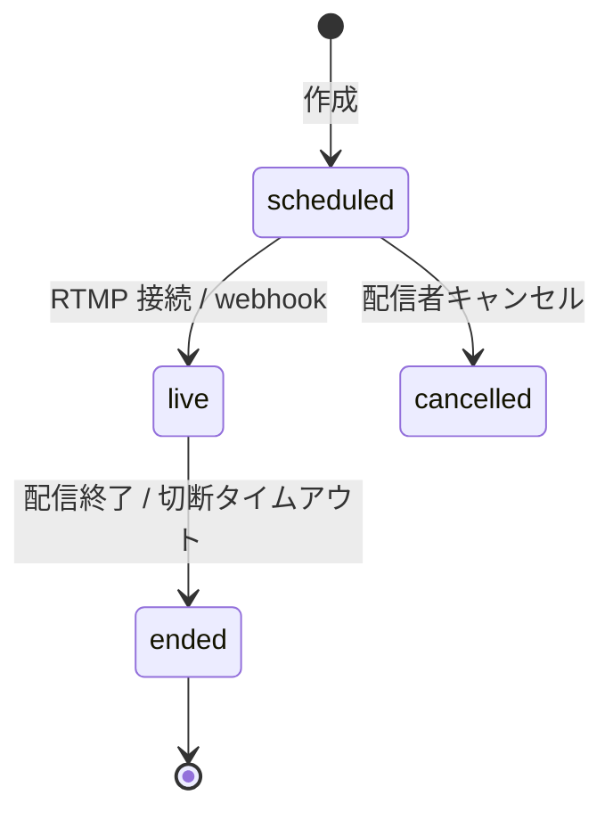
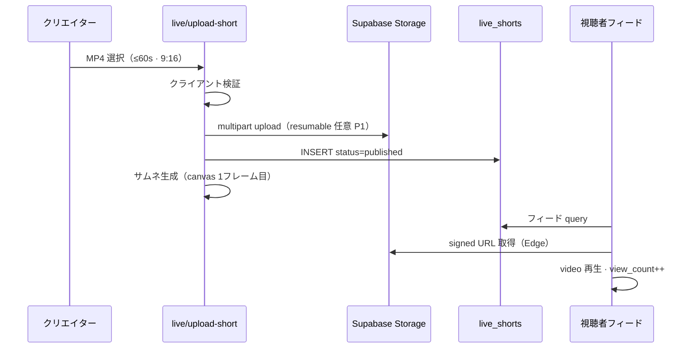

# TASFUL LIVE / Short & Live — P0 設計

| 項目 | 内容 |
|------|------|
| 版 | v1.1 |
| 作成日 | **2026-06-23** |
| 更新 | **2026-06-23** — §14.4 D-01〜D-06 決裁反映 |
| 種別 | **設計のみ**（実装・migration・Edge 作成は行わない） |
| 前提 | **TALK_CHAT_UNIFY_P1_PRODUCTION_RELEASED** 済み |
| 決済 | Stripe 本番化は **2026年9月以降** — P0 は **スキーマ・UI・通知のみ**（実決済なし） |

**関連資料:**

- [`talk-chat-unify-p1-release-result.md`](talk-chat-unify-p1-release-result.md) — TALK 統合完了
- [`talk-chat-unify-p0-p1-plan.md`](talk-chat-unify-p0-p1-plan.md) — `transaction_rooms` / `ensure-talk-room` パターン
- [`talk-webrtc-call-phase1-implementation.md`](talk-webrtc-call-phase1-implementation.md) — WebRTC 1:1（**LIVE とは別 Epic**）
- [`stripe-live-production-plan.md`](stripe-live-production-plan.md) — 投げ銭本番化の参照先
- [`match-ai-moderation-mvp-design.md`](match-ai-moderation-mvp-design.md) — AI 監視パイプライン参照
- [`ai-workspace-inquiry-to-talk.md`](ai-workspace-inquiry-to-talk.md) — AI → TALK 下書き連携パターン
- [`docs/platform-notify-unified.md`](../docs/platform-notify-unified.md) — 通知 CTA 統一

---

## 0. エグゼクティブサマリー

TASFUL LIVE は **ショート動画 + ライブ配信** を軸に、建設・スキル・地域ビジネス系クリエイターが **作品を見せ、フォローを集め、投げ銭で応援される** 最小プロダクトである。

**設計原則:**

| 原則 | 内容 |
|------|------|
| 実証済みのみ | 縦型フィード・ライブ HLS・フォロー・投げ銭・プロフィール DM — TikTok / YouTube Live / Twitch の **コアのみ** |
| 装飾排除 | PK・コラボ・ランキング・レベル・称号・ガチャ・アバター・事務所は **P0 対象外** |
| 安い・シンプル | 自前 SFU / LiveKit / Agora は **P0 対象外** · ライブは **RTMP → HLS（Cloudflare Stream Live 設計前提）** · ショートはトランスコードなし |
| 既存を壊さない | TALK / MATCH / Marketplace / Builder の DB・導線・RLS は **読取参照のみ**、変更は bridge 列・通知 type 追加に限定 |
| 配信資格 | P0 は **本人確認済み** または **運営許可済み** のみ投稿・配信可（§14.4 D-02） |

**TALK との関係:** TALK は TASFUL 全体の会話基盤。P0 の統合は **通知・プロフィール導線・相談導線のみ**（`talk-home` へ深く統合しない）。DM・問い合わせは `service_type=live` の `transaction_rooms` 経由。LIVE 専用チャットルームは作らない。

---

## 1. 画面一覧

### 1.1 ユーザー向け（視聴・操作）

| # | 画面（案） | URL 案 | モバイル優先 |
|---|------------|--------|--------------|
| L-01 | **LIVE ホーム** | `live/index.html` | ✅ |
| L-02 | **ショートフィード** | `live/shorts.html` または L-01 内タブ | ✅ |
| L-03 | **ショート視聴** | `live/short.html?id=` | ✅ |
| L-04 | **ライブ視聴** | `live/watch.html?id=` | ✅ |
| L-05 | **クリエイタープロフィール** | `live/creator.html?userId=` | ✅ |
| L-06 | **フォロー中** | `live/following.html` | ✅ |
| L-07 | **検索** | `live/search.html?q=` | △（P0 はクリエイター名・タグのみ） |

### 1.2 クリエイター向け（投稿・配信）

| # | 画面（案） | URL 案 | 備考 |
|---|------------|--------|------|
| L-10 | **ショート投稿** | `live/upload-short.html` | 動画選択 → タイトル → 公開 |
| L-11 | **ライブ配信準備** | `live/go-live.html` | タイトル・サムネ・公開範囲 |
| L-12 | **ライブ配信中** | `live/broadcast.html?id=` | 配信者 UI（チャット・投げ銭受信） |
| L-13 | **クリエイター設定** | `live/settings.html` | プロフィール編集・通知設定 |
| L-14 | **投稿一覧（自分）** | `live/studio.html` | ショート / 過去ライブアーカイブ |

### 1.3 既存画面への接続（新規 HTML なし・導線のみ）

| # | 既存画面 | 追加導線 |
|---|----------|----------|
| X-01 | `dashboard.html` | 「LIVE を見る」「ショートを投稿」タイル |
| X-02 | `talk-home.html` | LIVE 通知の表示 · `type=live` 通知 CTA · プロフィール/相談へのリンクのみ（**タブ追加・深い統合なし** · §14.4 D-03） |
| X-03 | `talk-profile.html` | LIVE クリエイター時「LIVE プロフィールへ」リンク |
| X-04 | `index-top.html` | トップ「LIVE」ナビ（任意 · P0 後半） |

### 1.4 モーダル / オーバーレイ（画面扱い）

| ID | 名称 | 起動元 |
|----|------|--------|
| M-01 | 投げ銭パネル | L-03 / L-04 / L-12 |
| M-02 | フォロー確認 | L-05 |
| M-03 | 通報 | L-03 / L-04 / L-05 |
| M-04 | TALK でシェア | L-03 / L-04 |
| M-05 | AI キャプション提案 | L-10 |

---

## 2. 各画面の役割

### L-01 LIVE ホーム

- **役割:** LIVE エリアの入口。ショート一覧・配信中一覧・おすすめクリエイターを **1画面で発見**。
- **データ:** `live_shorts`（公開・新着）+ `live_broadcasts`（status=live）+ `live_creator_profiles`。
- **操作:** タブ切替（ショート / ライブ / フォロー中）· 各カードタップで L-03 / L-04 へ。
- **非目標:** 複雑なレコメンド · ランキング · 広告枠。

### L-02 ショートフィード

- **役割:** 縦スワイプ全画面フィード（TikTok / Reels 型）。連続視聴。
- **操作:** 上スワイプで次 · いいね · フォロー · 投げ銭 · TALK シェア · プロフィールへ。
- **技術:** HTML5 `<video>` + Intersection Observer（1本ずつ再生 · 他は pause）。

### L-03 ショート視聴

- **役割:** 単体 URL 共有用。OGP・ディープリンクの着地。
- **操作:** L-02 と同一プレイヤー · コメントは **P1**（P0 はいいね + 投げ銭のみ）。

### L-04 ライブ視聴

- **役割:** HLS ライブ視聴 + ライブチャット（**テキストのみ** · 弾幕なし）。
- **操作:** フォロー · 投げ銭（スタブ）· **TALK で相談** · **配信者に問い合わせ**（`service_type=live` でルーム確保 → 下書き · 自動送信なし）。
- **技術:** HLS.js またはネイティブ HLS（iOS）· 同時接続数は CDN 側に委譲。

### L-05 クリエイタープロフィール

- **役割:** 公開プロフィール · ショートグリッド · ライブ予定/アーカイブ · フォロー · **TALK で相談** · **配信者に問い合わせ**。
- **データ:** `live_creator_profiles` + 既存 `profiles` / `members`（表示名・アバターは既存を優先）。
- **非目標:** ランクバッジ · レベル · 称号 · ガチャアイテム展示。

### L-06 フォロー中

- **役割:** フォローしたクリエイターの **新着ショート + 配信中** のみ。
- **データ:** `live_creator_follows` JOIN。

### L-10 ショート投稿

- **役割:** 配信資格を持つクリエイターが **9:16 · 最大 60 秒 · MP4 のみ** アップロードして公開。
- **制約:** クライアント側で長さ・解像度チェック · **トランスコードなし**（§6 · D-05）· **投稿上限**で容量肥大を防止（具体値は Phase 0 migration レビューで確定 · 設計上は日次/総数の二軸を想定）。
- **資格:** `live_permission_status` が `identity_verified` または `ops_approved` のみ（§14.4 D-02）。
- **AI:** 任意でタイトル・説明・ハッシュタグ提案（M-05）。

### L-11 / L-12 ライブ配信

- **L-11:** 配信前チェック（タイトル · サムネ · 配信資格）· **RTMP URL / Stream Key** 表示（OBS / Larix 等）。P0 は **RTMP → HLS のみ**（ブラウザ直接配信 · 自前 SFU は対象外）。
- **L-12:** 配信中。投げ銭フィード（スタブ）· ライブチャット · 配信終了 · **TALK で相談**導線。

### L-13 クリエイター設定

- **役割:** 表示名（既存 profiles へ委譲）· 自己紹介 · リンク · フォロー通知 ON/OFF · 投げ銭受け取り設定（Stripe 接続前は「準備中」表示）。

### L-14 スタジオ

- **役割:** 自分のショート一覧 · 下書き · 非公開 · ライブアーカイブ（VOD リンク · P1）。

### モーダル

| ID | 役割 |
|----|------|
| M-01 投げ銭 | ギフト UI · 金額プリセット · メッセージ任意 · P0 は **`payment_status=stub` で記録 + 通知 + 履歴のみ**（実送金なし · §14.4 D-04） |
| M-02 フォロー | フォロー / フォロー解除 · 通知 ON/OFF（`live_creator_follows.notify_enabled`） |
| M-03 通報 | 既存 `reports` パターン拡張 · `target_type=live_short|live_broadcast` |
| M-04 TALK シェア | `ensure-talk-room` で相手ルーム確保 · メッセージ下書き（URL + 一言）**自動送信なし** |
| M-05 AI キャプション | アップロード後 · 既存 GenAI Edge 経由で文案提案 · ユーザー編集必須 |

---

## 3. DB テーブル案

**命名:** `live_*` プレフィックスで TALK / MATCH / Marketplace と名前空間分離。  
**ID:** 既存と同様 `talk_user_id`（text）をユーザーキーとする。  
**RLS:** `talk_current_user_id()` 前提（[`sql/talk-rls-production.sql`](../sql/talk-rls-production.sql)）。

### 3.1 コア

#### `live_creator_profiles`

クリエイター公開情報（LIVE 専用 · 既存 `profiles` を壊さない）。

| 列 | 型 | 備考 |
|----|-----|------|
| user_id | text PK | FK → `users.id` |
| bio | text | 最大 500 字 |
| banner_url | text | Storage signed URL |
| is_creator_enabled | boolean | LIVE 機能の表示 ON（配信資格とは別） |
| **creator_status** | text | 将来拡張: `general` / `certified` / `exclusive` 等 · **P0 は未使用（NULL 可）** |
| **live_permission_status** | text | P0 ゲート: `pending` / `identity_verified` / `ops_approved` / `suspended` |
| **live_monthly_minutes_limit** | int | 将来の配信時間上限（分/月）· **P0 は NULL = 無制限扱い** |
| **creator_tier** | text | 将来の料金ティア · **P0 は NULL**（§14.4 D-06） |
| **fee_rate** | numeric(5,4) | 将来のプラットフォーム手数料率 · **P0 は NULL** |
| **payout_policy** | jsonb | 将来の出金ポリシー · **P0 は `{}` または NULL** |
| live_notify_default | boolean | フォロワーへの配信開始通知デフォルト |
| tip_message_enabled | boolean | 投げ銭メッセージ受付 |
| short_daily_count | int | 当日投稿数（上限チェック用 · 非正規化） |
| short_total_count | int | 公開ショート総数（上限チェック用） |
| follower_count | int | 非正規化キャッシュ |
| short_count | int | 非正規化（`short_total_count` と同期想定） |
| created_at / updated_at | timestamptz | |

**P0 配信資格:** `live_permission_status IN ('identity_verified', 'ops_approved')` のユーザーのみ L-10 / L-11 を利用可。新規ユーザーの有料開放・月額条件・認定/専属配信者は **料金再設計時**（§14.4 D-02 · D-06）。

#### `live_shorts`

| 列 | 型 | 備考 |
|----|-----|------|
| id | uuid PK | |
| creator_id | text | `talk_user_id` |
| title | text | |
| description | text | 任意 |
| tags | text[] | 最大 5 |
| storage_path | text | `live-shorts-published/{creator_id}/{id}.mp4` |
| thumb_path | text | サムネ |
| duration_sec | int | |
| width / height | int | 9:16 検証用 |
| status | text | `draft` / `processing` / `published` / `hidden` / `removed` |
| view_count | int | 非正規化 |
| like_count | int | 非正規化 |
| published_at | timestamptz | |
| created_at / updated_at | timestamptz | |

索引: `(status, published_at desc)` · `(creator_id, published_at desc)`

#### `live_short_likes`

| 列 | 型 | 備考 |
|----|-----|------|
| short_id | uuid FK | |
| user_id | text | |
| created_at | timestamptz | |
| PK | (short_id, user_id) | |

#### `live_broadcasts`

| 列 | 型 | 備考 |
|----|-----|------|
| id | uuid PK | |
| creator_id | text | |
| title | text | |
| thumb_path | text | |
| status | text | `scheduled` / `live` / `ended` / `cancelled` |
| stream_provider | text | 設計上 `cloudflare_stream` · **P0 実装時は外部接続を本番固定しない**（§14.4 D-01） |
| stream_live_input_id | text | 外部 ID（ステージング/本番で切替可能） |
| playback_url | text | HLS（配信中のみ有効） |
| archive_url | text | 終了後 VOD · P1 |
| scheduled_at | timestamptz | 任意 |
| started_at / ended_at | timestamptz | |
| peak_viewers | int | |
| tip_total_yen | int | 非正規化 · 決済確定後更新 |
| created_at / updated_at | timestamptz | |

索引: `(status)` where live · `(creator_id, started_at desc)`

#### `live_broadcast_messages`

ライブチャット（**配信ルーム内のみ** · TALK スレッドとは別）。

| 列 | 型 | 備考 |
|----|-----|------|
| id | uuid PK | |
| broadcast_id | uuid FK | |
| sender_id | text | |
| message | text | 最大 200 字 · AI 審査後 INSERT |
| created_at | timestamptz | |

Realtime publication 対象。

### 3.2 ソーシャル

#### `live_creator_follows`

**既存 `talk_follow_subscriptions` とは分離**（対象が listing ではなく user）。

| 列 | 型 | 備考 |
|----|-----|------|
| follower_id | text | |
| creator_id | text | |
| notify_enabled | boolean | 配信開始・新ショート通知 |
| created_at | timestamptz | |
| PK | (follower_id, creator_id) | |

> 既存 `members.followers_count` は **更新しない**（Marketplace 出品者用）。LIVE は `live_creator_profiles.follower_count` のみ。

### 3.3 投げ銭（P0: スタブ · 記録・通知・履歴のみ）

#### `live_tips`

| 列 | 型 | 備考 |
|----|-----|------|
| id | uuid PK | |
| tipper_id | text | |
| creator_id | text | |
| target_type | text | `short` / `broadcast` |
| target_id | uuid | |
| amount_yen | int | プリセット金額 · **最小/最大は料金再設計まで未確定** |
| message | text | 任意 · 最大 100 字 |
| payment_status | text | **`stub` / `pending` / `succeeded` / `failed`**（§14.4 D-04） |
| stripe_checkout_session_id | text | 2026-09 以降 |
| stripe_payment_intent_id | text | 同上 |
| idempotency_key | text UNIQUE | 二重課金防止 |
| created_at / paid_at | timestamptz | `paid_at` は `succeeded` 時のみ |

**P0 スコープ:** ギフト UI · `live_tips` 記録 · 配信者/送信者への **TALK 通知** · 履歴一覧。**実送金・残高・出金・税務処理は対象外**。P0 実装時は主に `payment_status=stub`。Stripe Live 本番は **2026年9月以降** — その時点で `pending` → `succeeded` / `failed` 遷移を `stripe-webhook` 拡張で接続。

### 3.4 モデレーション・安全

#### `live_reports`

既存 `reports` テーブルを拡張するか、LIVE 専用に分離。**推奨: 拡張**

```sql
-- reports に列追加（migration 時）
-- target_type text  -- 既存に 'live_short', 'live_broadcast', 'live_creator' を追加
-- target_id uuid
```

#### `live_moderation_logs`

[`moderation_logs`](../supabase/moderation_logs.sql) と同型。`content_type` = `live_short` | `live_broadcast_chat` | `live_profile`。

### 3.5 TALK 連携（既存テーブル拡張 · 新規ルーム種別は作らない）

#### `transaction_rooms` — 列は既存 bridge を利用

| 列 | LIVE での値例 |
|----|----------------|
| `service_type` | `live` |
| `service_ref_id` | `{broadcast_id}` または `{short_id}` |
| `source` | `live-dm` / `live-share` |
| `contact_id` | `live-dm-{viewer_id}-{creator_id}`（冪等） |

DM は **1:1 既存パターン**（`buyer_id` / `seller_id` = 視聴者 / クリエイター）。`ensure-talk-room` Edge を **汎用呼び出し**（MATCH 専用 `match-ensure-talk-room` は未変更）。

#### `talk_notifications` — type 拡張のみ

新 `type` 値（`talk-category-normalize.js` へ `live` 追加）:

| type | 例 |
|------|-----|
| `live` | 配信開始 · 新ショート · 投げ銭受領 · フォロー（任意） |

`source` = `tasful_live` · `target_url` = LIVE 画面 deep link。

---

## 4. Storage bucket 案

既存パターン: private bucket + Edge signed URL（[`supabase/listing_images_storage.sql`](../supabase/listing_images_storage.sql) · [`match-profile-photos`](../supabase/migrations/20260624100000_match_profile_storage.sql) · Builder `builder-photos`）。

| Bucket | public | 上限 | MIME | パス規約 |
|--------|--------|------|------|----------|
| `live-shorts-original` | false | 100MB | video/mp4 | `{creator_id}/upload/{uuid}.mp4` |
| `live-shorts-published` | false | 80MB | video/mp4 | `{creator_id}/{short_id}.mp4` |
| `live-thumbnails` | false | 2MB | image/jpeg,png,webp | `{creator_id}/{asset_id}.webp` |
| `live-broadcast-assets` | false | 5MB | image/* | サムネ・配信前画像 |
| `live-profile-banners` | false | 2MB | image/* | `{creator_id}/banner.{ext}` |

**方針:**

- すべて **private**（Builder / MATCH と同様）。
- 再生・表示は Edge `live-signed-url`（新規 · P0 設計）で短命 signed URL（300s）。
- `live-shorts-original` → 検証 OK 後に published へコピー（P0 は **クライアント直接 published へ** も可 · コスト削減）。
- ライブ本体は **Storage に載せない**（設計上 Cloudflare Stream Live がマスター · §14.4 D-01）。

**P1 以降（ショート · D-05）:** サーバー側圧縮 · サムネ自動生成 · 審査キュー · CDN 最適化を検討。P0 ではクライアント生成サムネ（canvas 1 フレーム目）のみ。

**RLS 方針（設計）:**

- INSERT/UPDATE: `owner = talk_current_user_id()` かつパス先頭が本人 ID。
- SELECT: 本人 · または `live_shorts.status=published` の short_id に紐づくパス（RLS または Edge で判定）。

---

## 5. ライブ配信構成案

### 5.0 決裁方針（D-01）

| 項目 | 内容 |
|------|------|
| P0 設計前提 | **Cloudflare Stream Live** · **RTMP インジェスト → HLS 再生** |
| P0 実装 | 外部接続（Stream API / アカウント / webhook URL）を **本番固定しない** — 環境変数・ステージング Input で開発可能にする |
| P0 対象外 | 自前 SFU · **LiveKit** · **Agora** · ブラウザ WebRTC 直接インジェスト |
| 視聴 | `live/watch.html` — HLS.js / ネイティブ HLS |

### 5.1 推奨スタック（安い・シンプル・実証済み）

```
[配信者]
  OBS / Larix（モバイル）— RTMP push
       │
       ▼
[Cloudflare Stream Live Input]  ← TASFUL は既に Cloudflare Pages 運用
       │ HLS / DASH
       ▼
[視聴者ブラウザ] live/watch.html — HLS.js
       │
       ├── live_broadcast_messages（Supabase Realtime）
       └── live_tips → talk_notifications（配信者）
```

**選定理由:**

| 方式 | 判定 |
|------|------|
| 自前 WebRTC SFU | ❌ P0 対象外 · 運用・コスト高 |
| LiveKit / Agora | ❌ P0 対象外 |
| Mux Live | △ 実績あるが CF より TASFUL 基盤と二重 |
| **Cloudflare Stream Live** | ✅ 設計前提 · RTMP 標準 · Pages と同一ベンダ |
| YouTube 埋め込みのみ | ❌ ブランド・投げ銭一体不可 |
| `talk_call_*` WebRTC | ❌ 1:1 音声通話専用 · LIVE とは別 Epic |

### 5.2 コンポーネント

| 層 | 責務 |
|----|------|
| **Edge `live-create-broadcast`** | Stream Live Input 作成（**環境で provider 切替可**）· `live_broadcasts` INSERT · RTMP URL 返却 |
| **Edge `live-end-broadcast`** | Stream 停止 · status=ended · フォロワー通知締め |
| **Edge `live-stream-webhook`** | CF Stream webhook（live started / ended）· `playback_url` 更新 · **P0 では webhook 先を本番固定しない** |
| **Client `live-broadcast.js`** | 配信者 UI · チャット Realtime subscribe |
| **Client `live-watch.js`** | HLS 再生 · チャット · 投げ銭 |

### 5.3 状態機械



- `scheduled` → `live`: Cloudflare `video.live_input.connected` または初回 HLS プレイリスト可用。
- 無通信 **30分** で自動 `ended`（Edge cron · P1）。

### 5.4 チャット

- **配信中テキストチャットのみ**（実証済み · モデレーション容易）。
- 送信前: 既存 `chat-moderation.js` 相当の NG ワード + 将来 LLM。
- 配信者のみ削除権（P0 は通報のみでも可）。

### 5.5 P0 でやらないこと

- コラボ配信 · PK · 画面分割 · 低遅延 LL-HLS 最適化 · アーカイブ自動公開（P1）
- 自前 SFU / LiveKit / Agora 連携
- Stream 本番アカウントへのハードコード

---

## 6. ショート動画構成案

### 6.0 決裁方針（D-05）

| 項目 | P0 | P1 以降 |
|------|-----|---------|
| 形式 | **60 秒以内 · 9:16 · MP4 のみ** | — |
| 配信 | Supabase Storage **private** + signed URL | CDN 最適化 |
| 処理 | **トランスコードなし** | 圧縮 · サムネ自動生成 · 審査キュー |
| 容量対策 | **投稿上限**（日次/総数 · 具体値は Phase 0 migration レビューで確定） | 古い投稿アーカイブ |

### 6.1 フロー



### 6.2 フォーマット制約（P0 · D-05）

| 項目 | 値 |
|------|-----|
| 縦横比 | 9:16（許容 0.9〜1.1） |
| 最大長 | **60 秒** |
| コンテナ | **MP4 のみ** |
| コーデック | H.264 + AAC（推奨 · 非準拠は拒否） |
| 最大解像度 | 1080×1920 |
| 最大ファイル | 80MB |
| Storage | **private bucket** + Edge signed URL |

トランスコードサーバーは **P0 では置かない**。非準拠ファイルはアップロード拒否。サーバー側圧縮・サムネ生成・審査キューは **P1** で検討。

### 6.3 投稿上限（設計）

容量肥大防止のため、以下を `live_creator_profiles` または設定テーブルで強制する（数値は Phase 0 で確定）:

| 軸 | 設計案 | 備考 |
|----|--------|------|
| 1 日あたり | 例: 10 本/日 | `short_daily_count` でカウント |
| 公開総数 | 例: 50 本/ユーザー | `short_total_count` · Storage 80MB cap と併用 |
| 超過時 | アップロード拒否 + スタジオで削除促し | — |

### 6.4 フィード算法（シンプル）

1. **フォロー中**（L-06）: フォロークリエイターの `published_at DESC`
2. **おすすめ**（L-01）: 直近 7 日 · `like_count + view_count * 0.1` 降順 · 自分以外
3. **シャッフルなし** · **個人化 ML なし**（P2 以降）

### 6.5 エンゲージメント

| 機能 | P0 | 備考 |
|------|-----|------|
| いいね | ✅ | `live_short_likes` |
| 再生数 | ✅ | `view_count` · 同一ユーザー 24h 1 回（Edge または client + server dedupe） |
| コメント | ❌ P1 | TALK DM 誘導で代替 |
| シェア | ✅ | TALK / URL コピー |

---

## 7. 投げ銭構成案

### 7.0 決裁方針（D-04 · D-06）

| 項目 | P0 | 2026-09 以降 / 料金再設計 |
|------|-----|---------------------------|
| 決済 | **`payment_status=stub`** 中心 | Stripe Live · `pending` → `succeeded` / `failed` |
| UI | ギフト UI · 通知 · **履歴一覧** | 同左 + 実決済 |
| DB | `live_tips` に全状態を記録可能に | `stripe_*` 列を本番接続 |
| 対象外 | **実送金 · 残高 · 出金 · 税務処理** | Connect 分配は料金 Epic と一体 |
| 手数料率 | **未決定**（`fee_rate` 列は NULL） | AI/TALK/MATCH/Marketplace/Builder/Short/Live **全体完成後**に再設計（D-06） |

### 7.1 P0 スコープ（スタブ · 記録・通知・履歴のみ）

| 層 | P0 | 本番（2026-09〜） |
|----|-----|-------------------|
| UI | ギフト UI · プリセット金額 + メッセージ | 同左 |
| DB | `live_tips` · `payment_status=stub`（主）/ `pending` / `succeeded` / `failed` 対応 | `succeeded` + Stripe ID |
| 通知 | `talk_notifications`「応援が届きました（デモ）」 | 実金額 |
| 履歴 | 送信者・受信者それぞれの一覧（L-14 / studio） | 同左 |
| 視聴者 | 「デモ応援」「決済は準備中です」明示 | Stripe Checkout |

### 7.2 本番アーキテクチャ（設計先行 · 実装は 2026-09 以降）

```
[視聴者] M-01 投げ銭
    → Edge live-create-tip-checkout
    → Stripe Checkout（Hosted · 既存 GenAI パターン）
    → stripe-webhook 拡張 handler: apply-live-tip.ts
    → live_tips.payment_status=succeeded
    → talk_notifications（配信者）
    → live_broadcasts.tip_total_yen 加算（succeeded のみ）
```

**Stripe / 分配方針（設計のみ · 率は未確定）:**

- **P0:** handler インターフェースと DB 列（`fee_rate` / `payout_policy` / `creator_tier`）の **余地のみ**。
- **本番:** Creator への分配は **Stripe Connect Express**（Marketplace Connect Epic と整合）— **手数料率・ティアは料金再設計 Epic（P1 以降）** で確定。

### 7.3 冪等・安全

- `idempotency_key` = `{tipper_id}:{target_type}:{target_id}:{client_nonce}`
- Webhook のみが `succeeded` に遷移（[`stripe-webhook`](../supabase/functions/stripe-webhook/) パターン踏襲）。
- 自己投げ銭禁止 · ブロックユーザー間は拒否（`blocked_users` 参照）。

### 7.4 P0 でやらないこと

- 実送金 · 残高管理 · 出金 · 税務処理
- サブスクメンバーシップ · 投げ銭ランキング表示 · 大量ギフトアニメーション
- 手数料率・ティアの確定（DB 列の余地のみ）

---

## 8. 通知構成案

### 8.1 原則

- **配信チャネルは TALK 通知に統一**（[`talk_notifications`](../sql/talk-sync-schema.sql) + Realtime）。
- 新規プッシュ基盤は作らない。Web Push は既存 TALK Call 基盤があれば **P1 で live イベント追加**。

### 8.2 イベント一覧

| イベント | 受信者 | type | title 例 | CTA |
|----------|--------|------|----------|-----|
| 配信開始 | フォロワー（notify ON） | `live` | 「{name}がライブ配信中」 | **視聴する** → L-04 |
| 新ショート投稿 | 同上 | `live` | 「{name}がショートを投稿」 | **見る** → L-03 |
| 投げ銭受領 | クリエイター | `live` | 「¥{amount}の応援」 | **確認する** → L-12 / studio |
| フォロー | クリエイター | `live` | 「{name}がフォローしました」 | **プロフィール** → L-05 |
| モデレーション | クリエイター | `system` | 「投稿が非公開になりました」 | **詳細** |

### 8.3 実装パターン

| 処理 | 方式 |
|------|------|
| Fanout | Edge `live-notify-fanout` · `talk_notifications_insert_admin_fanout` 相当を **service_role** で INSERT |
| 重複防止 | `live_notify_dedupe` テーブル（`event_key` UNIQUE）· 配信開始は broadcast_id 単位 1 回 |
| CTA ラベル | `platform-notify-action-labels.js` に LIVE セクション追加 |
| 設定 | `live_creator_follows.notify_enabled` · グローバルは既存 `notification-settings.html` に LIVE トグル追加 |

### 8.4 `talk-category-normalize.js` 拡張（設計）

```javascript
// NOTIFICATION_TYPE_KEYS に追加
"live"

// FOLLOW は listing 用のまま。クリエイターは live_creator_follows 専用。
```

---

## 9. TALK 連携

### 9.0 決裁方針（D-03）

| 項目 | P0 |
|------|-----|
| 統合深度 | **通知 · プロフィール導線 · 相談導線のみ** — `talk-home` へ **深く統合しない** |
| ルーム生成 | `service_type=live` の **`transaction_rooms`** · `ensure-talk-room` 利用 |
| LIVE 側 CTA | **「TALK で相談」** · **「配信者に問い合わせ」**（L-04 / L-05 / L-12） |
| 非目標 | `talk-home` 新タブ · LIVE インライン composer · TALK コア UI の改修 |

### 9.1 原則

| 原則 | 内容 |
|------|------|
| TALK は会話基盤 | DM · シェア · サンクス返信は **すべて `transaction_rooms`** |
| LIVE 専用チャット DB なし | ライブチャットは `live_broadcast_messages` のみ（配信中 · 一時的） |
| 既存 Edge 尊重 | `ensure-talk-room` を利用 · `match-ensure-talk-room` は **変更しない** |
| 自動送信なし | AI / シェアは **下書きまで**（[`ai-workspace-inquiry-to-talk.md`](ai-workspace-inquiry-to-talk.md) 踏襲） |

### 9.2 連携シナリオ

| # | シナリオ | 実装案 |
|---|----------|--------|
| T-01 | 配信者に問い合わせ / TALK で相談 | L-04 / L-05 / L-12「**TALK で相談**」「**配信者に問い合わせ**」→ `ensureTalkRoom({ service_type:'live', ... })` → `chat-detail.html`（下書き · 自動送信なし） |
| T-02 | ショートを TALK でシェア | M-04 → メッセージ下書き `{url}\n{comment}` |
| T-03 | 配信開始通知 | §8 · `target_url=live/watch.html?id=` |
| T-04 | 投げ銭サンクス返信 | 配信者が通知から TALK ルームを開き手動返信（P0）· テンプレート提案は P1 |
| T-05 | 通報後フォローアップ | 既存 `reports` → 運営 TALK（`official_tasful`）は **変更なし** |

### 9.3 `transaction_rooms` マッピング

| 用途 | listing_type | service_type | service_ref_id |
|------|--------------|--------------|----------------|
| クリエイター DM | `live` | `live` | `dm:{creator_id}` |
| ショート経由問い合わせ | `live` | `live_short` | `{short_id}` |
| ライブ視聴中問い合わせ | `live` | `live_broadcast` | `{broadcast_id}` |

`expires_at`: DM は **無期限**（遠い未来日）· 取引ルームとは別ポリシー（P0 は status=active 固定）。

### 9.4 talk-home 統合（最小 · D-03）

- **`?tab=live` は作らない**。`talk-home` への変更は **既存通知一覧への `type=live` 混在** と **プロフィール/相談 CTA** に限定。
- LIVE 本体への入口は `dashboard.html` タイル · `live/index.html` 直リンク · LIVE 通知の `target_url`。
- 通知一覧は既存 `tab=notify` に `type=live` を混在表示（配信開始 · 新ショート · 投げ銭スタブ等）。

---

## 10. AI 連携

### 10.1 P0 で入れるもの（実証済み・低コスト）

| # | 機能 | トリガー | API |
|---|------|----------|-----|
| A-01 | タイトル・説明・タグ提案 | L-10 アップロード後 | 既存 GenAI Edge（`gemini-*` / workspace パターン） |
| A-02 | NG ワード審査 | ショート説明 · ライブチャット送信前 | ルールエンジン（[`match-ai-moderation-mvp-design.md`](match-ai-moderation-mvp-design.md) §4.1） |
| A-03 | 通報補助フラグ | `live_reports` INSERT 後 | Edge キュー · **自動 BAN なし** |

### 10.2 P1 以降

| 機能 | 備考 |
|------|------|
| 自動字幕（ショート） | Whisper 等 · コスト要監視 |
| 危険チャット LLM 分類 | MATCH 設計 §4.2 流用 |
| 配信タイトル最適化 | 任意 |

### 10.3 P0 で入れないもの

- AI アバター · リアルタイム AI 相棒 · ガチャ · 音声合成ナレーション · 自動返信 DM。

### 10.4 TALK AI 下書き連携

- 視聴者が「AI に質問文を作る」→ `talk_ai_drafts` + `chat-detail` 反映（既存 Workspace パターン）。
- LIVE ページから `ai-workspace.html?context=live&creatorId=` へディープリンク（任意）。

---

## 11. P0 で作るもの / 作らないもの

### 11.1 作るもの

| 領域 | 内容 |
|------|------|
| 画面 | §1 の L-01〜L-14 · モーダル M-01〜M-05 · 導線 X-01 / X-03（**X-02 は通知・CTA のみ**） |
| DB | §3 全テーブル · 将来列（`creator_status` / `fee_rate` 等）含む |
| Storage | §4 全 bucket + signed URL Edge 設計 |
| 配信資格 | `live_permission_status` ゲート（本人確認 or 運営許可） |
| ショート | MP4 9:16 60秒 · private Storage · 投稿上限 · トランスコードなし |
| ライブ | RTMP → HLS 設計 · Stream 本番固定なし |
| フォロー | `live_creator_follows` + L-06 |
| プロフィール | `live_creator_profiles` + L-05 / L-13 |
| 投げ銭 | ギフト UI · stub 記録 · 通知 · **履歴** |
| TALK | 相談/問い合わせ導線 · `service_type=live` · 通知 fanout |
| AI | 文案提案 · NG ワード（§10） |
| 安全 | 通報 · moderation log |

### 11.2 作らないもの

| 項目 | 理由 |
|------|------|
| PK / コラボ配信 | 装飾 · 運用複雑 |
| ランキング / リーダーボード | ギャンブル性 · 事務所向け |
| レベル / 称号 / ガチャ | ゲーミフィケーション |
| アバター / バーチャル | コスト · スコープ外 |
| 事務所・マネジメント機能 | B2B · P3 以降 |
| Stripe 実決済 / 出金 / 残高 / 税務 | 2026-09 以降 · 料金 Epic と一体 |
| 自前 SFU / LiveKit / Agora | D-01 対象外 |
| ショート サーバートランスコード | P1 以降 |
| `talk-home` 深い統合（新タブ等） | D-03 |
| 手数料率・ティアの確定 | D-06 · 全体料金再設計まで |
| 新規ユーザーの有料開放・月額・認定/専属 | D-02 · 料金再設計まで |

---

## 12. P1 以降に回すもの

| ID | 内容 | 依存 |
|----|------|------|
| P1-L00 | **TASFUL 全体料金再設計**（手数料率 · ティア · 月額 · 配信時間上限 · 認定/専属） | AI/TALK/MATCH/Marketplace/Builder/Short/Live 完成後 |
| P1-L01 | Stripe 投げ銭本番 + Connect 分配 | Stripe Live 切替 · P1-L00 |
| P1-L02 | ライブアーカイブ VOD 公開 | Stream 録画 · Stream 本番接続確定 |
| P1-L03 | ショートコメント | モデレーション強化 |
| P1-L04 | Web Push（配信開始） | TALK Call push 基盤 |
| P1-L05 | ショート自動字幕 | AI コスト承認 |
| P1-L06 | ショート圧縮 · サムネ生成 · 審査キュー · CDN 最適化 | D-05 |
| P1-L07 | フィード改善（タグ · 地域） | データ蓄積 |
| P1-L08 | 投稿予約 · 下書き | studio 拡張 |
| P1-L09 | 視聴 analytics（クリエイター向け） | — |
| P1-L10 | Cloudflare Stream 本番接続固定 | D-01 実装フェーズ |
| P2-L01 | PK / コラボ | 需要確認後 |
| P2-L02 | ランキング | 同上 |
| P2-L03 | レベル・称号 | 同上 |
| P2-L04 | 事務所ダッシュボード | B2B 契約後 |
| P2-L05 | ブラウザ直接配信（WebRTC ingest） | Stream 対応確認 · D-01 対象外のまま延期可 |

---

## 13. 実装順序

縦切りで **視聴できるところまで早く** · 既存 TALK を最後まで壊さない。

| Phase | 内容 | 完了判定 |
|-------|------|----------|
| **0. 基盤** | migration 設計レビュー · `live_*` RLS 草案 · bucket 手順 · **D-01〜D-06 反映済み SQL レビュー** | SQL レビュー PASS |
| **1. プロフィール** | `live_creator_profiles`（権限列含む）· L-05 · L-13 · 配信資格ゲート | 未許可ユーザーは L-10/11 拒否 |
| **2. フォロー** | `live_creator_follows` · M-02 · L-06 | フォロー → 一覧反映 |
| **3. ショート** | Storage · L-10 · L-02/03 · いいね · view | 1 本投稿 → フィード再生 |
| **4. 通知** | `talk_notifications` live type · fanout Edge · CTA ラベル | フォロワーに新ショート通知 |
| **5. TALK 連携** | `ensure-talk-room` live パラメータ · M-04 · L-05 DM | DM ルーム作成 smoke |
| **6. ライブ** | Stream Live Input（**本番固定なし**）· L-11/12/04 · ライブチャット | RTMP → HLS 視聴 E2E（ステージング可） |
| **7. 投げ銭（スタブ）** | `live_tips`（stub/succeeded 等）· M-01 · 通知 · **履歴** | stub 記録 + 配信者通知 |
| **8. AI / 安全** | 文案提案 · NG ワード · 通報 | 違反投稿ブロック smoke |
| **9. 導線統合** | dashboard · talk-home **通知/CTA のみ** · パンくず | P0 verify スクリプト PASS |
| **10. 本番準備** | RLS production · load test 軽量 · ドキュメント | **TASFUL_LIVE_P0_READY** |

**並行禁止（既存保護）:**

- Phase 5 まで `chat-detail.js` / `match-ensure-talk-room` に **触れない**。
- `talk_follow_subscriptions`（listing フォロー）と `live_creator_follows` を **マージしない**。

---

## 14. リスクと保留事項

### 14.1 技術リスク

| リスク | 影響 | 緩和 |
|--------|------|------|
| Cloudflare Stream コスト超過 | ライブ長時間・高同接で従量増 | 同時配信 1 本/ユーザー · 最大 4h · アラート |
| 動画 Storage 肥大 | ショート増加 | **投稿上限**（日次/総数）· 80MB cap · P1 でアーカイブ（D-05） |
| トランスコードなし | 非対応端末で再生不可 | アップロード時厳格検証 · エラーメッセージ明示 |
| ライブチャットスパム | 体験悪化 | レート制限 · NG ワード · 通報 |
| signed URL 漏洩 | 不正再配信 | 短命 URL · Referer 制限（P1） |

### 14.2 プロダクト / 運営

| リスク | 緩和 |
|--------|------|
| 未確認ユーザーの低品質配信 | **本人確認済み or 運営許可済みのみ**配信可（D-02） |
| 投げ銭デモの誤認 | UI に「デモ」「決済準備中」を常時表示（2026-09 まで · D-04） |
| 著作権（BGM 等） | 利用規約 + 通報 + 削除フロー（自動 Content ID は P3） |
| 無資格ユーザーの投稿試行 | `live_permission_status` チェック + L-10/11 で明示エラー |

### 14.3 既存システムとの境界

| 項目 | 保留 / 決定 |
|------|-------------|
| `members.followers_count` と LIVE フォロー数の統合 | **保留** — P0 は分離維持 |
| MATCH プロフィールと LIVE プロフィール統合 | **保留** — 表示名・アバターは `profiles` 共有のみ |
| Marketplace 出品ページから LIVE 導線 | P1（`listing_type` 連携） |
| Builder 現場ライブ | **対象外**（Builder FROZEN） |

### 14.4 決定事項（D-01〜D-06）

| # | 論点 | **決定内容** |
|---|------|----------------|
| **D-01** | ライブ配信基盤 | P0 設計前提は **Cloudflare Stream Live** · **RTMP → HLS**。P0 実装時点では **外部接続を本番固定しない**。自前 SFU / **LiveKit** / **Agora** は P0 対象外 |
| **D-02** | クリエイター開放条件 | P0 は **本人確認済み** または **運営許可済み** のみ配信可能。有料開放・月額条件・時間制限・認定/専属配信者は **料金再設計時**。DB に `creator_status` / `live_permission_status` / `live_monthly_minutes_limit` を用意 |
| **D-03** | TALK 統合度 | P0 は **通知・プロフィール導線・相談導線のみ**。`talk-home` へ **深く統合しない**。ルームは `service_type=live` の `transaction_rooms`。LIVE から **「TALK で相談」「配信者に問い合わせ」** |
| **D-04** | 投げ銭 | P0 は **stub 決済**。`live_tips` · `payment_status` = **`stub` / `pending` / `succeeded` / `failed`**。Stripe Live は **2026-09 以降**。P0 は **ギフト UI · 通知 · 履歴のみ**。実送金・残高・出金・税務は対象外 |
| **D-05** | ショート動画 | P0 は **60秒 · 9:16 · MP4 のみ** · **private Storage + signed URL** · **トランスコードなし**。P1 で圧縮/サムネ/審査キュー/CDN。P0 は **投稿上限**で容量肥大を防止（数値は Phase 0 migration レビューで確定） |
| **D-06** | 料金・手数料 | P0 **未決定**。AI/TALK/MATCH/Marketplace/Builder/Short/Live **全体完成後**に再設計。一般/認定/専属・月額・時間制限・手数料率は **P1 以降の料金設計**。DB に `fee_rate` / `creator_tier` / `payout_policy` の余地のみ |

### 14.5 完了判定（P0 設計）

| # | 条件 | 状態 |
|---|------|------|
| F-01 | 本ドキュメント §1〜§14 レビュー承認 | △ D-01〜D-06 反映済み · 全体承認待ち |
| F-02 | DB / Storage / Edge 一覧が実装チケットに分解可能 | ✅ |
| F-03 | TALK / MATCH / Marketplace オーナーによる影響なし確認 | 未実施 |
| F-04 | Stripe 本番化タイムライン（2026-09）と投げ銭 §7 の整合 | ✅ D-04 反映済み |
| F-05 | D-01〜D-06 決裁反映 | ✅ |

---

## 付録 A. 新規ファイル配置（実装時参考 · 今回は作成しない）

```
live/
  index.html
  shorts.html
  short.html
  watch.html
  creator.html
  following.html
  upload-short.html
  go-live.html
  broadcast.html
  settings.html
  studio.html
  live.css
  live-short-feed.js
  live-watch.js
  live-broadcast.js
  live-profile.js
  live-follow.js
  live-tip-stub.js
  live-talk-bridge.js

supabase/migrations/YYYYMMDD_live_p0_schema.sql
supabase/functions/live-create-broadcast/
supabase/functions/live-end-broadcast/
supabase/functions/live-signed-url/
supabase/functions/live-notify-fanout/
supabase/functions/live-create-tip-checkout/   -- スタブのみ P0

scripts/verify-tasful-live-p0.mjs
reports/tasful-live-p0-implementation.md      -- 実装開始時に別途
```

## 付録 B. 既存資産の再利用マップ

| 既存 | LIVE での利用 |
|------|----------------|
| `talk_current_user_id()` / JWT | 全 RLS |
| `ensure-talk-room` Edge | DM · シェア |
| `talk_notifications` + Realtime | 通知 |
| `blocked_users` | DM/投げ銭拒否 |
| `reports` + `moderation_logs` | 通報・審査 |
| `profiles` / `users` | 表示名・アバター |
| `chat-moderation.js` 思想 | ライブチャット |
| `stripe-webhook` パターン | 投げ銭本番（P1） |
| Cloudflare Pages deploy | 静的配信 |

---

*本ドキュメントは設計のみ。コード・migration・Edge の作成は次フェーズで行う。*
