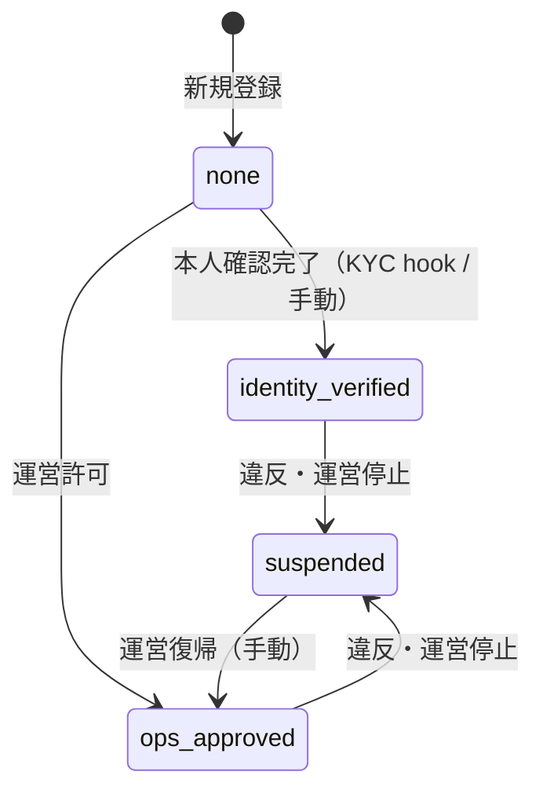
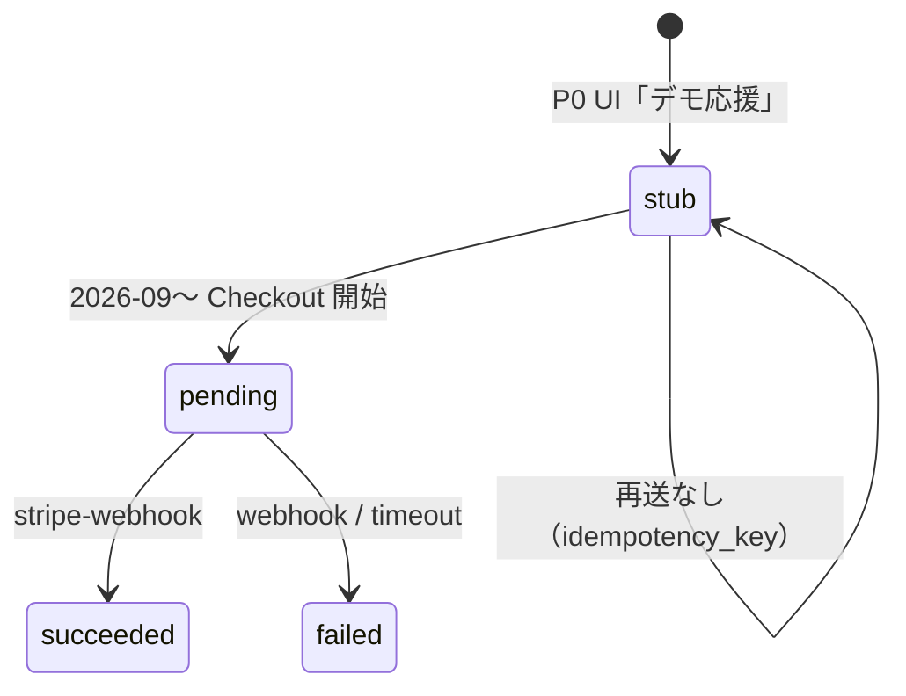

# TASFUL LIVE / Short & Live — Phase 0 Migration レビュー

| 項目 | 内容 |
|------|------|
| 版 | v1.0 |
| 作成日 | **2026-06-23** |
| 種別 | **Migration レビューのみ**（SQL・Edge・コード変更なし） |
| 前提設計 | [`tasful-live-p0-design.md`](tasful-live-p0-design.md) **v1.1** · D-01〜D-06 決裁済み |
| 適用対象 DB | `ddojquacsyqesrjhcvmn`（TASFUL Supabase · TALK P1 反映済み） |

---

## 0. エグゼクティブサマリー

Phase 0 では **11 テーブル（新規 9 + 既存拡張 2）** · **4 Storage bucket（P0 有効）** · **enum/CHECK 12 組** · **RLS ポリシー約 35 本** を追加する草案をレビューした。

| 判定 | 内容 |
|------|------|
| **Go / No-Go** | **条件付き Go** — 本レビュー承認後、**別 PR で migration SQL 草案**を作成可能 |
| 最優先制約 | **TALK 統合を壊さない** · `transaction_rooms` / `talk_notifications` は **拡張のみ** |
| 命名衝突 | `live_*` プレフィックスで **MATCH / Marketplace / Builder と衝突なし** |
| 要フォロー | `talk-category-normalize.js` への `live` 追加は **migration 後のフロント PR**（本 Phase 0 スコープ外だが適用前必須） |

---

## 1. レビュー対象サマリ（12 項目）

| # | 対象 | レビュー結果 |
|---|------|----------------|
| 1 | `live_*` テーブル設計 | ✅ 採用（§2）· `live_notify_dedupe` 追加推奨 |
| 2 | enum / CHECK 制約 | ✅ Phase 0 確定値を採用（§3）· v1.1 との差分を §3.1 で整理 |
| 3 | RLS 方針 | ✅ `talk_current_user_id()` / `talk_is_admin()` 前提（§4） |
| 4 | Storage bucket | ✅ 命名を Phase 0 案に統一（§5）· サムネ public/private を比較決定 |
| 5 | signed URL TTL | ✅ **300 秒** 確定 |
| 6 | `service_type=live` の TALK 影響 | ✅ 衝突なし · `ensure-talk-room` 既存パスで足りる（§6） |
| 7 | `talk_notifications.type=live` | ✅ 列追加不要 · クライアント正規化のみ（§7） |
| 8 | `live_permission_status` | ✅ 4 値 + ゲートロジック確定（§8） |
| 9 | ショート投稿上限 | ✅ 日次 10 · 公開総数 50（§9） |
| 10 | `live_tips` stub 決済 | ✅ 4 状態 + UPDATE 制限（§10） |
| 11 | Cloudflare Stream env | ✅ 変数名確定 · P0 は `LIVE_STREAM_PROVIDER=stub` デフォルト（§11） |
| 12 | 既存領域との衝突 | ✅ なし（§12） |

---

## 2. 推奨 migration 草案 — テーブル一覧

### 2.1 新規テーブル（P0）

| # | テーブル | 役割 |
|---|----------|------|
| T-01 | `live_creator_profiles` | クリエイター公開情報 · 配信資格 · 投稿カウンタ |
| T-02 | `live_shorts` | ショート動画メタデータ |
| T-03 | `live_short_likes` | いいね |
| T-04 | `live_broadcasts` | ライブ配信セッション |
| T-05 | `live_broadcast_messages` | ライブチャット（Realtime） |
| T-06 | `live_creator_follows` | クリエイター user フォロー |
| T-07 | `live_tips` | 投げ銭（stub 含む） |
| T-08 | `live_moderation_logs` | LIVE 専用審査ログ（`moderation_logs` 拡張でも可 · §2.3） |
| T-09 | `live_notify_dedupe` | TALK 通知 fanout 重複防止 |

### 2.2 既存テーブル拡張（最小）

| # | テーブル | 変更 | 破壊性 |
|---|----------|------|--------|
| E-01 | `reports` | `target_content_type` に `live_short` / `live_broadcast` / `live_creator` を CHECK 許可（列が無ければ追加） | なし |
| E-02 | `transaction_rooms` | **列追加なし** — 既存 `service_type` / `service_ref_id` / `contact_id` を利用 | なし |
| E-03 | `talk_notifications` | **列追加なし** — `type='live'` · `source='tasful_live'` の値追加のみ | なし |

### 2.3 `live_moderation_logs` vs 既存 `moderation_logs`

| 案 | 判定 |
|----|------|
| A: 既存 `moderation_logs` に `content_type` 列追加 | △ 本番 RLS がチャット向け · LIVE 混在で運営クエリが複雑化 |
| **B: `live_moderation_logs` 新規（推奨）** | ✅ LIVE Epic 独立 · ops/admin only RLS と整合 |

---

## 3. 各テーブル主要カラムと制約案

### 3.1 Phase 0 確定パラメータ（v1.1 との差分）

| 項目 | v1.1 設計 | **Phase 0 確定** | 備考 |
|------|-----------|------------------|------|
| `live_permission_status` | `pending` 含む | **`none` / `identity_verified` / `ops_approved` / `suspended`** | 新規ユーザー既定は `none` |
| `creator_status` | `general` / `certified` 等（将来） | **`draft` / `active` / `restricted` / `suspended`** | 公開 read は `active` のみ |
| `live_broadcasts.status` | `cancelled` あり | **`scheduled` / `preparing` / `live` / `ended` / `failed` / `removed`** | 列名は `status`（`stream_status` 別列は不要） |
| `stream_provider` | `cloudflare_stream` のみ記載 | **`stub` / `cloudflare_stream`** | P0 既定 `stub` |
| Storage bucket 名 | `live-shorts-*` | **`short-videos` 等（§5）** | migration 時に設計書 v1.1 §4 へ追記推奨 |
| 投稿上限 | 「Phase 0 で確定」 | **日次 10 · 公開総数 50** | — |

### T-01 `live_creator_profiles`

| 列 | 型 | 制約 / 既定 |
|----|-----|-------------|
| `user_id` | text PK | FK → `users(id)` ON DELETE CASCADE（`users` 無ければ FK 省略可） |
| `bio` | text | `char_length <= 500` |
| `banner_storage_path` | text | Storage パス（URL 直保存しない） |
| `avatar_storage_path` | text | `live-avatars` bucket パス |
| `creator_status` | text NOT NULL | DEFAULT `draft` · CHECK（§3.2） |
| `live_permission_status` | text NOT NULL | DEFAULT `none` · CHECK（§3.2） |
| `live_monthly_minutes_limit` | int | NULL 可 · P0 無制限 |
| `creator_tier` | text | NULL · 料金 Epic まで未使用 |
| `fee_rate` | numeric(5,4) | NULL · CHECK `fee_rate IS NULL OR (fee_rate >= 0 AND fee_rate <= 1)` |
| `payout_policy` | jsonb | DEFAULT `'{}'` |
| `live_notify_default` | boolean | DEFAULT true |
| `tip_message_enabled` | boolean | DEFAULT true |
| `short_daily_count` | int NOT NULL | DEFAULT 0 |
| `short_daily_reset_on` | date | 日次上限リセット用 |
| `short_active_count` | int NOT NULL | DEFAULT 0 · **公開中ショート数（上限 50）** |
| `follower_count` | int NOT NULL | DEFAULT 0 |
| `created_at` / `updated_at` | timestamptz | DEFAULT now() |

**公開 read 条件:** `creator_status = 'active'` AND `live_permission_status NOT IN ('suspended')`

### T-02 `live_shorts`

| 列 | 型 | 制約 |
|----|-----|------|
| `id` | uuid PK | DEFAULT gen_random_uuid() |
| `creator_id` | text NOT NULL | = `talk_user_id` |
| `title` | text NOT NULL | `char_length <= 120` |
| `description` | text | `char_length <= 2000` |
| `tags` | text[] | `cardinality(tags) <= 5` |
| `storage_path` | text NOT NULL | `short-videos/{creator_id}/{id}.mp4` |
| `thumb_storage_path` | text | |
| `duration_sec` | int NOT NULL | CHECK `duration_sec BETWEEN 1 AND 60` |
| `width` / `height` | int | アスペクト比検証用 |
| `status` | text NOT NULL | CHECK `status IN ('draft','processing','published','hidden','removed')` |
| `view_count` / `like_count` | int NOT NULL | DEFAULT 0 |
| `published_at` | timestamptz | |
| `created_at` / `updated_at` | timestamptz | |

索引: `(status, published_at DESC)` WHERE `status = 'published'` · `(creator_id, published_at DESC)`

### T-03 `live_short_likes`

| 列 | 型 | 制約 |
|----|-----|------|
| `short_id` | uuid FK → `live_shorts` | ON DELETE CASCADE |
| `user_id` | text NOT NULL | |
| `created_at` | timestamptz | DEFAULT now() |
| PK | `(short_id, user_id)` | |

### T-04 `live_broadcasts`

| 列 | 型 | 制約 |
|----|-----|------|
| `id` | uuid PK | |
| `creator_id` | text NOT NULL | |
| `title` | text NOT NULL | |
| `thumb_storage_path` | text | `live-thumbnails` |
| `status` | text NOT NULL | CHECK **stream_status enum（§3.2）** |
| `stream_provider` | text NOT NULL | DEFAULT `stub` · CHECK（§3.2） |
| `stream_live_input_id` | text | CF Input ID · stub 時 NULL |
| `playback_url` | text | HLS · stub 時はローカル/demo URL 可 |
| `archive_storage_path` | text | P0 未使用 · `live-archives` 用に NULL 予約 |
| `scheduled_at` | timestamptz | |
| `started_at` / `ended_at` | timestamptz | |
| `peak_viewers` | int | DEFAULT 0 |
| `tip_total_yen_stub` | int | DEFAULT 0 · **stub 集計のみ**（実決済は P1） |
| `created_at` / `updated_at` | timestamptz | |

**公開 read 条件:** `status IN ('live', 'ended')` AND 紐づく `live_creator_profiles.creator_status = 'active'`

### T-05 `live_broadcast_messages`

| 列 | 型 | 制約 |
|----|-----|------|
| `id` | uuid PK | |
| `broadcast_id` | uuid FK | ON DELETE CASCADE |
| `sender_id` | text NOT NULL | |
| `message` | text NOT NULL | `char_length <= 200` |
| `created_at` | timestamptz | DEFAULT now() |

Realtime: `supabase_realtime` publication へ追加（適用後検証）

### T-06 `live_creator_follows`

| 列 | 型 | 制約 |
|----|-----|------|
| `follower_id` | text NOT NULL | |
| `creator_id` | text NOT NULL | |
| `notify_enabled` | boolean | DEFAULT true |
| `created_at` | timestamptz | DEFAULT now() |
| PK | `(follower_id, creator_id)` | |
| CHECK | | `follower_id <> creator_id` |

> **`talk_follow_subscriptions` / `members.followers_count` / MATCH フォローとは無関係。** LIVE は `live_creator_profiles.follower_count` のみ更新（Edge または trigger · P0 は Edge 推奨）。

### T-07 `live_tips`

| 列 | 型 | 制約 |
|----|-----|------|
| `id` | uuid PK | |
| `tipper_id` | text NOT NULL | |
| `creator_id` | text NOT NULL | |
| `target_type` | text NOT NULL | CHECK `IN ('short','broadcast')` |
| `target_id` | uuid NOT NULL | |
| `amount_yen` | int NOT NULL | CHECK `amount_yen > 0` · 上限は料金 Epic までアプリ層 |
| `message` | text | `char_length <= 100` |
| `payment_status` | text NOT NULL | DEFAULT `stub` · CHECK（§3.2） |
| `stripe_checkout_session_id` | text | |
| `stripe_payment_intent_id` | text | |
| `idempotency_key` | text UNIQUE NOT NULL | |
| `created_at` | timestamptz | DEFAULT now() |
| `paid_at` | timestamptz | `payment_status = 'succeeded'` 時のみ |

### T-08 `live_moderation_logs`

| 列 | 型 | 備考 |
|----|-----|------|
| `id` | uuid PK | |
| `content_type` | text | `live_short` / `live_broadcast_chat` / `live_profile` |
| `content_id` | text | |
| `user_id` | text | |
| `reasons` | jsonb | |
| `level` | text | |
| `allowed` | boolean | |
| `created_at` | timestamptz | |

### T-09 `live_notify_dedupe`

| 列 | 型 | 備考 |
|----|-----|------|
| `event_key` | text PK | 例: `live:short:{id}:published` |
| `created_at` | timestamptz | |

---

### 3.2 CHECK / enum 確定値

```text
live_permission_status:
  none | identity_verified | ops_approved | suspended

creator_status:
  draft | active | restricted | suspended

live_shorts.status:
  draft | processing | published | hidden | removed

live_broadcasts.status:          -- stream_status として機能
  scheduled | preparing | live | ended | failed | removed

stream_provider:
  stub | cloudflare_stream

live_tips.payment_status:
  stub | pending | succeeded | failed
```

**配信資格ゲート（アプリ + RLS WITH CHECK）:**

```text
live_permission_status IN ('identity_verified', 'ops_approved')
AND creator_status = 'active'
AND live_permission_status <> 'suspended'
```

**投稿上限（定数 · migration コメントまたは `live_platform_settings` は P0 不要）:**

| 定数 | 値 |
|------|-----|
| `LIVE_SHORT_DAILY_UPLOAD_LIMIT` | **10** |
| `LIVE_SHORT_TOTAL_ACTIVE_LIMIT` | **50** |

カウント対象: `live_shorts.status IN ('published', 'hidden')`（`draft` / `removed` は総数に含めない方針 · 実装時に migration コメントで固定）

---

## 4. RLS ポリシー案

**前提関数（既存 · 再定義不要）:**

- `public.talk_current_user_id()` — [`sql/talk-rls-production.sql`](../sql/talk-rls-production.sql)
- `public.talk_is_admin()` — 同上（`tasu_admin` / service_role）

**ロール方針:**

| ロール | P0 |
|--------|-----|
| `authenticated` | メイン · JWT `talk_user_id` 必須 |
| `anon` | **フィード公開 read は拒否**（MATCH と同様 · Edge `live-signed-url` / service_role 経由で公開コンテンツ配信） |
| `service_role` | Edge のみ · クライアント露出禁止 |

> **レビュー判断:** 公開フィードを将来 anon 直 read にする場合は P1 で `live_shorts_public` VIEW を検討。P0 は **authenticated + Edge** で十分。

### 4.1 `live_creator_profiles`

| Policy | Op | 条件 |
|--------|-----|------|
| `live_creator_profiles_select_public` | SELECT | `creator_status = 'active'` AND `live_permission_status NOT IN ('suspended')` |
| `live_creator_profiles_select_own` | SELECT | `user_id = talk_current_user_id()` |
| `live_creator_profiles_insert_own` | INSERT | `user_id = talk_current_user_id()` |
| `live_creator_profiles_update_own` | UPDATE | `user_id = talk_current_user_id()` · **禁止列:** `live_permission_status`, `creator_status`（ops のみ） |
| `live_creator_profiles_admin_all` | ALL | `talk_is_admin()` |

### 4.2 `live_shorts`

| Policy | Op | 条件 |
|--------|-----|------|
| `live_shorts_select_published` | SELECT | `status = 'published'` |
| `live_shorts_select_own` | SELECT | `creator_id = talk_current_user_id()` |
| `live_shorts_insert_own` | INSERT | `creator_id = talk_current_user_id()` · 資格ゲート · `short_active_count < 50` は **Edge で事前検証**（RLS だけでは日次 10 が難しい） |
| `live_shorts_update_own` | UPDATE | `creator_id = talk_current_user_id()` |
| `live_shorts_delete_own` | DELETE | `creator_id = talk_current_user_id()` |
| `live_shorts_admin_all` | ALL | `talk_is_admin()` |

### 4.3 `live_broadcasts`

| Policy | Op | 条件 |
|--------|-----|------|
| `live_broadcasts_select_public` | SELECT | `status IN ('live','ended')` · クリエイター `active` |
| `live_broadcasts_select_own` | SELECT | `creator_id = talk_current_user_id()` |
| `live_broadcasts_insert_own` | INSERT | `creator_id = talk_current_user_id()` · 資格ゲート |
| `live_broadcasts_update_own` | UPDATE | `creator_id = talk_current_user_id()` |
| `live_broadcasts_admin_all` | ALL | `talk_is_admin()` |

### 4.4 `live_broadcast_messages`

| Policy | Op | 条件 |
|--------|-----|------|
| `live_broadcast_messages_select_public` | SELECT | 親 `live_broadcasts.status IN ('live','ended')` かつ公開配信 |
| `live_broadcast_messages_insert_auth` | INSERT | `sender_id = talk_current_user_id()` · 親が `live` |
| `live_broadcast_messages_delete_own` | DELETE | `sender_id = talk_current_user_id()` |
| `live_broadcast_messages_admin_all` | ALL | `talk_is_admin()` |

### 4.5 `live_creator_follows`

| Policy | Op | 条件 |
|--------|-----|------|
| `live_creator_follows_select_own` | SELECT | `follower_id = talk_current_user_id()` |
| `live_creator_follows_insert_own` | INSERT | `follower_id = talk_current_user_id()` · `follower_id <> creator_id` |
| `live_creator_follows_delete_own` | DELETE | `follower_id = talk_current_user_id()` |
| `live_creator_follows_admin_all` | ALL | `talk_is_admin()` |

クリエイター側の `follower_count` は **テーブル直 read 不要** — `live_creator_profiles.follower_count` のみ公開。

### 4.6 `live_tips`

| Policy | Op | 条件 |
|--------|-----|------|
| `live_tips_select_sender` | SELECT | `tipper_id = talk_current_user_id()` |
| `live_tips_select_creator` | SELECT | `creator_id = talk_current_user_id()` |
| `live_tips_insert_auth` | INSERT | `tipper_id = talk_current_user_id()` · **`payment_status` は `stub` または `pending` のみ**（WITH CHECK） |
| `live_tips_update_admin` | UPDATE | `talk_is_admin()` のみ |
| （service_role） | UPDATE | Edge / webhook · **migration では policy 不要** |

**P0 禁止:** クライアントが `payment_status` を `succeeded` に更新すること。

### 4.7 `live_moderation_logs`

| Policy | Op | 条件 |
|--------|-----|------|
| `live_moderation_logs_admin` | ALL | `talk_is_admin()` のみ |

### 4.8 `live_short_likes` / `live_notify_dedupe`

| テーブル | 方針 |
|----------|------|
| `live_short_likes` | SELECT 公開 · INSERT/DELETE 本人 · admin ALL |
| `live_notify_dedupe` | **service_role / admin のみ**（クライアント direct アクセス不可） |

---

## 5. Storage bucket 案

### 5.1 Phase 0 bucket 一覧

| Bucket ID | public | 上限 | MIME | P0 |
|-----------|--------|------|------|-----|
| **`short-videos`** | **false** | 80MB | video/mp4 | ✅ 必須 |
| **`short-video-thumbnails`** | **false（推奨）** | 2MB | image/jpeg,png,webp | ✅ 必須 |
| **`live-avatars`** | **true（推奨）** | 2MB | image/* | ✅ |
| **`live-thumbnails`** | **true（推奨）** | 2MB | image/* | ✅ |
| **`live-archives`** | false | — | — | ❌ P0 未使用（行のみ予約） |

パス規約: `{talk_user_id}/{asset_id}.{ext}`（MATCH `match-profile-photos` と同型）

### 5.2 サムネ public / private 比較

| 方式 | メリット | デメリット | Phase 0 判定 |
|------|----------|------------|----------------|
| **short-video-thumbnails: private** | 動画と同じセキュリティモデル · signed URL 統一 | フィード毎に Edge 呼び出し | **推奨** |
| short-video-thumbnails: public | 一覧が軽い | 未公開ショートのサムネ URL 推測リスク | P1 で再検討可 |
| **live-thumbnails / live-avatars: public** | 配信一覧・プロフィールが軽い · OGP 向き | 削除後も CDN キャッシュ残存 | **推奨**（非機密画像） |
| live-thumbnails: private | 統一感 | 配信カード毎 signed URL | コスト増 |

### 5.3 signed URL TTL

| 項目 | 値 |
|------|-----|
| **TTL** | **300 秒**（5 分） |
| 発行 | Edge `live-signed-url`（将来）· service_role |
| 再生 | クライアントは期限切れ前に refresh · 1 ショート視聴に 1 回発行で足りる |
| 短縮 URL 再配信対策 | P1: Referer 制限 · path に short_id バインド |

### 5.4 v1.1 設計書との bucket 名差分

| v1.1 | Phase 0 migration |
|------|-------------------|
| `live-shorts-original` | **廃止** — P0 は `short-videos` へ直接 upload |
| `live-shorts-published` | → **`short-videos`** |
| `live-thumbnails` | → **`short-video-thumbnails`** |
| `live-broadcast-assets` | → **`live-thumbnails`** |
| `live-profile-banners` | → **`live-avatars`** または banner を profiles 行の `banner_storage_path` |

---

## 6. TALK 連携 — `service_type=live` の影響

### 6.1 既存スキーマ（変更なし）

[`supabase/migrations/20260622120000_talk_room_contact_bridge.sql`](../supabase/migrations/20260622120000_talk_room_contact_bridge.sql) により `transaction_rooms` には以下が **既に存在**:

- `contact_id`（UNIQUE partial index）
- `service_type` / `service_ref_id`（複合 index）
- `source`

### 6.2 既存 `service_type` 値との共存

| 既存値（例） | 領域 | LIVE `live` との関係 |
|--------------|------|----------------------|
| `job_application` | Marketplace 求人 | 独立 · 衝突なし |
| `worker_request` | ワーカー | 独立 |
| MATCH 系 | `match-ensure-talk-room` | **別 Edge · 未変更** |
| **`live`** | **新規** | DM · ショート/配信経由問い合わせ |

### 6.3 推奨マッピング（migration 不要 · アプリ契約）

| 用途 | `listing_type` | `service_type` | `service_ref_id` | `contact_id` |
|------|----------------|----------------|------------------|--------------|
| クリエイター DM | `live` | `live` | `dm:{creator_id}` | `live-dm-{viewer}-{creator}`（辞書順固定） |
| ショート経由 | `live` | `live_short` | `{short_id}` | `live-short-{short_id}-{viewer}` |
| 配信経由 | `live` | `live_broadcast` | `{broadcast_id}` | `live-bcast-{broadcast_id}-{viewer}` |

### 6.4 `ensure-talk-room` Edge への影響

[`supabase/functions/ensure-talk-room/index.ts`](../supabase/functions/ensure-talk-room/index.ts) は **既に `service_type` / `service_ref_id` を受け取り** [`talk-room-ensure.ts`](../supabase/functions/_shared/talk-room-ensure.ts) で冪等検索する。

| 項目 | 判定 |
|------|------|
| Edge コード変更 | **P0 migration では不要** · LIVE クライアントから既存 API を呼ぶのみ |
| `match-ensure-talk-room` | **未タッチ** |
| `transaction_rooms` RLS | 既存チャット RLS に `listing_type=live` 行が乗る — **既存参加者ポリシーでカバー**（新 policy 不要） |
| `expires_at` | LIVE DM は遠い未来日 · `status=active` |

### 6.5 TALK 破壊リスク

| リスク | 緩和 |
|--------|------|
| `contact_id` 衝突 | プレフィックス `live-dm-` / `live-short-` / `live-bcast-` で名前空間分離 |
| 既存ルーム上書き | `findExistingRoom` が `contact_id` 優先で reuse — **意図どおり** |
| chat-detail フロー破壊 | `listing_type=live` は既存 UI の特殊分岐なしで通す（P0 は通常チャット UI） |

---

## 7. `talk_notifications.type=live` 拡張の影響

### 7.1 DB スキーマ

[`sql/talk-sync-schema.sql`](../sql/talk-sync-schema.sql): `talk_notifications.type` は **text · CHECK なし**。

| 変更 | 要否 |
|------|------|
| migration ALTER | **不要** |
| 新値 | `type = 'live'` |
| `source` | `tasful_live`（推奨 · フィルタ用） |

### 7.2 既存 RLS

[`sql/talk-rls-production.sql`](../sql/talk-rls-production.sql): `user_id = talk_current_user_id()` — **type に依存しない**。

| 経路 | 実装 |
|------|------|
| Fanout INSERT | `talk_notifications_insert_admin_fanout`（`talk_is_admin()`）または **service_role Edge** |
| クライアント INSERT | 本人 `user_id` のみ — LIVE からの自己通知は **使わない** |

### 7.3 フロント影響（migration 外 · 適用前チェックリストに含む）

| ファイル | 変更 |
|----------|------|
| `talk-category-normalize.js` | `NOTIFICATION_TYPE_KEYS` に `"live"` 追加 |
| `talk-notify-content-type.js` | LIVE ラベル（配信開始 · 新ショート · 投げ銭等） |
| `platform-notify-action-labels.js` | CTA: 視聴する / 見る / 確認する |
| `talk-notify-actions.js` | `target_url` → `live/watch.html` 等 |

**既存通知 type（skill/job/anpi 等）への影響: なし**

---

## 8. `live_permission_status` 設計（確定）

### 8.1 状態遷移



### 8.2 操作権限マトリクス

| `live_permission_status` | ショート投稿 | ライブ配信 | プロフィール公開 |
|--------------------------|-------------|-----------|------------------|
| `none` | ❌ | ❌ | `creator_status=draft` のみ自分 |
| `identity_verified` | ✅ | ✅ | `creator_status=active` で公開 |
| `ops_approved` | ✅ | ✅ | 同上 |
| `suspended` | ❌ | ❌ | 非公開扱い |

### 8.3 本人確認との接続（P0 設計）

| 方式 | 判定 |
|------|------|
| `members.identity_verified` 参照 | △ Marketplace 列 · LIVE 専用状態と混同 |
| **`live_permission_status` を ops / Edge で更新（推奨）** | ✅ LIVE Epic 独立 · KYC 完了 webhook で `identity_verified` に遷移 |

P0 では **運営手動 `ops_approved`** と **既存 payment-settings KYC 完了フック（将来）** の二経路を想定。migration 自体は列 + CHECK のみ。

---

## 9. ショート投稿上限（確定）

| 定数 | 値 | 実装層 |
|------|-----|--------|
| 日次 upload limit | **10** / 日（クリエイターあたり） | Edge `live-publish-short` 推奨 · `short_daily_count` + `short_daily_reset_on` |
| 公開 active limit | **50** / クリエイター | INSERT 前チェック · `short_active_count` |
| 1 ファイル上限 | 80MB | Storage `file_size_limit` |
| 尺 | 60 秒 | DB CHECK + クライアント |

**日次リセット:** UTC または `Asia/Tokyo` — **Phase 1 実装時に `Asia/Tokyo` 推奨**（migration コメントで明記）。

**`hidden` の扱い:** 総数 50 に **含める**（Storage 節約のため公開停止しても削除を促す）。

---

## 10. `live_tips` stub 決済設計（確定）

### 10.1 状態機械



### 10.2 P0 動作

| ステップ | 処理 |
|----------|------|
| 1 | 視聴者が M-01 で金額選択 |
| 2 | `live_tips` INSERT · `payment_status=stub` · `idempotency_key` 付与 |
| 3 | `talk_notifications` fanout（配信者 · 任意で送信者） |
| 4 | 履歴 UI に表示 · **残高変動なし** |

### 10.3 RLS と整合

- INSERT 時 `payment_status IN ('stub','pending')` のみ許可
- `succeeded` / `failed` への UPDATE は **service_role / admin のみ**
- `tip_total_yen_stub` on `live_broadcasts` は **stub 成功時のみ** Edge で加算（RLS バイパス）

### 10.4 対象外（明示）

実送金 · ウォレット残高 · 出金 · 税務 · Connect アカウント · 手数料控除（`fee_rate` は NULL のまま）

---

## 11. Cloudflare Stream Live — 環境変数（確定）

### 11.1 Supabase Edge Secrets（P1 接続時）

| 変数名 | 用途 | P0 |
|--------|------|-----|
| `CLOUDFLARE_STREAM_ACCOUNT_ID` | CF アカウント ID | 未設定可 |
| `CLOUDFLARE_STREAM_API_TOKEN` | Stream API | 未設定可 |
| `CLOUDFLARE_STREAM_CUSTOMER_SUBDOMAIN` | `customer-{sub}.cloudflarestream.com` | 未設定可 |
| **`LIVE_STREAM_PROVIDER`** | **`stub` \| `cloudflare_stream`** | **既定 `stub`** |

### 11.2 P0 スタブ動作

| `LIVE_STREAM_PROVIDER` | 動作 |
|------------------------|------|
| `stub`（既定） | `live_broadcasts.stream_provider=stub` · 固定 demo `playback_url` · RTMP 欄は「準備中」表示 |
| `cloudflare_stream` | Edge が Live Input 作成 · **本番アカウント固定しない**（ステージング Input 可） |

### 11.3 設計書 D-01 との整合

- migration は **Stream 外部 ID 列のみ** 用意 · API 呼び出しは Edge 実装フェーズ
- 自前 SFU / LiveKit / Agora 用の env **なし**

---

## 12. 既存 MATCH / Marketplace / Builder / TALK 衝突確認

| 領域 | 対象 | LIVE 追加 | 衝突 |
|------|------|-----------|------|
| **TALK** | `transaction_rooms` | `service_type=live` 行追加 | ✅ なし |
| **TALK** | `talk_notifications` | `type=live` | ✅ なし |
| **TALK** | `talk_follow_subscriptions` | 触らない | ✅ `live_creator_follows` と分離 |
| **TALK** | `talk_broadcast_drafts` | 触らない | ✅ 名前類似のみ · 配信下書き（別概念） |
| **TALK** | `talk_call_sessions` | 触らない | ✅ WebRTC 1:1 音声 · LIVE 別 Epic |
| **MATCH** | `match_profiles` / `match_*` | 触らない | ✅ 名前空間独立 |
| **MATCH** | `match-profile-photos` bucket | 別 bucket | ✅ |
| **Marketplace** | `members.followers_count` | 更新しない | ✅ LIVE は `follower_count` 独自 |
| **Marketplace** | `listings` / `favorites` | 触らない | ✅ |
| **Builder** | `builder-photos` / `builder_*` | 触らない | ✅ FROZEN |
| **GenAI** | `genai_2d_live_300` プラン名 | 無関係 | ✅ 製品名のみ |
| **Storage** | `listing-images` 等 | 新 bucket のみ | ✅ ID 重複なし |

---

## 13. 適用前チェックリスト

| # | 項目 | 担当 |
|---|------|------|
| PRE-01 | 本レビュー **条件付き Go** 承認 | PO / Tech lead |
| PRE-02 | `talk-rls-production.sql` 適用済み確認（`talk_current_user_id` 存在） | DBA |
| PRE-03 | `transaction_rooms` bridge 列存在確認（P1 migration 済み） | DBA |
| PRE-04 | 新 migration **ファイル名** `YYYYMMDDHHMMSS_live_p0_schema.sql` · **1 ファイルに集約推奨** | Eng |
| PRE-05 | dev 用 `*_dev` policy を **同時に作らない**（本番 policy のみ · P0 RLS 教訓） | Eng |
| PRE-06 | `supabase_realtime` publication 追加手順を migration 末尾コメントに記載 | Eng |
| PRE-07 | Storage bucket 作成 SQL を migration に含めるか **別ファイル**か決定 | Eng |
| PRE-08 | フロント `talk-category-normalize.js` 変更を **migration  deploy 前後どちらで先**か決定（推奨: **同一リリース train**） | Eng |
| PRE-09 | `reports` 拡張が既存通報 UI と整合するか確認 | Eng |
| PRE-10 | ステージングで `LIVE_STREAM_PROVIDER=stub` のみで smoke 可能であること | QA |
| PRE-11 | MATCH / TALK smoke スクリプトを LIVE migration 前後で実行予定を登録 | QA |
| PRE-12 | `live_notify_dedupe` への anon/authenticated GRANT を **付与しない** | DBA |

---

## 14. 適用後検証項目

| # | 検証 | 期待結果 |
|---|------|----------|
| POST-01 | `\d live_creator_profiles` 等 · 全 9 テーブル存在 | PASS |
| POST-02 | CHECK 違反 INSERT（`live_permission_status=invalid`） | 拒否 |
| POST-03 | `live_shorts.duration_sec=61` | 拒否 |
| POST-04 | anon `SELECT live_shorts` | 0 行（または permission denied） |
| POST-05 | authenticated 本人 `INSERT live_creator_profiles` | PASS |
| POST-06 | `live_permission_status=none` で `INSERT live_shorts` | **RLS または app で拒否** |
| POST-07 | `identity_verified` + `active` で `INSERT live_shorts`（11 本目） | 日次上限で拒否 |
| POST-08 | `live_tips` INSERT `payment_status=stub` | PASS |
| POST-09 | クライアント `UPDATE live_tips SET payment_status=succeeded` | **拒否** |
| POST-10 | `ensure-talk-room` `service_type=live` smoke | 既存スクリプト拡張で PASS |
| POST-11 | `talk_notifications` fanout `type=live`（service_role） | 受信者のみ SELECT 可 |
| POST-12 | Storage `short-videos` upload（owner パス） | PASS |
| POST-13 | signed URL TTL 300s 発行（Edge 実装後） | 期限後 403 |
| POST-14 | `smoke-match-talk-room.mjs` / `verify-talk-chat-unify-p1.mjs` 回帰 | PASS |
| POST-15 | Realtime `live_broadcast_messages` INSERT | 購読クライアントに配信 |

---

## 15. リスク

| ID | リスク | 影響 | 緩和 |
|----|--------|------|------|
| R-01 | 日次 10 本を RLS のみで担保困難 | 上限突破 | **Edge 必須** + DB カウンタ |
| R-02 | 公開フィードが authenticated 限定 | 未ログイン視聴不可 | P0 許容 · P1 で anon VIEW |
| R-03 | `short-videos` 80MB × 50 = 4GB/人 | Storage コスト | 上限 50 厳守 · ops 監視 |
| R-04 | `talk_notifications` fanout をクライアントが偽装 | スパム通知 | admin/service_role のみ fanout |
| R-05 | `contact_id` 生成の順序不一致 | DM ルーム重複 | `{a}-{b}` を **ソート固定**（実装規約） |
| R-06 | migration とフロント `type=live` のデプロイずれ | 通知ラベル欠落 | 同一リリース train（PRE-08） |
| R-07 | Stream stub と本番切替 | 配信不能 | `LIVE_STREAM_PROVIDER` 明示 · 未設定=stub |
| R-08 | `live_moderation_logs` ops のみ | 通報者がログ見れない | 意図どおり · UI は通報受付のみ |

---

## 16. Go / No-Go 判定

### 16.1 判定

| 判定 | **条件付き Go** |
|------|-----------------|
| 意味 | Phase 0 **migration SQL 草案の作成に進んでよい** |
| 条件 | ① 本ドキュメント承認 ② PRE-01〜PRE-12 を migration PR 説明に転記 ③ TALK 回帰 smoke を migration 適用計画に含める |

### 16.2 No-Go となり得る条件（現時点では未該当）

- `talk_current_user_id()` 未適用環境への直接適用
- `live_*` テーブルが既に別用途で存在する場合（現状 **未存在**）
- TALK P1 未反映環境（`service_type` 列なし）

### 16.3 次ステップ（本タスクのスコープ外）

1. `supabase/migrations/YYYYMMDDHHMMSS_live_p0_schema.sql` **草案作成**（別 PR）
2. `supabase/migrations/YYYYMMDDHHMMSS_live_p0_rls.sql` または同一ファイル内 RLS セクション
3. `supabase/migrations/YYYYMMDDHHMMSS_live_storage_buckets.sql`（bucket + storage policy）
4. `scripts/verify-live-p0-schema.mjs`（POST-01〜15 の自動化）
5. 設計書 v1.1 §4 Storage 名を Phase 0 bucket 名へ **追記同期**（任意）

---

## 付録 A. migration ファイル構成（推奨）

```text
supabase/migrations/
  YYYYMMDDHHMMSS_live_p0_schema.sql      -- tables, checks, indexes, grants
  YYYYMMDDHHMMSS_live_p0_rls.sql         -- policies only（または schema に内包）
  YYYYMMDDHHMMSS_live_storage_buckets.sql -- storage.buckets + storage.objects policies
```

単一ファイルにまとめる場合は **セクション順: extensions → tables → indexes → rls → storage → realtime comments**。

## 付録 B. Realtime 追加対象（P0）

| テーブル | 用途 |
|----------|------|
| `live_broadcast_messages` | ライブチャット |
| （任意）`live_tips` | 配信者 UI の投げ銭フィード · service_role INSERT なら **postgres_changes 不要**（通知で代替可） |

---

*本ドキュメントは Phase 0 migration レビューのみ。SQL・Edge・既存コードの変更は含まない。*
