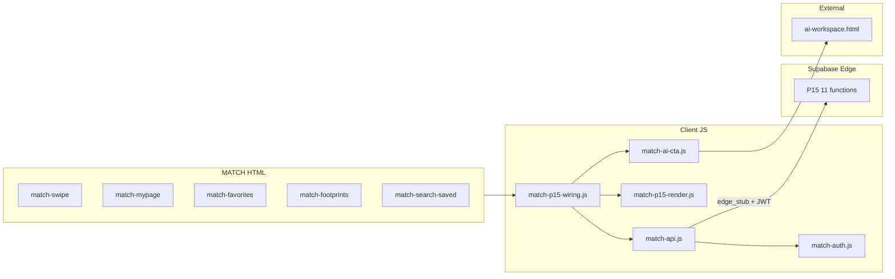

# TASFUL MATCH — P15-L4 UI 配線計画

| 項目 | 内容 |
|------|------|
| 版 | v1.0（**計画のみ · UI/CSS/dist 未着手**） |
| 作成日 | **2026-06-21** |
| 対象 ref | **`ddojquacsyqesrjhcvmn`**（linked ref · Hook ON · RLS D2） |
| 前提 | P15-L3 Edge **PASS** · 判定 **`READY_FOR_P15_L4_UI`** |
| 検証 | **local / linked ref / prod-parity** · **`tasful.jp` 8 月まで保留** |
| 本計画の停止点 | **レポート承認まで** — 実装・CSS・dist 同期は別承認 |

---

## 1. 目的とスコープ

P15-L3 で deploy 済みの **11 Edge Functions** を、既存 MATCH 静的 UI から `match-api.js` 経由で呼び出し、7 機能のユーザー体験を配線する。

| 含む | 含まない |
|------|----------|
| `match-api.js` P15 client 追加 | Edge / DB / migration 変更 |
| お気に入り · 足あと · 活動 · 検索保存 · 相性 · 完成度 UI | MATCH 内 AI チャット / iframe / 診断完結 UI |
| TASFUL AI への **リンク・CTA のみ** | `deploy/cloudflare/dist/match/*` 同期（**P15-L5**） |
| 新規 3 ページ + 既存ページ拡張 | `tasful.jp` 本番 URL 確認 |
| smoke / visual check 定義 | 既存 7 Edge の挙動変更 |

**設計原則（再確認）**

- 既存 **MATCH UI 9 ページ**（prod-parity 対象）の DOM 契約・ナビ・L9 配線を壊さない
- **390 / 768 / 1280px** でレイアウト破綻なし · **console error 0**
- 他者プロフィール表示は **`activity_label` / `footprint_label` のみ** — raw `last_active_at` · raw `viewed_at` · 「オンライン中」は **表示しない**
- デフォルト API モードは引き続き **`client_stub`**（静的閲覧・回帰互換）· JWT 連携時のみ **`edge_stub`**

---

## 2. 影響ファイル一覧（実装前に固定）

### 2.1 新規作成（P15-L4）

| ファイル | 役割 |
|----------|------|
| `match/match-favorites.html` | お気に入り一覧 |
| `match/match-footprints.html` | 足あと（incoming）一覧 |
| `match/match-search-saved.html` | 保存済み検索条件の一覧・編集 |
| `match/match-p15-wiring.js` | P15 専用イベント配線（L9 `match-wiring.js` と分離） |
| `match/match-p15-render.js` | P15 共通 DOM 描画（ラベル・相性 chip・完成度バー） |
| `match/match-ai-cta.js` | `TasuAiWorkspaceLinks` 薄ラッパ · MATCH 6 CTA |
| `scripts/verify-match-p15-l4-ui.mjs` | Playwright UI smoke（390/768/1280 · console 0） |
| `scripts/test-match-api-p15-client.mjs` | `match-api.js` P15 メソッド単体 smoke |
| `reports/tasful-match-p15-l4-ui-implement-result.md` | 実装後レポート（本計画の次成果物） |

### 2.2 変更（P15-L4）

| ファイル | 変更種別 | 概要 |
|----------|----------|------|
| `match/match-api.js` | **拡張** | P15 11 メソッド · `EDGE_FUNCTION_PATHS` 追加 |
| `match/match-data-stub.js` | **拡張** | P15 stub データ（`activity_label` 公開 · `last_active_at` は内部のみ） |
| `match/match-data-render.js` | **拡張** | スワイプカードに label 表示 · online ドット廃止方向 |
| `match/match.css` | **拡張** | P15 コンポーネント（パステル既存トークン流用） |
| `match/match-swipe.html` | **拡張** | お気に入り · 相性 · 活動 · フィルタ導線 |
| `match/match-mypage.html` | **拡張** | P15 ハブ · 完成度 · AI CTA 群 · 各一覧リンク |
| `match/match-profile-create.html` | **拡張** | 完成度バー · purpose/恋愛観 step · AI CTA |
| `match/match-list.html` | **軽微拡張** | 相手 `activity_label` · AI メッセージ/デート CTA |
| `match/match-talk-bridge.html` | **軽微拡張** | AI デート相談 CTA · ページ表示時 activity bump |
| `match/match-top.html` | **軽微** | マイページ P15 導線コピー（任意 1 行） |
| `match/match-safety.html` | **軽微** | AI 恋愛相談 CTA（フッター近傍） |
| `match/match-review.html` | **拡張** | P15 API 診断行 · 新ページリンク |
| `ai-workspace-links.js` | **拡張** | `returnTo` query サポート · `buildMatchCtaUrl()` 追加 |
| `scripts/test-match-api-client-stub.mjs` | **拡張** | P15 メソッド存在・client_stub 応答 |
| `scripts/verify-match-ui-prod-url-review.mjs` | **拡張** | 9 ページ回帰 + P15 新ページ optional プローブ |
| `breadcrumb-config.js` | **任意** | 新 3 ページ breadcrumb（サイト共通方針に従う） |

### 2.3 触らない（回帰固定）

| ファイル | 理由 |
|----------|------|
| `match/match-report.html` | L9 通報 UI — DOM/配線不変 |
| `match/match-block.html` | L9 ブロック UI — 不変 |
| `match/match-verify.html` | L9 本人確認 — 不変 |
| `match/match-wiring.js` | L9 配線 — **P15 は別ファイル** |
| `match/match-auth.js` | 認証境界 — L4 では edge_stub 起動フックのみ検討（挙動変更は最小） |
| `supabase/functions/match-*` | L3 完了 · UI から呼ぶのみ |
| `deploy/cloudflare/dist/match/*` | **P15-L5** まで同期しない |

### 2.4 P15-L5（本計画外 · 参照のみ）

```
deploy/cloudflare/dist/match/{上記 match/* ミラー}
scripts/verify-match-ui-prod-url-review.mjs の DIST_SYNC_FILES 更新
```

---

## 3. アーキテクチャ



| 層 | 責務 |
|----|------|
| `match-api.js` | 入力検証 · `callEdgeFunction` · client_stub 固定応答 |
| `match-p15-wiring.js` | ページ初期化 · API 呼び出し · toast · 未ログインガード |
| `match-p15-render.js` | `data-*` → DOM · label のみ描画 |
| `match-ai-cta.js` | CTA href 生成 · **fetch なし** |

**モード切替（計画）**

| 条件 | `TasfulMatchAPI.mode` |
|------|------------------------|
| 静的 mock / 未ログイン | `client_stub`（現状維持） |
| `TasfulMatchAuth.isLoggedIn()` + `chat-supabase-config` 読込 + JWT | `edge_stub` + `functionsBaseUrl` |

`match-review.html` では既存診断 UI を拡張し、P15 メソッドを **client_stub / edge_stub 両方** で手動検証可能にする。

---

## 4. `match-api.js` 追加関数案

L3 実装済み Edge 名に **1:1 対応**（feature plan の `toggleFavorite` 等は採用しない）。

### 4.1 `EDGE_FUNCTION_PATHS` 追加分

```javascript
favoriteUser: "match-favorite",
unfavoriteUser: "match-unfavorite",
listFavorites: "match-list-favorites",
recordProfileView: "match-record-profile-view",
listProfileViews: "match-list-profile-views",
saveSearch: "match-save-search",
listSavedSearches: "match-list-saved-searches",
deleteSavedSearch: "match-delete-saved-search",
getCompatibility: "match-get-compatibility",
getProfileCompleteness: "match-get-profile-completeness",
updateActivity: "match-update-activity",
```

### 4.2 公開メソッド

| メソッド | Request（主要） | 成功 Response（UI が使う字段） | client_stub 挙動 |
|----------|-----------------|--------------------------------|------------------|
| `favoriteUser(payload)` | `{ target_user_id, source?, note? }` | `{ favorite_id, created, target_user_id }` | `{ created: true }` |
| `unfavoriteUser(payload)` | `{ target_user_id }` or `{ favorite_id }` | `{ unfavorited, target_user_id }` | `{ unfavorited: true }` |
| `listFavorites(payload)` | `{ limit?, cursor? }` | `{ items[], next_cursor }` · item.profile.**activity_label** | 3 件 stub · label 付き |
| `recordProfileView(payload)` | `{ viewed_user_id, source? }` | `{ recorded, dedupe_bucket? }` | `{ recorded: false }` no-op |
| `listProfileViews(payload)` | `{ limit?, cursor? }` | `{ items[] }` · **footprint_label** のみ | 2 件 stub |
| `saveSearch(payload)` | `{ id?, name, filters_json, is_default? }` | `{ search_id, updated }` | 固定 uuid |
| `listSavedSearches(payload)` | `{ include_archived? }` | `{ items[] }` | 2 件 stub |
| `deleteSavedSearch(payload)` | `{ id }` | `{ deleted, id }` | `{ deleted: true }` |
| `getCompatibility(payload)` | `{ target_user_id }` | `{ percent, common_points[], common_count }` | `{ percent: 78, common_count: 3 }` |
| `getProfileCompleteness(payload)` | `{}` | `{ percent, items[] }` | `{ percent: 80, items[] }` |
| `updateActivity(payload)` | `{}` | `{ activity_label, bumped }` | `{ activity_label: "24時間以内に活動", bumped: false }` |

### 4.3 共通ガード（既存 L7 パターン踏襲）

- `edge_stub` 時のみ `fetch` · `buildHeaders()` 経由 JWT 必須
- クライアント側でも `target_user_id` 必須検証（Edge 前の早期 `validation_error`）
- レスポンス JSON を UI に渡す前に **`assertNoSensitiveTimestamps(obj)`** — `last_active_at` · `viewed_at` キーがあれば **console.warn + 削除**（defense in depth）
- `window.TasfulMatchAPI` export に 11 メソッド追加 · 既存 7 メソッド **シグネチャ不変**

### 4.4 Activity bump 呼び出しタイミング（UI）

| タイミング | 呼び出し |
|------------|----------|
| スワイプ like/skip 成功後 | `updateActivity()`（debounce は Edge 側 15min） |
| お気に入り add 成功後 | 同上 |
| マイページ初回表示（session 1 回） | 同上 |
| プロフィール作成 wizard 完了 | 同上 |
| heartbeat / 定期 polling | **実装しない** |

---

## 5. 各ページ UI 変更点

### 5.1 既存 9 ページ（prod-parity · 破壊禁止）

| # | ページ | P15 変更 | 回帰要件 |
|---|--------|----------|----------|
| 1 | `match-top.html` | 変更 **なし** またはヒーロー下にマイページリンク 1 行（既存 CTA 構造維持） | probe 変化なし |
| 2 | `match-profile-create.html` | 完成度バー `[data-match-completeness-bar]` · step 追加（目的/恋愛観） · AI CTA | `[data-match-profile-wizard]` 存続 |
| 3 | `match-swipe.html` | ♡お気に入り · 相性 chip · 活動 label · フィルタ→検索保存 · カード表示時 `recordProfileView` | `[data-match-swipe-action='like']` 存続 |
| 4 | `match-list.html` | マッチカードに `activity_label` · AI CTA 2 種 | `[data-match-pair-list]` 存続 |
| 5 | `match-talk-bridge.html` | AI デート CTA · `updateActivity` on load | `[data-match-talk-cta]` 存続 |
| 6 | `match-safety.html` | セクション末尾 AI 恋愛相談リンク | `.match-safety-hero` 存続 |
| 7 | `match-report.html` | **変更なし**（script 順のみ統一可） | `[data-report-submit]` 存続 |
| 8 | `match-block.html` | **変更なし** | `[data-match-block-list]` 存続 |
| 9 | `match-verify.html` | **変更なし** | `[data-verify-panel='1']` 存続 |

### 5.2 拡張ページ（P15 主战场 · 9 ページ外）

| ページ | UI 変更 |
|--------|---------|
| `match-mypage.html` | 完成度リング · P15 メニュー 3 件（お気に入り/足あと/検索） · AI CTA カード 3 種 · `updateActivity` |
| `match-review.html` | P15 診断表 · 新ページリンク · API メソッド一覧 |

### 5.3 新規 3 ページ

#### `match-favorites.html`

| 要素 | 仕様 |
|------|------|
| リスト | `[data-match-favorite-list]` · `listFavorites` で hydrate |
| 行 | アバター · 名前 · 年齢 · **`activity_label`** · お気に入り解除 |
| 空状態 | 「お気に入りはまだありません」+ スワイプへ CTA |
| タブバー | 既存 4 タブ維持 · アクティブ=マイページ |

#### `match-footprints.html`

| 要素 | 仕様 |
|------|------|
| リスト | `[data-match-footprint-list]` · `listProfileViews` |
| 行 | 「{nickname}さんがプロフィールを見ました · **{footprint_label}**」 |
| 非表示 | raw 日時 · 閲覧回数の過度な精度 |
| 空状態 | 「足あとはまだありません」 |
| 注記 | フッターに「相手の設定により記録されない場合があります」 |

#### `match-search-saved.html`

| 要素 | 仕様 |
|------|------|
| 一覧 | `[data-match-saved-search-list]` |
| 操作 | 保存 · デフォルト設定 · 削除（確認 toast） |
| フィルタ表示 | 年齢 · 都道府県 · purpose · verified_only を human-readable chip |
| 適用 | 「この条件で探す」→ `match-swipe.html` へ（query `?search_id=` · stub 段階は toast のみ） |

### 5.4 コンポーネント `data-*` 契約

| 属性 | 用途 |
|------|------|
| `data-match-favorite-toggle` | `target_user_id` · ON/OFF |
| `data-match-activity-label` | テキスト注入（API/stub から **label のみ**） |
| `data-match-compat-score` | `percent` 表示 |
| `data-match-compat-common` | `common_points[]` 最大 3 件 |
| `data-match-compat-ai-cta` | 相性詳細 → TASFUL AI |
| `data-match-completeness-bar` | 幅 `%` · 隣に `percent` テキスト |
| `data-match-completeness-items` | チェックリスト（任意折りたたみ） |
| `data-match-completeness-ai-cta` | プロフィール改善 AI |
| `data-match-ai-cta` | `data-ai-mode` · `data-ai-q-template` |
| `data-match-footprint-list` | 足あと一覧 mount |
| `data-match-favorite-list` | お気に入り一覧 mount |
| `data-match-saved-search-list` | 検索保存一覧 mount |
| `data-match-saved-search-save` | 保存ボタン |
| `data-match-open-saved-search` | スワイプ header フィルタ |

### 5.5 活動表示 — online ドット廃止

現状 `match-profile-card__online`（緑ドット）は **オンライン誤解** のため P15 で置換:

| Before | After |
|--------|-------|
| `<span class="match-profile-card__online">` | `<span class="match-activity-label" data-match-activity-label>3日以内に活動</span>` |
| stub `last_active_at` を UI 描画 | stub **`activity_label`** フィールドを追加し render のみ使用 |

`match-data-stub.js` の `last_active_at` は **開発者向け内部** として残してもよいが、**render/wiring から参照禁止**。

---

## 6. TASFUL AI CTA リンク仕様

### 6.1 原則

- MATCH 内に AI UI を **置かない** · **`<a href>` 遷移のみ**
- ヘルパー: `ai-workspace-links.js` → **`match/match-ai-cta.js`** 経由で統一
- ベース: `../ai-workspace.html`（`match/` からの相対）
- **必須 query:** `mode` · `q` · **`returnTo`**（MATCH 復帰用 · L4 で `buildUrl` 拡張）

### 6.2 `ai-workspace-links.js` 拡張案

```javascript
// buildUrl(opts) に returnTo?: string を追加
params.set("returnTo", pickStr(o.returnTo));

// 新規
function buildMatchCtaUrl(opts) {
  return buildUrl({
    basePath: "../ai-workspace.html",
    mode: opts.mode,
    q: opts.q,
    returnTo: opts.returnTo || (location.pathname + location.search),
    send: opts.send === true,
  });
}
```

### 6.3 6 CTA 一覧

| ID | 配置 | `mode` | 初期 `q` テンプレ |
|----|------|--------|-------------------|
| CTA-1 プロフィール改善 | マイページ · profile-create 完成度下 | `match-profile-coach` | `マッチング用プロフィールを改善したいです。現在の完成度は{percent}%です。` |
| CTA-2 恋愛相談 | マイページ · safety 下 | `match-love-consult` | `恋愛の悩みを相談したいです。` |
| CTA-3 婚活相談 | マイページ（婚活向けコピー） | `match-marriage-consult` | `婚活のアドバイスが欲しいです。` |
| CTA-4 メッセージ相談 | list · talk-bridge | `match-message-coach` | `マッチ相手へのメッセージの書き方を相談したいです。` |
| CTA-5 相性詳細 | swipe 相性 chip タップ | `match-compatibility-deep` | `{nickname}さんとの相性を詳しく分析してください。簡易スコアは{percent}%で共通点{count}件です。` |
| CTA-6 デート相談 | list · talk-bridge | `match-date-coach` | `初デートのプランやマナーについて相談したいです。` |

**HTML 例（計画）**

```html
<a class="match-ai-cta match-ai-cta--lavender"
   data-match-ai-cta
   data-ai-mode="match-profile-coach"
   data-ai-q-template="マッチング用プロフィールを改善したいです。現在の完成度は{percent}%。"
   href="#"
   rel="noopener">TASFUL AI でプロフィール改善</a>
```

`match-ai-cta.js` が DOMContentLoaded で `href` を解決 · `target="_blank"` は **使わない**（同一タブ遷移 · returnTo で復帰）。

**TASFUL AI 側:** 6 `mode` のプロンプトテンプレ · 課金 · MATCH コンテキスト UI は **別チーム · P15 MATCH スコープ外**（mode 名のみ事前共有）。

---

## 7. エラー / 未ログイン時の表示

### 7.1 未ログイン（`!TasfulMatchAuth.isLoggedIn()`）

| 画面 | 挙動 |
|------|------|
| 9 ページ静的閲覧 | **現状どおり client_stub + mock 表示**（console error 0） |
| P15 操作（♡ · 保存 · 一覧 load） | toast「ログインが必要です」· ボタン `disabled` + `aria-disabled` |
| 新規 3 ページ | 空状態 + `match-top.html` へ誘導リンク（ログイン導線は Phase 2 · 現 stub は review 経由） |

### 7.2 API エラー（edge_stub）

| `code` | UI |
|--------|-----|
| `auth_required` / 401 | toast「再度ログインしてください」· P15 ブロック非表示 |
| `validation_error` / 422 | toast に `message` |
| `blocked` | toast「このユーザーとは操作できません」 |
| `profile_not_found` / 404 | 相性 chip 非表示 · 完成度 0% 扱い |
| `rate_limited` / 429 | toast「しばらく待ってから再度お試しください」 |
| `feature_disabled` / 503 | P15 セクション全体 `[data-match-p15-section]` を `hidden` · 9 ページコアは表示維持 |
| `network_error` / `timeout` | toast + **直前の stub/mock 表示を維持**（白画面にしない） |

### 7.3 ローディング

- 一覧系: `[data-match-p15-loading]` スケルトン（パステル gray · 既存 card 影）
- ボタン: `is-loading` で二重 submit 防止
- **グローバル spinner 新設しない**（既存 toast 文化に合わせる）

---

## 8. レスポンシブ方針

既存 `match.css` トークン（`--match-shell: 420px` · `--match-shell-wide: 1200px`）を踏襲。

| 幅 | 方針 |
|----|------|
| **390px** | `match-app--phone` · 1 カラム · タブバー固定 · 相性/完成度はカード内縦積み |
| **768px** | タブバー中央寄せ · リスト行 avatar+本文横並び · 新 3 ページも phone shell 維持（MATCH MVP 一貫性） |
| **1280px** | `match-app` max-width 1200px · マイページ/新一覧は **2 カラム optional**（左リスト · 右 AI CTA カード）· 9 ページ hero 比率不変 |

**禁止事項**

- 390 で horizontal scroll 発生
- 1280 で 9 ページの tabbar/header 高さ変更
- 新規 breakpoint 乱立（390/768/1280 の 3 点のみ）

---

## 9. Smoke / Visual check 項目

### 9.1 自動（実装後必須）

| Script | 内容 |
|--------|------|
| `scripts/test-match-api-p15-client.mjs` | 11 メソッド · client_stub 200 · validation_error · **`last_active_at` キーなし** |
| `scripts/test-match-api-client-stub.mjs` | 既存 7 + P15 回帰 |
| `scripts/verify-match-p15-l4-ui.mjs` | Playwright: 390/768/1280 × 主要ページ · **console error 0** · DOM に `last_active_at` 文字列なし |
| `scripts/smoke-match-p15-l3-edge.mjs` | Edge 回帰（UI 変更後も PASS） |
| `scripts/verify-match-post-auth-final-smoke.mjs` | L0–L12 統合（可能な範囲） |
| `scripts/verify-match-ui-prod-url-review.mjs` | **9 ページ** prod-parity · dist 未同期時は repo `match/` を `--base` ローカル |

### 9.2 手動 visual checklist

| # | 確認 |
|---|------|
| V1 | スワイプ: 相性 % · 活動 label · ♡ toggle · 緑 online ドット **なし** |
| V2 | お気に入り一覧: 追加/解除 · label 表示 |
| V3 | 足あと: footprint_label のみ（「今日」「昨日」） |
| V4 | 検索保存: 保存/削除/デフォルト |
| V5 | マイページ: 完成度バー · 6 CTA href が `ai-workspace.html?mode=` |
| V6 | AI CTA クリック → TASFUL AI 遷移 · MATCH に chat UI **なし** |
| V7 | report/block/verify/swipe like: **L9 既存動作** |
| V8 | 390/768/1280 スクリーンショット → `reports/screenshots/match-p15-l4/` |

### 9.3 合格判定（L4 実装後）

| 結果 | 判定 |
|------|------|
| 全自動 smoke PASS · console 0 · 9 ページ probe 維持 | **`READY_FOR_P15_L5_DIST_SYNC`** |
| いずれか FAIL | **`BLOCKED_WITH_REASON`** · dist 同期禁止 |

---

## 10. 実装順序（L4 サブフェーズ · 承認後）

| Phase | 内容 | 停止条件 |
|-------|------|----------|
| **L4-A** | `match-api.js` + `test-match-api-p15-client.mjs` | テスト FAIL で HTML 触らない |
| **L4-B** | stub/render 拡張 · online→label | render unit 確認 |
| **L4-C** | `match-ai-cta.js` + `ai-workspace-links.js` returnTo | リンク 404 で停止 |
| **L4-D** | 新 3 HTML + `match.css` P15 block | visual 390 で崩れあれば停止 |
| **L4-E** | 既存ページ HTML 差分（9 ページは最小 diff） | prod-parity probe FAIL で revert |
| **L4-F** | `match-p15-wiring.js` + mypage 拡張 | wiring 後 smoke |
| **L4-G** | `verify-match-p15-l4-ui.mjs` + レポート | FAIL なら dist 禁止 |

**並行禁止:** L4-A PASS 前に wiring 配線しない · L4-C 前に AI CTA を HTML に埋めない（href `#` 仮置き禁止）。

---

## 11. Rollback 方針

### 11.1 UI のみ（推奨 · Edge/DB 不触）

| 順 | 操作 |
|----|------|
| 1 | `git revert` または `match/` 以下 P15 変更ファイルを戻す |
| 2 | `ai-workspace-links.js` の returnTo 変更を revert（他プロダクト影響時） |
| 3 | `client_stub` デフォルトのため **9 ページは即 mock 復帰** |

### 11.2 部分ロールバック

| 障害 | 対応 |
|------|------|
| Edge 503 `feature_disabled` | UI kill: `[data-match-p15-section]` CSS `display:none` · API 呼び出しスキップ |
| 相性/完成度 RPC のみ障害 | wiring で該当 chip 非表示 · 他 P15 は継続 |
| AI CTA mode 未対応 | CTA テキストは残し `href` を `ai-workspace.html` のみ（mode 省略フォールバック） |

### 11.3 dist 同期後（L5 以降）

- `deploy/cloudflare/dist/match/*` を **直前コミット SHA** に戻す
- Cloudflare Pages redeploy

**L1/L3 DB · Edge は rollback 不要**（UI が client_stub に落ちる）。

---

## 12. 本計画の停止点と次ゲート

| 項目 | 状態 |
|------|------|
| P15-L4 UI 計画 | **本レポート** |
| UI 実装 | **未着手** — 本計画 **承認後** |
| CSS 変更 | **未着手** |
| dist 同期 | **P15-L5** |
| `tasful.jp` | **8 月まで保留** |

**承認後の次判定候補:** 実装完了 smoke PASS → **`READY_FOR_P15_L5_DIST_SYNC`**

---

## 13. 参照

| 文档 | 路径 |
|------|------|
| P15 機能計画 | `reports/tasful-match-p15-feature-plan.md` |
| L3 Edge 計画 | `reports/tasful-match-p15-l3-edge-plan.md` |
| L3 実装結果 | `reports/tasful-match-p15-l3-edge-implement-result.md` |
| 既存 API client | `match/match-api.js` |
| 既存 wiring | `match/match-wiring.js` |
| AI リンク共通 | `ai-workspace-links.js` |
| prod-parity 9 ページ | `scripts/verify-match-ui-prod-url-review.mjs` |
| デザイントークン | `match/match.css`（`:root` pastel） |
