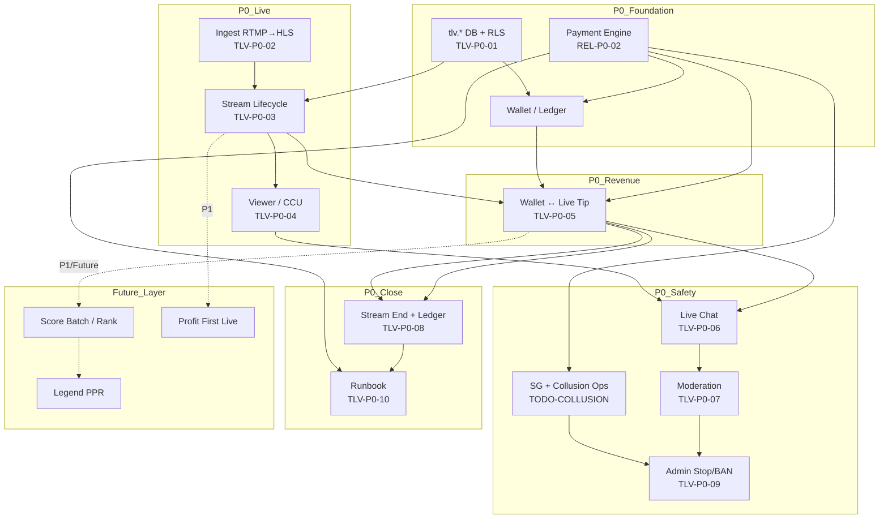

# TLV Implementation Readiness — Design Freeze · 実装準備監査

**作成日:** 2026-06-28  
**種別:** 監査 · 整理 · 実装準備（**コード · DB · migration · docs 仕様変更なし**）  
**前提:** Design Audit Reconciliation + Follow-up **完了** — 制度設計を **凍結** し実装フェーズへ移行

**参照正本**

| 領域 | 正本 doc |
| --- | --- |
| Score · Rank · Override · Anti-Fraud · Live 制度 | `docs/TLV_PRD.md` v1.2.1 POLICY-SUPPLEMENT |
| 還元 · Rank 運用 | `docs/CREATOR_PROGRAM.md` |
| Payment · Wallet · Clawback | `docs/TLV_PAYMENT_ENGINE.md` · `reports/tlv-payment-chargeback-clawback-design.md` |
| Profit First | `docs/FINANCIAL_MODEL.md` §7 |
| 価格 · 延長 | `docs/PRICING.md` |
| DB | `docs/TLV_DB_SCHEMA.md` |
| Admin · T&S · Clawback Ops | `docs/ADMIN_SYSTEM.md` |
| Live SDK | `docs/TLV_LIVE_PROVIDER.md` |
| 優先度 · blocker | `docs/TODO.md` §Release Readiness · §TLV Release P0 |
| 監査根拠 | `reports/tlv-design-audit-reconciliation.md` · `reports/tlv-design-audit-followup-policy.md` · `reports/tlv-release-p0-audit.md` |

---

## 1. Design Freeze 確認

### 1.1 凍結宣言

**2026-06-28 時点で TLV 制度設計を正式凍結（Design Freeze）とする。**

| 制度 | 凍結正本 | Follow-up 含む |
| --- | --- | --- |
| **Creator Score** | TLV_PRD §5（FS/ES/GS/TS · Score_MA30 · rolling 30d） | — |
| **Rank** | TLV_PRD §5.7 · §6 · CREATOR_PROGRAM §3 | Platinum 絶対 · Legend 定員100+PPR |
| **Override** | TLV_PRD §5.8 · CREATOR_PROGRAM §4 | T90/T95 条件固定 |
| **Profit First** | FINANCIAL_MODEL §7 · TLV_PRD PF-01〜06 | session/月次ガード設計のみ |
| **Wallet** | TLV_PAYMENT_ENGINE §1.8 · clawback-design §⑥ | **マイナス残高禁止** |
| **Payment Engine** | TLV_PAYMENT_ENGINE · staging 実装済 | chargeback/clawback RPC |
| **Trust Score** | TLV_PRD §5.5 · §5.5.3 回復 | ADMIN §6.5 |
| **Anti-Fraud** | TLV_PRD §7（SG · BOT · Collusion · クロスチェック） | §7.5 Collusion v1 |
| **Clawback** | TLV_PRD §7.6 · PAYMENT_ENGINE §6.5 · ADMIN §9.3 | FinOps manual v1 |
| **Live 制度** | PRICING §4 · LIVE_SYSTEM.md（Vision）· TLV_LIVE_PROVIDER | **MVP=B 層のみ**（§2.2） |

### 1.2 凍結後の変更ルール

| 許可 | 禁止 |
| --- | --- |
| 凍結仕様に沿った **実装** · **テスト** · **Runbook 実行** | 根幹制度の **サイレント変更** |
| **障害対応**の最小 hotfix（DECISIONS / KNOWN_ISSUES 記録） | Score 式 · Override 閾値 · Platinum/Legend 構造変更 |
| **ADR / Design Change Proposal** 経由の明示変更 | Wallet マイナス · Profit First 根幹変更 |
| Ops 手順 · 法務文案（TODO-LEGAL-CB-01 等） | 新制度の **docs 無断追加** |

**推奨 AD（未起票 · 実装開始の記録用）:** `AD-015 TLV Design Freeze · Implementation Phase` — 本レポートを根拠に Human Approval で登録。

---

## 2. スコープ境界（MVP vs Future）

Design Freeze 後も **実装スコープ** は TODO 正本どおり 3 層。

| 層 | 内容 | 実装 |
| --- | --- | --- |
| **A** | TLV v1.0 静的ハブ | ✅ FROZEN · P0 対象外 |
| **B** | **収益ライブ MVP** — 実映像 + coin 投げ銭 + 最低限 chat/安全 | **P0 正本 · 未 Go** |
| **C** | PRD v2 制度全体 — 30分サバイバル · Gauge · Score バッチ · Legend/Pool | **Future（REL-F-01/02）** |

**重要:** 制度 **設計** は Layer C まで凍結済みだが、**MVP 実装** は Layer B に限定。Score/Rank/Override **月次バッチ** · Legend PPR · 30分サバイバル **フル配線** は MVP 後（P1/Future）。

---

## 3. P0 / P1 / Future 一覧（TODO 整理 · 追加なし）

### 3.1 P0 — MVP 必須（サービス開始 blocker）

#### 3.1.1 Payment / Wallet 運用

| ID | 内容 | 状態 |
| --- | --- | --- |
| **REL-P0-02** | Payment prod Runbook — Backup/PITR · Stripe · webhook deploy · smoke · Go Approval | **No-Go（運用）** |
| **TLV-P0-01** | `tlv.*` + live_p0 schema **prod migration** · RLS smoke | **未 Go** |
| **TODO-CB-OPS-01** | FinOps clawback Runbook · prod 適用 | **未着手**（REL-P0-02 内） |

**開発 Done:** purchase/tip/webhook/RPC/chargeback staging PASS

#### 3.1.2 Live API · 接続

| ID | 内容 | 状態 |
| --- | --- | --- |
| **TLV-P0-02** | 映像 ingest（RTMP→HLS / Provider）· stub 脱却 | **未 Go** |
| **TLV-P0-03** | 配信 lifecycle Edge/RPC · `tlv.streams` | **部分** |
| **TLV-P0-04** | viewer join/leave · CCU · peak_viewers | **未 Go** |
| **TLV-P0-05** | Wallet ↔ Live UI（tip RPC · coin purchase · 残高） | **未 Go** |

#### 3.1.3 Chat · 安全 · 終了

| ID | 内容 | 状態 |
| --- | --- | --- |
| **TLV-P0-06** | Live Chat MVP（投稿/表示 · rate limit · stream_events） | **部分** |
| **TLV-P0-07** | Moderation MVP（NG · timeout/BAN · mod 削除） | **未 Go** |
| **TLV-P0-08** | 配信終了 — viewer cleanup · ledger 確定 | **未 Go** |
| **TLV-P0-09** | 管理 — 配信強制停止 · user BAN · 監査ログ | **部分** |
| **TLV-P0-10** | Live + Payment 統合 Runbook | **未 Go** |

#### 3.1.3 Design Audit Follow-up（MVP 公開前 Ops · 制度は凍結済み）

| ID | 内容 | 分類 |
| --- | --- | --- |
| **TODO-TS-REC-01** | TS Recovery Ops UI | P0 Ops |
| **TODO-COLLUSION-01/02** | Collusion フラグ + Queue UI | P0 T&S |
| **TODO-LEGAL-CB-01** | 規約 · clawback/frozen 文案 | P0 法務 |

#### 3.1.4 外部 blocker

| 項目 | 影響 |
| --- | --- |
| **ZEGO `.env` 未設定** | TLV Live SDK Phase2-08 SKIP · ingest 実機検証待ち |
| **REL-P0-01** | docs 正本未コミット — 実装並行可 · リリース前に要整理 |

---

### 3.2 P1 — 開始後 90 日以内

| 領域 | 項目 |
| --- | --- |
| **Payment** | chargeback prod registry · Admin JWT E2E · TODO-CB-OPS-02 将来売上相殺フロー |
| **Live** | フォロワー限定 · 予約配信 · 美顔/背景ぼかし（Decision 候補） |
| **Chat** | ピン留め · 投げ銭強調 · Realtime polish |
| **Viewer** | 実効 CCU · bot 除外本番 |
| **Admin** | 通報 UI 拡張 · Creator 基本分析 |
| **T&S** | TODO-TS-REC-02 clean period 日次バッチ |
| **Runbook** | 24h→7d 監視 · 異常終了 runbook 拡張 |
| **Profit First** | FINANCIAL_MODEL §7.1 Live session 配線（収益ライブ安定後） |

---

### 3.3 Future — 利用者増加後 / Vision 制度

| ID | 内容 |
| --- | --- |
| **REL-F-01** | Live Platform Vision 制度実装（30分サバイバル · Gauge フル） |
| **REL-F-02** | TLV Pricing / Creator Economy 数値確定 |
| **REL-F-08** | Live Provider SDK 置換 |
| **REL-F-09** | Graph-based Collusion Detection |
| **REL-F-10** | Creator ネガティブ payout ledger（v1 不採用） |
| — | Score/Legend/Pool 月次バッチ · Legend PPR · イベント · Membership · IAP · AI 字幕/翻訳 |

---

## 4. MVP 実装順序（後戻り最小）

```text
Phase 0 — Design Freeze                    ✅ 2026-06-28
Phase 1 — Payment/DB 本番基盤
    REL-P0-02 Runbook (Backup·Stripe·webhook·smoke)
    TLV-P0-01 prod migration + RLS
    TODO-CB-OPS-01 FinOps clawback 手順
         ↓
Phase 2 — Live 基盤（映像 + lifecycle + 視聴）
    TLV-P0-02 ingest（ZEGO/Stream · credentials 解除後）
    TLV-P0-03 lifecycle API · tlv.streams
    TLV-P0-04 viewer session / CCU
         ↓
Phase 3 — 収益接続（最重要統合点）
    TLV-P0-05 Wallet ↔ Live UI
    （create_tip_transaction · coin purchase · 残高 · stream_id）
         ↓
Phase 4 — コミュニティ最小
    TLV-P0-06 Live Chat MVP
    TLV-P0-07 Moderation MVP
         ↓
Phase 5 — 終了 · 管理
    TLV-P0-08 配信終了 · ledger 確定
    TLV-P0-09 ops 停止/BAN/監査
         ↓
Phase 6 — 運用 Go
    TLV-P0-10 Live+Payment Runbook
    TODO-TS-REC-01 · TODO-COLLUSION-01/02 · TODO-LEGAL-CB-01
    Go Approval · prod smoke · 24h 監視
```

**並行可能（Phase 1 以降）**

- Admin UI 骨格（`/admin/tlv/*` — ADMIN_SYSTEM 準拠）
- Payment staging 回帰テスト維持
- Live Session Manager PoC（`liveSessionManagerEnabled=false` デフォルト · 本番 UI 非接続）

**MVP 後（P1/Future）**

- Score 日次バッチ · Rank/Override 月次 · Legend PPR（REL-F-01）
- 30分サバイバル · Gauge · Extension フル UX
- Profit First session ガード Live 配線

---

## 5. 実装依存マップ



### 5.1 依存関係表

| コンポーネント | 依存先 | 提供先 | MVP |
| --- | --- | --- | --- |
| **Payment** | Stripe · Edge webhook · `tlv.*` DDL | Wallet · tip RPC · clawback | **P0** |
| **Wallet** | Payment · RLS | Live tip UI · ledger | **P0** |
| **Live ingest** | Provider creds · Stream API | lifecycle · playback | **P0** |
| **Live lifecycle** | DB · creator auth | viewer · tip · end | **P0** |
| **Creator Program** | revenue_ledger（設計） | payout 計算（Future 月次） | **Future バッチ** |
| **Rank / Override** | Score_MA30 バッチ | payout rate | **Future** |
| **Profit First** | session PL · 月次 PL | extension grant · override clamp | **P1 Live 配線** |
| **Fraud / TS** | tip/payment events · Ops | payout_hold · PPC 除外 | **P0 最小（SG）** · Collusion P0 Ops |
| **Admin** | 全イベントログ | hold · BAN · recovery | **P0 最小** |
| **Notification** | **未設計（TLV 専用）** | frozen/CB/dispute 通知 | **P1 ギャップ** |

### 5.2 後戻りリスクと回避

| リスク | 回避 |
| --- | --- |
| Live stub のまま tip 接続 → 二重 ledger | **Phase 3 前に** `tlv.streams` を lifecycle 正本に統一 |
| prod migration 後の RPC 変更 | Payment Engine **凍結** — 障害時のみ |
| v1 `live_tips` と `tlv.tips` 併存 | TLV-P0-05 で **tlv 正本一本化** |
| Score 未実装で Override UI 表示 | MVP は **base rate のみ** · Override UI は Future |

---

## 6. Design Ready チェック

### 6.1 総合判定

| 観点 | 判定 | 備考 |
| --- | --- | --- |
| 制度正本の網羅 | **✅ Go** | PRD + ENGINE + ADMIN + Follow-up |
| MVP スコープ明確性 | **✅ Go** | B 層 P0 vs C 層 Future 分離済 |
| 実装開始 | **✅ Go** | 凍結仕様に沿って Phase 1 着手可 |
| 本番サービス開始 | **❌ No-Go** | §7 blocker 11 件 |

---

### 6.2 未参照 · 孤立仕様

| 項目 | 状態 | 影響 |
| --- | --- | --- |
| `docs/TLV_LIVE_CHAT.md` | **未作成** | Chat MVP は `live-comments.js` + TODO §TLV-P0-06 で代替 · **P1 で正本化推奨** |
| TLV **Notification** 設計 | **未作成** | frozen/CB 通知は ADMIN/TODO-LEGAL 参照 · **P1 ギャップ** |
| `docs/MONETIZATION.md` | 「数値未確定」表記 | TLV_PRD §「確定数値で上書き」— **実装は PRD/PRICING 優先** |
| `reports/tlv-business-simulator` | 参考のみ | 還元正本は PRD — **参照不要** |

---

### 6.3 重複仕様

| 重複 | 正本 | 扱い |
| --- | --- | --- |
| Score 数式 | TLV_PRD §5 | CREATOR_PROGRAM は同期 |
| 還元 / Rank | TLV_PRD §6 | CREATOR_PROGRAM §3–4 |
| Payment 処理 | TLV_PAYMENT_ENGINE | PAYMENT_ENGINE（汎用 Lock Order） |
| Clawback | chargeback-clawback-design + ENGINE §6.5 + PRD §7.6 | 役割分担済 · 重複は **相互参照** で許容 |
| Live v1 vs tlv | `public.live_*` vs `tlv.streams` | **統合が P0 課題** — 設計重複ではなく **接続 gap** |

---

### 6.4 矛盾（実装時の正本選択）

| # | 矛盾 | 正本（凍結後の実装指示） | 深刻度 |
| --- | --- | --- | --- |
| D1 | Override WR: PRD §3.4（0.60/0.75）vs §5.8/T90/T95（0.70/0.85） | **§5.8 · CREATOR_PROGRAM §4.2/4.3** | 中 — 実装は 0.70/0.85 |
| D2 | PRICING.md L210 が 0.60/0.75 参照 | CREATOR_PROGRAM に追随修正は **Future docs** · 実装は §5.8 | 低 |
| D3 | Payment ENGINE「TODO 追加禁止」 vs Design Audit TODOs | Audit TODOs は **Ops/法務** · ENGINE 開発凍結と両立 | 低 |
| D4 | TODO Legacy「440 件未コミット」 | HEAD clean — **REL-P0-01 のみ有効** | 低 |

**解消済:** ADMIN §6.2 TS −50 → **−100（PRD §7.1 正本）** — Follow-up で統一済

---

### 6.5 TODO 漏れ · MVP 混入

| チェック | 結果 |
| --- | --- |
| Future が P0 に混入 | **なし** — TODO §Deprecated マッピング済（Vision P0 ラベル → REL-F-01） |
| P0 に Score/Legend バッチ | **なし** — 明示 Future |
| Design Audit TODO が P0 Ops に未記載 | **なし** — TODO Follow-up 節に存在 |
| ZEGO Phase2 が Payment 変更 | **なし** — Provider 分離維持 |

---

## 7. Go / No-Go 判定

### 7.1 判定マトリクス

| ゲート | 判定 | 理由 |
| --- | --- | --- |
| **Design Freeze** | **✅ Go** | 根幹 + Audit Follow-up 正本化完了 |
| **Design Ready（実装着手）** | **✅ Go** | 矛盾は正本選択可能 · MVP 境界明確 |
| **MVP 開発開始** | **✅ Go** | Phase 1 から並行着手可 |
| **MVP 本番公開** | **❌ No-Go** | 下記 blocker 未解消 |
| **制度変更** | **❌ 禁止** | ADR/DCP のみ |

### 7.2 本番 blocker 一覧（11）

| # | Blocker | ID |
| --- | --- | --- |
| 1 | Payment prod Runbook 未完了 | REL-P0-02 |
| 2 | PITR / Backup 未確認 | REL-P0-02 |
| 3 | Stripe webhook prod deploy 未 | REL-P0-02 |
| 4 | Go Approval なし | REL-P0-02 |
| 5 | tlv.* prod migration 未 | TLV-P0-01 |
| 6 | 映像 ingest stub | TLV-P0-02 |
| 7 | Wallet ↔ Live 未接続 | TLV-P0-05 |
| 8 | Moderation MVP 未 | TLV-P0-07 |
| 9 | 配信終了/ledger 確定 未 | TLV-P0-08 |
| 10 | Live 統合 Runbook 未 | TLV-P0-10 |
| 11 | ZEGO credentials 未（ingest 実機） | TLV_LIVE_PROVIDER |

**開発 blocker:** **0**（Payment staging PASS · 実装 Phase 1 開始可能）

---

## 8. 残存設計課題（実装開始を止めない · 記録のみ）

| # | 課題 | 扱い |
| --- | --- | --- |
| R1 | WR 閾値 doc 表記ゆれ（D1/D2） | 実装は §5.8 — docs 整合は **別 ADR/DCP** |
| R2 | `TLV_LIVE_CHAT.md` 未作成 | P1 正本化 |
| R3 | TLV Notification 未設計 | P1 — frozen/CB 通知 |
| R4 | TODO-LEGAL-CB-01 法務文案 | P0 公開前必須 · 実装と並行 |
| R5 | Score/Rank/Override **月次バッチ** 未実装 | Future — MVP は base payout のみ想定 |
| R6 | Profit First Live session 未配線 | P1 — 30分サバイバル Future 後 |

**設計ギャップとして扱わない（Follow-up 済）:** TS 回復 · Collusion v1 · Clawback 運用

---

## 9. 実装開始チェックリスト（Phase 1 着手時）

- [ ] 本レポート + Design Freeze を関係者共有
- [ ] 実装ブランチで **制度定数は PRD/CREATOR_PROGRAM から引用**（WR=0.70/0.85）
- [ ] `tlv.*` migration staging → prod 計画（TLV-P0-01）
- [ ] REL-P0-02 Runbook Step 1 着手（Backup 記録）
- [ ] Live 統合方針: `tlv.streams` 正本 · `live_tips` stub 廃止方向を Phase 3 で固定
- [ ] ZEGO `.env` 設定 → `verify:live-zego-poc-e2e`（ingest 解除）

---

## 10. 変更ファイル

| ファイル | 操作 |
| --- | --- |
| `reports/tlv-implementation-readiness.md` | **新規作成（本レポート）** |

**変更なし:** コード · DB · migration · docs 仕様 · TODO 追記

---

*TLV 制度設計は Design Audit Follow-up まで完了し凍結。以降は本レポートの Phase 順に実装・検証を進める。*
